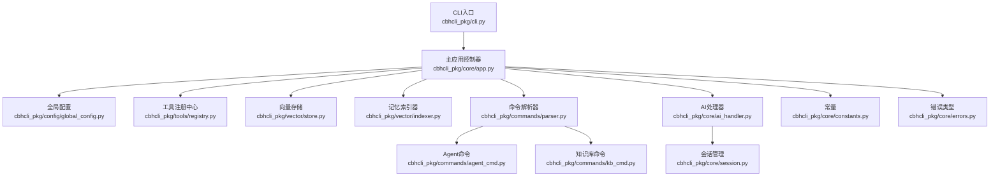
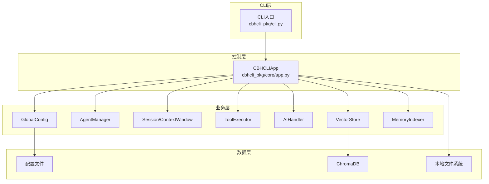
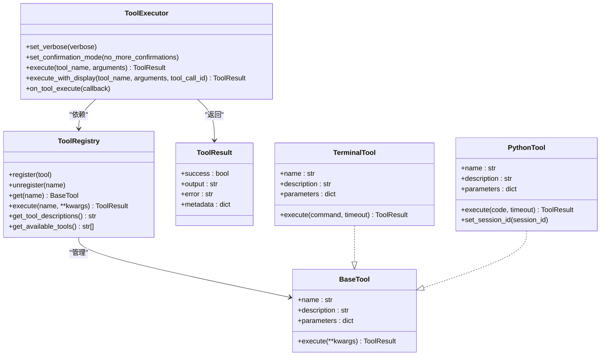
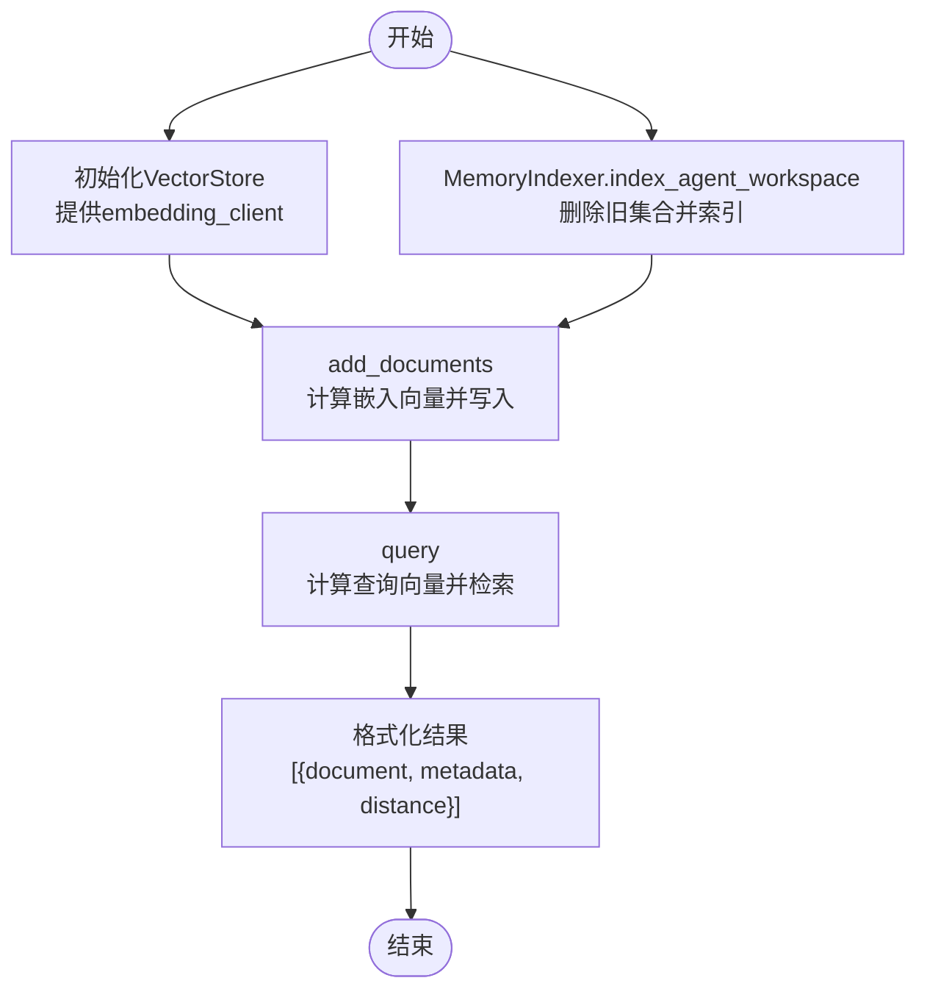
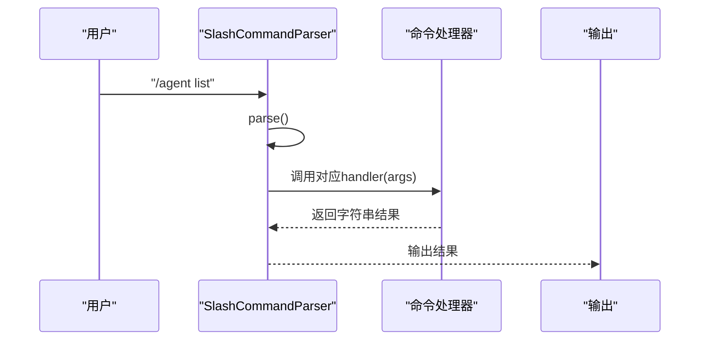
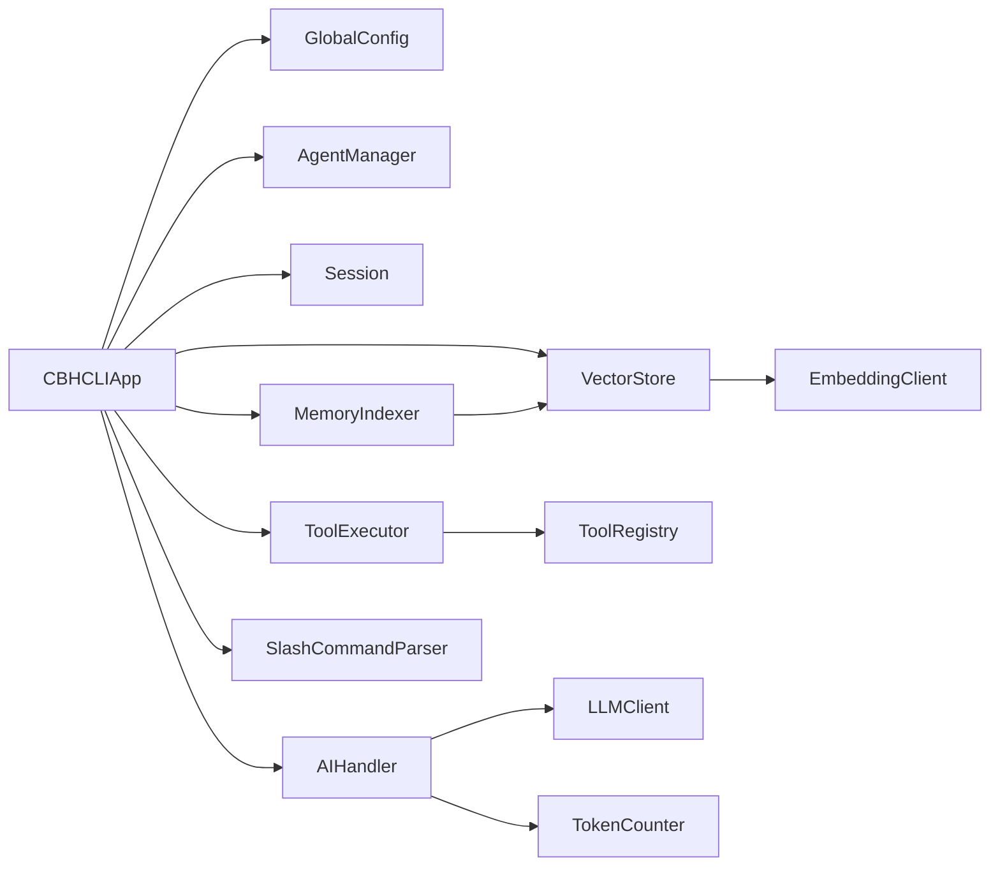

# API参考

<cite>
**本文引用的文件**
- [cbhcli_pkg/__init__.py](file://cbhcli_pkg/__init__.py)
- [cbhcli_pkg/cli.py](file://cbhcli_pkg/cli.py)
- [cbhcli_pkg/core/app.py](file://cbhcli_pkg/core/app.py)
- [cbhcli_pkg/tools/registry.py](file://cbhcli_pkg/tools/registry.py)
- [cbhcli_pkg/tools/base.py](file://cbhcli_pkg/tools/base.py)
- [cbhcli_pkg/tools/terminal.py](file://cbhcli_pkg/tools/terminal.py)
- [cbhcli_pkg/tools/python_tool.py](file://cbhcli_pkg/tools/python_tool.py)
- [cbhcli_pkg/vector/store.py](file://cbhcli_pkg/vector/store.py)
- [cbhcli_pkg/vector/indexer.py](file://cbhcli_pkg/vector/indexer.py)
- [cbhcli_pkg/commands/parser.py](file://cbhcli_pkg/commands/parser.py)
- [cbhcli_pkg/commands/agent_cmd.py](file://cbhcli_pkg/commands/agent_cmd.py)
- [cbhcli_pkg/commands/kb_cmd.py](file://cbhcli_pkg/commands/kb_cmd.py)
- [cbhcli_pkg/core/ai_handler.py](file://cbhcli_pkg/core/ai_handler.py)
- [cbhcli_pkg/core/session.py](file://cbhcli_pkg/core/session.py)
- [cbhcli_pkg/config/global_config.py](file://cbhcli_pkg/config/global_config.py)
- [cbhcli_pkg/core/constants.py](file://cbhcli_pkg/core/constants.py)
- [cbhcli_pkg/core/errors.py](file://cbhcli_pkg/core/errors.py)
</cite>

## 目录
1. [简介](#简介)
2. [项目结构](#项目结构)
3. [核心组件](#核心组件)
4. [架构总览](#架构总览)
5. [详细组件分析](#详细组件分析)
6. [依赖分析](#依赖分析)
7. [性能考量](#性能考量)
8. [故障排查指南](#故障排查指南)
9. [结论](#结论)
10. [附录](#附录)

## 简介
本文件为CBHCLI v3.0的完整API参考，覆盖主应用控制器、工具开发API、向量数据库API、命令系统API以及相关数据结构与常量。文档面向开发者与高级用户，提供参数说明、返回值格式、异常处理、使用示例、安全与性能建议，并标注版本兼容性与变更要点。

## 项目结构
CBHCLI采用模块化设计，核心模块包括：
- CLI入口与帮助：负责命令行参数解析与启动引导
- 核心应用：主控制器，负责配置、Agent管理、会话、工具执行、向量数据库与命令系统初始化
- 工具系统：统一的工具注册与执行框架，支持工具参数校验与结果封装
- 向量数据库：ChromaDB封装，支持自定义嵌入模型API
- 命令系统：斜杠命令解析与路由，提供Agent、模型、会话、知识库、向量索引、MCP等命令
- 会话与上下文：消息结构、上下文窗口与压缩策略
- 配置与常量：全局配置、默认上下文限制、工具调用限制、颜色与提示常量
- 错误体系：统一的异常类型

图表来源
- [cbhcli_pkg/cli.py:73-112](file://cbhcli_pkg/cli.py#L73-L112)
- [cbhcli_pkg/core/app.py:54-230](file://cbhcli_pkg/core/app.py#L54-L230)
- [cbhcli_pkg/commands/parser.py:16-94](file://cbhcli_pkg/commands/parser.py#L16-L94)

章节来源
- [cbhcli_pkg/cli.py:1-112](file://cbhcli_pkg/cli.py#L1-L112)
- [cbhcli_pkg/core/app.py:1-478](file://cbhcli_pkg/core/app.py#L1-L478)

## 核心组件
本节概述主应用控制器CBHCLIApp及其关键公共方法与属性，以及工具系统、向量数据库、命令系统、会话与上下文、配置与常量、错误类型等。

- 主应用控制器（CBHCLIApp）
  - 职责：应用初始化、Agent管理、用户交互循环、命令路由、工具执行、向量数据库与索引器初始化
  - 关键属性：global_config、agent_manager、tool_registry、tool_executor、vector_store、memory_indexer、embedding_client、rerank_client、session、context_window、llm_client、context_compressor、session_history、mcp_manager、current_agent_name、current_agent_config、current_persona、subagent_scheduler、token_counter、prompt_session、prompt_bindings、prompt_style、tool_verbose
  - 关键方法：run、_handle_ai_request、_load_agent、_reset_session、_compress_context、_check_and_compress_context、_get_input、_print_user_input、_show_welcome、_init_config、_init_tools、_init_vector_store、_init_commands、_init_ui、_init_agent

- 工具系统
  - BaseTool：抽象工具基类，定义name、description、parameters与execute
  - ToolRegistry：工具注册中心，提供register、unregister、get、execute、get_tool_descriptions、get_available_tools
  - ToolResult：工具执行结果封装，包含success、output、error、metadata
  - 已注册工具：TerminalTool、PythonTool、ReadTool、WriteTool、EditTool、MemorySearchTool、KnowledgeBaseTool

- 向量数据库
  - VectorStore：ChromaDB封装，支持自定义嵌入模型API；提供get_or_create_collection、add_documents、query、delete_collection、count
  - MemoryIndexer：将Agent工作空间文件索引到向量数据库，支持批量索引、更新索引、添加单条记忆

- 命令系统
  - SlashCommandParser：斜杠命令解析器，提供register、parse、execute、get_help_text、get_command
  - SlashCommand：命令定义数据类，包含name、description、usage、handler、requires_agent
  - 已注册命令：Agent命令、会话命令、模型命令、知识库命令、向量索引命令、MCP命令

- 会话与上下文
  - Message：消息数据结构，支持to_dict转换为API消息格式
  - Session：会话管理，提供add_message、get_context_messages、get_total_tokens、reset、remove_messages_from、replace_messages
  - ContextWindow：上下文窗口管理，提供update、usage_percentage、is_near_limit、needs_compression、trigger_threshold、remaining_tokens、get_status_text

- 配置与常量
  - GlobalConfig：全局配置管理，提供模型、Agent、设置、嵌入模型、重排序模型的增删改查与持久化
  - 常量：上下文限制、工具调用限制、API配置、ANSI颜色代码

- 错误类型
  - CBHCLIError、ModelNotConfiguredError、ToolExecutionError、ContextLimitExceededError、AgentNotFoundError、SessionError

章节来源
- [cbhcli_pkg/core/app.py:54-478](file://cbhcli_pkg/core/app.py#L54-L478)
- [cbhcli_pkg/tools/registry.py:16-115](file://cbhcli_pkg/tools/registry.py#L16-L115)
- [cbhcli_pkg/vector/store.py:37-175](file://cbhcli_pkg/vector/store.py#L37-L175)
- [cbhcli_pkg/vector/indexer.py:7-178](file://cbhcli_pkg/vector/indexer.py#L7-L178)
- [cbhcli_pkg/commands/parser.py:16-94](file://cbhcli_pkg/commands/parser.py#L16-L94)
- [cbhcli_pkg/core/session.py:8-190](file://cbhcli_pkg/core/session.py#L8-L190)
- [cbhcli_pkg/config/global_config.py:13-154](file://cbhcli_pkg/config/global_config.py#L13-L154)
- [cbhcli_pkg/core/constants.py:1-50](file://cbhcli_pkg/core/constants.py#L1-L50)
- [cbhcli_pkg/core/errors.py:4-32](file://cbhcli_pkg/core/errors.py#L4-L32)

## 架构总览
CBHCLI采用“主应用控制器”为中心的分层架构：
- CLI层：解析参数并启动主应用
- 控制层：CBHCLIApp负责初始化与调度
- 业务层：Agent管理、会话与上下文、工具执行、向量检索
- 数据层：ChromaDB向量存储、本地文件与配置

图表来源
- [cbhcli_pkg/cli.py:73-112](file://cbhcli_pkg/cli.py#L73-L112)
- [cbhcli_pkg/core/app.py:54-230](file://cbhcli_pkg/core/app.py#L54-L230)

## 详细组件分析

### 主应用控制器 CBHCLIApp
- 公共属性
  - global_config: 全局配置对象
  - agent_manager: Agent管理器
  - tool_registry: 工具注册中心
  - tool_executor: 工具执行器
  - vector_store: 向量存储（可选）
  - memory_indexer: 记忆索引器（可选）
  - embedding_client: 嵌入模型客户端（可选）
  - rerank_client: 重排序客户端（可选）
  - session: 当前会话
  - context_window: 上下文窗口
  - llm_client: LLM客户端
  - context_compressor: 上下文压缩器
  - session_history: 会话历史管理器
  - mcp_manager: MCP管理器
  - current_agent_name: 当前Agent名称
  - current_agent_config: 当前Agent配置
  - current_persona: 当前Agent人格
  - subagent_scheduler: 子Agent调度器
  - token_counter: Token计数器
  - prompt_session: Prompt会话
  - prompt_bindings: 键盘绑定
  - prompt_style: UI样式
  - tool_verbose: 工具输出详细模式开关

- 公共方法
  - run(): 主运行循环，处理用户输入、命令与AI请求
  - _handle_ai_request(user_input): 委托AIHandler处理请求
  - _load_agent(agent_name, do_index=False): 加载指定Agent并初始化相关组件
  - _reset_session(save_current=True): 重置会话并构建系统提示
  - _compress_context(): 压缩上下文
  - _check_and_compress_context(): 自动检查并压缩上下文
  - _get_input(): 获取用户输入
  - _print_user_input(user_input): 打印用户输入
  - _show_welcome(): 显示欢迎信息
  - _init_config(): 初始化全局配置与Agent管理器
  - _init_tools(): 初始化工具注册中心与工具执行器
  - _init_vector_store(): 初始化向量存储与索引器（可选）
  - _init_commands(): 初始化命令解析器与注册命令
  - _init_ui(): 初始化UI组件（样式、键盘绑定、PromptSession）
  - _init_agent(): 初始化Agent并加载当前Agent

- 使用示例
  - 启动应用：通过CLI入口启动后，主应用初始化并进入交互循环
  - 切换Agent：使用命令系统中的/agent switch实现
  - 执行工具：AIHandler从会话中提取工具调用并交由ToolExecutor执行

- 异常处理
  - 运行时捕获KeyboardInterrupt与通用异常，输出友好提示并继续循环

章节来源
- [cbhcli_pkg/core/app.py:54-478](file://cbhcli_pkg/core/app.py#L54-L478)

### 工具开发API
- 工具基类与注册中心
  - BaseTool：抽象基类，要求实现name、description、parameters与execute
  - ToolRegistry：提供register、unregister、get、execute、get_tool_descriptions、get_available_tools
  - ToolResult：封装执行结果，包含success、output、error、metadata

- 工具执行器
  - ToolExecutor：负责工具调用前确认、执行、结果展示与回调
  - 关键方法：set_verbose、set_confirmation_mode、execute、execute_with_display、on_tool_execute
  - 行为：支持详细/简洁输出模式、确认执行、显示工具调用与结果、回调通知

- 已注册工具
  - TerminalTool：执行shell命令，参数为command，支持超时与错误详情
  - PythonTool：执行Python代码，支持会话变量记忆，参数为code

- 使用示例
  - 注册工具：ToolRegistry.register(自定义工具实例)
  - 执行工具：ToolExecutor.execute_with_display("terminal", {"command": "ls -la"})
  - 获取工具描述：ToolRegistry.get_tool_descriptions()

- 异常处理
  - 工具执行失败返回ToolResult(success=False, error=...)
  - ToolExecutor在用户取消时返回失败结果

图表来源
- [cbhcli_pkg/tools/registry.py:16-115](file://cbhcli_pkg/tools/registry.py#L16-L115)
- [cbhcli_pkg/tools/terminal.py:7-99](file://cbhcli_pkg/tools/terminal.py#L7-L99)
- [cbhcli_pkg/tools/python_tool.py:127-207](file://cbhcli_pkg/tools/python_tool.py#L127-L207)

章节来源
- [cbhcli_pkg/tools/registry.py:16-115](file://cbhcli_pkg/tools/registry.py#L16-L115)
- [cbhcli_pkg/tools/terminal.py:7-99](file://cbhcli_pkg/tools/terminal.py#L7-L99)
- [cbhcli_pkg/tools/python_tool.py:127-207](file://cbhcli_pkg/tools/python_tool.py#L127-L207)

### 向量数据库API
- VectorStore
  - 构造函数：接收persist_directory与embedding_client，必须提供自定义嵌入客户端
  - 方法：
    - get_or_create_collection(agent_name)：获取或创建集合
    - add_documents(agent_name, texts, ids, metadata=None)：添加文档
    - query(agent_name, query_text, top_k=5)：语义查询，返回[{document, metadata, distance}]
    - delete_collection(agent_name)：删除集合
    - count(agent_name)：统计文档数量
  - 异常：缺少embedding_client时抛出错误

- MemoryIndexer
  - 构造函数：接收VectorStore实例
  - 方法：
    - index_agent_workspace(agent_name, workspace_path)：索引Agent工作空间所有md文件与knowledge目录
    - index_memory_file(agent_name, memory_file)：索引memory.md（向后兼容）
    - add_memory(text, agent_name, metadata=None)：添加单条记忆
    - update_index(agent_name, memory_file)：删除旧索引并重新索引

- 使用示例
  - 初始化向量存储：VectorStore(persist_directory, embedding_client)
  - 添加文档：VectorStore.add_documents("agent1", ["段落1", "段落2"], ["id1", "id2"])
  - 查询：VectorStore.query("agent1", "查询内容", top_k=5)
  - 索引工作空间：MemoryIndexer.index_agent_workspace("agent1", Path("agent1/workspace"))

- 异常处理
  - ChromaDB未安装时抛出ImportError
  - 索引失败或查询失败时捕获并输出警告

图表来源
- [cbhcli_pkg/vector/store.py:37-175](file://cbhcli_pkg/vector/store.py#L37-L175)
- [cbhcli_pkg/vector/indexer.py:7-178](file://cbhcli_pkg/vector/indexer.py#L7-L178)

章节来源
- [cbhcli_pkg/vector/store.py:37-175](file://cbhcli_pkg/vector/store.py#L37-L175)
- [cbhcli_pkg/vector/indexer.py:7-178](file://cbhcli_pkg/vector/indexer.py#L7-L178)

### 命令系统API
- SlashCommandParser
  - 注册命令：register(SlashCommand)
  - 解析输入：parse(input_text) -> (command_name, args) 或 None
  - 执行命令：execute(input_text) -> (success: bool, output: str)
  - 获取帮助：get_help_text() -> str
  - 获取命令定义：get_command(name) -> SlashCommand

- SlashCommand
  - 字段：name、description、usage、handler(Callable)、requires_agent(bool)

- 已注册命令（示例）
  - Agent命令：/agent create|list|switch|delete
  - 知识库命令：/kb add|list|remove|reindex|status
  - 其他命令：/help、/reset、/new、/model、/embedding、/mcp等

- 使用示例
  - 注册help命令：parser.register(SlashCommand(name="help", handler=help_handler))
  - 执行命令：parser.execute("/agent list")

- 异常处理
  - 未知命令返回错误提示
  - 命令执行异常捕获并返回失败信息

图表来源
- [cbhcli_pkg/commands/parser.py:16-94](file://cbhcli_pkg/commands/parser.py#L16-L94)
- [cbhcli_pkg/commands/agent_cmd.py:5-181](file://cbhcli_pkg/commands/agent_cmd.py#L5-L181)
- [cbhcli_pkg/commands/kb_cmd.py:5-186](file://cbhcli_pkg/commands/kb_cmd.py#L5-L186)

章节来源
- [cbhcli_pkg/commands/parser.py:16-94](file://cbhcli_pkg/commands/parser.py#L16-L94)
- [cbhcli_pkg/commands/agent_cmd.py:5-181](file://cbhcli_pkg/commands/agent_cmd.py#L5-L181)
- [cbhcli_pkg/commands/kb_cmd.py:5-186](file://cbhcli_pkg/commands/kb_cmd.py#L5-L186)

### 会话与上下文API
- Message
  - 字段：role、content、token_count、timestamp、metadata、tool_call_id、tool_calls
  - 方法：to_dict() -> 转换为API消息格式（assistant携带tool_calls，tool携带tool_call_id）

- Session
  - 字段：id、agent_name、messages、tool_call_count、created_at、is_active
  - 方法：
    - add_message(role, content, token_count, metadata, tool_call_id, tool_calls) -> Message
    - get_context_messages() -> [{role, content}]
    - get_total_tokens() -> int
    - reset() -> 清空会话，保留system消息
    - remove_messages_from(index) -> 从指定索引删除消息
    - replace_messages(messages) -> 替换消息列表

- ContextWindow
  - 字段：model_limit、compression_ratio、current_usage
  - 方法：
    - update(token_count)
    - usage_percentage() -> float
    - is_near_limit() -> bool
    - needs_compression() -> bool
    - trigger_threshold() -> int
    - remaining_tokens() -> int
    - get_status_text() -> str

- 使用示例
  - 添加消息：session.add_message("user", "你好")
  - 获取上下文：session.get_context_messages()
  - 更新上下文：context_window.update(session.get_total_tokens())

- 异常处理
  - 无特定异常，主要依赖外部组件（如Token计数器）的异常传播

章节来源
- [cbhcli_pkg/core/session.py:8-190](file://cbhcli_pkg/core/session.py#L8-L190)

### 配置与常量
- GlobalConfig
  - 模型管理：get_models、add_model、delete_model、get_model、get_last_selected_model、set_last_selected_model
  - Agent管理：get_active_agent、set_active_agent、get_default_agent
  - 设置：get_settings、update_setting
  - 嵌入模型：get_embedding_model、set_embedding_model、delete_embedding_model
  - 重排序模型：get_rerank_model、set_rerank_model、delete_rerank_model
  - 持久化：save()

- 常量
  - 上下文：DEFAULT_CONTEXT_LIMIT、DEFAULT_COMPRESSION_RATIO、MIN_MESSAGES_FOR_COMPRESSION
  - 工具调用：MAX_TOOL_ROUNDS、MAX_TOOL_OUTPUT_LENGTH、TOOL_PREVIEW_LENGTH、TOOL_OUTPUT_TRUNCATE_LENGTH
  - API：API_TIMEOUT、API_TEMPERATURE
  - ANSI颜色：C_RESET、C_DIM、C_USER_BG、C_USER_FG、C_AI_HINT、C_AI_TEXT、C_TOOL_GREEN、C_TOOL_DOT、C_TOOL_CMD、C_TOOL_RESULT、C_SEP、C_ERROR

- 使用示例
  - 设置嵌入模型：global_config.set_embedding_model({...})
  - 获取Agent：global_config.get_active_agent()

章节来源
- [cbhcli_pkg/config/global_config.py:13-154](file://cbhcli_pkg/config/global_config.py#L13-L154)
- [cbhcli_pkg/core/constants.py:1-50](file://cbhcli_pkg/core/constants.py#L1-L50)

### 错误类型
- CBHCLIError：基础异常
- ModelNotConfiguredError：模型未配置
- ToolExecutionError：工具执行错误
- ContextLimitExceededError：上下文超限
- AgentNotFoundError：Agent未找到
- SessionError：会话错误

- 使用示例
  - 抛出异常：raise ModelNotConfiguredError("未配置模型")
  - 捕获异常：try ... except ModelNotConfiguredError as e ...

章节来源
- [cbhcli_pkg/core/errors.py:4-32](file://cbhcli_pkg/core/errors.py#L4-L32)

## 依赖分析
- 组件耦合
  - CBHCLIApp依赖GlobalConfig、AgentManager、Session、ToolExecutor、AIHandler、VectorStore、MemoryIndexer、SlashCommandParser等
  - ToolExecutor依赖ToolRegistry
  - AIHandler依赖LLMClient、Session、ToolExecutor、TokenCounter
  - VectorStore依赖EmbeddingClient
  - MemoryIndexer依赖VectorStore

- 外部依赖
  - ChromaDB：向量存储客户端
  - prompt_toolkit：交互式命令行界面
  - argparse：命令行参数解析

图表来源
- [cbhcli_pkg/core/app.py:12-52](file://cbhcli_pkg/core/app.py#L12-L52)
- [cbhcli_pkg/core/ai_handler.py:31-49](file://cbhcli_pkg/core/ai_handler.py#L31-L49)
- [cbhcli_pkg/vector/store.py:40-62](file://cbhcli_pkg/vector/store.py#L40-L62)
- [cbhcli_pkg/vector/indexer.py:28-36](file://cbhcli_pkg/vector/indexer.py#L28-L36)

章节来源
- [cbhcli_pkg/core/app.py:12-52](file://cbhcli_pkg/core/app.py#L12-L52)
- [cbhcli_pkg/core/ai_handler.py:31-49](file://cbhcli_pkg/core/ai_handler.py#L31-L49)
- [cbhcli_pkg/vector/store.py:40-62](file://cbhcli_pkg/vector/store.py#L40-L62)
- [cbhcli_pkg/vector/indexer.py:28-36](file://cbhcli_pkg/vector/indexer.py#L28-L36)

## 性能考量
- 上下文管理
  - 默认上下文限制与压缩比例可通过常量调整
  - ContextWindow在接近阈值时触发压缩，减少Token使用
- 工具调用
  - 工具调用轮次上限与输出截断长度限制，避免长输出影响性能
- 向量检索
  - 预计算嵌入向量，避免ChromaDB调用默认模型
  - 查询返回top_k结果，合理设置k值平衡召回率与性能
- I/O与超时
  - 终端命令执行设置超时，防止长时间阻塞
  - Python工具执行捕获stdout/stderr，避免大输出阻塞

[本节为通用性能建议，无需具体文件分析]

## 故障排查指南
- 模型未配置
  - 现象：AI请求时报错或提示未配置模型
  - 排查：使用/ model命令配置模型，或在GlobalConfig中设置
  - 相关异常：ModelNotConfiguredError

- 向量数据库初始化失败
  - 现象：提示向量存储初始化失败或ChromaDB未安装
  - 排查：安装chromadb或配置嵌入模型；检查persist目录权限
  - 相关异常：ImportError、ValueError

- 工具执行失败
  - 现象：工具返回失败结果或异常
  - 排查：检查工具参数、权限、超时设置；查看ToolResult.error
  - 相关异常：ToolExecutionError

- 上下文超限
  - 现象：自动压缩失败或提示上下文接近上限
  - 排查：检查上下文窗口配置、压缩策略；减少会话长度
  - 相关异常：ContextLimitExceededError

- Agent相关问题
  - 现象：Agent不存在或无法删除
  - 排查：使用/agent list查看Agent；确认不是当前激活Agent
  - 相关异常：AgentNotFoundError

章节来源
- [cbhcli_pkg/core/errors.py:4-32](file://cbhcli_pkg/core/errors.py#L4-L32)
- [cbhcli_pkg/vector/store.py:74-77](file://cbhcli_pkg/vector/store.py#L74-L77)
- [cbhcli_pkg/core/app.py:108-118](file://cbhcli_pkg/core/app.py#L108-L118)

## 结论
CBHCLI提供了清晰的模块化API，涵盖应用控制、工具开发、向量检索、命令系统与会话管理。通过统一的工具注册与执行框架、可插拔的嵌入模型与ChromaDB向量存储、完善的命令路由与Agent管理，开发者可以快速扩展能力并集成到现有工作流中。建议在生产环境中关注上下文限制、工具调用轮次与输出截断、向量索引的定期维护与超时控制。

[本节为总结性内容，无需具体文件分析]

## 附录

### 版本兼容性与变更历史
- 版本：v3.0.0
- 变更要点
  - 工具基类迁移至registry.py，base.py保留为空
  - 向量数据库封装支持自定义嵌入模型API
  - 命令系统完善Agent、知识库、向量索引、MCP管理命令
  - 会话与上下文管理增强，支持自动压缩与状态提示
  - CLI入口提供帮助信息与参数解析

章节来源
- [cbhcli_pkg/__init__.py:1-9](file://cbhcli_pkg/__init__.py#L1-L9)
- [cbhcli_pkg/tools/base.py:1-3](file://cbhcli_pkg/tools/base.py#L1-L3)
- [cbhcli_pkg/cli.py:7-71](file://cbhcli_pkg/cli.py#L7-L71)

### 安全考虑与访问控制
- 工具执行安全
  - TerminalTool执行shell命令需谨慎，建议限制在受信任环境
  - ToolExecutor支持确认模式，避免误执行
- 配置与文件
  - 配置文件位于用户主目录，注意文件权限
  - 向量数据库持久化目录位于用户主目录，注意备份与权限
- 异常与日志
  - 捕获并记录异常，避免敏感信息泄露
  - CLI入口对未知参数进行提示并退出

章节来源
- [cbhcli_pkg/tools/terminal.py:31-99](file://cbhcli_pkg/tools/terminal.py#L31-L99)
- [cbhcli_pkg/core/app.py:104-118](file://cbhcli_pkg/core/app.py#L104-L118)
- [cbhcli_pkg/cli.py:96-99](file://cbhcli_pkg/cli.py#L96-L99)

### 性能指标与使用限制
- 上下文限制
  - 默认上下文限制：DEFAULT_CONTEXT_LIMIT
  - 压缩触发比例：DEFAULT_COMPRESSION_RATIO
- 工具调用
  - 最大工具调用轮次：MAX_TOOL_ROUNDS
  - 工具输出截断长度：MAX_TOOL_OUTPUT_LENGTH
- API配置
  - API超时：API_TIMEOUT
  - API温度：API_TEMPERATURE

章节来源
- [cbhcli_pkg/core/constants.py:6-22](file://cbhcli_pkg/core/constants.py#L6-L22)

### 最佳实践与集成指导
- 工具开发
  - 实现BaseTool抽象方法，提供清晰的JSON Schema参数定义
  - 在ToolExecutor中启用详细输出模式以便调试
- 向量数据库
  - 配置嵌入模型后初始化VectorStore，定期reindex以保持索引新鲜度
  - 合理设置top_k与查询频率，平衡召回率与性能
- 命令系统
  - 使用SlashCommandParser注册命令，提供清晰的description与usage
  - 对需要Agent的操作设置requires_agent标志
- 会话与上下文
  - 启用自动压缩并在接近阈值时提示用户
  - 使用SessionHistoryManager保存会话历史

章节来源
- [cbhcli_pkg/tools/registry.py:16-49](file://cbhcli_pkg/tools/registry.py#L16-L49)
- [cbhcli_pkg/vector/store.py:37-98](file://cbhcli_pkg/vector/store.py#L37-L98)
- [cbhcli_pkg/commands/parser.py:16-54](file://cbhcli_pkg/commands/parser.py#L16-L54)
- [cbhcli_pkg/core/session.py:127-190](file://cbhcli_pkg/core/session.py#L127-L190)