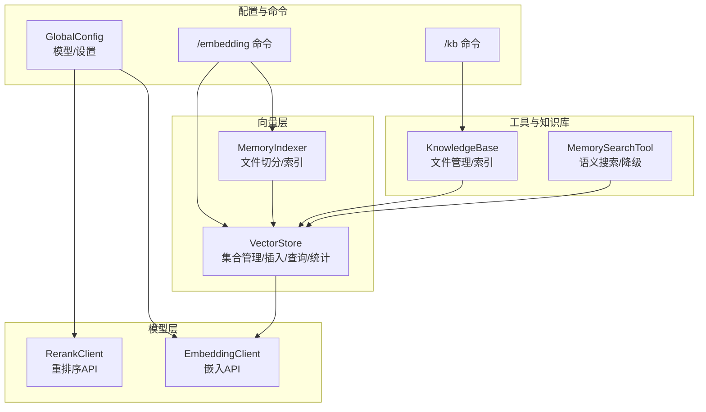
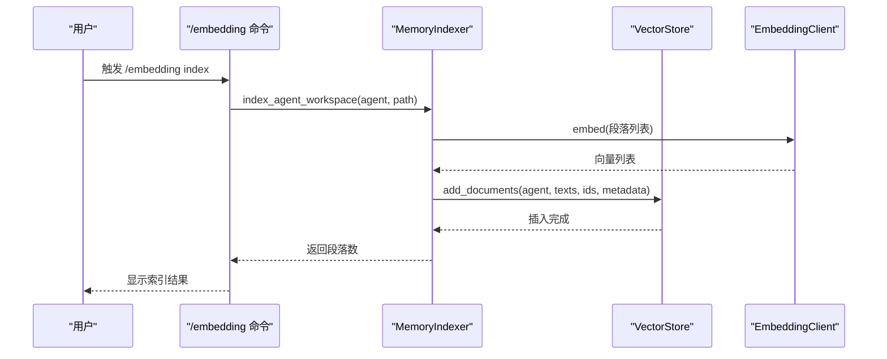
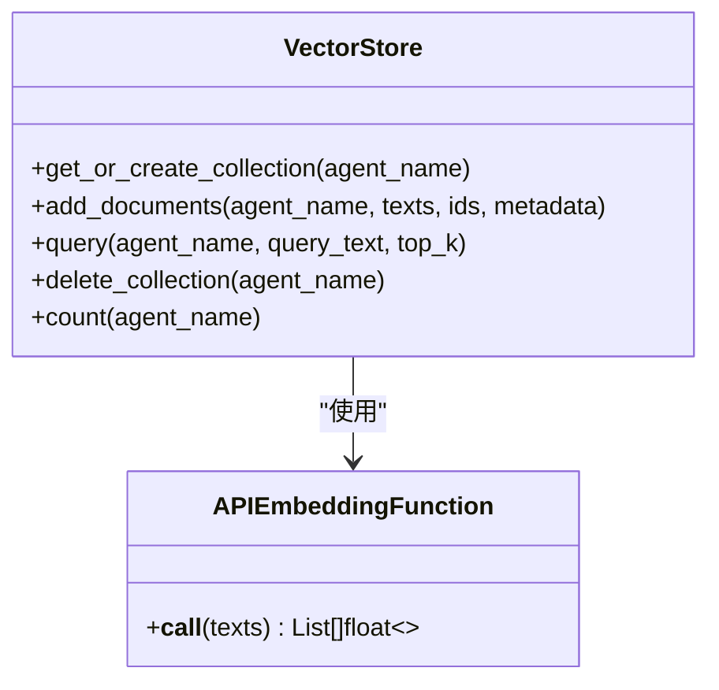
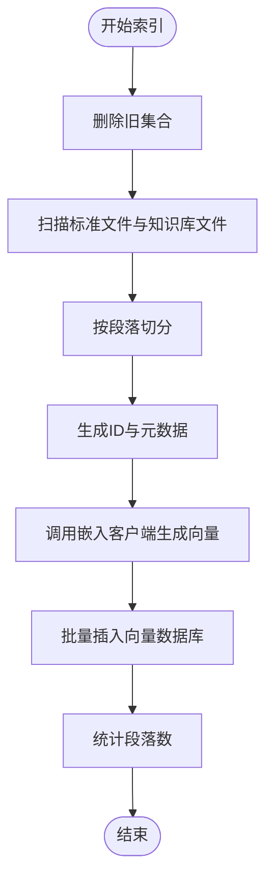
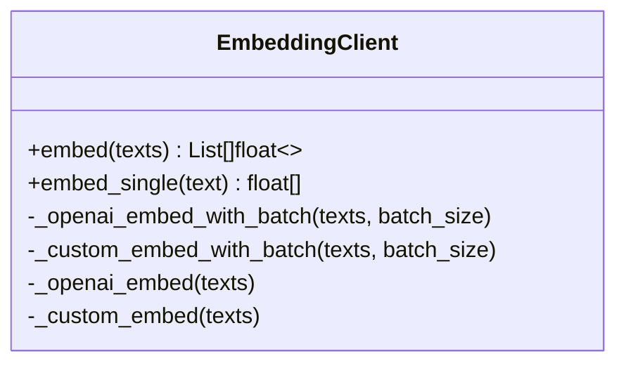
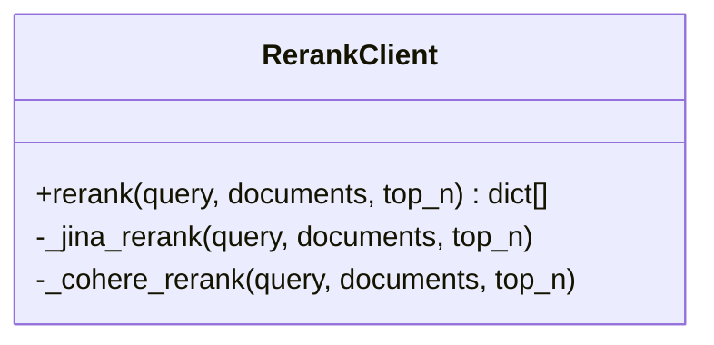
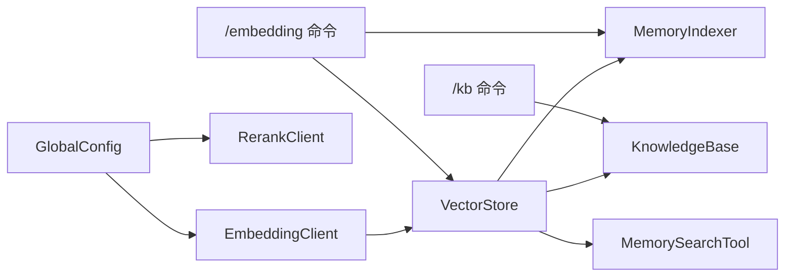

# 向量数据库API

<cite>
**本文引用的文件**
- [store.py](file://cbhcli_pkg/vector/store.py)
- [indexer.py](file://cbhcli_pkg/vector/indexer.py)
- [embedding_client.py](file://cbhcli_pkg/core/embedding_client.py)
- [rerank_client.py](file://cbhcli_pkg/core/rerank_client.py)
- [global_config.py](file://cbhcli_pkg/config/global_config.py)
- [embedding_cmd.py](file://cbhcli_pkg/commands/embedding_cmd.py)
- [kb_cmd.py](file://cbhcli_pkg/commands/kb_cmd.py)
- [knowledge_base.py](file://cbhcli_pkg/core/knowledge_base.py)
- [memory_search.py](file://cbhcli_pkg/tools/memory_search.py)
- [README.md](file://README.md)
</cite>

## 目录
1. [简介](#简介)
2. [项目结构](#项目结构)
3. [核心组件](#核心组件)
4. [架构总览](#架构总览)
5. [详细组件分析](#详细组件分析)
6. [依赖关系分析](#依赖关系分析)
7. [性能与调优](#性能与调优)
8. [查询示例与结果处理](#查询示例与结果处理)
9. [相似度与过滤机制](#相似度与过滤机制)
10. [故障排除与监控](#故障排除与监控)
11. [扩展与自定义](#扩展与自定义)
12. [结论](#结论)

## 简介
本文件面向CBHCLI的向量数据库子系统，聚焦以下能力：
- VectorStore向量存储接口：提供集合管理、文档插入、语义查询、删除集合与统计等能力。
- MemoryIndexer内存索引器：负责将Agent工作空间内的文档（含知识库）按段落切分、向量化并写入向量数据库。
- EmbeddingClient嵌入模型客户端：统一支持OpenAI兼容与自定义嵌入API，提供批量嵌入与单条嵌入能力。
- RerankClient重排序客户端：支持Jina/Cohere等重排序API，对候选文档进行相关性重排。
- 配置与连接：全局配置、嵌入与重排序模型配置、向量数据库持久化路径等。
- 使用示例、结果处理、相似度与过滤机制、故障排除与性能监控、扩展与自定义。

## 项目结构
向量数据库相关代码主要分布在以下模块：
- vector.store：向量存储封装（ChromaDB），提供集合管理、插入、查询、删除集合、统计等。
- vector.indexer：记忆索引器，负责将Agent工作空间文件切分为段落并索引到向量数据库。
- core.embedding_client：嵌入模型客户端，统一处理OpenAI兼容与自定义API。
- core.rerank_client：重排序客户端，统一处理Jina/Cohere等重排序API。
- config.global_config：全局配置管理，包含嵌入与重排序模型配置、设置项等。
- commands.embedding_cmd、commands.kb_cmd：斜杠命令入口，提供索引、状态、清理、重新索引等交互。
- core.knowledge_base：知识库管理，封装文件增删、列表、重新索引等。
- tools.memory_search：记忆搜索工具，封装向量检索与降级逻辑。

图表来源
- [store.py:37-175](file://cbhcli_pkg/vector/store.py#L37-L175)
- [indexer.py:7-178](file://cbhcli_pkg/vector/indexer.py#L7-L178)
- [embedding_client.py:6-132](file://cbhcli_pkg/core/embedding_client.py#L6-L132)
- [rerank_client.py:6-123](file://cbhcli_pkg/core/rerank_client.py#L6-L123)
- [global_config.py:13-154](file://cbhcli_pkg/config/global_config.py#L13-L154)
- [embedding_cmd.py:5-122](file://cbhcli_pkg/commands/embedding_cmd.py#L5-L122)
- [kb_cmd.py:5-186](file://cbhcli_pkg/commands/kb_cmd.py#L5-L186)
- [knowledge_base.py:7-207](file://cbhcli_pkg/core/knowledge_base.py#L7-L207)
- [memory_search.py:6-177](file://cbhcli_pkg/tools/memory_search.py#L6-L177)

章节来源
- [README.md:269-296](file://README.md#L269-L296)

## 核心组件
- VectorStore：ChromaDB封装，提供集合管理、文档批量插入、语义查询、删除集合、统计数量等。
- MemoryIndexer：将Agent工作空间内标准文件与知识库文件按段落切分，生成ID与元数据，调用VectorStore批量插入。
- EmbeddingClient：统一嵌入客户端，支持OpenAI兼容与自定义API，提供批量嵌入与单条嵌入。
- RerankClient：统一重排序客户端，支持Jina/Cohere等API，返回带相关性分数的结果。
- GlobalConfig：全局配置，管理嵌入/重排序模型配置、Agent设置、工作空间路径等。
- KnowledgeBase：知识库管理，封装文件增删、列表、重新索引等。
- MemorySearchTool：记忆搜索工具，封装向量检索与降级逻辑。
- 命令层：/embedding与/kb命令，提供索引、状态、清理、重新索引等交互。

章节来源
- [store.py:37-175](file://cbhcli_pkg/vector/store.py#L37-L175)
- [indexer.py:7-178](file://cbhcli_pkg/vector/indexer.py#L7-L178)
- [embedding_client.py:6-132](file://cbhcli_pkg/core/embedding_client.py#L6-L132)
- [rerank_client.py:6-123](file://cbhcli_pkg/core/rerank_client.py#L6-L123)
- [global_config.py:13-154](file://cbhcli_pkg/config/global_config.py#L13-L154)
- [knowledge_base.py:7-207](file://cbhcli_pkg/core/knowledge_base.py#L7-L207)
- [memory_search.py:6-177](file://cbhcli_pkg/tools/memory_search.py#L6-L177)
- [embedding_cmd.py:5-122](file://cbhcli_pkg/commands/embedding_cmd.py#L5-L122)
- [kb_cmd.py:5-186](file://cbhcli_pkg/commands/kb_cmd.py#L5-L186)

## 架构总览
向量数据库子系统围绕“索引—检索—重排序”闭环展开：
- 索引阶段：MemoryIndexer将文件切分为段落，调用EmbeddingClient生成向量，再由VectorStore批量写入ChromaDB集合。
- 检索阶段：MemorySearchTool调用VectorStore执行语义查询，返回文档、元数据与距离。
- 重排序阶段：可选地使用RerankClient对候选文档进行相关性重排，提升检索质量。
- 配置阶段：通过GlobalConfig管理嵌入/重排序模型配置与系统设置。

图表来源
- [embedding_cmd.py:42-70](file://cbhcli_pkg/commands/embedding_cmd.py#L42-L70)
- [indexer.py:37-69](file://cbhcli_pkg/vector/indexer.py#L37-L69)
- [store.py:99-126](file://cbhcli_pkg/vector/store.py#L99-L126)
- [embedding_client.py:34-47](file://cbhcli_pkg/core/embedding_client.py#L34-L47)

## 详细组件分析

### VectorStore 向量存储接口
- 职责
  - 管理ChromaDB持久化客户端与集合。
  - 提供集合创建/获取、文档批量插入、语义查询、删除集合、统计数量。
- 关键方法
  - get_or_create_collection(agent_name)：按Agent名称获取或创建集合，注入自定义嵌入函数。
  - add_documents(agent_name, texts, ids, metadata)：预计算嵌入向量后批量写入。
  - query(agent_name, query_text, top_k)：预计算查询向量，执行语义查询并格式化返回。
  - delete_collection(agent_name)：删除指定集合。
  - count(agent_name)：统计集合中文档数量。
- 设计要点
  - 使用自定义嵌入函数，避免ChromaDB调用默认模型。
  - 批量插入时预先计算嵌入，减少重复调用。
  - 查询时预先计算查询向量，保证一致性与性能。

图表来源
- [store.py:37-175](file://cbhcli_pkg/vector/store.py#L37-L175)

章节来源
- [store.py:37-175](file://cbhcli_pkg/vector/store.py#L37-L175)

### MemoryIndexer 内存索引器
- 职责
  - 索引Agent工作空间的标准文件与知识库目录。
  - 将文件按段落切分，生成ID与元数据，调用VectorStore批量插入。
- 关键方法
  - index_agent_workspace(agent_name, workspace_path)：删除旧集合，索引标准文件与知识库文件，返回段落数。
  - index_memory_file(agent_name, memory_file)：索引memory.md（向后兼容）。
  - _index_file(agent_name, file_path, file_type)：通用文件索引逻辑。
  - add_memory(text, agent_name, metadata)：添加单条记忆到向量数据库。
  - update_index(agent_name, memory_file)：删除旧集合并重新索引。
- 设计要点
  - 段落ID基于序号生成，便于后续更新。
  - 元数据包含agent_name、file_name、file_type、segment_index等字段。
  - 索引前先删除旧集合，确保内容更新后能正确索引。

图表来源
- [indexer.py:37-134](file://cbhcli_pkg/vector/indexer.py#L37-L134)
- [store.py:99-126](file://cbhcli_pkg/vector/store.py#L99-L126)
- [embedding_client.py:34-47](file://cbhcli_pkg/core/embedding_client.py#L34-L47)

章节来源
- [indexer.py:7-178](file://cbhcli_pkg/vector/indexer.py#L7-L178)

### EmbeddingClient 嵌入模型客户端
- 职责
  - 统一处理OpenAI兼容与自定义嵌入API。
  - 支持批量嵌入与单条嵌入。
- 关键方法
  - embed(texts)：根据模型类型选择OpenAI或自定义格式，分批处理并返回向量列表。
  - embed_single(text)：获取单个文本的向量。
  - _openai_embed_with_batch/_custom_embed_with_batch：分批处理逻辑。
  - _openai_embed/_custom_embed：单次请求实现。
- 设计要点
  - 通过配置决定模型类型（openai | custom）。
  - 默认使用OpenAI兼容格式，大多数API均支持。
  - 使用requests.Session保持连接与头部设置。

图表来源
- [embedding_client.py:6-132](file://cbhcli_pkg/core/embedding_client.py#L6-L132)

章节来源
- [embedding_client.py:6-132](file://cbhcli_pkg/core/embedding_client.py#L6-L132)

### RerankClient 重排序客户端
- 职责
  - 统一处理Jina与Cohere等重排序API。
  - 对候选文档进行相关性重排，返回带分数的结果。
- 关键方法
  - rerank(query, documents, top_n)：根据模型类型选择Jina或Cohere格式。
  - _jina_rerank/_cohere_rerank：分别对接不同API格式。
- 设计要点
  - 支持通过配置设置模型与top_n。
  - 统一返回格式：index、document、score。

图表来源
- [rerank_client.py:6-123](file://cbhcli_pkg/core/rerank_client.py#L6-L123)

章节来源
- [rerank_client.py:6-123](file://cbhcli_pkg/core/rerank_client.py#L6-L123)

### GlobalConfig 全局配置
- 职责
  - 管理全局配置文件，提供模型、嵌入/重排序模型配置、Agent设置等。
- 关键能力
  - get/set嵌入/重排序模型配置。
  - get/set设置项（如工作空间路径、是否使用ChromaDB内置嵌入等）。
- 设计要点
  - 配置文件位于~/.cbhcli/config.json。
  - 提供默认配置与持久化保存。

章节来源
- [global_config.py:13-154](file://cbhcli_pkg/config/global_config.py#L13-L154)

### KnowledgeBase 知识库管理
- 职责
  - 管理Agent知识库目录，提供文件增删、列表、重新索引等。
- 关键方法
  - add_file(file_path)：复制文件到知识库目录并索引。
  - remove_file(file_name)：删除文件（简化处理：重新索引整个知识库）。
  - list_files()：列出知识库文件。
  - reindex_all()：重新索引整个知识库。
  - _index_file(file_path)：内部文件索引逻辑。
- 设计要点
  - 支持常见文本格式（.md/.txt/.py/.js/.json/.yaml/.yml）。
  - 自动生成段落ID与元数据，调用VectorStore批量插入。

章节来源
- [knowledge_base.py:7-207](file://cbhcli_pkg/core/knowledge_base.py#L7-L207)

### MemorySearchTool 记忆搜索工具
- 职责
  - 封装向量检索与降级逻辑，支持语义搜索与memory.md关键词匹配。
- 关键方法
  - execute(query, top_k, agent_name)：执行语义搜索，格式化输出。
  - _fallback_search(query, top_k, agent_name)：降级到memory.md关键词匹配。
- 设计要点
  - 若向量数据库不可用，则回退到memory.md关键词匹配。
  - 输出包含查询与结果列表，便于AI工具使用。

章节来源
- [memory_search.py:6-177](file://cbhcli_pkg/tools/memory_search.py#L6-L177)

### 命令层：/embedding 与 /kb
- /embedding 命令
  - index/status/clear/reindex：手动触发索引、查看状态、清除索引、重新索引。
- /kb 命令
  - add/list/remove/reindex/status：知识库文件管理与状态查看。
- 设计要点
  - 与MemoryIndexer、VectorStore、KnowledgeBase协作。
  - 提供清晰的反馈信息与错误处理。

章节来源
- [embedding_cmd.py:5-122](file://cbhcli_pkg/commands/embedding_cmd.py#L5-L122)
- [kb_cmd.py:5-186](file://cbhcli_pkg/commands/kb_cmd.py#L5-L186)

## 依赖关系分析
- VectorStore依赖EmbeddingClient提供的嵌入向量。
- MemoryIndexer依赖VectorStore进行批量插入。
- KnowledgeBase依赖VectorStore与MemoryIndexer进行文件索引。
- MemorySearchTool依赖VectorStore进行语义查询，若不可用则降级到memory.md。
- 命令层与工具层通过应用实例与全局配置协调各组件。

图表来源
- [store.py:37-175](file://cbhcli_pkg/vector/store.py#L37-L175)
- [indexer.py:7-178](file://cbhcli_pkg/vector/indexer.py#L7-L178)
- [embedding_client.py:6-132](file://cbhcli_pkg/core/embedding_client.py#L6-L132)
- [rerank_client.py:6-123](file://cbhcli_pkg/core/rerank_client.py#L6-L123)
- [global_config.py:13-154](file://cbhcli_pkg/config/global_config.py#L13-L154)
- [embedding_cmd.py:5-122](file://cbhcli_pkg/commands/embedding_cmd.py#L5-L122)
- [kb_cmd.py:5-186](file://cbhcli_pkg/commands/kb_cmd.py#L5-L186)
- [knowledge_base.py:7-207](file://cbhcli_pkg/core/knowledge_base.py#L7-L207)
- [memory_search.py:6-177](file://cbhcli_pkg/tools/memory_search.py#L6-L177)

## 性能与调优
- 嵌入性能
  - 使用分批处理（默认每批10条），减少单次请求负载与超时风险。
  - 预先计算嵌入向量，避免ChromaDB调用默认模型。
- 查询性能
  - 查询前预先计算查询向量，保证一致性与减少重复计算。
  - 控制top_k以平衡召回与性能。
- 存储与索引
  - 索引前删除旧集合，确保内容更新后能正确索引。
  - 段落ID基于序号生成，便于更新场景。
- 网络与超时
  - 请求设置合理超时（默认30秒），避免长时间阻塞。
- 配置优化
  - 在GlobalConfig中调整工作空间路径、是否使用ChromaDB内置嵌入等设置。

章节来源
- [embedding_client.py:49-70](file://cbhcli_pkg/core/embedding_client.py#L49-L70)
- [store.py:118-126](file://cbhcli_pkg/vector/store.py#L118-L126)
- [indexer.py:48-69](file://cbhcli_pkg/vector/indexer.py#L48-L69)

## 查询示例与结果处理
- 示例流程
  - 配置嵌入模型：/model embedding add
  - 手动索引：/embedding index
  - 查询：MemorySearchTool.execute(query, top_k)
  - 结果：返回包含document、metadata、distance的列表；若无结果，返回提示信息。
- 结果处理
  - MemorySearchTool将结果格式化为“--- 结果 X ---”的文本块，便于AI工具使用。
  - 若向量数据库不可用，回退到memory.md关键词匹配，输出匹配度与段落内容。

章节来源
- [README.md:107-115](file://README.md#L107-L115)
- [memory_search.py:47-103](file://cbhcli_pkg/tools/memory_search.py#L47-L103)
- [store.py:128-160](file://cbhcli_pkg/vector/store.py#L128-L160)

## 相似度与过滤机制
- 相似度计算
  - 通过嵌入向量的余弦距离衡量相似度，VectorStore.query返回distance字段。
- 过滤机制
  - ChromaDB查询时可结合元数据过滤（metadata字段包含agent_name、file_name、file_type、segment_index等），可在上层业务中根据这些字段进行二次过滤。
- 重排序
  - 可选使用RerankClient对候选文档进行相关性重排，进一步提升检索质量。

章节来源
- [store.py:145-160](file://cbhcli_pkg/vector/store.py#L145-L160)
- [indexer.py:121-129](file://cbhcli_pkg/vector/indexer.py#L121-L129)
- [rerank_client.py:35-60](file://cbhcli_pkg/core/rerank_client.py#L35-L60)

## 故障排除与监控
- 常见问题
  - 未配置嵌入模型：VectorStore初始化时会抛出错误，需先配置嵌入模型。
  - ChromaDB未安装：初始化客户端时会抛出导入错误，需安装chromadb。
  - 索引失败：检查Agent工作空间是否存在、文件权限与编码。
  - 查询失败：检查网络连通性、API密钥与URL配置。
- 监控建议
  - 使用/embedding status查看索引状态与向量数量。
  - 使用/kb status查看知识库状态与向量文档数。
  - 记录嵌入与重排序API的响应状态码与耗时，定位性能瓶颈。
- 降级策略
  - MemorySearchTool在向量数据库不可用时，自动回退到memory.md关键词匹配。

章节来源
- [store.py:48-53](file://cbhcli_pkg/vector/store.py#L48-L53)
- [store.py:74-77](file://cbhcli_pkg/vector/store.py#L74-L77)
- [embedding_cmd.py:44-69](file://cbhcli_pkg/commands/embedding_cmd.py#L44-L69)
- [kb_cmd.py:147-186](file://cbhcli_pkg/commands/kb_cmd.py#L147-L186)
- [memory_search.py:71-103](file://cbhcli_pkg/tools/memory_search.py#L71-L103)

## 扩展与自定义
- 自定义嵌入模型
  - 在EmbeddingClient中可扩展自定义API格式（_custom_embed/_custom_embed_with_batch），满足不同服务端点。
- 自定义重排序模型
  - 在RerankClient中可新增API格式（_xxx_rerank），统一返回格式为index/document/score。
- 自定义索引策略
  - 在MemoryIndexer中可调整文件类型支持、段落切分规则、ID生成策略与元数据字段。
- 配置扩展
  - 在GlobalConfig中新增设置项，如缓存策略、批处理大小、超时阈值等。
- 与工具集成
  - 在MemorySearchTool中可扩展更多降级策略或结果后处理逻辑。

章节来源
- [embedding_client.py:92-118](file://cbhcli_pkg/core/embedding_client.py#L92-L118)
- [rerank_client.py:92-122](file://cbhcli_pkg/core/rerank_client.py#L92-L122)
- [indexer.py:87-134](file://cbhcli_pkg/vector/indexer.py#L87-L134)
- [global_config.py:116-154](file://cbhcli_pkg/config/global_config.py#L116-L154)
- [memory_search.py:105-177](file://cbhcli_pkg/tools/memory_search.py#L105-L177)

## 结论
CBHCLI的向量数据库子系统通过VectorStore、MemoryIndexer、EmbeddingClient与RerankClient形成完整的“索引—检索—重排序”链路，配合GlobalConfig与命令层实现灵活的配置与交互。其设计强调：
- 明确的职责分离与高内聚低耦合；
- 可插拔的嵌入与重排序模型；
- 可扩展的索引策略与结果处理；
- 完善的错误处理与降级机制。