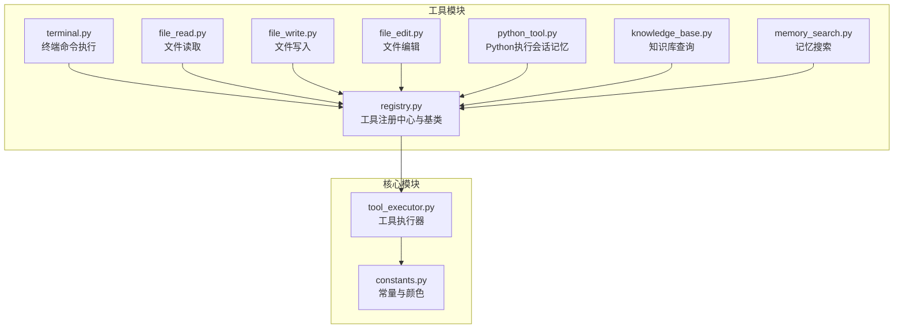
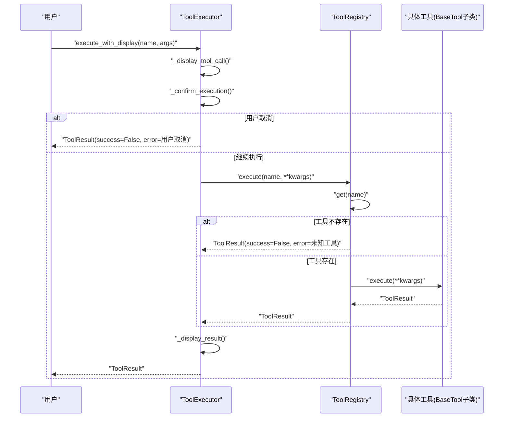
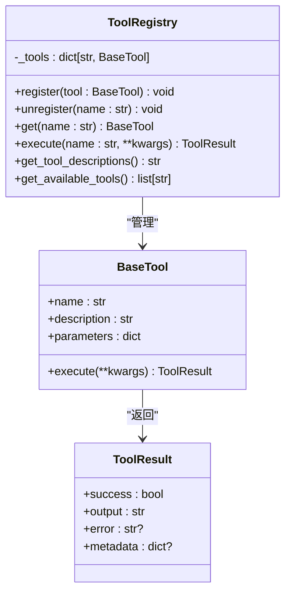
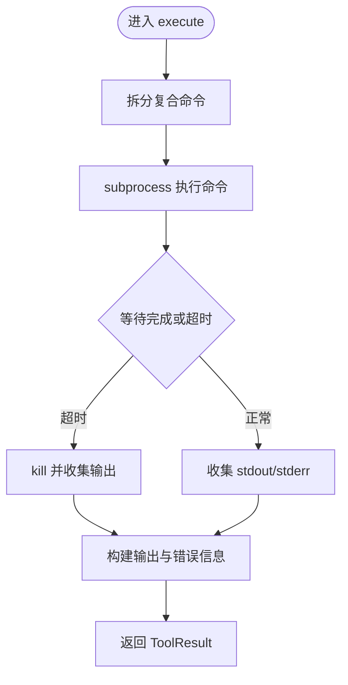
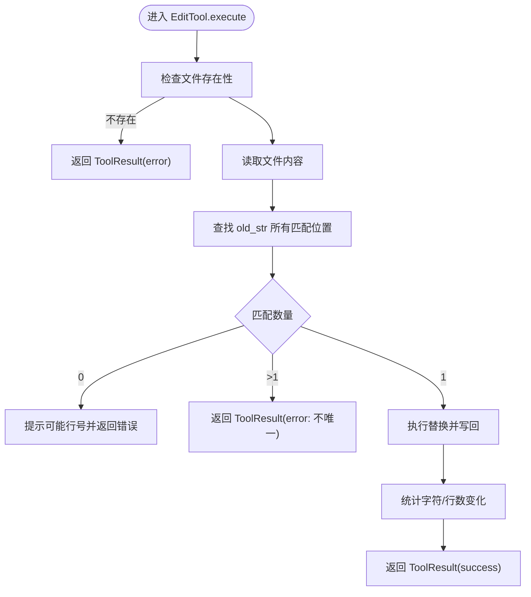
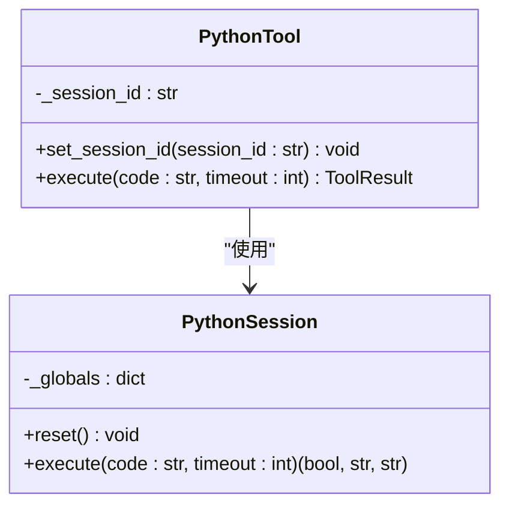
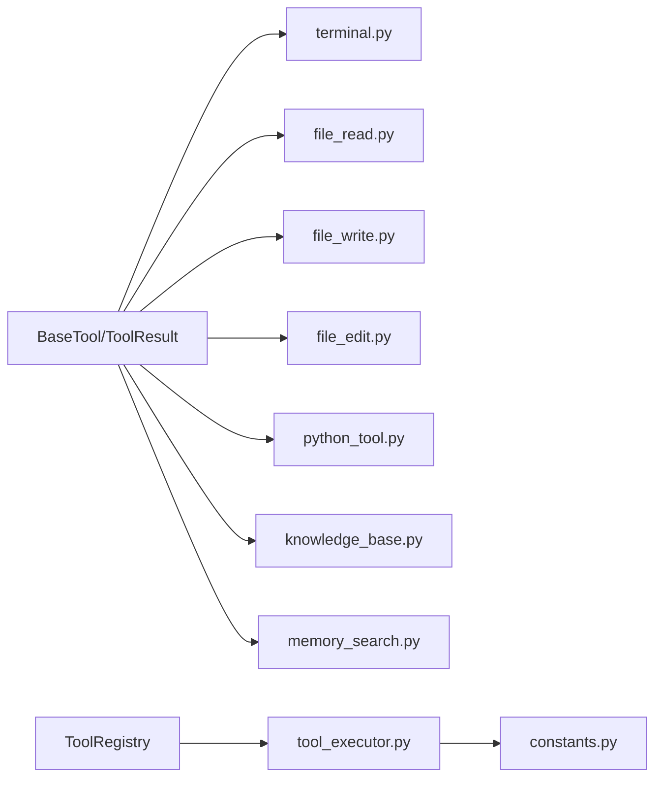

# 工具开发API

<cite>
**本文引用的文件**
- [cbhcli_pkg/tools/registry.py](file://cbhcli_pkg/tools/registry.py)
- [cbhcli_pkg/tools/base.py](file://cbhcli_pkg/tools/base.py)
- [cbhcli_pkg/tools/terminal.py](file://cbhcli_pkg/tools/terminal.py)
- [cbhcli_pkg/tools/file_read.py](file://cbhcli_pkg/tools/file_read.py)
- [cbhcli_pkg/tools/file_write.py](file://cbhcli_pkg/tools/file_write.py)
- [cbhcli_pkg/tools/file_edit.py](file://cbhcli_pkg/tools/file_edit.py)
- [cbhcli_pkg/tools/python_tool.py](file://cbhcli_pkg/tools/python_tool.py)
- [cbhcli_pkg/tools/knowledge_base.py](file://cbhcli_pkg/tools/knowledge_base.py)
- [cbhcli_pkg/tools/memory_search.py](file://cbhcli_pkg/tools/memory_search.py)
- [cbhcli_pkg/core/tool_executor.py](file://cbhcli_pkg/core/tool_executor.py)
- [cbhcli_pkg/core/constants.py](file://cbhcli_pkg/core/constants.py)
- [README.md](file://README.md)
</cite>

## 目录
1. [简介](#简介)
2. [项目结构](#项目结构)
3. [核心组件](#核心组件)
4. [架构总览](#架构总览)
5. [详细组件分析](#详细组件分析)
6. [依赖分析](#依赖分析)
7. [性能考量](#性能考量)
8. [故障排查指南](#故障排查指南)
9. [结论](#结论)
10. [附录](#附录)

## 简介
本指南面向希望基于CBHCLI工具体系进行二次开发的工程师与高级用户，系统阐述工具开发API的设计与实现，涵盖：
- Tool基类接口规范：抽象方法、参数Schema、返回值标准
- ToolRegistry工具注册中心：注册、发现、执行、描述生成与工具清单
- 7种内置工具的实现模式与最佳实践：TerminalTool、File工具系列、PythonTool、KnowledgeBaseTool、MemorySearchTool
- 自定义工具开发流程：从接口实现到注册与使用
- 参数验证、错误处理与安全注意事项
- 工具执行上下文、资源管理与性能优化
- 完整示例与测试方法指引

## 项目结构
CBHCLI采用“核心模块 + 工具模块”的分层组织方式，工具模块集中于cbhcli_pkg/tools，核心执行逻辑位于cbhcli_pkg/core。

图表来源
- [cbhcli_pkg/tools/registry.py:1-115](file://cbhcli_pkg/tools/registry.py#L1-L115)
- [cbhcli_pkg/tools/terminal.py:1-99](file://cbhcli_pkg/tools/terminal.py#L1-L99)
- [cbhcli_pkg/tools/file_read.py:1-125](file://cbhcli_pkg/tools/file_read.py#L1-L125)
- [cbhcli_pkg/tools/file_write.py:1-83](file://cbhcli_pkg/tools/file_write.py#L1-L83)
- [cbhcli_pkg/tools/file_edit.py:1-134](file://cbhcli_pkg/tools/file_edit.py#L1-L134)
- [cbhcli_pkg/tools/python_tool.py:1-207](file://cbhcli_pkg/tools/python_tool.py#L1-L207)
- [cbhcli_pkg/tools/knowledge_base.py:1-157](file://cbhcli_pkg/tools/knowledge_base.py#L1-L157)
- [cbhcli_pkg/tools/memory_search.py:1-177](file://cbhcli_pkg/tools/memory_search.py#L1-L177)
- [cbhcli_pkg/core/tool_executor.py:1-168](file://cbhcli_pkg/core/tool_executor.py#L1-L168)
- [cbhcli_pkg/core/constants.py:1-50](file://cbhcli_pkg/core/constants.py#L1-L50)

章节来源
- [README.md: 项目结构:269-295](file://README.md#L269-L295)

## 核心组件
本节聚焦工具开发的核心接口与注册中心，确保开发者遵循统一规范。

- ToolResult数据结构
  - 字段：success（布尔）、output（字符串）、error（可选字符串）、metadata（可选字典）
  - 用途：标准化工具执行结果，便于上层处理与展示

- BaseTool抽象基类
  - 属性
    - name：工具唯一标识（字符串）
    - description：工具描述（字符串，用于系统提示）
    - parameters：JSON Schema格式的参数定义（字典）
  - 方法
    - execute(**kwargs) -> ToolResult：执行工具，返回标准化结果

- ToolRegistry注册中心
  - register(tool: BaseTool)：注册工具
  - unregister(name: str)：注销工具
  - get(name: str) -> Optional[BaseTool]：按名称获取工具
  - execute(name: str, **kwargs) -> ToolResult：执行工具并捕获异常
  - get_tool_descriptions() -> str：生成工具描述列表（用于系统提示）
  - get_available_tools() -> list[str]：返回可用工具名称列表

章节来源
- [cbhcli_pkg/tools/registry.py: ToolResult与BaseTool:7-49](file://cbhcli_pkg/tools/registry.py#L7-L49)
- [cbhcli_pkg/tools/registry.py: ToolRegistry:51-115](file://cbhcli_pkg/tools/registry.py#L51-L115)

## 架构总览
工具调用链路由ToolExecutor负责执行与展示，最终委托给ToolRegistry完成工具解析与执行。

图表来源
- [cbhcli_pkg/core/tool_executor.py: execute_with_display:54-91](file://cbhcli_pkg/core/tool_executor.py#L54-L91)
- [cbhcli_pkg/core/tool_executor.py: execute:42-52](file://cbhcli_pkg/core/tool_executor.py#L42-L52)
- [cbhcli_pkg/tools/registry.py: execute:70-96](file://cbhcli_pkg/tools/registry.py#L70-L96)

章节来源
- [cbhcli_pkg/core/tool_executor.py: ToolExecutor:15-168](file://cbhcli_pkg/core/tool_executor.py#L15-L168)
- [cbhcli_pkg/core/constants.py: 输出长度与颜色常量:13-50](file://cbhcli_pkg/core/constants.py#L13-L50)

## 详细组件分析

### Tool基类接口规范
- 抽象属性
  - name：工具名称，全局唯一，用于注册与调用
  - description：工具用途与行为说明，用于系统提示
  - parameters：JSON Schema定义的参数结构，包含必填字段与类型约束
- 抽象方法
  - execute(**kwargs) -> ToolResult：实际执行逻辑，需严格返回ToolResult
- 返回值标准
  - 成功：success=True，output为可读的执行结果文本；metadata可选
  - 失败：success=False，error为错误信息；必要时在output中提供上下文

章节来源
- [cbhcli_pkg/tools/registry.py: BaseTool与ToolResult:16-49](file://cbhcli_pkg/tools/registry.py#L16-L49)

### ToolRegistry工具注册中心API
- 注册与注销
  - register：将工具实例按name存入字典
  - unregister：删除指定名称的工具
- 发现与执行
  - get：按名称获取工具实例
  - execute：解析工具、调用execute并捕获异常，统一返回ToolResult
- 描述与清单
  - get_tool_descriptions：拼接工具描述与参数Schema，便于系统提示
  - get_available_tools：返回可用工具名称列表

图表来源
- [cbhcli_pkg/tools/registry.py: BaseTool与ToolRegistry:16-115](file://cbhcli_pkg/tools/registry.py#L16-L115)

章节来源
- [cbhcli_pkg/tools/registry.py: ToolRegistry:51-115](file://cbhcli_pkg/tools/registry.py#L51-L115)

### 内置工具实现模式

#### TerminalTool（终端命令执行）
- 角色定位：执行任意shell命令，支持超时控制与输出合并
- 参数Schema
  - command（必需，字符串）：待执行的shell命令
  - timeout（可选，默认30秒）：超时时间
- 执行要点
  - 使用subprocess执行命令，分离stdout/stderr
  - 超时处理：TimeoutExpired时强制终止进程
  - 返回success依据returncode；失败时在error中包含退出码与输出摘要
- 安全与健壮性
  - 建议在部署侧限制可执行命令集合或沙箱化
  - 对异常进行捕获并返回ToolResult

图表来源
- [cbhcli_pkg/tools/terminal.py: execute:31-99](file://cbhcli_pkg/tools/terminal.py#L31-L99)

章节来源
- [cbhcli_pkg/tools/terminal.py: TerminalTool:7-99](file://cbhcli_pkg/tools/terminal.py#L7-L99)

#### File工具系列（Read/Write/Edit）
- ReadTool（文件读取）
  - 参数：file_path（必需）、start_line（可选）、end_line（可选）
  - 行号从1开始；支持~展开为家目录；UTF-8解码；输出带行号与统计
- WriteTool（文件写入）
  - 参数：file_path（必需）、content（必需）
  - 自动创建父目录；覆盖写入；输出统计信息
- EditTool（精确字符串替换）
  - 参数：file_path（必需）、old_str（必需）、new_str（必需）
  - 严格要求old_str唯一匹配；否则返回错误并提示可能行号
  - 替换后统计字符/行数变化

图表来源
- [cbhcli_pkg/tools/file_edit.py: execute:38-134](file://cbhcli_pkg/tools/file_edit.py#L38-L134)

章节来源
- [cbhcli_pkg/tools/file_read.py: ReadTool:6-125](file://cbhcli_pkg/tools/file_read.py#L6-L125)
- [cbhcli_pkg/tools/file_write.py: WriteTool:6-83](file://cbhcli_pkg/tools/file_write.py#L6-L83)
- [cbhcli_pkg/tools/file_edit.py: EditTool:6-134](file://cbhcli_pkg/tools/file_edit.py#L6-L134)

#### PythonTool（带会话记忆的Python执行）
- 角色定位：在会话内保持变量与导入模块状态，适合连续计算与数据探索
- 会话管理
  - PythonSession：维护全局命名空间，初始化常用模块
  - 会话存储：按session_id隔离状态
  - 提供reset/remove接口
- 参数Schema
  - code（必需，字符串）：待执行的Python代码
  - timeout（可选，默认30秒）：预留超时参数
- 执行要点
  - 捕获stdout/stderr，构建输出与错误
  - 返回ToolResult，success依据stderr是否存在

图表来源
- [cbhcli_pkg/tools/python_tool.py: PythonSession与PythonTool:8-207](file://cbhcli_pkg/tools/python_tool.py#L8-L207)

章节来源
- [cbhcli_pkg/tools/python_tool.py: PythonTool:127-207](file://cbhcli_pkg/tools/python_tool.py#L127-L207)

#### KnowledgeBaseTool（知识库查询）
- 角色定位：查询Agent专属知识库，支持可选重排序
- 参数Schema
  - query（必需，字符串）：查询文本
  - top_k（可选，默认5）：返回结果数量
  - agent_name（可选）：Agent名称；缺省时尝试从app.current_agent_name获取
- 执行要点
  - 校验vector_store与agent_name
  - 调用向量检索；若启用重排序客户端则二次排序
  - 格式化输出，包含来源、相关度与文档片段

章节来源
- [cbhcli_pkg/tools/knowledge_base.py: KnowledgeBaseTool:6-157](file://cbhcli_pkg/tools/knowledge_base.py#L6-L157)

#### MemorySearchTool（记忆搜索）
- 角色定位：语义搜索Agent的向量化知识内容（不含对话历史），支持降级方案
- 参数Schema
  - query（必需，字符串）：查询文本
  - top_k（可选，默认5）：返回结果数量
  - agent_name（可选）：Agent名称；缺省时尝试从app.current_agent_name获取
- 执行要点
  - 若无向量数据库：读取memory.md并进行关键词匹配，返回降级结果
  - 若有向量数据库：执行语义搜索并格式化输出

章节来源
- [cbhcli_pkg/tools/memory_search.py: MemorySearchTool:6-177](file://cbhcli_pkg/tools/memory_search.py#L6-L177)

### 自定义工具开发流程
- 步骤
  1) 实现BaseTool子类
     - 定义name、description、parameters（JSON Schema）
     - 实现execute(**kwargs) -> ToolResult
  2) 注册工具
     - 在应用初始化阶段创建工具实例并调用ToolRegistry.register
  3) 使用工具
     - 通过ToolExecutor.execute_with_display或ToolRegistry.execute调用
  4) 参数验证与错误处理
     - 在execute内部进行参数校验与异常捕获，返回ToolResult
  5) 安全与资源管理
     - 对外部命令、文件访问、网络请求进行权限与边界控制
     - 对长耗时操作设置超时与资源上限
- 最佳实践
  - 参数Schema尽量细化，明确必填项与类型
  - 输出结构化、可读性强，必要时提供元数据
  - 异常统一包装为ToolResult，避免泄露内部错误
  - 对I/O与外部进程进行超时与资源限制

章节来源
- [cbhcli_pkg/tools/registry.py: BaseTool与ToolRegistry:16-115](file://cbhcli_pkg/tools/registry.py#L16-L115)
- [cbhcli_pkg/core/tool_executor.py: execute_with_display:54-91](file://cbhcli_pkg/core/tool_executor.py#L54-L91)

## 依赖分析
- 工具模块依赖
  - 所有工具均依赖BaseTool与ToolResult
  - File工具依赖pathlib.Path进行路径解析与I/O
  - TerminalTool依赖subprocess进行命令执行
  - KnowledgeBaseTool/MemorySearchTool依赖向量数据库接口（query/rerank）
  - PythonTool依赖会话存储与stdout/stderr捕获
- 核心模块依赖
  - ToolExecutor依赖ToolRegistry与常量（颜色、输出截断长度）

图表来源
- [cbhcli_pkg/tools/registry.py:16-115](file://cbhcli_pkg/tools/registry.py#L16-L115)
- [cbhcli_pkg/core/tool_executor.py:15-168](file://cbhcli_pkg/core/tool_executor.py#L15-L168)
- [cbhcli_pkg/core/constants.py:1-50](file://cbhcli_pkg/core/constants.py#L1-L50)

章节来源
- [cbhcli_pkg/tools/terminal.py:1-99](file://cbhcli_pkg/tools/terminal.py#L1-L99)
- [cbhcli_pkg/tools/file_read.py:1-125](file://cbhcli_pkg/tools/file_read.py#L1-L125)
- [cbhcli_pkg/tools/file_write.py:1-83](file://cbhcli_pkg/tools/file_write.py#L1-L83)
- [cbhcli_pkg/tools/file_edit.py:1-134](file://cbhcli_pkg/tools/file_edit.py#L1-L134)
- [cbhcli_pkg/tools/python_tool.py:1-207](file://cbhcli_pkg/tools/python_tool.py#L1-L207)
- [cbhcli_pkg/tools/knowledge_base.py:1-157](file://cbhcli_pkg/tools/knowledge_base.py#L1-L157)
- [cbhcli_pkg/tools/memory_search.py:1-177](file://cbhcli_pkg/tools/memory_search.py#L1-L177)

## 性能考量
- 输出截断与预览
  - ToolExecutor根据常量对输出进行截断与预览，避免大文本阻塞UI
- 工具执行限制
  - constants中定义最大工具轮次、输出长度与预览长度，防止资源滥用
- I/O与外部进程
  - File工具与TerminalTool应配合超时与大小限制，避免长时间阻塞
- 向量检索
  - KnowledgeBaseTool/MemorySearchTool在top_k与重排序上做权衡，合理设置返回数量

章节来源
- [cbhcli_pkg/core/constants.py: 常量定义:13-16](file://cbhcli_pkg/core/constants.py#L13-L16)
- [cbhcli_pkg/core/tool_executor.py: 截断与预览逻辑:142-159](file://cbhcli_pkg/core/tool_executor.py#L142-L159)

## 故障排查指南
- 工具未找到
  - 现象：ToolRegistry.execute返回“未知工具”
  - 排查：确认工具已注册；核对name是否一致
- 执行失败
  - 现象：ToolResult.success=False，error包含异常信息
  - 排查：检查参数Schema与必填项；查看工具内部异常捕获与返回
- 文件相关错误
  - 现象：文件不存在、非文件、编码错误
  - 排查：确认路径与权限；检查编码；使用Path.expanduser处理~
- 终端命令超时
  - 现象：返回超时错误
  - 排查：缩短命令或增加timeout；避免长时间阻塞命令
- Python会话状态异常
  - 现象：变量未保留或清理不彻底
  - 排查：使用reset/remove清理；确认session_id隔离

章节来源
- [cbhcli_pkg/tools/registry.py: execute异常处理:70-96](file://cbhcli_pkg/tools/registry.py#L70-L96)
- [cbhcli_pkg/tools/file_read.py: 异常分支:113-124](file://cbhcli_pkg/tools/file_read.py#L113-L124)
- [cbhcli_pkg/tools/file_write.py: 异常分支:77-82](file://cbhcli_pkg/tools/file_write.py#L77-L82)
- [cbhcli_pkg/tools/file_edit.py: 异常分支:128-133](file://cbhcli_pkg/tools/file_edit.py#L128-L133)
- [cbhcli_pkg/tools/terminal.py: 超时处理:57-66](file://cbhcli_pkg/tools/terminal.py#L57-L66)
- [cbhcli_pkg/tools/python_tool.py: 会话清理:115-125](file://cbhcli_pkg/tools/python_tool.py#L115-L125)

## 结论
CBHCLI工具体系通过统一的BaseTool接口与ToolRegistry实现了高内聚、低耦合的工具生态。开发者只需遵循接口规范与参数Schema，即可快速扩展工具能力。结合ToolExecutor的确认与展示机制、以及完善的错误处理与性能常量，能够稳定地支撑复杂场景下的工具调用与执行。

## 附录
- 代码示例与测试方法
  - 参考项目根目录README中的“开发”章节，使用测试脚本与构建流程进行验证
  - 建议针对每类工具编写单元测试：参数校验、边界条件、异常路径、输出格式
- 安全与合规
  - 对TerminalTool等高风险工具，建议在部署侧实施命令白名单与资源配额
  - 对文件工具，严格校验路径与权限，避免越权访问
  - 对PythonTool，限制会话生命周期与内存占用

章节来源
- [README.md: 开发与测试:297-314](file://README.md#L297-L314)