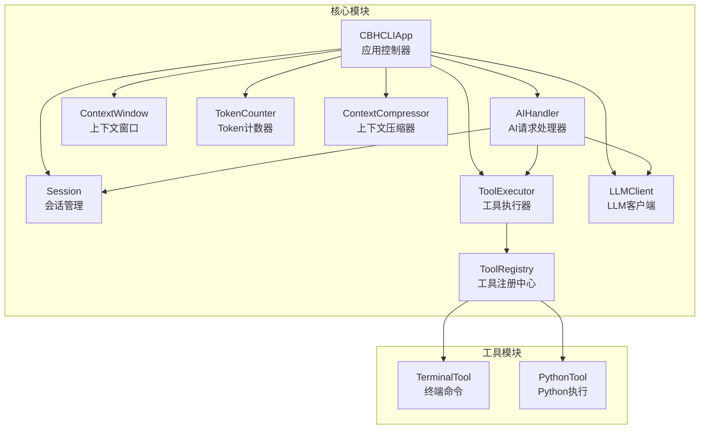
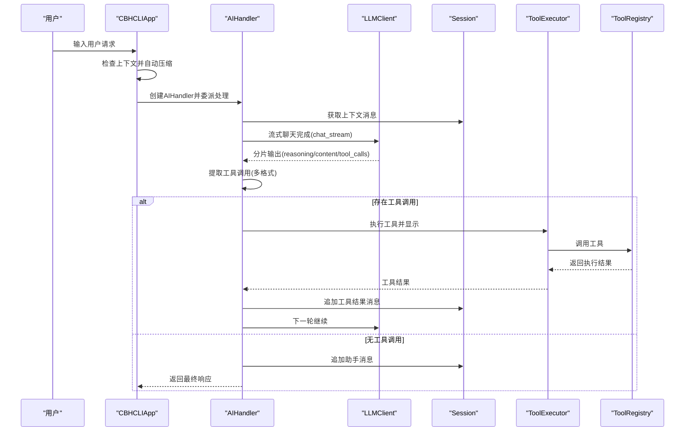
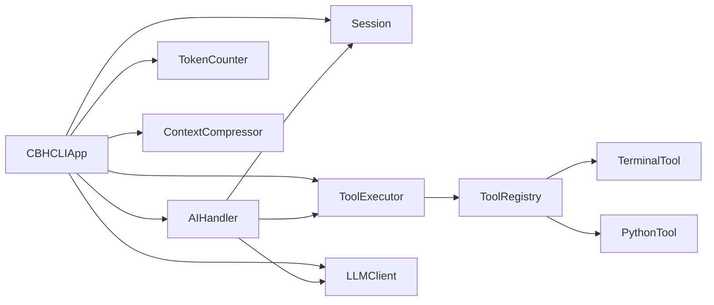

# 核心应用API

<cite>
**本文引用的文件**
- [app.py](file://cbhcli_pkg/core/app.py)
- [ai_handler.py](file://cbhcli_pkg/core/ai_handler.py)
- [session.py](file://cbhcli_pkg/core/session.py)
- [tool_executor.py](file://cbhcli_pkg/core/tool_executor.py)
- [registry.py](file://cbhcli_pkg/tools/registry.py)
- [model.py](file://cbhcli_pkg/core/model.py)
- [constants.py](file://cbhcli_pkg/core/constants.py)
- [token_counter.py](file://cbhcli_pkg/context/token_counter.py)
- [compressor.py](file://cbhcli_pkg/context/compressor.py)
- [terminal.py](file://cbhcli_pkg/tools/terminal.py)
- [python_tool.py](file://cbhcli_pkg/tools/python_tool.py)
- [cli.py](file://cbhcli_pkg/cli.py)
- [__init__.py](file://cbhcli_pkg/__init__.py)
- [README.md](file://README.md)
</cite>

## 目录
1. [简介](#简介)
2. [项目结构](#项目结构)
3. [核心组件](#核心组件)
4. [架构总览](#架构总览)
5. [详细组件分析](#详细组件分析)
6. [依赖分析](#依赖分析)
7. [性能考量](#性能考量)
8. [故障排查指南](#故障排查指南)
9. [结论](#结论)
10. [附录](#附录)

## 简介
本文件为CBHCLI核心应用API的权威文档，聚焦主应用控制器CBHCLIApp及其协作组件，系统阐述应用初始化、Agent管理、会话处理、AI请求处理与工具执行的完整生命周期与调用关系。文档同时详解AIHandler的AI请求处理接口（工具调用提取、响应生成、多轮协调与错误处理）、Session会话管理API（消息添加、上下文窗口与历史记录）、ToolExecutor工具执行器接口（工具注册、执行流程与结果处理），并提供参数说明、返回值格式、异常处理策略、使用示例与最佳实践。

## 项目结构
CBHCLI采用“核心模块 + 工具模块 + 配置与上下文”的分层设计。核心模块负责应用控制流与业务编排；工具模块提供具体能力；上下文模块负责Token计数与上下文压缩；命令模块提供CLI命令路由。

图表来源
- [app.py:54-478](file://cbhcli_pkg/core/app.py#L54-L478)
- [ai_handler.py:21-743](file://cbhcli_pkg/core/ai_handler.py#L21-L743)
- [session.py:37-190](file://cbhcli_pkg/core/session.py#L37-L190)
- [tool_executor.py:15-168](file://cbhcli_pkg/core/tool_executor.py#L15-L168)
- [registry.py:51-115](file://cbhcli_pkg/tools/registry.py#L51-L115)
- [model.py:7-147](file://cbhcli_pkg/core/model.py#L7-L147)
- [token_counter.py:14-88](file://cbhcli_pkg/context/token_counter.py#L14-L88)
- [compressor.py:7-112](file://cbhcli_pkg/context/compressor.py#L7-L112)

章节来源
- [README.md:269-295](file://README.md#L269-L295)
- [cli.py:73-112](file://cbhcli_pkg/cli.py#L73-L112)

## 核心组件
- CBHCLIApp：主应用控制器，负责应用初始化、Agent管理、命令路由、用户交互循环、会话与上下文管理、AI请求委派。
- AIHandler：AI请求处理核心，负责流式响应接收、工具调用提取、多轮工具调用协调、响应清理与最终消息落盘。
- Session/ContextWindow：会话与上下文窗口，负责消息结构化、上下文统计与压缩阈值判断。
- ToolExecutor/ToolRegistry：工具执行与注册中心，负责工具调用确认、执行、结果展示与回调。
- LLMClient：统一LLM API封装，支持非流式与流式聊天完成、嵌入向量获取。
- TokenCounter/ContextCompressor：Token估算与AI驱动的上下文压缩。
- CLI入口：命令行入口与帮助信息展示。

章节来源
- [app.py:54-478](file://cbhcli_pkg/core/app.py#L54-L478)
- [ai_handler.py:21-743](file://cbhcli_pkg/core/ai_handler.py#L21-L743)
- [session.py:37-190](file://cbhcli_pkg/core/session.py#L37-L190)
- [tool_executor.py:15-168](file://cbhcli_pkg/core/tool_executor.py#L15-L168)
- [registry.py:51-115](file://cbhcli_pkg/tools/registry.py#L51-L115)
- [model.py:7-147](file://cbhcli_pkg/core/model.py#L7-L147)
- [token_counter.py:14-88](file://cbhcli_pkg/context/token_counter.py#L14-L88)
- [compressor.py:7-112](file://cbhcli_pkg/context/compressor.py#L7-L112)
- [cli.py:73-112](file://cbhcli_pkg/cli.py#L73-L112)

## 架构总览
CBHCLIApp作为中枢，串联Agent配置、会话与上下文、LLM客户端、工具执行器与AIHandler。AIHandler在每轮请求中从Session获取上下文消息，通过LLMClient流式获取AI响应，解析工具调用并交由ToolExecutor执行，随后将工具结果回写Session，直至无工具调用为止。

图表来源
- [app.py:422-440](file://cbhcli_pkg/core/app.py#L422-L440)
- [ai_handler.py:51-96](file://cbhcli_pkg/core/ai_handler.py#L51-L96)
- [ai_handler.py:98-216](file://cbhcli_pkg/core/ai_handler.py#L98-L216)
- [ai_handler.py:664-735](file://cbhcli_pkg/core/ai_handler.py#L664-L735)
- [model.py:59-120](file://cbhcli_pkg/core/model.py#L59-L120)
- [session.py:83-90](file://cbhcli_pkg/core/session.py#L83-L90)

## 详细组件分析

### CBHCLIApp 主应用控制器
- 职责
  - 应用初始化：配置、工具、向量存储、命令、UI、Agent加载。
  - Agent管理：加载/切换Agent，初始化LLM、上下文压缩器、会话历史与MCP管理器。
  - 会话管理：重置会话、构建系统提示、上下文窗口初始化。
  - 用户交互：主循环、命令解析、AI请求委派。
- 关键方法与行为
  - 初始化阶段
    - _init_config：创建GlobalConfig、AgentManager、TokenCounter、SubAgentScheduler。
    - _init_tools：注册内置工具（终端、文件读写、编辑、Python），延迟初始化ToolExecutor。
    - _init_vector_store：按需初始化嵌入/重排序客户端与向量存储，注册memory_search/knowledge_base工具。
    - _init_commands：注册Slash命令与help。
    - _init_ui：初始化PromptSession、样式与快捷键（Ctrl+R切换工具显示模式）。
    - _init_agent：确保main Agent存在，加载当前Agent，初始化LLM、上下文压缩器、会话历史、MCP管理器。
  - Agent加载与会话重置
    - _load_agent：加载Agent配置与Persona，初始化LLM与上下文压缩器，索引工作空间（可选），重置会话。
    - _reset_session：保存当前会话到历史、清空Python会话、创建新Session、注入系统提示、初始化ContextWindow。
  - 上下文压缩
    - _compress_context/_check_and_compress_context：基于ContextWindow阈值自动压缩。
  - 请求处理
    - run：欢迎信息、主循环、命令与AI请求处理。
    - _handle_ai_request：创建AIHandler并委派处理，设置记忆更新回调。
  - 辅助
    - _load_memory_md：读取memory.md内容并清洗。
    - _get_input/_print_user_input：用户输入与高亮输出。
- 生命周期
  - 启动：构造CBHCLIApp → 初始化 → 进入run循环。
  - 请求：用户输入 → 命令解析 → 若为AI请求则委派AIHandler → 流式响应 → 工具调用 → 结果回写 → 保存会话历史。
  - 关闭：收到quit或KeyboardInterrupt优雅退出。

章节来源
- [app.py:64-478](file://cbhcli_pkg/core/app.py#L64-L478)

### AIHandler AI请求处理接口
- 职责
  - 接收用户输入，构建上下文消息，调用LLMClient流式获取响应。
  - 提取工具调用（支持多种格式），执行工具并将结果回写Session。
  - 多轮工具调用协调，响应清理，最终消息落盘。
- 关键方法与行为
  - process_request(user_input)
    - 添加用户消息 → 循环最多MAX_TOOL_ROUNDS轮 → 获取上下文 → 流式获取AI响应 → 提取工具调用 → 执行工具 → 添加工具结果 → 无工具调用则追加助手消息并返回。
  - _get_ai_response(messages, round_idx)
    - 流式消费reasoning/content/tool_calls，增量清理与显示，必要时注入格式提示以强化工具调用格式。
  - _extract_tool_calls(response)
    - 严格按优先级提取：DSML标签、Python函数调用、JSON格式（支持args/arguments）、纯文本命令（多轮后备）。
  - _execute_tools(tool_calls, ai_response)
    - 去重与校验 → 生成OpenAI格式tool_calls → 追加assistant消息 → 逐个执行工具并追加工具结果消息。
  - on_memory_update(callback)
    - 设置记忆更新回调（当前用于会话历史保存）。
- 参数与返回
  - process_request：输入user_input（字符串），返回最终AI响应（字符串）。
  - _get_ai_response：输入messages（列表）、round_idx（整数），返回ai_response（字符串）。
  - _extract_tool_calls：输入response（字符串），返回工具调用列表（字典数组）。
  - _execute_tools：输入tool_calls（列表）、ai_response（字符串），无返回或返回None。
- 异常处理
  - LLM流式异常捕获并抛出；工具调用失败时以ToolResult.error形式回显；AI未使用工具调用格式时给出提示。
- 使用示例（路径）
  - [CBHCLIApp._handle_ai_request:422-440](file://cbhcli_pkg/core/app.py#L422-L440)
  - [AIHandler.process_request:51-96](file://cbhcli_pkg/core/ai_handler.py#L51-L96)

章节来源
- [ai_handler.py:21-743](file://cbhcli_pkg/core/ai_handler.py#L21-L743)
- [constants.py:13-22](file://cbhcli_pkg/core/constants.py#L13-L22)

### Session 会话管理API
- 数据结构
  - Message：role（system/user/assistant/tool）、content、token_count、timestamp、metadata、tool_call_id、tool_calls。
  - Session：messages列表、tool_call_count、created_at、is_active；提供add_message、get_context_messages、get_total_tokens、reset、remove_messages_from、replace_messages。
  - ContextWindow：model_limit、compression_ratio、current_usage；提供update、usage_percentage、is_near_limit、needs_compression、trigger_threshold、remaining_tokens、get_status_text。
- 关键方法与行为
  - add_message：添加消息，支持tool_call_id与tool_calls字段。
  - get_context_messages：转换为API消息格式（assistant携带tool_calls，tool携带tool_call_id）。
  - get_total_tokens：统计会话总token数。
  - reset/remove_messages_from/replace_messages：会话重置、按索引裁剪、替换消息列表（用于上下文压缩）。
  - ContextWindow：阈值触发压缩、状态文本与剩余token计算。
- 使用示例（路径）
  - [Session.add_message:54-81](file://cbhcli_pkg/core/session.py#L54-L81)
  - [Session.get_context_messages:83-90](file://cbhcli_pkg/core/session.py#L83-L90)
  - [ContextWindow.update/needs_compression:142-168](file://cbhcli_pkg/core/session.py#L142-L168)

章节来源
- [session.py:8-190](file://cbhcli_pkg/core/session.py#L8-L190)

### ToolExecutor 工具执行器接口
- 职责
  - 工具调用前确认、执行、结果格式化与输出、回调通知。
- 关键方法与行为
  - set_verbose/set_confirmation_mode：设置详细输出与跳过确认模式。
  - execute：直接执行工具（返回ToolResult）。
  - execute_with_display：显示工具调用、确认、执行、显示结果、回调。
  - _display_tool_call/_get_tool_preview/_confirm_execution/_display_result：工具调用展示、参数预览、确认逻辑、结果展示。
  - on_tool_execute：设置工具执行回调（参数：tool_name、arguments、result、tool_call_id）。
- 参数与返回
  - execute_with_display：输入tool_name（字符串）、arguments（字典）、tool_call_id（可选），返回ToolResult。
- 异常处理
  - 用户取消执行返回ToolResult(success=False, error="用户取消了执行")；工具执行异常捕获并封装为ToolResult。
- 使用示例（路径）
  - [ToolExecutor.execute_with_display:54-91](file://cbhcli_pkg/core/tool_executor.py#L54-L91)

章节来源
- [tool_executor.py:15-168](file://cbhcli_pkg/core/tool_executor.py#L15-L168)
- [registry.py:7-115](file://cbhcli_pkg/tools/registry.py#L7-L115)

### LLMClient 统一LLM API封装
- 职责
  - 封装LLM API调用，支持非流式与流式聊天完成、嵌入向量获取。
- 关键方法与行为
  - chat：非流式聊天完成，返回AI响应文本。
  - chat_stream：流式聊天完成，迭代产出("reasoning","content","tool_calls")元组。
  - embeddings：批量获取文本embedding向量。
- 参数与返回
  - chat：输入messages（列表）、temperature（浮点）、kwargs，返回响应文本。
  - chat_stream：输入messages、temperature、kwargs，迭代产出类型与内容。
  - embeddings：输入texts（列表），返回向量列表。
- 异常处理
  - 非200状态码抛出异常；JSON解析失败跳过。
- 使用示例（路径）
  - [LLMClient.chat_stream:59-120](file://cbhcli_pkg/core/model.py#L59-L120)

章节来源
- [model.py:7-147](file://cbhcli_pkg/core/model.py#L7-L147)

### Token计数与上下文压缩
- TokenCounter
  - 支持tiktoken精确计数与降级估算；提供count_tokens、count_messages_tokens。
- ContextCompressor
  - 基于LLM生成对话摘要，保留早期与近期消息，压缩中间部分，替换会话消息列表。
- 使用示例（路径）
  - [TokenCounter.count_tokens:34-48](file://cbhcli_pkg/context/token_counter.py#L34-L48)
  - [ContextCompressor.compress:21-81](file://cbhcli_pkg/context/compressor.py#L21-L81)

章节来源
- [token_counter.py:14-88](file://cbhcli_pkg/context/token_counter.py#L14-L88)
- [compressor.py:7-112](file://cbhcli_pkg/context/compressor.py#L7-L112)

### 工具实现示例
- TerminalTool
  - 名称："terminal"，参数：command（必填），执行shell命令，支持超时与错误详情。
- PythonTool
  - 名称："python"，参数：code（必填），支持会话变量记忆，全局会话池管理。
- 使用示例（路径）
  - [TerminalTool.execute:31-99](file://cbhcli_pkg/tools/terminal.py#L31-L99)
  - [PythonTool.execute:170-207](file://cbhcli_pkg/tools/python_tool.py#L170-L207)

章节来源
- [terminal.py:7-99](file://cbhcli_pkg/tools/terminal.py#L7-L99)
- [python_tool.py:127-207](file://cbhcli_pkg/tools/python_tool.py#L127-L207)

## 依赖分析
- 组件耦合
  - CBHCLIApp依赖AgentManager、Session、LLMClient、ToolExecutor、AIHandler、MCPManager、GlobalConfig等。
  - AIHandler依赖LLMClient、Session、ToolExecutor、TokenCounter。
  - ToolExecutor依赖ToolRegistry；ToolRegistry依赖具体工具实现。
  - 上下文管理依赖TokenCounter与ContextCompressor。
- 外部依赖
  - requests（LLMClient）、subprocess（TerminalTool）、tiktoken（TokenCounter，可选）。
- 循环依赖
  - 未发现直接循环依赖；工具注册通过ToolRegistry集中管理，避免相互引用。

图表来源
- [app.py:12-44](file://cbhcli_pkg/core/app.py#L12-L44)
- [ai_handler.py:8-18](file://cbhcli_pkg/core/ai_handler.py#L8-L18)
- [tool_executor.py:6-12](file://cbhcli_pkg/core/tool_executor.py#L6-L12)
- [registry.py:16-48](file://cbhcli_pkg/tools/registry.py#L16-L48)

章节来源
- [app.py:12-44](file://cbhcli_pkg/core/app.py#L12-L44)
- [ai_handler.py:8-18](file://cbhcli_pkg/core/ai_handler.py#L8-L18)
- [tool_executor.py:6-12](file://cbhcli_pkg/core/tool_executor.py#L6-L12)
- [registry.py:16-48](file://cbhcli_pkg/tools/registry.py#L16-L48)

## 性能考量
- Token估算与上下文压缩
  - 使用TokenCounter估算消息token，结合ContextWindow阈值触发压缩，减少LLM调用成本。
  - ContextCompressor通过摘要保留关键信息，降低长对话上下文开销。
- 流式响应与增量渲染
  - LLMClient.chat_stream支持增量输出，AIHandler进行增量清理与显示，提升交互体验。
- 工具执行确认与超时
  - ToolExecutor支持确认模式与超时控制，避免危险命令长时间占用。
- 建议
  - 合理设置auto_compress与compression_ratio，平衡上下文长度与信息保留。
  - 对于长文本工具输出，合理截断以控制token使用。
  - 在具备tiktoken时启用精确计数，提升上下文管理精度。

[本节为通用指导，无需列出章节来源]

## 故障排查指南
- 模型未配置
  - 现象：会话无LLMClient，无法处理AI请求。
  - 处理：使用/ model add配置模型，/ model use切换模型。
- 嵌入/重排序模型初始化失败
  - 现象：向量存储初始化失败或提示配置嵌入模型。
  - 处理：检查配置项与网络连通性，使用/ model embedding add与/ model rerank配置。
- 工具执行失败
  - 现象：ToolResult.success=False，error包含详细信息。
  - 处理：检查工具参数、权限与超时设置；必要时关闭确认模式快速定位问题。
- 上下文接近上限
  - 现象：自动压缩提示与失败。
  - 处理：检查auto_compress配置；手动/ comp压缩；优化提示词与工具输出。
- 响应格式问题
  - 现象：AI未使用工具调用格式。
  - 处理：AIHandler在多轮中注入格式提示；确保模型支持工具调用格式。

章节来源
- [app.py:104-149](file://cbhcli_pkg/core/app.py#L104-L149)
- [app.py:361-384](file://cbhcli_pkg/core/app.py#L361-L384)
- [ai_handler.py:212-214](file://cbhcli_pkg/core/ai_handler.py#L212-L214)
- [tool_executor.py:122-140](file://cbhcli_pkg/core/tool_executor.py#L122-L140)

## 结论
CBHCLI通过清晰的职责划分与模块化设计，实现了从Agent管理、会话与上下文、AI请求处理到工具执行的完整闭环。AIHandler在多轮工具调用与响应清理方面提供了稳健的处理流程；ToolExecutor在安全与可观测性上做了充分考虑；Token计数与上下文压缩保障了长对话的性能与稳定性。遵循本文的最佳实践与故障排查建议，可获得高效、可靠的AI命令行助手体验。

[本节为总结性内容，无需列出章节来源]

## 附录
- 常量与默认值
  - 上下文限制与压缩比例：DEFAULT_CONTEXT_LIMIT、DEFAULT_COMPRESSION_RATIO。
  - 工具调用轮次与输出长度：MAX_TOOL_ROUNDS、MAX_TOOL_OUTPUT_LENGTH。
  - API温度与超时：API_TEMPERATURE、API_TIMEOUT。
- CLI入口与帮助
  - cbhcli --help展示命令与工具列表；cbhcli --version显示版本。

章节来源
- [constants.py:6-22](file://cbhcli_pkg/core/constants.py#L6-L22)
- [cli.py:7-112](file://cbhcli_pkg/cli.py#L7-L112)
- [__init__.py:6](file://cbhcli_pkg/__init__.py#L6)