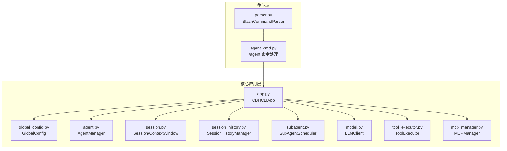
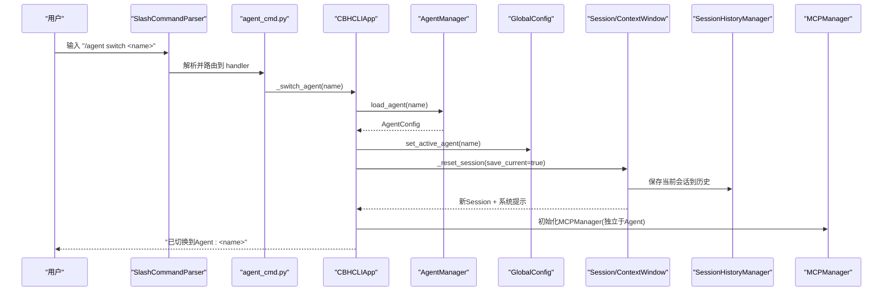
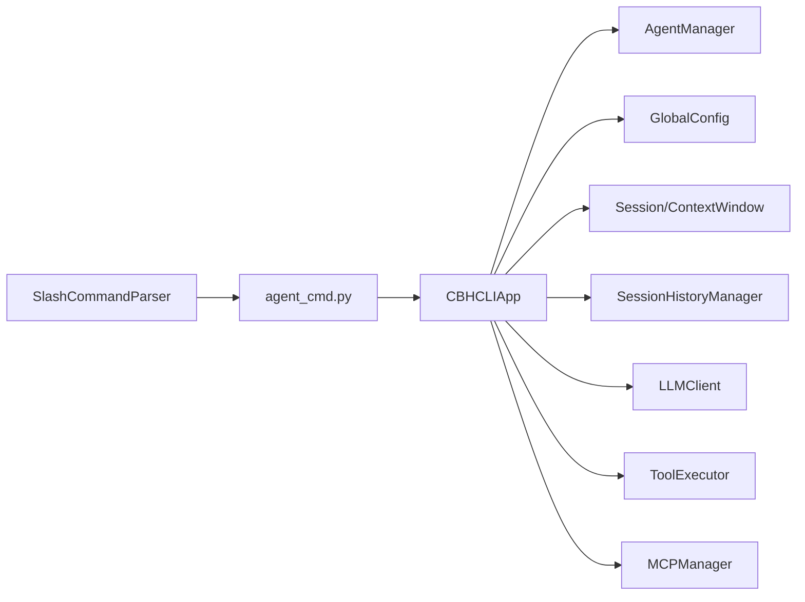

# Agent切换与协作

<cite>
**本文引用的文件**
- [agent_cmd.py](file://cbhcli_pkg/commands/agent_cmd.py)
- [app.py](file://cbhcli_pkg/core/app.py)
- [agent.py](file://cbhcli_pkg/core/agent.py)
- [global_config.py](file://cbhcli_pkg/config/global_config.py)
- [session.py](file://cbhcli_pkg/core/session.py)
- [session_history.py](file://cbhcli_pkg/core/session_history.py)
- [subagent.py](file://cbhcli_pkg/core/subagent.py)
- [parser.py](file://cbhcli_pkg/commands/parser.py)
- [model.py](file://cbhcli_pkg/core/model.py)
- [tool_executor.py](file://cbhcli_pkg/core/tool_executor.py)
- [mcp_manager.py](file://cbhcli_pkg/core/mcp_manager.py)
- [README.md](file://README.md)
</cite>

## 目录
1. [简介](#简介)
2. [项目结构](#项目结构)
3. [核心组件](#核心组件)
4. [架构总览](#架构总览)
5. [详细组件分析](#详细组件分析)
6. [依赖关系分析](#依赖关系分析)
7. [性能考量](#性能考量)
8. [故障排查指南](#故障排查指南)
9. [结论](#结论)
10. [附录](#附录)

## 简介
本指南聚焦于“Agent切换与协作”的完整操作流程与机制说明，围绕以下目标展开：
- 详解 /agent switch 命令的使用方法与内部切换机制
- 解释多Agent协作模式与切换流程
- 说明当前Agent状态管理与切换确认机制
- 讨论Agent切换对会话、模型、工具的影响
- 提供Agent列表查看与交互式菜单的使用方法
- 说明Agent切换的安全检查与限制条件
- 给出Agent切换的性能影响与优化建议
- 说明Agent切换的日志记录与审计功能
- 提供Agent协作的最佳实践与使用场景
- 解释Agent切换过程中的数据同步与一致性保障

## 项目结构
CBHCLI采用模块化设计，Agent相关能力主要分布在命令层、核心应用层、Agent管理与配置层、会话与上下文层、工具与MCP层等。下图展示与Agent切换直接相关的模块关系。

图表来源
- [agent_cmd.py:1-181](file://cbhcli_pkg/commands/agent_cmd.py#L1-L181)
- [app.py:54-478](file://cbhcli_pkg/core/app.py#L54-L478)
- [agent.py:572-762](file://cbhcli_pkg/core/agent.py#L572-L762)
- [global_config.py:13-154](file://cbhcli_pkg/config/global_config.py#L13-L154)
- [session.py:37-190](file://cbhcli_pkg/core/session.py#L37-L190)
- [session_history.py:8-136](file://cbhcli_pkg/core/session_history.py#L8-L136)
- [subagent.py:55-118](file://cbhcli_pkg/core/subagent.py#L55-L118)
- [parser.py:16-94](file://cbhcli_pkg/commands/parser.py#L16-L94)
- [model.py:7-147](file://cbhcli_pkg/core/model.py#L7-L147)
- [tool_executor.py:15-168](file://cbhcli_pkg/core/tool_executor.py#L15-L168)
- [mcp_manager.py:11-366](file://cbhcli_pkg/core/mcp_manager.py#L11-L366)

章节来源
- [agent_cmd.py:1-181](file://cbhcli_pkg/commands/agent_cmd.py#L1-L181)
- [app.py:54-478](file://cbhcli_pkg/core/app.py#L54-L478)
- [agent.py:572-762](file://cbhcli_pkg/core/agent.py#L572-L762)
- [global_config.py:13-154](file://cbhcli_pkg/config/global_config.py#L13-L154)
- [session.py:37-190](file://cbhcli_pkg/core/session.py#L37-L190)
- [session_history.py:8-136](file://cbhcli_pkg/core/session_history.py#L8-L136)
- [subagent.py:55-118](file://cbhcli_pkg/core/subagent.py#L55-L118)
- [parser.py:16-94](file://cbhcli_pkg/commands/parser.py#L16-L94)
- [model.py:7-147](file://cbhcli_pkg/core/model.py#L7-L147)
- [tool_executor.py:15-168](file://cbhcli_pkg/core/tool_executor.py#L15-L168)
- [mcp_manager.py:11-366](file://cbhcli_pkg/core/mcp_manager.py#L11-L366)

## 核心组件
- 命令处理与交互：/agent 命令解析、菜单交互、创建/删除Agent、切换Agent
- 应用主控：初始化Agent、加载当前Agent、重置会话、上下文压缩、运行循环
- Agent管理：Agent配置、工作空间、人格与工具描述、列表与删除
- 配置管理：全局Active Agent、模型、嵌入/重排序模型、设置
- 会话与上下文：Session、ContextWindow、历史管理、上下文压缩
- 工具与MCP：工具执行器、MCP连接与工具注册、每Agent独立管理
- 子Agent：临时子Agent创建、调度、结果等待与清理

章节来源
- [agent_cmd.py:5-47](file://cbhcli_pkg/commands/agent_cmd.py#L5-L47)
- [app.py:204-280](file://cbhcli_pkg/core/app.py#L204-L280)
- [agent.py:572-762](file://cbhcli_pkg/core/agent.py#L572-L762)
- [global_config.py:92-114](file://cbhcli_pkg/config/global_config.py#L92-L114)
- [session.py:37-190](file://cbhcli_pkg/core/session.py#L37-L190)
- [session_history.py:24-97](file://cbhcli_pkg/core/session_history.py#L24-L97)
- [tool_executor.py:15-168](file://cbhcli_pkg/core/tool_executor.py#L15-L168)
- [mcp_manager.py:11-366](file://cbhcli_pkg/core/mcp_manager.py#L11-L366)
- [subagent.py:55-118](file://cbhcli_pkg/core/subagent.py#L55-L118)

## 架构总览
Agent切换的核心流程如下：命令解析器识别 /agent switch；交互式菜单或直接参数定位目标Agent；应用层加载目标Agent配置、模型、会话与MCP；更新全局Active Agent并重置会话，确保上下文一致。

图表来源
- [parser.py:51-78](file://cbhcli_pkg/commands/parser.py#L51-L78)
- [agent_cmd.py:154-161](file://cbhcli_pkg/commands/agent_cmd.py#L154-L161)
- [app.py:231-279](file://cbhcli_pkg/core/app.py#L231-L279)
- [agent.py:626-646](file://cbhcli_pkg/core/agent.py#L626-L646)
- [global_config.py:97-100](file://cbhcli_pkg/config/global_config.py#L97-L100)
- [session.py:301-330](file://cbhcli_pkg/core/session.py#L301-L330)
- [session_history.py:24-64](file://cbhcli_pkg/core/session_history.py#L24-L64)
- [mcp_manager.py:18-40](file://cbhcli_pkg/core/mcp_manager.py#L18-L40)

## 详细组件分析

### /agent switch 命令与交互式菜单
- 命令入口：注册 /agent 命令，支持 create/list/switch/delete 操作
- 无参行为：显示交互式Agent选择菜单，支持编号与名称两种选择方式
- 有参行为：直接切换到指定Agent名称
- 菜单特性：显示当前Agent标记、描述、首选模型；支持取消

章节来源
- [agent_cmd.py:5-47](file://cbhcli_pkg/commands/agent_cmd.py#L5-L47)
- [agent_cmd.py:50-96](file://cbhcli_pkg/commands/agent_cmd.py#L50-L96)
- [agent_cmd.py:154-161](file://cbhcli_pkg/commands/agent_cmd.py#L154-L161)

### Agent切换机制与状态管理
- 加载Agent：根据名称加载配置、加载人格、构建系统提示
- 模型绑定：若配置了primary_model或全局最近模型，则初始化LLMClient与上下文压缩器
- 会话重置：保存当前会话到历史，重置Session并注入系统提示与memory.md内容
- 上下文窗口：基于模型上下限与配置比例动态评估压缩需求
- Active Agent持久化：更新全局配置中的active_agent字段

章节来源
- [app.py:231-279](file://cbhcli_pkg/core/app.py#L231-L279)
- [app.py:281-331](file://cbhcli_pkg/core/app.py#L281-L331)
- [agent.py:626-646](file://cbhcli_pkg/core/agent.py#L626-L646)
- [global_config.py:97-100](file://cbhcli_pkg/config/global_config.py#L97-L100)

### Agent列表查看与交互式菜单
- 列表命令：/agent list 输出所有Agent及其描述与首选模型
- 交互式菜单：/agent 或 /agent switch 无参时显示编号+名称+描述+模型，支持0取消
- 选择逻辑：数字编号映射到列表项；名称大小写不敏感匹配

章节来源
- [agent_cmd.py:132-151](file://cbhcli_pkg/commands/agent_cmd.py#L132-L151)
- [agent_cmd.py:50-96](file://cbhcli_pkg/commands/agent_cmd.py#L50-L96)

### Agent切换对会话、模型、工具的影响
- 会话影响：当前会话自动保存到历史；新建Session并注入系统提示与memory.md
- 模型影响：切换后根据Agent配置或全局最近模型初始化LLMClient；上下文压缩策略随之生效
- 工具影响：工具注册中心保持不变；MCP工具按Agent独立管理，切换后重新初始化
- 子Agent：切换不影响已存在的子Agent，但会话与工具上下文随主Agent变化

章节来源
- [app.py:281-331](file://cbhcli_pkg/core/app.py#L281-L331)
- [mcp_manager.py:18-40](file://cbhcli_pkg/core/mcp_manager.py#L18-L40)
- [subagent.py:55-118](file://cbhcli_pkg/core/subagent.py#L55-L118)

### Agent切换的安全检查与限制条件
- 主Agent保护：禁止删除名为“main”的默认Agent
- 当前Agent保护：禁止删除当前激活的Agent
- 交互确认：删除Agent前需要用户确认
- 菜单选择校验：无效编号与不存在的名称返回错误提示

章节来源
- [agent_cmd.py:164-181](file://cbhcli_pkg/commands/agent_cmd.py#L164-L181)
- [agent_cmd.py:82-96](file://cbhcli_pkg/commands/agent_cmd.py#L82-L96)

### 多Agent协作模式与子Agent机制
- 子Agent：临时子Agent用于执行特定任务，拥有独立Session与状态
- 调度器：spawn创建子Agent，get_result等待结果，cleanup清理
- 与主Agent的关系：子Agent独立于主Agent工作空间，但可共享工具与MCP能力

章节来源
- [subagent.py:17-53](file://cbhcli_pkg/core/subagent.py#L17-L53)
- [subagent.py:61-118](file://cbhcli_pkg/core/subagent.py#L61-L118)

### 数据同步与一致性保障
- 会话一致性：切换前保存当前会话到历史；切换后新建Session并注入系统提示
- 上下文一致性：根据模型上下限与压缩比例动态评估，必要时自动压缩
- Active Agent一致性：全局配置记录当前Agent，启动时优先加载

章节来源
- [app.py:291-331](file://cbhcli_pkg/core/app.py#L291-L331)
- [session_history.py:24-64](file://cbhcli_pkg/core/session_history.py#L24-L64)
- [global_config.py:97-100](file://cbhcli_pkg/config/global_config.py#L97-L100)

## 依赖关系分析
Agent切换涉及命令解析、应用主控、Agent管理、配置、会话与上下文、工具与MCP等多个模块之间的耦合关系。下图展示关键依赖链路。

图表来源
- [parser.py:16-94](file://cbhcli_pkg/commands/parser.py#L16-L94)
- [agent_cmd.py:5-47](file://cbhcli_pkg/commands/agent_cmd.py#L5-L47)
- [app.py:54-478](file://cbhcli_pkg/core/app.py#L54-L478)
- [agent.py:572-762](file://cbhcli_pkg/core/agent.py#L572-L762)
- [global_config.py:13-154](file://cbhcli_pkg/config/global_config.py#L13-L154)
- [session.py:37-190](file://cbhcli_pkg/core/session.py#L37-L190)
- [session_history.py:8-136](file://cbhcli_pkg/core/session_history.py#L8-L136)
- [model.py:7-147](file://cbhcli_pkg/core/model.py#L7-L147)
- [tool_executor.py:15-168](file://cbhcli_pkg/core/tool_executor.py#L15-L168)
- [mcp_manager.py:11-366](file://cbhcli_pkg/core/mcp_manager.py#L11-L366)

## 性能考量
- 切换成本：加载Agent配置、初始化LLMClient、重置会话、MCP连接与工具注册均会产生开销
- 上下文压缩：接近模型上下限时自动压缩，减少API调用与内存占用
- 向量索引：Agent工作空间索引由用户手动触发，避免启动时的大量API调用
- 工具确认：工具执行前的确认机制可减少误操作带来的额外调用

优化建议
- 合理配置压缩阈值与比例，平衡上下文质量与性能
- 使用 /embedding index 手动触发索引，避免频繁重建
- 控制工具调用频率，避免不必要的API调用
- 在批量任务中考虑使用子Agent隔离资源与状态

[本节为通用性能讨论，不直接分析具体文件]

## 故障排查指南
- Agent不存在或加载失败：检查Agent名称拼写与工作空间完整性
- 模型未配置：切换后若未配置模型，将提示使用 /model 命令配置
- 删除失败：确认未删除当前激活的Agent，且非“main”Agent
- 菜单选择异常：检查编号范围与名称大小写；无效输入将返回错误提示
- MCP连接失败：检查服务器URL、认证头与启用工具列表

章节来源
- [agent_cmd.py:154-161](file://cbhcli_pkg/commands/agent_cmd.py#L154-L161)
- [agent_cmd.py:164-181](file://cbhcli_pkg/commands/agent_cmd.py#L164-L181)
- [mcp_manager.py:268-316](file://cbhcli_pkg/core/mcp_manager.py#L268-L316)

## 结论
Agent切换是CBHCLI多Agent协作体系的核心能力。通过命令层的交互式菜单与参数解析、应用层的Agent加载与会话重置、配置层的Active Agent持久化，以及工具/MCP层的独立管理，系统实现了灵活、安全、可扩展的Agent切换机制。结合上下文压缩、会话历史管理与子Agent调度，用户可在复杂任务中高效地在不同Agent之间切换，并保持会话与数据的一致性。

[本节为总结性内容，不直接分析具体文件]

## 附录

### /agent switch 命令使用清单
- 无参：显示交互式菜单，支持编号与名称选择
- 有参：直接切换到指定Agent名称
- 切换后：自动保存当前会话到历史，重置Session并注入系统提示

章节来源
- [agent_cmd.py:5-47](file://cbhcli_pkg/commands/agent_cmd.py#L5-L47)
- [agent_cmd.py:154-161](file://cbhcli_pkg/commands/agent_cmd.py#L154-L161)

### Agent协作最佳实践
- 为不同职责创建专用Agent（如开发辅助、运维助手、文档整理）
- 使用 /agent list 与交互式菜单快速切换
- 切换前使用 /history 或 /resume 管理会话历史
- 在需要时使用子Agent执行临时任务，避免污染主Agent状态

章节来源
- [README.md:231-261](file://README.md#L231-L261)
- [subagent.py:55-118](file://cbhcli_pkg/core/subagent.py#L55-L118)

### 日志记录与审计
- 会话历史：每次切换或重置会话时自动保存到 history/ 目录
- 全局Active Agent：记录当前激活Agent，便于启动时恢复
- MCP连接状态：服务器连接与工具注册状态可查询与刷新

章节来源
- [session_history.py:24-97](file://cbhcli_pkg/core/session_history.py#L24-L97)
- [global_config.py:97-100](file://cbhcli_pkg/config/global_config.py#L97-L100)
- [mcp_manager.py:124-154](file://cbhcli_pkg/core/mcp_manager.py#L124-L154)