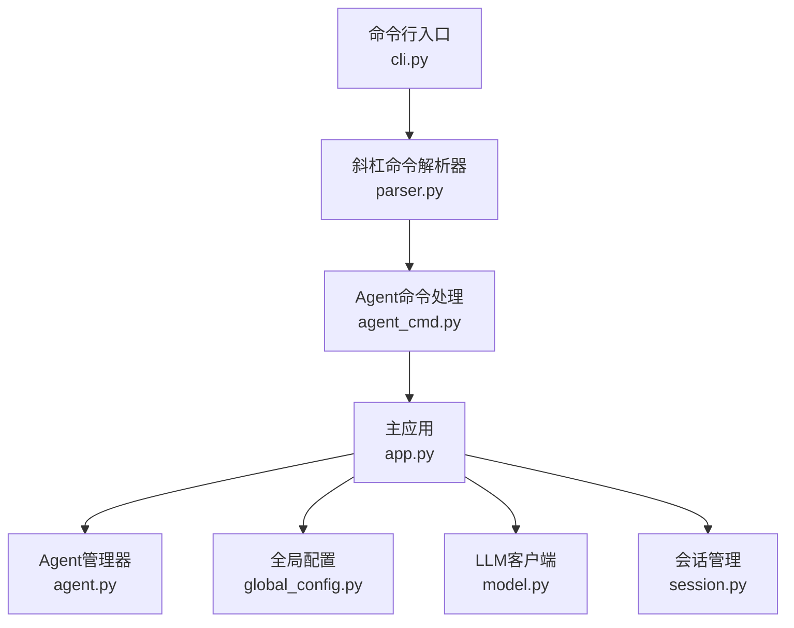
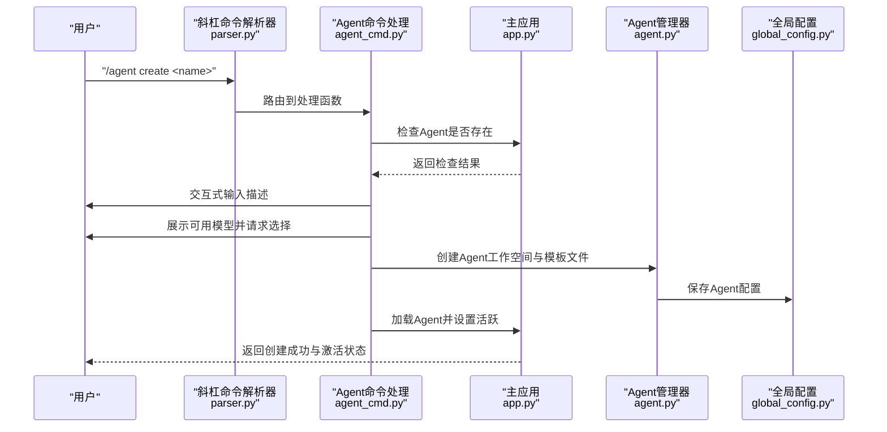
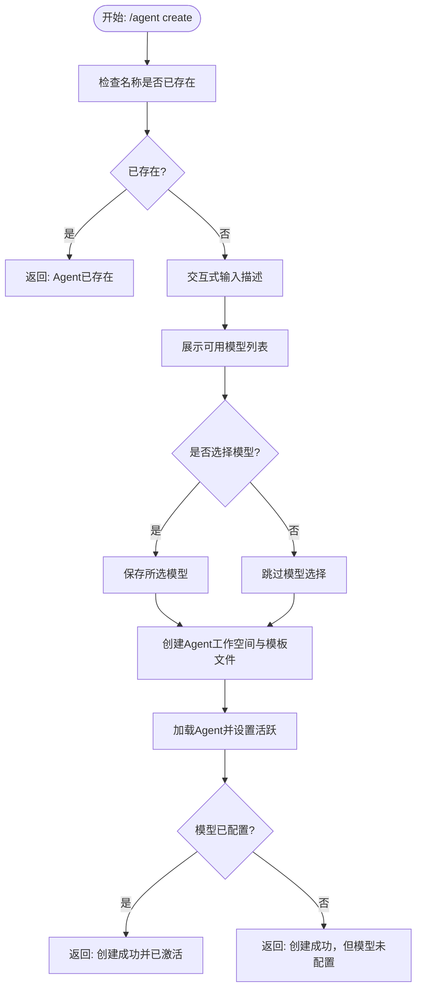
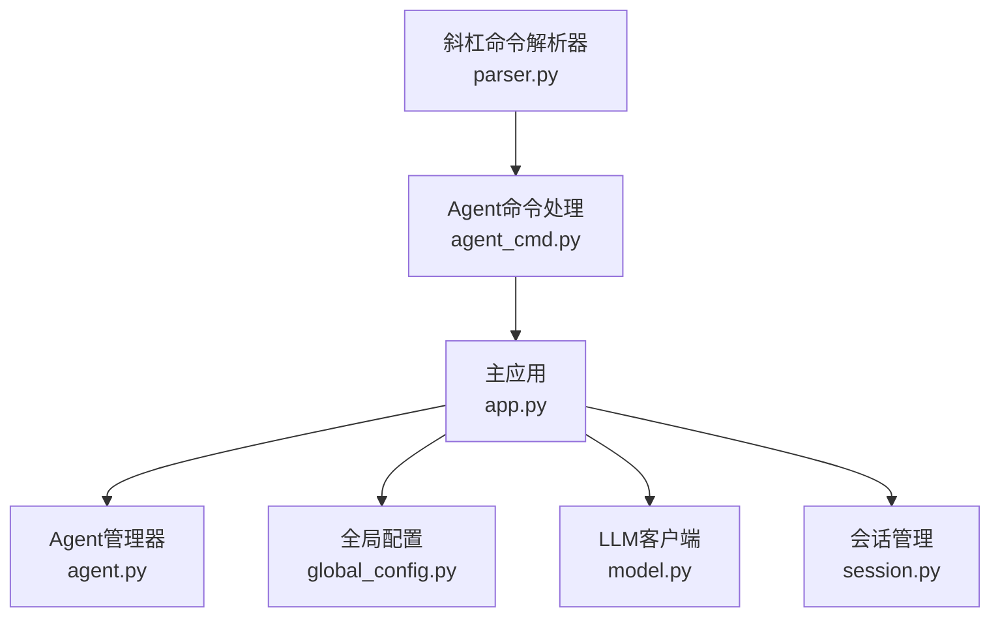

# Agent创建与配置

<cite>
**本文引用的文件**
- [agent_cmd.py](file://cbhcli_pkg/commands/agent_cmd.py)
- [app.py](file://cbhcli_pkg/core/app.py)
- [global_config.py](file://cbhcli_pkg/config/global_config.py)
- [agent.py](file://cbhcli_pkg/core/agent.py)
- [parser.py](file://cbhcli_pkg/commands/parser.py)
- [cli.py](file://cbhcli_pkg/cli.py)
- [README.md](file://README.md)
- [model.py](file://cbhcli_pkg/core/model.py)
- [session.py](file://cbhcli_pkg/core/session.py)
</cite>

## 目录
1. [简介](#简介)
2. [项目结构](#项目结构)
3. [核心组件](#核心组件)
4. [架构概览](#架构概览)
5. [详细组件分析](#详细组件分析)
6. [依赖分析](#依赖分析)
7. [性能考虑](#性能考虑)
8. [故障排除指南](#故障排除指南)
9. [结论](#结论)
10. [附录](#附录)

## 简介
本指南面向希望使用 CBHCLI 创建和配置 Agent 的用户，详细说明 /agent create 命令的使用方法、参数选项、交互式配置流程，以及 Agent 描述、模型选择、初始设置等配置项的作用与填写规范。文档涵盖从命令执行到配置完成的完整流程、配置验证机制与错误处理、提示信息与用户交互设计，并提供配置模板与示例、配置文件生成规则与存储位置、以及配置修改与重新配置的操作指南。

## 项目结构
CBHCLI 采用模块化设计，Agent 创建与配置涉及命令层、应用层、配置层与 Agent 管理层的协同工作。关键文件与职责如下：
- 命令层：负责解析斜杠命令并路由到具体处理逻辑
- 应用层：负责初始化、Agent 加载与会话管理
- 配置层：负责全局配置与 Agent 工作空间的持久化
- Agent 管理层：负责 Agent 的创建、加载、列表与删除

图表来源
- [cli.py:73-112](file://cbhcli_pkg/cli.py#L73-L112)
- [parser.py:16-94](file://cbhcli_pkg/commands/parser.py#L16-L94)
- [agent_cmd.py:5-47](file://cbhcli_pkg/commands/agent_cmd.py#L5-L47)
- [app.py:54-230](file://cbhcli_pkg/core/app.py#L54-L230)
- [agent.py:572-762](file://cbhcli_pkg/core/agent.py#L572-L762)
- [global_config.py:13-154](file://cbhcli_pkg/config/global_config.py#L13-L154)
- [model.py:7-147](file://cbhcli_pkg/core/model.py#L7-L147)
- [session.py:37-190](file://cbhcli_pkg/core/session.py#L37-L190)

章节来源
- [cli.py:73-112](file://cbhcli_pkg/cli.py#L73-L112)
- [parser.py:16-94](file://cbhcli_pkg/commands/parser.py#L16-L94)
- [agent_cmd.py:5-47](file://cbhcli_pkg/commands/agent_cmd.py#L5-L47)
- [app.py:54-230](file://cbhcli_pkg/core/app.py#L54-L230)
- [agent.py:572-762](file://cbhcli_pkg/core/agent.py#L572-L762)
- [global_config.py:13-154](file://cbhcli_pkg/config/global_config.py#L13-L154)
- [model.py:7-147](file://cbhcli_pkg/core/model.py#L7-L147)
- [session.py:37-190](file://cbhcli_pkg/core/session.py#L37-L190)

## 核心组件
- 命令注册与路由：斜杠命令解析器将 /agent 命令注册到处理函数，支持 create/list/switch/delete 子命令。
- Agent 创建流程：检查名称唯一性、交互式输入描述、可选模型选择、创建工作空间与模板文件、加载并激活 Agent。
- Agent 管理：提供 Agent 列表、切换、删除（保护 main Agent）等功能。
- 全局配置：管理模型、嵌入模型、重排序模型、Agent 默认与活跃状态、工作空间路径等。
- 应用初始化：确保 main Agent 存在，加载上次活跃 Agent 或默认 Agent，并初始化会话与上下文窗口。

章节来源
- [agent_cmd.py:5-47](file://cbhcli_pkg/commands/agent_cmd.py#L5-L47)
- [agent_cmd.py:99-130](file://cbhcli_pkg/commands/agent_cmd.py#L99-L130)
- [agent_cmd.py:132-161](file://cbhcli_pkg/commands/agent_cmd.py#L132-L161)
- [agent_cmd.py:164-181](file://cbhcli_pkg/commands/agent_cmd.py#L164-L181)
- [agent.py:572-762](file://cbhcli_pkg/core/agent.py#L572-L762)
- [global_config.py:13-154](file://cbhcli_pkg/config/global_config.py#L13-L154)
- [app.py:204-230](file://cbhcli_pkg/core/app.py#L204-L230)

## 架构概览
Agent 创建与配置的端到端流程如下：
- 用户在应用内输入 /agent create <name>
- 命令解析器将请求路由到 Agent 命令处理模块
- 处理模块检查 Agent 是否已存在，若不存在则进入交互式配置
- 用户输入描述与可选模型选择
- 应用层创建 Agent 工作空间、模板文件并保存配置
- 加载 Agent 并设置为活跃状态

图表来源
- [parser.py:51-78](file://cbhcli_pkg/commands/parser.py#L51-L78)
- [agent_cmd.py:99-130](file://cbhcli_pkg/commands/agent_cmd.py#L99-L130)
- [agent.py:585-624](file://cbhcli_pkg/core/agent.py#L585-L624)
- [app.py:231-279](file://cbhcli_pkg/core/app.py#L231-L279)
- [global_config.py:50-55](file://cbhcli_pkg/config/global_config.py#L50-L55)

章节来源
- [parser.py:51-78](file://cbhcli_pkg/commands/parser.py#L51-L78)
- [agent_cmd.py:99-130](file://cbhcli_pkg/commands/agent_cmd.py#L99-L130)
- [agent.py:585-624](file://cbhcli_pkg/core/agent.py#L585-L624)
- [app.py:231-279](file://cbhcli_pkg/core/app.py#L231-L279)
- [global_config.py:50-55](file://cbhcli_pkg/config/global_config.py#L50-L55)

## 详细组件分析

### /agent create 命令详解
- 命令语法：/agent create <name>
- 参数说明：
  - name：Agent 名称，必须提供且不可重复
- 交互式配置流程：
  - 输入 Agent 描述（可选）
  - 展示可用模型列表（名称、模型ID、上下文限制），可选择首选模型（可选）
  - 创建 Agent 工作空间与模板文件（skills.md、soul.md、tools.md、memory.md、usage.md）
  - 加载 Agent 并设置为活跃状态；若模型未配置，仍会创建成功但提示模型未配置

图表来源
- [agent_cmd.py:99-130](file://cbhcli_pkg/commands/agent_cmd.py#L99-L130)
- [agent.py:585-624](file://cbhcli_pkg/core/agent.py#L585-L624)
- [app.py:231-279](file://cbhcli_pkg/core/app.py#L231-L279)

章节来源
- [agent_cmd.py:20-23](file://cbhcli_pkg/commands/agent_cmd.py#L20-L23)
- [agent_cmd.py:105-129](file://cbhcli_pkg/commands/agent_cmd.py#L105-L129)
- [agent.py:585-624](file://cbhcli_pkg/core/agent.py#L585-L624)
- [app.py:231-279](file://cbhcli_pkg/core/app.py#L231-L279)

### Agent 描述、模型选择与初始设置
- Agent 描述：用于简要说明 Agent 的用途与职责，便于区分不同 Agent。可为空，不影响功能。
- 模型选择：可选。若选择模型，将作为 Agent 的首选模型；若不选择，Agent 仍可创建成功，但需要后续配置模型才能进行对话。
- 初始设置：
  - 工作空间：每个 Agent 拥有独立工作空间，位于 ~/.cbhcli/agents/<agent_name>/
  - 模板文件：自动生成 skills.md、soul.md、tools.md、memory.md、usage.md
  - 配置文件：config.json 记录 Agent 的基础配置（名称、描述、首选模型、上下文限制比例、自动压缩开关等）

章节来源
- [agent_cmd.py:105-129](file://cbhcli_pkg/commands/agent_cmd.py#L105-L129)
- [agent.py:585-624](file://cbhcli_pkg/core/agent.py#L585-L624)
- [agent.py:476-513](file://cbhcli_pkg/core/agent.py#L476-L513)
- [README.md:192-206](file://README.md#L192-L206)

### 配置验证机制与错误处理
- 名称唯一性：创建前检查是否已存在同名 Agent，若存在则返回错误提示。
- 模型可用性：创建时可选择模型，但不会强制要求；若未配置模型，Agent 可创建成功但无法进行对话。
- 删除保护：main Agent 无法删除；当前激活的 Agent 无法删除。
- 交互式输入校验：菜单选择支持编号与名称两种方式，无效输入会返回相应错误提示。

章节来源
- [agent_cmd.py:102-103](file://cbhcli_pkg/commands/agent_cmd.py#L102-L103)
- [agent_cmd.py:167-171](file://cbhcli_pkg/commands/agent_cmd.py#L167-L171)
- [agent_cmd.py:82-96](file://cbhcli_pkg/commands/agent_cmd.py#L82-L96)

### 提示信息与用户交互设计
- 交互式菜单：在无参数时显示 Agent 列表与当前激活状态，支持编号与名称选择。
- 模型选择提示：展示模型列表与上下文限制，引导用户选择合适的模型。
- 成功与失败反馈：根据操作结果返回清晰的成功或错误提示，便于用户理解状态。

章节来源
- [agent_cmd.py:50-96](file://cbhcli_pkg/commands/agent_cmd.py#L50-L96)
- [agent_cmd.py:111-121](file://cbhcli_pkg/commands/agent_cmd.py#L111-L121)

### 配置模板与示例
- 模板文件：
  - skills.md：技能描述模板
  - soul.md：性格设定模板
  - tools.md：工具使用指南模板
  - memory.md：长期记忆模板
  - usage.md：使用说明模板
- 示例流程：
  - 创建 Agent：/agent create dev-helper
  - 输入描述：可选
  - 选择模型：可选
  - 完成创建并激活

章节来源
- [agent.py:9-62](file://cbhcli_pkg/core/agent.py#L9-L62)
- [agent.py:618-622](file://cbhcli_pkg/core/agent.py#L618-L622)
- [README.md:87-91](file://README.md#L87-L91)

### 配置文件生成规则与存储位置
- 全局配置：~/.cbhcli/config.json，包含模型、嵌入模型、重排序模型、Agent 默认与活跃状态、设置等。
- Agent 工作空间：~/.cbhcli/agents/<agent_name>/
  - config.json：Agent 配置
  - skills.md/soul.md/tools.md/memory.md/usage.md：模板文件
  - knowledge/：知识库目录
  - history/：会话历史目录

章节来源
- [global_config.py:8-11](file://cbhcli_pkg/config/global_config.py#L8-L11)
- [global_config.py:31-48](file://cbhcli_pkg/config/global_config.py#L31-L48)
- [README.md:192-206](file://README.md#L192-L206)

### 配置修改与重新配置
- 修改 Agent 配置：通过编辑 Agent 工作空间内的 config.json 与各 md 文件进行修改。
- 重新配置模型：Agent 创建后可通过 /model 命令配置或切换模型；若未配置模型，Agent 可创建成功但无法进行对话。
- 切换 Agent：使用 /agent switch <name> 切换到指定 Agent 并激活。

章节来源
- [agent.py:727-737](file://cbhcli_pkg/core/agent.py#L727-L737)
- [app.py:231-279](file://cbhcli_pkg/core/app.py#L231-L279)
- [agent_cmd.py:154-161](file://cbhcli_pkg/commands/agent_cmd.py#L154-L161)

## 依赖分析
- 命令层依赖解析器：/agent create 命令通过斜杠命令解析器注册与执行。
- 应用层依赖 Agent 管理器与全局配置：创建 Agent 时需要访问全局配置中的模型列表，并创建 Agent 工作空间。
- Agent 管理器依赖 Agent 配置与模板：创建时生成模板文件并保存配置。
- LLM 客户端与会话管理：Agent 加载后初始化 LLM 客户端与会话，用于后续对话。

图表来源
- [agent_cmd.py:5-47](file://cbhcli_pkg/commands/agent_cmd.py#L5-L47)
- [app.py:54-230](file://cbhcli_pkg/core/app.py#L54-L230)
- [agent.py:572-762](file://cbhcli_pkg/core/agent.py#L572-L762)
- [global_config.py:13-154](file://cbhcli_pkg/config/global_config.py#L13-L154)
- [model.py:7-147](file://cbhcli_pkg/core/model.py#L7-L147)
- [session.py:37-190](file://cbhcli_pkg/core/session.py#L37-L190)
- [parser.py:16-94](file://cbhcli_pkg/commands/parser.py#L16-L94)

章节来源
- [agent_cmd.py:5-47](file://cbhcli_pkg/commands/agent_cmd.py#L5-L47)
- [app.py:54-230](file://cbhcli_pkg/core/app.py#L54-L230)
- [agent.py:572-762](file://cbhcli_pkg/core/agent.py#L572-L762)
- [global_config.py:13-154](file://cbhcli_pkg/config/global_config.py#L13-L154)
- [model.py:7-147](file://cbhcli_pkg/core/model.py#L7-L147)
- [session.py:37-190](file://cbhcli_pkg/core/session.py#L37-L190)
- [parser.py:16-94](file://cbhcli_pkg/commands/parser.py#L16-L94)

## 性能考虑
- 上下文窗口与自动压缩：当上下文接近模型限制时自动压缩，减少 Token 使用，提升对话稳定性。
- 模型选择：选择合适上下文限制的模型有助于控制 Token 使用量。
- 向量索引：向量索引需手动触发，避免启动时大量 API 调用与时间消耗。

章节来源
- [app.py:361-385](file://cbhcli_pkg/core/app.py#L361-L385)
- [session.py:127-190](file://cbhcli_pkg/core/session.py#L127-L190)
- [README.md:208-229](file://README.md#L208-L229)

## 故障排除指南
- Agent 已存在：创建时若名称重复，返回“Agent 已存在”提示。请更换名称后重试。
- 未配置模型：Agent 可创建成功，但无法进行对话。请使用 /model 命令配置模型。
- 删除失败：main Agent 无法删除；当前激活的 Agent 无法删除。请先切换到其他 Agent 再删除。
- 交互式菜单无效：编号超出范围或名称不存在时，返回相应错误提示。请确认输入格式或使用 /agent list 查看列表。

章节来源
- [agent_cmd.py:102-103](file://cbhcli_pkg/commands/agent_cmd.py#L102-L103)
- [agent_cmd.py:167-171](file://cbhcli_pkg/commands/agent_cmd.py#L167-L171)
- [agent_cmd.py:82-96](file://cbhcli_pkg/commands/agent_cmd.py#L82-L96)
- [app.py:410-414](file://cbhcli_pkg/core/app.py#L410-L414)

## 结论
通过 /agent create 命令，用户可以快速创建并配置 Agent，支持交互式描述与模型选择。Agent 的工作空间与模板文件自动生成，全局配置与模型管理确保了灵活的扩展与维护。遵循本文提供的流程与最佳实践，用户可以高效地完成 Agent 的创建、配置与日常使用。

## 附录
- 快速开始示例：/agent create dev-helper
- 相关命令参考：/agent list、/agent switch、/agent delete、/model add/use/list、/help

章节来源
- [README.md:87-91](file://README.md#L87-L91)
- [README.md:231-262](file://README.md#L231-L262)