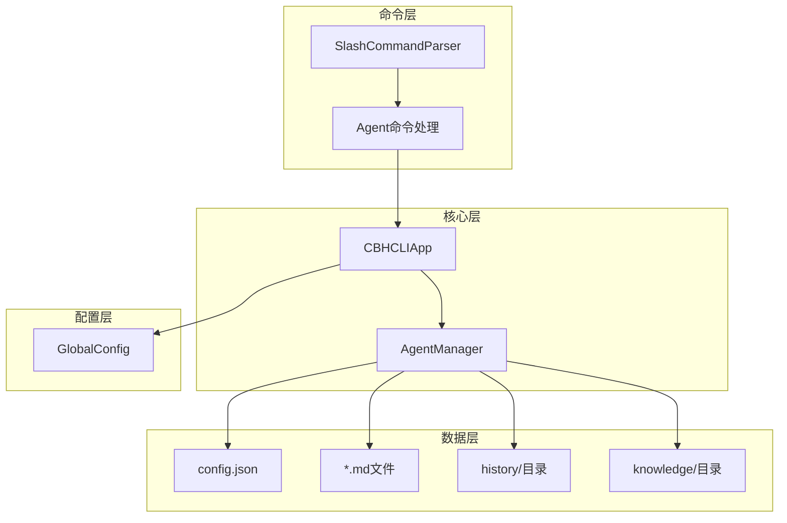
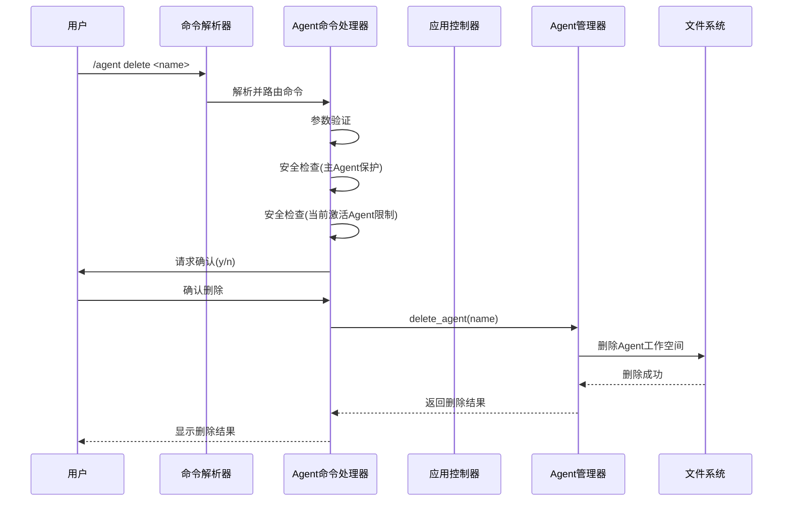
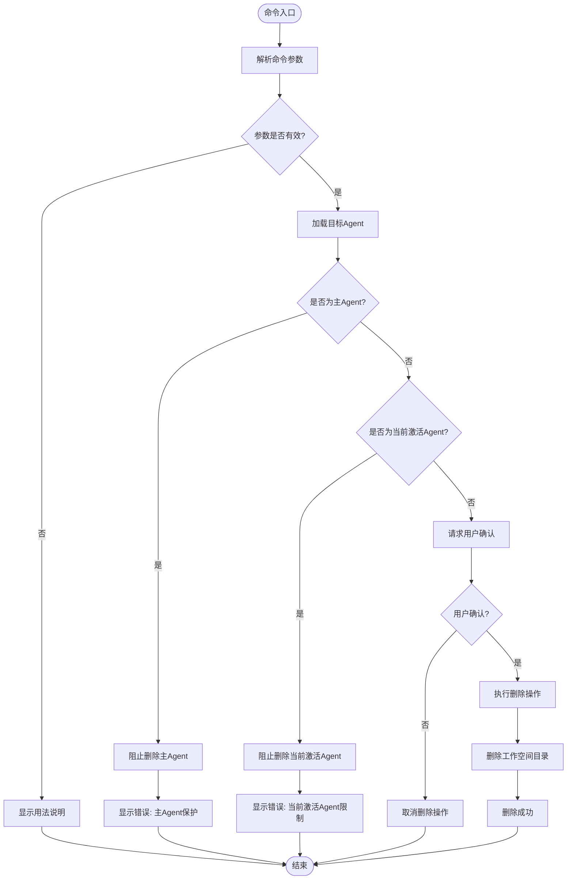
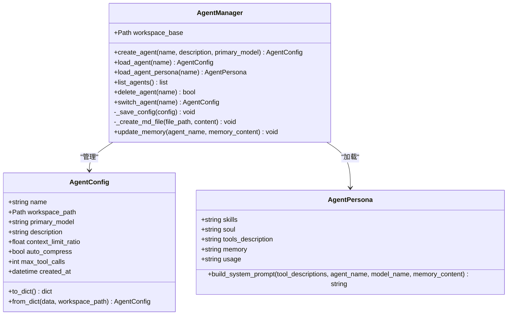
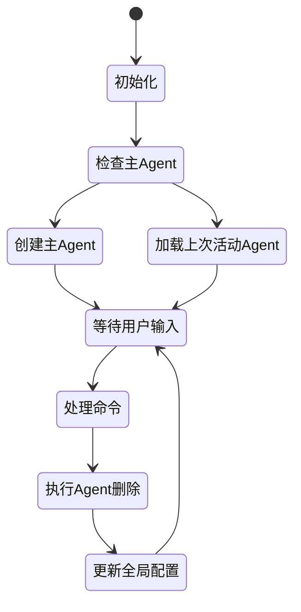
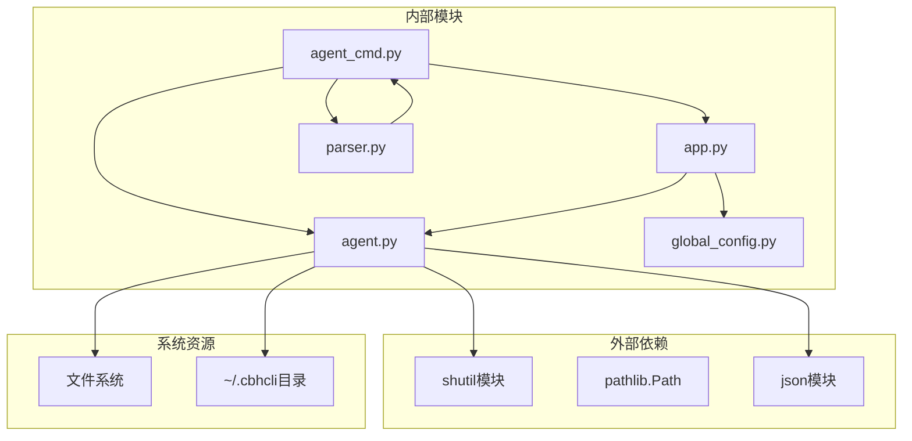

# Agent删除与安全

<cite>
**本文档引用的文件**
- [agent_cmd.py](file://cbhcli_pkg/commands/agent_cmd.py)
- [app.py](file://cbhcli_pkg/core/app.py)
- [agent.py](file://cbhcli_pkg/core/agent.py)
- [parser.py](file://cbhcli_pkg/commands/parser.py)
- [global_config.py](file://cbhcli_pkg/config/global_config.py)
- [constants.py](file://cbhcli_pkg/core/constants.py)
- [errors.py](file://cbhcli_pkg/core/errors.py)
- [README.md](file://README.md)
</cite>

## 目录
1. [简介](#简介)
2. [项目结构](#项目结构)
3. [核心组件](#核心组件)
4. [架构概览](#架构概览)
5. [详细组件分析](#详细组件分析)
6. [依赖分析](#依赖分析)
7. [性能考虑](#性能考虑)
8. [故障排除指南](#故障排除指南)
9. [结论](#结论)
10. [附录](#附录)

## 简介

本文档提供了CBHCLI中Agent删除与安全的详细操作指南。CBHCLI是一个AI驱动的终端助手，支持多Agent管理和工具调用。Agent删除功能是系统安全管理的重要组成部分，涉及主Agent保护、当前激活Agent限制、删除确认机制等多个安全层面。

## 项目结构

CBHCLI采用模块化架构设计，Agent删除功能分布在多个核心模块中：

**图表来源**
- [agent_cmd.py:1-181](file://cbhcli_pkg/commands/agent_cmd.py#L1-L181)
- [app.py:54-478](file://cbhcli_pkg/core/app.py#L54-L478)
- [agent.py:572-762](file://cbhcli_pkg/core/agent.py#L572-L762)

**章节来源**
- [agent_cmd.py:1-181](file://cbhcli_pkg/commands/agent_cmd.py#L1-L181)
- [app.py:54-478](file://cbhcli_pkg/core/app.py#L54-L478)
- [agent.py:572-762](file://cbhcli_pkg/core/agent.py#L572-L762)

## 核心组件

### Agent删除命令处理器

Agent删除功能的核心实现位于`agent_cmd.py`文件中，该模块负责处理`/agent delete`命令的所有逻辑。

### Agent管理器

`agent.py`文件中的`AgentManager`类提供了Agent的完整生命周期管理，包括创建、加载、切换和删除功能。

### 应用主控制器

`app.py`文件中的`CBHCLIApp`类作为应用的主控制器，协调各个组件之间的交互。

**章节来源**
- [agent_cmd.py:34-181](file://cbhcli_pkg/commands/agent_cmd.py#L34-L181)
- [agent.py:572-762](file://cbhcli_pkg/core/agent.py#L572-L762)
- [app.py:54-478](file://cbhcli_pkg/core/app.py#L54-L478)

## 架构概览

Agent删除操作的完整架构流程如下：

**图表来源**
- [agent_cmd.py:164-181](file://cbhcli_pkg/commands/agent_cmd.py#L164-L181)
- [agent.py:707-725](file://cbhcli_pkg/core/agent.py#L707-L725)

## 详细组件分析

### Agent删除命令处理流程

#### 命令入口与参数解析

Agent删除命令的处理流程从`agent_cmd.py`文件开始，该文件实现了完整的命令处理逻辑：

**图表来源**
- [agent_cmd.py:34-181](file://cbhcli_pkg/commands/agent_cmd.py#L34-L181)

#### 安全检查机制

Agent删除操作包含两层重要的安全检查：

1. **主Agent保护机制**：系统不允许删除名为"main"的主Agent
2. **当前激活Agent限制**：不允许删除当前正在使用的Agent

这些安全检查确保了系统的稳定性和数据完整性。

**章节来源**
- [agent_cmd.py:164-181](file://cbhcli_pkg/commands/agent_cmd.py#L164-L181)

### Agent管理器实现

#### 删除操作的核心实现

Agent管理器的删除功能位于`agent.py`文件中，提供了完整的文件系统操作：

**图表来源**
- [agent.py:572-762](file://cbhcli_pkg/core/agent.py#L572-L762)

#### 文件系统操作细节

删除操作通过Python的`shutil.rmtree()`函数实现，该函数会递归删除整个Agent工作空间目录及其所有内容。

**章节来源**
- [agent.py:707-725](file://cbhcli_pkg/core/agent.py#L707-L725)

### 应用控制器集成

#### Agent生命周期管理

应用控制器负责维护Agent的完整生命周期，包括初始化、加载和切换：

**图表来源**
- [app.py:204-230](file://cbhcli_pkg/core/app.py#L204-L230)

**章节来源**
- [app.py:204-230](file://cbhcli_pkg/core/app.py#L204-L230)

## 依赖分析

### 组件间依赖关系

Agent删除功能涉及多个模块间的复杂依赖关系：

**图表来源**
- [agent_cmd.py:1-181](file://cbhcli_pkg/commands/agent_cmd.py#L1-L181)
- [agent.py:572-762](file://cbhcli_pkg/core/agent.py#L572-L762)
- [app.py:54-478](file://cbhcli_pkg/core/app.py#L54-L478)

### 数据流分析

Agent删除操作的数据流如下：

1. **命令输入**：用户通过斜杠命令输入`/agent delete <name>`
2. **命令解析**：`SlashCommandParser`解析命令并路由到`Agent命令处理器`
3. **安全检查**：执行主Agent保护和当前激活Agent限制检查
4. **用户确认**：通过交互式确认机制获取用户同意
5. **文件操作**：使用`shutil.rmtree()`删除Agent工作空间
6. **状态更新**：更新全局配置和应用状态

**章节来源**
- [parser.py:16-94](file://cbhcli_pkg/commands/parser.py#L16-L94)
- [agent_cmd.py:164-181](file://cbhcli_pkg/commands/agent_cmd.py#L164-L181)

## 性能考虑

### 删除操作的性能特征

Agent删除操作具有以下性能特点：

- **时间复杂度**：O(n)，其中n为Agent工作空间中的文件数量
- **空间复杂度**：O(1)，主要占用内存用于文件路径操作
- **I/O特性**：磁盘删除操作，受文件系统性能影响

### 并发安全性

系统在设计上避免了并发删除操作的问题，因为命令处理是同步的，不会出现多个删除操作同时执行的情况。

## 故障排除指南

### 常见删除失败场景

#### 主Agent保护错误

**现象**：尝试删除名为"main"的Agent时出现错误

**原因**：系统检测到删除的是主Agent

**解决方法**：使用`/agent switch <name>`切换到其他Agent后再删除

#### 当前激活Agent限制

**现象**：尝试删除当前正在使用的Agent时被阻止

**原因**：系统检测到Agent处于激活状态

**解决方法**：先切换到其他Agent，然后执行删除操作

#### 文件系统权限错误

**现象**：删除操作抛出权限相关异常

**原因**：用户没有足够的文件系统权限

**解决方法**：检查并修改Agent工作空间目录的权限设置

#### 硬链接或共享文件问题

**现象**：删除过程中出现文件锁定或共享访问错误

**原因**：某些文件可能被其他进程占用

**解决方法**：关闭可能占用文件的进程后重试

**章节来源**
- [agent_cmd.py:164-181](file://cbhcli_pkg/commands/agent_cmd.py#L164-L181)
- [errors.py:1-32](file://cbhcli_pkg/core/errors.py#L1-L32)

### 恢复方法

#### 部分删除恢复

如果删除操作在中途失败，系统会保持Agent工作空间的完整性，无需额外恢复操作。

#### 完全删除恢复

对于意外删除的情况，可以通过以下方式恢复：

1. **备份恢复**：从最近的备份中恢复Agent工作空间
2. **重新创建**：重新创建相同的Agent配置
3. **数据迁移**：从其他位置迁移相关数据文件

## 结论

CBHCLI的Agent删除功能通过多层次的安全检查和确认机制，确保了系统的安全性和稳定性。主要特点包括：

1. **双重安全保护**：主Agent保护和当前激活Agent限制
2. **用户确认机制**：防止误操作导致的数据丢失
3. **完整的文件清理**：删除Agent工作空间中的所有相关文件
4. **错误处理机制**：提供清晰的错误信息和恢复指导

该设计在保证功能完整性的同时，最大程度地保护了用户数据的安全性。

## 附录

### 删除操作影响范围

Agent删除操作会影响以下文件和目录：

- **Agent配置文件**：`config.json`
- **技能描述文件**：`skills.md`
- **性格设定文件**：`soul.md`
- **工具使用指南**：`tools.md`
- **长期记忆文件**：`memory.md`
- **使用说明文件**：`usage.md`
- **会话历史目录**：`history/`
- **知识库目录**：`knowledge/`

### 删除前备份建议

建议在执行删除操作前进行以下备份：

1. **手动备份**：复制Agent工作空间到安全位置
2. **版本控制**：使用Git或其他版本控制系统管理Agent配置
3. **云备份**：将重要配置文件上传到云端存储
4. **定期快照**：建立定期的系统快照机制

### 高级用法

#### 批量删除

系统支持通过脚本或自动化工具实现批量删除操作，但需要谨慎使用以避免误删。

#### 权限控制

管理员可以通过文件系统权限控制Agent删除操作，限制特定用户或组的删除权限。

#### 审计日志

虽然当前版本没有内置的审计日志功能，但可以通过外部工具实现操作审计。

**章节来源**
- [README.md:231-262](file://README.md#L231-L262)