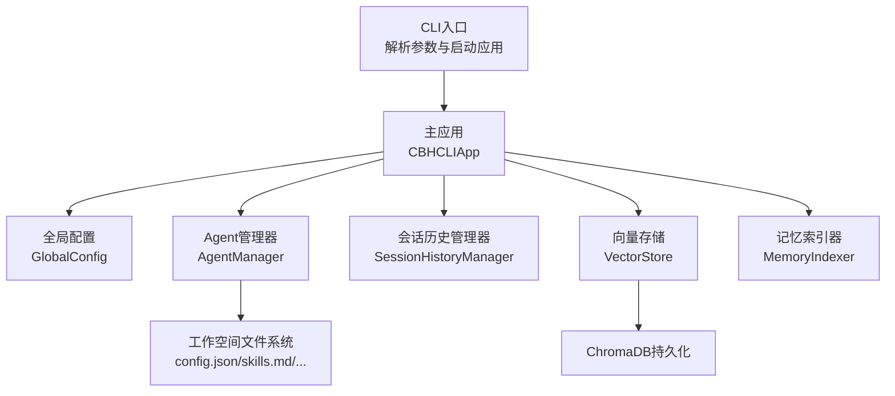
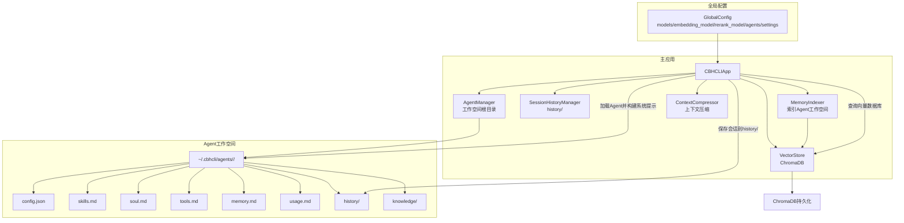
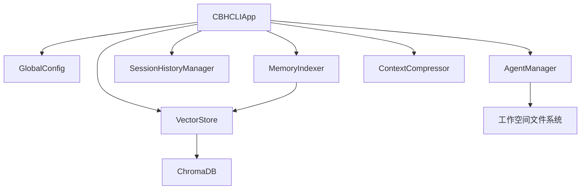

# Agent工作空间管理

<cite>
**本文引用的文件**
- [README.md](file://README.md)
- [cbhcli_pkg/__init__.py](file://cbhcli_pkg/__init__.py)
- [cbhcli_pkg/cli.py](file://cbhcli_pkg/cli.py)
- [cbhcli_pkg/config/global_config.py](file://cbhcli_pkg/config/global_config.py)
- [cbhcli_pkg/core/app.py](file://cbhcli_pkg/core/app.py)
- [cbhcli_pkg/core/agent.py](file://cbhcli_pkg/core/agent.py)
- [cbhcli_pkg/core/constants.py](file://cbhcli_pkg/core/constants.py)
- [cbhcli_pkg/core/session_history.py](file://cbhcli_pkg/core/session_history.py)
- [cbhcli_pkg/core/session.py](file://cbhcli_pkg/core/session.py)
- [cbhcli_pkg/context/compressor.py](file://cbhcli_pkg/context/compressor.py)
- [cbhcli_pkg/vector/store.py](file://cbhcli_pkg/vector/store.py)
- [cbhcli_pkg/vector/indexer.py](file://cbhcli_pkg/vector/indexer.py)
- [cbhcli_pkg/commands/agent_cmd.py](file://cbhcli_pkg/commands/agent_cmd.py)
</cite>

## 目录
1. [简介](#简介)
2. [项目结构](#项目结构)
3. [核心组件](#核心组件)
4. [架构总览](#架构总览)
5. [详细组件分析](#详细组件分析)
6. [依赖分析](#依赖分析)
7. [性能考虑](#性能考虑)
8. [故障排除指南](#故障排除指南)
9. [结论](#结论)
10. [附录](#附录)

## 简介
本文件系统性阐述CBHCLI v3.0的Agent工作空间管理机制，涵盖工作空间组织结构、文件系统布局、config.json配置格式与字段含义、Agent相关文件的作用、隔离与数据保护、备份与恢复、清理与维护、大小限制与性能优化、与全局配置的关系以及故障排除与修复方法。目标是帮助用户与开发者高效地创建、维护与扩展多Agent工作空间，并安全可靠地管理长期记忆与知识库。

## 项目结构
CBHCLI采用模块化设计，核心围绕“全局配置”“Agent工作空间”“会话历史”“向量索引”四大支柱展开。CLI入口负责参数解析与应用启动；全局配置统一管理模型、嵌入模型、重排序模型、Agent默认与活跃状态及工作空间根目录；Agent管理器负责工作空间的创建、加载、人格与配置读取；会话历史管理器负责会话持久化；向量存储与索引器负责语义检索能力。

图表来源
- [cbhcli_pkg/cli.py:73-112](file://cbhcli_pkg/cli.py#L73-L112)
- [cbhcli_pkg/core/app.py:64-230](file://cbhcli_pkg/core/app.py#L64-L230)
- [cbhcli_pkg/config/global_config.py:13-154](file://cbhcli_pkg/config/global_config.py#L13-L154)
- [cbhcli_pkg/core/agent.py:572-762](file://cbhcli_pkg/core/agent.py#L572-L762)
- [cbhcli_pkg/core/session_history.py:8-136](file://cbhcli_pkg/core/session_history.py#L8-L136)
- [cbhcli_pkg/vector/store.py:37-175](file://cbhcli_pkg/vector/store.py#L37-L175)
- [cbhcli_pkg/vector/indexer.py:7-178](file://cbhcli_pkg/vector/indexer.py#L7-L178)

章节来源
- [cbhcli_pkg/cli.py:1-112](file://cbhcli_pkg/cli.py#L1-L112)
- [cbhcli_pkg/core/app.py:1-478](file://cbhcli_pkg/core/app.py#L1-L478)
- [README.md:150-230](file://README.md#L150-L230)

## 核心组件
- 全局配置（GlobalConfig）：集中管理模型、嵌入模型、重排序模型、Agent默认与活跃状态、工作空间根目录、自动压缩策略等。
- Agent管理器（AgentManager）：负责Agent工作空间的创建、加载、人格文件读取、配置保存、删除等。
- 会话历史管理器（SessionHistoryManager）：负责会话保存、列出、加载与删除。
- 向量存储（VectorStore）：封装ChromaDB，支持自定义嵌入模型API，提供集合管理、文档增删、查询与计数。
- 记忆索引器（MemoryIndexer）：负责将Agent工作空间内的标准MD文件与知识库文件切分为段落并索引到向量数据库。
- 上下文压缩器（ContextCompressor）：在接近模型上下文阈值时，对会话历史进行摘要压缩，降低token占用。
- 主应用（CBHCLIApp）：协调全局配置、Agent加载、会话初始化、命令路由、UI与交互循环。

章节来源
- [cbhcli_pkg/config/global_config.py:13-154](file://cbhcli_pkg/config/global_config.py#L13-L154)
- [cbhcli_pkg/core/agent.py:572-762](file://cbhcli_pkg/core/agent.py#L572-L762)
- [cbhcli_pkg/core/session_history.py:8-136](file://cbhcli_pkg/core/session_history.py#L8-L136)
- [cbhcli_pkg/vector/store.py:37-175](file://cbhcli_pkg/vector/store.py#L37-L175)
- [cbhcli_pkg/vector/indexer.py:7-178](file://cbhcli_pkg/vector/indexer.py#L7-L178)
- [cbhcli_pkg/context/compressor.py:7-112](file://cbhcli_pkg/context/compressor.py#L7-L112)
- [cbhcli_pkg/core/app.py:54-230](file://cbhcli_pkg/core/app.py#L54-L230)

## 架构总览
下图展示Agent工作空间与全局配置、向量索引、会话历史之间的关系与数据流。

图表来源
- [cbhcli_pkg/config/global_config.py:13-154](file://cbhcli_pkg/config/global_config.py#L13-L154)
- [cbhcli_pkg/core/app.py:64-230](file://cbhcli_pkg/core/app.py#L64-L230)
- [cbhcli_pkg/core/agent.py:572-762](file://cbhcli_pkg/core/agent.py#L572-L762)
- [cbhcli_pkg/core/session_history.py:8-136](file://cbhcli_pkg/core/session_history.py#L8-L136)
- [cbhcli_pkg/vector/store.py:37-175](file://cbhcli_pkg/vector/store.py#L37-L175)
- [cbhcli_pkg/vector/indexer.py:7-178](file://cbhcli_pkg/vector/indexer.py#L7-L178)

## 详细组件分析

### Agent工作空间组织结构与文件系统布局
- 工作空间根目录：由全局配置决定，默认位于用户主目录下的隐藏目录中，具体路径在全局配置的settings中定义。
- 每个Agent对应一个子目录，包含以下标准文件：
  - config.json：Agent配置（名称、描述、主模型、上下文压缩比例、最大工具调用次数、创建时间等）。
  - skills.md：Agent技能描述模板与内容。
  - soul.md：Agent性格设定模板与内容。
  - tools.md：工具使用指南模板与内容。
  - memory.md：长期记忆文件，仅在用户明确要求记录时写入，始终包含在系统提示中。
  - usage.md：使用说明，包含斜杠命令、工具调用规范、工作空间路径、知识库与向量检索使用方法等。
  - history/：会话历史目录，保存每次新建/重置会话时的对话记录（JSON格式）。
  - knowledge/：知识库目录，存放用户添加的文档、代码片段、笔记等，会被索引到向量数据库。

章节来源
- [README.md:192-206](file://README.md#L192-L206)
- [cbhcli_pkg/core/agent.py:572-762](file://cbhcli_pkg/core/agent.py#L572-L762)
- [cbhcli_pkg/core/session_history.py:16-64](file://cbhcli_pkg/core/session_history.py#L16-L64)

### config.json配置文件格式、字段含义与修改方法
- 全局配置文件位置：用户主目录下的隐藏目录中，文件名为config.json。
- 主要字段：
  - models：模型列表，每项包含名称、API Key、Base URL、模型ID、上下文长度等。
  - embedding_model：嵌入模型配置，用于向量检索，包含名称、API Key、Base URL、模型ID、类型等。
  - rerank_model：重排序模型配置，用于提升检索质量，包含名称、API Key、Base URL、模型ID、返回数量等。
  - agents：Agent相关设置，包含默认Agent与当前活跃Agent。
  - settings：应用设置，包含自动压缩开关、压缩比例、工作空间根目录、是否使用ChromaDB内置嵌入模型、知识库根目录等。
- 修改方法：
  - 通过CLI命令动态配置模型、嵌入模型、重排序模型与Agent活跃状态。
  - 直接编辑全局配置文件（谨慎操作），或通过全局配置类提供的接口进行读取与更新。

章节来源
- [README.md:150-190](file://README.md#L150-L190)
- [cbhcli_pkg/config/global_config.py:13-154](file://cbhcli_pkg/config/global_config.py#L13-L154)

### Agent相关文件的作用
- skills.md：定义Agent的基本能力、专业技能与特殊能力，便于AI在系统提示中了解Agent的能力边界与专长。
- soul.md：定义Agent的基本设定、沟通风格、行为准则与个性化特征，确保Agent在对话中保持一致的人格。
- tools.md：提供工具使用指南，包括terminal、read、write、edit、memory_search、knowledge_base、python等工具的调用格式与最佳实践。
- memory.md：长期记忆文件，仅在用户明确要求记录时写入，内容始终包含在系统提示中，帮助Agent在后续对话中记住重要信息。
- usage.md：使用说明，包含斜杠命令、工具调用格式、工作空间路径、知识库与向量检索使用方法等，指导用户如何正确使用系统。
- history/：会话历史目录，保存每次新建/重置会话时的对话记录，支持列出、加载与删除。
- knowledge/：知识库目录，存放用户添加的文档、代码片段、笔记等，会被索引到向量数据库，支持语义检索。

章节来源
- [cbhcli_pkg/core/agent.py:9-474](file://cbhcli_pkg/core/agent.py#L9-L474)
- [cbhcli_pkg/core/session_history.py:16-136](file://cbhcli_pkg/core/session_history.py#L16-L136)

### 工作空间的隔离机制与数据保护
- 目录隔离：每个Agent拥有独立的工作空间目录，彼此隔离，避免相互影响。
- 文件隔离：标准MD文件（skills/soul/tools/memory/usage）与知识库文件（knowledge/）分别承载不同职责，降低耦合。
- 数据保护：
  - 会话历史以JSON格式保存在history/目录，结构清晰，便于备份与恢复。
  - 向量索引通过集合（collection）按Agent隔离，删除Agent工作空间时，其向量集合也会被清理。
  - memory.md内容始终包含在系统提示中，不参与向量索引，确保长期记忆的可控性与安全性。

章节来源
- [cbhcli_pkg/core/agent.py:572-762](file://cbhcli_pkg/core/agent.py#L572-L762)
- [cbhcli_pkg/vector/store.py:79-97](file://cbhcli_pkg/vector/store.py#L79-L97)
- [cbhcli_pkg/core/session_history.py:24-64](file://cbhcli_pkg/core/session_history.py#L24-L64)

### 备份与恢复操作指南
- 备份：
  - 备份全局配置：复制全局配置文件至安全位置。
  - 备份Agent工作空间：复制对应Agent目录至安全位置。
  - 备份会话历史：复制history/目录至安全位置。
  - 备份向量索引：备份向量数据库持久化目录（默认位于用户主目录下的隐藏目录中）。
- 恢复：
  - 恢复全局配置：将备份的全局配置文件复制回原位。
  - 恢复Agent工作空间：将备份的Agent目录复制回原位。
  - 恢复会话历史：将备份的history/目录复制回原位。
  - 恢复向量索引：将备份的向量数据库目录复制回原位。
  - 重新索引：恢复后根据需要重新触发向量索引（如需）。

章节来源
- [README.md:208-229](file://README.md#L208-L229)
- [cbhcli_pkg/vector/store.py:162-175](file://cbhcli_pkg/vector/store.py#L162-L175)

### 清理与维护方法
- 清理Agent：
  - 删除Agent工作空间：通过命令删除Agent，或直接删除对应目录。
  - 清理向量索引：删除Agent对应的向量集合。
- 维护：
  - 重新索引：当Agent工作空间文件内容发生变更后，重新触发索引。
  - 会话历史清理：定期删除不再需要的历史会话文件。
  - 知识库维护：定期整理knowledge/目录中的文件，保持结构清晰。

章节来源
- [cbhcli_pkg/commands/agent_cmd.py:164-181](file://cbhcli_pkg/commands/agent_cmd.py#L164-L181)
- [cbhcli_pkg/vector/store.py:162-175](file://cbhcli_pkg/vector/store.py#L162-L175)
- [cbhcli_pkg/vector/indexer.py:37-69](file://cbhcli_pkg/vector/indexer.py#L37-L69)

### 工作空间大小限制与性能优化建议
- 上下文限制：
  - 默认上下文长度与压缩比例由常量与配置共同决定，接近阈值时自动压缩。
  - 可通过Agent配置调整上下文压缩比例与自动压缩开关。
- 向量索引：
  - 索引范围包括标准MD文件与知识库文件，避免频繁全量索引导致资源浪费。
  - 建议在文件更新后手动触发重新索引，而非每次启动自动索引。
- 存储与I/O：
  - 合理规划知识库文件数量与大小，避免过多小文件导致索引效率下降。
  - 使用合适的嵌入模型与重排序模型，平衡精度与性能。

章节来源
- [cbhcli_pkg/core/constants.py:6-8](file://cbhcli_pkg/core/constants.py#L6-L8)
- [cbhcli_pkg/context/compressor.py:21-81](file://cbhcli_pkg/context/compressor.py#L21-L81)
- [cbhcli_pkg/core/app.py:361-385](file://cbhcli_pkg/core/app.py#L361-L385)
- [README.md:208-229](file://README.md#L208-L229)

### 工作空间与全局配置的关系
- 全局配置决定：
  - 工作空间根目录（settings.workspace_base）。
  - 默认Agent与当前活跃Agent（agents.default_agent/active_agent）。
  - 模型、嵌入模型、重排序模型的全局配置。
  - 自动压缩策略（settings.auto_compress、settings.compression_ratio）。
- Agent工作空间继承全局配置：
  - Agent配置中可覆盖上下文压缩比例与自动压缩开关。
  - Agent加载时会根据全局配置选择主模型并初始化上下文压缩器。

章节来源
- [cbhcli_pkg/config/global_config.py:13-154](file://cbhcli_pkg/config/global_config.py#L13-L154)
- [cbhcli_pkg/core/app.py:77-83](file://cbhcli_pkg/core/app.py#L77-L83)
- [cbhcli_pkg/core/agent.py:476-513](file://cbhcli_pkg/core/agent.py#L476-L513)

## 依赖分析
- 组件耦合：
  - CBHCLIApp依赖GlobalConfig、AgentManager、SessionHistoryManager、VectorStore、MemoryIndexer与ContextCompressor。
  - AgentManager负责工作空间文件的创建与读取，与全局配置无直接耦合，但受settings.workspace_base影响。
  - VectorStore与MemoryIndexer紧密协作，前者提供持久化能力，后者负责内容切分与索引。
- 外部依赖：
  - ChromaDB用于向量存储与查询。
  - tiktoken用于精确token计数（可选）。

图表来源
- [cbhcli_pkg/core/app.py:64-230](file://cbhcli_pkg/core/app.py#L64-L230)
- [cbhcli_pkg/core/agent.py:572-762](file://cbhcli_pkg/core/agent.py#L572-L762)
- [cbhcli_pkg/vector/store.py:37-175](file://cbhcli_pkg/vector/store.py#L37-L175)
- [cbhcli_pkg/vector/indexer.py:7-178](file://cbhcli_pkg/vector/indexer.py#L7-L178)

## 性能考虑
- 自动压缩：在接近上下文阈值时自动压缩，减少token占用，提升响应速度。
- 向量索引策略：手动触发索引，避免启动时全量索引带来的资源消耗。
- 模型选择：根据任务复杂度选择合适上下文长度的模型，平衡成本与效果。
- I/O优化：合理组织知识库文件，减少碎片化，提升索引与查询效率。

章节来源
- [cbhcli_pkg/context/compressor.py:21-81](file://cbhcli_pkg/context/compressor.py#L21-L81)
- [README.md:208-229](file://README.md#L208-L229)

## 故障排除指南
- Agent创建失败：
  - 检查工作空间根目录权限与磁盘空间。
  - 确认全局配置中的workspace_base路径有效。
- Agent加载失败：
  - 检查config.json是否存在且格式正确。
  - 确认Agent目录下标准MD文件完整。
- 向量索引异常：
  - 确认嵌入模型配置正确且可用。
  - 检查向量数据库持久化目录权限。
  - 如需修复，先删除集合，再重新索引。
- 会话历史无法恢复：
  - 检查history/目录权限与文件完整性。
  - 确认JSON格式正确，必要时手动修复。
- 上下文溢出：
  - 启用自动压缩或手动压缩上下文。
  - 调整Agent配置中的上下文压缩比例。

章节来源
- [cbhcli_pkg/core/agent.py:626-646](file://cbhcli_pkg/core/agent.py#L626-L646)
- [cbhcli_pkg/vector/store.py:48-53](file://cbhcli_pkg/vector/store.py#L48-L53)
- [cbhcli_pkg/vector/indexer.py:48-50](file://cbhcli_pkg/vector/indexer.py#L48-L50)
- [cbhcli_pkg/core/session_history.py:99-118](file://cbhcli_pkg/core/session_history.py#L99-L118)
- [cbhcli_pkg/core/app.py:361-385](file://cbhcli_pkg/core/app.py#L361-L385)

## 结论
CBHCLI的Agent工作空间管理通过清晰的目录结构、标准化的配置文件与严格的隔离机制，实现了多Agent的独立运行与安全的数据保护。结合全局配置、会话历史与向量索引，用户可以高效地管理长期记忆与知识库，同时通过自动压缩与手动索引策略优化性能。遵循本文提供的备份、恢复、清理与故障排除指南，可确保工作空间的稳定与可持续发展。

## 附录
- CLI命令参考与使用说明详见README中的命令参考与使用指南章节。
- Agent工作空间文件布局与字段说明详见README中的Agent工作空间章节。

章节来源
- [README.md:231-268](file://README.md#L231-L268)
- [README.md:192-206](file://README.md#L192-L206)