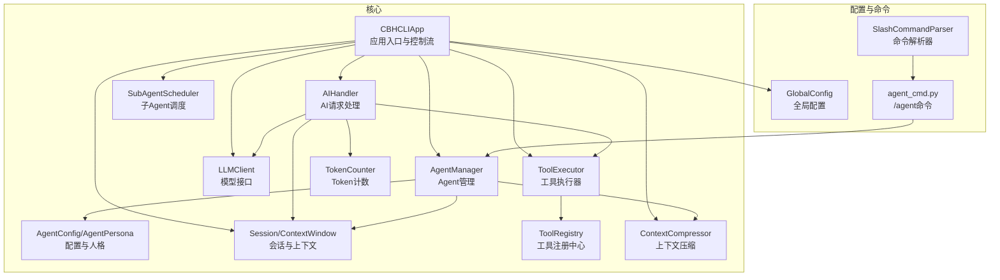
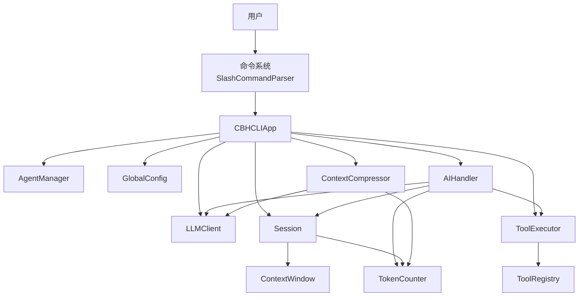
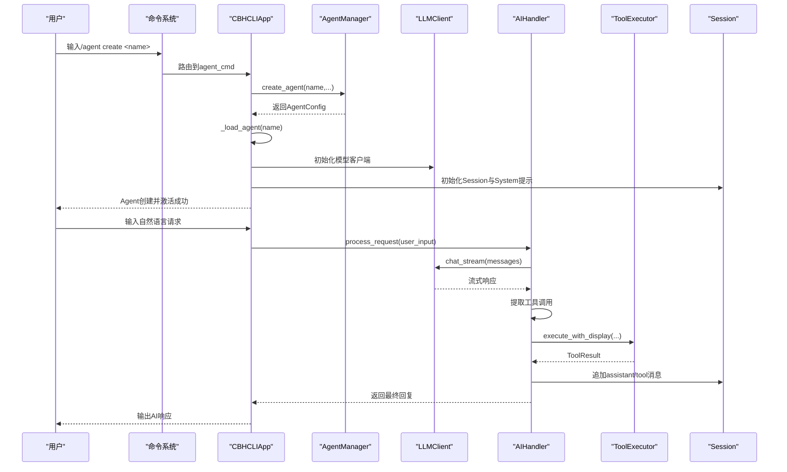
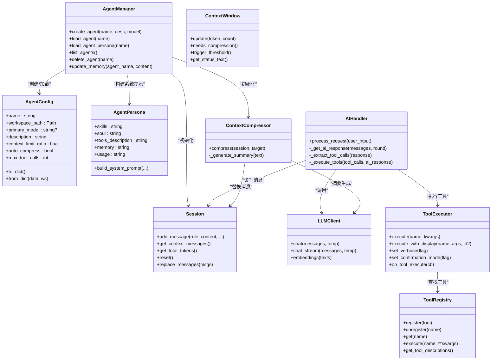
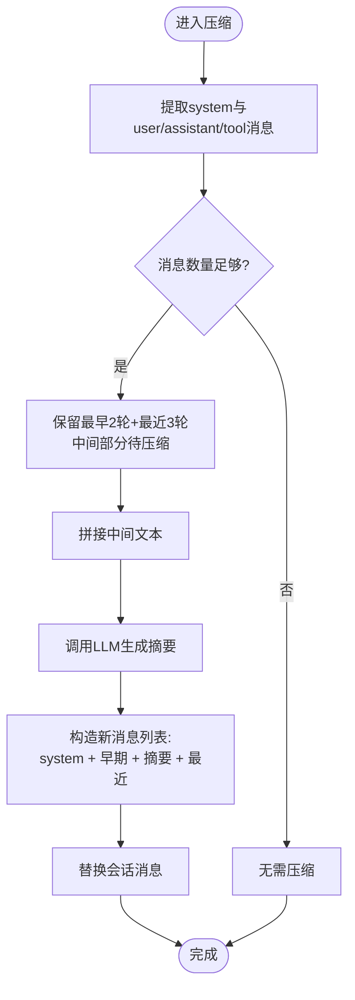
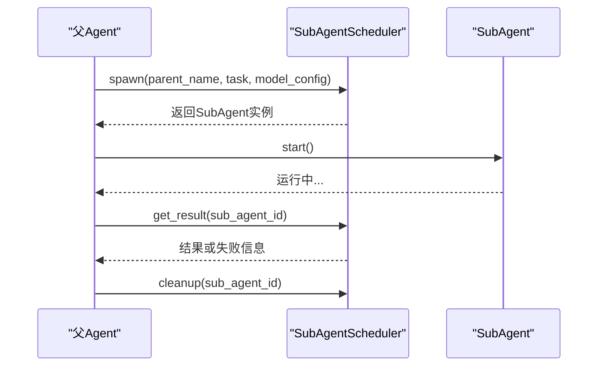
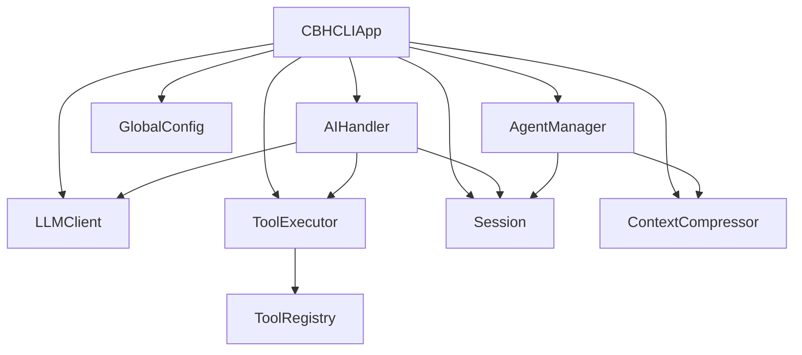

# Agent概念与架构

<cite>
**本文引用的文件**
- [app.py](file://cbhcli_pkg/core/app.py)
- [agent.py](file://cbhcli_pkg/core/agent.py)
- [session.py](file://cbhcli_pkg/core/session.py)
- [model.py](file://cbhcli_pkg/core/model.py)
- [ai_handler.py](file://cbhcli_pkg/core/ai_handler.py)
- [tool_executor.py](file://cbhcli_pkg/core/tool_executor.py)
- [registry.py](file://cbhcli_pkg/tools/registry.py)
- [global_config.py](file://cbhcli_pkg/config/global_config.py)
- [constants.py](file://cbhcli_pkg/core/constants.py)
- [compressor.py](file://cbhcli_pkg/context/compressor.py)
- [token_counter.py](file://cbhcli_pkg/context/token_counter.py)
- [subagent.py](file://cbhcli_pkg/core/subagent.py)
- [agent_cmd.py](file://cbhcli_pkg/commands/agent_cmd.py)
</cite>

## 目录
1. [简介](#简介)
2. [项目结构](#项目结构)
3. [核心组件](#核心组件)
4. [架构总览](#架构总览)
5. [详细组件分析](#详细组件分析)
6. [依赖关系分析](#依赖关系分析)
7. [性能考量](#性能考量)
8. [故障排查指南](#故障排查指南)
9. [结论](#结论)
10. [附录](#附录)

## 简介
本文件系统性阐述CBHCLI中Agent的概念与架构，重点覆盖以下方面：
- Agent的核心概念与职责：独立工作空间、人格配置、上下文管理与生命周期
- Agent与模型、会话、工具系统的集成关系
- Agent配置文件结构与作用（config.json、技能描述、性格设定等）
- Agent隔离机制与资源共享策略
- Agent架构图与组件关系图
- 性能影响因素与最佳实践建议

## 项目结构
CBHCLI采用“核心模块 + 工具系统 + 上下文管理 + 命令系统”的分层组织方式。Agent相关逻辑集中在core子包中，并通过commands模块对外暴露管理命令。

图表来源
- [app.py:54-280](file://cbhcli_pkg/core/app.py#L54-L280)
- [agent.py:572-762](file://cbhcli_pkg/core/agent.py#L572-L762)
- [session.py:37-190](file://cbhcli_pkg/core/session.py#L37-L190)
- [model.py:7-147](file://cbhcli_pkg/core/model.py#L7-L147)
- [ai_handler.py:21-743](file://cbhcli_pkg/core/ai_handler.py#L21-L743)
- [tool_executor.py:15-168](file://cbhcli_pkg/core/tool_executor.py#L15-L168)
- [registry.py:51-115](file://cbhcli_pkg/tools/registry.py#L51-L115)
- [global_config.py:13-154](file://cbhcli_pkg/config/global_config.py#L13-L154)
- [compressor.py:7-112](file://cbhcli_pkg/context/compressor.py#L7-L112)
- [token_counter.py:14-88](file://cbhcli_pkg/context/token_counter.py#L14-L88)
- [subagent.py:55-118](file://cbhcli_pkg/core/subagent.py#L55-L118)
- [agent_cmd.py:5-181](file://cbhcli_pkg/commands/agent_cmd.py#L5-L181)

章节来源
- [app.py:54-280](file://cbhcli_pkg/core/app.py#L54-L280)
- [agent.py:572-762](file://cbhcli_pkg/core/agent.py#L572-L762)
- [agent_cmd.py:5-181](file://cbhcli_pkg/commands/agent_cmd.py#L5-L181)

## 核心组件
- AgentManager：负责Agent工作空间创建、配置加载/保存、人格文件加载、Agent列表与删除、以及记忆更新。
- AgentConfig/AgentPersona：前者描述Agent的配置项（如上下文压缩阈值、首选模型、最大工具调用次数等），后者从MD文件构建系统提示，包含技能、性格、工具使用指南、长期记忆与使用说明。
- Session/ContextWindow：会话消息管理与上下文窗口控制，跟踪token用量并决定是否压缩。
- LLMClient：统一的LLM API封装，支持非流式与流式聊天、嵌入向量获取。
- AIHandler：处理AI请求，负责流式输出、工具调用提取与执行、多轮工具调用协调。
- ToolExecutor/ToolRegistry：工具注册与执行，支持确认机制、详细/简洁输出模式、回调钩子。
- ContextCompressor：基于摘要的上下文压缩，减少token占用。
- TokenCounter：Token计数器，支持tiktoken精确计数与降级估算。
- SubAgentScheduler：临时子Agent的创建、调度与清理。
- GlobalConfig：全局配置（模型、嵌入/重排序模型、Agent默认与当前激活、工作空间路径等）。
- SlashCommandParser与agent_cmd：/agent命令的注册与交互式菜单。

章节来源
- [agent.py:476-570](file://cbhcli_pkg/core/agent.py#L476-L570)
- [session.py:37-190](file://cbhcli_pkg/core/session.py#L37-L190)
- [model.py:7-147](file://cbhcli_pkg/core/model.py#L7-L147)
- [ai_handler.py:21-743](file://cbhcli_pkg/core/ai_handler.py#L21-L743)
- [tool_executor.py:15-168](file://cbhcli_pkg/core/tool_executor.py#L15-L168)
- [registry.py:51-115](file://cbhcli_pkg/tools/registry.py#L51-L115)
- [compressor.py:7-112](file://cbhcli_pkg/context/compressor.py#L7-L112)
- [token_counter.py:14-88](file://cbhcli_pkg/context/token_counter.py#L14-L88)
- [subagent.py:55-118](file://cbhcli_pkg/core/subagent.py#L55-L118)
- [global_config.py:13-154](file://cbhcli_pkg/config/global_config.py#L13-L154)
- [agent_cmd.py:5-181](file://cbhcli_pkg/commands/agent_cmd.py#L5-L181)

## 架构总览
下图展示Agent在系统中的角色与各组件之间的交互关系：

图表来源
- [app.py:54-280](file://cbhcli_pkg/core/app.py#L54-L280)
- [agent.py:572-762](file://cbhcli_pkg/core/agent.py#L572-L762)
- [ai_handler.py:21-743](file://cbhcli_pkg/core/ai_handler.py#L21-L743)
- [tool_executor.py:15-168](file://cbhcli_pkg/core/tool_executor.py#L15-L168)
- [compressor.py:7-112](file://cbhcli_pkg/context/compressor.py#L7-L112)

## 详细组件分析

### Agent生命周期管理
Agent生命周期从创建到销毁的完整流程如下：
- 创建：AgentManager在工作空间根目录下创建Agent专属目录、知识库目录与初始MD文件（skills/soul/tools/memory/usage），并保存config.json。
- 加载：应用启动时加载全局配置，初始化AgentManager；随后加载当前Agent配置与人格，建立LLMClient、会话历史、MCP管理器与上下文压缩器；必要时索引Agent工作空间。
- 会话与上下文：每次新会话时，系统构建系统提示（包含长期记忆与使用说明），初始化ContextWindow并跟踪token用量；接近阈值时自动压缩。
- 请求处理：用户输入经AIHandler流式获取响应，提取工具调用并执行，将结果注入会话；多轮工具调用受轮次上限约束。
- 切换与删除：通过/agent命令进行交互式切换；删除时保护main Agent与当前激活Agent。
- 销毁：Agent删除即销毁其工作空间；会话历史持久化至history目录。

图表来源
- [agent_cmd.py:99-130](file://cbhcli_pkg/commands/agent_cmd.py#L99-L130)
- [agent.py:585-624](file://cbhcli_pkg/core/agent.py#L585-L624)
- [app.py:231-279](file://cbhcli_pkg/core/app.py#L231-L279)
- [ai_handler.py:51-96](file://cbhcli_pkg/core/ai_handler.py#L51-L96)
- [tool_executor.py:54-91](file://cbhcli_pkg/core/tool_executor.py#L54-L91)

章节来源
- [agent_cmd.py:99-130](file://cbhcli_pkg/commands/agent_cmd.py#L99-L130)
- [agent.py:585-624](file://cbhcli_pkg/core/agent.py#L585-L624)
- [app.py:231-279](file://cbhcli_pkg/core/app.py#L231-L279)
- [ai_handler.py:51-96](file://cbhcli_pkg/core/ai_handler.py#L51-L96)
- [tool_executor.py:54-91](file://cbhcli_pkg/core/tool_executor.py#L54-L91)

### Agent配置文件结构与作用
Agent工作空间包含以下关键文件：
- config.json：Agent配置，字段包括名称、描述、首选模型、上下文压缩阈值比例、自动压缩开关、最大工具调用次数、创建时间等。
- skills.md：Agent技能描述模板，用于系统提示中的“技能”部分。
- soul.md：Agent性格特征模板，用于系统提示中的“性格”部分。
- tools.md：工具使用指南模板，包含可用工具说明与调用格式规范。
- memory.md：长期记忆文件，始终包含在系统提示中，仅在用户明确要求时写入。
- usage.md：使用说明，包含斜杠命令、工具调用格式、工作空间与知识库说明等。
- knowledge/：知识库目录，存放Agent可检索的文档与代码片段。
- history/：会话历史目录，自动保存历史会话。

AgentManager负责创建与读取这些文件，并将内容组装为AgentPersona，最终构建系统提示。

章节来源
- [agent.py:9-62](file://cbhcli_pkg/core/agent.py#L9-L62)
- [agent.py:476-570](file://cbhcli_pkg/core/agent.py#L476-L570)
- [agent.py:626-685](file://cbhcli_pkg/core/agent.py#L626-L685)

### Agent与模型、会话、工具系统的集成
- 模型集成：LLMClient封装统一API调用，支持流式与非流式响应；AIHandler在每轮请求中传递上下文消息并接收增量输出。
- 会话与上下文：Session维护消息列表与token计数；ContextWindow跟踪使用率并在接近阈值时触发压缩；ContextCompressor通过摘要保留关键对话信息。
- 工具系统：ToolRegistry集中管理工具；ToolExecutor负责执行前确认、执行与结果展示，并支持回调钩子；AIHandler提取工具调用并协调多轮执行。

图表来源
- [agent.py:476-570](file://cbhcli_pkg/core/agent.py#L476-L570)
- [session.py:37-190](file://cbhcli_pkg/core/session.py#L37-L190)
- [compressor.py:7-112](file://cbhcli_pkg/context/compressor.py#L7-L112)
- [model.py:7-147](file://cbhcli_pkg/core/model.py#L7-L147)
- [ai_handler.py:21-743](file://cbhcli_pkg/core/ai_handler.py#L21-L743)
- [tool_executor.py:15-168](file://cbhcli_pkg/core/tool_executor.py#L15-L168)
- [registry.py:51-115](file://cbhcli_pkg/tools/registry.py#L51-L115)

章节来源
- [model.py:7-147](file://cbhcli_pkg/core/model.py#L7-L147)
- [ai_handler.py:21-743](file://cbhcli_pkg/core/ai_handler.py#L21-L743)
- [tool_executor.py:15-168](file://cbhcli_pkg/core/tool_executor.py#L15-L168)
- [registry.py:51-115](file://cbhcli_pkg/tools/registry.py#L51-L115)
- [compressor.py:7-112](file://cbhcli_pkg/context/compressor.py#L7-L112)

### Agent隔离机制与资源共享策略
- 工作空间隔离：每个Agent拥有独立的工作空间目录，包含各自的config.json、MD文件、knowledge/与history/，实现数据与配置的物理隔离。
- 会话隔离：Session按Agent命名，消息与token统计相互独立；切换Agent时重置会话并重新构建系统提示。
- 工具共享：工具注册中心对所有Agent共享，工具执行器可跨Agent复用；但工具调用结果与会话状态不跨Agent传播。
- 模型与上下文：每个Agent可配置独立模型；上下文压缩器按Agent会话独立运行，避免跨Agent干扰。
- 全局配置：GlobalConfig集中管理模型、嵌入/重排序模型、默认与当前Agent等全局设置，Agent仅继承所需配置。

章节来源
- [agent.py:585-624](file://cbhcli_pkg/core/agent.py#L585-L624)
- [app.py:204-279](file://cbhcli_pkg/core/app.py#L204-L279)
- [global_config.py:13-154](file://cbhcli_pkg/config/global_config.py#L13-L154)

### 上下文压缩算法流程
当会话token用量接近阈值时，系统自动触发压缩流程，将中间轮次对话摘要化，保留早期与近期消息，显著降低token占用。

图表来源
- [compressor.py:21-81](file://cbhcli_pkg/context/compressor.py#L21-L81)

章节来源
- [compressor.py:21-81](file://cbhcli_pkg/context/compressor.py#L21-L81)
- [session.py:127-190](file://cbhcli_pkg/core/session.py#L127-L190)

### 子Agent机制
系统支持临时子Agent的创建与调度，用于并行或异步执行特定任务，完成后清理资源。

图表来源
- [subagent.py:61-114](file://cbhcli_pkg/core/subagent.py#L61-L114)

章节来源
- [subagent.py:61-114](file://cbhcli_pkg/core/subagent.py#L61-L114)

## 依赖关系分析
- 组件耦合：AIHandler与LLMClient、Session、ToolExecutor紧密耦合；AgentManager与AgentConfig/Persona、Session、ContextCompressor耦合；App层负责装配与调度。
- 外部依赖：LLMClient依赖HTTP会话；TokenCounter可选依赖tiktoken；向量搜索功能依赖嵌入与重排序模型配置。
- 命令系统：SlashCommandParser集中注册命令，agent_cmd提供交互式菜单与操作路由。

图表来源
- [app.py:54-280](file://cbhcli_pkg/core/app.py#L54-L280)
- [agent.py:572-762](file://cbhcli_pkg/core/agent.py#L572-L762)
- [ai_handler.py:21-743](file://cbhcli_pkg/core/ai_handler.py#L21-L743)
- [tool_executor.py:15-168](file://cbhcli_pkg/core/tool_executor.py#L15-L168)

章节来源
- [app.py:54-280](file://cbhcli_pkg/core/app.py#L54-L280)
- [agent.py:572-762](file://cbhcli_pkg/core/agent.py#L572-L762)
- [ai_handler.py:21-743](file://cbhcli_pkg/core/ai_handler.py#L21-L743)
- [tool_executor.py:15-168](file://cbhcli_pkg/core/tool_executor.py#L15-L168)

## 性能考量
- Token计数精度：优先使用tiktoken精确计数，降级时采用字符估算，避免过度压缩或溢出。
- 上下文压缩阈值：DEFAULT_COMPRESSION_RATIO默认0.8，可根据模型上下文长度调整；过低会频繁压缩，过高可能导致溢出。
- 工具调用轮次上限：MAX_TOOL_ROUNDS限制多轮工具调用，防止长时间阻塞。
- 流式输出：LLMClient支持流式响应，提升用户体验；AIHandler增量清理文本，减少渲染压力。
- 向量搜索：嵌入与重排序模型配置可选，未配置时仍可使用文本匹配与历史恢复功能。

章节来源
- [constants.py:6-22](file://cbhcli_pkg/core/constants.py#L6-L22)
- [token_counter.py:14-88](file://cbhcli_pkg/context/token_counter.py#L14-L88)
- [model.py:7-147](file://cbhcli_pkg/core/model.py#L7-L147)
- [ai_handler.py:98-216](file://cbhcli_pkg/core/ai_handler.py#L98-L216)

## 故障排查指南
- Agent加载失败：检查Agent工作空间是否存在config.json；确认首选模型配置有效。
- 模型未配置：/model命令添加并选择模型；LLMClient初始化失败时需检查URL、API Key与模型ID。
- 工具执行异常：查看ToolExecutor输出的错误信息；确认工具名称与参数格式符合规范。
- 上下文溢出：启用自动压缩或手动压缩；检查上下文阈值设置；减少长历史会话。
- 向量搜索不可用：确认嵌入模型已配置并手动触发索引；检查知识库文件是否正确添加。

章节来源
- [app.py:231-279](file://cbhcli_pkg/core/app.py#L231-L279)
- [agent_cmd.py:154-180](file://cbhcli_pkg/commands/agent_cmd.py#L154-L180)
- [tool_executor.py:142-159](file://cbhcli_pkg/core/tool_executor.py#L142-L159)
- [compressor.py:83-112](file://cbhcli_pkg/context/compressor.py#L83-L112)

## 结论
CBHCLI的Agent体系通过独立工作空间、可插拔的人格配置与严谨的上下文管理，实现了灵活、可扩展且高性能的智能代理。结合工具系统与多轮工具调用机制，Agent能够高效完成复杂任务；同时通过子Agent与向量搜索增强，进一步提升任务并行性与知识检索能力。遵循本文的最佳实践与故障排查建议，可获得稳定可靠的使用体验。

## 附录
- 常用斜杠命令（摘自usage.md模板）：/agent、/model、/new、/resume、/history、/ctx、/comp、/embedding、/kb等。
- 工具调用格式：支持DSML标签、Python函数调用、JSON格式等多种形式，强调每次仅调用一个工具。

章节来源
- [agent.py:226-473](file://cbhcli_pkg/core/agent.py#L226-L473)