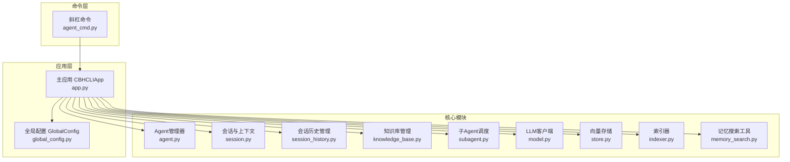
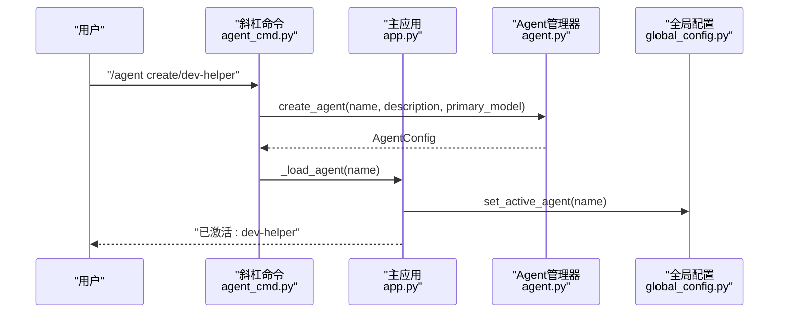
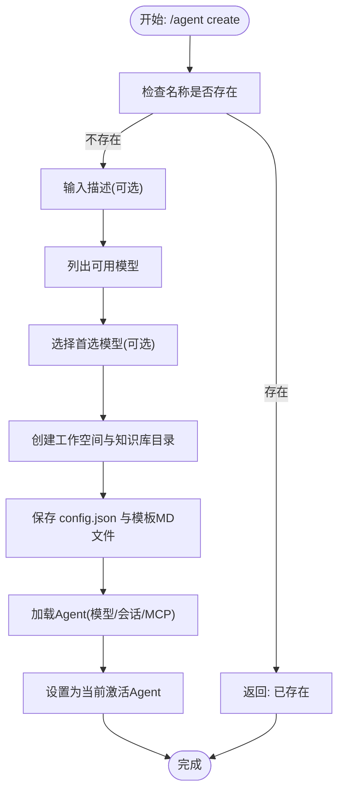
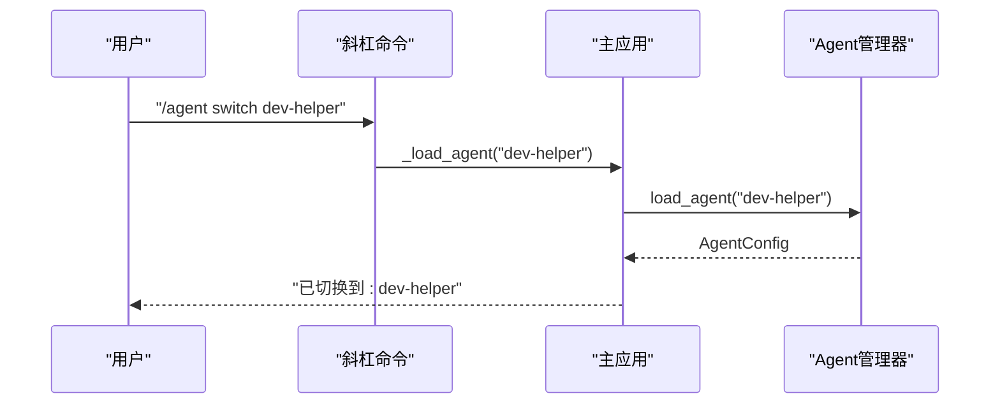
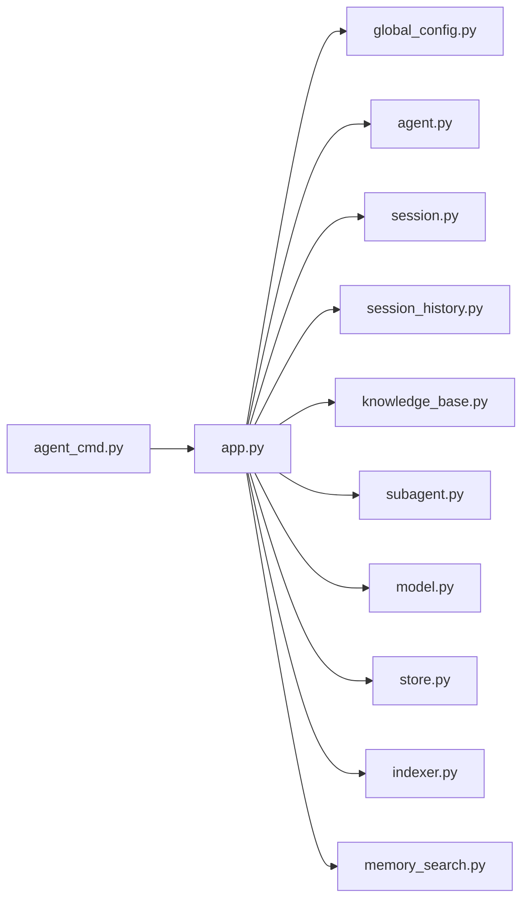

# Agent管理

<cite>
**本文引用的文件**
- [README.md](file://README.md)
- [agent_cmd.py](file://cbhcli_pkg/commands/agent_cmd.py)
- [global_config.py](file://cbhcli_pkg/config/global_config.py)
- [app.py](file://cbhcli_pkg/core/app.py)
- [agent.py](file://cbhcli_pkg/core/agent.py)
- [session.py](file://cbhcli_pkg/core/session.py)
- [session_history.py](file://cbhcli_pkg/core/session_history.py)
- [knowledge_base.py](file://cbhcli_pkg/core/knowledge_base.py)
- [subagent.py](file://cbhcli_pkg/core/subagent.py)
- [model.py](file://cbhcli_pkg/core/model.py)
- [store.py](file://cbhcli_pkg/vector/store.py)
- [indexer.py](file://cbhcli_pkg/vector/indexer.py)
- [memory_search.py](file://cbhcli_pkg/tools/memory_search.py)
</cite>

## 目录
1. [简介](#简介)
2. [项目结构](#项目结构)
3. [核心组件](#核心组件)
4. [架构总览](#架构总览)
5. [详细组件分析](#详细组件分析)
6. [依赖分析](#依赖分析)
7. [性能考量](#性能考量)
8. [故障排除指南](#故障排除指南)
9. [结论](#结论)
10. [附录](#附录)

## 简介
本文件系统性阐述 CBHCLI 中的 Agent 管理体系，涵盖 Agent 概念与核心作用、独立工作空间与人格配置、创建流程与初始设置、工作空间组织结构、切换机制与多 Agent 协作、最佳实践与安全考虑、删除与备份恢复、配置文件格式与字段、知识库与会话历史管理、性能优化与资源管理、以及故障排除与调试方法。目标是帮助不同技术背景的用户高效、安全地使用与维护多 Agent 系统。

## 项目结构
CBHCLI 的 Agent 管理围绕“全局配置”“应用主控”“Agent 管理器”“工作空间”“会话与历史”“向量索引与检索”“工具与子 Agent”等模块协同工作。整体采用“命令层-应用层-核心模块层”的分层设计，命令通过斜杠命令入口进入，应用层负责生命周期与上下文管理，核心模块负责具体功能实现。

图示来源
- [agent_cmd.py:1-181](file://cbhcli_pkg/commands/agent_cmd.py#L1-L181)
- [app.py:54-280](file://cbhcli_pkg/core/app.py#L54-L280)
- [global_config.py:13-154](file://cbhcli_pkg/config/global_config.py#L13-L154)
- [agent.py:572-762](file://cbhcli_pkg/core/agent.py#L572-L762)
- [session.py:37-190](file://cbhcli_pkg/core/session.py#L37-L190)
- [session_history.py:8-136](file://cbhcli_pkg/core/session_history.py#L8-L136)
- [knowledge_base.py:7-207](file://cbhcli_pkg/core/knowledge_base.py#L7-L207)
- [subagent.py:17-118](file://cbhcli_pkg/core/subagent.py#L17-L118)
- [model.py:7-147](file://cbhcli_pkg/core/model.py#L7-L147)
- [store.py:37-175](file://cbhcli_pkg/vector/store.py#L37-L175)
- [indexer.py:7-178](file://cbhcli_pkg/vector/indexer.py#L7-L178)
- [memory_search.py:6-177](file://cbhcli_pkg/tools/memory_search.py#L6-L177)

章节来源
- [README.md:269-295](file://README.md#L269-L295)
- [app.py:54-280](file://cbhcli_pkg/core/app.py#L54-L280)

## 核心组件
- 全局配置 GlobalConfig：集中管理模型、嵌入/重排序模型、Agent 默认与当前激活 Agent、工作空间基路径、上下文压缩策略等。
- Agent 管理器 AgentManager：负责 Agent 的创建工作、配置持久化、工作空间初始化、人格文件加载、Agent 列表与删除、记忆更新等。
- 主应用 CBHCLIApp：负责初始化全局配置、工具系统、向量存储、命令注册、Agent 生命周期、会话与上下文窗口、MCP 管理器、会话历史保存与恢复、上下文压缩与自动压缩。
- 会话与上下文 Session/ContextWindow：管理消息、token 统计、上下文压缩阈值与状态展示。
- 会话历史管理 SessionHistoryManager：保存/列出/加载/删除历史会话，文件命名与元数据结构清晰。
- 知识库管理 KnowledgeBase：为 Agent 提供知识库目录、文件增删、批量索引、重新索引等能力。
- 子 Agent 调度 SubAgentScheduler：临时子 Agent 的创建、状态管理、结果等待与清理。
- LLM 客户端 LLMClient：统一 API 调用封装，支持流式与非流式响应。
- 向量存储与索引 VectorStore/Indexer：ChromaDB 封装与自定义嵌入函数，按 Agent 分集合存储，支持增量/全量索引。
- 记忆搜索工具 MemorySearchTool：基于向量检索或降级文本匹配，支持指定 Agent 与 top_k 返回。

章节来源
- [global_config.py:13-154](file://cbhcli_pkg/config/global_config.py#L13-L154)
- [agent.py:572-762](file://cbhcli_pkg/core/agent.py#L572-L762)
- [app.py:204-331](file://cbhcli_pkg/core/app.py#L204-L331)
- [session.py:37-190](file://cbhcli_pkg/core/session.py#L37-L190)
- [session_history.py:8-136](file://cbhcli_pkg/core/session_history.py#L8-L136)
- [knowledge_base.py:7-207](file://cbhcli_pkg/core/knowledge_base.py#L7-L207)
- [subagent.py:17-118](file://cbhcli_pkg/core/subagent.py#L17-L118)
- [model.py:7-147](file://cbhcli_pkg/core/model.py#L7-L147)
- [store.py:37-175](file://cbhcli_pkg/vector/store.py#L37-L175)
- [indexer.py:7-178](file://cbhcli_pkg/vector/indexer.py#L7-L178)
- [memory_search.py:6-177](file://cbhcli_pkg/tools/memory_search.py#L6-L177)

## 架构总览
Agent 管理贯穿命令入口、应用初始化、Agent 加载、会话构建、工具执行、上下文压缩与历史保存、向量索引与检索等环节。命令层通过斜杠命令触发，应用层协调各模块，核心模块各自承担职责并通过文件系统与向量数据库进行持久化与检索。

图示来源
- [agent_cmd.py:99-129](file://cbhcli_pkg/commands/agent_cmd.py#L99-L129)
- [agent.py:585-624](file://cbhcli_pkg/core/agent.py#L585-L624)
- [app.py:231-279](file://cbhcli_pkg/core/app.py#L231-L279)
- [global_config.py:97-100](file://cbhcli_pkg/config/global_config.py#L97-L100)

## 详细组件分析

### Agent 概念与核心作用
- Agent 是独立的 AI 助手，拥有自己的工作空间、人格配置、工具使用指南、长期记忆与知识库，并可独立绑定首选模型。
- 每个 Agent 的系统提示由“基本信息、长期记忆、使用说明、技能、性格、工具使用指南、可用工具”构成，确保行为一致与可预期。
- 主默认 Agent “main”在应用初始化时自动创建并激活，作为兜底 Agent。

章节来源
- [agent.py:515-569](file://cbhcli_pkg/core/agent.py#L515-L569)
- [app.py:204-229](file://cbhcli_pkg/core/app.py#L204-L229)

### Agent 工作空间与组织结构
- 工作空间位于 ~/.cbhcli/agents/<agent_name>/，包含：
  - config.json：Agent 配置（名称、描述、首选模型、上下文压缩阈值、工具调用上限、创建时间等）
  - skills.md：技能描述
  - soul.md：性格设定
  - tools.md：工具使用指南
  - memory.md：长期记忆（用户明确要求记录的内容）
  - usage.md：使用说明（包含斜杠命令与工具调用规范）
  - history/：会话历史（自动保存）
  - knowledge/：知识库目录（文件会被索引到向量数据库）

章节来源
- [README.md:192-206](file://README.md#L192-L206)
- [agent.py:617-623](file://cbhcli_pkg/core/agent.py#L617-L623)
- [session_history.py:16-22](file://cbhcli_pkg/core/session_history.py#L16-L22)

### Agent 创建流程
- 命令入口：/agent create <name>
- 交互式输入：描述、模型选择（可选）
- AgentManager 创建工作空间、知识库目录、配置文件与模板 MD 文件
- 应用层加载 Agent（含模型与会话），并设置为当前激活 Agent

图示来源
- [agent_cmd.py:99-129](file://cbhcli_pkg/commands/agent_cmd.py#L99-L129)
- [agent.py:585-624](file://cbhcli_pkg/core/agent.py#L585-L624)
- [app.py:231-279](file://cbhcli_pkg/core/app.py#L231-L279)

章节来源
- [agent_cmd.py:20-40](file://cbhcli_pkg/commands/agent_cmd.py#L20-L40)
- [agent.py:585-624](file://cbhcli_pkg/core/agent.py#L585-L624)

### Agent 切换机制与多 Agent 协作
- 切换命令：/agent switch <name>
- 应用层卸载当前 Agent 并加载目标 Agent，重建会话、上下文窗口、MCP 管理器与会话历史管理器
- 子 Agent：临时子任务以独立 Session 执行，父 Agent 通过调度器管理其生命周期与结果

图示来源
- [agent_cmd.py:154-161](file://cbhcli_pkg/commands/agent_cmd.py#L154-L161)
- [agent.py:727-737](file://cbhcli_pkg/core/agent.py#L727-L737)
- [app.py:231-279](file://cbhcli_pkg/core/app.py#L231-L279)

章节来源
- [agent_cmd.py:28-32](file://cbhcli_pkg/commands/agent_cmd.py#L28-L32)
- [app.py:231-279](file://cbhcli_pkg/core/app.py#L231-L279)
- [subagent.py:55-118](file://cbhcli_pkg/core/subagent.py#L55-L118)

### Agent 删除与备份恢复
- 删除限制：禁止删除主默认 Agent “main”，禁止删除当前激活的 Agent
- 删除流程：交互式确认后，删除工作空间目录
- 备份建议：直接复制 ~/.cbhcli/agents/<agent_name>/ 目录；恢复时将备份目录放回原位并重新加载

章节来源
- [agent_cmd.py:164-180](file://cbhcli_pkg/commands/agent_cmd.py#L164-L180)
- [agent.py:707-725](file://cbhcli_pkg/core/agent.py#L707-L725)

### Agent 配置文件格式与字段
- config.json 字段
  - name：Agent 名称
  - description：描述
  - primary_model：首选模型名称（可选）
  - context_limit_ratio：上下文压缩阈值比例（默认 0.8）
  - auto_compress：是否自动压缩（默认 true）
  - max_tool_calls：最大工具调用次数（默认 100）
  - created_at：创建时间（ISO 8601）

章节来源
- [agent.py:476-512](file://cbhcli_pkg/core/agent.py#L476-L512)
- [agent.py:739-743](file://cbhcli_pkg/core/agent.py#L739-L743)

### 知识库与会话历史管理
- 知识库
  - 目录：knowledge/
  - 支持添加/删除/列出文件，自动索引到向量数据库
  - 重新索引：遍历目录并重建索引
- 会话历史
  - 保存：/new 或 /reset 时自动保存为 JSON 文件
  - 列表：/history 或 /resume 列出
  - 恢复：/resume <编号/文件名> 加载
  - 删除：/resume delete <文件名>

章节来源
- [knowledge_base.py:31-149](file://cbhcli_pkg/core/knowledge_base.py#L31-L149)
- [session_history.py:24-136](file://cbhcli_pkg/core/session_history.py#L24-L136)

### 向量索引与检索
- 索引范围：skills.md、soul.md、tools.md、usage.md、memory.md（始终包含在系统提示）、knowledge/ 下的文本类文件
- 索引触发：/embedding index（手动，避免启动时大量 API 调用）
- 检索：memory_search 工具基于向量检索，未配置嵌入模型时降级为 memory.md 文本匹配
- 集合命名：agent_<agent_name>，按 Agent 分离

章节来源
- [README.md:208-229](file://README.md#L208-L229)
- [indexer.py:37-69](file://cbhcli_pkg/vector/indexer.py#L37-L69)
- [memory_search.py:47-103](file://cbhcli_pkg/tools/memory_search.py#L47-L103)
- [store.py:79-97](file://cbhcli_pkg/vector/store.py#L79-L97)

### 子 Agent 机制
- 用途：父 Agent 派生临时子任务，独立 Session 执行，完成后返回结果或失败信息
- 状态：PENDING/RUNNING/COMPLETED/FAILED
- 调度：spawn 创建、get_result 等待、cleanup 清理

章节来源
- [subagent.py:17-118](file://cbhcli_pkg/core/subagent.py#L17-L118)

### 工具与执行
- 工具注册与执行：ToolExecutor 负责工具调用前确认、执行与结果展示
- 工具调用格式：JSON/函数调用/完整 JSON，严格限制一次仅一个工具调用
- 记忆更新：会话历史在重置时自动保存，memory.md 仅在用户明确要求时写入

章节来源
- [agent.py:66-210](file://cbhcli_pkg/core/agent.py#L66-L210)
- [app.py:422-447](file://cbhcli_pkg/core/app.py#L422-L447)
- [tool_executor.py:15-168](file://cbhcli_pkg/core/tool_executor.py#L15-L168)

## 依赖分析
- 命令层依赖应用层与 Agent 管理器，应用层依赖全局配置、会话、历史、知识库、子 Agent、模型与向量模块
- 向量模块依赖嵌入客户端，索引器依赖向量存储
- 记忆搜索工具依赖向量存储或降级至 memory.md

图示来源
- [agent_cmd.py:1-181](file://cbhcli_pkg/commands/agent_cmd.py#L1-L181)
- [app.py:1-478](file://cbhcli_pkg/core/app.py#L1-L478)
- [global_config.py:1-154](file://cbhcli_pkg/config/global_config.py#L1-L154)
- [agent.py:1-762](file://cbhcli_pkg/core/agent.py#L1-L762)
- [session.py:1-190](file://cbhcli_pkg/core/session.py#L1-L190)
- [session_history.py:1-136](file://cbhcli_pkg/core/session_history.py#L1-L136)
- [knowledge_base.py:1-207](file://cbhcli_pkg/core/knowledge_base.py#L1-L207)
- [subagent.py:1-118](file://cbhcli_pkg/core/subagent.py#L1-L118)
- [model.py:1-147](file://cbhcli_pkg/core/model.py#L1-L147)
- [store.py:1-175](file://cbhcli_pkg/vector/store.py#L1-L175)
- [indexer.py:1-178](file://cbhcli_pkg/vector/indexer.py#L1-L178)
- [memory_search.py:1-177](file://cbhcli_pkg/tools/memory_search.py#L1-L177)

## 性能考量
- 上下文压缩：根据模型上下文限制与阈值比例动态压缩，减少 Token 使用，提升响应效率
- 向量索引：手动触发，避免启动时大量 API 调用；索引前删除旧集合，确保内容一致性
- 工具调用：严格限制单次工具调用，避免长链路阻塞
- 会话历史：定期清理不再需要的历史会话，释放磁盘空间
- 模型选择：为不同任务选择合适上下文长度与成本的模型，避免不必要的大模型调用

章节来源
- [app.py:361-384](file://cbhcli_pkg/core/app.py#L361-L384)
- [indexer.py:48-69](file://cbhcli_pkg/vector/indexer.py#L48-L69)
- [agent.py:177-196](file://cbhcli_pkg/core/agent.py#L177-L196)

## 故障排除指南
- Agent 未配置模型
  - 现象：提示“当前 Agent 未配置模型”
  - 处理：使用 /model 命令添加并选择模型
- 记忆搜索无结果
  - 现象：memory_search 返回未找到
  - 处理：确认已配置嵌入模型并执行 /embedding index；若未配置，工具将降级为 memory.md 文本匹配
- 会话历史无法恢复
  - 现象：/resume 无法找到或加载历史
  - 处理：检查 history/ 目录与文件名，确认 JSON 格式有效
- 删除失败
  - 现象：无法删除 Agent
  - 处理：确认非 “main” 且非当前激活 Agent，按提示确认删除

章节来源
- [app.py:410-413](file://cbhcli_pkg/core/app.py#L410-L413)
- [memory_search.py:70-103](file://cbhcli_pkg/tools/memory_search.py#L70-L103)
- [session_history.py:99-136](file://cbhcli_pkg/core/session_history.py#L99-L136)
- [agent_cmd.py:164-180](file://cbhcli_pkg/commands/agent_cmd.py#L164-L180)

## 结论
CBHCLI 的 Agent 管理以“独立工作空间 + 人格配置 + 工具与知识库 + 会话历史 + 向量检索”为核心，通过清晰的命令入口与应用层编排，实现了多 Agent 的灵活切换与协作。结合上下文压缩、手动索引与严格的工具调用规范，系统在安全性与性能之间取得平衡。遵循本文的最佳实践与故障排除建议，可高效、稳定地管理与扩展 Agent 生态。

## 附录

### 最佳实践与安全考虑
- 为每个 Agent 明确技能、性格与工具使用指南，避免越权工具调用
- 严格限制工具调用格式与频率，避免误操作
- 定期备份 ~/.cbhcli/agents/<agent_name>/ 目录
- 合理设置 context_limit_ratio 与 auto_compress，避免频繁压缩导致上下文丢失
- 使用 /model 命令为不同任务选择合适模型，控制成本

### 安全建议
- 仅在必要时授予工具权限，避免执行高风险命令
- 对 memory.md 的写入保持审慎，确保用户明确授权
- 定期审计 history/ 与 knowledge/ 目录，清理敏感信息