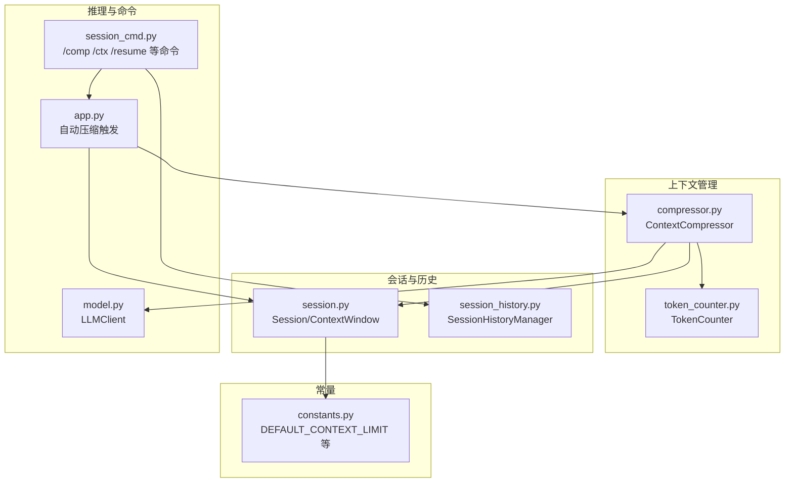
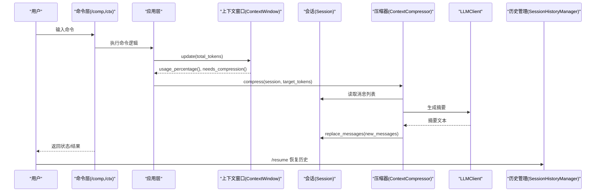
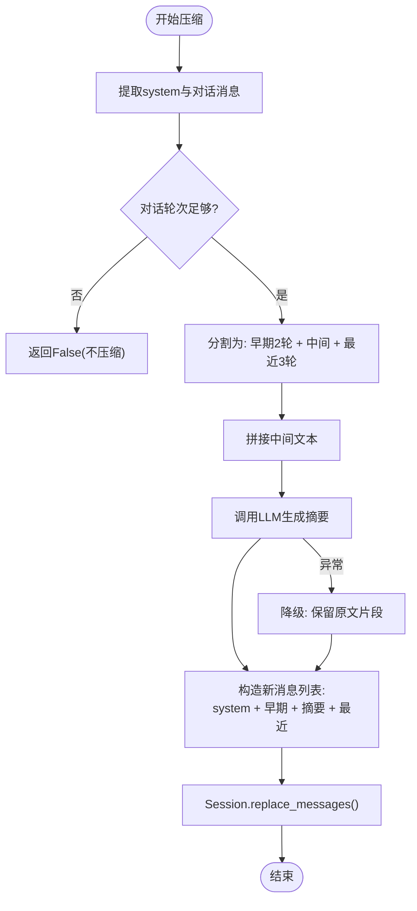
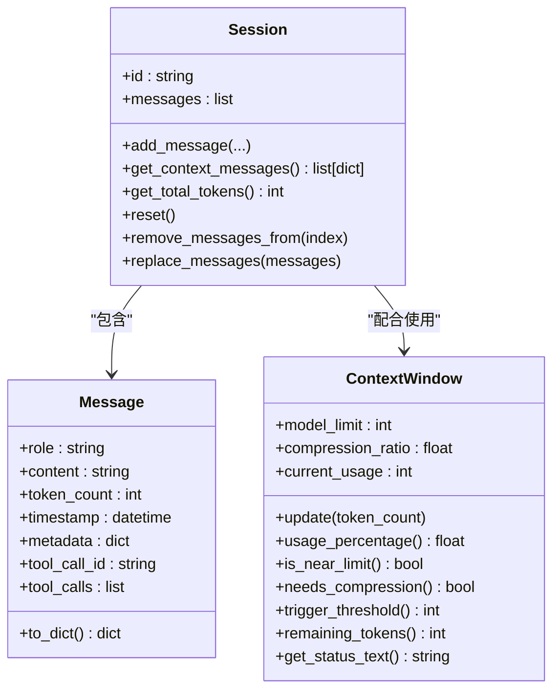
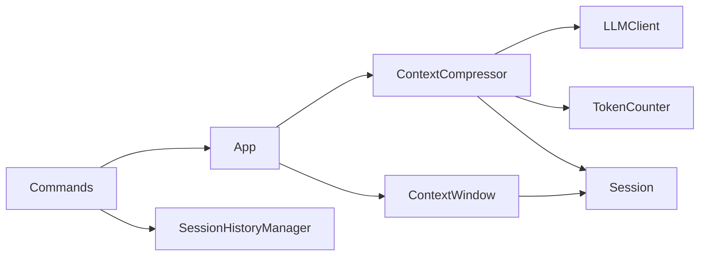

# 上下文压缩

<cite>
**本文引用的文件**
- [compressor.py](file://cbhcli_pkg/context/compressor.py)
- [token_counter.py](file://cbhcli_pkg/context/token_counter.py)
- [session.py](file://cbhcli_pkg/core/session.py)
- [session_history.py](file://cbhcli_pkg/core/session_history.py)
- [model.py](file://cbhcli_pkg/core/model.py)
- [session_cmd.py](file://cbhcli_pkg/commands/session_cmd.py)
- [app.py](file://cbhcli_pkg/core/app.py)
- [constants.py](file://cbhcli_pkg/core/constants.py)
</cite>

## 目录
1. [简介](#简介)
2. [项目结构](#项目结构)
3. [核心组件](#核心组件)
4. [架构总览](#架构总览)
5. [详细组件分析](#详细组件分析)
6. [依赖关系分析](#依赖关系分析)
7. [性能考量](#性能考量)
8. [故障排查指南](#故障排查指南)
9. [结论](#结论)
10. [附录](#附录)

## 简介
本文件系统化阐述上下文压缩系统的设计与实现，覆盖以下关键主题：
- 上下文压缩的必要性与触发条件
- 压缩策略与算法原理（消息筛选、重要性评估、冗余去除）
- 方法使用场景与参数要求（remove_messages_from() 与 replace_messages()）
- 数据完整性保护与消息链维护
- 压缩阈值设置对效果的影响与调优策略
- 最佳实践（时机选择、比例控制、性能优化）
- 与会话历史的关系与数据恢复机制
- 压缩失败的处理与回滚策略

## 项目结构
上下文压缩相关模块分布于以下位置：
- 上下文压缩器：cbhcli_pkg/context/compressor.py
- Token计数器：cbhcli_pkg/context/token_counter.py
- 会话与上下文窗口：cbhcli_pkg/core/session.py
- 会话历史管理：cbhcli_pkg/core/session_history.py
- LLM客户端：cbhcli_pkg/core/model.py
- 会话命令入口：cbhcli_pkg/commands/session_cmd.py
- 应用主流程与自动压缩：cbhcli_pkg/core/app.py
- 常量定义：cbhcli_pkg/core/constants.py

图表来源
- [compressor.py:1-112](file://cbhcli_pkg/context/compressor.py#L1-L112)
- [token_counter.py:1-88](file://cbhcli_pkg/context/token_counter.py#L1-L88)
- [session.py:1-190](file://cbhcli_pkg/core/session.py#L1-L190)
- [session_history.py:1-136](file://cbhcli_pkg/core/session_history.py#L1-L136)
- [model.py:1-147](file://cbhcli_pkg/core/model.py#L1-L147)
- [session_cmd.py:1-183](file://cbhcli_pkg/commands/session_cmd.py#L1-L183)
- [app.py:340-478](file://cbhcli_pkg/core/app.py#L340-L478)
- [constants.py:1-50](file://cbhcli_pkg/core/constants.py#L1-L50)

章节来源
- [compressor.py:1-112](file://cbhcli_pkg/context/compressor.py#L1-L112)
- [token_counter.py:1-88](file://cbhcli_pkg/context/token_counter.py#L1-L88)
- [session.py:1-190](file://cbhcli_pkg/core/session.py#L1-L190)
- [session_history.py:1-136](file://cbhcli_pkg/core/session_history.py#L1-L136)
- [model.py:1-147](file://cbhcli_pkg/core/model.py#L1-L147)
- [session_cmd.py:1-183](file://cbhcli_pkg/commands/session_cmd.py#L1-L183)
- [app.py:340-478](file://cbhcli_pkg/core/app.py#L340-L478)
- [constants.py:1-50](file://cbhcli_pkg/core/constants.py#L1-L50)

## 核心组件
- ContextCompressor：负责执行上下文压缩，提取关键对话轮次，生成摘要并替换中间冗余消息。
- TokenCounter：提供精确或估算的token计数能力，支撑上下文窗口阈值判断与摘要token估算。
- Session/ContextWindow：维护会话消息与上下文使用统计，提供阈值触发与状态查询。
- SessionHistoryManager：提供会话保存、列出、加载与删除功能，支持数据恢复。
- LLMClient：封装LLM API调用，用于生成摘要。
- 命令层：/comp 手动压缩、/ctx 查看上下文状态、/resume 恢复历史会话。
- 应用层：在每次AI请求前检查并自动触发压缩。

章节来源
- [compressor.py:7-112](file://cbhcli_pkg/context/compressor.py#L7-L112)
- [token_counter.py:14-88](file://cbhcli_pkg/context/token_counter.py#L14-L88)
- [session.py:37-190](file://cbhcli_pkg/core/session.py#L37-L190)
- [session_history.py:8-136](file://cbhcli_pkg/core/session_history.py#L8-L136)
- [model.py:7-147](file://cbhcli_pkg/core/model.py#L7-L147)
- [session_cmd.py:5-183](file://cbhcli_pkg/commands/session_cmd.py#L5-L183)
- [app.py:361-385](file://cbhcli_pkg/core/app.py#L361-L385)

## 架构总览
上下文压缩贯穿“检测-决策-执行-反馈”闭环：
- 检测：每次AI请求前统计会话总token，更新上下文窗口使用率。
- 决策：若达到压缩阈值且开启自动压缩，则触发压缩。
- 执行：压缩器保留system消息与两端关键轮次，对中间部分生成摘要并替换。
- 反馈：命令层提供/ctx查看状态，/comp手动触发，/resume恢复历史。

图表来源
- [app.py:361-385](file://cbhcli_pkg/core/app.py#L361-L385)
- [session.py:127-190](file://cbhcli_pkg/core/session.py#L127-L190)
- [compressor.py:21-81](file://cbhcli_pkg/context/compressor.py#L21-L81)
- [model.py:28-58](file://cbhcli_pkg/core/model.py#L28-L58)
- [session_cmd.py:117-182](file://cbhcli_pkg/commands/session_cmd.py#L117-L182)
- [session_history.py:24-136](file://cbhcli_pkg/core/session_history.py#L24-L136)

## 详细组件分析

### ContextCompressor 压缩器
- 设计要点
  - 保留system消息与两端关键轮次，确保指令与最新上下文不丢失。
  - 对中间冗余对话生成摘要，以摘要消息替代原消息，显著降低token占用。
  - 摘要生成采用专用system提示词，强调需求、操作、修改、问题与状态等关键信息。
- 算法流程
  - 提取消息：分离system与user/assistant/tool三类对话消息。
  - 判定：当对话轮次少于阈值时直接返回不压缩。
  - 保留：最早2轮与最近3轮完整保留；中间部分进入压缩。
  - 摘要：拼接中间文本，调用LLM生成摘要；异常时降级保留原文片段。
  - 构造：拼接system+早期+摘要+近期，替换会话消息列表。
- 复杂度与性能
  - 时间复杂度：O(n)（n为对话轮次数），主要消耗在拼接与LLM调用。
  - 空间复杂度：O(n)，用于存储中间文本与摘要。
- 容错与降级
  - LLM调用异常时，返回降级提示并保留原文片段，保证压缩过程可继续。

图表来源
- [compressor.py:21-112](file://cbhcli_pkg/context/compressor.py#L21-L112)

章节来源
- [compressor.py:7-112](file://cbhcli_pkg/context/compressor.py#L7-L112)

### TokenCounter 计数器
- 功能
  - 支持精确计数（优先使用tiktoken，若不可用则估算）。
  - 提供消息列表总token数计算，考虑每条消息的基础开销。
- 估算策略
  - 中文字符按约1.5字符/1 token估算，英文字符按约4字符/1 token估算。
- 使用场景
  - 上下文窗口阈值计算与状态展示。
  - 摘要消息token估算，辅助控制摘要长度。

章节来源
- [token_counter.py:14-88](file://cbhcli_pkg/context/token_counter.py#L14-L88)

### Session/ContextWindow 会话与上下文窗口
- Session
  - 提供消息增删改查、上下文导出、总token统计、消息替换等接口。
  - remove_messages_from(index)：从指定索引起删除消息，用于历史裁剪或回滚。
  - replace_messages(messages)：整体会话消息替换，用于压缩后的新消息列表注入。
- ContextWindow
  - 维护模型上下文上限、压缩阈值比例、当前使用量。
  - is_near_limit()/needs_compression()：判断是否接近或需要压缩。
  - trigger_threshold()：根据比例计算触发阈值。
  - get_status_text()/remaining_tokens()：状态展示与剩余token计算。

图表来源
- [session.py:8-190](file://cbhcli_pkg/core/session.py#L8-L190)

章节来源
- [session.py:37-190](file://cbhcli_pkg/core/session.py#L37-L190)

### SessionHistoryManager 会话历史管理
- 功能
  - 保存：将当前会话保存为JSON文件，包含消息列表、标题、时间等。
  - 列表：按时间倒序列出历史会话，支持限制数量。
  - 加载：根据文件名加载会话消息，支持恢复。
  - 删除：删除指定历史文件。
- 与压缩的关系
  - 压缩前后的会话均可保存，便于后续恢复。
  - /resume命令可用于恢复任意历史会话，保障数据可恢复性。

章节来源
- [session_history.py:8-136](file://cbhcli_pkg/core/session_history.py#L8-L136)

### LLMClient 摘要生成
- 作用
  - 通过统一API封装调用LLM，生成对话摘要。
- 异常处理
  - 摘要生成失败时，压缩器返回降级提示并保留原文片段，避免压缩中断。

章节来源
- [model.py:28-58](file://cbhcli_pkg/core/model.py#L28-L58)
- [compressor.py:83-112](file://cbhcli_pkg/context/compressor.py#L83-L112)

### 命令层与应用层集成
- 命令
  - /comp：手动触发压缩。
  - /ctx：查看上下文使用情况与压缩阈值。
  - /resume：列出并恢复历史会话。
- 应用层
  - 在每次AI请求前检查上下文使用率，若接近阈值且开启自动压缩，则自动执行压缩。

章节来源
- [session_cmd.py:5-183](file://cbhcli_pkg/commands/session_cmd.py#L5-L183)
- [app.py:361-385](file://cbhcli_pkg/core/app.py#L361-L385)

## 依赖关系分析
- 组件耦合
  - ContextCompressor依赖LLMClient与TokenCounter，耦合度适中，职责清晰。
  - Session与ContextWindow紧密协作，共同决定压缩触发时机。
  - 命令层与应用层通过SessionHistoryManager实现数据恢复闭环。
- 外部依赖
  - tiktoken（可选）：提升token计数精度。
  - requests：LLM API调用。
- 循环依赖
  - 未发现循环依赖，模块边界清晰。

图表来源
- [compressor.py:2-4](file://cbhcli_pkg/context/compressor.py#L2-L4)
- [session.py:37-190](file://cbhcli_pkg/core/session.py#L37-L190)
- [app.py:361-385](file://cbhcli_pkg/core/app.py#L361-L385)
- [session_cmd.py:5-183](file://cbhcli_pkg/commands/session_cmd.py#L5-L183)
- [session_history.py:8-136](file://cbhcli_pkg/core/session_history.py#L8-L136)

章节来源
- [compressor.py:2-4](file://cbhcli_pkg/context/compressor.py#L2-L4)
- [session.py:37-190](file://cbhcli_pkg/core/session.py#L37-L190)
- [app.py:361-385](file://cbhcli_pkg/core/app.py#L361-L385)
- [session_cmd.py:5-183](file://cbhcli_pkg/commands/session_cmd.py#L5-L183)
- [session_history.py:8-136](file://cbhcli_pkg/core/session_history.py#L8-L136)

## 性能考量
- Token计数
  - 精确计数优先使用tiktoken，若不可用则采用估算，估算成本低但可能误差较大。
  - 建议在部署环境安装tiktoken以获得更准确的阈值判断。
- 压缩频率
  - 自动压缩仅在接近阈值时触发，避免频繁压缩带来的额外开销。
  - 可通过调整压缩阈值比例平衡压缩频率与上下文长度。
- LLM调用
  - 摘要生成为一次独立API调用，建议合理设置温度与超时，减少失败概率。
- 存储与IO
  - 历史保存为JSON文件，注意磁盘空间与并发访问控制。

[本节为通用性能建议，不直接分析具体文件]

## 故障排查指南
- 压缩未触发
  - 检查是否开启自动压缩与上下文窗口是否初始化。
  - 使用/ctx确认当前使用率与阈值比例。
- 压缩失败
  - LLM摘要生成异常：查看日志与网络状态，确认API可用性。
  - 压缩器返回降级提示：确认消息数量是否满足最小轮次要求。
- 数据恢复
  - 使用/resume列出历史会话，选择对应文件恢复。
  - 若恢复失败，检查历史文件完整性与编码。

章节来源
- [app.py:361-385](file://cbhcli_pkg/core/app.py#L361-L385)
- [compressor.py:83-112](file://cbhcli_pkg/context/compressor.py#L83-L112)
- [session_cmd.py:117-182](file://cbhcli_pkg/commands/session_cmd.py#L117-L182)
- [session_history.py:99-136](file://cbhcli_pkg/core/session_history.py#L99-L136)

## 结论
该上下文压缩系统通过“保留关键+摘要替代”的策略，在保证任务连续性的同时有效控制上下文长度。结合上下文窗口阈值与自动压缩机制，能够在不显著影响理解质量的前提下维持稳定的token预算。配合会话历史管理，系统实现了可恢复的数据闭环。建议在生产环境中启用tiktoken以提升计数精度，并根据业务场景调优压缩阈值与温度参数。

[本节为总结性内容，不直接分析具体文件]

## 附录

### 方法使用场景与参数要求
- remove_messages_from(index)
  - 场景：从指定索引起删除多余历史，常用于手动裁剪或回滚。
  - 参数：index（起始索引，0<=index<len(messages)）。
  - 注意：删除范围为[index, end)，不会影响保留消息。
- replace_messages(messages)
  - 场景：压缩完成后替换整体会话消息列表，注入摘要与关键轮次。
  - 参数：messages（新的Message列表，需包含system与关键轮次）。
  - 注意：替换后会话消息完全由新列表构成，务必确保顺序与完整性。

章节来源
- [session.py:107-125](file://cbhcli_pkg/core/session.py#L107-L125)

### 压缩阈值设置与调优策略
- 默认阈值
  - 默认压缩阈值比例为80%，适用于大多数长对话场景。
- 调优建议
  - 高交互任务：适当提高阈值（如85%），减少压缩频率。
  - 长文档处理：适当降低阈值（如75%），提前压缩避免溢出。
  - 模型上下文上限：根据模型配置动态调整，确保安全余量。
- 命令查看
  - 使用/ctx查看当前使用率与阈值比例，指导调优。

章节来源
- [constants.py:6-8](file://cbhcli_pkg/core/constants.py#L6-L8)
- [session.py:130-173](file://cbhcli_pkg/core/session.py#L130-L173)
- [session_cmd.py:142-182](file://cbhcli_pkg/commands/session_cmd.py#L142-L182)

### 数据完整性保护与消息链维护
- 保留策略
  - system消息始终保留，确保指令不变。
  - 两端关键轮次（最早2轮+最近3轮）完整保留，维持上下文连贯性。
- 摘要注入
  - 中间部分以摘要消息替代，摘要消息包含token估算，便于后续统计。
- 回滚与恢复
  - 压缩失败时返回降级提示并保留原文片段，避免数据丢失。
  - 历史文件可随时恢复，支持跨会话数据迁移。

章节来源
- [compressor.py:32-81](file://cbhcli_pkg/context/compressor.py#L32-L81)
- [session_history.py:24-136](file://cbhcli_pkg/core/session_history.py#L24-L136)

### 压缩与会话历史的关系与数据恢复机制
- 保存
  - 每次/new或/reset时自动保存当前会话至history目录。
- 恢复
  - /resume支持按编号或文件名恢复，恢复后重新加载消息（跳过system）。
- 恢复后的上下文
  - 恢复会话后仍可继续受上下文窗口与自动压缩约束，确保稳定性。

章节来源
- [session_history.py:24-136](file://cbhcli_pkg/core/session_history.py#L24-L136)
- [session_cmd.py:33-94](file://cbhcli_pkg/commands/session_cmd.py#L33-L94)