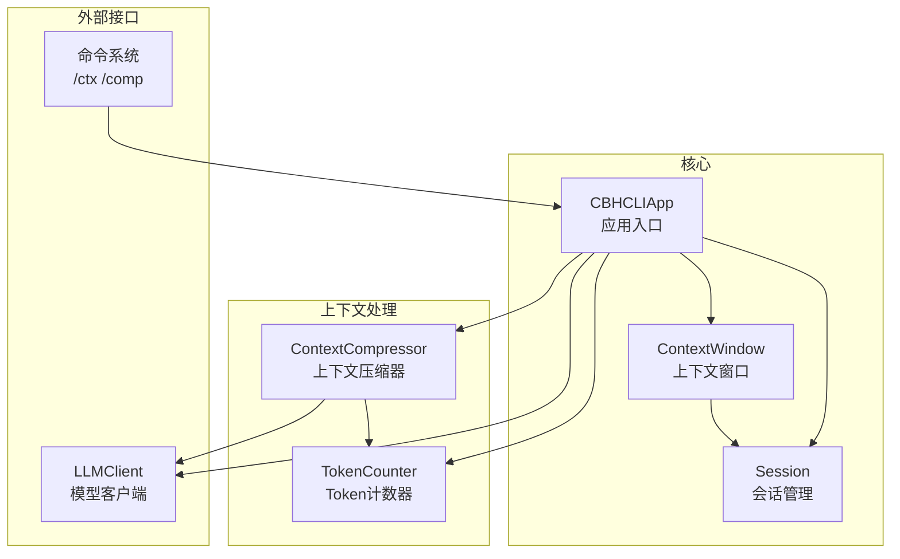
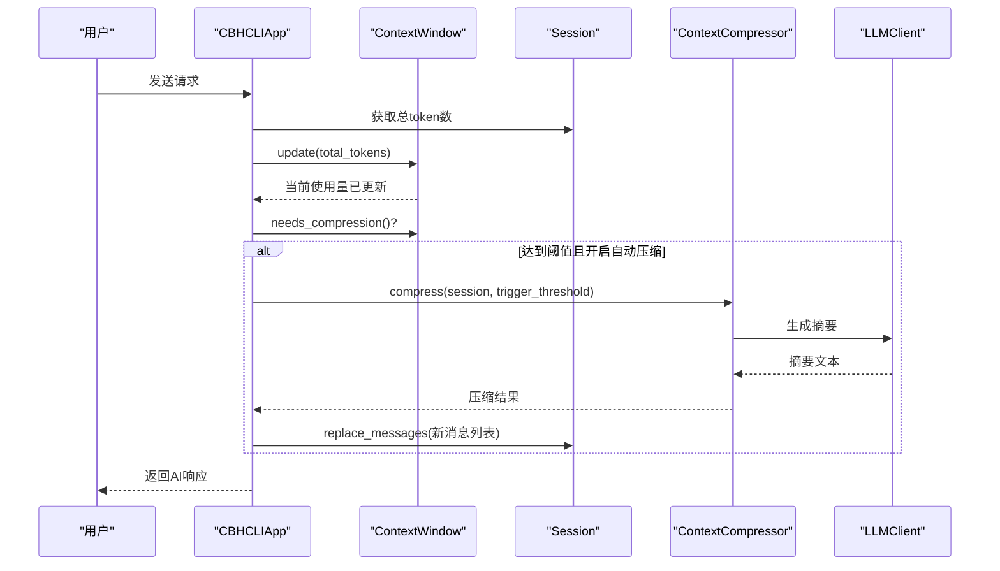
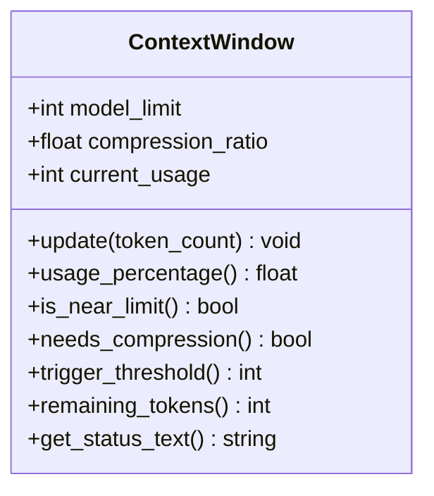
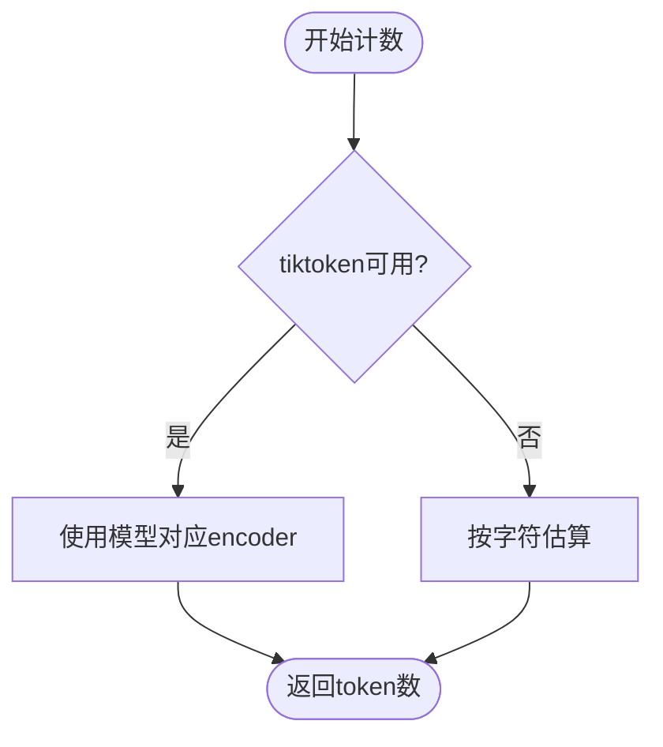
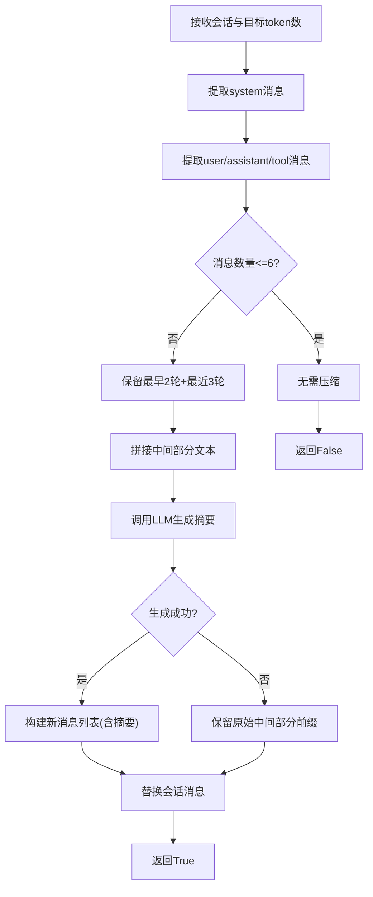
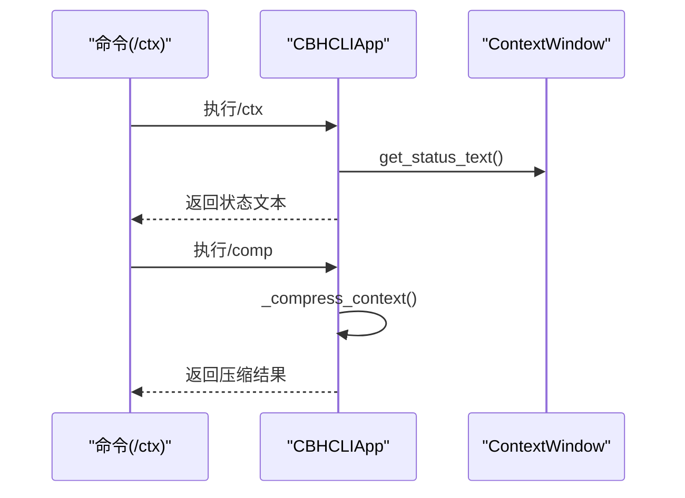
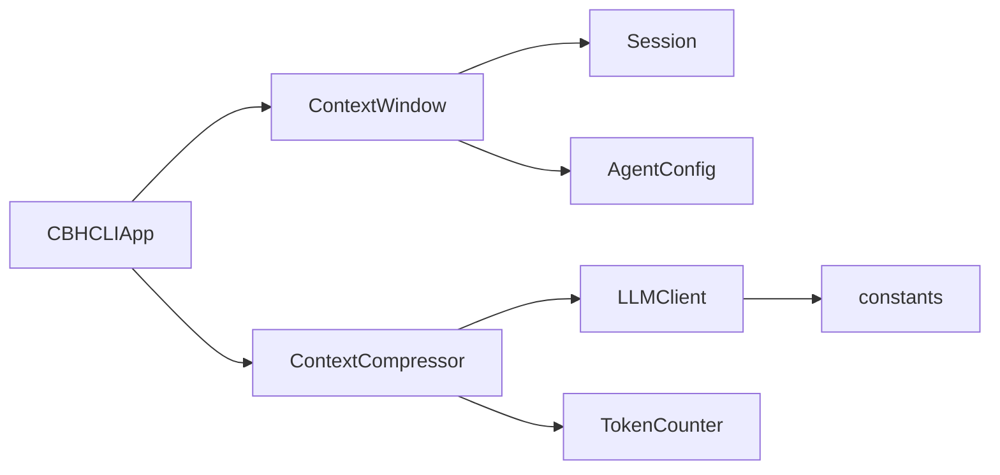

# 上下文窗口监控

<cite>
**本文引用的文件**
- [session.py](file://cbhcli_pkg/core/session.py)
- [app.py](file://cbhcli_pkg/core/app.py)
- [constants.py](file://cbhcli_pkg/core/constants.py)
- [agent.py](file://cbhcli_pkg/core/agent.py)
- [model.py](file://cbhcli_pkg/core/model.py)
- [token_counter.py](file://cbhcli_pkg/context/token_counter.py)
- [compressor.py](file://cbhcli_pkg/context/compressor.py)
- [session_cmd.py](file://cbhcli_pkg/commands/session_cmd.py)
</cite>

## 目录
1. [简介](#简介)
2. [项目结构](#项目结构)
3. [核心组件](#核心组件)
4. [架构概览](#架构概览)
5. [详细组件分析](#详细组件分析)
6. [依赖分析](#依赖分析)
7. [性能考虑](#性能考虑)
8. [故障排查指南](#故障排查指南)
9. [结论](#结论)
10. [附录](#附录)

## 简介
本文件面向“上下文窗口监控系统”的技术文档，聚焦于 ContextWindow 类的设计理念与核心功能，涵盖模型限制设置、压缩阈值配置、update() 方法的使用场景与 token 计数更新机制，以及 usage_percentage()、is_near_limit()、needs_compression() 等状态检查方法的实现逻辑。同时解释触发阈值计算与剩余 token 数统计的算法，说明 get_status_text() 的状态显示格式与用户界面集成方式，并提供最佳实践、性能监控与预警机制建议，最后阐述 token 计数准确性对上下文管理的重要性及与其他组件的数据流转。

## 项目结构
上下文窗口监控系统主要分布在以下模块：
- 核心会话与上下文窗口：cbhcli_pkg/core/session.py
- 主应用与自动压缩流程：cbhcli_pkg/core/app.py
- 常量定义（默认上下限与阈值）：cbhcli_pkg/core/constants.py
- Agent 配置（阈值与自动压缩开关）：cbhcli_pkg/core/agent.py
- LLM 客户端（模型上下文限制）：cbhcli_pkg/core/model.py
- Token 计数器（精确/估算）：cbhcli_pkg/context/token_counter.py
- 上下文压缩器（AI驱动摘要）：cbhcli_pkg/context/compressor.py
- CLI 命令集成（/ctx、/comp）：cbhcli_pkg/commands/session_cmd.py

图表来源
- [app.py:54-330](file://cbhcli_pkg/core/app.py#L54-L330)
- [session.py:127-189](file://cbhcli_pkg/core/session.py#L127-L189)
- [token_counter.py:14-88](file://cbhcli_pkg/context/token_counter.py#L14-L88)
- [compressor.py:7-112](file://cbhcli_pkg/context/compressor.py#L7-L112)
- [model.py:7-147](file://cbhcli_pkg/core/model.py#L7-L147)
- [session_cmd.py:142-182](file://cbhcli_pkg/commands/session_cmd.py#L142-L182)

章节来源
- [app.py:54-330](file://cbhcli_pkg/core/app.py#L54-L330)
- [session.py:127-189](file://cbhcli_pkg/core/session.py#L127-L189)
- [token_counter.py:14-88](file://cbhcli_pkg/context/token_counter.py#L14-L88)
- [compressor.py:7-112](file://cbhcli_pkg/context/compressor.py#L7-L112)
- [model.py:7-147](file://cbhcli_pkg/core/model.py#L7-L147)
- [session_cmd.py:142-182](file://cbhcli_pkg/commands/session_cmd.py#L142-L182)

## 核心组件
- ContextWindow：负责模型上下文限制、当前使用量、阈值计算与状态查询。
- Session：维护消息列表与 token 统计，提供总 token 数与消息替换。
- TokenCounter：提供精确（tiktoken）与估算（字符统计）两种 token 计数策略。
- ContextCompressor：基于 LLM 的摘要生成，对中间对话进行压缩。
- CBHCLIApp：在 AI 请求前后检查并触发上下文压缩，集成命令系统。
- LLMClient：提供模型上下文限制 context_limit，默认值来自 constants。
- AgentConfig：控制自动压缩开关 auto_compress 与压缩阈值 context_limit_ratio。

章节来源
- [session.py:127-189](file://cbhcli_pkg/core/session.py#L127-L189)
- [token_counter.py:14-88](file://cbhcli_pkg/context/token_counter.py#L14-L88)
- [compressor.py:7-112](file://cbhcli_pkg/context/compressor.py#L7-L112)
- [app.py:361-381](file://cbhcli_pkg/core/app.py#L361-L381)
- [model.py:10-21](file://cbhcli_pkg/core/model.py#L10-L21)
- [agent.py:476-512](file://cbhcli_pkg/core/agent.py#L476-L512)

## 架构概览
上下文窗口监控贯穿“状态更新—阈值判断—压缩触发—状态反馈”的闭环流程。AI 请求前，应用根据会话总 token 更新 ContextWindow；若达到阈值且开启自动压缩，则调用 ContextCompressor 进行摘要压缩，随后继续处理请求。

图表来源
- [app.py:368-439](file://cbhcli_pkg/core/app.py#L368-L439)
- [session.py:127-189](file://cbhcli_pkg/core/session.py#L127-L189)
- [compressor.py:21-81](file://cbhcli_pkg/context/compressor.py#L21-L81)
- [model.py:28-57](file://cbhcli_pkg/core/model.py#L28-L57)

## 详细组件分析

### ContextWindow 设计与方法详解
- 初始化参数
  - model_limit：模型最大 token 上限，来源于 LLMClient.context_limit 或默认常量。
  - compression_ratio：触发压缩的阈值比例，默认 0.8。
  - current_usage：当前 token 使用量，初始为 0。
- update(token_count)
  - 使用场景：每次 AI 请求前，根据 Session.get_total_tokens() 更新。
  - 作用：刷新 current_usage，为后续状态检查提供依据。
- usage_percentage()
  - 算法：current_usage / model_limit；当 model_limit 为 0 时返回 0.0。
  - 用途：计算使用率，用于 is_near_limit() 与 get_status_text()。
- is_near_limit()
  - 算法：usage_percentage() >= compression_ratio。
  - 用途：判断是否接近上限，决定是否需要压缩。
- needs_compression()
  - 算法：直接委托 is_near_limit()。
  - 用途：对外暴露“是否需要压缩”的布尔信号。
- trigger_threshold()
  - 算法：int(model_limit * compression_ratio)。
  - 用途：计算触发压缩的 token 阈值，供压缩器目标 token 数使用。
- remaining_tokens()
  - 算法：max(0, model_limit - current_usage)。
  - 用途：提供剩余可用 token 数，便于 UI 展示。
- get_status_text()
  - 算法：格式化“当前使用 / 上限 (百分比)”。
  - 用途：CLI 状态展示，便于用户直观了解上下文占用情况。

图表来源
- [session.py:127-189](file://cbhcli_pkg/core/session.py#L127-L189)

章节来源
- [session.py:127-189](file://cbhcli_pkg/core/session.py#L127-L189)

### Token 计数与准确性
- TokenCounter 支持两种计数模式：
  - 精确计数：优先使用 tiktoken，按模型选择 encoder；若模型不支持则回退 cl100k_base。
  - 估算计数：统计中文字符与非中文字符，分别按 1.5 字符/token 与 4 字符/token 估算。
- 适用场景：
  - 精确计数：在 tiktoken 可用且模型已配置时，提供更准确的 token 估计。
  - 估算计数：在缺少 tiktoken 或模型不可用时，仍能给出合理近似值。
- 对上下文管理的影响：
  - 精准的 token 计数有助于更精确地控制触发阈值，减少不必要的压缩或过度压缩。
  - 估算计数在大多数情况下足够稳定，但在复杂文本（含大量符号、代码、表情等）时可能存在偏差。

图表来源
- [token_counter.py:14-88](file://cbhcli_pkg/context/token_counter.py#L14-L88)

章节来源
- [token_counter.py:14-88](file://cbhcli_pkg/context/token_counter.py#L14-L88)

### 上下文压缩器与摘要生成
- 压缩策略：
  - 保留 system 消息与最早 2 轮与最近 3 轮对话，中间部分生成摘要。
  - 摘要由 LLM 生成，包含关键需求、操作、修改内容、问题与解决方案等要点。
- 目标 token 数：
  - 使用 ContextWindow.trigger_threshold() 作为压缩目标，确保压缩后的上下文不超过阈值。
- 失败回退：
  - 若摘要生成失败，保留原始中间部分前若干字符作为兜底。

图表来源
- [compressor.py:21-81](file://cbhcli_pkg/context/compressor.py#L21-L81)
- [compressor.py:83-112](file://cbhcli_pkg/context/compressor.py#L83-L112)

章节来源
- [compressor.py:7-112](file://cbhcli_pkg/context/compressor.py#L7-L112)

### 自动压缩流程与 CLI 集成
- 自动压缩触发点：
  - 在 AI 请求前调用 _check_and_compress_context()，根据 Session.get_total_tokens() 更新 ContextWindow，并在满足条件时调用 _compress_context()。
- CLI 命令：
  - /ctx：显示上下文状态、剩余 token、消息数、工具调用次数、自动压缩开关与压缩阈值。
  - /comp：手动触发压缩。
- 状态展示：
  - get_status_text() 提供“当前使用 / 上限 (百分比)”格式，便于 UI 呈现。

图表来源
- [session_cmd.py:142-182](file://cbhcli_pkg/commands/session_cmd.py#L142-L182)
- [app.py:361-381](file://cbhcli_pkg/core/app.py#L361-L381)
- [session.py:178-189](file://cbhcli_pkg/core/session.py#L178-L189)

章节来源
- [session_cmd.py:142-182](file://cbhcli_pkg/commands/session_cmd.py#L142-L182)
- [app.py:361-381](file://cbhcli_pkg/core/app.py#L361-L381)

## 依赖分析
- ContextWindow 依赖 Session 的总 token 统计，依赖 AgentConfig 的压缩阈值与自动压缩开关。
- ContextCompressor 依赖 LLMClient 与 TokenCounter，用于摘要生成与 token 计数。
- CBHCLIApp 负责在 AI 请求前后协调 ContextWindow 与 ContextCompressor 的调用。
- LLMClient 提供模型上下文限制，影响 ContextWindow 的阈值与剩余 token 计算。
- constants 提供默认上下文限制与默认压缩阈值，作为 fallback。

图表来源
- [session.py:127-189](file://cbhcli_pkg/core/session.py#L127-L189)
- [app.py:361-381](file://cbhcli_pkg/core/app.py#L361-L381)
- [compressor.py:7-112](file://cbhcli_pkg/context/compressor.py#L7-L112)
- [model.py:10-21](file://cbhcli_pkg/core/model.py#L10-L21)
- [constants.py:6-7](file://cbhcli_pkg/core/constants.py#L6-L7)

章节来源
- [session.py:127-189](file://cbhcli_pkg/core/session.py#L127-L189)
- [app.py:361-381](file://cbhcli_pkg/core/app.py#L361-L381)
- [compressor.py:7-112](file://cbhcli_pkg/context/compressor.py#L7-L112)
- [model.py:10-21](file://cbhcli_pkg/core/model.py#L10-L21)
- [constants.py:6-7](file://cbhcli_pkg/core/constants.py#L6-L7)

## 性能考虑
- 计数精度与性能平衡
  - tiktoken 精确计数在大文本上开销较高，建议在长对话或批量处理时谨慎使用。
  - 估算计数成本低，适合高频状态检查与阈值计算。
- 压缩频率控制
  - 频繁压缩会引入额外 API 调用与 token 成本，建议结合业务场景调整 compression_ratio 与 auto_compress。
- UI 刷新与日志输出
  - /ctx 命令与自动压缩日志会影响交互体验，可在高负载时降低日志级别或关闭自动压缩。

## 故障排查指南
- 上下文窗口未初始化
  - 现象：/ctx 返回“上下文窗口未初始化”。
  - 排查：确认 Agent 已加载并初始化 LLMClient 与 ContextWindow。
- 模型未配置
  - 现象：AI 请求时报错或无法获取模型上下文限制。
  - 排查：检查 /model 命令配置与模型可用性。
- 压缩失败
  - 现象：/comp 返回“压缩失败”或自动压缩后无变化。
  - 排查：检查 LLMClient 可用性、网络连通性与摘要生成是否抛出异常。
- 计数不准
  - 现象：阈值频繁触发或迟迟不触发。
  - 排查：确认 tiktoken 是否可用；必要时切换到估算模式或手动校正阈值。

章节来源
- [session_cmd.py:142-182](file://cbhcli_pkg/commands/session_cmd.py#L142-L182)
- [app.py:361-381](file://cbhcli_pkg/core/app.py#L361-L381)
- [compressor.py:83-112](file://cbhcli_pkg/context/compressor.py#L83-L112)

## 结论
ContextWindow 通过简洁的状态管理与阈值计算，为上下文压缩提供了可靠的触发机制；结合 TokenCounter 的精确/估算计数与 ContextCompressor 的摘要生成，实现了在不同场景下的高效上下文管理。通过 CLI 命令与应用层自动流程的协同，用户可以在交互中实时掌握上下文使用情况并及时采取压缩措施，从而提升对话稳定性与性能表现。

## 附录

### 最佳实践
- 阈值设置策略
  - 默认 compression_ratio=0.8 适用于大多数场景；长对话或多工具调用场景可下调至 0.7，避免频繁压缩。
  - 对于高成本模型，建议进一步降低阈值以减少 token 消耗。
- 性能监控与预警
  - 使用 /ctx 实时监控上下文使用率与剩余 token，结合日志观察压缩触发频率。
  - 在高负载时段临时关闭 auto_compress，待系统稳定后再开启。
- 预警机制
  - 在 UI 或日志中显示 usage_percentage() 与 remaining_tokens()，并在接近阈值时提前提示。
- 数据流转
  - Session.get_total_tokens() → ContextWindow.update() → ContextWindow.needs_compression() → ContextCompressor.compress() → Session.replace_messages()

章节来源
- [session.py:127-189](file://cbhcli_pkg/core/session.py#L127-L189)
- [app.py:368-439](file://cbhcli_pkg/core/app.py#L368-L439)
- [session_cmd.py:142-182](file://cbhcli_pkg/commands/session_cmd.py#L142-L182)