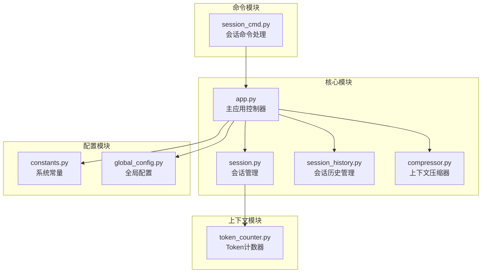
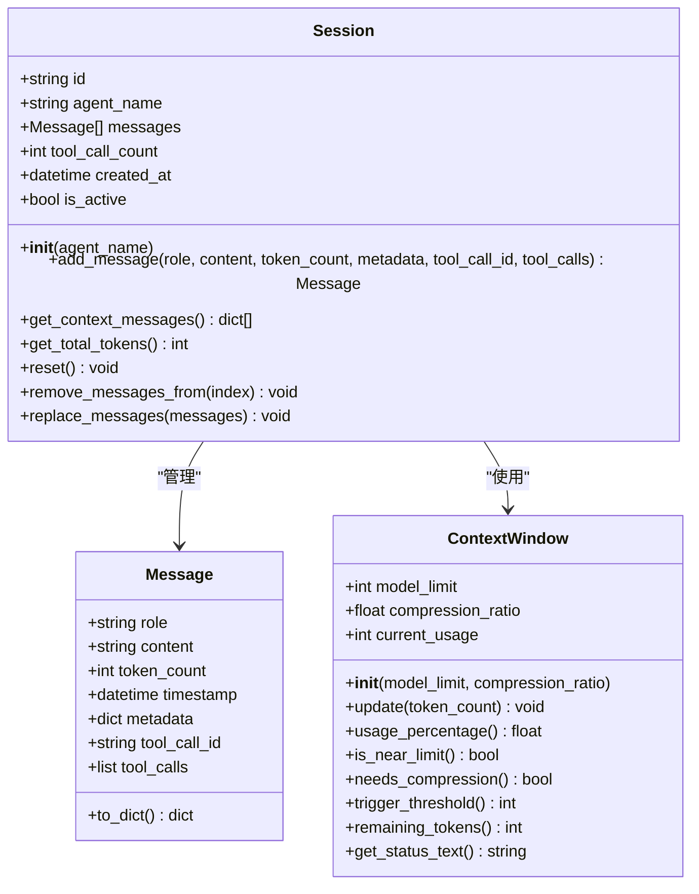
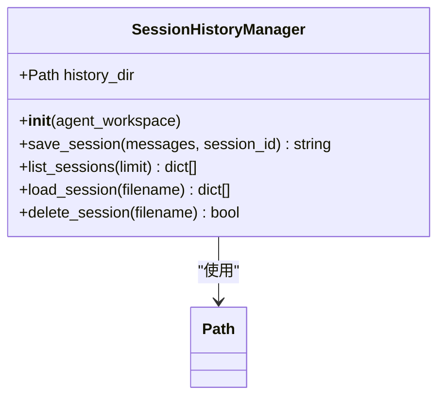
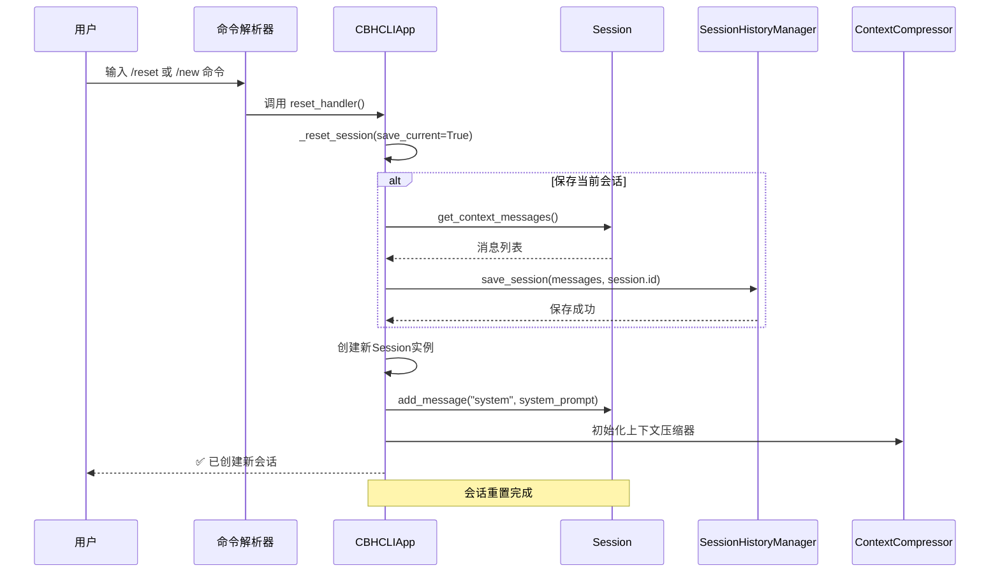
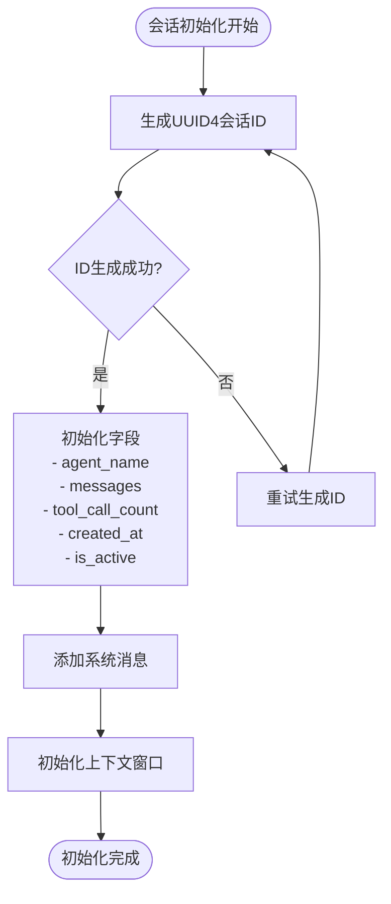
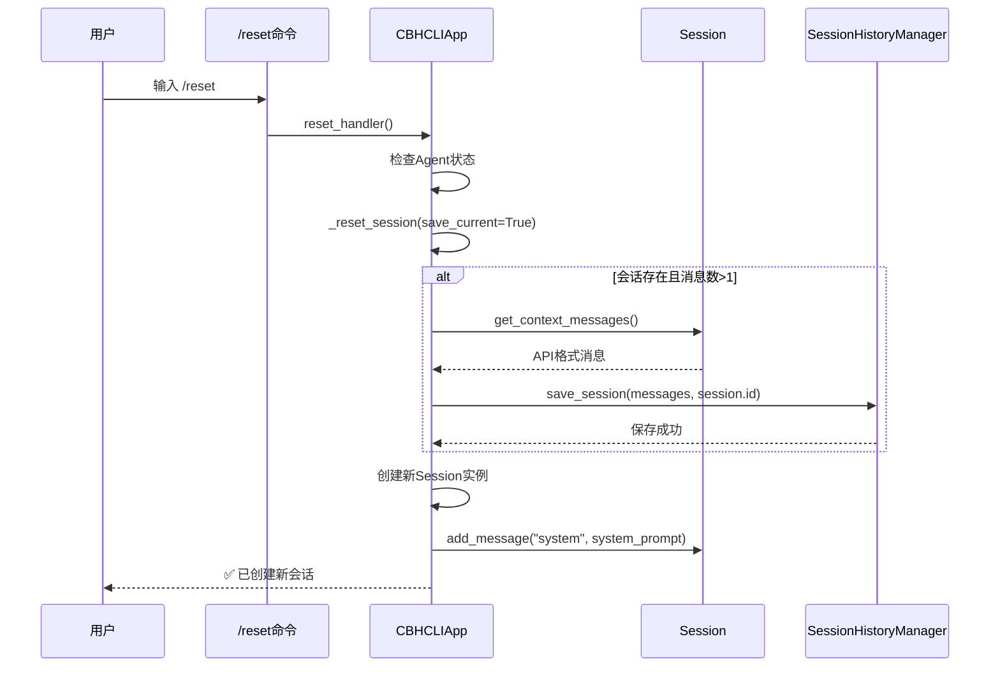
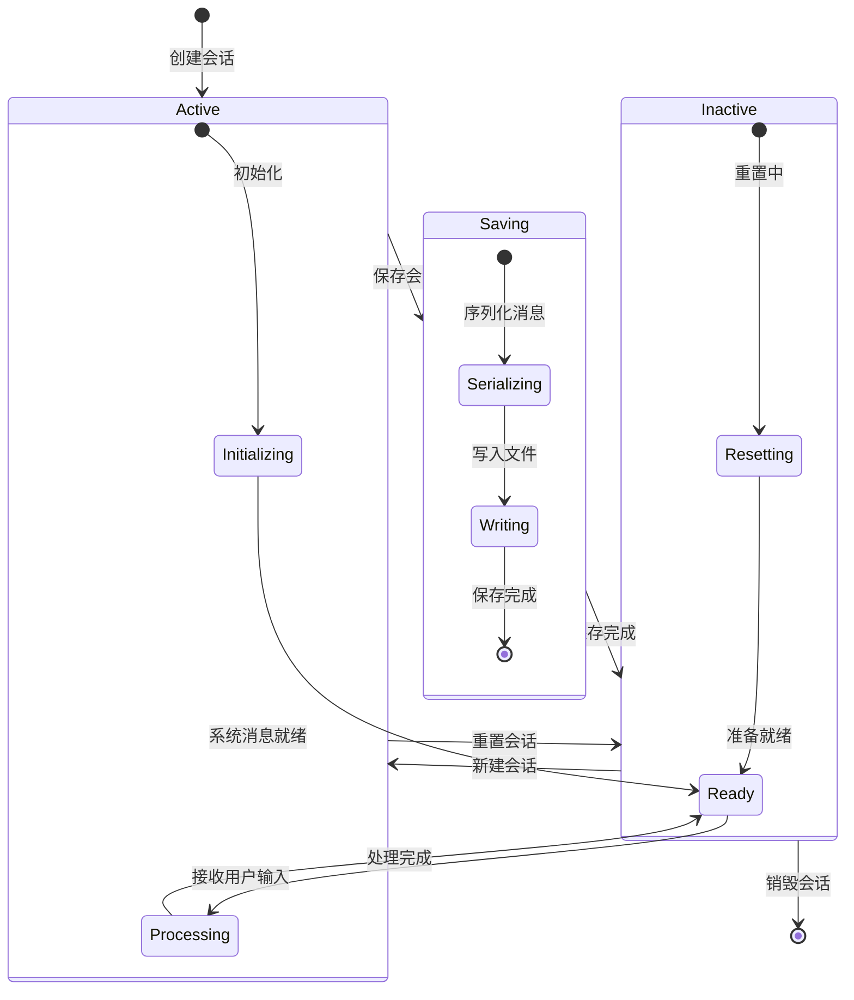
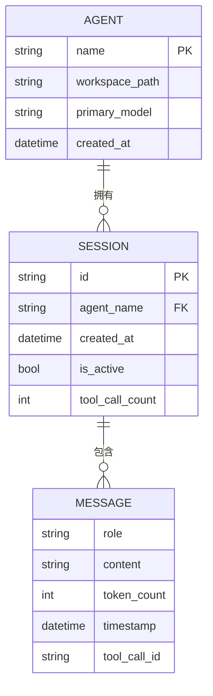
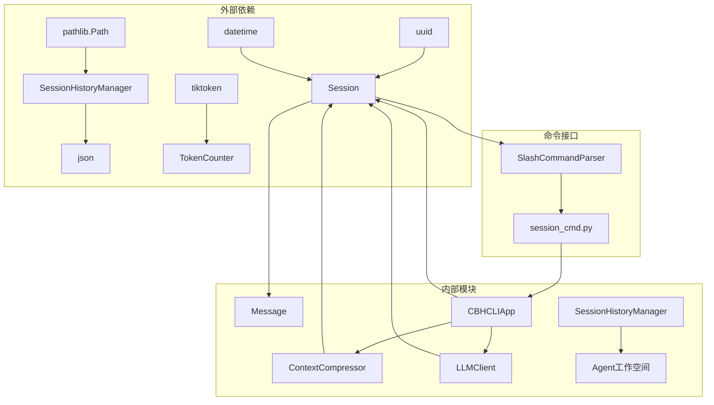

# 会话创建与重置

<cite>
**本文档引用的文件**
- [session.py](file://cbhcli_pkg/core/session.py)
- [session_cmd.py](file://cbhcli_pkg/commands/session_cmd.py)
- [session_history.py](file://cbhcli_pkg/core/session_history.py)
- [app.py](file://cbhcli_pkg/core/app.py)
- [constants.py](file://cbhcli_pkg/core/constants.py)
- [global_config.py](file://cbhcli_pkg/config/global_config.py)
- [compressor.py](file://cbhcli_pkg/context/compressor.py)
- [token_counter.py](file://cbhcli_pkg/context/token_counter.py)
- [README.md](file://README.md)
</cite>

## 目录
1. [简介](#简介)
2. [项目结构](#项目结构)
3. [核心组件](#核心组件)
4. [架构概览](#架构概览)
5. [详细组件分析](#详细组件分析)
6. [依赖关系分析](#依赖关系分析)
7. [性能考虑](#性能考虑)
8. [故障排除指南](#故障排除指南)
9. [结论](#结论)

## 简介

CBHCLI 是一个功能强大的AI驱动终端助手，支持多Agent管理、工具调用、知识库和会话管理。本文档专注于会话创建与重置功能的技术实现，详细说明Session类的初始化过程、会话创建的不同方式、reset()方法的实现机制、会话生命周期管理以及最佳实践。

## 项目结构

CBHCLI采用模块化架构设计，会话管理功能分布在多个核心模块中：



**图表来源**
- [app.py:54-72](file://cbhcli_pkg/core/app.py#L54-L72)
- [session.py:37-53](file://cbhcli_pkg/core/session.py#L37-L53)
- [session_history.py:8-23](file://cbhcli_pkg/core/session_history.py#L8-L23)

**章节来源**
- [app.py:54-72](file://cbhcli_pkg/core/app.py#L54-L72)
- [README.md:269-295](file://README.md#L269-L295)

## 核心组件

### Session类 - 会话管理核心

Session类是会话管理的核心组件，负责维护对话状态和消息历史：



**图表来源**
- [session.py:37-190](file://cbhcli_pkg/core/session.py#L37-L190)

### 会话历史管理器

SessionHistoryManager负责会话的持久化存储和恢复：



**图表来源**
- [session_history.py:8-136](file://cbhcli_pkg/core/session_history.py#L8-L136)

**章节来源**
- [session.py:37-190](file://cbhcli_pkg/core/session.py#L37-L190)
- [session_history.py:8-136](file://cbhcli_pkg/core/session_history.py#L8-L136)

## 架构概览

CBHCLI的会话管理系统采用分层架构设计，确保了良好的模块分离和可扩展性：



**图表来源**
- [session_cmd.py:8-31](file://cbhcli_pkg/commands/session_cmd.py#L8-L31)
- [app.py:281-331](file://cbhcli_pkg/core/app.py#L281-L331)

## 详细组件分析

### 会话初始化过程

会话的初始化过程涉及多个步骤，确保会话的完整性和一致性：

#### 1. 会话ID生成机制

会话ID使用UUID4算法生成，确保全局唯一性：



**图表来源**
- [session.py:40-53](file://cbhcli_pkg/core/session.py#L40-L53)

#### 2. Agent关联机制

会话与Agent的关联通过agent_name字段实现，确保会话的归属关系：

| 属性 | 类型 | 描述 | 默认值 |
|------|------|------|--------|
| id | string | UUID4生成的会话标识符 | 自动生成 |
| agent_name | string | 关联的Agent名称 | 空字符串 |
| messages | list[Message] | 消息列表 | 空列表 |
| tool_call_count | int | 工具调用计数 | 0 |
| created_at | datetime | 创建时间戳 | 当前时间 |
| is_active | bool | 激活状态 | True |

#### 3. 消息列表初始化

消息列表使用Message数据类进行管理，支持不同类型的消息：

**章节来源**
- [session.py:40-53](file://cbhcli_pkg/core/session.py#L40-L53)

### 会话创建方式对比

CBHCLI提供了多种会话创建方式，每种方式都有其特定的使用场景：

#### 方式一：/reset 命令

/reset命令是最常用的会话重置方式：



**图表来源**
- [session_cmd.py:8-16](file://cbhcli_pkg/commands/session_cmd.py#L8-L16)
- [app.py:281-301](file://cbhcli_pkg/core/app.py#L281-L301)

#### 方式二：/new 命令

/new命令与/reset命令功能相同，提供不同的命名约定：

| 命令 | 功能 | 行为差异 |
|------|------|----------|
| /reset | 重置当前会话 | 与/new完全相同 |
| /new | 创建新会话 | 与/reset完全相同 |
| 相同点 | 保存当前会话 | 自动保存到history文件夹 |

#### 方式三：默认创建流程

当Agent加载时的默认会话创建：

**章节来源**
- [session_cmd.py:8-31](file://cbhcli_pkg/commands/session_cmd.py#L8-L31)
- [app.py:278](file://cbhcli_pkg/core/app.py#L278)

### reset()方法实现机制

reset()方法是会话重置的核心实现，具有以下特性：

#### 1. 系统消息保留策略

reset()方法实现了智能的系统消息保留机制：

```mermaid
flowchart TD
ResetStart([reset()开始]) --> FilterMsgs["过滤消息列表<br/>保留role='system'的消息"]
FilterMsgs --> ClearMsgs["清空消息列表<br/>仅保留系统消息"]
ClearMsgs --> ResetCount["重置工具调用计数<br/>tool_call_count = 0"]
ResetCount --> CleanupPython["清理Python会话<br/>remove_python_session('default')"]
CleanupPython --> ResetComplete([重置完成])
subgraph "保留的消息类型"
SystemMsg["system消息<br/>- 系统提示<br/>- Agent人格<br/>- 工具描述"]
end
subgraph "清理的消息类型"
UserMsg["user消息<br/>- 用户输入"]
AssistantMsg["assistant消息<br/>- AI响应"]
ToolMsg["tool消息<br/>- 工具调用结果"]
end
FilterMsgs -.-> SystemMsg
FilterMsgs -.-> UserMsg
FilterMsgs -.-> AssistantMsg
FilterMsgs -.-> ToolMsg
```

**图表来源**
- [session.py:101-106](file://cbhcli_pkg/core/session.py#L101-L106)

#### 2. 工具调用计数重置

工具调用计数器在reset()过程中被重置为0，确保新的会话从零开始：

| 计数器 | 重置行为 | 影响范围 |
|--------|----------|----------|
| tool_call_count | 重置为0 | 工具调用限制检查 |
| Python会话 | 清空变量记忆 | Python工具会话状态 |
| 上下文压缩 | 重新计算token使用 | 上下文窗口监控 |

#### 3. 数据隔离机制

reset()方法确保了会话间的数据隔离：

**章节来源**
- [session.py:101-106](file://cbhcli_pkg/core/session.py#L101-L106)
- [app.py:298-299](file://cbhcli_pkg/core/app.py#L298-L299)

### 会话生命周期管理

会话生命周期管理涵盖了从创建到销毁的完整过程：



#### 1. 激活状态控制

会话的激活状态通过is_active属性管理：

| 状态 | 属性值 | 行为特征 |
|------|--------|----------|
| Active | True | 接受新消息，参与对话 |
| Inactive | False | 拒绝新消息，仅用于恢复 |
| Resetting | False | 正在重置，临时状态 |

#### 2. 时间戳记录机制

会话创建和状态变更的时间戳记录：

**章节来源**
- [session.py:51](file://cbhcli_pkg/core/session.py#L51)

### 会话与Agent的关联关系

会话与Agent之间建立了紧密的关联关系，确保了数据的正确归属：



**图表来源**
- [session.py:47-48](file://cbhcli_pkg/core/session.py#L47-L48)
- [app.py:260-261](file://cbhcli_pkg/core/app.py#L260-L261)

#### 1. 数据隔离机制

每个Agent拥有独立的工作空间和会话历史：

| 隔离维度 | 实现方式 | 作用 |
|----------|----------|------|
| 文件系统 | Agent工作空间目录 | 物理隔离 |
| 内存空间 | 独立的Session实例 | 逻辑隔离 |
| 历史数据 | Agent专属history文件夹 | 数据隔离 |

#### 2. Agent绑定策略

Agent绑定通过agent_name字段实现，确保会话的正确归属：

**章节来源**
- [session.py:47-48](file://cbhcli_pkg/core/session.py#L47-L48)
- [session_history.py:21](file://cbhcli_pkg/core/session_history.py#L21)

## 依赖关系分析

会话管理系统的依赖关系体现了清晰的模块化设计：



**图表来源**
- [session.py:1-6](file://cbhcli_pkg/core/session.py#L1-L6)
- [session_history.py:1-6](file://cbhcli_pkg/core/session_history.py#L1-L6)

### 直接依赖关系

| 模块 | 直接依赖 | 用途 |
|------|----------|------|
| Session | uuid, datetime | 会话标识符和时间戳 |
| Message | dataclasses, datetime | 消息数据结构 |
| SessionHistoryManager | json, pathlib | 会话持久化 |
| ContextCompressor | LLMClient, TokenCounter | 上下文压缩 |
| CBHCLIApp | 所有核心模块 | 应用控制器 |

### 间接依赖关系

| 模块 | 间接依赖 | 传递关系 |
|------|----------|----------|
| TokenCounter | tiktoken | 精确token计数 |
| ContextWindow | constants | 上下文限制常量 |
| GlobalConfig | json | 配置持久化 |

**章节来源**
- [session.py:1-6](file://cbhcli_pkg/core/session.py#L1-L6)
- [session_history.py:1-6](file://cbhcli_pkg/core/session_history.py#L1-6)

## 性能考虑

会话管理系统的性能优化主要体现在以下几个方面：

### 1. Token计数优化

Token计数器提供了两种计数模式：

| 模式 | 实现方式 | 性能特征 | 适用场景 |
|------|----------|----------|----------|
| 精确计数 | tiktoken编码器 | 高精度，CPU开销大 | 高精度需求场景 |
| 估算计数 | 正则表达式统计 | 低开销，精度中等 | 一般使用场景 |

### 2. 上下文压缩策略

上下文压缩器采用智能压缩算法：

- **保留策略**：保留最早2轮和最近3轮对话
- **摘要生成**：对中间部分生成对话摘要
- **条件判断**：仅当消息数超过6条时进行压缩

### 3. 内存管理

会话重置时的内存清理机制：

- **消息清理**：清空非系统消息
- **计数器重置**：重置工具调用计数
- **Python会话清理**：移除Python变量记忆

## 故障排除指南

### 常见问题及解决方案

#### 1. 会话重置失败

**问题症状**：执行/reset或/new命令后会话未重置

**可能原因**：
- Agent未正确加载
- 会话历史管理器初始化失败
- 文件权限问题

**解决步骤**：
1. 检查Agent状态：`/agent list`
2. 验证会话历史目录：`ls ~/.cbhcli/agents/<agent>/history/`
3. 检查文件权限：`chmod 755 ~/.cbhcli/agents/<agent>/history/`

#### 2. 会话恢复失败

**问题症状**：/resume命令无法恢复历史会话

**可能原因**：
- 会话文件损坏
- Agent工作空间路径错误
- JSON解析异常

**解决步骤**：
1. 列出可用会话：`/history`
2. 检查会话文件完整性
3. 手动删除损坏的会话文件

#### 3. Token计数异常

**问题症状**：上下文使用率显示异常

**可能原因**：
- tiktoken库未安装
- 模型名称不匹配
- 文本编码问题

**解决步骤**：
1. 安装tiktoken：`pip install tiktoken`
2. 验证模型配置：`/model info`
3. 检查文本编码：确保UTF-8编码

**章节来源**
- [session_cmd.py:34-94](file://cbhcli_pkg/commands/session_cmd.py#L34-L94)
- [app.py:291-296](file://cbhcli_pkg/core/app.py#L291-L296)

## 结论

CBHCLI的会话创建与重置功能展现了优秀的软件工程实践，通过模块化设计、清晰的职责分离和完善的错误处理机制，实现了高效、可靠的会话管理。

### 主要优势

1. **模块化设计**：Session、SessionHistoryManager、ContextCompressor等组件职责明确
2. **数据隔离**：每个Agent拥有独立的工作空间和会话历史
3. **智能重置**：保留重要系统消息，清理不必要的对话历史
4. **性能优化**：提供精确和估算两种Token计数模式
5. **扩展性强**：支持自定义Agent和工具集成

### 最佳实践建议

1. **命名规范**：使用有意义的Agent名称，便于会话识别
2. **定期备份**：利用会话历史功能定期保存重要对话
3. **合理配置**：根据使用场景调整上下文限制和压缩阈值
4. **监控使用**：定期检查上下文使用情况，避免超出限制

### 未来改进方向

1. **增量压缩**：实现更高效的上下文压缩算法
2. **智能清理**：基于对话内容智能识别可清理的历史
3. **并发安全**：增强多线程环境下的会话安全性
4. **云同步**：支持跨设备的会话历史同步

通过本文档的详细分析，开发者可以深入理解CBHCLI会话管理系统的实现原理，并在此基础上进行定制化开发和优化。