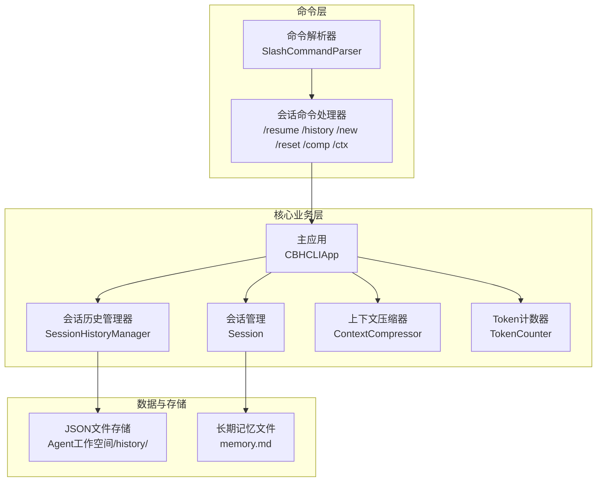
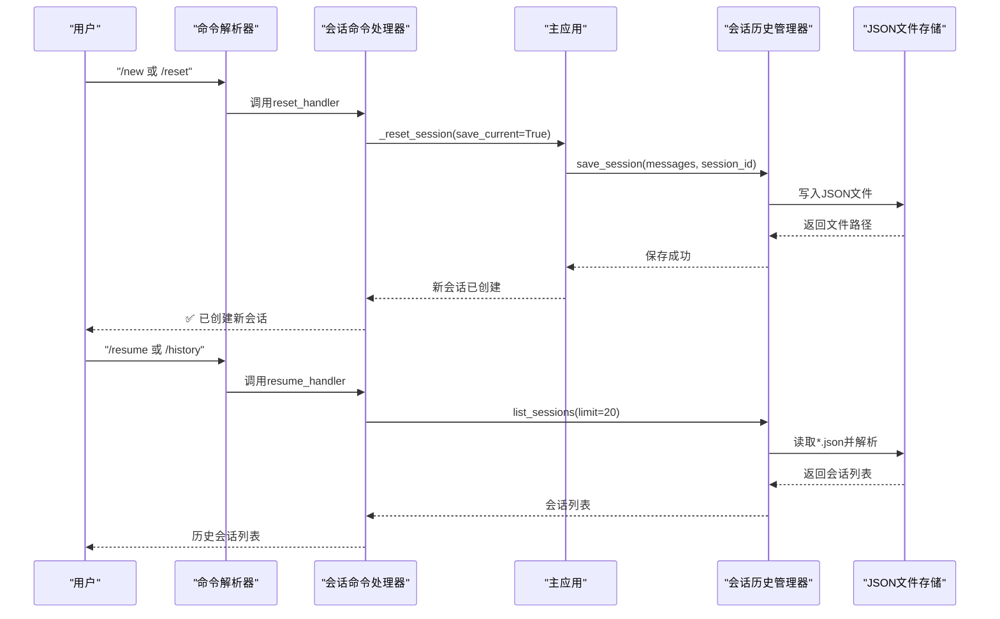
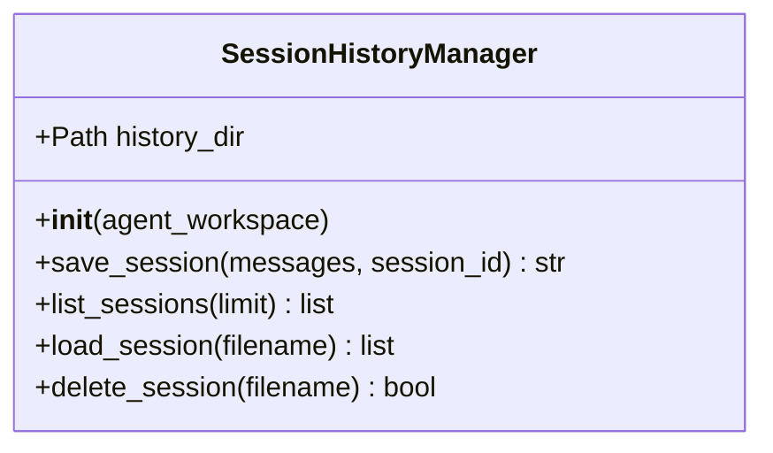
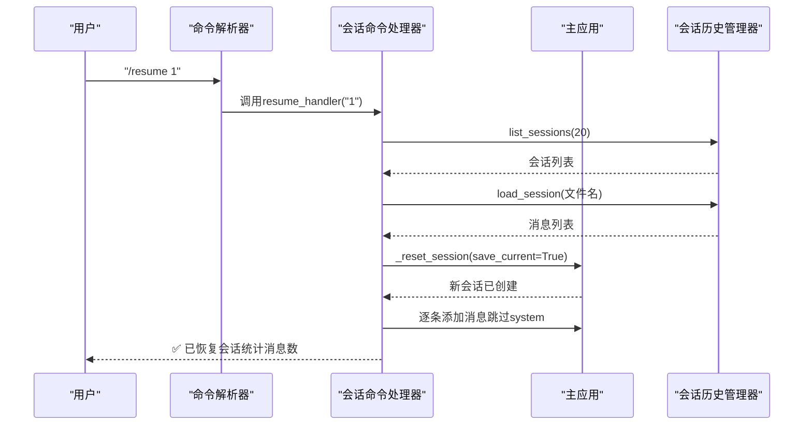
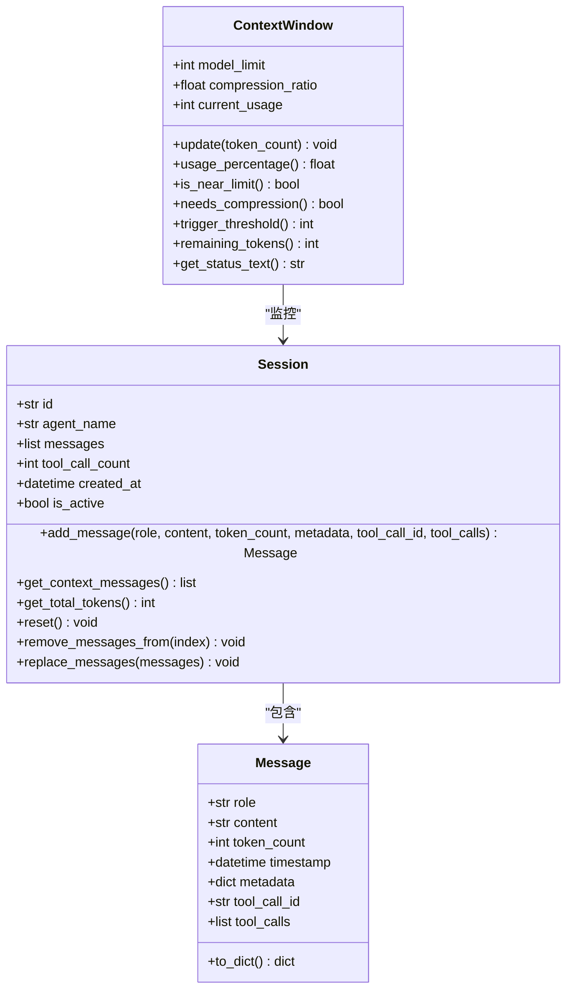
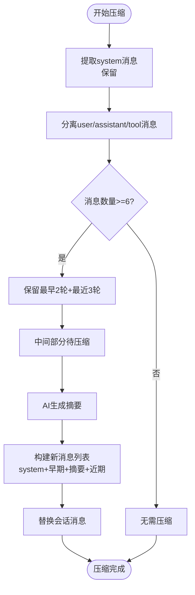
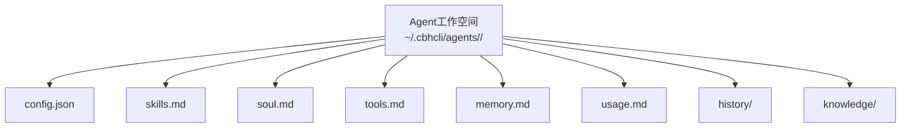
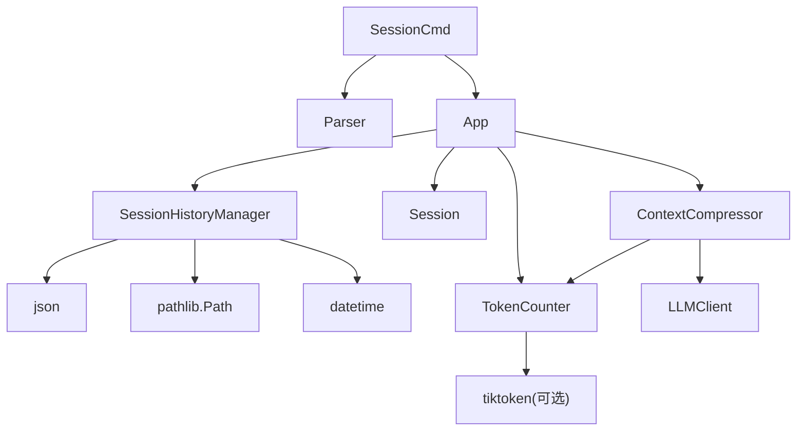

# 会话历史管理

<cite>
**本文引用的文件**
- [session_history.py](file://cbhcli_pkg/core/session_history.py)
- [session_cmd.py](file://cbhcli_pkg/commands/session_cmd.py)
- [session.py](file://cbhcli_pkg/core/session.py)
- [app.py](file://cbhcli_pkg/core/app.py)
- [parser.py](file://cbhcli_pkg/commands/parser.py)
- [constants.py](file://cbhcli_pkg/core/constants.py)
- [compressor.py](file://cbhcli_pkg/context/compressor.py)
- [token_counter.py](file://cbhcli_pkg/context/token_counter.py)
- [README.md](file://README.md)
</cite>

## 目录
1. [简介](#简介)
2. [项目结构](#项目结构)
3. [核心组件](#核心组件)
4. [架构概览](#架构概览)
5. [详细组件分析](#详细组件分析)
6. [依赖分析](#依赖分析)
7. [性能考虑](#性能考虑)
8. [故障排除指南](#故障排除指南)
9. [结论](#结论)
10. [附录](#附录)

## 简介
本文件详细说明会话历史管理系统的设计与实现，涵盖会话历史的存储机制、数据结构设计、持久化与检索、历史列表查看与管理、会话恢复功能、命名与标签系统、备份与恢复机制、最佳实践、Agent工作空间关系与数据隔离，以及清理维护策略和大数据量下的性能优化方案。

## 项目结构
会话历史管理相关的核心文件分布如下：
- 核心逻辑：`cbhcli_pkg/core/session_history.py`（会话历史管理器）
- 命令接口：`cbhcli_pkg/commands/session_cmd.py`（/resume、/history、/new、/reset 等命令）
- 会话数据结构：`cbhcli_pkg/core/session.py`（Message、Session、ContextWindow）
- 应用入口：`cbhcli_pkg/core/app.py`（应用初始化、会话重置、历史保存）
- 命令解析器：`cbhcli_pkg/commands/parser.py`（斜杠命令解析）
- 上下文压缩：`cbhcli_pkg/context/compressor.py`（AI驱动的上下文压缩）
- Token计数：`cbhcli_pkg/context/token_counter.py`（Token估算与计数）
- 常量定义：`cbhcli_pkg/core/constants.py`（默认上下文限制、压缩比例等）

**图表来源**
- [session_history.py:1-136](file://cbhcli_pkg/core/session_history.py#L1-L136)
- [session_cmd.py:1-183](file://cbhcli_pkg/commands/session_cmd.py#L1-L183)
- [session.py:1-190](file://cbhcli_pkg/core/session.py#L1-L190)
- [app.py:1-478](file://cbhcli_pkg/core/app.py#L1-L478)
- [compressor.py:1-112](file://cbhcli_pkg/context/compressor.py#L1-L112)
- [token_counter.py:1-88](file://cbhcli_pkg/context/token_counter.py#L1-L88)

**章节来源**
- [README.md:192-206](file://README.md#L192-L206)
- [session_history.py:1-136](file://cbhcli_pkg/core/session_history.py#L1-L136)
- [session_cmd.py:1-183](file://cbhcli_pkg/commands/session_cmd.py#L1-L183)
- [session.py:1-190](file://cbhcli_pkg/core/session.py#L1-L190)
- [app.py:1-478](file://cbhcli_pkg/core/app.py#L1-L478)
- [compressor.py:1-112](file://cbhcli_pkg/context/compressor.py#L1-L112)
- [token_counter.py:1-88](file://cbhcli_pkg/context/token_counter.py#L1-L88)

## 核心组件
- 会话历史管理器（SessionHistoryManager）：负责会话文件的保存、列出、加载与删除，采用JSON格式存储，文件名包含时间戳与会话ID，标题来自第一条用户消息。
- 会话命令处理器（register_session_commands）：提供 /new、/reset、/resume、/history、/comp、/ctx 等命令，实现会话创建、历史列表展示、历史恢复、上下文压缩与状态查看。
- 会话管理（Session）：定义消息的数据结构（Message），提供消息添加、上下文消息转换、Token统计、重置与消息替换等能力。
- 主应用（CBHCLIApp）：在会话重置时自动保存当前会话到历史目录；初始化会话历史管理器；提供上下文压缩与Token计数。
- 上下文压缩器（ContextCompressor）：基于AI生成摘要，保留早期与近期对话，压缩中间部分，减少Token占用。
- Token计数器（TokenCounter）：支持精确（tiktoken）与估算两种模式，用于上下文压缩与使用率计算。
- 命令解析器（SlashCommandParser）：统一解析斜杠命令，分发到对应处理器。

**章节来源**
- [session_history.py:8-136](file://cbhcli_pkg/core/session_history.py#L8-L136)
- [session_cmd.py:5-183](file://cbhcli_pkg/commands/session_cmd.py#L5-L183)
- [session.py:8-190](file://cbhcli_pkg/core/session.py#L8-L190)
- [app.py:281-331](file://cbhcli_pkg/core/app.py#L281-L331)
- [compressor.py:7-112](file://cbhcli_pkg/context/compressor.py#L7-L112)
- [token_counter.py:14-88](file://cbhcli_pkg/context/token_counter.py#L14-L88)
- [parser.py:16-94](file://cbhcli_pkg/commands/parser.py#L16-L94)

## 架构概览
会话历史管理贯穿命令层、业务层与数据层：
- 命令层：通过斜杠命令触发会话相关操作，如创建新会话、列出历史、恢复历史、手动压缩上下文等。
- 业务层：主应用在会话重置时自动保存当前会话；会话历史管理器负责具体文件操作；上下文压缩器在接近上下文限制时进行压缩。
- 数据层：会话历史以JSON文件形式存储在Agent工作空间的history/目录中，每条记录包含会话ID、创建时间、标题、消息数量与完整消息列表。

**图表来源**
- [session_cmd.py:8-102](file://cbhcli_pkg/commands/session_cmd.py#L8-L102)
- [app.py:281-315](file://cbhcli_pkg/core/app.py#L281-L315)
- [session_history.py:24-97](file://cbhcli_pkg/core/session_history.py#L24-L97)

**章节来源**
- [session_cmd.py:8-102](file://cbhcli_pkg/commands/session_cmd.py#L8-L102)
- [app.py:281-315](file://cbhcli_pkg/core/app.py#L281-L315)
- [session_history.py:24-97](file://cbhcli_pkg/core/session_history.py#L24-L97)

## 详细组件分析

### 会话历史管理器（SessionHistoryManager）
- 存储位置：Agent工作空间目录下的history/子目录，自动创建。
- 文件命名：采用“YYYYMMDD_HHMMSS_会话ID.json”的格式，确保唯一性与时间顺序。
- 标题生成：从第一条用户消息截取前若干字符作为标题，若无用户消息则标记为“空会话”。
- 保存流程：将当前会话消息列表转换为API格式，写入JSON文件，包含会话ID、创建时间、标题、消息数量与完整消息列表。
- 列表展示：按文件名逆序（时间倒序）列出最近的会话，支持限制返回数量。
- 加载恢复：根据文件名加载消息列表，跳过system消息后逐条添加到新会话。
- 删除功能：支持按文件名删除历史会话文件。

**图表来源**
- [session_history.py:8-136](file://cbhcli_pkg/core/session_history.py#L8-L136)

**章节来源**
- [session_history.py:16-136](file://cbhcli_pkg/core/session_history.py#L16-L136)

### 会话命令处理器（register_session_commands）
- /new 与 /reset：重置当前会话并自动保存上一会话到history/目录。
- /resume：无参数时列出历史会话；有参数时尝试按文件名或编号恢复会话。
- /history：/resume的别名，仅列出历史会话。
- /comp：手动触发上下文压缩。
- /ctx：查看上下文使用情况（Token总数、剩余Token、消息数、工具调用数等）。

**图表来源**
- [session_cmd.py:33-94](file://cbhcli_pkg/commands/session_cmd.py#L33-L94)
- [app.py:281-315](file://cbhcli_pkg/core/app.py#L281-L315)
- [session_history.py:99-118](file://cbhcli_pkg/core/session_history.py#L99-L118)

**章节来源**
- [session_cmd.py:5-183](file://cbhcli_pkg/commands/session_cmd.py#L5-L183)

### 会话数据结构（Message、Session、ContextWindow）
- Message：定义消息的角色、内容、Token计数、时间戳、元数据、工具调用ID与工具调用列表，并提供API格式转换。
- Session：管理消息列表、工具调用计数、创建时间、活跃状态；提供消息添加、上下文消息转换、Token统计、重置与消息替换。
- ContextWindow：管理模型上下文限制与压缩阈值，提供使用百分比、是否接近上限、剩余Token、状态文本等查询方法。

**图表来源**
- [session.py:8-190](file://cbhcli_pkg/core/session.py#L8-L190)

**章节来源**
- [session.py:8-190](file://cbhcli_pkg/core/session.py#L8-L190)

### 上下文压缩与Token计数
- 上下文压缩：保留最早2轮与最近3轮对话，中间部分通过AI生成摘要，减少Token占用。
- Token计数：优先使用tiktoken进行精确计数，若不可用则使用估算（中文与英文不同权重）。

**图表来源**
- [compressor.py:21-81](file://cbhcli_pkg/context/compressor.py#L21-L81)
- [token_counter.py:34-75](file://cbhcli_pkg/context/token_counter.py#L34-L75)

**章节来源**
- [compressor.py:7-112](file://cbhcli_pkg/context/compressor.py#L7-L112)
- [token_counter.py:14-88](file://cbhcli_pkg/context/token_counter.py#L14-L88)

### Agent工作空间与数据隔离
- 每个Agent拥有独立的工作空间目录，包含config.json、skills.md、soul.md、tools.md、memory.md、usage.md、history/、knowledge/等。
- 会话历史保存在history/目录，与知识库（knowledge/）和长期记忆（memory.md）分离，确保数据隔离。
- 主应用在加载Agent时初始化会话历史管理器，路径指向该Agent的工作空间。

**图表来源**
- [README.md:192-206](file://README.md#L192-L206)
- [app.py:260-264](file://cbhcli_pkg/core/app.py#L260-L264)

**章节来源**
- [README.md:192-206](file://README.md#L192-L206)
- [app.py:260-264](file://cbhcli_pkg/core/app.py#L260-L264)

## 依赖分析
- SessionHistoryManager依赖Python标准库（json、pathlib、datetime）与Agent工作空间路径。
- 会话命令处理器依赖命令解析器与主应用实例，调用会话历史管理器与会话管理器。
- 主应用在会话重置时调用会话历史管理器保存当前会话，并初始化上下文窗口与压缩器。
- 上下文压缩器依赖LLM客户端与Token计数器，用于生成摘要与计算Token。
- Token计数器优先使用tiktoken，降级为估算模式。

**图表来源**
- [session_history.py:2-5](file://cbhcli_pkg/core/session_history.py#L2-L5)
- [session_cmd.py:1-3](file://cbhcli_pkg/commands/session_cmd.py#L1-L3)
- [app.py:14-47](file://cbhcli_pkg/core/app.py#L14-L47)
- [compressor.py:3-4](file://cbhcli_pkg/context/compressor.py#L3-L4)
- [token_counter.py:7-11](file://cbhcli_pkg/context/token_counter.py#L7-L11)

**章节来源**
- [session_history.py:1-136](file://cbhcli_pkg/core/session_history.py#L1-L136)
- [session_cmd.py:1-183](file://cbhcli_pkg/commands/session_cmd.py#L1-L183)
- [app.py:1-478](file://cbhcli_pkg/core/app.py#L1-L478)
- [compressor.py:1-112](file://cbhcli_pkg/context/compressor.py#L1-L112)
- [token_counter.py:1-88](file://cbhcli_pkg/context/token_counter.py#L1-L88)

## 性能考虑
- 文件I/O与JSON序列化：历史保存与加载均为本地文件操作，建议控制单次保存的消息数量，避免超大JSON文件导致I/O压力。
- Token计数：优先使用tiktoken以获得更准确的上下文使用率，减少不必要的压缩触发。
- 上下文压缩：在接近阈值（默认80%）时触发压缩，减少后续请求的Token消耗。
- 列表限制：历史列表默认限制返回数量，避免一次性加载过多文件造成内存压力。
- 大数据量优化：对于历史文件较多的情况，建议定期清理不再使用的会话文件，或按月/季度归档。

[本节为通用性能建议，无需特定文件引用]

## 故障排除指南
- 会话历史管理器未初始化：确认已加载Agent并初始化会话历史管理器。
- 加载会话失败：检查文件是否存在、JSON格式是否正确、字段完整性。
- 历史列表为空：确认history/目录存在且包含JSON文件。
- 命令执行失败：检查命令拼写、是否选择了Agent、是否满足命令前置条件。
- 上下文压缩失败：检查LLM客户端配置、网络连接与Token计数器状态。

**章节来源**
- [session_cmd.py:33-102](file://cbhcli_pkg/commands/session_cmd.py#L33-L102)
- [session_history.py:99-136](file://cbhcli_pkg/core/session_history.py#L99-L136)
- [app.py:361-385](file://cbhcli_pkg/core/app.py#L361-L385)

## 结论
会话历史管理系统通过清晰的文件命名与结构化JSON存储，实现了可靠的会话持久化与恢复；结合命令层的便捷操作与业务层的自动保存机制，为用户提供了完整的会话生命周期管理能力。配合上下文压缩与Token计数，系统在保证性能的同时提升了用户体验。建议遵循命名规范、定期清理与归档、合理设置压缩阈值，以在大数据量场景下保持高效运行。

[本节为总结性内容，无需特定文件引用]

## 附录

### 会话命名与标签系统
- 自动生成：文件名包含时间戳与会话ID，标题来自第一条用户消息，若无用户消息则标记为“空会话”。
- 手动编辑：当前实现未提供直接修改历史文件标题的功能，可通过删除旧文件并重新发起会话来间接实现“重命名”。

**章节来源**
- [session_history.py:37-64](file://cbhcli_pkg/core/session_history.py#L37-L64)

### 会话数据的备份与恢复机制
- 导出：通过复制Agent工作空间目录中的history/子目录即可实现备份。
- 导入：将备份的历史文件复制回对应Agent的history/目录，即可在/resume中看到并恢复。
- 注意：备份应包含整个Agent工作空间，以确保历史文件、知识库与长期记忆的一致性。

**章节来源**
- [README.md:192-206](file://README.md#L192-L206)
- [session_history.py:21-22](file://cbhcli_pkg/core/session_history.py#L21-L22)

### 最佳实践
- 命名规范：使用语义化的会话ID或在会话开始时简要描述任务，便于后续识别。
- 归档策略：定期将已完成项目的会话归档至外部存储，清理history/目录中的冗余文件。
- 存储优化：控制单次保存的消息数量，避免超大JSON文件；启用上下文压缩以降低Token占用。
- 数据隔离：严格区分history/（会话历史）、knowledge/（知识库）与memory.md（长期记忆），避免交叉污染。

**章节来源**
- [README.md:192-206](file://README.md#L192-L206)
- [compressor.py:21-81](file://cbhcli_pkg/context/compressor.py#L21-L81)
- [constants.py:6-8](file://cbhcli_pkg/core/constants.py#L6-L8)