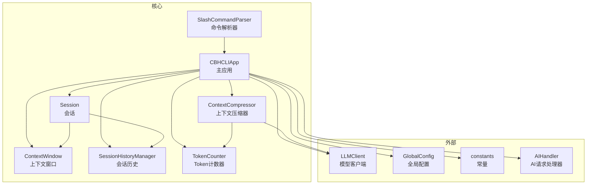
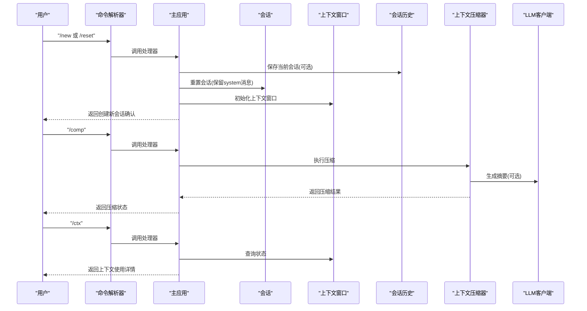
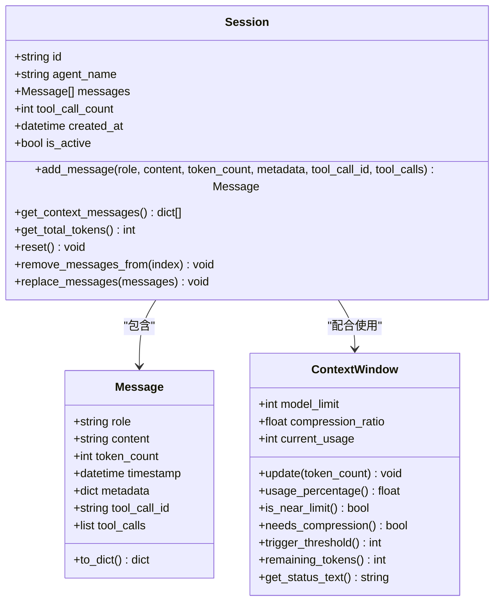
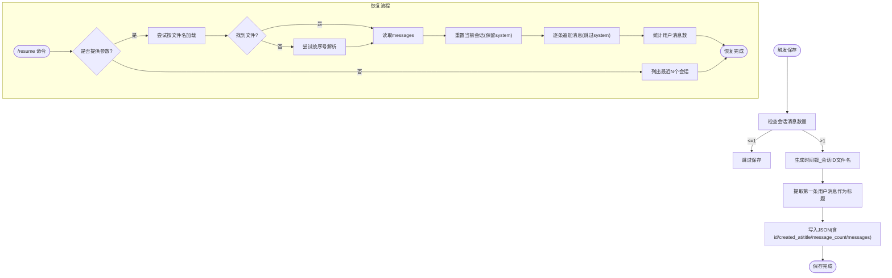
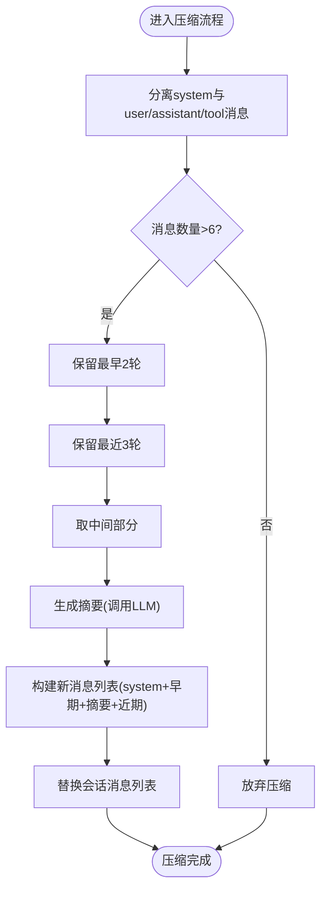
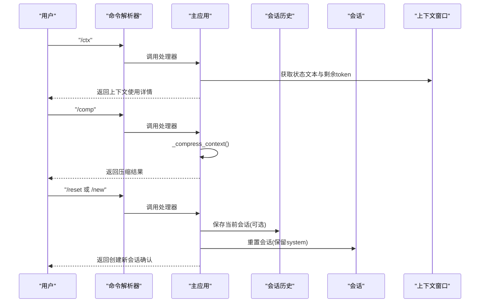
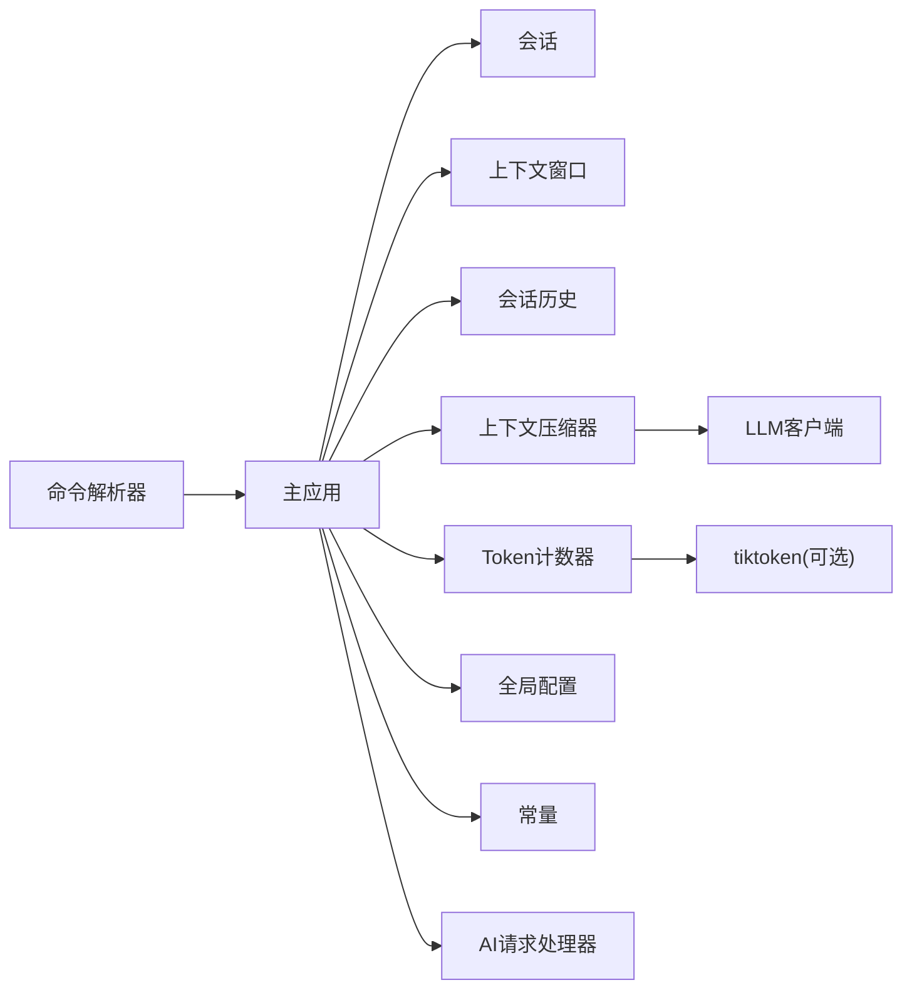

# 会话管理

<cite>
**本文引用的文件**
- [session.py](file://cbhcli_pkg/core/session.py)
- [session_cmd.py](file://cbhcli_pkg/commands/session_cmd.py)
- [compressor.py](file://cbhcli_pkg/context/compressor.py)
- [token_counter.py](file://cbhcli_pkg/context/token_counter.py)
- [session_history.py](file://cbhcli_pkg/core/session_history.py)
- [app.py](file://cbhcli_pkg/core/app.py)
- [parser.py](file://cbhcli_pkg/commands/parser.py)
- [global_config.py](file://cbhcli_pkg/config/global_config.py)
- [constants.py](file://cbhcli_pkg/core/constants.py)
- [ai_handler.py](file://cbhcli_pkg/core/ai_handler.py)
- [model.py](file://cbhcli_pkg/core/model.py)
</cite>

## 目录
1. [简介](#简介)
2. [项目结构](#项目结构)
3. [核心组件](#核心组件)
4. [架构总览](#架构总览)
5. [详细组件分析](#详细组件分析)
6. [依赖关系分析](#依赖关系分析)
7. [性能考量](#性能考量)
8. [故障排除指南](#故障排除指南)
9. [结论](#结论)
10. [附录](#附录)

## 简介
本文件面向CBHCLI的会话管理系统，系统性阐述会话的概念、上下文窗口管理、对话历史记录与恢复、自动压缩机制、手动压缩与上下文使用查看、最佳实践、与Agent的关联与数据隔离、性能优化建议以及故障排除与扩展指导。读者可据此快速掌握会话生命周期、命令使用方式与内部实现原理。

## 项目结构
围绕会话管理的核心模块分布如下：
- 会话与上下文窗口：位于 core/session.py
- 会话历史管理：位于 core/session_history.py
- 上下文压缩器：位于 context/compressor.py
- Token计数器：位于 context/token_counter.py
- 主应用与命令集成：位于 core/app.py、commands/session_cmd.py、commands/parser.py
- 全局配置：位于 config/global_config.py
- 常量定义：位于 core/constants.py
- AI请求处理：位于 core/ai_handler.py
- LLM客户端：位于 core/model.py

图表来源
- [session.py:37-190](file://cbhcli_pkg/core/session.py#L37-L190)
- [session_history.py:8-136](file://cbhcli_pkg/core/session_history.py#L8-L136)
- [compressor.py:7-112](file://cbhcli_pkg/context/compressor.py#L7-L112)
- [token_counter.py:14-88](file://cbhcli_pkg/context/token_counter.py#L14-L88)
- [app.py:54-478](file://cbhcli_pkg/core/app.py#L54-L478)
- [parser.py:16-94](file://cbhcli_pkg/commands/parser.py#L16-L94)
- [global_config.py:13-154](file://cbhcli_pkg/config/global_config.py#L13-L154)
- [constants.py:1-50](file://cbhcli_pkg/core/constants.py#L1-L50)
- [ai_handler.py:21-200](file://cbhcli_pkg/core/ai_handler.py#L21-L200)
- [model.py:7-147](file://cbhcli_pkg/core/model.py#L7-L147)

章节来源
- [session.py:1-190](file://cbhcli_pkg/core/session.py#L1-L190)
- [session_history.py:1-136](file://cbhcli_pkg/core/session_history.py#L1-L136)
- [compressor.py:1-112](file://cbhcli_pkg/context/compressor.py#L1-L112)
- [token_counter.py:1-88](file://cbhcli_pkg/context/token_counter.py#L1-L88)
- [app.py:1-478](file://cbhcli_pkg/core/app.py#L1-L478)
- [parser.py:1-94](file://cbhcli_pkg/commands/parser.py#L1-L94)
- [global_config.py:1-154](file://cbhcli_pkg/config/global_config.py#L1-L154)
- [constants.py:1-50](file://cbhcli_pkg/core/constants.py#L1-L50)
- [ai_handler.py:1-200](file://cbhcli_pkg/core/ai_handler.py#L1-L200)
- [model.py:1-147](file://cbhcli_pkg/core/model.py#L1-L147)

## 核心组件
- 会话（Session）：维护消息列表、工具调用计数、创建时间与活跃状态；提供消息添加、上下文导出、总token统计、重置与消息替换等能力。
- 上下文窗口（ContextWindow）：基于模型上下文限制与压缩阈值，跟踪当前token使用、计算使用率、判断是否接近上限、提供剩余token与状态文本。
- 会话历史（SessionHistoryManager）：负责会话的自动保存、历史列表展示、按文件名或索引恢复、删除等。
- 上下文压缩器（ContextCompressor）：在满足条件时，对会话中间部分进行摘要生成与合并，保留早期与近期消息，减少token占用。
- Token计数器（TokenCounter）：优先使用tiktoken精确计数，降级为估算计数，支持消息列表总token统计。
- 主应用（CBHCLIApp）：初始化Agent、会话、上下文窗口、压缩器、历史管理器与命令解析器；提供会话重置、自动压缩检查、AI请求处理等。
- 命令系统：通过斜杠命令提供/new、/reset、/resume、/history、/comp、/ctx等会话管理与上下文监控功能。

章节来源
- [session.py:37-190](file://cbhcli_pkg/core/session.py#L37-L190)
- [session_history.py:8-136](file://cbhcli_pkg/core/session_history.py#L8-L136)
- [compressor.py:7-112](file://cbhcli_pkg/context/compressor.py#L7-L112)
- [token_counter.py:14-88](file://cbhcli_pkg/context/token_counter.py#L14-L88)
- [app.py:281-385](file://cbhcli_pkg/core/app.py#L281-L385)
- [session_cmd.py:5-183](file://cbhcli_pkg/commands/session_cmd.py#L5-L183)

## 架构总览
会话管理贯穿“命令层—应用层—核心模型层”的分层设计：
- 命令层：/new、/reset、/resume、/history、/comp、/ctx由命令解析器注册并交由应用层处理。
- 应用层：主应用负责Agent加载、会话初始化、上下文窗口与压缩器构建、自动压缩检查、历史保存与恢复。
- 核心模型层：会话、上下文窗口、历史管理器、压缩器与Token计数器协同工作，确保上下文可控、历史可追溯、性能可优化。

图表来源
- [session_cmd.py:8-31](file://cbhcli_pkg/commands/session_cmd.py#L8-L31)
- [session_cmd.py:117-140](file://cbhcli_pkg/commands/session_cmd.py#L117-L140)
- [session_cmd.py:142-182](file://cbhcli_pkg/commands/session_cmd.py#L142-L182)
- [app.py:281-385](file://cbhcli_pkg/core/app.py#L281-L385)
- [compressor.py:21-81](file://cbhcli_pkg/context/compressor.py#L21-L81)
- [model.py:28-58](file://cbhcli_pkg/core/model.py#L28-L58)

## 详细组件分析

### 会话与上下文窗口
- 会话（Session）
  - 数据结构：消息列表、工具调用计数、创建时间、活跃状态。
  - 能力：添加消息（含role/content/token计数/元数据/工具调用信息）、导出上下文消息、统计总token、重置（保留system消息）、按索引删除消息、替换消息列表（用于压缩后回写）。
- 上下文窗口（ContextWindow）
  - 参数：模型上下文限制、压缩阈值比例（默认80%）。
  - 能力：更新当前token使用、计算使用率、判断是否接近上限、计算触发阈值、剩余token、状态文本。

图表来源
- [session.py:8-190](file://cbhcli_pkg/core/session.py#L8-L190)

章节来源
- [session.py:37-190](file://cbhcli_pkg/core/session.py#L37-L190)

### 会话历史管理
- 自动保存：每次/new或/reset时，若当前会话存在消息，则自动保存至Agent工作空间下的history目录，文件名为“时间戳_会话ID.json”，并提取第一条用户消息作为标题。
- 历史列表：按时间倒序列出会话，包含文件名、创建时间、标题、消息数等信息。
- 会话恢复：支持按文件名或序号恢复；恢复时会跳过system消息（因为新会话已包含），仅追加用户/助手/工具消息。
- 删除：支持删除指定历史文件。

图表来源
- [session_history.py:24-136](file://cbhcli_pkg/core/session_history.py#L24-L136)
- [session_cmd.py:33-94](file://cbhcli_pkg/commands/session_cmd.py#L33-L94)

章节来源
- [session_history.py:8-136](file://cbhcli_pkg/core/session_history.py#L8-L136)
- [session_cmd.py:33-94](file://cbhcli_pkg/commands/session_cmd.py#L33-L94)

### 上下文压缩与阈值
- 触发条件：当上下文使用率≥压缩阈值（默认80%）时触发自动压缩；也可通过/comp手动触发。
- 压缩策略：保留最早2轮与最近3轮消息，中间部分生成摘要并插入一条system类型的摘要消息，然后整体替换会话消息列表。
- 摘要生成：使用LLM客户端以特定system提示对中间对话文本进行总结，失败时回退为部分原文。
- 目标token：压缩目标为触发阈值对应的token数，避免超过模型限制。

图表来源
- [compressor.py:21-81](file://cbhcli_pkg/context/compressor.py#L21-L81)
- [app.py:361-385](file://cbhcli_pkg/core/app.py#L361-L385)

章节来源
- [compressor.py:7-112](file://cbhcli_pkg/context/compressor.py#L7-L112)
- [app.py:361-385](file://cbhcli_pkg/core/app.py#L361-L385)

### Token计数与估算
- 精确计数：优先使用tiktoken，按模型选择对应编码器；若模型不支持则回退到通用编码器。
- 估算计数：若未安装tiktoken或无模型名，按中文≈1.5字符/token、英文≈4字符/token估算。
- 消息总token：每条消息基础开销≈4 tokens，再叠加内容token。

章节来源
- [token_counter.py:14-88](file://cbhcli_pkg/context/token_counter.py#L14-L88)

### 命令与交互流程
- /new 与 /reset：二者共享同一处理器，均会保存当前会话并创建新会话（保留system消息）。/new强调“新建”，/reset强调“重置”。
- /resume：无参列出历史；有参按文件名或序号恢复；恢复后统计用户消息轮数。
- /history：/resume别名，仅列出历史。
- /comp：手动触发压缩。
- /ctx：显示Agent、模型、上下文使用、剩余token、消息数、工具调用次数、自动压缩开关与压缩阈值。

图表来源
- [session_cmd.py:8-31](file://cbhcli_pkg/commands/session_cmd.py#L8-L31)
- [session_cmd.py:117-182](file://cbhcli_pkg/commands/session_cmd.py#L117-L182)
- [app.py:281-331](file://cbhcli_pkg/core/app.py#L281-L331)

章节来源
- [session_cmd.py:5-183](file://cbhcli_pkg/commands/session_cmd.py#L5-L183)
- [app.py:281-331](file://cbhcli_pkg/core/app.py#L281-L331)

### 与Agent的关联与数据隔离
- 每个Agent拥有独立的工作空间，会话历史保存在该Agent的history目录下，实现天然的数据隔离。
- Agent切换时，会重新加载Agent配置、构建LLM客户端、初始化上下文窗口与压缩器，并重置会话。
- MCP管理器也为每个Agent独立维护，进一步保证功能与数据隔离。

章节来源
- [app.py:231-279](file://cbhcli_pkg/core/app.py#L231-L279)
- [session_history.py:16-23](file://cbhcli_pkg/core/session_history.py#L16-L23)

## 依赖关系分析
- 组件耦合
  - Session与ContextWindow：Session提供消息与token统计，ContextWindow用于阈值判断与状态展示。
  - ContextCompressor依赖LLMClient与TokenCounter，用于摘要生成与token估算。
  - 主应用在Agent加载时同时初始化上述组件，并在请求处理前检查上下文状态。
  - 命令系统通过SlashCommandParser注册会话相关命令，交由主应用处理。
- 外部依赖
  - tiktoken：用于精确token计数（可选）。
  - requests：LLM客户端HTTP通信。
  - 全局配置：提供默认上下文限制、压缩阈值、工作空间基路径等。

图表来源
- [parser.py:16-94](file://cbhcli_pkg/commands/parser.py#L16-L94)
- [app.py:54-478](file://cbhcli_pkg/core/app.py#L54-L478)
- [compressor.py:7-112](file://cbhcli_pkg/context/compressor.py#L7-L112)
- [token_counter.py:14-88](file://cbhcli_pkg/context/token_counter.py#L14-L88)
- [model.py:7-147](file://cbhcli_pkg/core/model.py#L7-L147)
- [global_config.py:13-154](file://cbhcli_pkg/config/global_config.py#L13-L154)
- [constants.py:1-50](file://cbhcli_pkg/core/constants.py#L1-50)
- [ai_handler.py:21-200](file://cbhcli_pkg/core/ai_handler.py#L21-L200)

章节来源
- [parser.py:16-94](file://cbhcli_pkg/commands/parser.py#L16-L94)
- [app.py:54-478](file://cbhcli_pkg/core/app.py#L54-L478)
- [compressor.py:7-112](file://cbhcli_pkg/context/compressor.py#L7-L112)
- [token_counter.py:14-88](file://cbhcli_pkg/context/token_counter.py#L14-L88)
- [model.py:7-147](file://cbhcli_pkg/core/model.py#L7-L147)
- [global_config.py:13-154](file://cbhcli_pkg/config/global_config.py#L13-L154)
- [constants.py:1-50](file://cbhcli_pkg/core/constants.py#L1-L50)
- [ai_handler.py:21-200](file://cbhcli_pkg/core/ai_handler.py#L21-L200)

## 性能考量
- Token计数
  - 优先使用tiktoken以获得更准确的token估算，降低因估算偏差导致的上下文溢出风险。
  - 若未安装tiktoken，系统会自动降级估算，但可能造成误差，建议在生产环境安装tiktoken。
- 上下文窗口
  - 默认模型上下文限制与压缩阈值可在全局配置中调整；不同模型应匹配相应限制。
  - 使用/ctx查看实时使用率与剩余token，有助于预判是否需要提前压缩。
- 自动压缩
  - 开启自动压缩可有效避免上下文溢出；压缩策略保留早期与近期消息，兼顾任务连续性与历史摘要。
- 存储与I/O
  - 历史文件采用JSON格式，便于跨平台阅读与迁移；建议定期清理不再使用的会话文件。
- 并发与内存
  - 单Agent内会话为单实例；如需多会话并行，建议通过多Agent或多进程隔离。
  - Python会话变量在会话重置时清理，避免长期内存泄漏。

章节来源
- [token_counter.py:14-88](file://cbhcli_pkg/context/token_counter.py#L14-L88)
- [global_config.py:31-48](file://cbhcli_pkg/config/global_config.py#L31-L48)
- [constants.py:6-8](file://cbhcli_pkg/core/constants.py#L6-L8)
- [app.py:368-385](file://cbhcli_pkg/core/app.py#L368-L385)

## 故障排除指南
- 无法创建/重置会话
  - 确认已选择Agent：命令处理器要求requires_agent=True。
  - 检查Agent配置与工作空间是否存在。
- 历史恢复失败
  - 文件名不存在或JSON损坏：/resume会尝试按序号解析，若仍失败，检查history目录文件完整性。
  - 恢复后消息异常：确认system消息未重复添加（恢复逻辑会跳过system）。
- 压缩失败
  - 消息数量不足（≤6轮）：压缩器会直接放弃压缩。
  - LLM摘要生成异常：压缩器内置降级回退，返回部分原文摘要。
- 上下文溢出
  - 检查/ctx输出的使用率与阈值；必要时手动执行/comp或降低温度、减少工具调用轮次。
- Token计数不准
  - 安装tiktoken并正确配置模型名称；否则将使用估算，误差较大。

章节来源
- [session_cmd.py:8-31](file://cbhcli_pkg/commands/session_cmd.py#L8-L31)
- [session_cmd.py:33-94](file://cbhcli_pkg/commands/session_cmd.py#L33-L94)
- [compressor.py:83-112](file://cbhcli_pkg/context/compressor.py#L83-L112)
- [app.py:368-385](file://cbhcli_pkg/core/app.py#L368-L385)

## 结论
CBHCLI的会话管理系统通过清晰的分层设计实现了上下文可控、历史可追溯与性能可优化的目标。Session与ContextWindow提供基础的上下文管理能力，ContextCompressor结合LLM实现智能摘要压缩，SessionHistoryManager保障历史可恢复性。命令系统与主应用协同，使用户能够便捷地进行会话创建、重置、恢复、压缩与监控。遵循本文的最佳实践与故障排除建议，可显著提升会话稳定性与开发体验。

## 附录

### 命令速查
- /new：创建新会话（自动保存上一会话）
- /reset：重置当前会话（自动保存上一会话）
- /resume [编号或文件名]：列出或恢复历史会话
- /history：查看历史会话列表（/resume别名）
- /comp：手动压缩上下文
- /ctx：显示上下文使用情况

章节来源
- [session_cmd.py:5-183](file://cbhcli_pkg/commands/session_cmd.py#L5-L183)

### 最佳实践
- 会话组织
  - 为不同任务或项目建立独立Agent，利用Agent工作空间隔离会话历史。
  - 使用有意义的会话标题（第一条用户消息会被提取为标题）。
- 命名规范
  - 历史文件名采用“时间戳_会话ID.json”，便于检索与排序。
- 存储策略
  - 定期归档或删除不再使用的会话文件，避免history目录膨胀。
- 上下文管理
  - 关注/ctx输出，合理设置压缩阈值与开启自动压缩。
  - 控制工具调用轮次与输出长度，避免上下文快速膨胀。
- 性能优化
  - 安装tiktoken以提高token估算精度。
  - 在高并发场景下，通过多Agent或多进程隔离会话，避免共享状态竞争。

章节来源
- [session_history.py:24-64](file://cbhcli_pkg/core/session_history.py#L24-L64)
- [global_config.py:42-47](file://cbhcli_pkg/config/global_config.py#L42-L47)
- [constants.py:6-8](file://cbhcli_pkg/core/constants.py#L6-L8)
- [ai_handler.py:12-15](file://cbhcli_pkg/core/ai_handler.py#L12-L15)

### 扩展与定制指导
- 自定义压缩策略
  - 可在ContextCompressor中调整保留轮数、摘要生成提示词与目标token策略。
- 自定义Token计数
  - 可扩展TokenCounter以适配更多模型编码器或引入缓存机制。
- 命令扩展
  - 通过SlashCommandParser注册新命令，结合主应用提供的会话与历史接口实现业务定制。
- Agent隔离增强
  - 可在Agent配置中增加会话配额、自动清理策略等，进一步细化资源管理。

章节来源
- [compressor.py:7-112](file://cbhcli_pkg/context/compressor.py#L7-L112)
- [token_counter.py:14-88](file://cbhcli_pkg/context/token_counter.py#L14-L88)
- [parser.py:16-94](file://cbhcli_pkg/commands/parser.py#L16-L94)
- [app.py:231-279](file://cbhcli_pkg/core/app.py#L231-L279)