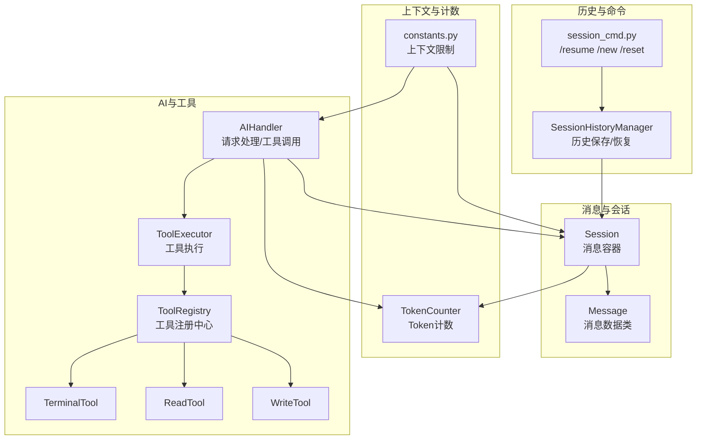
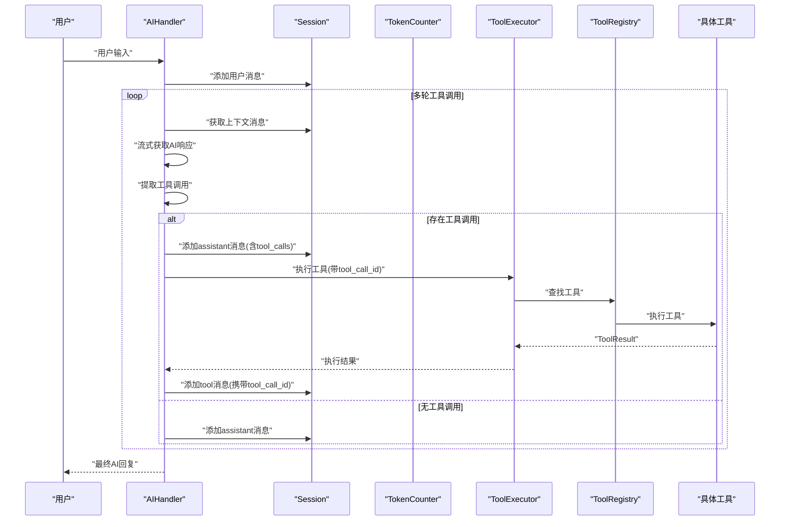
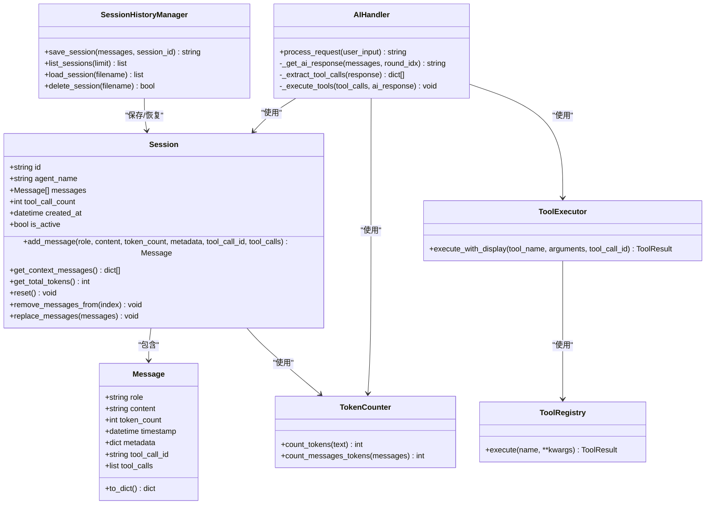

# 消息管理

<cite>
**本文引用的文件**
- [session.py](file://cbhcli_pkg/core/session.py)
- [token_counter.py](file://cbhcli_pkg/context/token_counter.py)
- [ai_handler.py](file://cbhcli_pkg/core/ai_handler.py)
- [session_history.py](file://cbhcli_pkg/core/session_history.py)
- [session_cmd.py](file://cbhcli_pkg/commands/session_cmd.py)
- [constants.py](file://cbhcli_pkg/core/constants.py)
- [terminal.py](file://cbhcli_pkg/tools/terminal.py)
- [file_read.py](file://cbhcli_pkg/tools/file_read.py)
- [file_write.py](file://cbhcli_pkg/tools/file_write.py)
- [registry.py](file://cbhcli_pkg/tools/registry.py)
- [mcp_tool_adapter.py](file://cbhcli_pkg/core/mcp_tool_adapter.py)
</cite>

## 目录
1. [简介](#简介)
2. [项目结构](#项目结构)
3. [核心组件](#核心组件)
4. [架构总览](#架构总览)
5. [详细组件分析](#详细组件分析)
6. [依赖分析](#依赖分析)
7. [性能考量](#性能考量)
8. [故障排查指南](#故障排查指南)
9. [结论](#结论)
10. [附录](#附录)

## 简介
本文件聚焦“消息管理”子系统，围绕消息数据类 Message 的设计与字段含义、to_dict() 的 API 格式转换规则、add_message() 的参数与使用方式、消息角色分类（system、user、assistant、tool）及其在对话中的作用、消息元数据的使用场景与存储机制、消息与工具调用的关联关系与消息链完整性保障等方面，提供系统化、可操作的技术文档。同时给出最佳实践建议，涵盖消息格式标准化、token 计数准确性与元数据组织，并解释消息链如何在工具调用过程中保持一致性与可追溯性。

## 项目结构
消息管理相关的核心代码集中在以下模块：
- 会话与消息数据结构：cbhcli_pkg/core/session.py
- Token 计数：cbhcli_pkg/context/token_counter.py
- AI 请求处理与工具调用编排：cbhcli_pkg/core/ai_handler.py
- 会话历史持久化与恢复：cbhcli_pkg/core/session_history.py、cbhcli_pkg/commands/session_cmd.py
- 工具体系与工具调用：cbhcli_pkg/tools/*、cbhcli_pkg/core/tool_executor.py、cbhcli_pkg/tools/registry.py
- 常量与上下文限制：cbhcli_pkg/core/constants.py

图表来源
- [session.py:1-124](file://cbhcli_pkg/core/session.py#L1-L124)
- [token_counter.py:14-88](file://cbhcli_pkg/context/token_counter.py#L14-L88)
- [ai_handler.py:21-743](file://cbhcli_pkg/core/ai_handler.py#L21-L743)
- [session_history.py:8-135](file://cbhcli_pkg/core/session_history.py#L8-L135)
- [session_cmd.py:1-103](file://cbhcli_pkg/commands/session_cmd.py#L1-L103)
- [constants.py:1-50](file://cbhcli_pkg/core/constants.py#L1-L50)

章节来源
- [session.py:1-124](file://cbhcli_pkg/core/session.py#L1-L124)
- [token_counter.py:14-88](file://cbhcli_pkg/context/token_counter.py#L14-L88)
- [ai_handler.py:21-743](file://cbhcli_pkg/core/ai_handler.py#L21-L743)
- [session_history.py:8-135](file://cbhcli_pkg/core/session_history.py#L8-L135)
- [session_cmd.py:1-103](file://cbhcli_pkg/commands/session_cmd.py#L1-L103)
- [constants.py:1-50](file://cbhcli_pkg/core/constants.py#L1-L50)

## 核心组件
- Message 数据类：承载单条消息的所有必要信息，包括角色、内容、token 计数、时间戳、元数据以及与工具调用相关的辅助字段。
- Session 会话：维护消息列表、提供消息添加、上下文导出、token 统计、会话重置与消息裁剪等能力。
- TokenCounter：提供精确（tiktoken）与估算两种模式的 token 计数能力，支撑上下文窗口控制。
- AIHandler：负责将用户输入加入会话、循环提取工具调用、执行工具并将工具结果回填到会话，形成完整的消息链。
- SessionHistoryManager：负责会话历史的保存、列出、加载与删除，支持 /resume 命令恢复。
- ToolExecutor/ToolRegistry：统一管理工具注册、执行与结果格式化，支持工具调用的确认、展示与回调。
- 工具实现：如 terminal、read、write 等，提供具体能力并返回标准化的 ToolResult。

章节来源
- [session.py:8-124](file://cbhcli_pkg/core/session.py#L8-L124)
- [token_counter.py:14-88](file://cbhcli_pkg/context/token_counter.py#L14-L88)
- [ai_handler.py:21-743](file://cbhcli_pkg/core/ai_handler.py#L21-L743)
- [session_history.py:8-135](file://cbhcli_pkg/core/session_history.py#L8-L135)
- [registry.py:51-115](file://cbhcli_pkg/tools/registry.py#L51-L115)

## 架构总览
消息管理贯穿“输入-处理-工具调用-结果回填”的完整链路，AIHandler 作为中枢协调各模块，确保消息链的完整性与一致性。

图表来源
- [ai_handler.py:51-96](file://cbhcli_pkg/core/ai_handler.py#L51-L96)
- [ai_handler.py:664-735](file://cbhcli_pkg/core/ai_handler.py#L664-L735)
- [session.py:54-81](file://cbhcli_pkg/core/session.py#L54-L81)

## 详细组件分析

### Message 数据类与字段语义
- 角色 role：限定为 system、user、assistant、tool 四种之一，分别代表系统提示、用户输入、AI回复、工具执行结果。
- 内容 content：消息正文，assistant 可能包含解释性文字；tool 消息包含工具输出或错误信息。
- token_count：该消息的 token 数量，用于上下文窗口控制与成本估算。
- timestamp：消息创建时间，默认使用当前时间，便于审计与排序。
- metadata：任意结构化元数据，可用于存储额外上下文、来源、来源ID等。
- tool_call_id：当消息为 tool 类型时，指向对应的 assistant 消息中的 tool_call ID，用于建立消息链。
- tool_calls：当消息为 assistant 类型且包含工具调用时，记录 OpenAI 风格的工具调用数组。

章节来源
- [session.py:8-18](file://cbhcli_pkg/core/session.py#L8-L18)

### to_dict() API 格式转换规则
- assistant 且包含 tool_calls：输出包含 role、tool_calls 与 content（可为空），用于 OpenAI 风格的工具调用消息。
- tool 且包含 tool_call_id：输出包含 role、content、tool_call_id，用于 OpenAI 风格的工具结果消息。
- 其他情况：输出包含 role 与 content，满足通用 API 调用格式。

```mermaid
flowchart TD
Start(["进入 to_dict"]) --> CheckRole{"role 是 assistant ?"}
CheckRole --> |是| CheckToolCalls{"包含 tool_calls ?"}
CheckToolCalls --> |是| BuildAssistantTC["构建 {role, tool_calls, content}"]
CheckToolCalls --> |否| BuildAssistant["构建 {role, content}"]
CheckRole --> |否| CheckRole2{"role 是 tool ?"}
CheckRole2 --> |是| CheckCallId{"包含 tool_call_id ?"}
CheckCallId --> |是| BuildTool["构建 {role, content, tool_call_id}"]
CheckCallId --> |否| BuildToolNoId["构建 {role, content}"]
CheckRole2 --> |否| BuildOther["构建 {role, content}"]
BuildAssistantTC --> End(["返回"])
BuildAssistant --> End
BuildTool --> End
BuildToolNoId --> End
BuildOther --> End
```

图表来源
- [session.py:19-34](file://cbhcli_pkg/core/session.py#L19-L34)

章节来源
- [session.py:19-34](file://cbhcli_pkg/core/session.py#L19-L34)

### add_message() 方法：参数与使用方式
- 参数
  - role：消息角色（system/user/assistant/tool）
  - content：消息内容
  - token_count：token 数量（0 表示需要计算）
  - metadata：元数据（可选）
  - tool_call_id：tool 消息关联的 assistant 工具调用 ID（可选）
  - tool_calls：assistant 消息的工具调用数组（可选）
- 使用方式
  - 由 AIHandler 在多轮工具调用中自动调用，用于添加用户消息、assistant 工具调用消息、tool 结果消息。
  - 由会话历史恢复逻辑在 /resume 时调用，将历史消息恢复到当前会话，同时计算 token_count 并传递元数据。

章节来源
- [session.py:54-81](file://cbhcli_pkg/core/session.py#L54-L81)
- [session_cmd.py:66-75](file://cbhcli_pkg/commands/session_cmd.py#L66-L75)

### 消息角色分类与作用
- system：系统提示，用于设定 Agent 的行为、风格、约束等，通常在会话开头固定出现。
- user：用户输入，AIHandler 在每轮开始时添加。
- assistant：AI 的回复，可能包含解释性文字与工具调用；当包含 tool_calls 时，需遵循 OpenAI 格式。
- tool：工具执行结果，必须携带 tool_call_id 以与对应 assistant 的工具调用关联。

章节来源
- [session.py:8-18](file://cbhcli_pkg/core/session.py#L8-L18)
- [ai_handler.py:664-735](file://cbhcli_pkg/core/ai_handler.py#L664-L735)

### 消息元数据的使用场景与存储机制
- 使用场景
  - 记录工具名称与执行状态，便于后续统计与审计。
  - 保存原始消息结构，支持历史恢复时的无损还原。
  - 作为调试与可观测性的辅助信息。
- 存储机制
  - SessionHistoryManager 将消息列表以 JSON 形式保存到 agent 工作空间的 history 目录，文件名包含时间戳与会话ID。
  - /resume 命令加载历史时，将消息逐条恢复到当前会话，并重新计算 token_count，同时保留原始 metadata。

章节来源
- [session_history.py:24-97](file://cbhcli_pkg/core/session_history.py#L24-L97)
- [session_cmd.py:66-75](file://cbhcli_pkg/commands/session_cmd.py#L66-L75)

### 消息与工具调用的关联关系与消息链完整性
- 关联关系
  - assistant 消息若包含 tool_calls，则 tool 消息必须携带 tool_call_id，指向该 assistant 的某个工具调用项。
  - 工具执行结果 tool 消息的 tool_call_id 应与 assistant 的 tool_calls 中某一项的 id 一致。
- 完整性保障
  - AIHandler 在生成 assistant 工具调用消息时，会为每个工具调用生成唯一 id，并将 tool_calls 与 content 分别写入。
  - 工具执行完成后，AIHandler 为每个工具调用生成 tool 消息，携带相同的 tool_call_id，从而形成闭环。
  - 会话历史保存与恢复时，保留 tool_call_id 与 tool_calls，确保链路可追溯。

章节来源
- [ai_handler.py:691-735](file://cbhcli_pkg/core/ai_handler.py#L691-L735)
- [session.py:19-34](file://cbhcli_pkg/core/session.py#L19-L34)

### Token 计数与上下文窗口控制
- TokenCounter
  - 优先使用 tiktoken 进行精确计数；若不可用则采用估算策略（中文与英文字符估算比例不同）。
  - 提供 count_messages_tokens()，用于计算消息列表的总 token 数，考虑每条消息的基础开销。
- 上下文窗口
  - constants.py 定义默认上下文限制、压缩比例与最小压缩消息数量。
  - AIHandler 与 Session 在多轮工具调用中动态评估上下文占用，结合 TokenCounter 与常量进行控制。

章节来源
- [token_counter.py:14-88](file://cbhcli_pkg/context/token_counter.py#L14-L88)
- [constants.py:6-8](file://cbhcli_pkg/core/constants.py#L6-L8)
- [ai_handler.py:98-132](file://cbhcli_pkg/core/ai_handler.py#L98-L132)

### 工具调用与消息链的端到端流程
- AIHandler 提取工具调用后，生成 OpenAI 风格的 tool_calls 数组，添加 assistant 消息。
- ToolExecutor 执行工具，ToolRegistry 校验工具存在性并执行。
- AIHandler 为每个工具调用生成 tool 消息，携带 tool_call_id，形成可追溯的消息链。
- 会话历史保存时保留 tool_calls 与 tool_call_id，恢复时可重建链路。

章节来源
- [ai_handler.py:264-502](file://cbhcli_pkg/core/ai_handler.py#L264-L502)
- [ai_handler.py:664-735](file://cbhcli_pkg/core/ai_handler.py#L664-L735)
- [registry.py:70-96](file://cbhcli_pkg/tools/registry.py#L70-L96)

## 依赖分析
- Session 依赖 Message、TokenCounter、datetime、uuid。
- AIHandler 依赖 Session、LLMClient、ToolExecutor、TokenCounter、ResponseCleaner、常量。
- ToolExecutor 依赖 ToolRegistry 与 ToolResult。
- ToolRegistry 依赖 BaseTool 抽象与 ToolResult。
- SessionHistoryManager 依赖 JSON、Path、datetime。
- 命令层 session_cmd.py 依赖 SessionHistoryManager 与 TokenCounter。

图表来源
- [session.py:8-124](file://cbhcli_pkg/core/session.py#L8-L124)
- [token_counter.py:14-88](file://cbhcli_pkg/context/token_counter.py#L14-L88)
- [ai_handler.py:21-743](file://cbhcli_pkg/core/ai_handler.py#L21-L743)
- [registry.py:51-115](file://cbhcli_pkg/tools/registry.py#L51-L115)
- [session_history.py:8-135](file://cbhcli_pkg/core/session_history.py#L8-L135)

章节来源
- [session.py:8-124](file://cbhcli_pkg/core/session.py#L8-L124)
- [ai_handler.py:21-743](file://cbhcli_pkg/core/ai_handler.py#L21-L743)
- [registry.py:51-115](file://cbhcli_pkg/tools/registry.py#L51-L115)
- [session_history.py:8-135](file://cbhcli_pkg/core/session_history.py#L8-L135)

## 性能考量
- Token 计数
  - 优先启用 tiktoken 以获得更准确的 token 数，减少上下文溢出风险。
  - 对于长消息与批量消息，使用 count_messages_tokens() 统计总开销，避免逐条计算带来的重复开销。
- 工具调用
  - 工具执行前的确认与显示会引入交互延迟，可通过配置跳过确认以提升吞吐。
  - 输出过长的工具结果会被截断，避免影响上下文与渲染性能。
- 会话历史
  - 历史文件保存时包含完整消息，恢复时逐条重建消息与 token 计数，注意磁盘与内存占用。
- 上下文压缩
  - 当消息数量超过阈值或接近上下文限制时，应触发压缩策略，降低 token 占用。

[本节为通用性能建议，不直接分析特定文件]

## 故障排查指南
- 工具调用未生效
  - 检查 AIHandler 的工具调用提取逻辑是否正确识别格式（DSML、Python、JSON、纯文本命令等）。
  - 确认 ToolRegistry 中工具名称与参数定义正确，且工具存在。
- tool 消息缺失 tool_call_id
  - assistant 消息若包含 tool_calls，需确保 tool 消息携带对应的 tool_call_id，否则链路断裂。
- token 计数异常
  - 若 tiktoken 未安装，将使用估算模式，可能导致上下文计算偏差；建议安装 tiktoken 以获得精确计数。
- 会话恢复失败
  - 检查历史文件格式与字段完整性，确保 messages、role、content、tool_call_id、tool_calls 等字段存在且可解析。

章节来源
- [ai_handler.py:264-502](file://cbhcli_pkg/core/ai_handler.py#L264-L502)
- [registry.py:70-96](file://cbhcli_pkg/tools/registry.py#L70-L96)
- [session.py:19-34](file://cbhcli_pkg/core/session.py#L19-L34)
- [session_history.py:99-118](file://cbhcli_pkg/core/session_history.py#L99-L118)

## 结论
消息管理子系统通过 Message 的标准化字段、to_dict() 的 API 兼容转换、Session 的消息生命周期管理、TokenCounter 的计数能力以及 AIHandler 的工具调用编排，实现了从用户输入到工具执行再到结果回填的完整消息链。配合会话历史的保存与恢复，系统在保证消息链完整性的同时，也为调试、审计与可追溯性提供了坚实基础。遵循本文的最佳实践，可进一步提升消息格式一致性、token 计数准确性与元数据组织水平。

[本节为总结性内容，不直接分析特定文件]

## 附录

### 最佳实践清单
- 消息格式标准化
  - 使用统一的 role 分类与 content 结构，避免混用非标准字段。
  - assistant 消息包含解释性文字时，tool_calls 与 content 分离，确保 API 兼容。
- token 计数准确性
  - 优先安装 tiktoken，启用精确计数；在估算模式下关注中文与英文字符比例差异。
  - 对长消息与批量消息使用 count_messages_tokens() 统计总开销。
- 元数据组织
  - 将工具名称、执行状态、来源信息等放入 metadata，便于审计与可视化。
  - 历史恢复时保留原始 metadata，确保链路可追溯。
- 工具调用与消息链
  - assistant 的 tool_calls 与 tool 的 tool_call_id 必须一一对应，确保链路闭环。
  - 工具调用去重与顺序控制：AIHandler 已对重复调用进行去重，避免重复执行。
- 上下文窗口控制
  - 结合 constants.py 的上下文限制与压缩策略，定期评估与调整上下文规模。

[本节为通用建议，不直接分析特定文件]