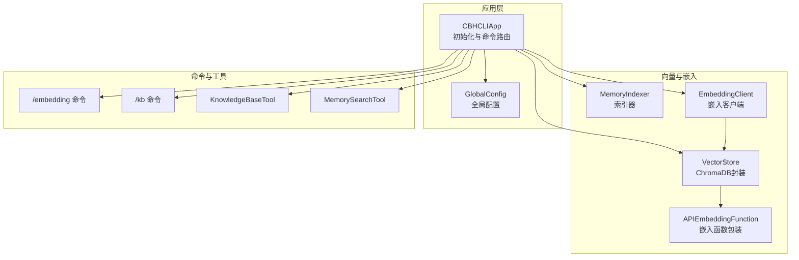
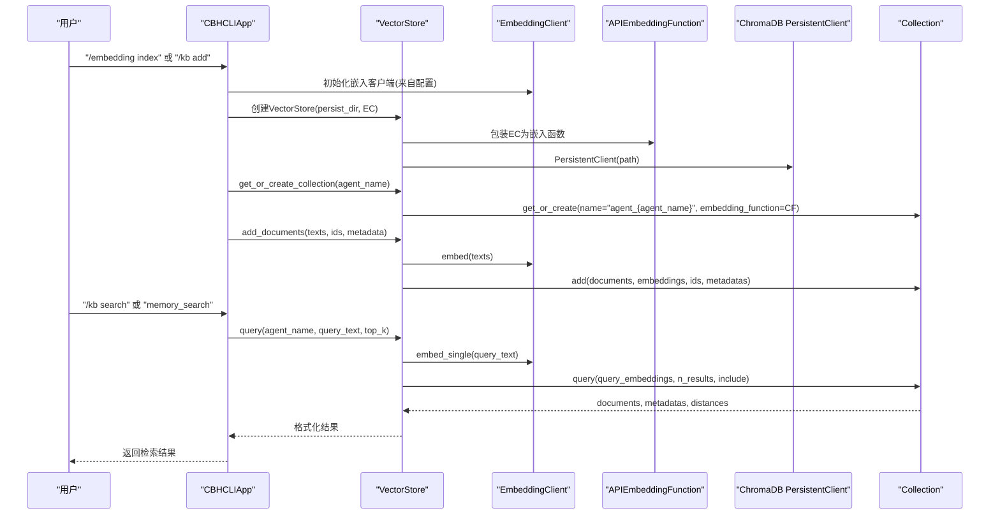
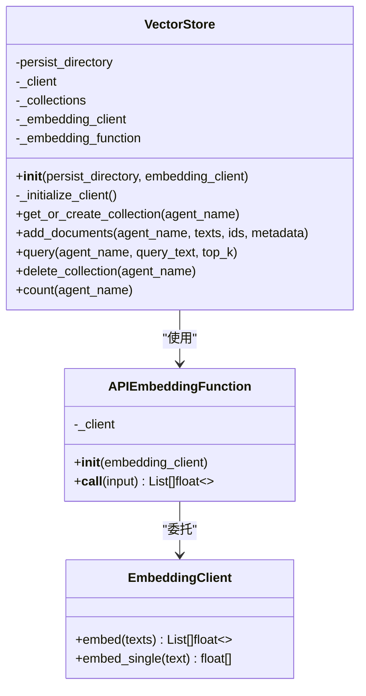
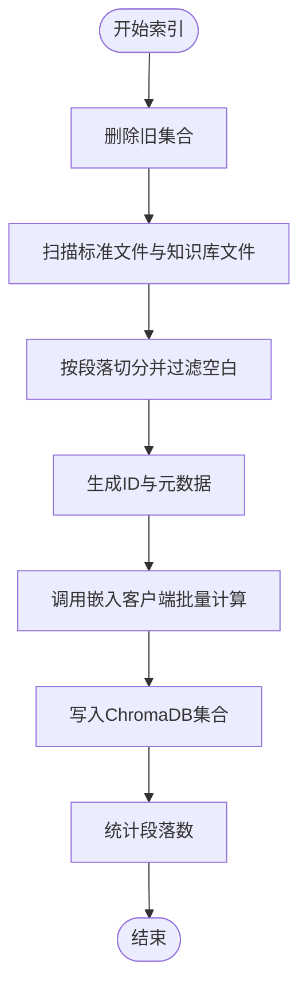
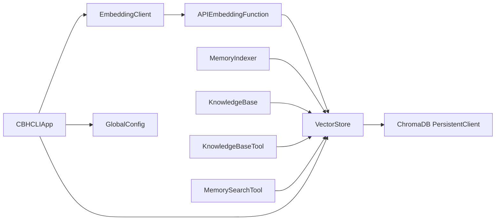

# ChromaDB集成

<cite>
**本文引用的文件**
- [store.py](file://cbhcli_pkg/vector/store.py)
- [indexer.py](file://cbhcli_pkg/vector/indexer.py)
- [embedding_client.py](file://cbhcli_pkg/core/embedding_client.py)
- [app.py](file://cbhcli_pkg/core/app.py)
- [global_config.py](file://cbhcli_pkg/config/global_config.py)
- [embedding_cmd.py](file://cbhcli_pkg/commands/embedding_cmd.py)
- [kb_cmd.py](file://cbhcli_pkg/commands/kb_cmd.py)
- [knowledge_base.py](file://cbhcli_pkg/core/knowledge_base.py)
- [knowledge_base_tool.py](file://cbhcli_pkg/tools/knowledge_base.py)
- [memory_search_tool.py](file://cbhcli_pkg/tools/memory_search.py)
- [requirements.txt](file://requirements.txt)
</cite>

## 目录
1. [简介](#简介)
2. [项目结构](#项目结构)
3. [核心组件](#核心组件)
4. [架构总览](#架构总览)
5. [详细组件分析](#详细组件分析)
6. [依赖关系分析](#依赖关系分析)
7. [性能考量](#性能考量)
8. [故障排除指南](#故障排除指南)
9. [结论](#结论)
10. [附录](#附录)

## 简介
本文件面向CBHCLI的ChromaDB集成，围绕向量数据库客户端初始化、VectorStore设计与集合管理、APIEmbeddingFunction封装、集合创建与元数据绑定、安装与配置、数据结构与索引机制、故障排除与性能监控、备份与恢复等方面进行系统化技术说明。文档同时提供面向非专业读者的渐进式理解路径，并通过图示展示关键流程。

## 项目结构
CBHCLI的ChromaDB集成主要分布在以下模块：
- 向量存储与嵌入封装：vector/store.py、core/embedding_client.py
- 索引器：vector/indexer.py
- 应用初始化与工具注册：core/app.py
- 配置管理：config/global_config.py
- 命令行接口：commands/embedding_cmd.py、commands/kb_cmd.py
- 知识库管理与工具：core/knowledge_base.py、tools/knowledge_base.py、tools/memory_search.py
- 依赖声明：requirements.txt

**图表来源**
- [app.py:97-150](file://cbhcli_pkg/core/app.py#L97-L150)
- [store.py:37-78](file://cbhcli_pkg/vector/store.py#L37-L78)
- [indexer.py:28-36](file://cbhcli_pkg/vector/indexer.py#L28-L36)
- [embedding_client.py:15-33](file://cbhcli_pkg/core/embedding_client.py#L15-L33)
- [embedding_cmd.py:5-39](file://cbhcli_pkg/commands/embedding_cmd.py#L5-L39)
- [kb_cmd.py:5-54](file://cbhcli_pkg/commands/kb_cmd.py#L5-L54)

**章节来源**
- [app.py:97-150](file://cbhcli_pkg/core/app.py#L97-L150)
- [store.py:37-78](file://cbhcli_pkg/vector/store.py#L37-L78)
- [indexer.py:28-36](file://cbhcli_pkg/vector/indexer.py#L28-L36)
- [embedding_client.py:15-33](file://cbhcli_pkg/core/embedding_client.py#L15-L33)
- [embedding_cmd.py:5-39](file://cbhcli_pkg/commands/embedding_cmd.py#L5-L39)
- [kb_cmd.py:5-54](file://cbhcli_pkg/commands/kb_cmd.py#L5-L54)

## 核心组件
- VectorStore：ChromaDB持久化客户端封装，负责集合的获取/创建、文档批量添加、语义查询、集合删除与计数。
- APIEmbeddingFunction：将EmbeddingClient的embed/embed_single方法包装为ChromaDB可调用的嵌入函数。
- EmbeddingClient：统一的外部嵌入模型API客户端，支持OpenAI兼容与自定义格式，具备批量请求能力与超时控制。
- MemoryIndexer：将Agent工作空间与知识库文件切分为段落并索引到向量数据库，负责ID生成与元数据注入。
- KnowledgeBase：知识库文件管理与索引入口，支持增删查与全量重索引。
- 工具：KnowledgeBaseTool与MemorySearchTool提供语义检索能力，支持可选重排序。

**章节来源**
- [store.py:37-175](file://cbhcli_pkg/vector/store.py#L37-L175)
- [embedding_client.py:6-132](file://cbhcli_pkg/core/embedding_client.py#L6-L132)
- [indexer.py:7-178](file://cbhcli_pkg/vector/indexer.py#L7-L178)
- [knowledge_base.py:7-207](file://cbhcli_pkg/core/knowledge_base.py#L7-L207)
- [knowledge_base_tool.py:6-157](file://cbhcli_pkg/tools/knowledge_base.py#L6-L157)
- [memory_search_tool.py:6-177](file://cbhcli_pkg/tools/memory_search.py#L6-L177)

## 架构总览
下图展示了从应用初始化到向量检索的关键交互路径，包括嵌入模型配置、向量存储初始化、索引与查询流程。

**图表来源**
- [app.py:97-150](file://cbhcli_pkg/core/app.py#L97-L150)
- [store.py:37-175](file://cbhcli_pkg/vector/store.py#L37-L175)
- [embedding_client.py:15-132](file://cbhcli_pkg/core/embedding_client.py#L15-L132)
- [embedding_cmd.py:42-69](file://cbhcli_pkg/commands/embedding_cmd.py#L42-L69)
- [kb_cmd.py:126-144](file://cbhcli_pkg/commands/kb_cmd.py#L126-L144)
- [knowledge_base_tool.py:49-121](file://cbhcli_pkg/tools/knowledge_base.py#L49-L121)
- [memory_search_tool.py:47-103](file://cbhcli_pkg/tools/memory_search.py#L47-L103)

## 详细组件分析

### VectorStore：ChromaDB客户端与集合管理
- 初始化与错误处理
  - 必须提供嵌入客户端；否则抛出明确错误提示，指导用户配置嵌入模型或安装内置模型依赖。
  - 持久化目录自动创建；导入ChromaDB失败时抛出明确的安装指引。
- 集合管理
  - 采用“agent_name”作为集合名前缀，形如“agent_{agent_name}”，并注入描述性metadata。
  - 首次访问时缓存集合实例，避免重复创建。
- 文档存储
  - 文档ID策略：按段落生成唯一ID，确保内容变更后ID可区分。
  - 元数据处理：若未提供或为空，自动填充默认字段，满足ChromaDB对非空字典的要求。
  - 嵌入计算：预先调用EmbeddingClient.embed批量计算，避免ChromaDB内部默认模型调用。
- 查询接口
  - 预先计算查询向量，调用collection.query并include文档、元数据与距离，再格式化输出。
- 其他能力
  - 删除集合与统计文档数量，便于调试与维护。

**图表来源**
- [store.py:37-175](file://cbhcli_pkg/vector/store.py#L37-L175)
- [embedding_client.py:6-132](file://cbhcli_pkg/core/embedding_client.py#L6-L132)

**章节来源**
- [store.py:37-175](file://cbhcli_pkg/vector/store.py#L37-L175)

### APIEmbeddingFunction：外部API嵌入函数封装
- 设计要点
  - 将EmbeddingClient的embed/embed_single方法包装为ChromaDB可直接调用的函数签名，保证向量维度与类型一致。
  - 在VectorStore中作为embedding_function传入集合，确保所有新增与查询均使用同一嵌入模型。
- 调用机制
  - 批量嵌入：VectorStore.add_documents调用EmbeddingClient.embed。
  - 查询嵌入：VectorStore.query调用EmbeddingClient.embed_single。

**章节来源**
- [store.py:12-35](file://cbhcli_pkg/vector/store.py#L12-L35)
- [embedding_client.py:34-132](file://cbhcli_pkg/core/embedding_client.py#L34-L132)

### MemoryIndexer：索引流程与文档ID管理
- 索引范围
  - Agent工作空间标准文件：memory.md、skills.md、soul.md、tools.md、usage.md。
  - 知识库目录：knowledge/ 下的多种格式文件。
- 段落切分与过滤
  - 按双换行符切分段落，去除空白段，保证有效文本。
- 文档ID与元数据
  - ID：基于agent_name、文件名与段落序号生成，确保可追踪与去重。
  - 元数据：包含agent_name、file_name、file_type、segment_index等，便于检索后溯源。
- 写入策略
  - 先删除旧集合，确保内容更新后索引一致性（段落ID基于序号而非内容哈希）。
  - 调用VectorStore.add_documents完成批量写入。

**图表来源**
- [indexer.py:37-135](file://cbhcli_pkg/vector/indexer.py#L37-L135)
- [store.py:99-126](file://cbhcli_pkg/vector/store.py#L99-L126)

**章节来源**
- [indexer.py:7-178](file://cbhcli_pkg/vector/indexer.py#L7-L178)

### KnowledgeBase：知识库文件管理与索引
- 文件管理
  - 添加：复制到知识库目录，自动处理重名；索引后返回段落数。
  - 删除：删除本地文件；当前实现为简化处理（可按ID删除）。
  - 列表：遍历知识库目录，返回文件信息。
  - 重索引：遍历全部文件并重新索引。
- 索引策略
  - 仅对支持的文本格式进行索引；二进制文件跳过。
  - 段落ID与元数据与MemoryIndexer一致，确保跨模块一致性。

**章节来源**
- [knowledge_base.py:7-207](file://cbhcli_pkg/core/knowledge_base.py#L7-L207)

### 应用初始化与工具注册
- 嵌入模型与重排序模型
  - 从全局配置读取嵌入/重排序模型配置，失败时给出警告。
- 向量存储与索引器
  - 仅当存在嵌入模型配置时初始化VectorStore与MemoryIndexer，并注册检索工具。
- 命令系统
  - 注册/embedding与/kb相关命令，提供索引状态、清理、重新索引等功能。

**章节来源**
- [app.py:97-150](file://cbhcli_pkg/core/app.py#L97-L150)
- [global_config.py:117-154](file://cbhcli_pkg/config/global_config.py#L117-L154)
- [embedding_cmd.py:5-122](file://cbhcli_pkg/commands/embedding_cmd.py#L5-L122)
- [kb_cmd.py:5-186](file://cbhcli_pkg/commands/kb_cmd.py#L5-L186)

### 查询工具：KnowledgeBaseTool与MemorySearchTool
- KnowledgeBaseTool
  - 从当前Agent名称推断集合名，调用VectorStore.query执行语义检索。
  - 若配置了重排序客户端且结果多于1条，则进行重排序并按分数排序输出。
- MemorySearchTool
  - 优先使用向量检索；若向量存储不可用，则降级为memory.md的关键词匹配。
  - 输出格式简洁，便于在无向量环境下的回退使用。

**章节来源**
- [knowledge_base_tool.py:49-157](file://cbhcli_pkg/tools/knowledge_base.py#L49-L157)
- [memory_search_tool.py:47-177](file://cbhcli_pkg/tools/memory_search.py#L47-L177)

## 依赖关系分析
- 外部依赖
  - ChromaDB：用于持久化存储与向量检索；需手动安装。
  - requests：用于EmbeddingClient的HTTP请求。
- 内部耦合
  - VectorStore强依赖EmbeddingClient；APIEmbeddingFunction作为桥接。
  - MemoryIndexer依赖VectorStore进行批量写入。
  - 命令与工具依赖VectorStore与全局配置。

**图表来源**
- [store.py:37-78](file://cbhcli_pkg/vector/store.py#L37-L78)
- [embedding_client.py:15-33](file://cbhcli_pkg/core/embedding_client.py#L15-L33)
- [indexer.py:28-36](file://cbhcli_pkg/vector/indexer.py#L28-L36)
- [knowledge_base.py:16-30](file://cbhcli_pkg/core/knowledge_base.py#L16-L30)
- [knowledge_base_tool.py:19-23](file://cbhcli_pkg/tools/knowledge_base.py#L19-L23)
- [memory_search_tool.py:18-21](file://cbhcli_pkg/tools/memory_search.py#L18-L21)
- [app.py:97-150](file://cbhcli_pkg/core/app.py#L97-L150)
- [global_config.py:117-154](file://cbhcli_pkg/config/global_config.py#L117-L154)

**章节来源**
- [requirements.txt:1-7](file://requirements.txt#L1-L7)
- [app.py:97-150](file://cbhcli_pkg/core/app.py#L97-L150)

## 性能考量
- 嵌入计算批次化
  - EmbeddingClient对批量请求进行分批处理，减少单次请求负载与API限流风险。
- 预计算嵌入
  - VectorStore在写入与查询前预计算嵌入向量，避免ChromaDB内部默认模型调用，提升一致性与可控性。
- 元数据与索引
  - 元数据字段精简且必要，有助于检索效率；集合按Agent隔离，避免跨Agent干扰。
- 上下文压缩
  - 应用层提供上下文压缩器，降低长对话带来的Token压力，间接提升检索质量与响应速度。

**章节来源**
- [embedding_client.py:49-118](file://cbhcli_pkg/core/embedding_client.py#L49-L118)
- [store.py:118-149](file://cbhcli_pkg/vector/store.py#L118-L149)

## 故障排除指南
- 未安装ChromaDB
  - 现象：初始化VectorStore时报ImportError。
  - 处理：根据提示安装依赖。
- 未配置嵌入模型
  - 现象：应用提示启用向量搜索功能需配置嵌入模型。
  - 处理：通过模型命令添加嵌入模型配置。
- 索引状态异常
  - 现象：查询无结果或段落数为0。
  - 处理：使用/embedding status查看索引状态；若未索引，执行/embedding index；必要时使用/embedding reindex。
- 查询无结果
  - 现象：/kb search或memory_search返回未找到相关内容。
  - 处理：确认已索引；检查知识库文件格式与内容；必要时重新索引。
- 重排序失败
  - 现象：重排序模块报错但不影响基础检索。
  - 处理：检查重排序模型配置；程序会自动降级使用原始结果。

**章节来源**
- [store.py:74-77](file://cbhcli_pkg/vector/store.py#L74-L77)
- [app.py:146-149](file://cbhcli_pkg/core/app.py#L146-L149)
- [embedding_cmd.py:72-91](file://cbhcli_pkg/commands/embedding_cmd.py#L72-L91)
- [knowledge_base_tool.py:116-121](file://cbhcli_pkg/tools/knowledge_base.py#L116-L121)
- [memory_search_tool.py:98-103](file://cbhcli_pkg/tools/memory_search.py#L98-L103)

## 结论
CBHCLI的ChromaDB集成通过VectorStore与APIEmbeddingFunction实现了对外部嵌入模型的统一接入，结合MemoryIndexer与KnowledgeBase提供了从文件到向量的完整索引链路。应用层通过命令与工具将检索能力无缝融入交互流程，既支持强功能场景，也提供降级回退方案。整体设计强调可配置、可扩展与可维护性，适合在多Agent场景下稳定运行。

## 附录

### 安装与配置指南
- 依赖安装
  - ChromaDB：用于语义搜索与持久化存储，需手动安装。
  - requests：用于嵌入模型API通信。
- 版本兼容性
  - ChromaDB版本需与项目兼容；如遇导入失败，请确认安装正确。
- 性能优化建议
  - 使用较大的batch_size以减少API往返次数（受嵌入服务限制）。
  - 合理设置top_k，平衡召回与性能。
  - 定期清理不再使用的集合，释放磁盘与内存资源。

**章节来源**
- [requirements.txt:1-7](file://requirements.txt#L1-L7)
- [store.py:74-77](file://cbhcli_pkg/vector/store.py#L74-L77)

### 数据结构与索引机制
- 文档ID管理
  - 段落级ID：基于agent_name、文件名与段落序号，确保可追溯与可更新。
- 元数据存储
  - 包含文件名、类型、索引序号等，便于检索后溯源与二次加工。
- 距离计算
  - ChromaDB内部基于嵌入向量计算相似度；VectorStore返回距离值供上层使用（如重排序）。

**章节来源**
- [indexer.py:117-134](file://cbhcli_pkg/vector/indexer.py#L117-L134)
- [store.py:145-160](file://cbhcli_pkg/vector/store.py#L145-L160)

### 备份与恢复最佳实践
- 备份
  - 备份ChromaDB持久化目录（默认位于用户主目录下的向量存储路径），包含集合数据与索引。
- 恢复
  - 停止应用后替换持久化目录；重启应用后集合与索引自动加载。
- 注意事项
  - 恢复前确保嵌入模型配置一致，避免向量维度不匹配导致检索异常。

**章节来源**
- [app.py:123-128](file://cbhcli_pkg/core/app.py#L123-L128)
- [store.py:55-57](file://cbhcli_pkg/vector/store.py#L55-L57)