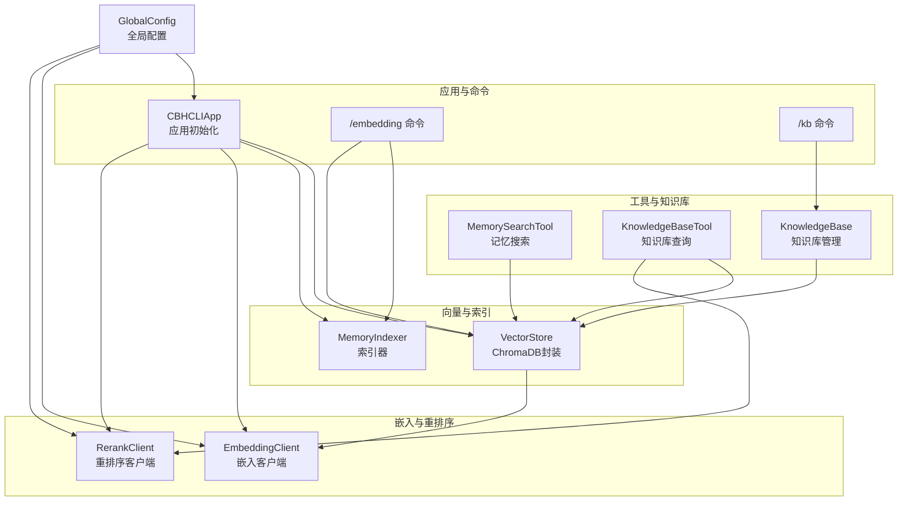
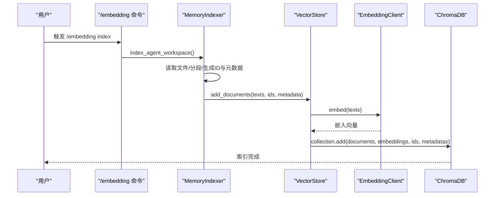
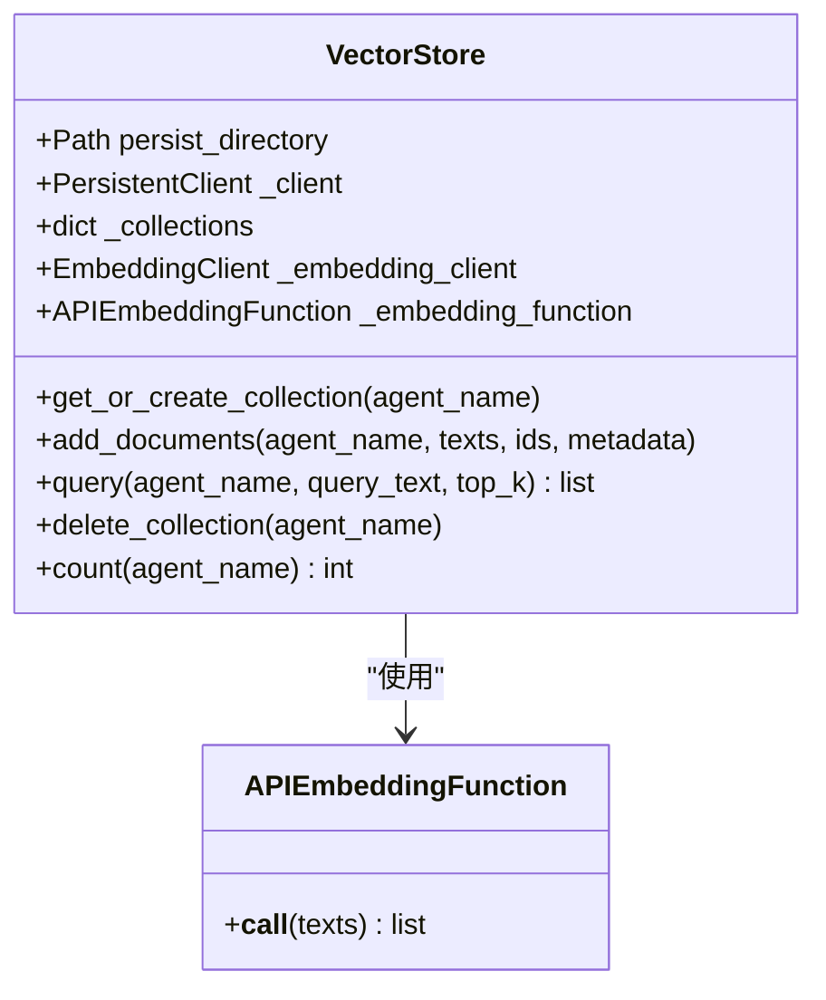
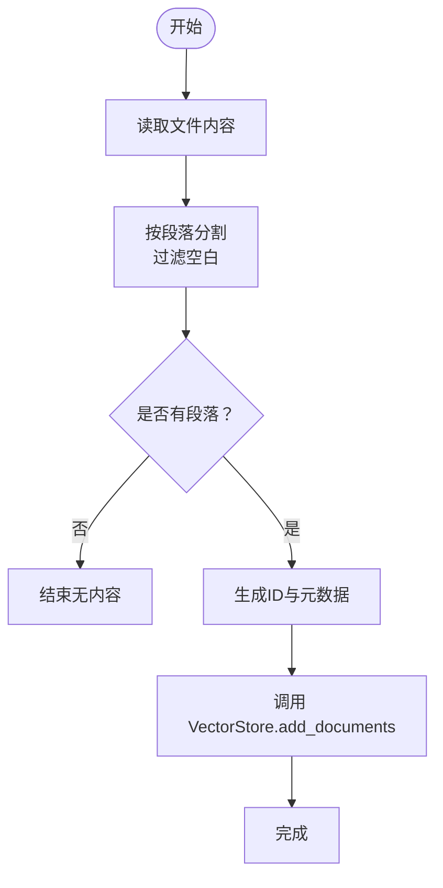
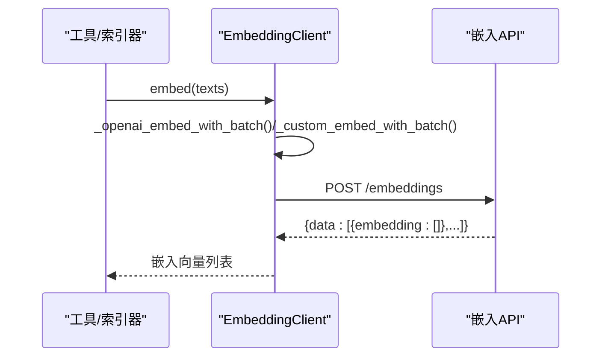
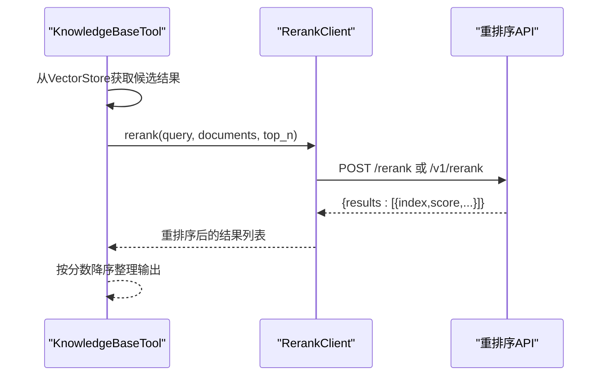
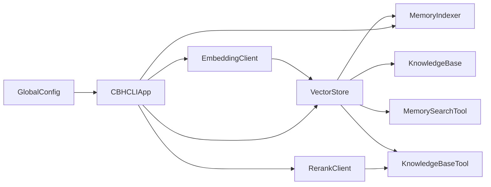
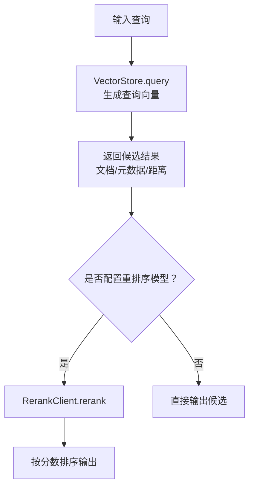

# 向量数据库集成

<cite>
**本文引用的文件**
- [README.md](file://README.md)
- [cbhcli_pkg/vector/store.py](file://cbhcli_pkg/vector/store.py)
- [cbhcli_pkg/vector/indexer.py](file://cbhcli_pkg/vector/indexer.py)
- [cbhcli_pkg/core/embedding_client.py](file://cbhcli_pkg/core/embedding_client.py)
- [cbhcli_pkg/core/rerank_client.py](file://cbhcli_pkg/core/rerank_client.py)
- [cbhcli_pkg/core/knowledge_base.py](file://cbhcli_pkg/core/knowledge_base.py)
- [cbhcli_pkg/core/app.py](file://cbhcli_pkg/core/app.py)
- [cbhcli_pkg/config/global_config.py](file://cbhcli_pkg/config/global_config.py)
- [cbhcli_pkg/commands/embedding_cmd.py](file://cbhcli_pkg/commands/embedding_cmd.py)
- [cbhcli_pkg/commands/kb_cmd.py](file://cbhcli_pkg/commands/kb_cmd.py)
- [cbhcli_pkg/tools/memory_search.py](file://cbhcli_pkg/tools/memory_search.py)
- [cbhcli_pkg/tools/knowledge_base.py](file://cbhcli_pkg/tools/knowledge_base.py)
</cite>

## 目录
1. [简介](#简介)
2. [项目结构](#项目结构)
3. [核心组件](#核心组件)
4. [架构总览](#架构总览)
5. [详细组件分析](#详细组件分析)
6. [依赖分析](#依赖分析)
7. [性能考虑](#性能考虑)
8. [故障排除与数据恢复](#故障排除与数据恢复)
9. [结论](#结论)
10. [附录](#附录)

## 简介
本文件面向开发者与运维人员，系统化阐述 CBHCLI 中基于 ChromaDB 的向量数据库集成方案，涵盖以下主题：
- ChromaDB 集成与配置要点（持久化路径、嵌入函数注入、集合命名规范）
- 嵌入模型 API 集成（OpenAI 兼容接口、自定义 API、批量处理与超时控制）
- 重排序服务集成（Jina、Cohere 等第三方重排序 API）
- 向量索引完整工作流程（文档预处理、分块策略、嵌入生成、索引存储）
- 向量检索查询机制（相似度计算、结果排序、元数据携带）
- 监控与维护（索引状态检查、性能指标、容量管理）
- 性能优化策略（缓存、批量、并发控制）
- 故障排除与数据恢复
- 扩展与定制建议（自定义嵌入模型、重排序模型、索引策略）

## 项目结构
CBHCLI 的向量数据库相关代码主要分布在以下模块：
- vector：ChromaDB 封装、索引器
- core：嵌入客户端、重排序客户端、知识库管理、应用初始化
- commands：斜杠命令（/embedding、/kb）
- tools：记忆搜索与知识库查询工具
- config：全局配置（嵌入模型、重排序模型、设置项）

**图表来源**
- [cbhcli_pkg/core/app.py:97-150](file://cbhcli_pkg/core/app.py#L97-L150)
- [cbhcli_pkg/vector/store.py:37-98](file://cbhcli_pkg/vector/store.py#L37-L98)
- [cbhcli_pkg/vector/indexer.py:7-69](file://cbhcli_pkg/vector/indexer.py#L7-L69)
- [cbhcli_pkg/core/embedding_client.py:6-48](file://cbhcli_pkg/core/embedding_client.py#L6-L48)
- [cbhcli_pkg/core/rerank_client.py:6-60](file://cbhcli_pkg/core/rerank_client.py#L6-L60)
- [cbhcli_pkg/commands/embedding_cmd.py:42-91](file://cbhcli_pkg/commands/embedding_cmd.py#L42-L91)
- [cbhcli_pkg/commands/kb_cmd.py:57-145](file://cbhcli_pkg/commands/kb_cmd.py#L57-L145)
- [cbhcli_pkg/tools/memory_search.py:6-74](file://cbhcli_pkg/tools/memory_search.py#L6-L74)
- [cbhcli_pkg/tools/knowledge_base.py:6-82](file://cbhcli_pkg/tools/knowledge_base.py#L6-L82)
- [cbhcli_pkg/config/global_config.py:117-153](file://cbhcli_pkg/config/global_config.py#L117-L153)

**章节来源**
- [README.md:269-296](file://README.md#L269-L296)
- [cbhcli_pkg/core/app.py:97-150](file://cbhcli_pkg/core/app.py#L97-L150)

## 核心组件
- VectorStore：封装 ChromaDB 客户端，注入自定义嵌入函数，负责集合创建、文档添加、查询与统计。
- MemoryIndexer：负责将 Agent 工作空间内的标准文档与知识库文件切分为段落并写入向量数据库。
- EmbeddingClient：统一嵌入模型 API 客户端，支持 OpenAI 兼容与自定义 API，具备批量处理与超时控制。
- RerankClient：统一重排序 API 客户端，支持 Jina、Cohere 等，按模型类型自动选择调用格式。
- KnowledgeBase：知识库管理，负责文件增删改查与重新索引。
- CBHCLIApp：应用初始化，按配置加载嵌入与重排序模型，构建向量存储与索引器，并注册相关工具。

**章节来源**
- [cbhcli_pkg/vector/store.py:37-175](file://cbhcli_pkg/vector/store.py#L37-L175)
- [cbhcli_pkg/vector/indexer.py:7-178](file://cbhcli_pkg/vector/indexer.py#L7-L178)
- [cbhcli_pkg/core/embedding_client.py:6-132](file://cbhcli_pkg/core/embedding_client.py#L6-L132)
- [cbhcli_pkg/core/rerank_client.py:6-123](file://cbhcli_pkg/core/rerank_client.py#L6-L123)
- [cbhcli_pkg/core/knowledge_base.py:7-207](file://cbhcli_pkg/core/knowledge_base.py#L7-L207)
- [cbhcli_pkg/core/app.py:97-150](file://cbhcli_pkg/core/app.py#L97-L150)

## 架构总览
CBHCLI 的向量检索链路由“索引阶段”和“查询阶段”构成：
- 索引阶段：MemoryIndexer 读取文件 → 分段 → 生成 ID 与元数据 → 通过 VectorStore 使用 EmbeddingClient 生成嵌入 → 写入 ChromaDB 集合。
- 查询阶段：工具调用 VectorStore 查询 → 返回文档、元数据与距离；若配置重排序模型，则使用 RerankClient 对结果进行重排。

**图表来源**
- [cbhcli_pkg/commands/embedding_cmd.py:42-69](file://cbhcli_pkg/commands/embedding_cmd.py#L42-L69)
- [cbhcli_pkg/vector/indexer.py:37-134](file://cbhcli_pkg/vector/indexer.py#L37-L134)
- [cbhcli_pkg/vector/store.py:99-126](file://cbhcli_pkg/vector/store.py#L99-L126)

**章节来源**
- [cbhcli_pkg/commands/embedding_cmd.py:42-91](file://cbhcli_pkg/commands/embedding_cmd.py#L42-L91)
- [cbhcli_pkg/vector/indexer.py:37-134](file://cbhcli_pkg/vector/indexer.py#L37-L134)
- [cbhcli_pkg/vector/store.py:99-126](file://cbhcli_pkg/vector/store.py#L99-L126)

## 详细组件分析

### VectorStore（ChromaDB 封装）
- 初始化与客户端创建：使用持久化路径创建 PersistentClient；通过自定义嵌入函数注入，避免使用 ChromaDB 默认模型。
- 集合管理：按 Agent 名称创建集合，集合名采用“agent_{agent_name}”，并携带描述元数据。
- 文档添加：预先调用嵌入客户端批量生成嵌入，再调用 collection.add 写入文档、嵌入、ID 与元数据。
- 查询：预先生成查询向量，调用 collection.query 返回文档、元数据与距离，并格式化输出。

**图表来源**
- [cbhcli_pkg/vector/store.py:37-175](file://cbhcli_pkg/vector/store.py#L37-L175)

**章节来源**
- [cbhcli_pkg/vector/store.py:37-175](file://cbhcli_pkg/vector/store.py#L37-L175)

### MemoryIndexer（索引器）
- 支持的文件：标准 Agent 文件（memory.md、skills.md、soul.md、tools.md、usage.md）与 knowledge/ 目录下的多种格式文件。
- 分段策略：按双换行符分割为段落，过滤空白段，生成唯一 ID 与元数据（包含 Agent 名称、文件名、文件类型、段落索引）。
- 写入策略：调用 VectorStore.add_documents，确保元数据非空，避免 ChromaDB 约束问题。
- 更新策略：删除旧集合后重新索引，保证内容变更后的索引一致性。

**图表来源**
- [cbhcli_pkg/vector/indexer.py:87-134](file://cbhcli_pkg/vector/indexer.py#L87-L134)

**章节来源**
- [cbhcli_pkg/vector/indexer.py:7-178](file://cbhcli_pkg/vector/indexer.py#L7-L178)

### 嵌入模型 API 集成（EmbeddingClient）
- 支持类型：OpenAI 兼容与自定义类型；通过 type 字段区分。
- 批量处理：默认每批 10 条文本，减少 API 调用次数与超时风险。
- 超时控制：请求超时设为 30 秒，避免阻塞。
- OpenAI 兼容格式：统一使用 encoding_format 为 float，便于直接消费。
- 自定义 API：默认走 OpenAI 兼容格式，可按需覆写 _custom_embed。

**图表来源**
- [cbhcli_pkg/core/embedding_client.py:34-91](file://cbhcli_pkg/core/embedding_client.py#L34-L91)

**章节来源**
- [cbhcli_pkg/core/embedding_client.py:6-132](file://cbhcli_pkg/core/embedding_client.py#L6-L132)

### 重排序服务集成（RerankClient）
- 支持模型：Jina、Cohere 等；根据模型名关键字自动选择调用格式。
- 请求格式：统一携带 query、documents、top_n；按 API 类型构造请求体。
- 结果格式化：提取 index、document、relevance_score 并映射回原始结果，按分数降序排序。

**图表来源**
- [cbhcli_pkg/tools/knowledge_base.py:123-156](file://cbhcli_pkg/tools/knowledge_base.py#L123-L156)
- [cbhcli_pkg/core/rerank_client.py:35-122](file://cbhcli_pkg/core/rerank_client.py#L35-L122)

**章节来源**
- [cbhcli_pkg/core/rerank_client.py:6-123](file://cbhcli_pkg/core/rerank_client.py#L6-L123)
- [cbhcli_pkg/tools/knowledge_base.py:123-156](file://cbhcli_pkg/tools/knowledge_base.py#L123-L156)

### 知识库管理（KnowledgeBase）
- 文件管理：添加、删除、列出、重新索引；支持重名处理与二进制文件跳过。
- 索引策略：按段落切分、生成 ID 与元数据、调用 VectorStore.add_documents 写入。
- 状态查询：结合 VectorStore.count 输出向量文档数量。

**章节来源**
- [cbhcli_pkg/core/knowledge_base.py:31-207](file://cbhcli_pkg/core/knowledge_base.py#L31-L207)

### 应用初始化与命令集成（CBHCLIApp）
- 按配置加载嵌入与重排序模型；仅在嵌入模型存在时初始化 VectorStore 与 MemoryIndexer，并注册相关工具。
- /embedding 命令：索引工作空间、查看状态、清除索引、重新索引。
- /kb 命令：知识库文件管理与状态查看。

**章节来源**
- [cbhcli_pkg/core/app.py:97-150](file://cbhcli_pkg/core/app.py#L97-L150)
- [cbhcli_pkg/commands/embedding_cmd.py:5-39](file://cbhcli_pkg/commands/embedding_cmd.py#L5-L39)
- [cbhcli_pkg/commands/kb_cmd.py:5-54](file://cbhcli_pkg/commands/kb_cmd.py#L5-L54)

## 依赖分析
- VectorStore 依赖 EmbeddingClient（通过 APIEmbeddingFunction 注入），并使用 ChromaDB 客户端。
- MemoryIndexer 依赖 VectorStore，负责文档预处理与写入。
- KnowledgeBase 依赖 VectorStore 与 MemoryIndexer，负责知识库文件的索引与管理。
- KnowledgeBaseTool 依赖 VectorStore 与 RerankClient，负责知识库查询与重排序。
- MemorySearchTool 在向量不可用时降级为 memory.md 文本匹配。
- GlobalConfig 提供嵌入模型与重排序模型配置入口，影响应用初始化与工具行为。

**图表来源**
- [cbhcli_pkg/core/app.py:97-150](file://cbhcli_pkg/core/app.py#L97-L150)
- [cbhcli_pkg/vector/store.py:37-62](file://cbhcli_pkg/vector/store.py#L37-L62)
- [cbhcli_pkg/core/embedding_client.py:6-33](file://cbhcli_pkg/core/embedding_client.py#L6-L33)
- [cbhcli_pkg/core/rerank_client.py:6-34](file://cbhcli_pkg/core/rerank_client.py#L6-L34)
- [cbhcli_pkg/config/global_config.py:117-153](file://cbhcli_pkg/config/global_config.py#L117-L153)

**章节来源**
- [cbhcli_pkg/core/app.py:97-150](file://cbhcli_pkg/core/app.py#L97-L150)
- [cbhcli_pkg/config/global_config.py:117-153](file://cbhcli_pkg/config/global_config.py#L117-L153)

## 性能考虑
- 嵌入生成性能
  - 批量处理：EmbeddingClient 默认每批 10 条，降低 API 调用频率与超时概率。
  - 预计算嵌入：VectorStore.add_documents 与 query 前均预先计算嵌入，避免 ChromaDB 默认模型调用。
  - 超时控制：嵌入与重排序请求均设置超时，避免长时间阻塞。
- 查询性能
  - 向量检索：使用 top_k 控制返回数量，减少下游处理开销。
  - 重排序：仅在候选结果多于 1 时启用，避免不必要的二次调用。
- 存储与索引
  - 集合命名与元数据：集合名与元数据有助于后续维护与审计。
  - 分段策略：按段落切分提升检索粒度，但需平衡段落数量与嵌入成本。
- 并发与缓存
  - 建议在应用层引入轻量缓存（如内存缓存）以复用嵌入结果，减少重复 API 调用。
  - 批量写入：合并多次 add_documents 调用，减少网络往返。
- 监控与容量
  - 定期检查 VectorStore.count，评估索引规模。
  - 监控嵌入与重排序 API 的响应时间与错误率，必要时调整 batch_size 与超时阈值。

[本节为通用性能建议，不直接分析具体文件，故无“章节来源”]

## 故障排除与数据恢复
- 常见问题
  - 未配置嵌入模型：VectorStore 初始化会抛出异常提示配置嵌入模型或安装 chromadb。
  - ChromaDB 未安装：初始化客户端时捕获 ImportError 并提示安装。
  - 重排序失败：RerankClient 在请求失败时抛出异常；KnowledgeBaseTool 捕获异常并回退到原始结果。
  - 索引失败：/embedding 命令捕获异常并返回错误信息。
- 数据恢复
  - 清除索引：/embedding clear 删除集合，随后重新执行 /embedding index 或 /embedding reindex。
  - 知识库文件删除：/kb remove 删除文件后，建议重新索引以保持向量一致。
- 日志与诊断
  - 应用初始化时对嵌入与重排序模型初始化失败进行告警。
  - 工具执行过程中捕获异常并返回错误信息，便于定位问题。

**章节来源**
- [cbhcli_pkg/vector/store.py:48-77](file://cbhcli_pkg/vector/store.py#L48-L77)
- [cbhcli_pkg/core/rerank_client.py:76-108](file://cbhcli_pkg/core/rerank_client.py#L76-L108)
- [cbhcli_pkg/commands/embedding_cmd.py:68-69](file://cbhcli_pkg/commands/embedding_cmd.py#L68-L69)
- [cbhcli_pkg/core/app.py:108-118](file://cbhcli_pkg/core/app.py#L108-L118)

## 结论
CBHCLI 的向量数据库集成以 ChromaDB 为核心，通过自定义嵌入函数与客户端解耦，实现了灵活的嵌入模型与重排序模型接入。索引器与知识库管理提供了完善的文档预处理与维护能力，工具层则将向量检索无缝融入到 AI 工作流中。通过批量处理、预计算嵌入与可选重排序，系统在准确性与性能之间取得良好平衡。建议在生产环境中配合缓存、限流与监控，持续优化索引与查询体验。

[本节为总结性内容，不直接分析具体文件，故无“章节来源”]

## 附录

### 配置与使用清单
- 配置嵌入模型：/model embedding add（支持 openai/custom 类型）
- 配置重排序模型：/model rerank add（支持 jina/cohere 等）
- 索引工作空间：/embedding index（启动时不自动索引）
- 知识库管理：/kb add/list/remove/reindex/status
- 查询与重排序：知识库工具自动调用 VectorStore 查询并按需重排序

**章节来源**
- [README.md:107-123](file://README.md#L107-L123)
- [cbhcli_pkg/commands/embedding_cmd.py:8-32](file://cbhcli_pkg/commands/embedding_cmd.py#L8-L32)
- [cbhcli_pkg/commands/kb_cmd.py:8-46](file://cbhcli_pkg/commands/kb_cmd.py#L8-L46)

### 向量检索工作流（概念图）

[本图为概念流程示意，不直接映射具体源码，故无“图表来源”]