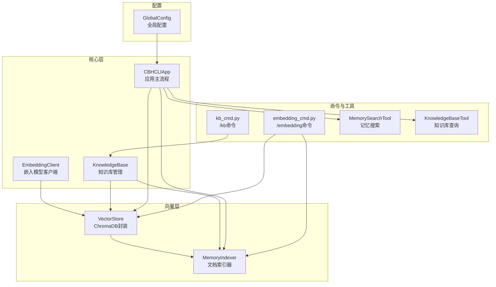
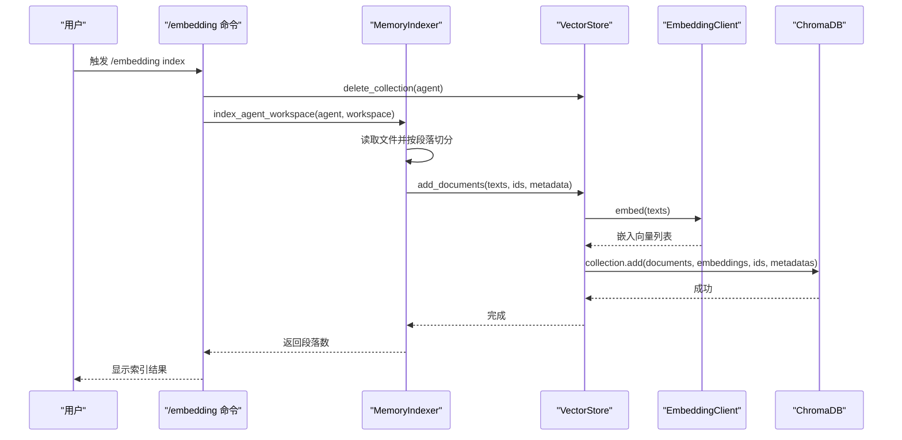
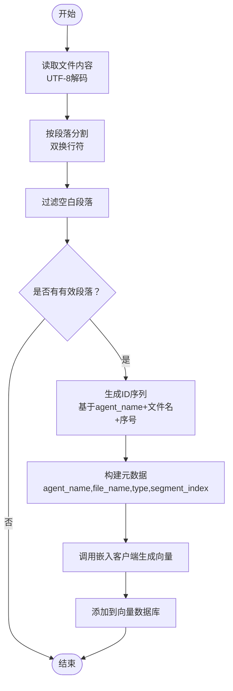
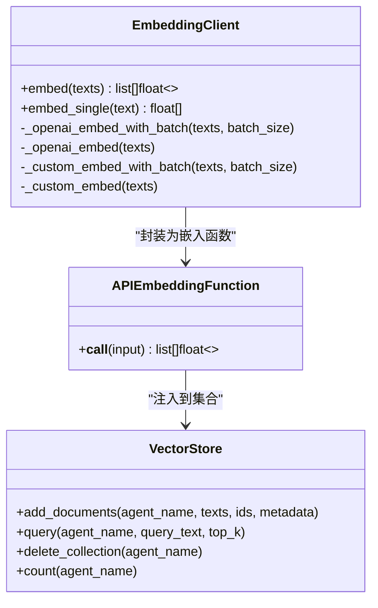
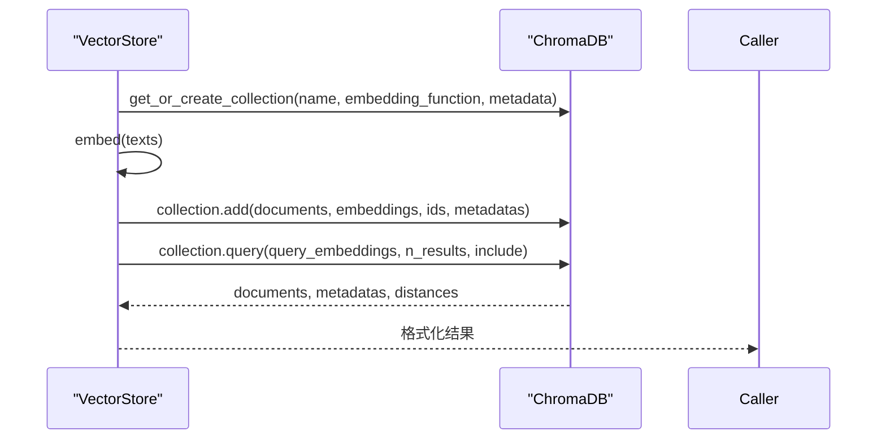
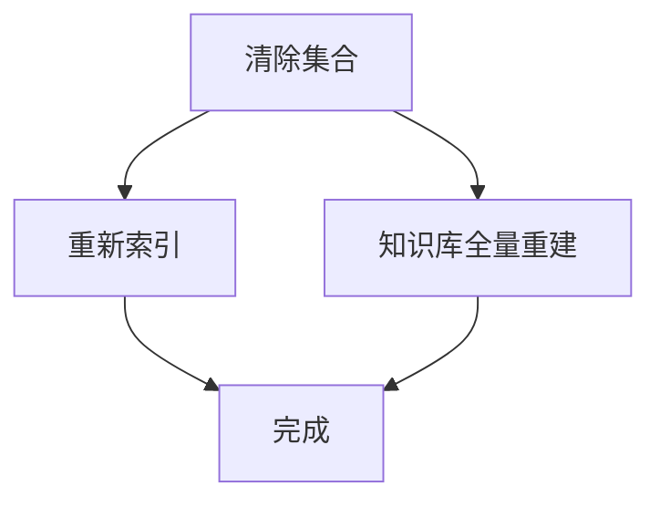
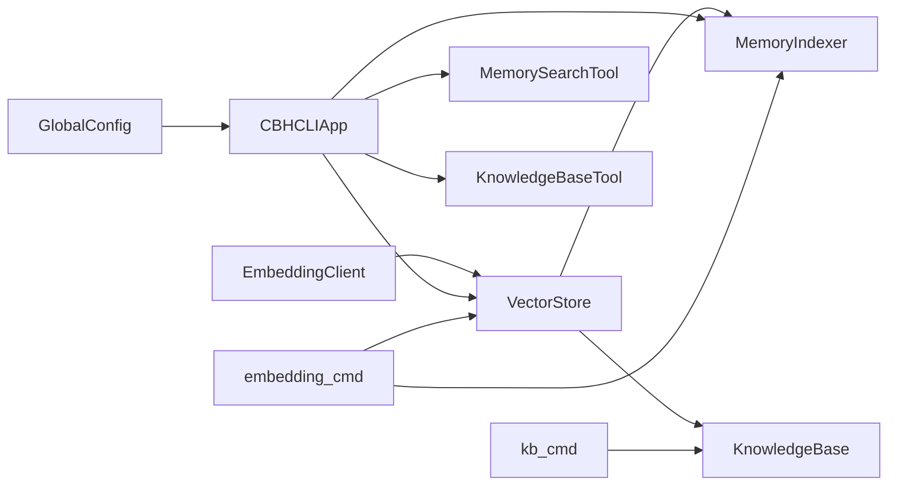

# 向量索引工作流程

<cite>
**本文档引用的文件**
- [indexer.py](file://cbhcli_pkg/vector/indexer.py)
- [store.py](file://cbhcli_pkg/vector/store.py)
- [embedding_client.py](file://cbhcli_pkg/core/embedding_client.py)
- [knowledge_base.py](file://cbhcli_pkg/core/knowledge_base.py)
- [kb_cmd.py](file://cbhcli_pkg/commands/kb_cmd.py)
- [embedding_cmd.py](file://cbhcli_pkg/commands/embedding_cmd.py)
- [memory_search.py](file://cbhcli_pkg/tools/memory_search.py)
- [knowledge_base.py](file://cbhcli_pkg/tools/knowledge_base.py)
- [app.py](file://cbhcli_pkg/core/app.py)
- [global_config.py](file://cbhcli_pkg/config/global_config.py)
- [cli.py](file://cbhcli_pkg/cli.py)
</cite>

## 目录
1. [简介](#简介)
2. [项目结构](#项目结构)
3. [核心组件](#核心组件)
4. [架构总览](#架构总览)
5. [详细组件分析](#详细组件分析)
6. [依赖关系分析](#依赖关系分析)
7. [性能考虑](#性能考虑)
8. [故障排除指南](#故障排除指南)
9. [结论](#结论)
10. [附录](#附录)

## 简介
本指南面向CBHCLI的向量索引工作流程，围绕文档预处理、分块策略、嵌入向量生成、索引创建与存储、索引更新与维护、性能监控与优化、故障排除与数据恢复，以及扩展与定制方案进行全面阐述。系统采用ChromaDB作为向量数据库，通过自定义嵌入模型API生成向量，支持Agent工作空间与知识库的语义检索。

## 项目结构
CBHCLI的向量索引相关模块主要分布在以下位置：
- vector：向量存储与索引器
- core：嵌入客户端、知识库管理、应用主流程
- commands：命令注册与处理
- tools：检索工具（记忆搜索、知识库查询）
- config：全局配置管理
- cli：命令行入口与帮助信息

图表来源
- [store.py:37-175](file://cbhcli_pkg/vector/store.py#L37-L175)
- [indexer.py:7-178](file://cbhcli_pkg/vector/indexer.py#L7-L178)
- [embedding_client.py:6-132](file://cbhcli_pkg/core/embedding_client.py#L6-L132)
- [knowledge_base.py:7-207](file://cbhcli_pkg/core/knowledge_base.py#L7-L207)
- [kb_cmd.py:5-186](file://cbhcli_pkg/commands/kb_cmd.py#L5-L186)
- [embedding_cmd.py:5-122](file://cbhcli_pkg/commands/embedding_cmd.py#L5-L122)
- [memory_search.py:6-177](file://cbhcli_pkg/tools/memory_search.py#L6-L177)
- [knowledge_base.py:6-157](file://cbhcli_pkg/tools/knowledge_base.py#L6-L157)
- [app.py:54-478](file://cbhcli_pkg/core/app.py#L54-L478)
- [global_config.py:13-154](file://cbhcli_pkg/config/global_config.py#L13-L154)

章节来源
- [cli.py:73-112](file://cbhcli_pkg/cli.py#L73-L112)

## 核心组件
- 向量存储(VectorStore)：封装ChromaDB客户端，提供集合管理、文档添加、查询、计数、删除等功能；通过自定义嵌入函数确保使用统一的嵌入模型。
- 记忆索引器(MemoryIndexer)：负责Agent工作空间文件的索引，支持标准Agent文件与知识库目录扫描，按段落切分并生成ID与元数据。
- 嵌入客户端(EmbeddingClient)：支持OpenAI兼容与自定义API，提供批量嵌入与单条嵌入能力，具备超时与错误处理。
- 知识库管理(KnowledgeBase)：管理Agent知识库目录，提供文件增删查改与全量重索引，内部调用向量存储完成向量化。
- 命令处理：/kb与/embedding命令分别处理知识库与索引操作；/kb status/status/reindex/clear等子命令覆盖常用运维场景。
- 检索工具：MemorySearchTool与KnowledgeBaseTool分别提供记忆与知识库的语义检索，支持降级与重排序。

章节来源
- [store.py:37-175](file://cbhcli_pkg/vector/store.py#L37-L175)
- [indexer.py:7-178](file://cbhcli_pkg/vector/indexer.py#L7-L178)
- [embedding_client.py:6-132](file://cbhcli_pkg/core/embedding_client.py#L6-L132)
- [knowledge_base.py:7-207](file://cbhcli_pkg/core/knowledge_base.py#L7-L207)
- [kb_cmd.py:5-186](file://cbhcli_pkg/commands/kb_cmd.py#L5-L186)
- [embedding_cmd.py:5-122](file://cbhcli_pkg/commands/embedding_cmd.py#L5-L122)
- [memory_search.py:6-177](file://cbhcli_pkg/tools/memory_search.py#L6-L177)
- [knowledge_base.py:6-157](file://cbhcli_pkg/tools/knowledge_base.py#L6-L157)

## 架构总览
下图展示从命令触发到向量数据库的完整工作流，包括文档预处理、分块、嵌入生成、索引入库与查询路径。

图表来源
- [embedding_cmd.py:42-70](file://cbhcli_pkg/commands/embedding_cmd.py#L42-L70)
- [indexer.py:37-69](file://cbhcli_pkg/vector/indexer.py#L37-L69)
- [indexer.py:87-134](file://cbhcli_pkg/vector/indexer.py#L87-L134)
- [store.py:99-126](file://cbhcli_pkg/vector/store.py#L99-L126)
- [embedding_client.py:34-91](file://cbhcli_pkg/core/embedding_client.py#L34-L91)

## 详细组件分析

### 文档预处理与分块策略
- 文本清洗与格式标准化
  - 读取UTF-8编码文本，按双换行符进行段落分割，过滤空白段落，保留有效片段。
  - 对于知识库文件，支持常见文本与代码格式（.md/.txt/.py/.js/.json/.yaml/.yml），二进制文件直接跳过。
- 内容分割策略
  - 固定长度分块：当前实现为按段落切分，未引入基于字符/词/句子的固定长度分块策略。
  - 语义分块：当前未实现基于语义的分块（如SentenceTransformer分句或基于主题的滚动窗口），但通过嵌入向量与ChromaDB的相似度检索实现语义匹配。
  - 重叠策略：当前未实现相邻段落的重叠拼接，ID基于序号生成，内容变更后ID不变，需重建索引保证一致性。
- 元数据设计
  - 包含agent_name、file_name、file_type/segment_index/type等字段，便于检索后溯源与排序。

图表来源
- [indexer.py:87-134](file://cbhcli_pkg/vector/indexer.py#L87-L134)
- [knowledge_base.py:151-206](file://cbhcli_pkg/core/knowledge_base.py#L151-L206)

章节来源
- [indexer.py:87-134](file://cbhcli_pkg/vector/indexer.py#L87-L134)
- [knowledge_base.py:151-206](file://cbhcli_pkg/core/knowledge_base.py#L151-L206)

### 嵌入向量生成与批量处理
- 嵌入模型API
  - 支持OpenAI兼容与自定义API两种模式，统一通过EmbeddingClient.embed批量生成向量。
  - 批量大小默认为10，符合多数API的限制；支持分批请求与错误处理。
- 并发控制
  - 当前实现为顺序批次处理，未引入线程池或异步并发；若需提升吞吐，可在嵌入客户端增加并发队列与限速控制。
- 错误处理
  - HTTP请求设置超时；API返回非200状态时抛出异常；上层命令与工具捕获并反馈错误信息。

图表来源
- [embedding_client.py:6-132](file://cbhcli_pkg/core/embedding_client.py#L6-L132)
- [store.py:12-35](file://cbhcli_pkg/vector/store.py#L12-L35)
- [store.py:99-126](file://cbhcli_pkg/vector/store.py#L99-L126)

章节来源
- [embedding_client.py:34-132](file://cbhcli_pkg/core/embedding_client.py#L34-L132)
- [store.py:99-126](file://cbhcli_pkg/vector/store.py#L99-L126)

### 索引创建与存储技术细节
- ChromaDB集合管理
  - 集合命名规则：agent_{agent_name}，元数据包含描述信息；首次访问时自动创建。
  - 删除集合：通过delete_collection清理旧索引，避免ID冲突与陈旧内容残留。
- 元数据处理
  - 确保metadata非空字典；默认填充source字段；支持自定义字段（如type、segment_index、file_path等）。
- 向量存储优化
  - 预先计算嵌入向量，避免ChromaDB调用默认模型；减少网络往返与模型开销。
  - 查询时同样预先计算查询向量，统一检索路径。

图表来源
- [store.py:79-160](file://cbhcli_pkg/vector/store.py#L79-L160)

章节来源
- [store.py:79-160](file://cbhcli_pkg/vector/store.py#L79-L160)

### 索引更新与维护
- 增量索引
  - 当前未实现按文件变更的增量索引；通过删除旧集合后全量重建的方式保证一致性。
- 索引重建
  - /embedding reindex：先清除再索引；/kb reindex：遍历知识库目录全量重建。
- 数据同步策略
  - 知识库文件删除后，当前实现为“重新索引整个知识库”（简化处理）；实际可按document ID精确删除。

图表来源
- [embedding_cmd.py:110-122](file://cbhcli_pkg/commands/embedding_cmd.py#L110-L122)
- [kb_cmd.py:126-144](file://cbhcli_pkg/commands/kb_cmd.py#L126-L144)
- [knowledge_base.py:124-149](file://cbhcli_pkg/core/knowledge_base.py#L124-L149)

章节来源
- [embedding_cmd.py:110-122](file://cbhcli_pkg/commands/embedding_cmd.py#L110-L122)
- [kb_cmd.py:126-144](file://cbhcli_pkg/commands/kb_cmd.py#L126-L144)
- [knowledge_base.py:124-149](file://cbhcli_pkg/core/knowledge_base.py#L124-L149)

### 索引性能监控与优化
- 查询性能评估
  - 通过VectorStore.query返回的distance/score评估相似度质量；结合top_k控制召回规模。
- 存储空间管理
  - 使用delete_collection清理无效集合；定期统计count(agent_name)监控向量数量。
- 内存使用优化
  - 批量嵌入与预计算查询向量减少重复计算；合理设置batch_size平衡吞吐与内存占用。
- 检索工具优化
  - KnowledgeBaseTool支持重排序模型（RerankClient）提升相关性；MemorySearchTool提供降级方案。

章节来源
- [store.py:128-175](file://cbhcli_pkg/vector/store.py#L128-L175)
- [knowledge_base.py:6-157](file://cbhcli_pkg/tools/knowledge_base.py#L6-L157)
- [memory_search.py:6-177](file://cbhcli_pkg/tools/memory_search.py#L6-L177)

### 索引故障排除与数据恢复
- 索引损坏检测
  - 集合存在性与计数异常：通过count(agent_name)与delete_collection验证；异常时清理后重建。
- 数据修复
  - 删除旧集合后重新索引；知识库文件删除后建议执行/kb reindex。
- 备份策略
  - ChromaDB持久化目录位于~/.cbhcli/vectors；可定期复制该目录进行备份。

章节来源
- [store.py:162-175](file://cbhcli_pkg/vector/store.py#L162-L175)
- [embedding_cmd.py:94-108](file://cbhcli_pkg/commands/embedding_cmd.py#L94-L108)

### 开发者扩展与定制指南
- 自定义分块算法
  - 在MemoryIndexer._index_file与KnowledgeBase._index_file中替换段落切分逻辑，可引入基于字符/句子的固定长度分块与语义分块（如SentenceTransformer）。
- 索引策略定制
  - 扩展元数据字段（如source、category、language）；实现基于主题的滚动窗口重叠策略。
- 嵌入模型扩展
  - 在EmbeddingClient中新增模型类型分支；支持多模型切换与负载均衡。
- 并发与缓存
  - 在VectorStore中引入嵌入向量缓存；在EmbeddingClient中增加线程池与限速控制。

章节来源
- [indexer.py:87-134](file://cbhcli_pkg/vector/indexer.py#L87-L134)
- [knowledge_base.py:151-206](file://cbhcli_pkg/core/knowledge_base.py#L151-L206)
- [embedding_client.py:34-132](file://cbhcli_pkg/core/embedding_client.py#L34-L132)
- [store.py:99-126](file://cbhcli_pkg/vector/store.py#L99-L126)

## 依赖关系分析
- 组件耦合
  - VectorStore依赖EmbeddingClient提供的嵌入函数；MemoryIndexer与KnowledgeBase均依赖VectorStore。
  - 应用主流程在初始化时根据配置决定是否启用向量功能，并注册相关工具。
- 外部依赖
  - ChromaDB：持久化客户端与集合管理；requests：嵌入API通信。
- 循环依赖
  - 未发现循环导入；模块间通过接口与参数传递解耦。

图表来源
- [app.py:97-150](file://cbhcli_pkg/core/app.py#L97-L150)
- [kb_cmd.py:57-144](file://cbhcli_pkg/commands/kb_cmd.py#L57-L144)
- [embedding_cmd.py:42-122](file://cbhcli_pkg/commands/embedding_cmd.py#L42-L122)

章节来源
- [app.py:97-150](file://cbhcli_pkg/core/app.py#L97-L150)
- [kb_cmd.py:57-144](file://cbhcli_pkg/commands/kb_cmd.py#L57-L144)
- [embedding_cmd.py:42-122](file://cbhcli_pkg/commands/embedding_cmd.py#L42-L122)

## 性能考虑
- 批量嵌入与查询向量预计算：减少ChromaDB默认模型调用次数，降低网络与模型开销。
- 批处理大小：默认10，可根据API限制与硬件资源调整；过大可能导致内存压力，过小影响吞吐。
- 集合管理：删除旧集合避免ID冲突与陈旧内容；定期清理无用集合释放磁盘空间。
- 检索优化：结合重排序模型提升相关性；控制top_k避免过多结果导致的排序成本。

## 故障排除指南
- 嵌入模型未配置
  - 现象：向量数据库未启用，工具不可用。
  - 处理：使用/model embedding add配置嵌入模型；重启应用后生效。
- ChromaDB未安装
  - 现象：初始化VectorStore时报错。
  - 处理：pip install chromadb；或配置嵌入模型后再次尝试。
- 索引失败
  - 现象：/embedding index报错。
  - 处理：检查工作空间路径是否存在；清理集合后重试；查看嵌入API响应。
- 查询无结果
  - 现象：检索返回空。
  - 处理：确认已索引；检查文件格式与内容；使用/kb add或/kb reindex补充知识库。

章节来源
- [app.py:97-150](file://cbhcli_pkg/core/app.py#L97-L150)
- [store.py:48-53](file://cbhcli_pkg/vector/store.py#L48-L53)
- [embedding_cmd.py:42-70](file://cbhcli_pkg/commands/embedding_cmd.py#L42-L70)

## 结论
CBHCLI的向量索引工作流程以ChromaDB为核心，通过统一的嵌入模型与规范化的文档预处理实现了稳定的语义检索能力。当前实现聚焦于段落级分块与全量重建策略，具备清晰的命令与工具支撑日常运维。未来可在分块算法、增量索引、并发处理与缓存等方面进一步优化，以满足更大规模与更高性能的需求。

## 附录
- 常用命令
  - /kb add/list/remove/reindex/status：知识库管理
  - /embedding index/status/clear/reindex：索引管理
- 配置项
  - 全局配置文件位于~/.cbhcli/config.json，包含模型、嵌入模型、重排序模型与设置项。

章节来源
- [cli.py:73-112](file://cbhcli_pkg/cli.py#L73-L112)
- [global_config.py:13-154](file://cbhcli_pkg/config/global_config.py#L13-L154)