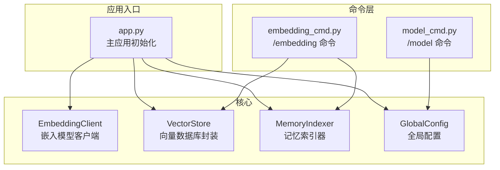
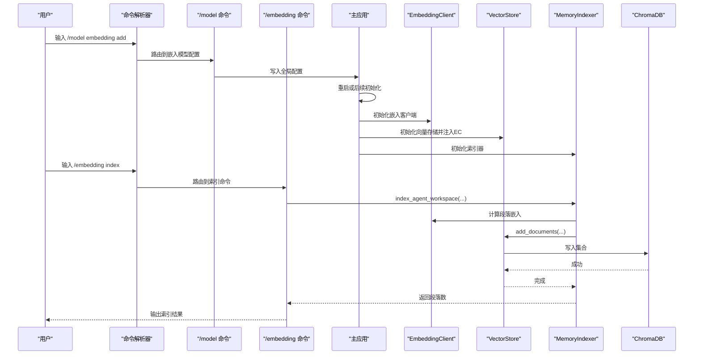
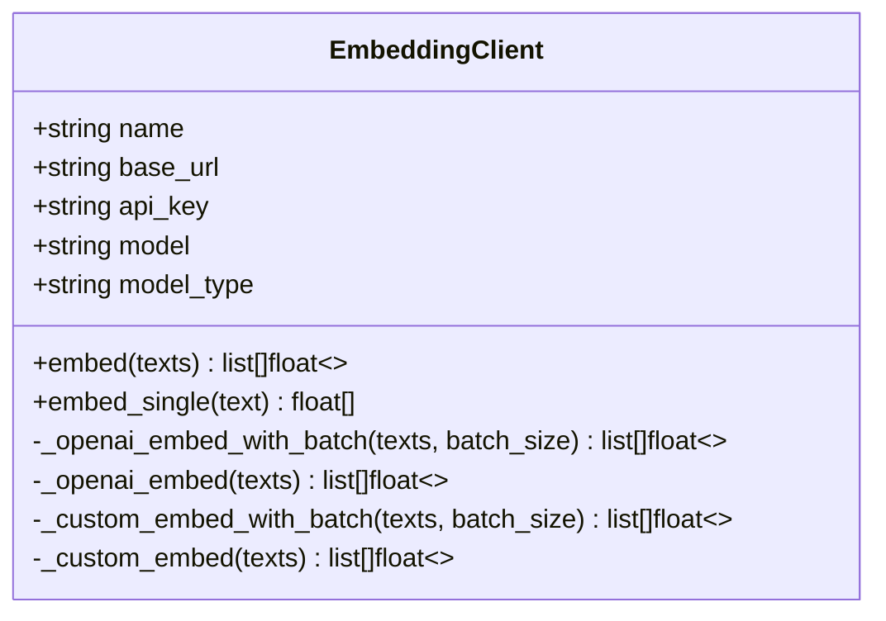
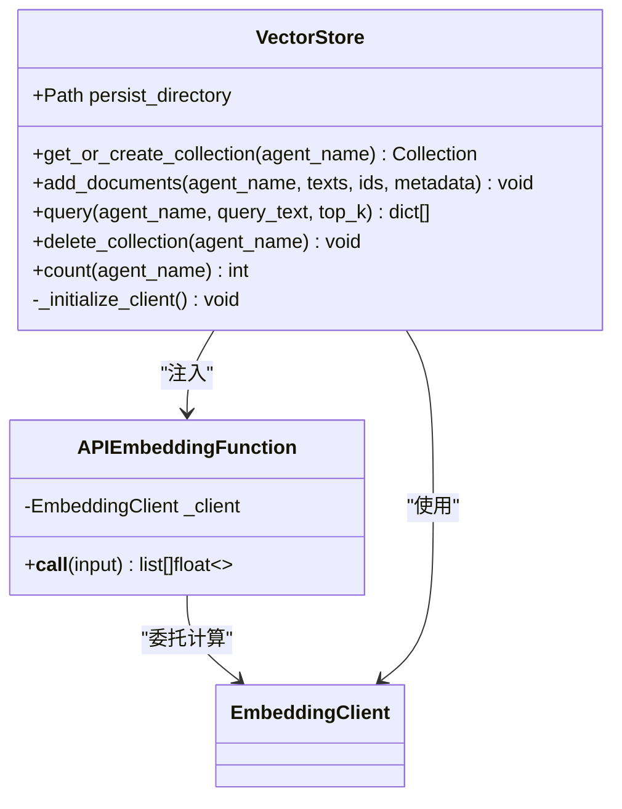
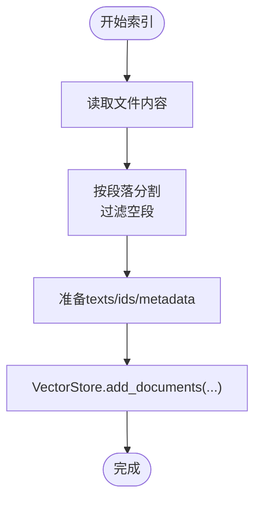
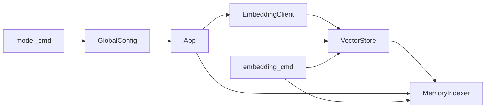
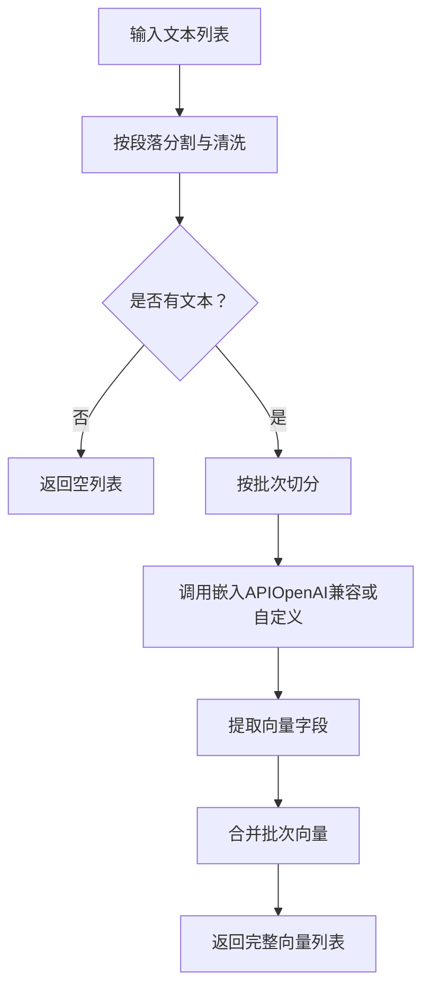

# 嵌入模型API

<cite>
**本文引用的文件**
- [embedding_client.py](file://cbhcli_pkg/core/embedding_client.py)
- [store.py](file://cbhcli_pkg/vector/store.py)
- [indexer.py](file://cbhcli_pkg/vector/indexer.py)
- [global_config.py](file://cbhcli_pkg/config/global_config.py)
- [model_cmd.py](file://cbhcli_pkg/commands/model_cmd.py)
- [embedding_cmd.py](file://cbhcli_pkg/commands/embedding_cmd.py)
- [app.py](file://cbhcli_pkg/core/app.py)
- [model.py](file://cbhcli_pkg/core/model.py)
- [README.md](file://README.md)
</cite>

## 目录
1. [简介](#简介)
2. [项目结构](#项目结构)
3. [核心组件](#核心组件)
4. [架构总览](#架构总览)
5. [详细组件分析](#详细组件分析)
6. [依赖分析](#依赖分析)
7. [性能考虑](#性能考虑)
8. [故障排查指南](#故障排查指南)
9. [结论](#结论)
10. [附录](#附录)

## 简介
本文件面向CBHCLI的嵌入模型API集成，系统性阐述嵌入模型客户端的设计与实现、OpenAI兼容API的对接方式、自定义嵌入模型的支持机制、向量生成与批量处理流程、配置与参数管理、性能优化策略、向量存储与管理、错误处理与重试机制、监控与调试方法，以及与其他组件的集成测试策略与扩展指南。目标是帮助开发者快速理解并高效使用与扩展嵌入模型能力。

## 项目结构
围绕嵌入模型API的关键模块分布如下：
- 核心客户端：负责与外部嵌入模型API通信，支持OpenAI兼容与自定义格式
- 向量存储：封装ChromaDB，使用自定义嵌入函数进行持久化与查询
- 索引器：将Agent工作空间中的文档按段落切分并写入向量数据库
- 配置管理：集中管理嵌入模型、重排序模型与全局设置
- 命令接口：提供/模型与/嵌入相关命令，便于配置与索引操作
- 应用入口：在启动时根据配置初始化嵌入客户端、向量存储与索引器

图表来源
- [app.py:97-150](file://cbhcli_pkg/core/app.py#L97-L150)
- [embedding_client.py:6-132](file://cbhcli_pkg/core/embedding_client.py#L6-L132)
- [store.py:37-175](file://cbhcli_pkg/vector/store.py#L37-L175)
- [indexer.py:7-178](file://cbhcli_pkg/vector/indexer.py#L7-L178)
- [global_config.py:117-135](file://cbhcli_pkg/config/global_config.py#L117-L135)
- [model_cmd.py:182-273](file://cbhcli_pkg/commands/model_cmd.py#L182-L273)
- [embedding_cmd.py:5-122](file://cbhcli_pkg/commands/embedding_cmd.py#L5-L122)

章节来源
- [README.md:269-295](file://README.md#L269-L295)
- [app.py:97-150](file://cbhcli_pkg/core/app.py#L97-L150)

## 核心组件
- 嵌入模型客户端：支持OpenAI兼容API与自定义API格式，具备批量处理与单次请求能力，统一返回浮点向量列表
- 向量存储：基于ChromaDB，通过自定义嵌入函数注入外部嵌入模型，支持文档添加、查询与集合管理
- 记忆索引器：将Agent工作空间的标准文档与知识库文件按段落切分，生成ID与元数据，批量写入向量数据库
- 全局配置：集中管理嵌入模型配置、重排序模型配置与全局设置，提供增删改查与持久化
- 命令接口：/model embedding用于配置嵌入模型；/embedding用于索引、状态查询与清理

章节来源
- [embedding_client.py:34-132](file://cbhcli_pkg/core/embedding_client.py#L34-L132)
- [store.py:12-175](file://cbhcli_pkg/vector/store.py#L12-L175)
- [indexer.py:87-178](file://cbhcli_pkg/vector/indexer.py#L87-L178)
- [global_config.py:117-135](file://cbhcli_pkg/config/global_config.py#L117-L135)
- [model_cmd.py:182-273](file://cbhcli_pkg/commands/model_cmd.py#L182-L273)
- [embedding_cmd.py:5-122](file://cbhcli_pkg/commands/embedding_cmd.py#L5-L122)

## 架构总览
嵌入模型API的端到端流程：
- 应用启动时读取全局配置，若存在嵌入模型配置则初始化EmbeddingClient
- 若嵌入模型可用，则初始化VectorStore并注入EmbeddingClient，同时注册MemoryIndexer
- 用户通过/模型命令配置嵌入模型，通过/嵌入命令触发索引与状态查询
- 索引器将文档切分为段落，预先计算嵌入向量，写入ChromaDB集合
- 查询时同样预先计算查询向量，调用ChromaDB进行语义检索

图表来源
- [app.py:104-149](file://cbhcli_pkg/core/app.py#L104-L149)
- [model_cmd.py:207-237](file://cbhcli_pkg/commands/model_cmd.py#L207-L237)
- [embedding_cmd.py:42-69](file://cbhcli_pkg/commands/embedding_cmd.py#L42-L69)
- [indexer.py:37-69](file://cbhcli_pkg/vector/indexer.py#L37-L69)
- [store.py:99-126](file://cbhcli_pkg/vector/store.py#L99-L126)
- [embedding_client.py:34-118](file://cbhcli_pkg/core/embedding_client.py#L34-L118)

## 详细组件分析

### 嵌入模型客户端（EmbeddingClient）
- 设计要点
  - 支持两种模式：OpenAI兼容与自定义API
  - 使用requests.Session保持连接与统一头部
  - 提供批量处理与单次请求两种调用方式
  - 统一返回浮点向量列表，便于后续写入向量数据库
- 数据结构与复杂度
  - 批处理按固定批次大小切分，时间复杂度O(N/B)，其中N为文本数，B为批次大小
  - 单次请求时间复杂度O(1)；整体受网络与API速率限制影响
- 错误处理
  - 非200状态码抛出异常，便于上层捕获与重试
- 扩展建议
  - 自定义API可通过重写_openai_embed或_custom_embed方法适配不同字段映射
  - 可增加超时、重试与指数退避策略

图表来源
- [embedding_client.py:6-132](file://cbhcli_pkg/core/embedding_client.py#L6-L132)

章节来源
- [embedding_client.py:15-132](file://cbhcli_pkg/core/embedding_client.py#L15-L132)

### 向量存储（VectorStore）与嵌入函数（APIEmbeddingFunction）
- 设计要点
  - 通过APIEmbeddingFunction将EmbeddingClient桥接到ChromaDB
  - 在创建集合时显式传入embedding_function，确保使用自定义嵌入模型
  - 添加文档前预先计算嵌入向量，避免ChromaDB调用默认模型
  - 查询时同样预先计算查询向量，保证一致性
- 存储与管理
  - 使用持久化客户端，集合命名规则为agent_{agent_name}
  - 支持删除集合、统计数量、查询结果格式化
- 性能与精度
  - 通过预先计算嵌入减少ChromaDB内部调用开销
  - 向量精度为浮点数组，具体维度由所选嵌入模型决定

图表来源
- [store.py:12-175](file://cbhcli_pkg/vector/store.py#L12-L175)
- [embedding_client.py:34-132](file://cbhcli_pkg/core/embedding_client.py#L34-L132)

章节来源
- [store.py:37-175](file://cbhcli_pkg/vector/store.py#L37-L175)

### 记忆索引器（MemoryIndexer）
- 设计要点
  - 支持标准Agent工作空间文件与知识库目录文件
  - 将文件内容按段落分割，过滤空段，生成唯一ID与元数据
  - 调用VectorStore.add_documents批量写入
- 文本预处理
  - 按双换行符分割段落，去除空白
  - 为每段生成基于agent_name、文件名与序号的ID
  - 元数据包含agent_name、文件名、文件类型与段落索引
- 批量处理
  - 通过VectorStore统一计算嵌入并写入，提升效率

图表来源
- [indexer.py:87-134](file://cbhcli_pkg/vector/indexer.py#L87-L134)
- [store.py:99-126](file://cbhcli_pkg/vector/store.py#L99-L126)

章节来源
- [indexer.py:7-178](file://cbhcli_pkg/vector/indexer.py#L7-L178)

### 全局配置（GlobalConfig）与命令接口
- 嵌入模型配置
  - 支持name、apiKey、url、model、type(openai或custom)
  - 提供增删改查与持久化
- 命令接口
  - /model embedding add/info/delete：配置嵌入模型
  - /embedding index/status/clear/reindex：索引与状态管理
- 应用初始化
  - 启动时读取配置，初始化EmbeddingClient与VectorStore
  - 若未配置嵌入模型，给出提示并禁用向量搜索相关工具

章节来源
- [global_config.py:117-135](file://cbhcli_pkg/config/global_config.py#L117-L135)
- [model_cmd.py:182-273](file://cbhcli_pkg/commands/model_cmd.py#L182-L273)
- [embedding_cmd.py:5-122](file://cbhcli_pkg/commands/embedding_cmd.py#L5-L122)
- [app.py:104-149](file://cbhcli_pkg/core/app.py#L104-L149)

## 依赖分析
- 组件耦合
  - VectorStore依赖EmbeddingClient提供的嵌入函数
  - MemoryIndexer依赖VectorStore进行文档写入
  - 应用初始化阶段串联配置、客户端与存储
- 外部依赖
  - requests：HTTP请求与会话管理
  - chromadb：向量数据库持久化与查询
- 潜在环路
  - 未发现直接循环依赖；各模块职责清晰

图表来源
- [app.py:97-150](file://cbhcli_pkg/core/app.py#L97-L150)
- [store.py:37-175](file://cbhcli_pkg/vector/store.py#L37-L175)
- [indexer.py:7-178](file://cbhcli_pkg/vector/indexer.py#L7-L178)
- [global_config.py:117-135](file://cbhcli_pkg/config/global_config.py#L117-L135)
- [model_cmd.py:182-273](file://cbhcli_pkg/commands/model_cmd.py#L182-L273)
- [embedding_cmd.py:5-122](file://cbhcli_pkg/commands/embedding_cmd.py#L5-L122)

章节来源
- [app.py:97-150](file://cbhcli_pkg/core/app.py#L97-L150)

## 性能考虑
- 批量大小调整
  - 默认批次大小为10，适合多数OpenAI兼容API限制
  - 可根据API最大批量与延迟目标调整batch_size
- 并发控制
  - 当前实现为顺序批次处理；若需并发，可在上层引入线程池或异步队列
- 缓存机制
  - 可在应用层对常用文本的嵌入结果进行本地缓存，避免重复请求
- 精度与维度
  - 向量精度为浮点数组，维度由所选嵌入模型决定
  - 可通过选择不同模型平衡精度与性能
- I/O与网络
  - 预计算嵌入向量减少ChromaDB内部调用
  - 合理设置超时与重试策略，避免阻塞

[本节为通用性能建议，不直接分析特定文件]

## 故障排查指南
- 常见问题
  - 嵌入模型未配置：应用启动时会提示使用/模型命令配置
  - 向量数据库未启用：需配置嵌入模型并初始化VectorStore
  - API请求失败：检查URL、API Key与网络连通性
  - 批量过大导致超时：减小批次大小或增加超时
- 错误处理与重试
  - 客户端在非200状态码时抛出异常
  - 建议在上层包装重试逻辑（指数退避、最大重试次数）
- 监控与调试
  - 通过/嵌入命令查看索引状态与数量
  - 在应用初始化处输出嵌入模型与向量存储状态
  - 记录请求耗时与错误日志，定位瓶颈

章节来源
- [embedding_client.py:86-87](file://cbhcli_pkg/core/embedding_client.py#L86-L87)
- [embedding_cmd.py:72-91](file://cbhcli_pkg/commands/embedding_cmd.py#L72-L91)
- [app.py:104-149](file://cbhcli_pkg/core/app.py#L104-L149)

## 结论
CBHCLI的嵌入模型API通过EmbeddingClient与VectorStore的解耦设计，实现了对OpenAI兼容与自定义嵌入模型的统一支持。结合MemoryIndexer的文档切分与批量写入，构建了完整的向量检索链路。通过命令接口与全局配置，开发者可以灵活地配置与管理嵌入模型，并在应用启动时按需启用向量搜索功能。未来可在并发控制、缓存与重试策略方面进一步增强，以满足更大规模与更复杂场景的需求。

[本节为总结性内容，不直接分析特定文件]

## 附录

### 嵌入向量生成流程（文本预处理、批量处理、向量计算）

图表来源
- [embedding_client.py:49-118](file://cbhcli_pkg/core/embedding_client.py#L49-L118)
- [indexer.py:108-134](file://cbhcli_pkg/vector/indexer.py#L108-L134)

### 不同嵌入模型的配置方法
- OpenAI兼容模型
  - type: openai
  - model: 如text-embedding-3-small
- 自定义模型
  - type: custom
  - 可通过重写_embed方法适配不同字段映射
- 配置入口
  - /model embedding add：交互式添加
  - /model embedding info：查看当前配置
  - /model embedding delete：删除配置

章节来源
- [model_cmd.py:207-273](file://cbhcli_pkg/commands/model_cmd.py#L207-L273)
- [embedding_client.py:44-47](file://cbhcli_pkg/core/embedding_client.py#L44-L47)

### 与LLM客户端的关系
- LLM客户端提供/chat/completions与/stream接口
- 嵌入客户端提供/embeddings接口
- 两者均使用requests.Session与统一头部，便于统一管理

章节来源
- [model.py:121-147](file://cbhcli_pkg/core/model.py#L121-L147)
- [embedding_client.py:72-90](file://cbhcli_pkg/core/embedding_client.py#L72-L90)

### 扩展指南与最佳实践
- 自定义嵌入模型
  - 继承或重写EmbeddingClient的_openai_embed或_custom_embed方法
  - 确保返回值为浮点向量列表
- 批量与并发
  - 根据API限制调整batch_size
  - 在上层引入并发队列与重试策略
- 缓存与持久化
  - 对热点文本进行本地缓存，减少API调用
  - 使用持久化目录存放向量数据库，定期备份
- 监控与告警
  - 记录请求耗时、错误率与重试次数
  - 在命令层输出状态与统计信息

[本节为通用扩展建议，不直接分析特定文件]