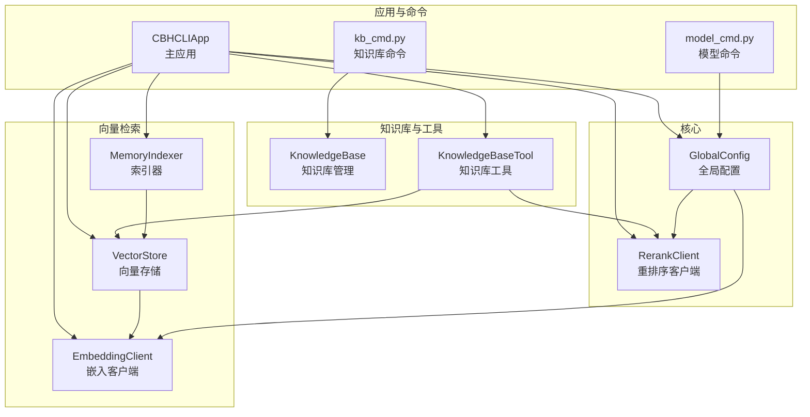
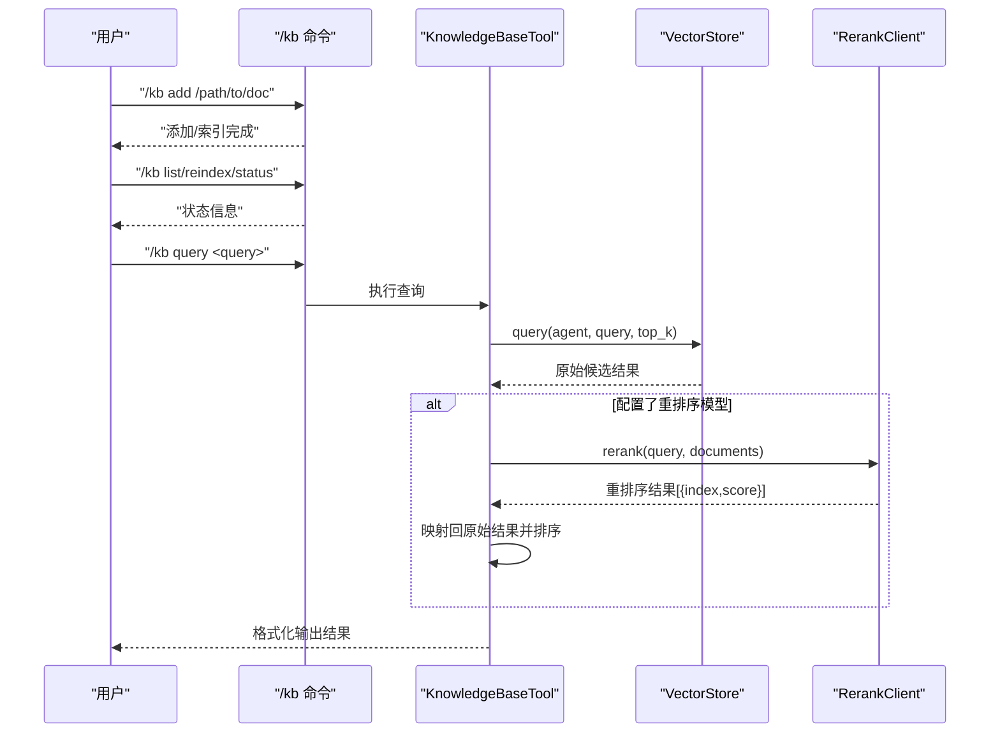
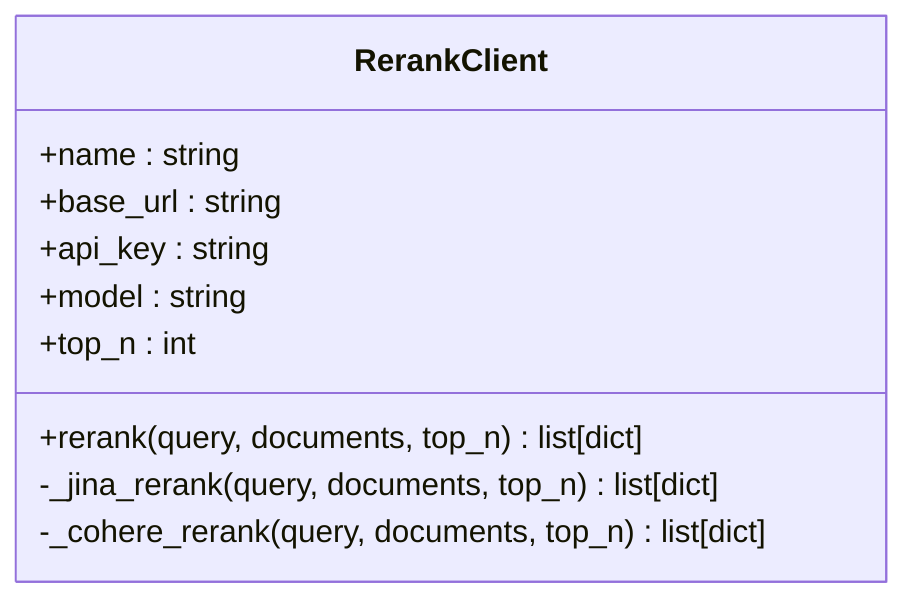
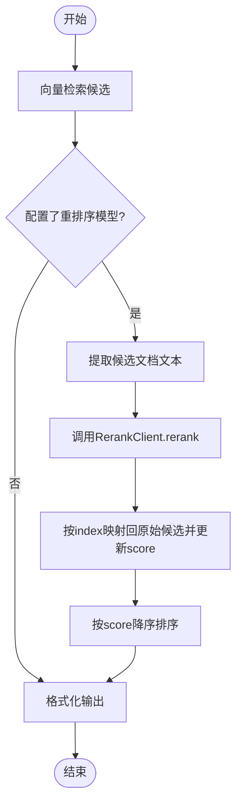
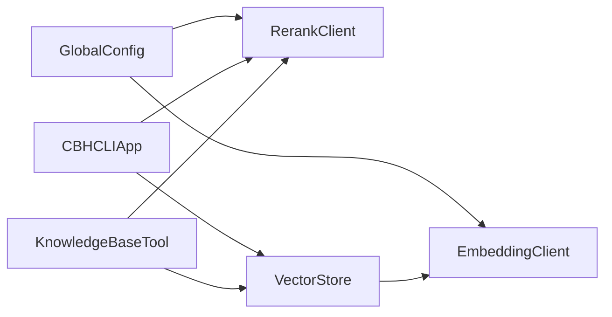

# 重排序服务集成

<cite>
**本文引用的文件**
- [rerank_client.py](file://cbhcli_pkg/core/rerank_client.py)
- [global_config.py](file://cbhcli_pkg/config/global_config.py)
- [knowledge_base.py](file://cbhcli_pkg/core/knowledge_base.py)
- [indexer.py](file://cbhcli_pkg/vector/indexer.py)
- [store.py](file://cbhcli_pkg/vector/store.py)
- [app.py](file://cbhcli_pkg/core/app.py)
- [knowledge_base_tool.py](file://cbhcli_pkg/tools/knowledge_base.py)
- [model_cmd.py](file://cbhcli_pkg/commands/model_cmd.py)
- [kb_cmd.py](file://cbhcli_pkg/commands/kb_cmd.py)
- [embedding_client.py](file://cbhcli_pkg/core/embedding_client.py)
- [README.md](file://README.md)
</cite>

## 目录
1. [简介](#简介)
2. [项目结构](#项目结构)
3. [核心组件](#核心组件)
4. [架构总览](#架构总览)
5. [详细组件分析](#详细组件分析)
6. [依赖关系分析](#依赖关系分析)
7. [性能考量](#性能考量)
8. [故障排除指南](#故障排除指南)
9. [结论](#结论)
10. [附录](#附录)

## 简介
本文件面向开发者，系统性阐述CBHCLI中“重排序服务”的设计与集成，重点解释其在向量检索中的作用与价值：通过引入第三方重排序API（如Jina、Cohere等），在向量相似度检索的基础上进一步优化相关性，从而显著提升知识库查询与对话检索的结果质量。文档涵盖以下主题：
- 重排序服务在向量检索中的定位与收益
- 支持的重排序API与配置方式
- 重排序请求构建与发送流程
- 结果处理与应用（相关性分数、排序与过滤）
- 性能优化（批量、缓存、并发）
- 监控与故障排除
- 与向量检索的整体性能评估
- 自定义重排序服务的扩展方案

## 项目结构
CBHCLI采用模块化组织，重排序服务主要涉及如下文件：
- 核心客户端与配置：core/rerank_client.py、config/global_config.py
- 知识库与工具：core/knowledge_base.py、tools/knowledge_base.py
- 向量检索链路：vector/store.py、vector/indexer.py、core/embedding_client.py
- 应用入口与命令：core/app.py、commands/model_cmd.py、commands/kb_cmd.py
- 项目说明：README.md

图表来源
- [app.py:97-150](file://cbhcli_pkg/core/app.py#L97-L150)
- [rerank_client.py:16-33](file://cbhcli_pkg/core/rerank_client.py#L16-L33)
- [global_config.py:136-148](file://cbhcli_pkg/config/global_config.py#L136-L148)
- [store.py:37-62](file://cbhcli_pkg/vector/store.py#L37-L62)
- [embedding_client.py:15-32](file://cbhcli_pkg/core/embedding_client.py#L15-L32)
- [indexer.py:28-35](file://cbhcli_pkg/vector/indexer.py#L28-L35)
- [knowledge_base.py:16-29](file://cbhcli_pkg/core/knowledge_base.py#L16-L29)
- [knowledge_base_tool.py:9-22](file://cbhcli_pkg/tools/knowledge_base.py#L9-L22)
- [model_cmd.py:279-302](file://cbhcli_pkg/commands/model_cmd.py#L279-L302)
- [kb_cmd.py:57-76](file://cbhcli_pkg/commands/kb_cmd.py#L57-L76)

章节来源
- [app.py:97-150](file://cbhcli_pkg/core/app.py#L97-L150)
- [README.md:208-229](file://README.md#L208-L229)

## 核心组件
- 重排序客户端（RerankClient）：封装对Jina、Cohere等第三方重排序API的调用，负责请求构建、发送与响应格式化。
- 全局配置（GlobalConfig）：提供重排序模型配置的增删改查接口，持久化至用户家目录配置文件。
- 知识库工具（KnowledgeBaseTool）：在向量检索后，若配置了重排序模型，则对候选结果进行重排序，并格式化输出。
- 向量检索链路：EmbeddingClient负责嵌入；VectorStore与MemoryIndexer负责索引与查询；KB工具在查询后触发重排序。
- 应用入口（CBHCLIApp）：在初始化阶段根据配置加载嵌入与重排序客户端，并在知识库工具中注入重排序能力。

章节来源
- [rerank_client.py:6-123](file://cbhcli_pkg/core/rerank_client.py#L6-L123)
- [global_config.py:136-148](file://cbhcli_pkg/config/global_config.py#L136-L148)
- [knowledge_base_tool.py:6-157](file://cbhcli_pkg/tools/knowledge_base.py#L6-L157)
- [store.py:37-175](file://cbhcli_pkg/vector/store.py#L37-L175)
- [embedding_client.py:6-132](file://cbhcli_pkg/core/embedding_client.py#L6-L132)
- [indexer.py:7-178](file://cbhcli_pkg/vector/indexer.py#L7-L178)
- [app.py:104-149](file://cbhcli_pkg/core/app.py#L104-L149)

## 架构总览
重排序服务在CBHCLI中的位置与交互如下：
- 用户通过斜杠命令配置重排序模型（/model rerank add/info/delete）。
- 知识库工具执行向量检索后，若存在重排序客户端，则调用其rerank接口对候选文档进行相关性重排。
- 重排序结果映射回原始候选，按相关性分数降序输出。

图表来源
- [knowledge_base_tool.py:49-157](file://cbhcli_pkg/tools/knowledge_base.py#L49-L157)
- [store.py:128-160](file://cbhcli_pkg/vector/store.py#L128-L160)
- [rerank_client.py:35-59](file://cbhcli_pkg/core/rerank_client.py#L35-L59)

## 详细组件分析

### 重排序客户端（RerankClient）
- 支持的API族：Jina Reranker、Cohere Rerank、通义千问Rerank等兼容API。
- 请求构建：根据模型标识自动选择Jina或Cohere的请求格式，统一携带query、documents、top_n。
- 响应格式化：将第三方API返回的relevance_score映射为统一字段，便于后续排序与展示。
- 错误处理：对非200状态码抛出异常，便于上层捕获与降级。

图表来源
- [rerank_client.py:6-123](file://cbhcli_pkg/core/rerank_client.py#L6-L123)

章节来源
- [rerank_client.py:16-123](file://cbhcli_pkg/core/rerank_client.py#L16-L123)

### 全局配置（GlobalConfig）
- 提供重排序模型配置的增删改查：set_rerank_model/get_rerank_model/delete_rerank_model。
- 配置持久化：写入~/.cbhcli/config.json，供应用启动时加载。
- 与应用集成：在app初始化阶段读取配置并创建RerankClient实例。

章节来源
- [global_config.py:136-148](file://cbhcli_pkg/config/global_config.py#L136-L148)
- [app.py:112-118](file://cbhcli_pkg/core/app.py#L112-L118)

### 知识库工具（KnowledgeBaseTool）
- 向量检索：调用VectorStore.query获取候选结果。
- 条件重排序：当存在重排序客户端且候选数量大于1时，提取候选文档文本调用rerank。
- 结果映射与排序：将重排序返回的index映射回原始候选，更新score并按分数降序排列。
- 输出格式：按文件类型、来源、相关度分数与文档内容格式化输出。

图表来源
- [knowledge_base_tool.py:80-157](file://cbhcli_pkg/tools/knowledge_base.py#L80-L157)

章节来源
- [knowledge_base_tool.py:49-157](file://cbhcli_pkg/tools/knowledge_base.py#L49-L157)

### 向量检索链路
- 嵌入客户端：支持OpenAI兼容与自定义API，提供批量嵌入能力。
- 向量存储：基于ChromaDB，使用自定义嵌入函数，预计算查询向量与文档向量，避免默认模型调用。
- 索引器：索引Agent工作空间的标准文件与知识库目录，支持增量与全量更新。

章节来源
- [embedding_client.py:34-132](file://cbhcli_pkg/core/embedding_client.py#L34-L132)
- [store.py:99-160](file://cbhcli_pkg/vector/store.py#L99-L160)
- [indexer.py:37-69](file://cbhcli_pkg/vector/indexer.py#L37-L69)

### 应用入口与命令
- 应用初始化：根据配置加载嵌入与重排序客户端，注册知识库工具并注入重排序能力。
- 模型命令：/model rerank add/info/delete用于配置重排序模型。
- 知识库命令：/kb add/list/remove/reindex/status用于知识库管理。

章节来源
- [app.py:104-149](file://cbhcli_pkg/core/app.py#L104-L149)
- [model_cmd.py:279-371](file://cbhcli_pkg/commands/model_cmd.py#L279-L371)
- [kb_cmd.py:57-186](file://cbhcli_pkg/commands/kb_cmd.py#L57-L186)

## 依赖关系分析
- 知识库工具依赖向量存储与重排序客户端，形成“检索-重排序-格式化”的闭环。
- 应用层在初始化时决定是否启用重排序客户端，影响工具行为。
- 配置层提供持久化与动态更新能力，保证重排序配置的可维护性。

图表来源
- [app.py:104-149](file://cbhcli_pkg/core/app.py#L104-L149)
- [knowledge_base_tool.py:9-22](file://cbhcli_pkg/tools/knowledge_base.py#L9-L22)
- [global_config.py:136-148](file://cbhcli_pkg/config/global_config.py#L136-L148)

章节来源
- [app.py:104-149](file://cbhcli_pkg/core/app.py#L104-L149)
- [knowledge_base_tool.py:9-22](file://cbhcli_pkg/tools/knowledge_base.py#L9-L22)
- [global_config.py:136-148](file://cbhcli_pkg/config/global_config.py#L136-L148)

## 性能考量
- 批量处理：嵌入客户端支持分批处理，减少单次请求负载与超时风险。
- 缓存策略：向量存储预计算并缓存查询向量与文档向量，避免重复计算。
- 并发控制：重排序客户端使用requests.Session，建议在高并发场景下结合连接池与速率限制。
- 成本控制：通过top_n参数限制重排序候选数量，降低API调用次数；合理设置请求超时与重试策略。
- 降级策略：重排序失败时回退到向量相似度排序，保证系统稳定性。

章节来源
- [embedding_client.py:49-118](file://cbhcli_pkg/core/embedding_client.py#L49-L118)
- [store.py:118-149](file://cbhcli_pkg/vector/store.py#L118-L149)
- [knowledge_base_tool.py:154-157](file://cbhcli_pkg/tools/knowledge_base.py#L154-L157)

## 故障排除指南
- 重排序API错误：检查API Key、Base URL与模型ID是否正确；确认网络可达；查看状态码与响应体。
- 候选为空：确认向量索引是否完成；检查知识库文件是否被正确索引。
- 重排序失败降级：工具会在异常时返回原始结果，确保查询仍可继续。
- 配置问题：通过/模型命令查看与更新重排序配置；必要时删除后重新添加。

章节来源
- [rerank_client.py:76-77](file://cbhcli_pkg/core/rerank_client.py#L76-L77)
- [knowledge_base_tool.py:154-157](file://cbhcli_pkg/tools/knowledge_base.py#L154-L157)
- [model_cmd.py:338-371](file://cbhcli_pkg/commands/model_cmd.py#L338-L371)

## 结论
CBHCLI的重排序服务通过引入第三方相关性评分API，在向量检索基础上实现了更高质量的排序与筛选。其设计具备良好的扩展性与可维护性：配置集中、调用清晰、错误可控、性能可优化。对于开发者而言，可在现有RerankClient基础上快速接入新的重排序API，或在工具层扩展更复杂的过滤与后处理逻辑。

## 附录

### 支持的重排序API与配置要点
- Jina Reranker：默认兼容格式，适合多语言与通用场景。
- Cohere Rerank：适合英文与结构化文档的细粒度相关性排序。
- 通义千问Rerank：适合中文场景与中文文档排序。
- 配置项：name、apiKey、url、model、top_n；通过/模型命令进行配置与持久化。

章节来源
- [rerank_client.py:9-13](file://cbhcli_pkg/core/rerank_client.py#L9-L13)
- [model_cmd.py:304-335](file://cbhcli_pkg/commands/model_cmd.py#L304-L335)
- [README.md:173-179](file://README.md#L173-L179)

### 重排序请求构建与发送流程
- 输入：查询文本、候选文档列表、top_n。
- 选择API族：依据模型标识选择Jina或Cohere格式。
- 发送：POST到对应端点，携带Authorization与JSON负载。
- 响应：解析relevance_score并格式化为统一结构。

章节来源
- [rerank_client.py:35-122](file://cbhcli_pkg/core/rerank_client.py#L35-L122)

### 结果处理与应用
- 映射：将重排序返回的index映射回原始候选，更新score。
- 排序：按score降序排列，便于展示与后续处理。
- 过滤：可结合阈值过滤低分结果，进一步提升相关性。

章节来源
- [knowledge_base_tool.py:123-157](file://cbhcli_pkg/tools/knowledge_base.py#L123-L157)

### 性能优化建议
- 批量嵌入：利用嵌入客户端的分批能力，减少请求次数。
- 预计算向量：向量存储预计算查询与文档向量，避免重复计算。
- 限流与超时：为重排序API设置合理的超时与重试策略，避免阻塞。
- 缓存命中：在高频查询场景下，考虑对候选集进行缓存与去重。

章节来源
- [embedding_client.py:49-118](file://cbhcli_pkg/core/embedding_client.py#L49-L118)
- [store.py:118-149](file://cbhcli_pkg/vector/store.py#L118-L149)

### 监控与整体性能评估
- 监控指标：API调用耗时、成功率、重排序命中率、平均相关性分数。
- 评估方法：对比重排序前后Top-N准确率、用户反馈、任务完成率。
- 优化闭环：基于指标调整top_n、阈值与API选择策略。

[本节为通用指导，不直接分析具体文件]

### 自定义重排序服务集成指南
- 扩展点：在RerankClient中新增API族分支，遵循统一的请求与响应格式。
- 工具层：在KnowledgeBaseTool中增加条件判断与结果映射逻辑。
- 配置层：在GlobalConfig与命令系统中增加新模型的增删改查。
- 测试：编写单元测试与端到端测试，覆盖正常与异常路径。

章节来源
- [rerank_client.py:52-59](file://cbhcli_pkg/core/rerank_client.py#L52-L59)
- [knowledge_base_tool.py:123-157](file://cbhcli_pkg/tools/knowledge_base.py#L123-L157)
- [global_config.py:136-148](file://cbhcli_pkg/config/global_config.py#L136-L148)
- [model_cmd.py:279-302](file://cbhcli_pkg/commands/model_cmd.py#L279-L302)