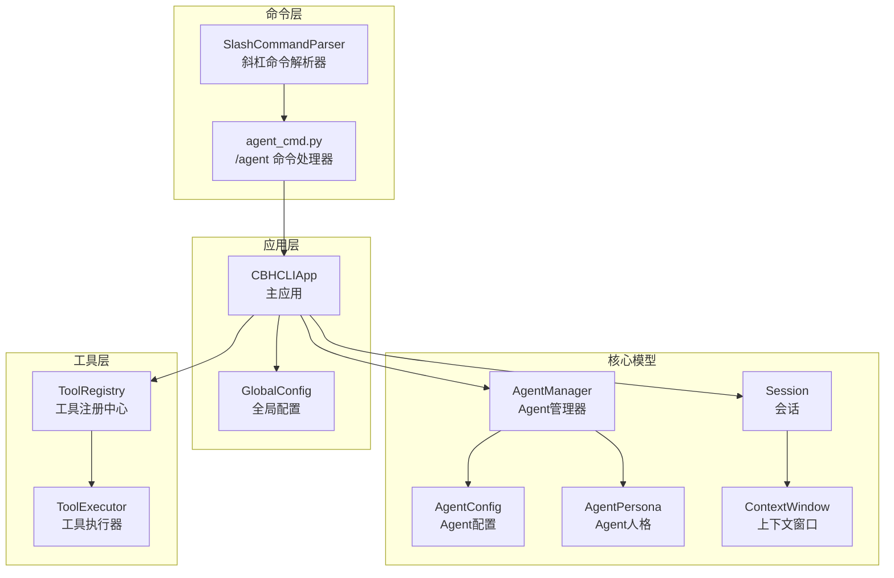
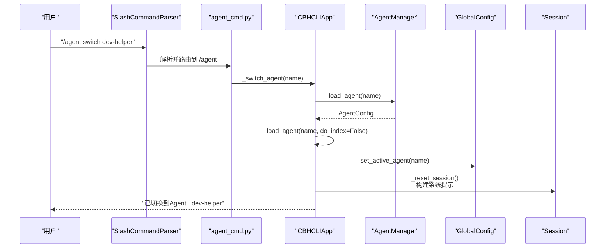
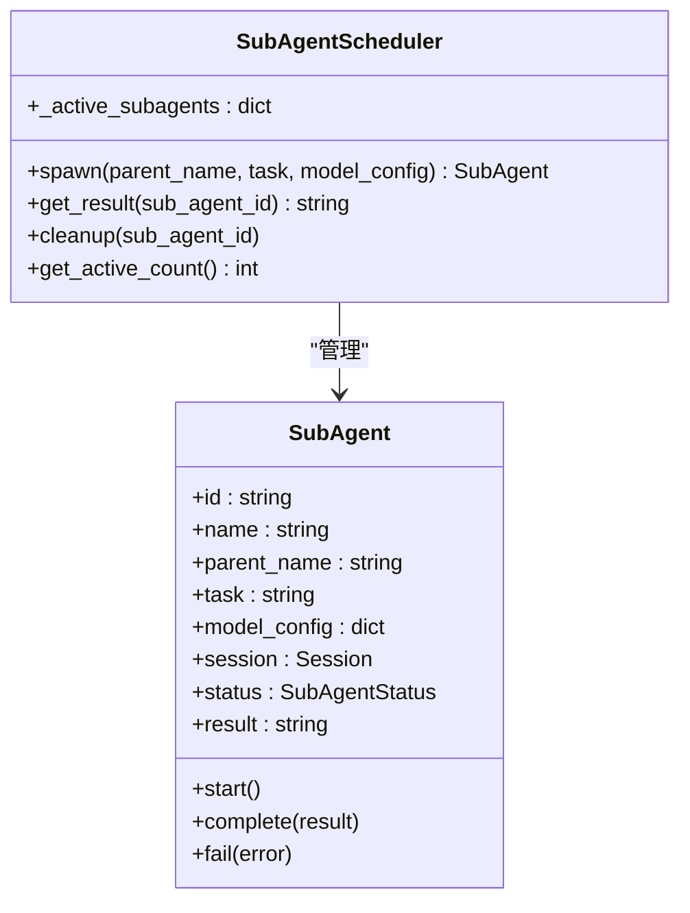
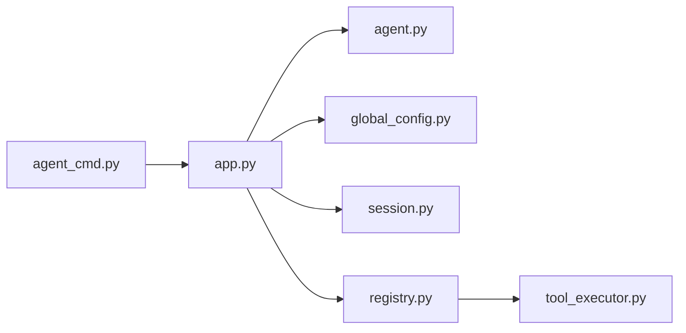

# Agent管理命令

<cite>
**本文引用的文件**
- [agent_cmd.py](file://cbhcli_pkg/commands/agent_cmd.py)
- [app.py](file://cbhcli_pkg/core/app.py)
- [agent.py](file://cbhcli_pkg/core/agent.py)
- [session.py](file://cbhcli_pkg/core/session.py)
- [global_config.py](file://cbhcli_pkg/config/global_config.py)
- [parser.py](file://cbhcli_pkg/commands/parser.py)
- [README.md](file://README.md)
- [errors.py](file://cbhcli_pkg/core/errors.py)
- [subagent.py](file://cbhcli_pkg/core/subagent.py)
- [tool_executor.py](file://cbhcli_pkg/core/tool_executor.py)
- [registry.py](file://cbhcli_pkg/tools/registry.py)
</cite>

## 目录
1. [简介](#简介)
2. [项目结构](#项目结构)
3. [核心组件](#核心组件)
4. [架构总览](#架构总览)
5. [详细组件分析](#详细组件分析)
6. [依赖分析](#依赖分析)
7. [性能考虑](#性能考虑)
8. [故障排除指南](#故障排除指南)
9. [结论](#结论)
10. [附录](#附录)

## 简介
本文件为 CBHCLI 中“Agent管理命令”的完整参考文档，涵盖斜杠命令 /agent 的语法、参数与用法；Agent 的工作原理与生命周期管理（创建、配置、人格设置）；Agent 切换与管理的实际使用示例及多 Agent 协作流程；Agent 配置文件结构与自定义选项；Agent 与工具系统的集成关系及其在会话中的作用；以及 Agent 故障排除与调试技巧和安全性与权限控制说明。

## 项目结构
围绕 Agent 管理的关键模块与文件如下：
- 命令层：斜杠命令解析与注册，负责 /agent 系列命令的入口
- 应用层：主应用负责初始化 Agent 管理器、会话、工具系统、向量索引等
- 核心模型：Agent 管理器、Agent 配置与人格、会话与上下文窗口
- 配置层：全局配置（模型、Agent 活跃状态、工作空间等）
- 工具层：工具注册中心与工具执行器，支撑 Agent 的工具调用能力

图表来源
- [parser.py:16-94](file://cbhcli_pkg/commands/parser.py#L16-L94)
- [agent_cmd.py:5-47](file://cbhcli_pkg/commands/agent_cmd.py#L5-L47)
- [app.py:54-230](file://cbhcli_pkg/core/app.py#L54-L230)
- [agent.py:572-762](file://cbhcli_pkg/core/agent.py#L572-L762)
- [session.py:37-190](file://cbhcli_pkg/core/session.py#L37-L190)
- [global_config.py:13-154](file://cbhcli_pkg/config/global_config.py#L13-L154)
- [tool_executor.py:15-168](file://cbhcli_pkg/core/tool_executor.py#L15-L168)
- [registry.py:51-115](file://cbhcli_pkg/tools/registry.py#L51-L115)

章节来源
- [agent_cmd.py:1-181](file://cbhcli_pkg/commands/agent_cmd.py#L1-L181)
- [app.py:54-230](file://cbhcli_pkg/core/app.py#L54-L230)
- [agent.py:572-762](file://cbhcli_pkg/core/agent.py#L572-L762)
- [session.py:37-190](file://cbhcli_pkg/core/session.py#L37-L190)
- [global_config.py:13-154](file://cbhcli_pkg/config/global_config.py#L13-L154)
- [parser.py:16-94](file://cbhcli_pkg/commands/parser.py#L16-L94)
- [README.md:231-262](file://README.md#L231-L262)

## 核心组件
- 斜杠命令解析器：负责识别与路由 /agent 等斜杠命令，提供统一的帮助与错误处理
- Agent 命令处理器：实现 /agent create/list/switch/delete 的具体逻辑
- 主应用：初始化 Agent 管理器、会话、工具系统、向量索引，并维护当前 Agent 状态
- Agent 管理器：负责 Agent 的创建、加载、列表、删除与人格文件读取
- Agent 配置与人格：定义 Agent 的元数据、构建系统提示、加载记忆文件
- 会话与上下文窗口：管理消息、token 统计、上下文压缩与阈值控制
- 全局配置：管理模型、嵌入/重排序模型、Agent 默认与活跃状态、工作空间路径等
- 工具系统：工具注册中心与执行器，支撑 Agent 的工具调用与确认机制

章节来源
- [parser.py:16-94](file://cbhcli_pkg/commands/parser.py#L16-L94)
- [agent_cmd.py:5-47](file://cbhcli_pkg/commands/agent_cmd.py#L5-L47)
- [app.py:54-230](file://cbhcli_pkg/core/app.py#L54-L230)
- [agent.py:572-762](file://cbhcli_pkg/core/agent.py#L572-L762)
- [session.py:37-190](file://cbhcli_pkg/core/session.py#L37-L190)
- [global_config.py:13-154](file://cbhcli_pkg/config/global_config.py#L13-L154)
- [tool_executor.py:15-168](file://cbhcli_pkg/core/tool_executor.py#L15-L168)
- [registry.py:51-115](file://cbhcli_pkg/tools/registry.py#L51-L115)

## 架构总览
下图展示了 /agent 命令从输入到执行的端到端流程，以及与应用层、Agent 管理器、会话与工具系统的交互。

图表来源
- [agent_cmd.py:154-162](file://cbhcli_pkg/commands/agent_cmd.py#L154-L162)
- [app.py:231-279](file://cbhcli_pkg/core/app.py#L231-L279)
- [agent.py:626-646](file://cbhcli_pkg/core/agent.py#L626-L646)
- [global_config.py:97-100](file://cbhcli_pkg/config/global_config.py#L97-L100)
- [session.py:37-125](file://cbhcli_pkg/core/session.py#L37-L125)

## 详细组件分析

### /agent 命令语法与参数
- /agent create <name>
  - 用途：创建新的 Agent
  - 参数：name（必填），Agent 名称
  - 行为：检查是否存在同名 Agent；交互式输入描述；可选选择首选模型；创建 Agent 工作空间与默认文件；加载并激活该 Agent
- /agent list
  - 用途：列出所有已配置的 Agent
  - 行为：遍历工作空间目录，读取每个 Agent 的 config.json 并展示名称、描述、当前模型等
- /agent switch <name>
  - 用途：切换到指定 Agent
  - 参数：name（必填），Agent 名称
  - 行为：加载目标 Agent 的配置与人格，初始化会话、模型与上下文窗口，设置为活跃 Agent
- /agent delete <name>
  - 用途：删除指定 Agent
  - 参数：name（必填），Agent 名称
  - 行为：禁止删除名为 main 的默认 Agent；禁止删除当前激活的 Agent；交互式确认后删除工作空间目录

章节来源
- [agent_cmd.py:20-40](file://cbhcli_pkg/commands/agent_cmd.py#L20-L40)
- [agent_cmd.py:99-130](file://cbhcli_pkg/commands/agent_cmd.py#L99-L130)
- [agent_cmd.py:132-151](file://cbhcli_pkg/commands/agent_cmd.py#L132-L151)
- [agent_cmd.py:154-161](file://cbhcli_pkg/commands/agent_cmd.py#L154-L161)
- [agent_cmd.py:164-180](file://cbhcli_pkg/commands/agent_cmd.py#L164-L180)

### Agent 生命周期管理
- 创建流程
  - 检查同名冲突
  - 交互式输入描述与可选首选模型
  - 创建工作空间目录与知识库目录
  - 生成默认 MD 文件（skills/soul/tools/memory/usage）
  - 保存 Agent 配置为 config.json
  - 加载 Agent（包括模型与会话），设置为活跃 Agent
- 配置选项
  - primary_model：首选模型名称
  - description：Agent 描述
  - context_limit_ratio：上下文压缩阈值比例（默认 0.8）
  - auto_compress：是否自动压缩上下文
  - max_tool_calls：最大工具调用次数
- 人格设置
  - skills.md：技能描述
  - soul.md：性格特征
  - tools.md：工具使用指南
  - memory.md：长期记忆（用户明确要求记录的内容）
  - usage.md：使用说明（含斜杠命令与工具调用规范）

章节来源
- [agent.py:585-624](file://cbhcli_pkg/core/agent.py#L585-L624)
- [agent.py:476-513](file://cbhcli_pkg/core/agent.py#L476-L513)
- [agent.py:515-570](file://cbhcli_pkg/core/agent.py#L515-L570)
- [agent.py:626-685](file://cbhcli_pkg/core/agent.py#L626-L685)

### Agent 切换与管理的实际使用示例
- 创建多个专用 Agent
  - 示例：/agent create dev-helper（开发助手）、/agent create qa（问答助手）
- 切换 Agent
  - 示例：/agent switch dev-helper
  - 输出：已切换到Agent: dev-helper
- 列表查看
  - 示例：/agent list
  - 输出：显示各 Agent 的名称、描述、当前模型
- 删除 Agent
  - 示例：/agent delete qa
  - 输出：已删除 qa（需交互确认）

章节来源
- [agent_cmd.py:154-161](file://cbhcli_pkg/commands/agent_cmd.py#L154-L161)
- [agent_cmd.py:132-151](file://cbhcli_pkg/commands/agent_cmd.py#L132-L151)
- [agent_cmd.py:164-180](file://cbhcli_pkg/commands/agent_cmd.py#L164-L180)
- [README.md:237-240](file://README.md#L237-L240)

### 多 Agent 协作工作流程
- 场景：用户需要同时处理开发与问答两类任务
- 流程：
  1) 创建两个 Agent：dev-helper、qa
  2) 在 dev-helper 中配置开发相关技能与工具
  3) 在 qa 中配置问答与检索能力
  4) 通过 /agent switch 在不同 Agent 间快速切换
  5) 每个 Agent 拥有独立的会话历史、知识库与长期记忆
- 子 Agent（临时子任务）
  - 通过子 Agent 调度器创建临时子任务，父 Agent 可等待子 Agent 结果并汇总

图表来源
- [subagent.py:17-118](file://cbhcli_pkg/core/subagent.py#L17-L118)

章节来源
- [subagent.py:55-118](file://cbhcli_pkg/core/subagent.py#L55-L118)

### Agent 配置文件结构与自定义选项
- Agent 工作空间目录
  - ~/.cbhcli/agents/<agent_name>/
  - 包含：config.json、skills.md、soul.md、tools.md、memory.md、usage.md、history/、knowledge/
- config.json 字段
  - name、description、primary_model、context_limit_ratio、auto_compress、max_tool_calls、created_at
- 自定义选项
  - skills/soul/tools/memory/usage：通过编辑对应 MD 文件自定义 Agent 的能力、性格、工具使用与长期记忆
  - knowledge/：存放 Agent 的知识库文件，支持向量检索

章节来源
- [agent.py:585-624](file://cbhcli_pkg/core/agent.py#L585-L624)
- [agent.py:626-685](file://cbhcli_pkg/core/agent.py#L626-L685)
- [README.md:192-206](file://README.md#L192-L206)

### Agent 与工具系统的集成关系
- 工具注册中心：集中管理工具（terminal、read、write、edit、python、memory_search、knowledge_base）
- 工具执行器：负责工具调用前的确认、执行与结果展示；支持详细/简洁模式切换
- Agent 的系统提示包含工具描述，确保 Agent 知道可用工具与调用格式
- 工具调用格式（核心规则）
  - 使用 JSON 代码块或 Python 函数调用格式
  - 一次只能调用一个工具
  - 严格遵守工具调用格式，不可直接输出命令文本

章节来源
- [registry.py:51-115](file://cbhcli_pkg/tools/registry.py#L51-L115)
- [tool_executor.py:15-168](file://cbhcli_pkg/core/tool_executor.py#L15-L168)
- [agent.py:13-210](file://cbhcli_pkg/core/agent.py#L13-L210)

### Agent 在会话中的作用
- 系统提示构建：结合 Agent 的 skills、soul、tools、memory 与当前模型信息生成系统提示
- 会话管理：每次 /new 或 /reset 会保存当前会话到 history/；会话历史可通过 /resume 恢复
- 上下文窗口：根据模型上下文限制与压缩阈值进行自动压缩，避免超出限制
- 记忆管理：memory.md 仅保存用户明确要求记录的内容，始终包含在系统提示中

章节来源
- [agent.py:524-569](file://cbhcli_pkg/core/agent.py#L524-L569)
- [app.py:281-331](file://cbhcli_pkg/core/app.py#L281-L331)
- [session.py:37-125](file://cbhcli_pkg/core/session.py#L37-L125)
- [README.md:135-149](file://README.md#L135-L149)

## 依赖分析
- 命令层依赖
  - SlashCommandParser 提供命令注册与执行框架
  - agent_cmd.py 依赖主应用对象以访问 AgentManager、GlobalConfig 与会话重置逻辑
- 应用层依赖
  - CBHCLIApp 依赖 AgentManager、GlobalConfig、Session、ToolRegistry、ToolExecutor、VectorStore 等
  - 初始化阶段加载嵌入/重排序模型，按需启用 memory_search 与 knowledge_base 工具
- 核心模型依赖
  - AgentManager 依赖工作空间路径与文件系统
  - Session 依赖消息结构与 token 计数器
- 配置层依赖
  - GlobalConfig 统一管理模型、Agent 活跃状态与工作空间路径

图表来源
- [agent_cmd.py:5-47](file://cbhcli_pkg/commands/agent_cmd.py#L5-L47)
- [app.py:54-230](file://cbhcli_pkg/core/app.py#L54-L230)
- [agent.py:572-762](file://cbhcli_pkg/core/agent.py#L572-L762)
- [global_config.py:13-154](file://cbhcli_pkg/config/global_config.py#L13-L154)
- [session.py:37-190](file://cbhcli_pkg/core/session.py#L37-L190)
- [registry.py:51-115](file://cbhcli_pkg/tools/registry.py#L51-L115)
- [tool_executor.py:15-168](file://cbhcli_pkg/core/tool_executor.py#L15-L168)

章节来源
- [agent_cmd.py:5-47](file://cbhcli_pkg/commands/agent_cmd.py#L5-L47)
- [app.py:54-230](file://cbhcli_pkg/core/app.py#L54-L230)
- [agent.py:572-762](file://cbhcli_pkg/core/agent.py#L572-L762)
- [global_config.py:13-154](file://cbhcli_pkg/config/global_config.py#L13-L154)
- [session.py:37-190](file://cbhcli_pkg/core/session.py#L37-L190)
- [registry.py:51-115](file://cbhcli_pkg/tools/registry.py#L51-L115)
- [tool_executor.py:15-168](file://cbhcli_pkg/core/tool_executor.py#L15-L168)

## 性能考虑
- 上下文压缩：当使用率超过阈值（默认 80%）时自动压缩，减少 token 消耗
- 向量索引：手动触发索引，避免启动时大量 API 调用与时间消耗
- 工具调用：严格一次一工具，减少不必要的重复调用与上下文膨胀
- 会话历史：/new 或 /reset 自动保存当前会话，便于快速恢复与复用

章节来源
- [app.py:361-385](file://cbhcli_pkg/core/app.py#L361-L385)
- [session.py:127-190](file://cbhcli_pkg/core/session.py#L127-L190)
- [README.md:208-229](file://README.md#L208-L229)

## 故障排除指南
- Agent 未配置模型
  - 现象：/agent switch 成功但无法进行 AI 请求
  - 处理：使用 /model 命令配置模型后重试
- Agent 不存在或加载失败
  - 现象：/agent switch 返回“不存在或加载失败”
  - 处理：确认 Agent 名称正确，检查工作空间目录与 config.json 是否存在
- 删除 Agent 失败
  - 现象：/agent delete 返回“不存在”或“无法删除当前激活的 Agent”
  - 处理：先切换到其他 Agent，再执行删除；或使用交互确认
- 工具调用失败
  - 现象：工具执行返回失败
  - 处理：检查工具参数格式是否符合要求；确认工具可用；查看工具执行器的详细输出
- 上下文超限
  - 现象：自动压缩失败或上下文接近上限
  - 处理：手动 /comp 压缩；减少一次性长对话；优化工具调用策略

章节来源
- [agent_cmd.py:154-161](file://cbhcli_pkg/commands/agent_cmd.py#L154-L161)
- [agent_cmd.py:164-180](file://cbhcli_pkg/commands/agent_cmd.py#L164-L180)
- [tool_executor.py:142-159](file://cbhcli_pkg/core/tool_executor.py#L142-L159)
- [app.py:361-385](file://cbhcli_pkg/core/app.py#L361-L385)
- [errors.py:9-31](file://cbhcli_pkg/core/errors.py#L9-L31)

## 结论
/agent 系列命令提供了完整的 Agent 生命周期管理能力，结合 Agent 管理器、会话与工具系统，实现了多 Agent 协作与专业化工作流。通过合理的配置与工具调用规范，用户可在不同 Agent 之间高效切换，充分利用各自的技能、工具与知识库，提升任务处理效率与安全性。

## 附录

### 命令参考（摘要）
- /agent create <name>：创建新 Agent
- /agent list：列出所有 Agent
- /agent switch <name>：切换到指定 Agent
- /agent delete <name>：删除指定 Agent

章节来源
- [README.md:237-240](file://README.md#L237-L240)
- [agent_cmd.py:20-40](file://cbhcli_pkg/commands/agent_cmd.py#L20-L40)

### Agent 工作空间文件说明
- config.json：Agent 配置
- skills.md：技能描述
- soul.md：性格特征
- tools.md：工具使用指南
- memory.md：长期记忆
- usage.md：使用说明
- history/：会话历史
- knowledge/：知识库

章节来源
- [agent.py:585-624](file://cbhcli_pkg/core/agent.py#L585-L624)
- [README.md:192-206](file://README.md#L192-L206)