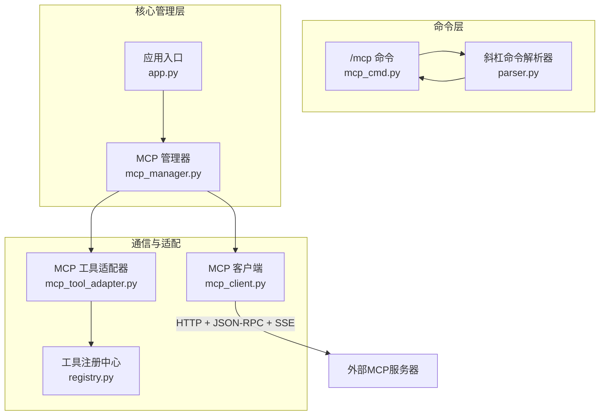
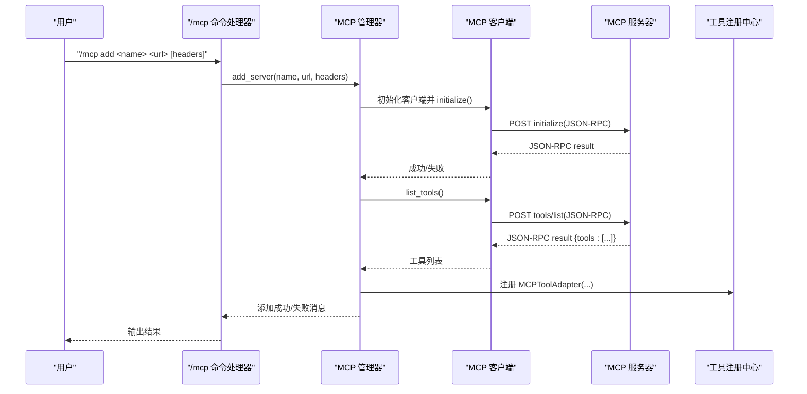
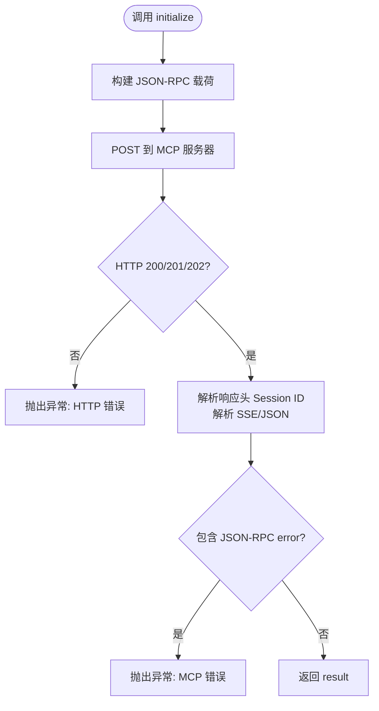
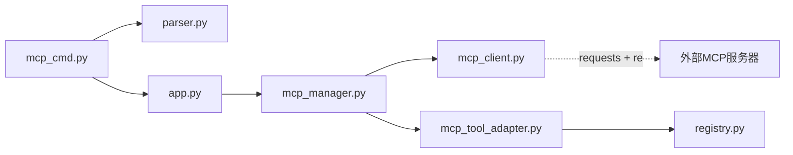

# MCP管理命令

<cite>
**本文引用的文件**
- [mcp_cmd.py](file://cbhcli_pkg/commands/mcp_cmd.py)
- [mcp_manager.py](file://cbhcli_pkg/core/mcp_manager.py)
- [mcp_client.py](file://cbhcli_pkg/core/mcp_client.py)
- [mcp_tool_adapter.py](file://cbhcli_pkg/core/mcp_tool_adapter.py)
- [registry.py](file://cbhcli_pkg/tools/registry.py)
- [parser.py](file://cbhcli_pkg/commands/parser.py)
- [app.py](file://cbhcli_pkg/core/app.py)
- [constants.py](file://cbhcli_pkg/core/constants.py)
- [errors.py](file://cbhcli_pkg/core/errors.py)
- [README.md](file://README.md)
</cite>

## 目录
1. [简介](#简介)
2. [项目结构](#项目结构)
3. [核心组件](#核心组件)
4. [架构总览](#架构总览)
5. [详细组件分析](#详细组件分析)
6. [依赖关系分析](#依赖关系分析)
7. [性能考虑](#性能考虑)
8. [故障排除指南](#故障排除指南)
9. [结论](#结论)
10. [附录](#附录)

## 简介
本文件为 CBHCLI 中 MCP（Model Context Protocol）管理命令的完整参考文档。MCP 是一种基于 HTTP 的流式 JSON-RPC 协议，用于将外部工具服务以标准化方式接入 CBHCLI 的工具系统。通过斜杠命令 /mcp，用户可以添加、列出、移除、刷新 MCP 服务器，查看服务器工具清单，并启用/禁用特定工具。MCP 在 CBHCLI 中的价值在于：
- 将外部工具服务（如本地或云端的工具服务器）无缝接入 CBHCLI 的工具系统
- 通过统一的 JSON-RPC 接口实现工具的发现、调用与生命周期管理
- 为多 Agent 环境提供独立的 MCP 管理，确保不同 Agent 的工具集合隔离与可配置

## 项目结构
围绕 MCP 的核心代码分布在以下模块：
- 命令层：/mcp 命令注册与解析
- 管理层：MCPManager 负责服务器配置、连接、工具注册与启停
- 客户端层：MCPClient 实现 Streamable HTTP + JSON-RPC + SSE 的通信
- 适配层：MCPToolAdapter 将 MCP 工具适配为 CBHCLI 的 BaseTool
- 工具注册中心：ToolRegistry 统一管理工具的注册、查找与执行
- 应用层：CBHCLIApp 在 Agent 加载时初始化 MCPManager，并将其注入命令系统

图表来源
- [mcp_cmd.py:1-182](file://cbhcli_pkg/commands/mcp_cmd.py#L1-L182)
- [parser.py:1-94](file://cbhcli_pkg/commands/parser.py#L1-L94)
- [app.py:54-280](file://cbhcli_pkg/core/app.py#L54-L280)
- [mcp_manager.py:11-366](file://cbhcli_pkg/core/mcp_manager.py#L11-L366)
- [mcp_client.py:8-242](file://cbhcli_pkg/core/mcp_client.py#L8-L242)
- [mcp_tool_adapter.py:7-116](file://cbhcli_pkg/core/mcp_tool_adapter.py#L7-L116)
- [registry.py:51-115](file://cbhcli_pkg/tools/registry.py#L51-L115)

章节来源
- [mcp_cmd.py:1-182](file://cbhcli_pkg/commands/mcp_cmd.py#L1-L182)
- [parser.py:1-94](file://cbhcli_pkg/commands/parser.py#L1-L94)
- [app.py:54-280](file://cbhcli_pkg/core/app.py#L54-L280)

## 核心组件
- /mcp 命令处理器：负责解析子命令（add、list、remove、refresh、tools、enable、disable、help），并委派给 MCPManager 执行具体操作。
- MCPManager：每个 Agent 独立维护 MCP 配置（~/.cbhcli/agents/<agent>/mcp.json），负责连接服务器、注册/注销工具、启用/禁用工具、刷新工具列表。
- MCPClient：实现 Streamable HTTP 协议，支持 JSON-RPC 方法（initialize、tools/list、tools/call、ping），并处理 SSE 文本事件流响应。
- MCPToolAdapter：将 MCP 工具包装为 CBHCLI 的 BaseTool，提供名称、描述、参数 Schema 与执行逻辑。
- ToolRegistry：统一注册与执行工具，提供工具查询、执行与描述汇总。
- 应用初始化：在加载 Agent 时创建 MCPManager，并将其注入命令系统，使 /mcp 命令可访问。

章节来源
- [mcp_cmd.py:5-50](file://cbhcli_pkg/commands/mcp_cmd.py#L5-L50)
- [mcp_manager.py:11-68](file://cbhcli_pkg/core/mcp_manager.py#L11-L68)
- [mcp_client.py:8-32](file://cbhcli_pkg/core/mcp_client.py#L8-L32)
- [mcp_tool_adapter.py:7-43](file://cbhcli_pkg/core/mcp_tool_adapter.py#L7-L43)
- [registry.py:51-115](file://cbhcli_pkg/tools/registry.py#L51-L115)
- [app.py:263-265](file://cbhcli_pkg/core/app.py#L263-L265)

## 架构总览
MCP 在 CBHCLI 中的架构遵循“命令-管理-通信-适配-注册”的分层设计：
- 命令层接收用户输入并解析子命令
- 管理层协调连接、工具注册与启停
- 客户端层负责与外部 MCP 服务器进行 JSON-RPC 通信
- 适配层将 MCP 工具转换为 CBHCLI 工具接口
- 注册中心统一管理工具生命周期

图表来源
- [mcp_cmd.py:78-98](file://cbhcli_pkg/commands/mcp_cmd.py#L78-L98)
- [mcp_manager.py:69-98](file://cbhcli_pkg/core/mcp_manager.py#L69-L98)
- [mcp_manager.py:268-316](file://cbhcli_pkg/core/mcp_manager.py#L268-L316)
- [mcp_client.py:183-206](file://cbhcli_pkg/core/mcp_client.py#L183-L206)
- [registry.py:57-64](file://cbhcli_pkg/tools/registry.py#L57-L64)

## 详细组件分析

### /mcp 命令与子命令
- 子命令支持：
  - add：添加 MCP 服务器，支持额外 HTTP 头（如 Authorization）
  - list：列出所有服务器及其连接状态、工具与启用状态
  - remove：移除指定服务器
  - refresh：重新连接并刷新工具
  - tools：查看指定服务器的工具清单
  - enable/disable：启用/禁用服务器上的某个工具
  - help：显示帮助
- 命令解析与路由：通过 SlashCommandParser 将 /mcp 路由到 mcp_cmd.py 的处理器，再根据子命令分发到对应函数。

章节来源
- [mcp_cmd.py:53-76](file://cbhcli_pkg/commands/mcp_cmd.py#L53-L76)
- [mcp_cmd.py:78-182](file://cbhcli_pkg/commands/mcp_cmd.py#L78-L182)
- [parser.py:26-78](file://cbhcli_pkg/commands/parser.py#L26-L78)

### MCP 管理器（MCPManager）
- 配置存储：每个 Agent 的 MCP 配置保存在 Agent 工作空间下的 mcp.json，包含服务器列表与启用工具集合。
- 生命周期：
  - 初始化：加载配置并自动连接所有服务器
  - 添加：校验名称唯一性，保存配置，连接并注册工具
  - 移除：注销服务器工具、清理客户端、更新配置
  - 刷新：注销旧工具、断开客户端、重新连接并注册
  - 启停：支持按工具粒度启用/禁用；禁用时若未显式列表则动态获取工具并转为显式列表
- 工具注册：将 MCP 工具包装为 MCPToolAdapter 并注册到 ToolRegistry，工具名称以 mcp_ 前缀避免冲突。

```mermaid
classDiagram
class MCPManager {
+agent_name : str
+agent_workspace : Path
+config_file : Path
+_servers : list[dict]
+_clients : dict[str, MCPClient]
+_mcp_tools : dict[str, MCPToolAdapter]
+add_server(name, url, headers, enabled_tools) str
+remove_server(name) str
+list_servers() list[dict]
+get_server_tools(name) list[dict]
+toggle_tool(server_name, tool_name, enable) str
+refresh_server(name) str
-_connect_server(server) str
-_register_tool_from_server(server) str
-_unregister_tool(server_name, tool_name) void
-_unregister_server_tools(server_name) void
+get_tool_descriptions() str
+close_all() void
}
class MCPClient {
+url : str
+initialize() dict
+list_tools() list[dict]
+call_tool(tool_name, arguments) list[dict]
+ping() bool
}
class MCPToolAdapter {
+name : str
+description : str
+parameters : dict
+execute(**kwargs) ToolResult
}
class ToolRegistry {
+register(tool) void
+unregister(name) void
+get(name) BaseTool?
+execute(name, **kwargs) ToolResult
+get_tool_descriptions() str
+get_available_tools() list[str]
}
MCPManager --> MCPClient : "管理连接"
MCPManager --> MCPToolAdapter : "注册适配器"
MCPToolAdapter --> ToolRegistry : "注册"
MCPToolAdapter --> MCPClient : "调用工具"
```

图表来源
- [mcp_manager.py:11-366](file://cbhcli_pkg/core/mcp_manager.py#L11-L366)
- [mcp_client.py:8-242](file://cbhcli_pkg/core/mcp_client.py#L8-L242)
- [mcp_tool_adapter.py:7-116](file://cbhcli_pkg/core/mcp_tool_adapter.py#L7-L116)
- [registry.py:51-115](file://cbhcli_pkg/tools/registry.py#L51-L115)

章节来源
- [mcp_manager.py:41-68](file://cbhcli_pkg/core/mcp_manager.py#L41-L68)
- [mcp_manager.py:69-123](file://cbhcli_pkg/core/mcp_manager.py#L69-L123)
- [mcp_manager.py:124-174](file://cbhcli_pkg/core/mcp_manager.py#L124-L174)
- [mcp_manager.py:175-241](file://cbhcli_pkg/core/mcp_manager.py#L175-L241)
- [mcp_manager.py:242-327](file://cbhcli_pkg/core/mcp_manager.py#L242-L327)

### MCP 客户端（MCPClient）
- 协议实现：
  - HTTP POST + JSON-RPC 2.0
  - Accept 头要求同时支持 application/json 与 text/event-stream
  - 支持 Session ID（Mcp-Session-Id），并在后续请求中携带
- 关键方法：
  - initialize：初始化连接，声明协议版本与客户端信息
  - list_tools：获取工具清单
  - call_tool：调用工具，返回 MCP Content 数组
  - ping：连通性检测
- 响应解析：
  - 支持 SSE 文本事件流，提取 data: 中的 JSON
  - 失败时抛出异常，包含 HTTP 状态与错误信息

图表来源
- [mcp_client.py:131-182](file://cbhcli_pkg/core/mcp_client.py#L131-L182)
- [mcp_client.py:38-130](file://cbhcli_pkg/core/mcp_client.py#L38-L130)

章节来源
- [mcp_client.py:15-32](file://cbhcli_pkg/core/mcp_client.py#L15-L32)
- [mcp_client.py:183-242](file://cbhcli_pkg/core/mcp_client.py#L183-L242)

### MCP 工具适配器（MCPToolAdapter）
- 角色：将 MCP 工具包装为 CBHCLI 的 BaseTool，便于统一注册与执行。
- 关键属性：
  - name：mcp_ 前缀 + 原始工具名，避免与内置工具冲突
  - description：附加服务器来源信息
  - parameters：使用 MCP inputSchema 作为 JSON Schema
- 执行逻辑：
  - 调用 MCPClient.call_tool
  - 解析 MCP Content 数组，拼接输出
  - 对超长输出提供摘要或截断提示
  - 异常时返回 ToolResult(success=False)

章节来源
- [mcp_tool_adapter.py:13-43](file://cbhcli_pkg/core/mcp_tool_adapter.py#L13-L43)
- [mcp_tool_adapter.py:44-116](file://cbhcli_pkg/core/mcp_tool_adapter.py#L44-L116)

### 工具注册中心（ToolRegistry）
- 提供工具的注册、注销、查找与执行
- get_tool_descriptions：用于系统提示，汇总所有工具的名称与描述
- execute：统一捕获异常并返回 ToolResult

章节来源
- [registry.py:51-115](file://cbhcli_pkg/tools/registry.py#L51-L115)

### 应用初始化与命令集成
- CBHCLIApp 在加载 Agent 时创建 MCPManager，并将其注入命令系统
- /mcp 命令处理器通过 app.mcp_manager 访问 MCP 管理能力

章节来源
- [app.py:263-265](file://cbhcli_pkg/core/app.py#L263-L265)
- [mcp_cmd.py:5-50](file://cbhcli_pkg/commands/mcp_cmd.py#L5-L50)

## 依赖关系分析
- 命令层依赖解析器与应用上下文
- 管理层依赖客户端与适配器，同时与注册中心协作
- 客户端依赖 HTTP 库与正则表达式解析 SSE
- 适配器依赖客户端与注册中心
- 应用层在 Agent 加载时注入 MCPManager

图表来源
- [mcp_cmd.py:1-10](file://cbhcli_pkg/commands/mcp_cmd.py#L1-L10)
- [app.py:51-51](file://cbhcli_pkg/core/app.py#L51-L51)
- [mcp_manager.py:6-8](file://cbhcli_pkg/core/mcp_manager.py#L6-L8)
- [mcp_client.py:4-5](file://cbhcli_pkg/core/mcp_client.py#L4-L5)
- [mcp_tool_adapter.py:3-4](file://cbhcli_pkg/core/mcp_tool_adapter.py#L3-L4)

章节来源
- [mcp_cmd.py:1-10](file://cbhcli_pkg/commands/mcp_cmd.py#L1-L10)
- [app.py:51-51](file://cbhcli_pkg/core/app.py#L51-L51)
- [mcp_manager.py:6-8](file://cbhcli_pkg/core/mcp_manager.py#L6-L8)
- [mcp_client.py:4-5](file://cbhcli_pkg/core/mcp_client.py#L4-L5)
- [mcp_tool_adapter.py:3-4](file://cbhcli_pkg/core/mcp_tool_adapter.py#L3-L4)

## 性能考虑
- 连接与会话：
  - 客户端自动保存并复用 Session ID，减少握手开销
  - 连接失败不影响其他服务器的加载
- 工具执行：
  - ToolExecutor 对输出进行截断与预览，避免过长输出影响交互体验
  - ToolRegistry 统一异常处理，保证执行稳定性
- 资源管理：
  - MCPManager 在移除服务器时注销工具并清理客户端，防止内存泄漏
  - 工具名称采用 mcp_ 前缀，避免命名冲突，降低查找成本

章节来源
- [mcp_client.py:25-31](file://cbhcli_pkg/core/mcp_client.py#L25-L31)
- [mcp_manager.py:108-122](file://cbhcli_pkg/core/mcp_manager.py#L108-L122)
- [mcp_tool_adapter.py:24-27](file://cbhcli_pkg/core/mcp_tool_adapter.py#L24-L27)
- [constants.py:13-16](file://cbhcli_pkg/core/constants.py#L13-L16)

## 故障排除指南
- 常见问题与定位：
  - 服务器不可达：检查 URL 与网络连通性；查看客户端 HTTP 状态码与错误信息
  - 认证失败：确认 headers 中的认证字段（如 Authorization）正确
  - 工具调用异常：查看 MCPToolAdapter 的异常封装，关注错误消息
  - Agent 未选择：/mcp 命令需要当前 Agent，先使用 /agent 切换
  - 配置文件损坏：mcp.json 格式错误会导致加载失败，需修复或删除后重新添加
- 调试技巧：
  - 使用 /mcp list 查看连接状态与工具清单
  - 使用 /mcp refresh 重新连接并刷新工具
  - 使用 /mcp tools <name> 查看服务器工具详情
  - 使用 /mcp enable/disable 控制工具启停，缩小问题范围
  - 在 verbose 模式下查看工具调用与输出细节（通过 Ctrl+R 切换）

章节来源
- [mcp_client.py:163-181](file://cbhcli_pkg/core/mcp_client.py#L163-L181)
- [mcp_tool_adapter.py:110-116](file://cbhcli_pkg/core/mcp_tool_adapter.py#L110-L116)
- [mcp_cmd.py:10-14](file://cbhcli_pkg/commands/mcp_cmd.py#L10-L14)
- [app.py:190-197](file://cbhcli_pkg/core/app.py#L190-L197)

## 结论
MCP 在 CBHCLI 中提供了标准化的外部工具接入能力。通过 /mcp 命令，用户可以灵活地添加、管理与控制 MCP 工具，结合 ToolRegistry 实现统一的工具生命周期管理。MCPManager 为每个 Agent 提供独立的 MCP 管理，确保多 Agent 场景下的隔离与可控。配合工具执行器与上下文压缩机制，MCP 能够在复杂场景中保持稳定与高效。

## 附录

### MCP 管理命令参考
- /mcp add <名称> <URL> [header名=值 ...]
  - 添加 MCP 服务器，支持额外 HTTP 头（如 Authorization）
- /mcp list
  - 列出所有 MCP 服务器，显示连接状态、工具与启用状态
- /mcp remove <名称>
  - 移除指定 MCP 服务器
- /mcp refresh <名称>
  - 重新连接并刷新工具
- /mcp tools <名称>
  - 查看服务器的工具清单
- /mcp enable <服务器> <工具名>
  - 启用指定工具
- /mcp disable <服务器> <工具名>
  - 禁用指定工具
- /mcp help
  - 显示帮助

章节来源
- [mcp_cmd.py:53-76](file://cbhcli_pkg/commands/mcp_cmd.py#L53-L76)
- [mcp_cmd.py:78-182](file://cbhcli_pkg/commands/mcp_cmd.py#L78-L182)

### MCP 协议与在 CBHCLI 中的应用要点
- 协议特性：
  - Streamable HTTP + JSON-RPC 2.0
  - SSE 文本事件流响应
  - Session ID 支持
- 在 CBHCLI 中的应用价值：
  - 工具适配：将外部工具统一为 CBHCLI 工具接口
  - 外部服务集成：支持本地或云端工具服务器
  - 多 Agent 隔离：每个 Agent 独立管理 MCP 配置与工具

章节来源
- [mcp_client.py:8-32](file://cbhcli_pkg/core/mcp_client.py#L8-L32)
- [mcp_manager.py:11-16](file://cbhcli_pkg/core/mcp_manager.py#L11-L16)
- [README.md:231-262](file://README.md#L231-L262)

### MCP 服务器配置与连接指南
- 配置位置：每个 Agent 的工作空间下（~/.cbhcli/agents/<agent>/mcp.json）
- 连接流程：add -> initialize -> list_tools -> 注册工具 -> 可用
- 认证方式：通过 add 命令的 header 参数传递认证头（如 Authorization）
- 网络设置：确保 CBHCLI 能访问 MCP 服务器的 HTTP 端点

章节来源
- [mcp_manager.py:28-40](file://cbhcli_pkg/core/mcp_manager.py#L28-L40)
- [mcp_manager.py:69-98](file://cbhcli_pkg/core/mcp_manager.py#L69-L98)
- [mcp_client.py:15-32](file://cbhcli_pkg/core/mcp_client.py#L15-L32)

### MCP 工具注册与发现机制
- 发现：通过 tools/list 获取工具清单
- 注册：将工具包装为 MCPToolAdapter 并注册到 ToolRegistry
- 启停：支持按工具粒度启用/禁用，禁用时注销工具并更新配置

章节来源
- [mcp_manager.py:156-174](file://cbhcli_pkg/core/mcp_manager.py#L156-L174)
- [mcp_manager.py:302-308](file://cbhcli_pkg/core/mcp_manager.py#L302-L308)
- [mcp_manager.py:175-241](file://cbhcli_pkg/core/mcp_manager.py#L175-L241)

### MCP 会话管理与状态监控
- 会话：客户端自动保存并复用 Session ID，减少握手
- 状态监控：/mcp list 展示连接状态与工具数量；/mcp tools 展示工具描述
- 刷新：/mcp refresh 重新连接并刷新工具列表

章节来源
- [mcp_client.py:25-31](file://cbhcli_pkg/core/mcp_client.py#L25-L31)
- [mcp_manager.py:124-154](file://cbhcli_pkg/core/mcp_manager.py#L124-L154)
- [mcp_manager.py:242-267](file://cbhcli_pkg/core/mcp_manager.py#L242-L267)

### 多 Agent 环境使用策略
- 每个 Agent 独立维护 MCP 配置与工具集合，互不干扰
- 可针对不同 Agent 配置不同的 MCP 服务器与工具启用策略
- 通过 /agent 切换 Agent 后，/mcp 命令即作用于当前 Agent 的 MCP 管理器

章节来源
- [mcp_manager.py:11-16](file://cbhcli_pkg/core/mcp_manager.py#L11-L16)
- [app.py:263-265](file://cbhcli_pkg/core/app.py#L263-L265)

### MCP 性能优化与资源管理建议
- 连接复用：利用 Session ID 减少握手次数
- 工具启停：仅启用必要的工具，减少注册与执行开销
- 输出截断：对超长输出进行摘要或截断，提升交互效率
- 资源清理：移除服务器时及时注销工具与客户端，避免资源泄漏

章节来源
- [mcp_client.py:25-31](file://cbhcli_pkg/core/mcp_client.py#L25-L31)
- [mcp_manager.py:108-122](file://cbhcli_pkg/core/mcp_manager.py#L108-L122)
- [mcp_tool_adapter.py:83-104](file://cbhcli_pkg/core/mcp_tool_adapter.py#L83-L104)
- [constants.py:13-16](file://cbhcli_pkg/core/constants.py#L13-L16)