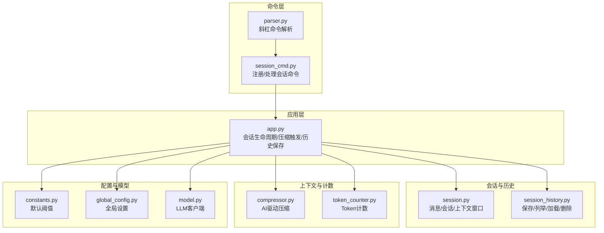
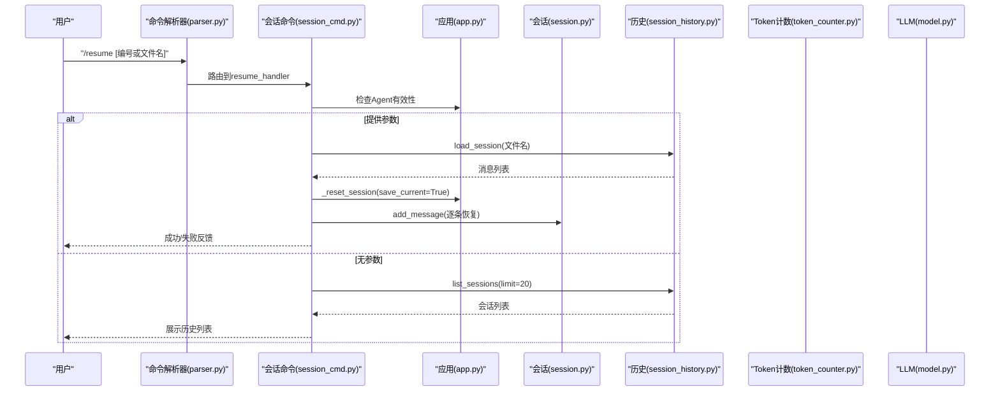
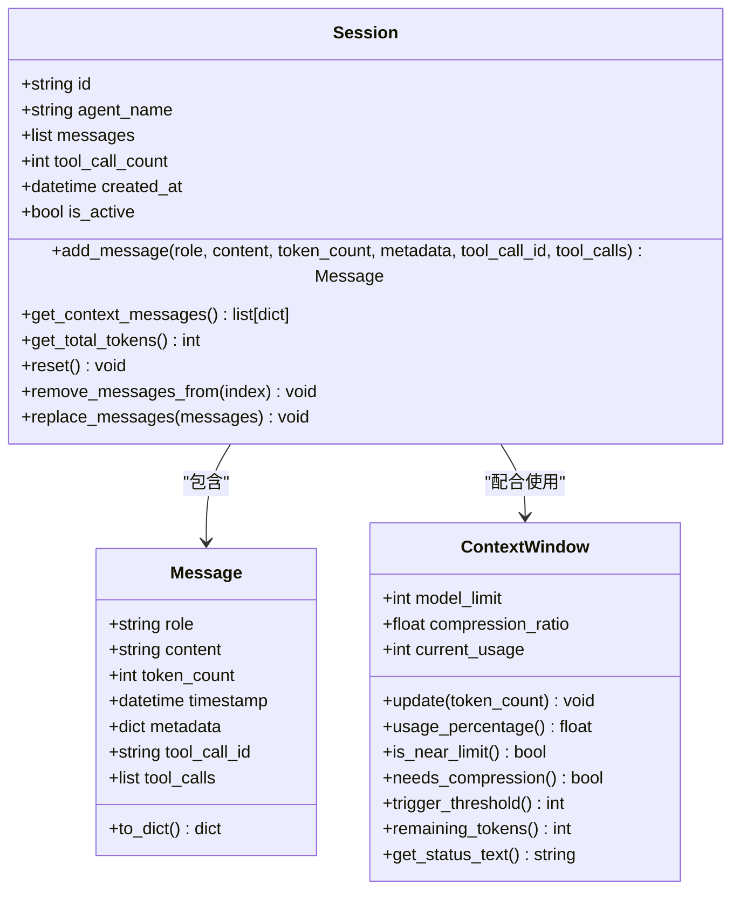
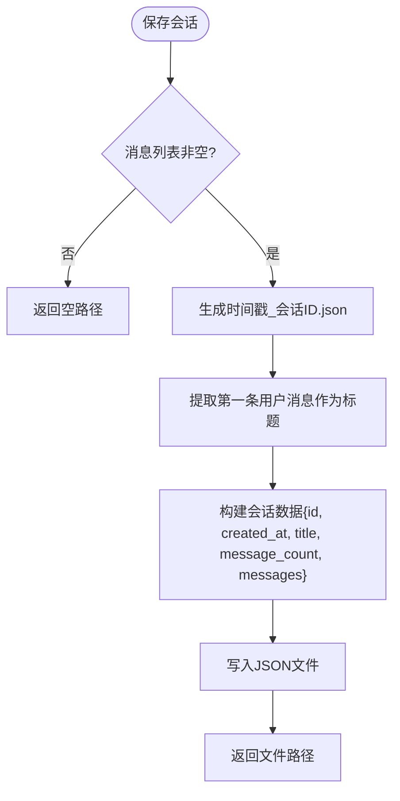
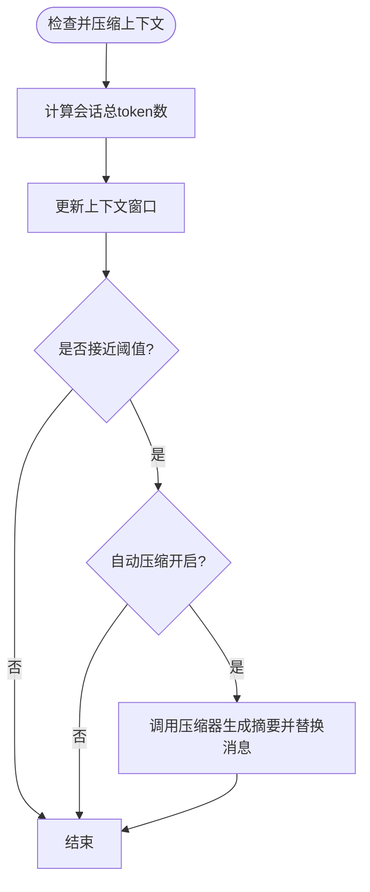
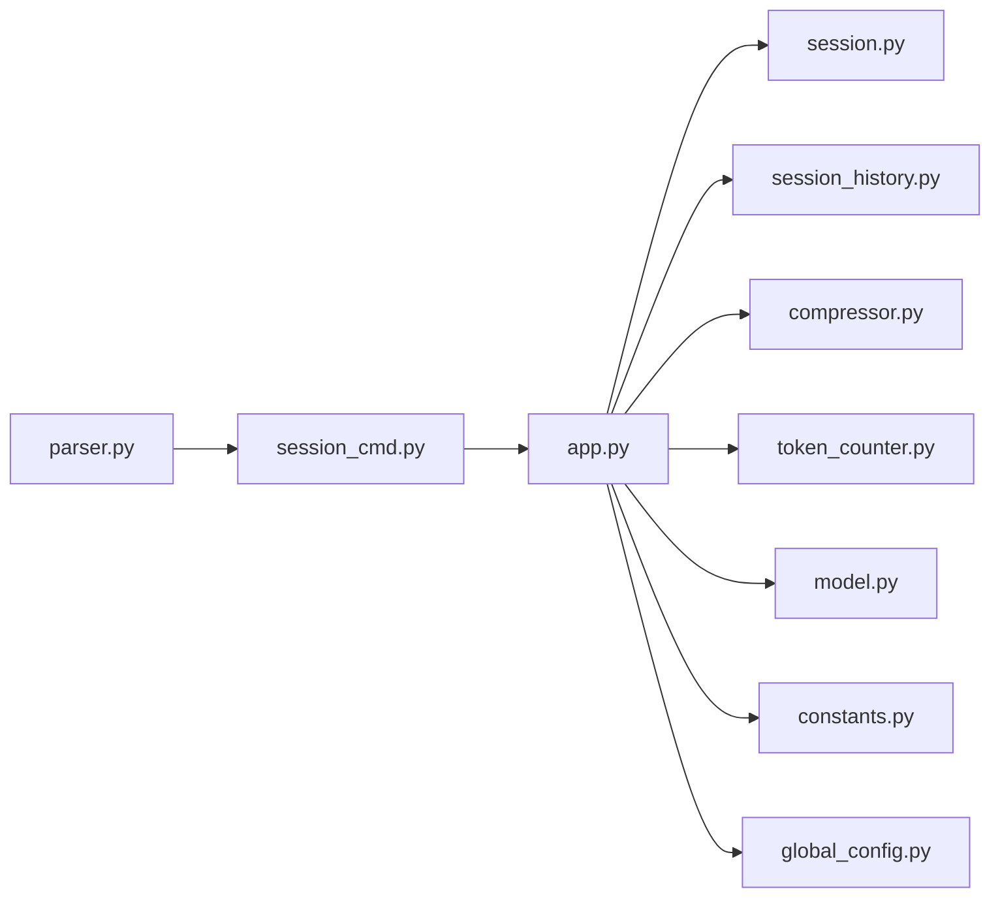

# 会话管理命令

<cite>
**本文引用的文件**
- [README.md](file://README.md)
- [session_cmd.py](file://cbhcli_pkg/commands/session_cmd.py)
- [parser.py](file://cbhcli_pkg/commands/parser.py)
- [app.py](file://cbhcli_pkg/core/app.py)
- [session.py](file://cbhcli_pkg/core/session.py)
- [session_history.py](file://cbhcli_pkg/core/session_history.py)
- [compressor.py](file://cbhcli_pkg/context/compressor.py)
- [token_counter.py](file://cbhcli_pkg/context/token_counter.py)
- [constants.py](file://cbhcli_pkg/core/constants.py)
- [global_config.py](file://cbhcli_pkg/config/global_config.py)
- [model.py](file://cbhcli_pkg/core/model.py)
</cite>

## 目录
1. [简介](#简介)
2. [项目结构](#项目结构)
3. [核心组件](#核心组件)
4. [架构总览](#架构总览)
5. [详细组件分析](#详细组件分析)
6. [依赖关系分析](#依赖关系分析)
7. [性能考量](#性能考量)
8. [故障排查指南](#故障排查指南)
9. [结论](#结论)
10. [附录](#附录)

## 简介
本文件是会话管理命令的权威参考，面向使用者与维护者，系统讲解斜杠命令体系中的会话相关命令，包括创建、列举、恢复、压缩与上下文状态查看，并深入解释会话的历史记录管理机制（消息存储、上下文窗口控制与自动压缩）、会话状态查看与导出备份方法、会话与Agent的绑定与数据隔离、性能优化建议、恢复与迁移操作指南、安全性与隐私保护，以及常见问题诊断与解决。

## 项目结构
围绕会话管理的核心文件与职责如下：
- 命令层：commands/session_cmd.py 注册与实现会话相关斜杠命令
- 应用层：core/app.py 负责会话生命周期、上下文压缩触发与历史保存
- 会话模型：core/session.py 定义消息结构、会话容器与上下文窗口
- 历史管理：core/session_history.py 负责会话文件的保存、列举、加载与删除
- 上下文压缩：context/compressor.py 基于LLM的摘要压缩策略
- Token计数：context/token_counter.py 提供精确/估算的token统计
- 命令解析：commands/parser.py 提供斜杠命令的解析与执行框架
- 常量与配置：core/constants.py、config/global_config.py 提供默认阈值与全局设置
- LLM客户端：core/model.py 提供统一的聊天与流式接口

图表来源
- [session_cmd.py:1-183](file://cbhcli_pkg/commands/session_cmd.py#L1-L183)
- [app.py:54-478](file://cbhcli_pkg/core/app.py#L54-L478)
- [session.py:1-190](file://cbhcli_pkg/core/session.py#L1-L190)
- [session_history.py:1-136](file://cbhcli_pkg/core/session_history.py#L1-L136)
- [compressor.py:1-112](file://cbhcli_pkg/context/compressor.py#L1-L112)
- [token_counter.py:1-88](file://cbhcli_pkg/context/token_counter.py#L1-L88)
- [constants.py:1-50](file://cbhcli_pkg/core/constants.py#L1-L50)
- [global_config.py:1-154](file://cbhcli_pkg/config/global_config.py#L1-L154)
- [model.py:1-147](file://cbhcli_pkg/core/model.py#L1-L147)

章节来源
- [README.md:269-295](file://README.md#L269-L295)
- [session_cmd.py:1-183](file://cbhcli_pkg/commands/session_cmd.py#L1-L183)
- [app.py:54-478](file://cbhcli_pkg/core/app.py#L54-L478)

## 核心组件
- 会话命令注册与处理：在命令层集中注册/reset、/new、/resume、/history、/comp、/ctx 等命令，均要求当前Agent有效。
- 会话生命周期：应用层负责创建新会话、保存历史、重置会话、自动压缩上下文。
- 历史记录管理：历史文件保存在Agent工作空间的history目录，采用时间戳+会话ID命名，支持列表、加载与删除。
- 上下文窗口与压缩：基于模型上下文限制与阈值比例，当接近阈值时自动压缩；支持手动压缩。
- Token计数：优先使用tiktoken精确计数，否则使用估算规则，用于上下文统计与压缩触发。

章节来源
- [session_cmd.py:5-183](file://cbhcli_pkg/commands/session_cmd.py#L5-L183)
- [app.py:281-385](file://cbhcli_pkg/core/app.py#L281-L385)
- [session_history.py:16-136](file://cbhcli_pkg/core/session_history.py#L16-L136)
- [compressor.py:7-112](file://cbhcli_pkg/context/compressor.py#L7-L112)
- [token_counter.py:14-88](file://cbhcli_pkg/context/token_counter.py#L14-L88)

## 架构总览
会话管理命令的端到端流程如下：
- 用户输入斜杠命令，解析器识别命令并路由至对应处理器
- 处理器调用应用层接口，执行会话操作（创建、恢复、压缩、查询）
- 应用层协调会话容器、历史管理器、上下文窗口与压缩器
- 历史文件持久化到Agent工作空间的history目录

图表来源
- [parser.py:26-78](file://cbhcli_pkg/commands/parser.py#L26-L78)
- [session_cmd.py:33-94](file://cbhcli_pkg/commands/session_cmd.py#L33-L94)
- [app.py:281-331](file://cbhcli_pkg/core/app.py#L281-L331)
- [session_history.py:66-118](file://cbhcli_pkg/core/session_history.py#L66-L118)
- [session.py:54-82](file://cbhcli_pkg/core/session.py#L54-L82)

## 详细组件分析

### 命令一览与使用说明
- /reset 或 /new
  - 作用：创建新会话，自动保存当前会话到history目录
  - 行为：若当前Agent有效，则调用应用层重置会话，同时保存历史
  - 适用场景：开始新任务、切换主题、清理上下文
  - 注意：需要先选择Agent
- /resume [编号或文件名]
  - 作用：列出历史会话或恢复指定会话
  - 行为：无参数时列出最近会话；提供参数时尝试按文件名或序号恢复
  - 恢复逻辑：加载消息后逐条添加到新会话（跳过system消息），统计用户消息轮数
  - 适用场景：快速回到之前的对话
- /history
  - 作用：查看历史会话列表（/resume的别名）
- /comp
  - 作用：手动压缩上下文
  - 行为：调用应用层压缩逻辑，若成功返回“已压缩”，否则提示“无需压缩”
- /ctx
  - 作用：查看上下文使用情况
  - 输出：Agent名称、模型、上下文使用状态、剩余tokens、消息数、工具调用次数、自动压缩开关与压缩阈值

章节来源
- [session_cmd.py:8-31](file://cbhcli_pkg/commands/session_cmd.py#L8-L31)
- [session_cmd.py:33-94](file://cbhcli_pkg/commands/session_cmd.py#L33-L94)
- [session_cmd.py:104-115](file://cbhcli_pkg/commands/session_cmd.py#L104-L115)
- [session_cmd.py:117-140](file://cbhcli_pkg/commands/session_cmd.py#L117-L140)
- [session_cmd.py:142-182](file://cbhcli_pkg/commands/session_cmd.py#L142-L182)

### 会话与上下文模型
- Message 数据结构：role、content、token_count、timestamp、metadata、tool_call_id、tool_calls
- Session：维护消息列表、工具调用计数、创建时间、是否活跃；提供添加消息、获取上下文消息、统计token、重置、截断、替换消息等
- ContextWindow：根据模型上下文限制与压缩阈值比例，计算使用百分比、是否接近/需要压缩、剩余tokens、状态文本

图表来源
- [session.py:8-190](file://cbhcli_pkg/core/session.py#L8-L190)

章节来源
- [session.py:8-190](file://cbhcli_pkg/core/session.py#L8-L190)

### 历史记录管理机制
- 存储位置：Agent工作空间下的history目录
- 文件命名：时间戳_会话ID.json
- 保存内容：会话ID、创建时间、标题（取第一条用户消息前50字符）、消息总数、消息数组
- 列表展示：按时间倒序，最多limit条，显示创建时间、标题、消息数与文件名
- 加载恢复：按文件名加载消息数组，逐条添加到新会话（跳过system消息）
- 删除：按文件名删除历史文件

图表来源
- [session_history.py:24-64](file://cbhcli_pkg/core/session_history.py#L24-L64)

章节来源
- [session_history.py:16-136](file://cbhcli_pkg/core/session_history.py#L16-L136)

### 上下文窗口控制与自动压缩
- 触发条件：当上下文使用百分比达到压缩阈值比例（默认80%）时自动压缩
- 压缩策略：保留最早2轮与最近3轮，中间部分生成摘要，插入system摘要消息，替换原消息序列
- 手动压缩：/comp命令直接调用压缩器，返回压缩结果
- Token统计：使用Token计数器计算消息总token数，用于更新上下文窗口

图表来源
- [app.py:368-385](file://cbhcli_pkg/core/app.py#L368-L385)
- [compressor.py:21-81](file://cbhcli_pkg/context/compressor.py#L21-L81)
- [token_counter.py:60-75](file://cbhcli_pkg/context/token_counter.py#L60-L75)

章节来源
- [app.py:361-385](file://cbhcli_pkg/core/app.py#L361-L385)
- [compressor.py:7-112](file://cbhcli_pkg/context/compressor.py#L7-L112)
- [constants.py:6-8](file://cbhcli_pkg/core/constants.py#L6-L8)

### 会话状态查看与导出备份
- /ctx 命令输出：
  - Agent名称、模型名称
  - 上下文使用状态文本、剩余tokens、消息数、工具调用次数
  - 自动压缩开关与压缩阈值
- 历史导出与备份：
  - 历史文件位于Agent工作空间的history目录，可直接复制该目录进行备份
  - 也可通过/restore命令（见下节）进行恢复
- 会话数据隔离：
  - 每个Agent拥有独立工作空间与历史目录，不同Agent之间不会互相影响

章节来源
- [session_cmd.py:142-182](file://cbhcli_pkg/commands/session_cmd.py#L142-L182)
- [session_history.py:16-22](file://cbhcli_pkg/core/session_history.py#L16-L22)

### 会话与Agent的绑定关系与数据隔离
- 会话与Agent绑定：Session持有agent_name字段，应用层在创建会话时注入系统提示，其中包含Agent的人格与工具描述
- 历史隔离：SessionHistoryManager基于Agent工作空间路径创建history目录，确保不同Agent的历史文件互不干扰
- 工作空间结构：每个Agent工作空间包含config.json、skills.md、soul.md、tools.md、memory.md、usage.md、history/、knowledge/等

章节来源
- [session.py:40-52](file://cbhcli_pkg/core/session.py#L40-L52)
- [app.py:260-264](file://cbhcli_pkg/core/app.py#L260-L264)
- [session_history.py:16-22](file://cbhcli_pkg/core/session_history.py#L16-L22)
- [README.md:192-206](file://README.md#L192-L206)

### 会话恢复与数据迁移
- 恢复步骤：
  - 使用/resume列出历史会话，记下编号或文件名
  - 使用/resume <编号或文件名>恢复指定会话
  - 恢复后会创建新会话并逐条添加消息（跳过system消息）
- 数据迁移：
  - 将Agent工作空间目录整体复制到新环境
  - 在新环境中加载相同Agent即可恢复历史会话
  - 若需跨Agent迁移，可将history目录中的特定会话文件复制到目标Agent的history目录

章节来源
- [session_cmd.py:33-94](file://cbhcli_pkg/commands/session_cmd.py#L33-L94)
- [session_history.py:66-118](file://cbhcli_pkg/core/session_history.py#L66-L118)

### 会话安全性与隐私保护
- 历史文件为纯文本JSON，包含对话内容，应妥善保管Agent工作空间目录
- memory.md 作为长期记忆文件，仅包含用户明确要求记录的内容，始终包含在系统提示中
- 建议：
  - 对包含敏感信息的会话，使用/new创建新会话并在完成后删除历史文件
  - 在共享或备份前，确认文件中不包含敏感信息

章节来源
- [README.md:135-140](file://README.md#L135-L140)
- [session_history.py:24-64](file://cbhcli_pkg/core/session_history.py#L24-L64)

## 依赖关系分析
- 命令层依赖应用层提供的会话与历史接口
- 应用层依赖会话模型、历史管理器、上下文压缩器、Token计数器与LLM客户端
- 上下文压缩器依赖LLM客户端与Token计数器
- 命令解析器提供统一的斜杠命令框架

图表来源
- [session_cmd.py:1-3](file://cbhcli_pkg/commands/session_cmd.py#L1-L3)
- [app.py:14-47](file://cbhcli_pkg/core/app.py#L14-L47)
- [compressor.py:2-4](file://cbhcli_pkg/context/compressor.py#L2-L4)
- [token_counter.py:2-3](file://cbhcli_pkg/context/token_counter.py#L2-L3)
- [model.py:2-4](file://cbhcli_pkg/core/model.py#L2-L4)
- [constants.py:1-5](file://cbhcli_pkg/core/constants.py#L1-L5)
- [global_config.py:1-5](file://cbhcli_pkg/config/global_config.py#L1-L5)

章节来源
- [session_cmd.py:1-3](file://cbhcli_pkg/commands/session_cmd.py#L1-L3)
- [app.py:14-47](file://cbhcli_pkg/core/app.py#L14-L47)

## 性能考量
- Token计数精度：优先使用tiktoken，若不可用则使用估算规则，估算可能与实际略有差异
- 自动压缩阈值：默认80%，可在Agent配置中调整，降低频繁压缩带来的成本
- 压缩策略：保留早期与近期对话，中间部分摘要化，平衡上下文长度与信息完整性
- 历史文件大小：定期清理不再需要的历史文件，避免占用磁盘空间
- 模型上下文限制：根据所用模型的实际限制合理设置上下文窗口

章节来源
- [token_counter.py:14-58](file://cbhcli_pkg/context/token_counter.py#L14-L58)
- [constants.py:6-8](file://cbhcli_pkg/core/constants.py#L6-L8)
- [app.py:322-330](file://cbhcli_pkg/core/app.py#L322-L330)

## 故障排查指南
- 无法执行会话命令
  - 症状：提示“请先选择Agent”或“Agent未配置模型”
  - 排查：使用/agent switch选择Agent，使用/model use切换模型
- 历史列表为空
  - 症状：/resume或/history显示“暂无历史会话”
  - 排查：确认已至少进行一次对话并触发保存；检查Agent工作空间的history目录是否存在
- 恢复失败
  - 症状：/resume <编号或文件名>返回“找不到会话文件”或“加载会话失败”
  - 排查：确认编号或文件名正确；检查history目录中文件是否损坏；尝试使用文件名而非编号
- 压缩无效
  - 症状：/comp返回“无需压缩”
  - 排查：确认上下文接近阈值；检查自动压缩开关；手动触发压缩
- Token计数异常
  - 症状：上下文使用百分比与预期不符
  - 排查：确认是否安装tiktoken；若未安装，将使用估算规则

章节来源
- [session_cmd.py:36-40](file://cbhcli_pkg/commands/session_cmd.py#L36-L40)
- [session_cmd.py:43-60](file://cbhcli_pkg/commands/session_cmd.py#L43-L60)
- [session_cmd.py:120-124](file://cbhcli_pkg/commands/session_cmd.py#L120-L124)
- [token_counter.py:6-11](file://cbhcli_pkg/context/token_counter.py#L6-L11)

## 结论
会话管理命令提供了完整的会话生命周期管理能力：创建、列举、恢复、压缩与状态查看。通过历史文件的自动保存与Agent工作空间的数据隔离，用户可以方便地进行会话备份、恢复与迁移。结合上下文窗口与AI驱动的摘要压缩，系统在保证对话连贯性的同时，有效控制上下文长度与资源消耗。建议在日常使用中定期清理历史文件、合理设置压缩阈值，并注意敏感信息的处理与备份。

## 附录
- 常用命令速查
  - /reset 或 /new：创建新会话并保存历史
  - /resume [编号或文件名]：恢复历史会话
  - /history：查看历史会话列表
  - /comp：手动压缩上下文
  - /ctx：查看上下文使用情况
- Agent工作空间目录结构
  - 包含config.json、skills.md、soul.md、tools.md、memory.md、usage.md、history/、knowledge/等

章节来源
- [README.md:231-261](file://README.md#L231-L261)
- [README.md:192-206](file://README.md#L192-L206)