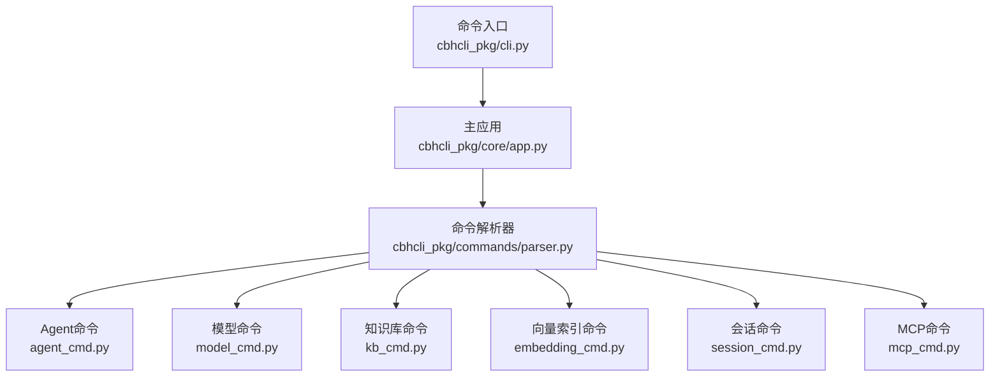
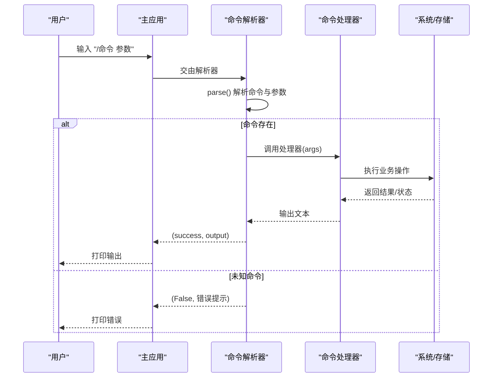
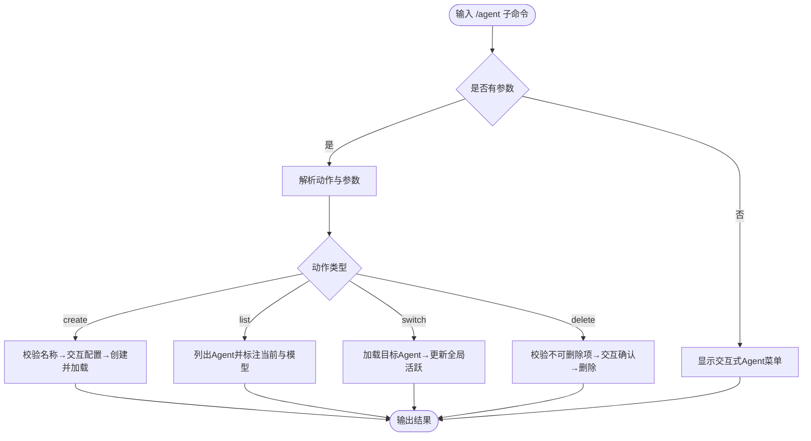
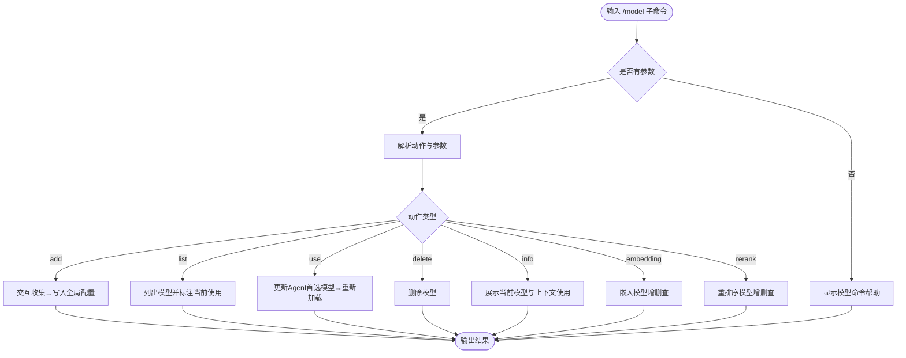
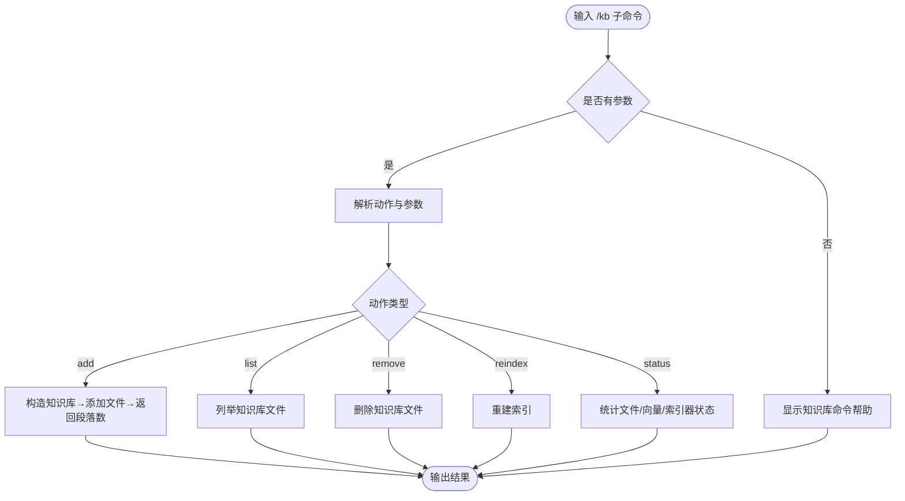
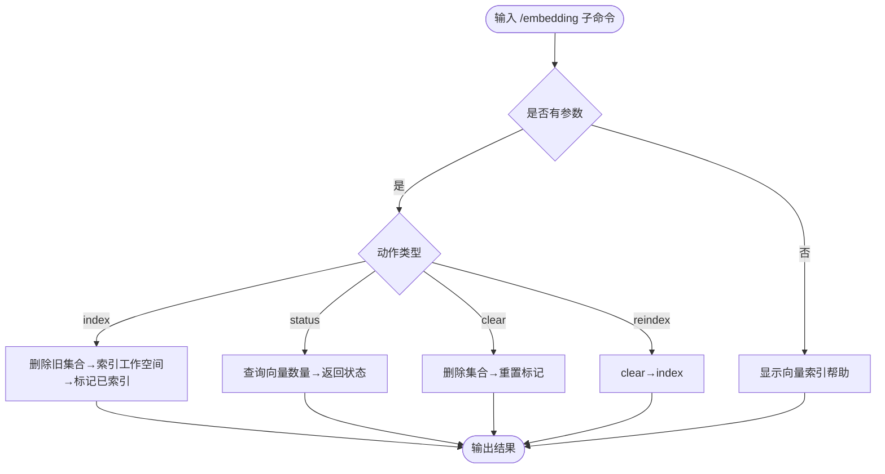
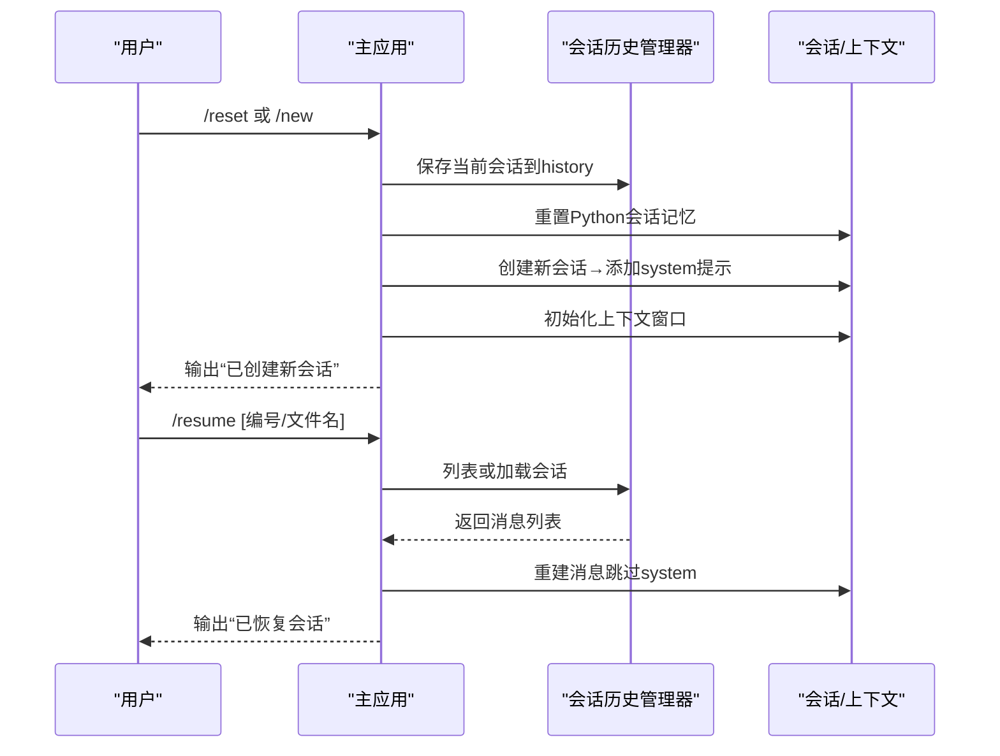
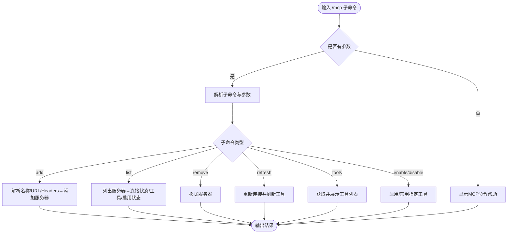
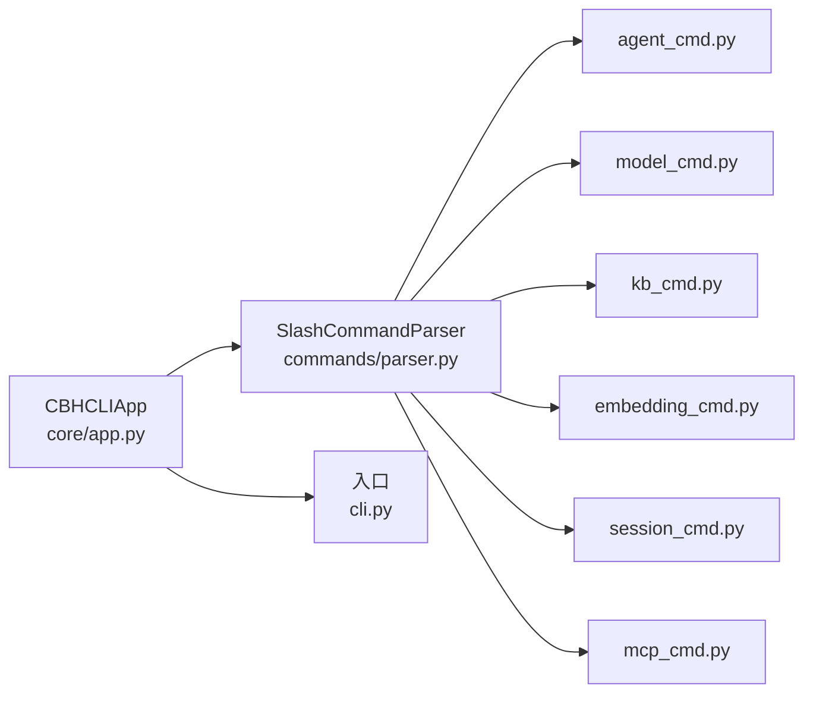

# 命令参考手册

<cite>
**本文引用的文件**
- [README.md](file://README.md)
- [INSTALL.md](file://INSTALL.md)
- [cbhcli_pkg/cli.py](file://cbhcli_pkg/cli.py)
- [cbhcli_pkg/commands/parser.py](file://cbhcli_pkg/commands/parser.py)
- [cbhcli_pkg/commands/agent_cmd.py](file://cbhcli_pkg/commands/agent_cmd.py)
- [cbhcli_pkg/commands/model_cmd.py](file://cbhcli_pkg/commands/model_cmd.py)
- [cbhcli_pkg/commands/kb_cmd.py](file://cbhcli_pkg/commands/kb_cmd.py)
- [cbhcli_pkg/commands/embedding_cmd.py](file://cbhcli_pkg/commands/embedding_cmd.py)
- [cbhcli_pkg/commands/session_cmd.py](file://cbhcli_pkg/commands/session_cmd.py)
- [cbhcli_pkg/commands/mcp_cmd.py](file://cbhcli_pkg/commands/mcp_cmd.py)
- [cbhcli_pkg/core/app.py](file://cbhcli_pkg/core/app.py)
- [cbhcli_pkg/__main__.py](file://cbhcli_pkg/__main__.py)
</cite>

## 目录
1. [简介](#简介)
2. [项目结构](#项目结构)
3. [核心组件](#核心组件)
4. [架构总览](#架构总览)
5. [详细组件分析](#详细组件分析)
6. [依赖分析](#依赖分析)
7. [性能考虑](#性能考虑)
8. [故障排除指南](#故障排除指南)
9. [结论](#结论)
10. [附录](#附录)

## 简介
本手册面向CBHCLI v3.0的斜杠命令体系，系统性梳理并解释所有可用的斜杠命令，涵盖Agent管理、模型配置、会话与历史、知识库、向量索引以及MCP工具服务器管理等。每个命令均给出语法格式、参数说明、典型使用示例、常见场景、执行流程与内部机制、错误处理与排障建议，并提供命令组合的最佳实践与快捷键支持说明。

## 项目结构
CBHCLI采用模块化设计，命令系统通过统一的斜杠命令解析器进行注册与分发，各命令模块负责具体业务逻辑，核心应用负责初始化、UI与交互循环。

图表来源
- [cbhcli_pkg/cli.py:73-112](file://cbhcli_pkg/cli.py#L73-L112)
- [cbhcli_pkg/core/app.py:151-179](file://cbhcli_pkg/core/app.py#L151-L179)
- [cbhcli_pkg/commands/parser.py:16-94](file://cbhcli_pkg/commands/parser.py#L16-L94)

章节来源
- [cbhcli_pkg/cli.py:1-112](file://cbhcli_pkg/cli.py#L1-L112)
- [cbhcli_pkg/core/app.py:54-200](file://cbhcli_pkg/core/app.py#L54-L200)
- [cbhcli_pkg/commands/parser.py:16-94](file://cbhcli_pkg/commands/parser.py#L16-L94)

## 核心组件
- 命令解析器：负责将用户输入的斜杠命令解析为命令名与参数，并调用对应处理器；提供帮助文本生成与未知命令反馈。
- 命令注册：在应用初始化阶段集中注册各类命令，统一管理命令生命周期。
- 应用主循环：负责UI交互、快捷键绑定（如Ctrl+R切换工具显示模式）、命令执行与错误捕获。

章节来源
- [cbhcli_pkg/commands/parser.py:16-94](file://cbhcli_pkg/commands/parser.py#L16-L94)
- [cbhcli_pkg/core/app.py:180-202](file://cbhcli_pkg/core/app.py#L180-L202)

## 架构总览
斜杠命令的执行路径如下：用户输入 → 应用主循环接收 → 命令解析器判断是否为斜杠命令 → 若是则路由到对应命令处理器 → 处理器执行业务逻辑并返回结果 → 应用层打印输出。

图表来源
- [cbhcli_pkg/commands/parser.py:26-78](file://cbhcli_pkg/commands/parser.py#L26-L78)
- [cbhcli_pkg/core/app.py:386-400](file://cbhcli_pkg/core/app.py#L386-L400)

## 详细组件分析

### /agent 命令：Agent管理
- 语法
  - /agent create <名称>
  - /agent list
  - /agent switch <名称>
  - /agent delete <名称>
- 参数说明
  - 名称：Agent唯一标识，区分大小写。
- 使用示例
  - 创建Agent：/agent create dev-helper
  - 切换Agent：/agent switch main
  - 删除Agent：/agent delete dev-helper
- 常见场景
  - 多角色或多项目并行时，快速在不同Agent间切换。
  - Agent配置变更后，需重新加载以生效。
- 执行流程与内部机制
  - create：校验名称唯一性，交互式填写描述与首选模型，创建Agent工作空间并加载。
  - list：枚举Agent列表，标注当前活跃Agent与首选模型。
  - switch：加载目标Agent，更新全局活跃Agent设置。
  - delete：禁止删除默认Agent main，禁止删除当前激活Agent；交互确认后删除。
- 错误处理与排障
  - Agent不存在或加载失败：提示“不存在或加载失败”。
  - 删除冲突：提示“无法删除主默认Agent”或“无法删除当前激活的Agent”。

图表来源
- [cbhcli_pkg/commands/agent_cmd.py:9-47](file://cbhcli_pkg/commands/agent_cmd.py#L9-L47)
- [cbhcli_pkg/commands/agent_cmd.py:99-181](file://cbhcli_pkg/commands/agent_cmd.py#L99-L181)

章节来源
- [cbhcli_pkg/commands/agent_cmd.py:5-47](file://cbhcli_pkg/commands/agent_cmd.py#L5-L47)
- [cbhcli_pkg/commands/agent_cmd.py:50-181](file://cbhcli_pkg/commands/agent_cmd.py#L50-L181)

### /model 命令：模型配置
- 语法
  - /model add
  - /model list
  - /model use <名称>
  - /model delete <名称>
  - /model info
  - /model embedding add|info|delete
  - /model rerank add|info|delete
- 参数说明
  - 名称：模型唯一标识；嵌入/重排序模型需单独配置。
- 使用示例
  - 添加模型：/model add（按提示输入名称、API Key、Base URL、模型ID、上下文长度）
  - 切换模型：/model use gpt-4o
  - 配置嵌入模型：/model embedding add（名称、API Key、Base URL、模型ID、类型）
  - 配置重排序模型：/model rerank add（名称、API Key、Base URL、模型ID、top_n）
- 常见场景
  - 多模型并存时快速切换；为Agent指定首选模型；启用向量检索与重排序。
- 执行流程与内部机制
  - add：交互式收集配置，写入全局配置；嵌入/重排序模型写入独立字段。
  - use：更新当前Agent的primary_model，保存上次选择，必要时重新加载Agent。
  - info：展示当前Agent使用的模型与上下文使用率。
  - embedding/rerank：提供增删查与状态提示，部分变更需重启应用生效。
- 错误处理与排障
  - 模型不存在：提示“不存在”。
  - 配置缺失：提示“未配置嵌入模型/重排序模型”。
  - 数字输入非法：提示“必须是数字”。

图表来源
- [cbhcli_pkg/commands/model_cmd.py:9-61](file://cbhcli_pkg/commands/model_cmd.py#L9-L61)
- [cbhcli_pkg/commands/model_cmd.py:64-371](file://cbhcli_pkg/commands/model_cmd.py#L64-L371)

章节来源
- [cbhcli_pkg/commands/model_cmd.py:5-61](file://cbhcli_pkg/commands/model_cmd.py#L5-L61)
- [cbhcli_pkg/commands/model_cmd.py:64-371](file://cbhcli_pkg/commands/model_cmd.py#L64-L371)

### /kb 命令：知识库管理
- 语法
  - /kb add <文件路径>
  - /kb list
  - /kb remove <文件名>
  - /kb reindex
  - /kb status
- 参数说明
  - 文件路径：本地文件绝对或相对路径。
  - 文件名：知识库内文件名（不含目录）。
- 使用示例
  - 添加PDF：/kb add /path/to/doc.pdf
  - 重新索引：/kb reindex
  - 查看状态：/kb status
- 常见场景
  - 新增文档后需要立即生效检索；批量导入后统一重建索引；排查向量数量异常。
- 执行流程与内部机制
  - add：构造知识库实例，调用底层添加接口，返回索引段落数。
  - list/status：列举文件、统计向量数量、展示索引器状态。
  - reindex：重建索引，覆盖旧索引。
  - remove：删除知识库中的文件条目。
- 错误处理与排障
  - 未选择Agent：提示“请先选择 Agent”。
  - 文件不存在或添加失败：返回具体错误信息。

图表来源
- [cbhcli_pkg/commands/kb_cmd.py:9-54](file://cbhcli_pkg/commands/kb_cmd.py#L9-L54)
- [cbhcli_pkg/commands/kb_cmd.py:57-186](file://cbhcli_pkg/commands/kb_cmd.py#L57-L186)

章节来源
- [cbhcli_pkg/commands/kb_cmd.py:5-54](file://cbhcli_pkg/commands/kb_cmd.py#L5-L54)
- [cbhcli_pkg/commands/kb_cmd.py:57-186](file://cbhcli_pkg/commands/kb_cmd.py#L57-L186)

### /embedding 命令：向量索引
- 语法
  - /embedding index
  - /embedding status
  - /embedding clear
  - /embedding reindex
- 参数说明
  - 无额外参数。
- 使用示例
  - 首次索引：/embedding index
  - 查看状态：/embedding status
  - 清除索引：/embedding clear
  - 重新索引：/embedding reindex
- 常见场景
  - Agent工作空间新增文件后，手动重建索引；排查向量数量异常。
- 执行流程与内部机制
  - index：删除旧集合→调用内存索引器对Agent工作空间进行索引→标记已索引。
  - status：查询向量数量，标注索引状态。
  - clear：删除当前Agent集合，重置索引标记。
  - reindex：先clear再index。
- 错误处理与排障
  - 向量数据库未启用：提示“向量数据库未启用，请先配置嵌入模型”。
  - Agent工作空间不存在：提示路径问题。
  - 索引失败：捕获异常并返回错误信息。

图表来源
- [cbhcli_pkg/commands/embedding_cmd.py:8-39](file://cbhcli_pkg/commands/embedding_cmd.py#L8-L39)
- [cbhcli_pkg/commands/embedding_cmd.py:42-122](file://cbhcli_pkg/commands/embedding_cmd.py#L42-L122)

章节来源
- [cbhcli_pkg/commands/embedding_cmd.py:5-39](file://cbhcli_pkg/commands/embedding_cmd.py#L5-L39)
- [cbhcli_pkg/commands/embedding_cmd.py:42-122](file://cbhcli_pkg/commands/embedding_cmd.py#L42-L122)

### /session 命令族：会话与历史
- 语法
  - /reset 或 /new：重置/新建会话（自动保存当前会话到history）
  - /resume [编号或文件名]：列出或恢复历史会话
  - /history：查看历史会话列表（/resume别名）
  - /comp：手动压缩上下文
  - /ctx：查看上下文使用情况
- 参数说明
  - 编号：历史会话列表中的序号。
  - 文件名：历史会话文件名。
- 使用示例
  - 新建会话：/reset
  - 恢复第1个会话：/resume 1
  - 查看上下文：/ctx
- 常见场景
  - 需要中断当前会话并保存历史；长时间对话后清理上下文；对比不同Agent的上下文占用。
- 执行流程与内部机制
  - reset/new：保存当前会话→重置Python会话记忆→创建新会话→初始化系统提示与上下文窗口。
  - resume/history：列出最近会话→根据编号或文件名加载→重建消息（跳过system消息）。
  - comp：根据阈值触发压缩，减少token用量。
  - ctx：展示模型、剩余token、消息数、工具调用次数及自动压缩配置。
- 错误处理与排障
  - 未选择Agent：提示“请先选择Agent”。
  - 会话历史管理器未初始化：提示未初始化。
  - 无效编号/文件名：提示“无效的会话编号/找不到会话文件”。

图表来源
- [cbhcli_pkg/commands/session_cmd.py:9-31](file://cbhcli_pkg/commands/session_cmd.py#L9-L31)
- [cbhcli_pkg/commands/session_cmd.py:34-102](file://cbhcli_pkg/commands/session_cmd.py#L34-L102)
- [cbhcli_pkg/commands/session_cmd.py:118-183](file://cbhcli_pkg/commands/session_cmd.py#L118-L183)

章节来源
- [cbhcli_pkg/commands/session_cmd.py:5-31](file://cbhcli_pkg/commands/session_cmd.py#L5-L31)
- [cbhcli_pkg/commands/session_cmd.py:34-102](file://cbhcli_pkg/commands/session_cmd.py#L34-L102)
- [cbhcli_pkg/commands/session_cmd.py:118-183](file://cbhcli_pkg/commands/session_cmd.py#L118-L183)

### /mcp 命令：MCP工具服务器管理
- 语法
  - /mcp add <名称> <URL> [header键=值 ...]
  - /mcp list
  - /mcp remove <名称>
  - /mcp refresh <名称>
  - /mcp tools <名称>
  - /mcp enable <服务器> <工具名>
  - /mcp disable <服务器> <工具名>
  - /mcp help
- 参数说明
  - header键=值：可选，用于认证等头部参数。
  - 工具名：服务器暴露的工具名称。
- 使用示例
  - 添加本地MCP服务器：/mcp add myserver http://localhost:8080/mcp
  - 添加带认证头：/mcp add authed http://localhost:8080/mcp Authorization=Bearer xxx
  - 查看工具：/mcp tools myserver
  - 禁用工具：/mcp disable myserver some_tool
- 常见场景
  - 集成第三方工具服务器；按需启用/禁用特定工具；刷新工具列表。
- 执行流程与内部机制
  - add：解析名称、URL与headers，调用MCP管理器添加。
  - list/tools/remove/refresh/toggle：分别列出、查看工具、移除、刷新、启用/禁用。
- 错误处理与排障
  - 未选择Agent：提示“请先选择 Agent”。
  - MCP管理器未初始化：提示未初始化。
  - 服务器不存在：提示“找不到MCP服务器”。

图表来源
- [cbhcli_pkg/commands/mcp_cmd.py:8-50](file://cbhcli_pkg/commands/mcp_cmd.py#L8-L50)
- [cbhcli_pkg/commands/mcp_cmd.py:78-182](file://cbhcli_pkg/commands/mcp_cmd.py#L78-L182)

章节来源
- [cbhcli_pkg/commands/mcp_cmd.py:5-50](file://cbhcli_pkg/commands/mcp_cmd.py#L5-L50)
- [cbhcli_pkg/commands/mcp_cmd.py:78-182](file://cbhcli_pkg/commands/mcp_cmd.py#L78-L182)

### 快捷键支持
- Ctrl+R：切换工具显示详细/简洁模式。该行为在应用初始化时通过键盘绑定实现，调用工具执行器的verbose开关。

章节来源
- [cbhcli_pkg/core/app.py:190-197](file://cbhcli_pkg/core/app.py#L190-L197)

### 命令组合最佳实践
- 模型与Agent协同：先用/model add添加模型，再用/agent create创建Agent并选择模型，最后用/reset新建会话。
- 知识库与向量索引：/kb add添加文件后，使用/kb reindex或/emb reindex重建索引；定期用/kb status检查向量数量。
- 会话与上下文：长对话使用/comp手动压缩，或开启自动压缩；用/ctx观察上下文使用率。
- MCP工具：/mcp add添加服务器后，用/tools查看工具清单，再用/enable或/disable按需启用。

## 依赖分析
- 命令解析器与处理器解耦：命令解析器仅负责路由，具体业务逻辑封装在各命令模块，便于扩展与维护。
- 应用层集中初始化：命令注册、工具系统、向量存储、MCP管理器在应用初始化阶段完成，保证运行时一致性。
- 依赖关系图

图表来源
- [cbhcli_pkg/core/app.py:151-179](file://cbhcli_pkg/core/app.py#L151-L179)
- [cbhcli_pkg/commands/parser.py:16-94](file://cbhcli_pkg/commands/parser.py#L16-L94)

章节来源
- [cbhcli_pkg/core/app.py:151-179](file://cbhcli_pkg/core/app.py#L151-L179)
- [cbhcli_pkg/commands/parser.py:16-94](file://cbhcli_pkg/commands/parser.py#L16-L94)

## 性能考虑
- 向量索引策略：启动时不自动索引，避免频繁API调用与等待；仅在文件更新后手动触发索引，降低资源消耗。
- 上下文压缩：接近上下文阈值时自动压缩，减少token用量；也可手动/定时执行/comp压缩。
- 工具执行：Ctrl+R切换工具显示模式，有助于在复杂输出场景下聚焦关键信息。

## 故障排除指南
- 未知命令：/help查看可用命令；解析器会返回“未知命令”的提示。
- 模型相关
  - 未配置模型：/model info显示“当前Agent未配置模型”，需先用/model add添加。
  - 嵌入/重排序模型未启用：提示“未启用（需要重启应用）”，需重启应用或重新加载Agent。
- 知识库与索引
  - 未选择Agent：/kb系列命令提示“请先选择 Agent”。
  - 向量数据库未启用：/embedding系列命令提示“向量数据库未启用”，需先配置嵌入模型。
- 会话与历史
  - 会话历史管理器未初始化：提示未初始化；通常发生在未正确加载Agent时。
  - 恢复失败：检查编号或文件名是否正确；若无效则提示“无效的会话编号/找不到会话文件”。
- MCP
  - 服务器不存在：提示“找不到MCP服务器”；确认名称拼写与已添加列表。
- 通用
  - 退出程序：输入quit退出；应用捕获KeyboardInterrupt并优雅退出。

章节来源
- [cbhcli_pkg/commands/parser.py:68-78](file://cbhcli_pkg/commands/parser.py#L68-L78)
- [cbhcli_pkg/commands/model_cmd.py:159-176](file://cbhcli_pkg/commands/model_cmd.py#L159-L176)
- [cbhcli_pkg/commands/kb_cmd.py:59-60](file://cbhcli_pkg/commands/kb_cmd.py#L59-L60)
- [cbhcli_pkg/commands/embedding_cmd.py:44-48](file://cbhcli_pkg/commands/embedding_cmd.py#L44-L48)
- [cbhcli_pkg/commands/session_cmd.py:36-41](file://cbhcli_pkg/commands/session_cmd.py#L36-L41)
- [cbhcli_pkg/commands/mcp_cmd.py:150-155](file://cbhcli_pkg/commands/mcp_cmd.py#L150-L155)

## 结论
CBHCLI的斜杠命令体系以统一解析器为核心，围绕Agent、模型、会话、知识库、向量索引与MCP工具服务器构建了完整的管理闭环。通过清晰的语法、完善的错误提示与最佳实践建议，既能满足初学者快速上手，也能为专家提供深入的控制能力。配合Ctrl+R等快捷键与命令组合，可显著提升日常使用效率与稳定性。

## 附录
- 快速参考
  - Agent：/agent create/list/switch/delete
  - 模型：/model add/list/use/delete/info/embedding/rerank
  - 会话：/reset 或/new、/resume、/history、/comp、/ctx
  - 知识库：/kb add/list/remove/reindex/status
  - 向量索引：/embedding index/status/clear/reindex
  - MCP：/mcp add/list/remove/refresh/tools/enable/disable/help
- 快捷键：Ctrl+R 切换工具显示详细/简洁模式
- 安装与使用
  - 安装：参见INSTALL.md；使用：cbhcli启动后输入/help查看命令总览。

章节来源
- [INSTALL.md:1-69](file://INSTALL.md#L1-L69)
- [README.md:231-268](file://README.md#L231-L268)
- [cbhcli_pkg/cli.py:15-71](file://cbhcli_pkg/cli.py#L15-L71)