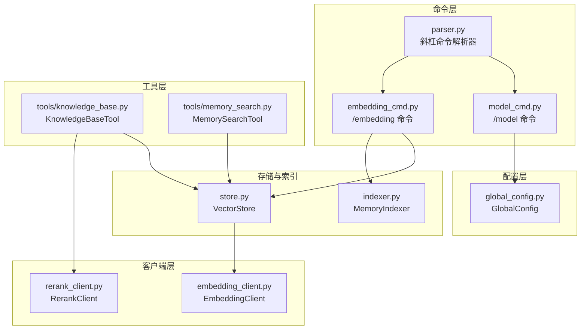
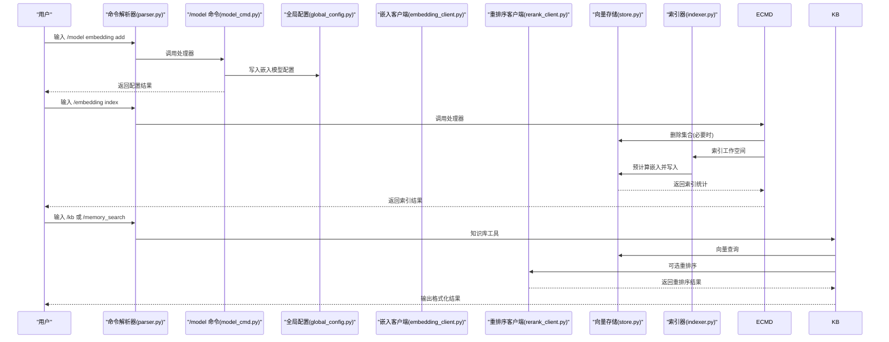
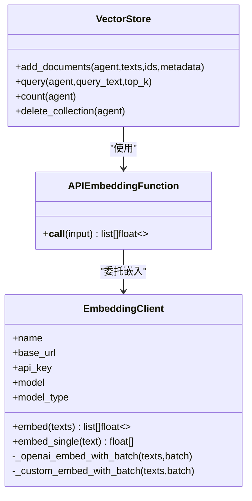
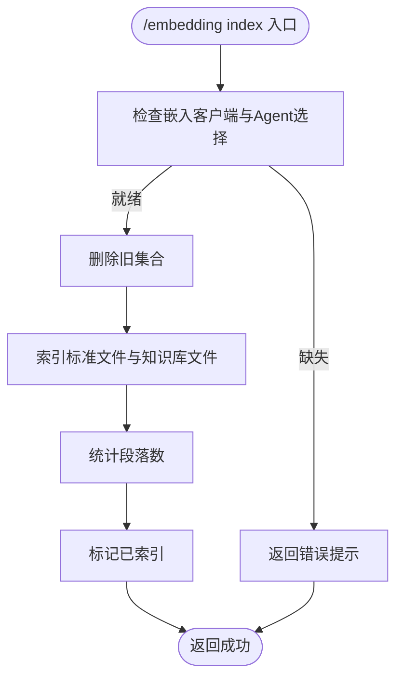
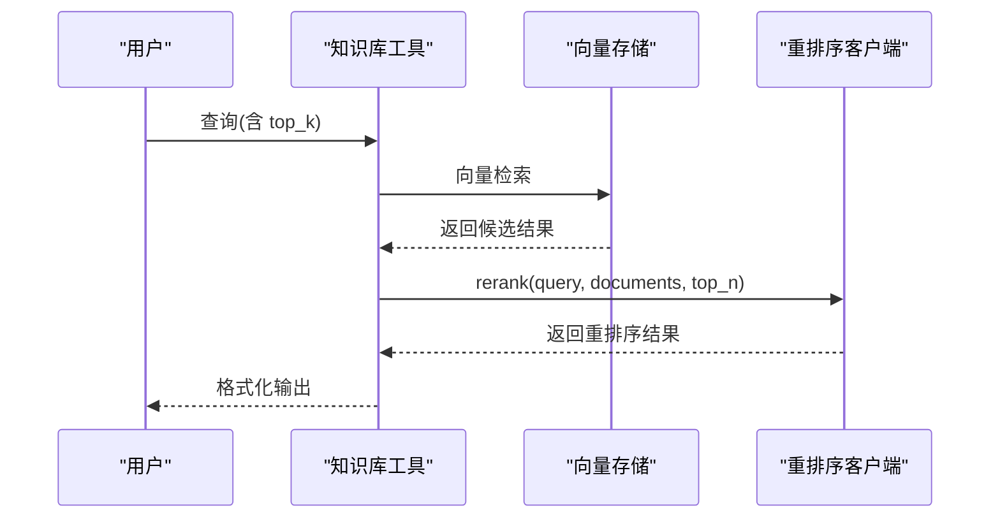
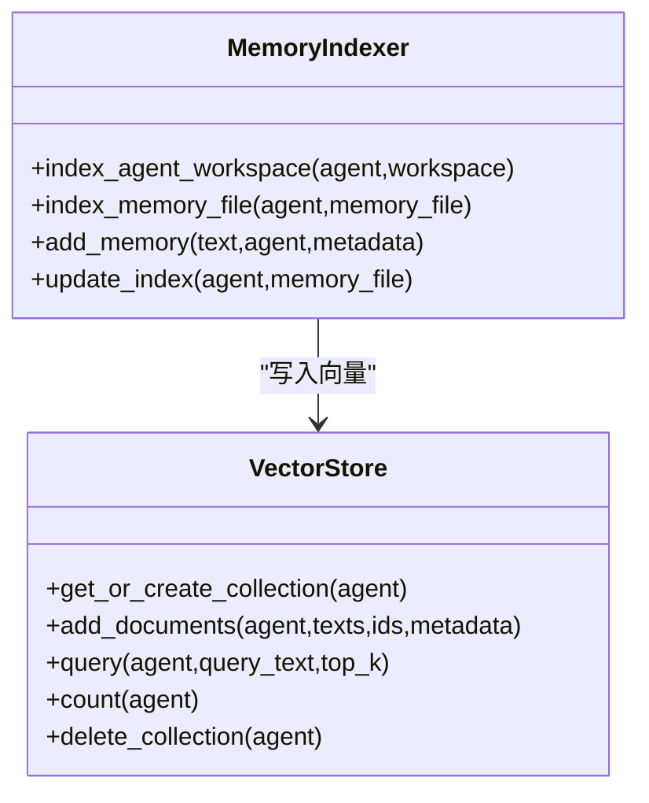
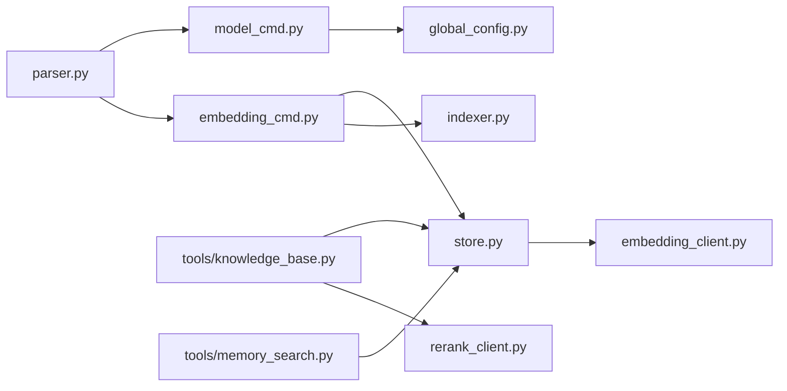

# 嵌入和重排序命令

<cite>
**本文引用的文件**
- [README.md](file://README.md)
- [parser.py](file://cbhcli_pkg/commands/parser.py)
- [embedding_cmd.py](file://cbhcli_pkg/commands/embedding_cmd.py)
- [model_cmd.py](file://cbhcli_pkg/commands/model_cmd.py)
- [embedding_client.py](file://cbhcli_pkg/core/embedding_client.py)
- [rerank_client.py](file://cbhcli_pkg/core/rerank_client.py)
- [store.py](file://cbhcli_pkg/vector/store.py)
- [indexer.py](file://cbhcli_pkg/vector/indexer.py)
- [global_config.py](file://cbhcli_pkg/config/global_config.py)
- [knowledge_base.py](file://cbhcli_pkg/core/knowledge_base.py)
- [memory_search.py](file://cbhcli_pkg/tools/memory_search.py)
- [knowledge_base.py](file://cbhcli_pkg/tools/knowledge_base.py)
</cite>

## 目录
1. [简介](#简介)
2. [项目结构](#项目结构)
3. [核心组件](#核心组件)
4. [架构总览](#架构总览)
5. [详细组件分析](#详细组件分析)
6. [依赖关系分析](#依赖关系分析)
7. [性能考量](#性能考量)
8. [故障排除指南](#故障排除指南)
9. [结论](#结论)
10. [附录](#附录)

## 简介
本技术参考文档聚焦于嵌入与重排序相关的斜杠命令与内部实现，涵盖以下主题：
- 嵌入模型与向量索引：/model embedding 与 /embedding 命令的配置与使用
- 重排序服务：/model rerank 与知识库查询中的重排序流程
- 嵌入向量生成与存储：嵌入客户端、向量存储与索引器的工作机制
- 嵌入质量评估与性能调优：批处理策略、超时控制与错误处理
- 模型切换与更新：嵌入与重排序模型的配置变更与生效方式
- 与知识库搜索的集成：向量检索、降级搜索与重排序的协同
- 故障排除与性能监控：常见问题定位与建议

## 项目结构
围绕嵌入与重排序的关键模块与文件如下：
- 命令层：/model 与 /embedding 命令的注册与处理逻辑
- 客户端层：嵌入模型客户端与重排序客户端
- 存储与索引：向量存储封装与索引器
- 配置层：全局配置管理，持久化嵌入与重排序模型
- 工具层：知识库查询与记忆搜索工具，集成向量检索与重排序
- 命令解析器：统一的斜杠命令解析与执行框架

**图表来源**
- [parser.py:16-94](file://cbhcli_pkg/commands/parser.py#L16-L94)
- [model_cmd.py:5-61](file://cbhcli_pkg/commands/model_cmd.py#L5-L61)
- [embedding_cmd.py:5-39](file://cbhcli_pkg/commands/embedding_cmd.py#L5-L39)
- [embedding_client.py:6-132](file://cbhcli_pkg/core/embedding_client.py#L6-L132)
- [rerank_client.py:6-123](file://cbhcli_pkg/core/rerank_client.py#L6-L123)
- [store.py:37-175](file://cbhcli_pkg/vector/store.py#L37-L175)
- [indexer.py:7-178](file://cbhcli_pkg/vector/indexer.py#L7-L178)
- [global_config.py:13-154](file://cbhcli_pkg/config/global_config.py#L13-L154)
- [knowledge_base.py:6-157](file://cbhcli_pkg/tools/knowledge_base.py#L6-L157)
- [memory_search.py:6-177](file://cbhcli_pkg/tools/memory_search.py#L6-L177)

**章节来源**
- [README.md:269-295](file://README.md#L269-L295)
- [parser.py:16-94](file://cbhcli_pkg/commands/parser.py#L16-L94)

## 核心组件
- 嵌入模型客户端：支持 OpenAI 兼容与自定义 API，具备批量处理与超时控制
- 重排序客户端：支持 Jina、Cohere 等 API，统一输出标准化结果
- 向量存储：封装 ChromaDB，使用自定义嵌入函数，预计算嵌入向量
- 索引器：扫描 Agent 工作空间与知识库目录，按段落切分并写入向量库
- 全局配置：持久化嵌入与重排序模型配置，支持切换与删除
- 知识库工具：向量检索与重排序，提供降级搜索能力
- 命令解析器：统一解析 /model 与 /embedding 等斜杠命令

**章节来源**
- [embedding_client.py:6-132](file://cbhcli_pkg/core/embedding_client.py#L6-L132)
- [rerank_client.py:6-123](file://cbhcli_pkg/core/rerank_client.py#L6-L123)
- [store.py:37-175](file://cbhcli_pkg/vector/store.py#L37-L175)
- [indexer.py:7-178](file://cbhcli_pkg/vector/indexer.py#L7-L178)
- [global_config.py:13-154](file://cbhcli_pkg/config/global_config.py#L13-L154)
- [knowledge_base.py:6-157](file://cbhcli_pkg/tools/knowledge_base.py#L6-L157)
- [memory_search.py:6-177](file://cbhcli_pkg/tools/memory_search.py#L6-L177)
- [parser.py:16-94](file://cbhcli_pkg/commands/parser.py#L16-L94)

## 架构总览
嵌入与重排序在系统中的交互流程如下：

**图表来源**
- [parser.py:51-78](file://cbhcli_pkg/commands/parser.py#L51-L78)
- [model_cmd.py:182-273](file://cbhcli_pkg/commands/model_cmd.py#L182-L273)
- [global_config.py:117-134](file://cbhcli_pkg/config/global_config.py#L117-L134)
- [embedding_cmd.py:42-122](file://cbhcli_pkg/commands/embedding_cmd.py#L42-L122)
- [indexer.py:37-69](file://cbhcli_pkg/vector/indexer.py#L37-L69)
- [store.py:99-160](file://cbhcli_pkg/vector/store.py#L99-L160)
- [knowledge_base.py:49-122](file://cbhcli_pkg/tools/knowledge_base.py#L49-L122)
- [rerank_client.py:35-60](file://cbhcli_pkg/core/rerank_client.py#L35-L60)

## 详细组件分析

### 嵌入模型与 /model embedding 命令
- 配置项
  - 名称、API Key、Base URL、模型ID、模型类型(openai/custom)
  - 类型决定请求格式：openai 使用标准 /embeddings；custom 默认兼容 openai 格式
- 生命周期
  - /model embedding add：写入全局配置
  - /model embedding info：查看当前嵌入模型与启用状态
  - /model embedding delete：删除配置并提示使用内置模型
- 客户端行为
  - 支持批量请求，默认批大小适配多数 API 限制
  - 超时控制与错误抛出，便于上层捕获
- 与向量存储的关系
  - VectorStore 需要嵌入客户端；未配置时会提示安装 chromadb 或配置嵌入模型

**图表来源**
- [embedding_client.py:6-132](file://cbhcli_pkg/core/embedding_client.py#L6-L132)
- [store.py:12-35](file://cbhcli_pkg/vector/store.py#L12-L35)
- [store.py:37-175](file://cbhcli_pkg/vector/store.py#L37-L175)

**章节来源**
- [model_cmd.py:182-273](file://cbhcli_pkg/commands/model_cmd.py#L182-L273)
- [embedding_client.py:15-132](file://cbhcli_pkg/core/embedding_client.py#L15-L132)
- [store.py:40-62](file://cbhcli_pkg/vector/store.py#L40-L62)

### 向量索引与 /embedding 命令
- /embedding index：删除旧集合、索引 Agent 工作空间与知识库目录、统计段落数
- /embedding status：查询集合数量与索引状态标记
- /embedding clear：删除集合并重置索引标记
- /embedding reindex：先清除再索引
- 索引范围：标准 Agent 文件与知识库目录下多种格式文件
- 错误处理：异常捕获并返回用户可读信息

**图表来源**
- [embedding_cmd.py:42-122](file://cbhcli_pkg/commands/embedding_cmd.py#L42-L122)
- [indexer.py:37-69](file://cbhcli_pkg/vector/indexer.py#L37-L69)

**章节来源**
- [embedding_cmd.py:5-122](file://cbhcli_pkg/commands/embedding_cmd.py#L5-L122)
- [indexer.py:37-178](file://cbhcli_pkg/vector/indexer.py#L37-L178)

### 重排序服务与 /model rerank 命令
- 配置项：名称、API Key、Base URL、模型ID、top_n
- 客户端行为：根据模型标识选择 Jina 或 Cohere API 格式，统一输出标准化结果
- 工具集成：知识库查询工具在多候选时调用重排序，将分数映射回原始结果并降序排列
- 降级策略：若重排序失败，回退到原始结果

**图表来源**
- [knowledge_base.py:49-157](file://cbhcli_pkg/tools/knowledge_base.py#L49-L157)
- [rerank_client.py:35-123](file://cbhcli_pkg/core/rerank_client.py#L35-L123)

**章节来源**
- [model_cmd.py:279-371](file://cbhcli_pkg/commands/model_cmd.py#L279-L371)
- [rerank_client.py:16-123](file://cbhcli_pkg/core/rerank_client.py#L16-L123)
- [knowledge_base.py:123-157](file://cbhcli_pkg/tools/knowledge_base.py#L123-L157)

### 向量存储与索引器
- 向量存储
  - 使用 ChromaDB 持久化客户端，通过自定义嵌入函数注入外部 API
  - 预计算嵌入向量，避免默认模型调用
  - 支持查询、计数、删除集合
- 索引器
  - 扫描标准 Agent 文件与知识库目录
  - 按段落切分，生成稳定 ID 与元数据
  - 写入向量库并返回段落数

**图表来源**
- [store.py:37-175](file://cbhcli_pkg/vector/store.py#L37-L175)
- [indexer.py:7-178](file://cbhcli_pkg/vector/indexer.py#L7-L178)

**章节来源**
- [store.py:37-175](file://cbhcli_pkg/vector/store.py#L37-L175)
- [indexer.py:7-178](file://cbhcli_pkg/vector/indexer.py#L7-L178)

### 全局配置与模型切换
- 嵌入模型与重排序模型分别持久化在全局配置中
- 支持添加、查看、删除；删除后提示使用内置模型
- 切换模型不影响嵌入与重排序配置，需单独配置

**章节来源**
- [global_config.py:117-154](file://cbhcli_pkg/config/global_config.py#L117-L154)
- [model_cmd.py:182-371](file://cbhcli_pkg/commands/model_cmd.py#L182-L371)

### 与知识库搜索的集成
- 知识库工具：执行向量检索，若配置重排序模型且候选数大于 1，则进行重排序
- 记忆搜索工具：优先使用向量检索；若向量存储不可用，则降级为 memory.md 的关键词匹配
- 索引范围：Agent 工作空间与知识库目录文件

**章节来源**
- [knowledge_base.py:49-157](file://cbhcli_pkg/tools/knowledge_base.py#L49-L157)
- [memory_search.py:47-177](file://cbhcli_pkg/tools/memory_search.py#L47-L177)
- [README.md:208-229](file://README.md#L208-L229)

## 依赖关系分析
- 命令层依赖解析器与应用上下文，负责注册与执行
- 客户端层依赖网络请求库，封装不同 API 的差异
- 存储层依赖向量客户端，预计算嵌入避免默认模型
- 工具层依赖存储与可选重排序客户端
- 配置层提供持久化与读取

**图表来源**
- [parser.py:16-94](file://cbhcli_pkg/commands/parser.py#L16-L94)
- [model_cmd.py:5-61](file://cbhcli_pkg/commands/model_cmd.py#L5-L61)
- [embedding_cmd.py:5-39](file://cbhcli_pkg/commands/embedding_cmd.py#L5-L39)
- [global_config.py:13-154](file://cbhcli_pkg/config/global_config.py#L13-L154)
- [store.py:37-175](file://cbhcli_pkg/vector/store.py#L37-L175)
- [indexer.py:7-178](file://cbhcli_pkg/vector/indexer.py#L7-L178)
- [embedding_client.py:6-132](file://cbhcli_pkg/core/embedding_client.py#L6-L132)
- [rerank_client.py:6-123](file://cbhcli_pkg/core/rerank_client.py#L6-L123)
- [knowledge_base.py:6-157](file://cbhcli_pkg/tools/knowledge_base.py#L6-L157)
- [memory_search.py:6-177](file://cbhcli_pkg/tools/memory_search.py#L6-L177)

**章节来源**
- [parser.py:16-94](file://cbhcli_pkg/commands/parser.py#L16-L94)
- [model_cmd.py:5-61](file://cbhcli_pkg/commands/model_cmd.py#L5-L61)
- [embedding_cmd.py:5-39](file://cbhcli_pkg/commands/embedding_cmd.py#L5-L39)
- [global_config.py:13-154](file://cbhcli_pkg/config/global_config.py#L13-L154)
- [store.py:37-175](file://cbhcli_pkg/vector/store.py#L37-L175)
- [indexer.py:7-178](file://cbhcli_pkg/vector/indexer.py#L7-L178)
- [embedding_client.py:6-132](file://cbhcli_pkg/core/embedding_client.py#L6-L132)
- [rerank_client.py:6-123](file://cbhcli_pkg/core/rerank_client.py#L6-L123)
- [knowledge_base.py:6-157](file://cbhcli_pkg/tools/knowledge_base.py#L6-L157)
- [memory_search.py:6-177](file://cbhcli_pkg/tools/memory_search.py#L6-L177)

## 性能考量
- 批处理优化：嵌入客户端默认分批处理，减少单次请求负载与超时风险
- 预计算嵌入：向量存储在写入前预计算嵌入向量，避免 ChromaDB 调用默认模型
- 超时控制：HTTP 请求设置超时，防止阻塞
- 重排序成本：仅在候选数大于 1 时进行重排序，避免不必要的 API 调用
- 索引策略：手动触发索引，避免启动时大量 API 调用与等待

**章节来源**
- [embedding_client.py:49-118](file://cbhcli_pkg/core/embedding_client.py#L49-L118)
- [store.py:118-126](file://cbhcli_pkg/vector/store.py#L118-L126)
- [knowledge_base.py:123-157](file://cbhcli_pkg/tools/knowledge_base.py#L123-L157)

## 故障排除指南
- 向量数据库未启用
  - 现象：/embedding index 提示未启用
  - 处理：配置嵌入模型或安装 chromadb
- 未选择 Agent
  - 现象：/embedding index 返回未选择 Agent
  - 处理：先切换或创建 Agent
- 工作空间不存在
  - 现象：/embedding index 返回工作空间不存在
  - 处理：确认 Agent 工作空间路径有效
- 重排序失败
  - 现象：知识库查询重排序异常
  - 处理：检查重排序模型配置与 API Key；若失败回退到原始结果
- 记忆搜索降级
  - 现象：向量存储不可用时使用 memory.md 简单匹配
  - 处理：启用向量数据库或补充知识库内容

**章节来源**
- [embedding_cmd.py:42-122](file://cbhcli_pkg/commands/embedding_cmd.py#L42-L122)
- [knowledge_base.py:72-122](file://cbhcli_pkg/tools/knowledge_base.py#L72-L122)
- [memory_search.py:70-103](file://cbhcli_pkg/tools/memory_search.py#L70-L103)

## 结论
- 嵌入与重排序通过清晰的命令与客户端抽象，实现了可插拔的向量检索与相关性提升
- 手动索引策略平衡了性能与成本，适合静态或低频更新的知识库
- 重排序在多候选场景显著提升检索质量，同时具备降级与容错能力
- 全局配置与命令层提供了便捷的模型切换与维护能力

## 附录

### 命令参考与使用步骤
- /model embedding add：配置嵌入模型（名称、API Key、Base URL、模型ID、类型）
- /model embedding info：查看当前嵌入模型与启用状态
- /model embedding delete：删除嵌入模型，提示使用内置模型
- /embedding index：索引当前 Agent 工作空间与知识库
- /embedding status：查看索引状态与向量数量
- /embedding clear：清除当前 Agent 的索引
- /embedding reindex：清除后重新索引
- /model rerank add：配置重排序模型（名称、API Key、Base URL、模型ID、top_n）
- /model rerank info：查看当前重排序模型与启用状态
- /model rerank delete：删除重排序模型，提示使用向量相似度排序

**章节来源**
- [README.md:107-123](file://README.md#L107-L123)
- [model_cmd.py:182-371](file://cbhcli_pkg/commands/model_cmd.py#L182-L371)
- [embedding_cmd.py:5-39](file://cbhcli_pkg/commands/embedding_cmd.py#L5-L39)