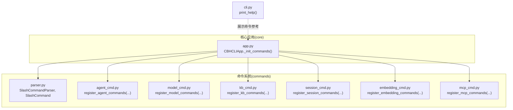
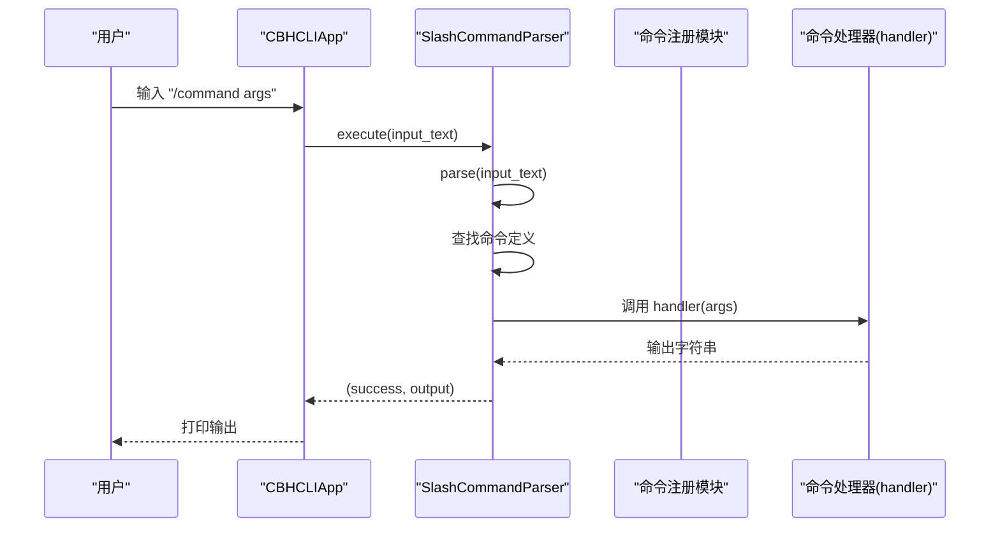
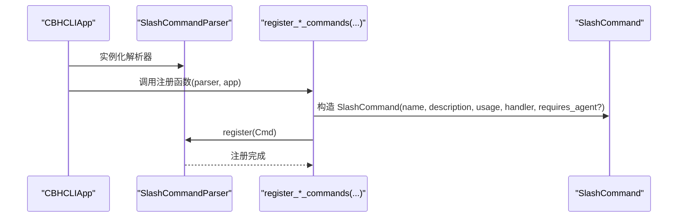
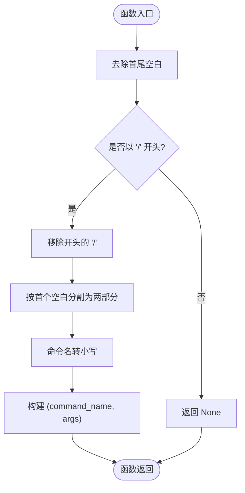
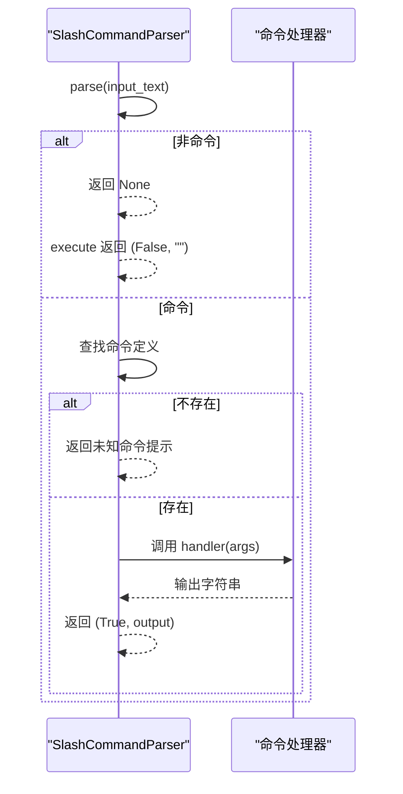
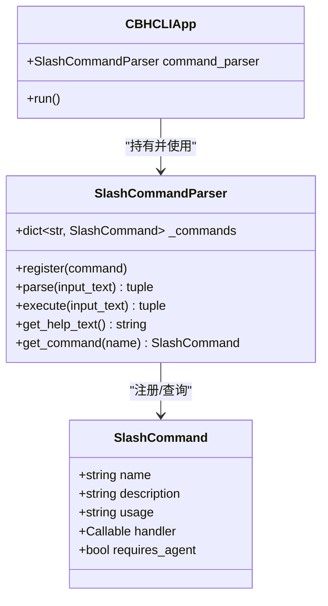

# 斜杠命令解析器

<cite>
**本文引用的文件**
- [parser.py](file://cbhcli_pkg/commands/parser.py)
- [agent_cmd.py](file://cbhcli_pkg/commands/agent_cmd.py)
- [model_cmd.py](file://cbhcli_pkg/commands/model_cmd.py)
- [kb_cmd.py](file://cbhcli_pkg/commands/kb_cmd.py)
- [session_cmd.py](file://cbhcli_pkg/commands/session_cmd.py)
- [embedding_cmd.py](file://cbhcli_pkg/commands/embedding_cmd.py)
- [mcp_cmd.py](file://cbhcli_pkg/commands/mcp_cmd.py)
- [app.py](file://cbhcli_pkg/core/app.py)
- [cli.py](file://cbhcli_pkg/cli.py)
- [README.md](file://README.md)
</cite>

## 目录
1. [简介](#简介)
2. [项目结构](#项目结构)
3. [核心组件](#核心组件)
4. [架构总览](#架构总览)
5. [详细组件分析](#详细组件分析)
6. [依赖分析](#依赖分析)
7. [性能考量](#性能考量)
8. [故障排查指南](#故障排查指南)
9. [结论](#结论)
10. [附录](#附录)

## 简介
本文件面向开发者与高级用户，系统化阐述斜杠命令解析器的设计与实现，重点覆盖以下方面：
- SlashCommandParser 类的架构与职责边界
- SlashCommand 数据类的结构、字段含义与用途
- 命令注册机制、解析算法与执行流程
- 输入文本预处理、命令提取、参数分割与大小写处理策略
- 帮助系统与命令查找机制
- 错误处理与异常捕获策略
- 性能优化建议与扩展性设计
- 自定义命令开发最佳实践

## 项目结构
斜杠命令系统位于 commands 子包中，核心解析器与命令注册均在此处实现，并由主应用在启动阶段统一初始化与注入。

图表来源
- [parser.py:16-93](file://cbhcli_pkg/commands/parser.py#L16-L93)
- [app.py:151-179](file://cbhcli_pkg/core/app.py#L151-L179)
- [cli.py:7-71](file://cbhcli_pkg/cli.py#L7-L71)

章节来源
- [parser.py:1-94](file://cbhcli_pkg/commands/parser.py#L1-L94)
- [app.py:151-179](file://cbhcli_pkg/core/app.py#L151-L179)
- [cli.py:7-71](file://cbhcli_pkg/cli.py#L7-L71)

## 核心组件
- SlashCommandParser：负责命令注册、解析、执行、帮助生成与命令查询。
- SlashCommand：命令定义的数据类，包含 name、description、usage、handler、requires_agent 字段。
- 命令注册模块：各功能域命令通过各自的 register_*_commands(parser, app) 函数注册到解析器。

章节来源
- [parser.py:6-14](file://cbhcli_pkg/commands/parser.py#L6-L14)
- [parser.py:16-93](file://cbhcli_pkg/commands/parser.py#L16-L93)

## 架构总览
命令系统采用“解析器 + 命令注册 + 命令处理器”的分层设计：
- 解析层：SlashCommandParser 提供 parse/execute/get_help_text/get_command 等能力
- 注册层：各功能域通过 register_*_commands(parser, app) 将命令注册到解析器
- 执行层：命令处理器（handler）接收参数并返回输出；解析器负责异常捕获与统一格式化输出

图表来源
- [app.py:404-407](file://cbhcli_pkg/core/app.py#L404-L407)
- [parser.py:51-78](file://cbhcli_pkg/commands/parser.py#L51-L78)

章节来源
- [app.py:404-407](file://cbhcli_pkg/core/app.py#L404-L407)
- [parser.py:51-78](file://cbhcli_pkg/commands/parser.py#L51-L78)

## 详细组件分析

### SlashCommandParser 类
- 职责
  - 注册命令：register(command)
  - 解析输入：parse(input_text) → (name, args) 或 None
  - 执行命令：execute(input_text) → (success: bool, output: str)
  - 帮助生成：get_help_text() → 文本
  - 命令查询：get_command(name) → SlashCommand 或 None

- 关键算法
  - 输入预处理：去除首尾空白，判断是否以 “/” 开头
  - 命令提取：移除 “/”，按首个空白分割，取第一段为命令名并转小写
  - 参数分割：剩余部分作为参数字符串，若无则为空串
  - 大小写处理：命令名统一转小写，便于大小写无关匹配
  - 执行流程：若非命令或命令不存在，返回相应错误；否则调用 handler(args)，异常被捕获并格式化输出

- 错误处理
  - 未知命令：返回“未知命令”提示与“输入 /help 查看可用命令”
  - 执行异常：捕获异常并返回“命令执行失败: 错误信息”

- 帮助系统
  - get_help_text() 按命令名排序输出“/命令名 描述 用法”等信息

章节来源
- [parser.py:16-93](file://cbhcli_pkg/commands/parser.py#L16-L93)

### SlashCommand 数据类
- 字段说明
  - name：命令名（注册与查找的键）
  - description：命令描述（用于帮助输出）
  - usage：命令用法（用于帮助输出）
  - handler：命令处理器函数（Callable），接收参数字符串并返回输出
  - requires_agent：布尔标志，指示该命令是否需要当前 Agent（用于 UI/业务约束）

- 用途
  - 作为命令注册的载体，统一命令元数据与处理逻辑
  - 在帮助系统中用于展示命令列表与用法

章节来源
- [parser.py:6-14](file://cbhcli_pkg/commands/parser.py#L6-L14)

### 命令注册机制
- 主应用在初始化阶段创建解析器并调用各功能域的 register_*_commands(parser, app) 完成注册
- register_*_commands 通常定义内部 handler 函数，解析参数并调用 app 或核心模块的能力
- 最终通过 parser.register(SlashCommand(...)) 将命令加入解析器

图表来源
- [app.py:151-179](file://cbhcli_pkg/core/app.py#L151-L179)
- [agent_cmd.py:42-47](file://cbhcli_pkg/commands/agent_cmd.py#L42-L47)
- [model_cmd.py:56-61](file://cbhcli_pkg/commands/model_cmd.py#L56-L61)
- [kb_cmd.py:48-54](file://cbhcli_pkg/commands/kb_cmd.py#L48-L54)
- [session_cmd.py:17-31](file://cbhcli_pkg/commands/session_cmd.py#L17-L31)
- [embedding_cmd.py:34-39](file://cbhcli_pkg/commands/embedding_cmd.py#L34-L39)
- [mcp_cmd.py:44-50](file://cbhcli_pkg/commands/mcp_cmd.py#L44-L50)

章节来源
- [app.py:151-179](file://cbhcli_pkg/core/app.py#L151-L179)
- [agent_cmd.py:5-47](file://cbhcli_pkg/commands/agent_cmd.py#L5-L47)
- [model_cmd.py:5-61](file://cbhcli_pkg/commands/model_cmd.py#L5-L61)
- [kb_cmd.py:5-54](file://cbhcli_pkg/commands/kb_cmd.py#L5-L54)
- [session_cmd.py:5-31](file://cbhcli_pkg/commands/session_cmd.py#L5-L31)
- [embedding_cmd.py:5-39](file://cbhcli_pkg/commands/embedding_cmd.py#L5-L39)
- [mcp_cmd.py:5-50](file://cbhcli_pkg/commands/mcp_cmd.py#L5-L50)

### 命令解析算法
- 输入文本预处理：去除首尾空白
- 命令提取：判断是否以 “/” 开头，移除 “/”，按首个空白分割，取第一段为命令名并转小写
- 参数分割：剩余部分作为参数字符串，若无则为空串
- 大小写处理：命令名统一转小写，确保大小写无关匹配

图表来源
- [parser.py:26-49](file://cbhcli_pkg/commands/parser.py#L26-L49)

章节来源
- [parser.py:26-49](file://cbhcli_pkg/commands/parser.py#L26-L49)

### 命令执行流程
- parse(input_text) 返回 (name, args) 或 None
- 若返回 None：execute 返回 (False, "") 表示非命令
- 若返回 (name, args)：
  - 若 name 不存在：返回“未知命令”提示
  - 若存在：调用 handler(args)，捕获异常并格式化输出

图表来源
- [parser.py:51-78](file://cbhcli_pkg/commands/parser.py#L51-L78)

章节来源
- [parser.py:51-78](file://cbhcli_pkg/commands/parser.py#L51-L78)

### 帮助系统与命令查找
- get_help_text()：遍历已注册命令，按 name 排序输出“/命令名 描述 用法”
- get_command(name)：按 name 查询命令定义，用于 /help [command] 的详细帮助

章节来源
- [parser.py:79-93](file://cbhcli_pkg/commands/parser.py#L79-L93)

### 命令注册与查找示例
- 在主应用初始化时，调用 register_*_commands(parser, app) 完成注册
- /help 命令通过 get_help_text() 或 get_command(name) 提供帮助
- 示例路径（不展示具体代码）：
  - [app.py:151-179](file://cbhcli_pkg/core/app.py#L151-L179)
  - [agent_cmd.py:42-47](file://cbhcli_pkg/commands/agent_cmd.py#L42-L47)
  - [model_cmd.py:56-61](file://cbhcli_pkg/commands/model_cmd.py#L56-L61)
  - [kb_cmd.py:48-54](file://cbhcli_pkg/commands/kb_cmd.py#L48-L54)
  - [session_cmd.py:17-31](file://cbhcli_pkg/commands/session_cmd.py#L17-L31)
  - [embedding_cmd.py:34-39](file://cbhcli_pkg/commands/embedding_cmd.py#L34-L39)
  - [mcp_cmd.py:44-50](file://cbhcli_pkg/commands/mcp_cmd.py#L44-L50)

章节来源
- [app.py:151-179](file://cbhcli_pkg/core/app.py#L151-L179)
- [agent_cmd.py:42-47](file://cbhcli_pkg/commands/agent_cmd.py#L42-L47)
- [model_cmd.py:56-61](file://cbhcli_pkg/commands/model_cmd.py#L56-L61)
- [kb_cmd.py:48-54](file://cbhcli_pkg/commands/kb_cmd.py#L48-L54)
- [session_cmd.py:17-31](file://cbhcli_pkg/commands/session_cmd.py#L17-L31)
- [embedding_cmd.py:34-39](file://cbhcli_pkg/commands/embedding_cmd.py#L34-L39)
- [mcp_cmd.py:44-50](file://cbhcli_pkg/commands/mcp_cmd.py#L44-L50)

### 错误处理机制
- 未知命令：返回“未知命令”提示与“输入 /help 查看可用命令”
- 执行异常：捕获异常并返回“命令执行失败: 错误信息”
- UI 层：主应用在 run 循环中调用 execute 并打印输出，非命令输入交由 AI 处理或提示未配置模型

章节来源
- [parser.py:68-77](file://cbhcli_pkg/commands/parser.py#L68-L77)
- [app.py:404-414](file://cbhcli_pkg/core/app.py#L404-L414)

## 依赖分析
- SlashCommandParser 依赖 SlashCommand 数据类
- 各功能域命令模块依赖 SlashCommand 与 SlashCommandParser
- 主应用 CBHCLIApp 在初始化阶段创建解析器并注册所有命令
- CLI 模块提供全局帮助输出，展示命令参考

图表来源
- [parser.py:6-14](file://cbhcli_pkg/commands/parser.py#L6-L14)
- [parser.py:16-93](file://cbhcli_pkg/commands/parser.py#L16-L93)
- [app.py:151-179](file://cbhcli_pkg/core/app.py#L151-L179)

章节来源
- [parser.py:6-14](file://cbhcli_pkg/commands/parser.py#L6-L14)
- [parser.py:16-93](file://cbhcli_pkg/commands/parser.py#L16-L93)
- [app.py:151-179](file://cbhcli_pkg/core/app.py#L151-L179)

## 性能考量
- 时间复杂度
  - 注册：O(1) 哈希表插入
  - 解析：O(n)（n 为输入长度，主要是 strip 与 split 操作）
  - 执行：O(1) 查找 + O(m) 处理（m 为 handler 内部处理复杂度）
  - 帮助生成：O(k log k)（k 为命令数量，排序开销）
- 空间复杂度
  - 存储命令字典：O(k)
- 优化建议
  - 命令名统一小写，避免重复存储不同大小写的键
  - 帮助输出按需生成，避免频繁全量扫描
  - handler 内部尽量减少 IO 与阻塞操作，必要时异步化
  - 对高频命令可考虑缓存简单输出（谨慎使用，避免过期）

[本节为通用性能讨论，不直接分析特定文件]

## 故障排查指南
- 输入非斜杠命令
  - 现象：execute 返回 (False, "")，主应用将交由 AI 处理或提示未配置模型
  - 排查：确认输入是否以 “/” 开头
- 未知命令
  - 现象：返回“未知命令”提示与“输入 /help 查看可用命令”
  - 排查：确认命令名拼写与大小写；使用 /help 查看可用命令
- 命令执行异常
  - 现象：返回“命令执行失败: 错误信息”
  - 排查：查看 handler 内部日志与异常栈；确认所需资源（如 Agent、模型、向量库）是否就绪
- 帮助输出异常
  - 现象：/help 无输出或输出不完整
  - 排查：确认命令是否正确注册；检查 get_help_text 的排序与拼接逻辑

章节来源
- [parser.py:68-77](file://cbhcli_pkg/commands/parser.py#L68-L77)
- [app.py:404-414](file://cbhcli_pkg/core/app.py#L404-L414)

## 结论
斜杠命令解析器以简洁的数据类与解析器为核心，配合模块化的命令注册机制，实现了清晰、可扩展的命令系统。其解析算法简单高效，错误处理统一规范，帮助系统完善。通过在主应用初始化阶段集中注册命令，既保证了模块解耦，又便于统一管理与扩展。

[本节为总结性内容，不直接分析特定文件]

## 附录

### 自定义命令开发最佳实践
- 命令命名
  - 使用小写、简短、语义明确的命令名
  - 避免与内置命令冲突
- 参数解析
  - 在 handler 内部进行参数拆分与校验，支持子命令与可选参数
  - 对必填参数进行显式校验并给出清晰的用法提示
- 业务约束
  - 对需要当前 Agent 的命令设置 requires_agent=True，以便 UI/业务层进行约束
- 错误处理
  - 在 handler 内捕获并格式化异常，返回用户友好的错误信息
- 输出格式
  - 统一返回字符串，必要时使用换行与缩进提升可读性
- 注册流程
  - 在对应 register_*_commands(parser, app) 中构造 SlashCommand 并注册
  - 提供 description 与 usage，便于帮助系统展示

章节来源
- [parser.py:6-14](file://cbhcli_pkg/commands/parser.py#L6-L14)
- [agent_cmd.py:42-47](file://cbhcli_pkg/commands/agent_cmd.py#L42-L47)
- [model_cmd.py:56-61](file://cbhcli_pkg/commands/model_cmd.py#L56-L61)
- [kb_cmd.py:48-54](file://cbhcli_pkg/commands/kb_cmd.py#L48-L54)
- [session_cmd.py:17-31](file://cbhcli_pkg/commands/session_cmd.py#L17-L31)
- [embedding_cmd.py:34-39](file://cbhcli_pkg/commands/embedding_cmd.py#L34-L39)
- [mcp_cmd.py:44-50](file://cbhcli_pkg/commands/mcp_cmd.py#L44-L50)