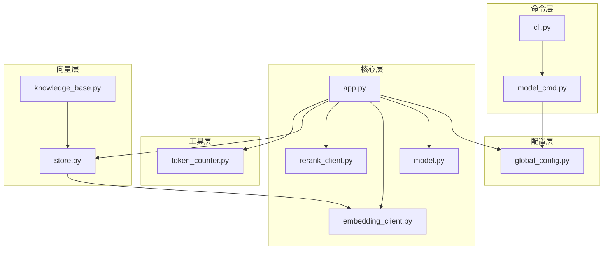
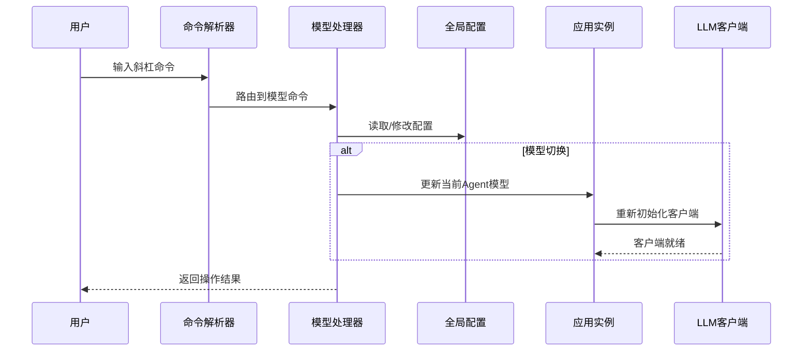
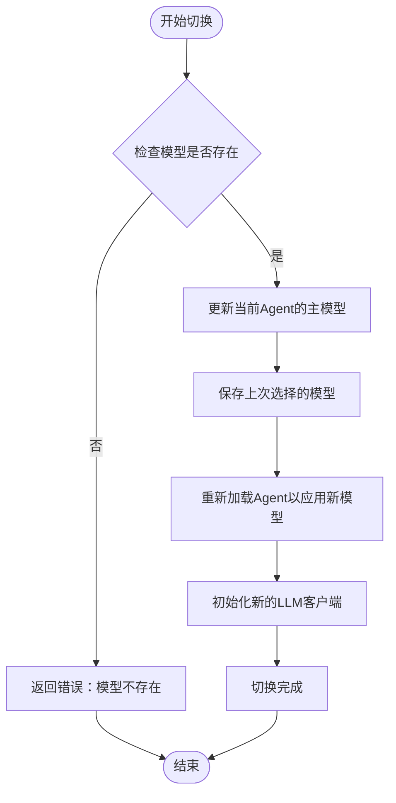
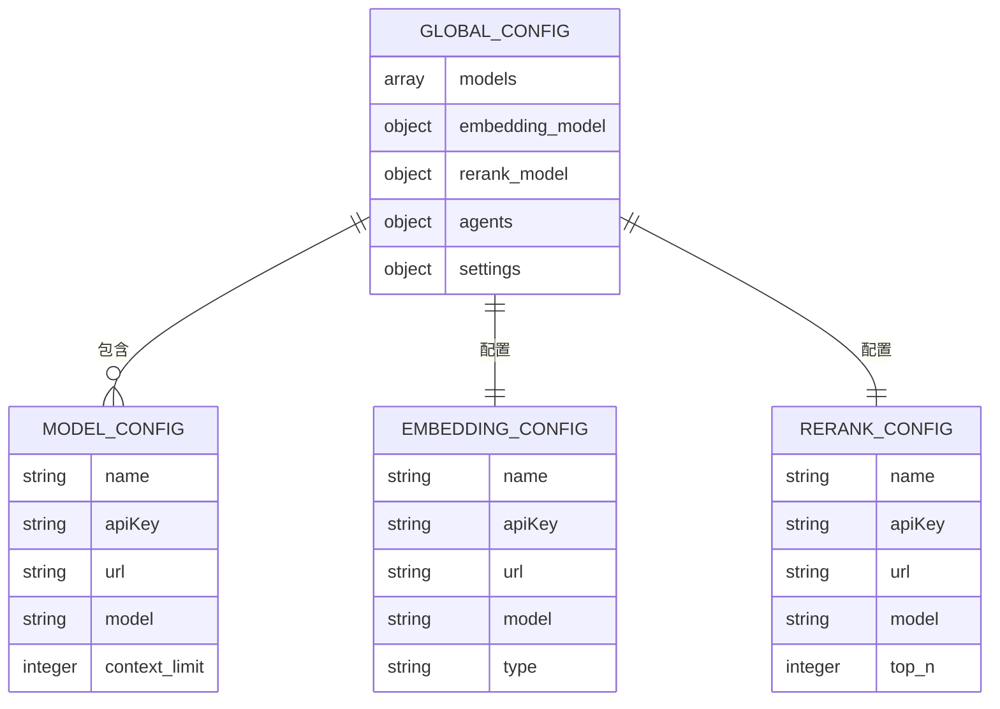
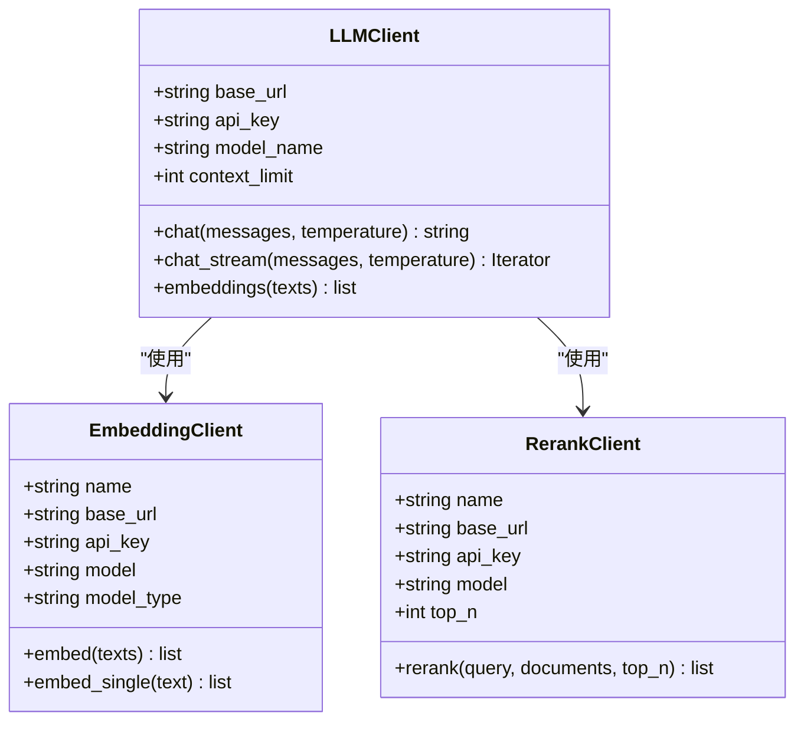
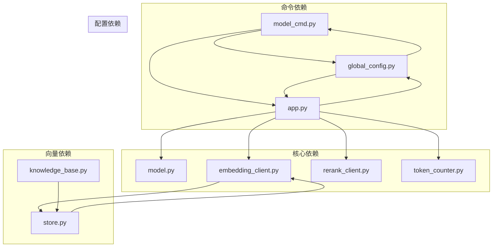

# 模型管理命令

<cite>
**本文档引用的文件**
- [model_cmd.py](file://cbhcli_pkg/commands/model_cmd.py)
- [global_config.py](file://cbhcli_pkg/config/global_config.py)
- [app.py](file://cbhcli_pkg/core/app.py)
- [model.py](file://cbhcli_pkg/core/model.py)
- [embedding_client.py](file://cbhcli_pkg/core/embedding_client.py)
- [rerank_client.py](file://cbhcli_pkg/core/rerank_client.py)
- [cli.py](file://cbhcli_pkg/cli.py)
- [README.md](file://README.md)
- [token_counter.py](file://cbhcli_pkg/context/token_counter.py)
- [store.py](file://cbhcli_pkg/vector/store.py)
- [knowledge_base.py](file://cbhcli_pkg/core/knowledge_base.py)
- [errors.py](file://cbhcli_pkg/core/errors.py)
</cite>

## 目录
1. [简介](#简介)
2. [项目结构](#项目结构)
3. [核心组件](#核心组件)
4. [架构概览](#架构概览)
5. [详细组件分析](#详细组件分析)
6. [依赖关系分析](#依赖关系分析)
7. [性能考量](#性能考量)
8. [故障排除指南](#故障排除指南)
9. [结论](#结论)
10. [附录](#附录)

## 简介
本文件为 CBHCLI 模型管理命令的详细参考文档，涵盖所有与模型配置相关的斜杠命令，包括 `/model add`、`/model switch`、`/model list`、`/model delete` 等命令的完整语法和参数说明。文档详细解释支持的模型类型和 API 提供商，包括 OpenAI、本地模型等不同选项；提供模型配置的最佳实践，包括 API 密钥管理、模型参数调优和性能优化建议；解释模型切换的工作机制和影响范围；包含模型可用性检查和连接测试的方法；提供多模型并存的管理策略和使用场景；解释模型费用估算和资源限制的考虑因素；并包含常见模型配置问题的解决方案。

## 项目结构
CBHCLI 采用模块化设计，模型管理功能主要分布在以下模块：
- 命令层：`cbhcli_pkg/commands/model_cmd.py` - 处理斜杠命令
- 配置层：`cbhcli_pkg/config/global_config.py` - 全局配置管理
- 核心层：`cbhcli_pkg/core/app.py` - 主应用逻辑
- 客户端层：`cbhcli_pkg/core/model.py`、`cbhcli_pkg/core/embedding_client.py`、`cbhcli_pkg/core/rerank_client.py` - API 客户端封装
- 工具层：`cbhcli_pkg/context/token_counter.py` - Token 计数
- 向量层：`cbhcli_pkg/vector/store.py` - 向量数据库封装

**图表来源**
- [model_cmd.py:1-371](file://cbhcli_pkg/commands/model_cmd.py#L1-L371)
- [global_config.py:1-154](file://cbhcli_pkg/config/global_config.py#L1-L154)
- [app.py:1-478](file://cbhcli_pkg/core/app.py#L1-L478)

**章节来源**
- [model_cmd.py:1-371](file://cbhcli_pkg/commands/model_cmd.py#L1-L371)
- [global_config.py:1-154](file://cbhcli_pkg/config/global_config.py#L1-L154)
- [app.py:1-478](file://cbhcli_pkg/core/app.py#L1-L478)

## 核心组件
模型管理功能由以下核心组件构成：

### 命令处理器
- `register_model_commands()` - 注册模型相关斜杠命令
- `_add_model()` - 添加新模型
- `_list_models()` - 列出所有模型
- `_use_model()` - 使用指定模型
- `_delete_model()` - 删除模型
- `_model_info()` - 查看当前模型信息

### 配置管理
- `GlobalConfig` - 全局配置管理类
- 支持模型、嵌入模型、重排序模型的增删改查
- 配置持久化到 `~/.cbhcli/config.json`

### API 客户端
- `LLMClient` - 统一的 LLM API 客户端
- `EmbeddingClient` - 嵌入模型客户端，支持多种 API
- `RerankClient` - 重排序客户端，支持 Jina、Cohere 等

**章节来源**
- [model_cmd.py:5-61](file://cbhcli_pkg/commands/model_cmd.py#L5-L61)
- [global_config.py:13-154](file://cbhcli_pkg/config/global_config.py#L13-L154)
- [model.py:7-147](file://cbhcli_pkg/core/model.py#L7-L147)
- [embedding_client.py:6-132](file://cbhcli_pkg/core/embedding_client.py#L6-L132)
- [rerank_client.py:6-123](file://cbhcli_pkg/core/rerank_client.py#L6-L123)

## 架构概览
模型管理系统采用分层架构，确保职责分离和可扩展性：

**图表来源**
- [model_cmd.py:9-54](file://cbhcli_pkg/commands/model_cmd.py#L9-L54)
- [app.py:231-279](file://cbhcli_pkg/core/app.py#L231-L279)

## 详细组件分析

### 模型命令系统

#### 基础命令
- `/model add` - 添加新模型
  - 参数：无
  - 交互：逐项输入模型名称、API Key、Base URL、模型ID、上下文长度限制
  - 结果：模型配置保存到全局配置

- `/model list` - 列出所有模型
  - 参数：无
  - 输出：显示所有已配置模型及其基本信息

- `/model use <name>` - 使用指定模型
  - 参数：模型名称
  - 行为：更新当前Agent的主模型，保存上次选择，重新加载Agent

- `/model delete <name>` - 删除模型
  - 参数：模型名称
  - 行为：从配置中移除指定模型

- `/model info` - 查看当前模型信息
  - 参数：无
  - 输出：显示当前Agent使用的模型详细信息

**章节来源**
- [model_cmd.py:8-54](file://cbhcli_pkg/commands/model_cmd.py#L8-L54)
- [model_cmd.py:64-156](file://cbhcli_pkg/commands/model_cmd.py#L64-L156)

#### 嵌入模型配置
- `/model embedding` - 嵌入模型配置菜单
  - 子命令：
    - `add` - 添加嵌入模型
    - `info` - 查看当前嵌入模型
    - `delete` - 删除嵌入模型

- 支持的嵌入模型类型：
  - OpenAI 兼容 API（如 `text-embedding-3-small`）
  - 通义千问 embedding
  - 其他 OpenAI 兼容的嵌入模型

**章节来源**
- [model_cmd.py:178-273](file://cbhcli_pkg/commands/model_cmd.py#L178-L273)
- [embedding_client.py:6-132](file://cbhcli_pkg/core/embedding_client.py#L6-L132)

#### 重排序模型配置
- `/model rerank` - 重排序模型配置菜单
  - 子命令：
    - `add` - 添加重排序模型
    - `info` - 查看当前重排序模型
    - `delete` - 删除重排序模型

- 支持的重排序模型：
  - Jina Reranker API
  - Cohere Rerank API
  - 通义千问 Rerank
  - 其他兼容 API

**章节来源**
- [model_cmd.py:275-371](file://cbhcli_pkg/commands/model_cmd.py#L275-L371)
- [rerank_client.py:6-123](file://cbhcli_pkg/core/rerank_client.py#L6-L123)

### 模型切换工作机制

**图表来源**
- [model_cmd.py:130-156](file://cbhcli_pkg/commands/model_cmd.py#L130-L156)
- [app.py:231-279](file://cbhcli_pkg/core/app.py#L231-L279)

**章节来源**
- [model_cmd.py:130-156](file://cbhcli_pkg/commands/model_cmd.py#L130-L156)
- [app.py:231-279](file://cbhcli_pkg/core/app.py#L231-L279)

### 配置数据结构

**图表来源**
- [global_config.py:31-48](file://cbhcli_pkg/config/global_config.py#L31-L48)
- [global_config.py:56-90](file://cbhcli_pkg/config/global_config.py#L56-L90)

**章节来源**
- [global_config.py:31-90](file://cbhcli_pkg/config/global_config.py#L31-L90)

### API 客户端架构

**图表来源**
- [model.py:7-147](file://cbhcli_pkg/core/model.py#L7-L147)
- [embedding_client.py:6-132](file://cbhcli_pkg/core/embedding_client.py#L6-L132)
- [rerank_client.py:6-123](file://cbhcli_pkg/core/rerank_client.py#L6-L123)

**章节来源**
- [model.py:7-147](file://cbhcli_pkg/core/model.py#L7-L147)
- [embedding_client.py:6-132](file://cbhcli_pkg/core/embedding_client.py#L6-L132)
- [rerank_client.py:6-123](file://cbhcli_pkg/core/rerank_client.py#L6-L123)

## 依赖关系分析

**图表来源**
- [model_cmd.py:1-371](file://cbhcli_pkg/commands/model_cmd.py#L1-L371)
- [app.py:1-478](file://cbhcli_pkg/core/app.py#L1-L478)
- [global_config.py:1-154](file://cbhcli_pkg/config/global_config.py#L1-L154)

**章节来源**
- [model_cmd.py:1-371](file://cbhcli_pkg/commands/model_cmd.py#L1-L371)
- [app.py:1-478](file://cbhcli_pkg/core/app.py#L1-L478)
- [global_config.py:1-154](file://cbhcli_pkg/config/global_config.py#L1-L154)

## 性能考量

### Token 计数优化
- 精确计数：使用 `tiktoken` 库进行精确的 Token 数量计算
- 估算计数：当 `tiktoken` 不可用时，使用字符统计进行估算
- 计数策略：每条消息有基础开销（约 4 tokens），用于角色等元数据

### 上下文管理
- 自动压缩：当接近模型上下文限制时自动压缩
- 压缩阈值：默认 80% 触发压缩
- 压缩策略：保留最早和最近的对话，压缩中间部分

### API 调用优化
- 批量处理：嵌入模型支持批量处理，减少 API 调用次数
- 超时控制：HTTP 请求设置合理的超时时间
- 错误处理：网络异常和 API 错误的优雅处理

**章节来源**
- [token_counter.py:14-88](file://cbhcli_pkg/context/token_counter.py#L14-L88)
- [model.py:28-147](file://cbhcli_pkg/core/model.py#L28-L147)
- [app.py:361-381](file://cbhcli_pkg/core/app.py#L361-L381)

## 故障排除指南

### 常见问题及解决方案

#### 模型配置问题
- **问题**：模型未配置
  - **症状**：提示 "当前Agent未配置模型"
  - **解决**：使用 `/model add` 添加模型配置

- **问题**：API Key 无效
  - **症状**：API 请求失败，状态码非 200
  - **解决**：检查 API Key 是否正确，确认权限设置

- **问题**：Base URL 错误
  - **症状**：网络连接超时或域名解析失败
  - **解决**：确认 Base URL 格式正确，网络连通性正常

#### 上下文限制问题
- **问题**：上下文接近上限
  - **症状**：出现自动压缩提示
  - **解决**：使用 `/comp` 手动压缩，或调整 `compression_ratio`

- **问题**：Token 计数不准确
  - **症状**：上下文使用显示异常
  - **解决**：安装 `tiktoken` 库以获得精确计数

#### 向量搜索问题
- **问题**：嵌入模型未配置
  - **症状**：向量搜索功能不可用
  - **解决**：使用 `/model embedding add` 配置嵌入模型

- **问题**：ChromaDB 未安装
  - **症状**：向量数据库初始化失败
  - **解决**：安装 `chromadb` 库

**章节来源**
- [app.py:410-420](file://cbhcli_pkg/core/app.py#L410-L420)
- [errors.py:4-32](file://cbhcli_pkg/core/errors.py#L4-L32)

### 连接测试方法
1. **模型连接测试**：使用 `/model info` 查看当前模型信息
2. **嵌入模型测试**：配置嵌入模型后，使用 `/model embedding info`
3. **重排序模型测试**：配置重排序模型后，使用 `/model rerank info`
4. **API 可用性检查**：检查网络连通性和 API Key 权限

## 结论
CBHCLI 的模型管理系统提供了完整的多模型支持能力，包括基础模型、嵌入模型和重排序模型的配置管理。系统采用模块化设计，职责清晰，易于扩展。通过合理的配置管理和性能优化策略，用户可以高效地管理多个模型，并根据不同的使用场景选择最适合的模型组合。

## 附录

### 命令参考表

| 命令 | 功能 | 语法 | 参数 |
|------|------|------|------|
| `/model add` | 添加新模型 | `/model add` | 无 |
| `/model list` | 列出所有模型 | `/model list` | 无 |
| `/model use <name>` | 使用指定模型 | `/model use <name>` | 模型名称 |
| `/model delete <name>` | 删除模型 | `/model delete <name>` | 模型名称 |
| `/model info` | 查看当前模型信息 | `/model info` | 无 |
| `/model embedding` | 嵌入模型配置 | `/model embedding [add|info|delete]` | 子命令 |
| `/model rerank` | 重排序模型配置 | `/model rerank [add|info|delete]` | 子命令 |

### 支持的模型类型

#### LLM 模型
- OpenAI 兼容模型（如 `gpt-4o`、`gpt-3.5-turbo`）
- 本地部署的 OpenAI 兼容 API
- 其他兼容的 Chat Completions API

#### 嵌入模型
- OpenAI 兼容嵌入模型（如 `text-embedding-3-small`）
- 通义千问 embedding
- 其他 OpenAI 兼容的嵌入 API

#### 重排序模型
- Jina Reranker API
- Cohere Rerank API
- 通义千问 Rerank
- 其他兼容的重排序 API

### 最佳实践建议

#### API 密钥管理
- 使用环境变量或安全的密钥管理服务
- 定期轮换 API Key
- 限制 API Key 的访问权限
- 在生产环境中使用 HTTPS

#### 模型参数调优
- 根据任务类型调整 temperature 参数
- 合理设置上下文长度限制
- 选择合适的模型以平衡成本和性能
- 定期评估模型效果并进行调整

#### 性能优化
- 启用自动上下文压缩
- 使用批量处理减少 API 调用
- 合理配置 Token 计数器
- 监控 API 使用量和成本

#### 多模型管理策略
- 为不同场景配置专门的模型
- 建立模型性能基准
- 实施模型版本管理
- 准备备用模型以防服务中断