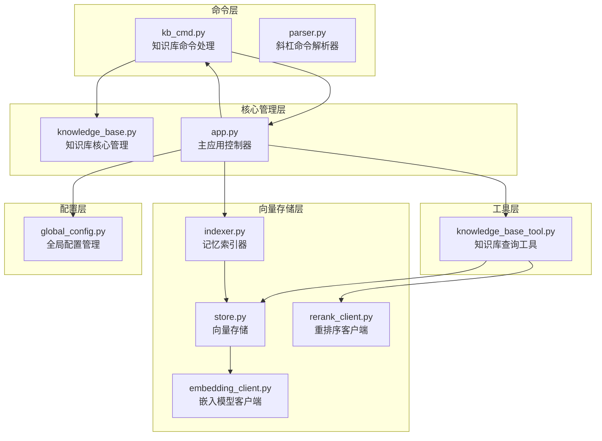
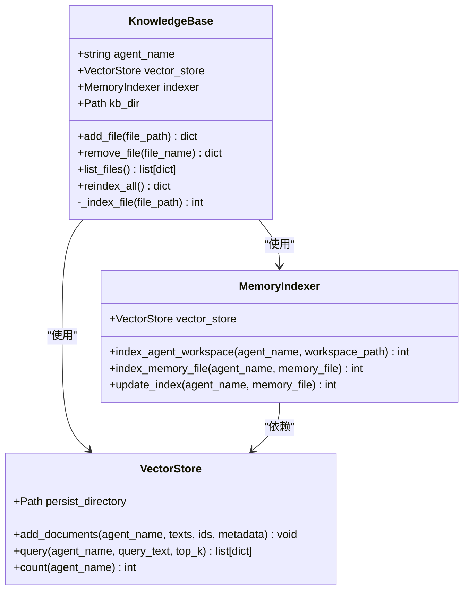
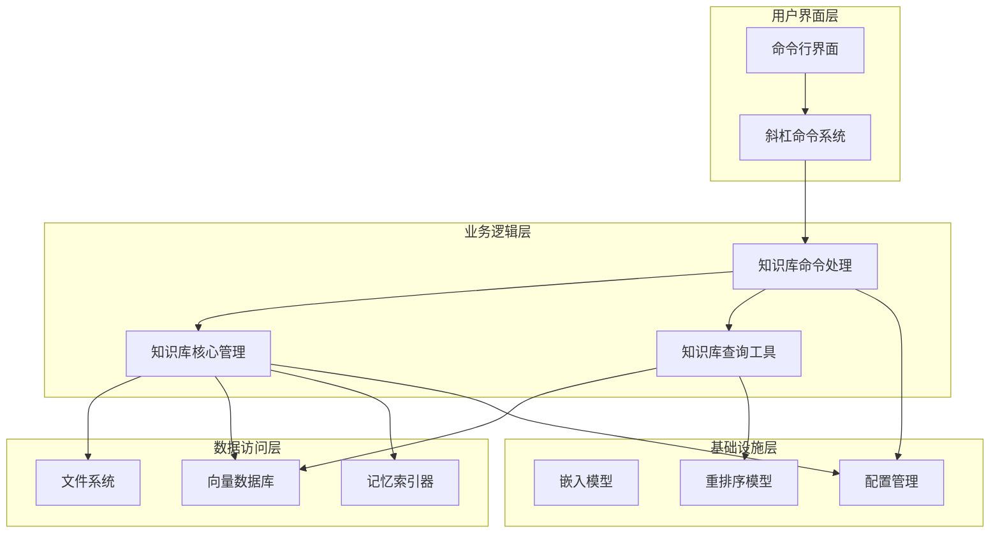
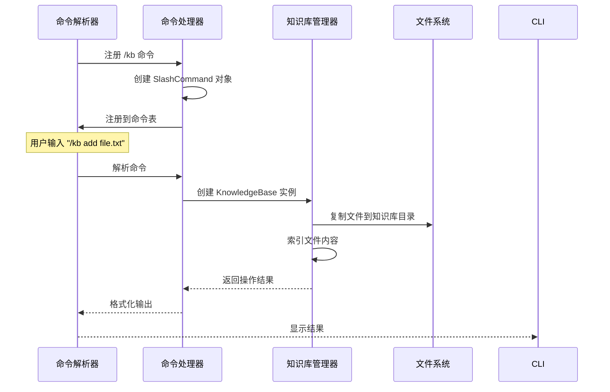
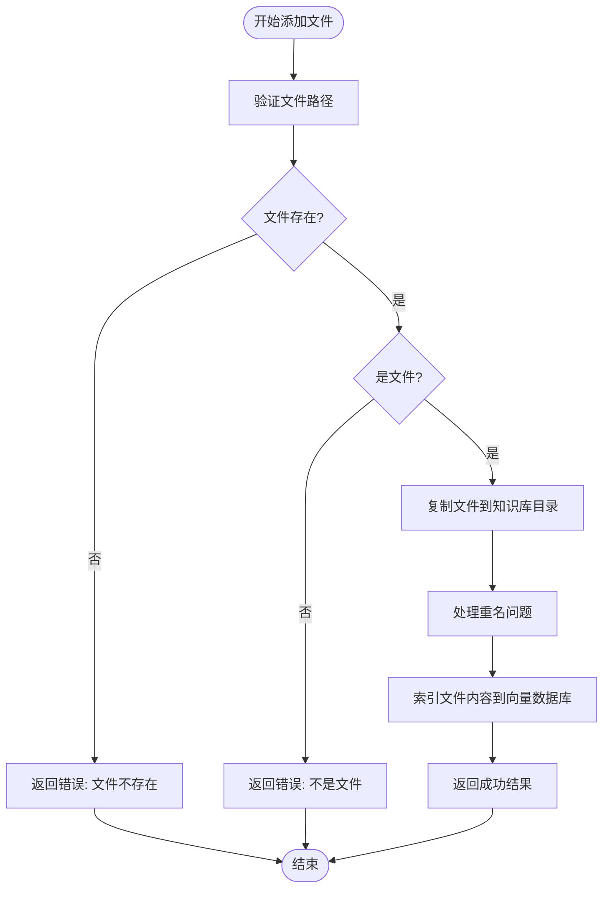
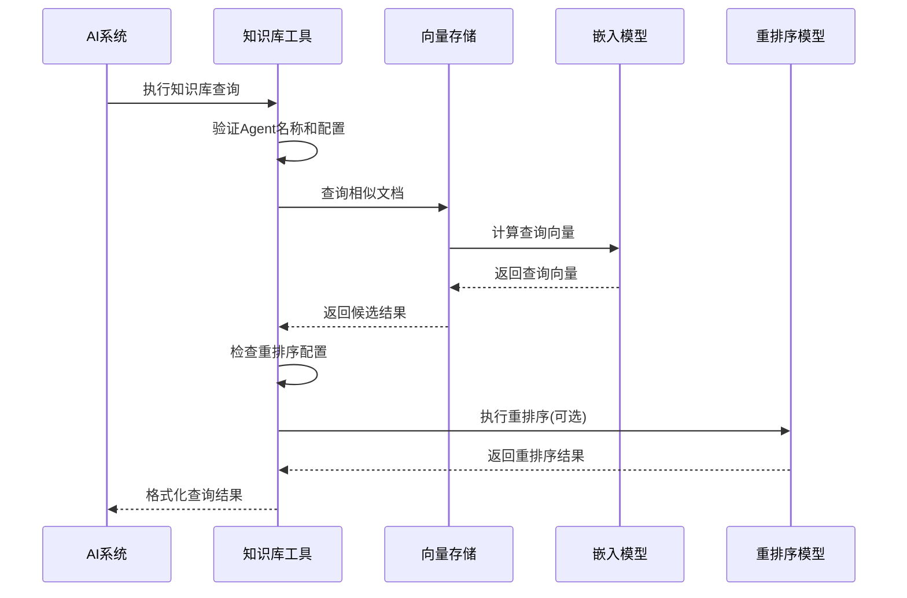
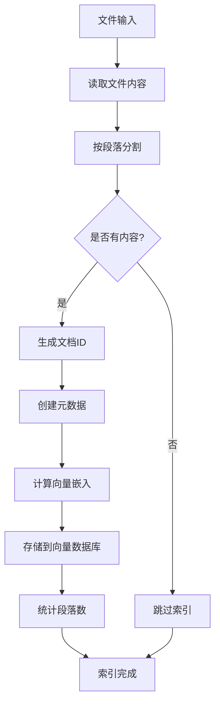
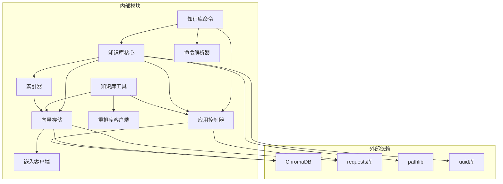

# 知识库管理命令

<cite>
**本文档引用的文件**
- [kb_cmd.py](file://cbhcli_pkg/commands/kb_cmd.py)
- [knowledge_base.py](file://cbhcli_pkg/core/knowledge_base.py)
- [knowledge_base_tool.py](file://cbhcli_pkg/tools/knowledge_base.py)
- [indexer.py](file://cbhcli_pkg/vector/indexer.py)
- [store.py](file://cbhcli_pkg/vector/store.py)
- [parser.py](file://cbhcli_pkg/commands/parser.py)
- [app.py](file://cbhcli_pkg/core/app.py)
- [embedding_client.py](file://cbhcli_pkg/core/embedding_client.py)
- [rerank_client.py](file://cbhcli_pkg/core/rerank_client.py)
- [global_config.py](file://cbhcli_pkg/config/global_config.py)
- [README.md](file://README.md)
</cite>

## 目录
1. [简介](#简介)
2. [项目结构](#项目结构)
3. [核心组件](#核心组件)
4. [架构概览](#架构概览)
5. [详细组件分析](#详细组件分析)
6. [依赖关系分析](#依赖关系分析)
7. [性能考虑](#性能考虑)
8. [故障排除指南](#故障排除指南)
9. [结论](#结论)

## 简介

CBHCLI 知识库管理系统是一个功能强大的 AI 驱动的知识管理解决方案，专为多 Agent 环境设计。该系统提供了完整的斜杠命令接口，支持文件管理、语义搜索、索引维护和智能查询等功能。

知识库系统的核心特性包括：
- **多 Agent 支持**：每个 Agent 拥有独立的知识库空间
- **语义搜索**：基于向量数据库的智能检索
- **批量文件管理**：支持多种文件格式的批量导入
- **智能索引**：自动分段和向量化处理
- **重排序优化**：支持高级重排序算法提升搜索质量

## 项目结构

知识库管理系统的文件组织遵循清晰的分层架构：



**图表来源**
- [kb_cmd.py:1-186](file://cbhcli_pkg/commands/kb_cmd.py#L1-L186)
- [knowledge_base.py:1-207](file://cbhcli_pkg/core/knowledge_base.py#L1-L207)
- [knowledge_base_tool.py:1-157](file://cbhcli_pkg/tools/knowledge_base.py#L1-L157)
- [indexer.py:1-178](file://cbhcli_pkg/vector/indexer.py#L1-L178)
- [store.py:1-175](file://cbhcli_pkg/vector/store.py#L1-L175)

**章节来源**
- [kb_cmd.py:1-186](file://cbhcli_pkg/commands/kb_cmd.py#L1-L186)
- [knowledge_base.py:1-207](file://cbhcli_pkg/core/knowledge_base.py#L1-L207)
- [knowledge_base_tool.py:1-157](file://cbhcli_pkg/tools/knowledge_base.py#L1-L157)
- [indexer.py:1-178](file://cbhcli_pkg/vector/indexer.py#L1-L178)
- [store.py:1-175](file://cbhcli_pkg/vector/store.py#L1-L175)

## 核心组件

### 知识库命令系统

知识库命令系统提供了完整的斜杠命令接口，支持以下主要操作：

| 命令 | 语法 | 描述 | 参数 |
|------|------|------|------|
| `/kb add` | `/kb add <file>` | 添加文件到知识库 | 文件路径 |
| `/kb list` | `/kb list` | 列出知识库中的文件 | 无 |
| `/kb remove` | `/kb remove <file>` | 从知识库删除文件 | 文件名 |
| `/kb reindex` | `/kb reindex` | 重新索引整个知识库 | 无 |
| `/kb status` | `/kb status` | 查看知识库状态 | 无 |

### 知识库核心管理

知识库核心管理类负责文件的生命周期管理：



**图表来源**
- [knowledge_base.py:7-207](file://cbhcli_pkg/core/knowledge_base.py#L7-L207)
- [store.py:37-175](file://cbhcli_pkg/vector/store.py#L37-L175)
- [indexer.py:7-178](file://cbhcli_pkg/vector/indexer.py#L7-L178)

**章节来源**
- [kb_cmd.py:57-186](file://cbhcli_pkg/commands/kb_cmd.py#L57-L186)
- [knowledge_base.py:31-207](file://cbhcli_pkg/core/knowledge_base.py#L31-L207)

## 架构概览

知识库系统的整体架构采用分层设计，确保了良好的可扩展性和维护性：



**图表来源**
- [app.py:54-478](file://cbhcli_pkg/core/app.py#L54-L478)
- [kb_cmd.py:5-54](file://cbhcli_pkg/commands/kb_cmd.py#L5-L54)
- [knowledge_base.py:16-29](file://cbhcli_pkg/core/knowledge_base.py#L16-L29)

## 详细组件分析

### 知识库命令处理

知识库命令处理模块实现了完整的斜杠命令解析和执行逻辑：

#### 命令注册机制



**图表来源**
- [kb_cmd.py:48-77](file://cbhcli_pkg/commands/kb_cmd.py#L48-L77)
- [parser.py:26-78](file://cbhcli_pkg/commands/parser.py#L26-L78)

#### 文件添加流程

文件添加操作包含完整的验证、复制和索引过程：



**图表来源**
- [knowledge_base.py:31-74](file://cbhcli_pkg/core/knowledge_base.py#L31-L74)

**章节来源**
- [kb_cmd.py:57-77](file://cbhcli_pkg/commands/kb_cmd.py#L57-L77)
- [knowledge_base.py:31-74](file://cbhcli_pkg/core/knowledge_base.py#L31-L74)

### 知识库查询系统

知识库查询系统提供了强大的语义搜索能力：

#### 查询执行流程



**图表来源**
- [knowledge_base_tool.py:49-122](file://cbhcli_pkg/tools/knowledge_base.py#L49-L122)
- [store.py:128-160](file://cbhcli_pkg/vector/store.py#L128-L160)

#### 支持的文件格式

知识库系统支持以下文件格式：

| 文件类型 | 扩展名 | 描述 |
|----------|--------|------|
| Markdown | `.md` | 结构化文档，支持标题和段落 |
| 纯文本 | `.txt` | 简单文本内容 |
| Python | `.py` | Python代码文档 |
| JavaScript | `.js` | JavaScript代码文档 |
| JSON | `.json` | 结构化数据文件 |
| YAML | `.yaml`, `.yml` | 配置文件格式 |

**章节来源**
- [knowledge_base.py:166-170](file://cbhcli_pkg/core/knowledge_base.py#L166-L170)
- [indexer.py:65-67](file://cbhcli_pkg/vector/indexer.py#L65-L67)

### 索引管理系统

索引管理系统负责将知识库内容转换为向量表示：

#### 索引工作流程



**图表来源**
- [knowledge_base.py:151-207](file://cbhcli_pkg/core/knowledge_base.py#L151-L207)
- [indexer.py:87-134](file://cbhcli_pkg/vector/indexer.py#L87-L134)

**章节来源**
- [knowledge_base.py:151-207](file://cbhcli_pkg/core/knowledge_base.py#L151-L207)
- [indexer.py:87-134](file://cbhcli_pkg/vector/indexer.py#L87-L134)

## 依赖关系分析

知识库系统的依赖关系体现了清晰的分层架构：



**图表来源**
- [store.py:67-77](file://cbhcli_pkg/vector/store.py#L67-L77)
- [app.py:39-44](file://cbhcli_pkg/core/app.py#L39-L44)

**章节来源**
- [app.py:39-44](file://cbhcli_pkg/core/app.py#L39-L44)
- [store.py:67-77](file://cbhcli_pkg/vector/store.py#L67-L77)

## 性能考虑

### 索引性能优化

知识库系统在设计时充分考虑了性能优化：

#### 向量化处理优化

- **批量嵌入计算**：使用嵌入客户端的批量处理功能，减少 API 调用次数
- **预计算向量**：在添加文档前预先计算所有文本的向量，避免向量数据库的默认模型调用
- **内存管理**：合理控制批量大小，平衡内存使用和处理效率

#### 查询性能优化

- **向量缓存**：向量存储使用持久化客户端，避免重复初始化
- **索引优化**：使用 ChromaDB 的高效索引机制
- **结果过滤**：支持 top_k 参数限制返回结果数量

### 存储空间控制

系统提供了多种方式来控制索引大小：

- **文件大小限制**：单个文件的最大处理大小
- **段落数限制**：每个文件的段落数量限制
- **集合清理**：定期清理不需要的索引集合

**章节来源**
- [store.py:118-126](file://cbhcli_pkg/vector/store.py#L118-L126)
- [store.py:142-149](file://cbhcli_pkg/vector/store.py#L142-L149)

## 故障排除指南

### 常见问题及解决方案

#### 知识库命令执行失败

**问题**：`/kb add` 命令执行失败
**可能原因**：
- 未选择 Agent
- 文件路径无效
- 权限不足

**解决方案**：
1. 确保已选择正确的 Agent：`/agent switch <agent_name>`
2. 检查文件路径是否正确
3. 确认有足够的磁盘空间

#### 向量数据库连接问题

**问题**：知识库查询失败
**可能原因**：
- ChromaDB 未安装
- 嵌入模型配置错误
- 网络连接问题

**解决方案**：
1. 安装 ChromaDB：`pip install chromadb`
2. 配置嵌入模型：`/model embedding add`
3. 检查网络连接和 API 密钥

#### 索引更新问题

**问题**：文件更新后搜索结果不准确
**解决方案**：
1. 手动重新索引：`/kb reindex`
2. 检查文件格式是否受支持
3. 验证嵌入模型配置

### 数据恢复方法

#### 知识库备份

知识库数据位于用户主目录的隐藏文件夹中：

```bash
# 备份知识库
cp -r ~/.cbhcli/agents/<agent_name>/knowledge ~/backup/knowledge_<timestamp>

# 备份整个Agent工作空间
cp -r ~/.cbhcli/agents/<agent_name> ~/backup/agent_<agent_name>_<timestamp>
```

#### 知识库恢复

```bash
# 恢复知识库
rm -rf ~/.cbhcli/agents/<agent_name>/knowledge
cp -r ~/backup/knowledge_<timestamp> ~/.cbhcli/agents/<agent_name>/knowledge

# 重新索引
/kb reindex
```

**章节来源**
- [kb_cmd.py:147-186](file://cbhcli_pkg/commands/kb_cmd.py#L147-L186)
- [knowledge_base.py:28](file://cbhcli_pkg/core/knowledge_base.py#L28)

## 结论

CBHCLI 知识库管理系统提供了一个完整、高效的知识管理解决方案。通过清晰的分层架构、强大的语义搜索能力和灵活的配置选项，该系统能够满足各种知识管理需求。

### 主要优势

1. **多 Agent 支持**：每个 Agent 拥有独立的知识库空间
2. **语义搜索**：基于向量数据库的智能检索
3. **灵活配置**：支持多种嵌入模型和重排序算法
4. **易于使用**：直观的斜杠命令接口
5. **高性能**：优化的索引和查询机制

### 未来发展方向

- **增量索引**：实现更高效的增量更新机制
- **多模态支持**：扩展对图片、音频等多媒体文件的支持
- **智能分类**：自动对知识内容进行分类和标签化
- **协作功能**：支持多用户共享和协作编辑

该系统为开发者和研究人员提供了一个强大而易用的知识管理平台，能够有效提升知识获取和利用的效率。