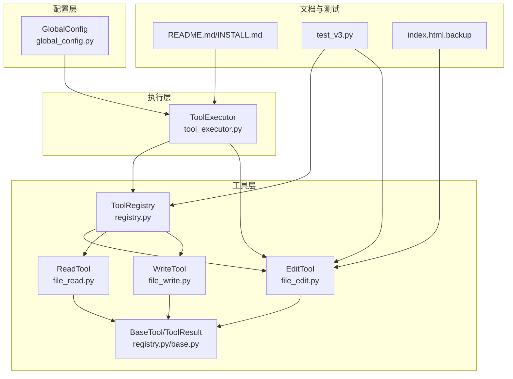
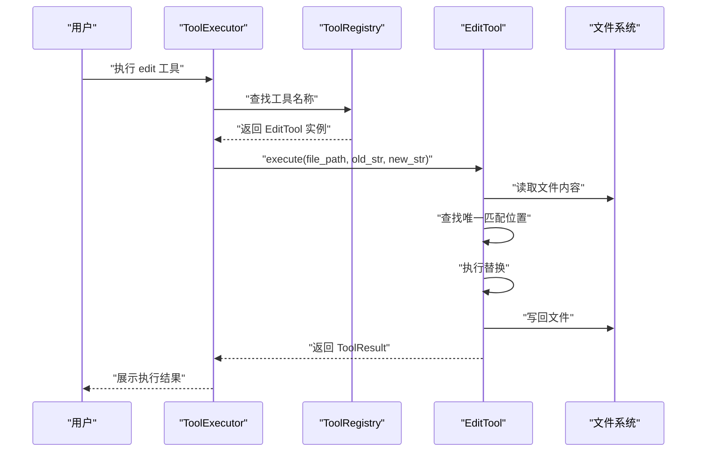
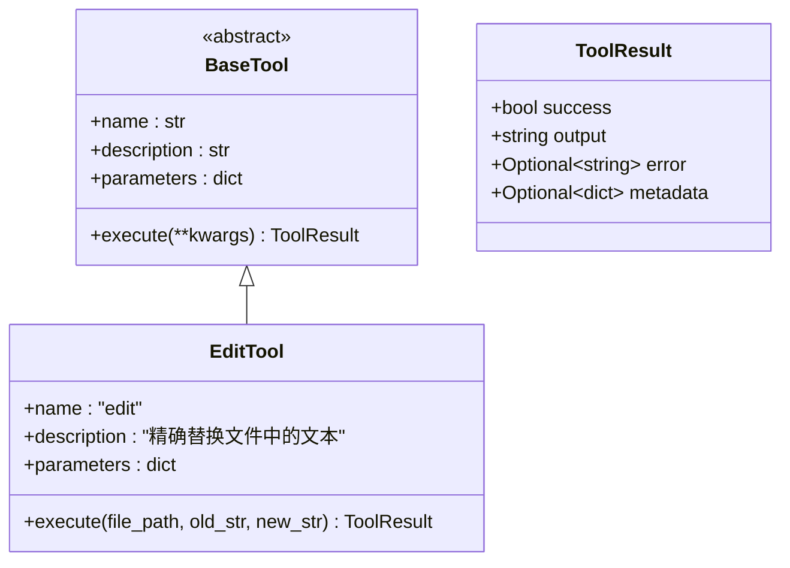
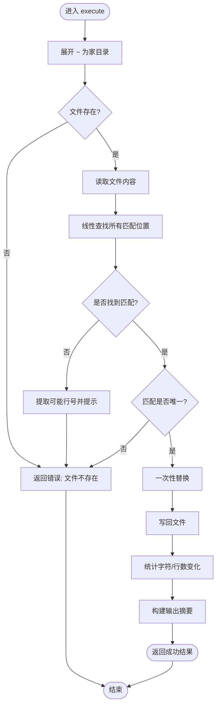
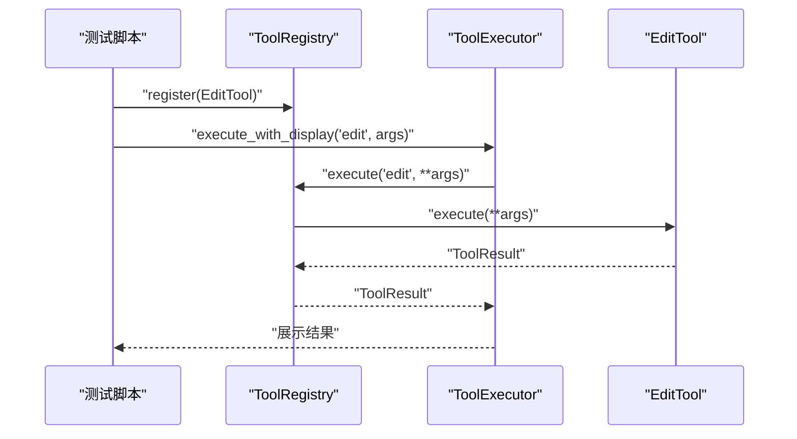
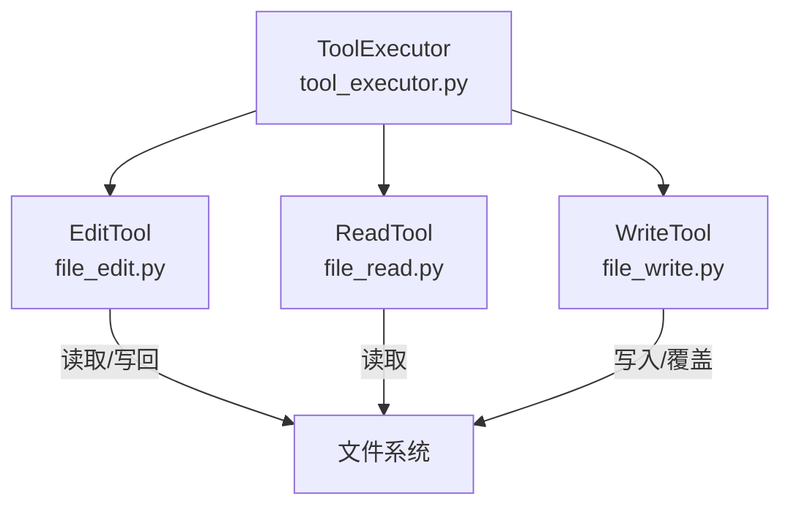
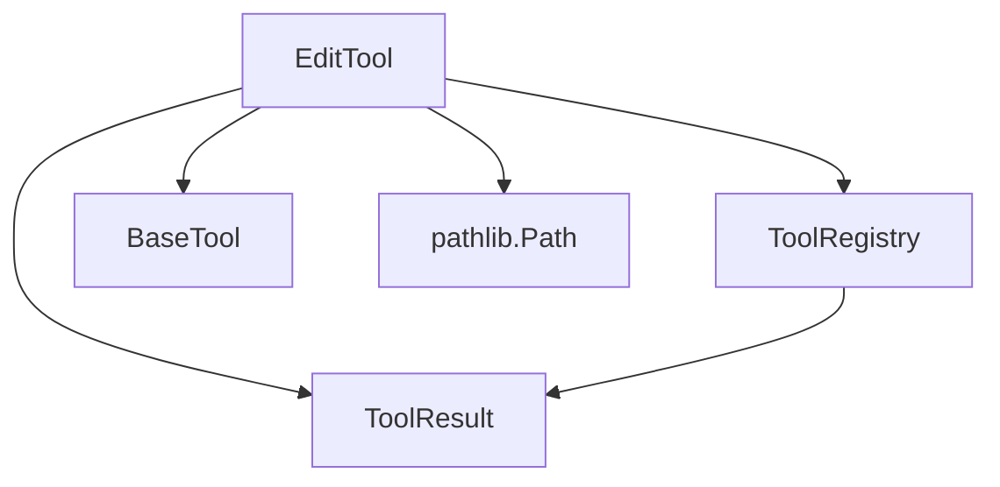

# FileEditTool 文件编辑工具

<cite>
**本文档引用的文件**
- [file_edit.py](file://cbhcli_pkg/tools/file_edit.py)
- [registry.py](file://cbhcli_pkg/tools/registry.py)
- [base.py](file://cbhcli_pkg/tools/base.py)
- [file_read.py](file://cbhcli_pkg/tools/file_read.py)
- [file_write.py](file://cbhcli_pkg/tools/file_write.py)
- [tool_executor.py](file://cbhcli_pkg/core/tool_executor.py)
- [global_config.py](file://cbhcli_pkg/config/global_config.py)
- [README.md](file://README.md)
- [INSTALL.md](file://INSTALL.md)
- [test_v3.py](file://test_v3.py)
- [index.html.backup](file://test/test2/index.html.backup)
</cite>

## 目录
1. [简介](#简介)
2. [项目结构](#项目结构)
3. [核心组件](#核心组件)
4. [架构总览](#架构总览)
5. [详细组件分析](#详细组件分析)
6. [依赖分析](#依赖分析)
7. [性能考量](#性能考量)
8. [故障排除指南](#故障排除指南)
9. [结论](#结论)
10. [附录](#附录)

## 简介
FileEditTool 是 CBHCLI v3.0 中的一个精确字符串替换工具，专为在文件中进行唯一匹配的文本替换而设计。该工具支持以下特性：
- 精确字符串替换：确保被替换的文本在文件中具有唯一性，避免误替换
- 参数验证与错误提示：提供详细的错误信息，包括可能的匹配行号
- 统计输出：报告字符数变化和行数变化
- 与工具注册中心集成：统一的工具管理与执行框架
- 与会话执行器集成：支持交互式确认与详细输出模式

重要说明：当前版本的 FileEditTool 仅支持精确字符串替换，不包含正则表达式支持与自动备份机制。备份与回滚能力可通过外部手段（如版本控制系统）实现。

## 项目结构
FileEditTool 位于工具模块中，与其它工具（读取、写入、终端等）共同构成 CBHCLI 的工具体系。其主要文件组织如下：
- 工具层：file_edit.py 实现精确字符串替换逻辑
- 注册中心：registry.py 提供工具注册、执行与描述聚合
- 基类与结果：base.py 与 registry.py 中的 ToolResult 定义工具接口与返回结构
- 工具执行器：tool_executor.py 负责工具调用前确认、执行与结果展示
- 配置管理：global_config.py 提供全局配置读取与保存
- 文档与安装：README.md 与 INSTALL.md 提供使用说明与安装指南
- 测试：test_v3.py 展示工具注册与执行流程

**图表来源**
- [file_edit.py:1-134](file://cbhcli_pkg/tools/file_edit.py#L1-L134)
- [registry.py:1-115](file://cbhcli_pkg/tools/registry.py#L1-L115)
- [base.py:1-3](file://cbhcli_pkg/tools/base.py#L1-L3)
- [file_read.py:1-125](file://cbhcli_pkg/tools/file_read.py#L1-L125)
- [file_write.py:1-83](file://cbhcli_pkg/tools/file_write.py#L1-L83)
- [tool_executor.py:1-168](file://cbhcli_pkg/core/tool_executor.py#L1-L168)
- [global_config.py:1-154](file://cbhcli_pkg/config/global_config.py#L1-L154)
- [README.md:1-325](file://README.md#L1-L325)
- [INSTALL.md:1-69](file://INSTALL.md#L1-L69)
- [test_v3.py:22-60](file://test_v3.py#L22-L60)
- [index.html.backup:1-415](file://test/test2/index.html.backup#L1-L415)

**章节来源**
- [README.md:269-295](file://README.md#L269-L295)
- [INSTALL.md:1-69](file://INSTALL.md#L1-L69)

## 核心组件
- EditTool（file_edit.py）：实现精确字符串替换的核心工具，负责参数解析、唯一性校验、替换执行与统计输出
- ToolRegistry（registry.py）：工具注册中心，提供工具注册、查找、执行与描述聚合
- ToolExecutor（tool_executor.py）：工具执行器，负责工具调用前确认、执行与结果展示
- ToolResult（registry.py）：工具执行结果的数据结构，包含成功标志、输出与错误信息
- BaseTool（registry.py/base.py）：工具抽象基类，定义工具名称、描述、参数与执行方法

**章节来源**
- [file_edit.py:6-134](file://cbhcli_pkg/tools/file_edit.py#L6-L134)
- [registry.py:16-115](file://cbhcli_pkg/tools/registry.py#L16-L115)
- [base.py:1-3](file://cbhcli_pkg/tools/base.py#L1-L3)
- [tool_executor.py:15-168](file://cbhcli_pkg/core/tool_executor.py#L15-L168)

## 架构总览
FileEditTool 的执行流程遵循 CBHCLI 的工具体系：工具注册 → 工具执行器确认 → 注册中心调度 → 工具执行 → 结果返回与展示。

**图表来源**
- [tool_executor.py:42-91](file://cbhcli_pkg/core/tool_executor.py#L42-L91)
- [registry.py:70-96](file://cbhcli_pkg/tools/registry.py#L70-L96)
- [file_edit.py:38-134](file://cbhcli_pkg/tools/file_edit.py#L38-L134)

## 详细组件分析

### EditTool 组件分析
EditTool 是精确字符串替换的核心实现，具备以下关键特性：
- 参数定义：file_path、old_str、new_str 三要素，其中 old_str 必须在文件中唯一出现
- 文件展开：支持 ~ 表示家目录的路径展开
- 唯一性校验：通过线性扫描查找所有匹配位置，若无匹配则提供可能的行号建议；若匹配数大于1则拒绝执行
- 替换执行：使用一次性替换，避免递归替换导致的重复匹配
- 统计输出：计算新增与删除的行数，生成简洁的执行摘要

**图表来源**
- [registry.py:16-49](file://cbhcli_pkg/tools/registry.py#L16-L49)
- [file_edit.py:6-36](file://cbhcli_pkg/tools/file_edit.py#L6-L36)

**图表来源**
- [file_edit.py:38-134](file://cbhcli_pkg/tools/file_edit.py#L38-L134)

**章节来源**
- [file_edit.py:38-134](file://cbhcli_pkg/tools/file_edit.py#L38-L134)

### 工具注册与执行流程
- 工具注册：在测试中通过 ToolRegistry.register 将 EditTool 注册为 "edit"
- 工具执行：ToolExecutor.execute_with_display 负责显示工具调用、用户确认、执行与结果展示
- 结果格式化：ToolExecutor 根据 verbose 模式决定输出长度与详细程度

**图表来源**
- [test_v3.py:28-59](file://test_v3.py#L28-L59)
- [tool_executor.py:42-91](file://cbhcli_pkg/core/tool_executor.py#L42-L91)
- [registry.py:70-96](file://cbhcli_pkg/tools/registry.py#L70-L96)

**章节来源**
- [test_v3.py:22-60](file://test_v3.py#L22-L60)
- [tool_executor.py:54-160](file://cbhcli_pkg/core/tool_executor.py#L54-L160)
- [registry.py:51-115](file://cbhcli_pkg/tools/registry.py#L51-L115)

### 与其他工具的关系
- ReadTool：用于读取文件内容，便于在执行替换前预览目标文件
- WriteTool：用于创建或覆盖文件，与 EditTool 的一次性替换形成互补
- ToolExecutor：统一管理工具调用的确认与输出展示

**图表来源**
- [file_edit.py:38-134](file://cbhcli_pkg/tools/file_edit.py#L38-L134)
- [file_read.py:38-125](file://cbhcli_pkg/tools/file_read.py#L38-L125)
- [file_write.py:34-83](file://cbhcli_pkg/tools/file_write.py#L34-L83)
- [tool_executor.py:42-91](file://cbhcli_pkg/core/tool_executor.py#L42-L91)

**章节来源**
- [file_read.py:6-125](file://cbhcli_pkg/tools/file_read.py#L6-L125)
- [file_write.py:6-83](file://cbhcli_pkg/tools/file_write.py#L6-L83)

## 依赖分析
- 内部依赖
  - EditTool 依赖 ToolRegistry 与 ToolResult
  - ToolExecutor 依赖 ToolRegistry 以执行工具
  - BaseTool 为抽象基类，被 EditTool 继承
- 外部依赖
  - pathlib.Path 用于路径解析与家目录展开
  - UTF-8 编码读写文件

**图表来源**
- [file_edit.py:2-3](file://cbhcli_pkg/tools/file_edit.py#L2-L3)
- [registry.py:2-4](file://cbhcli_pkg/tools/registry.py#L2-L4)
- [base.py:1-3](file://cbhcli_pkg/tools/base.py#L1-L3)

**章节来源**
- [file_edit.py:1-134](file://cbhcli_pkg/tools/file_edit.py#L1-L134)
- [registry.py:1-115](file://cbhcli_pkg/tools/registry.py#L1-L115)
- [base.py:1-3](file://cbhcli_pkg/tools/base.py#L1-L3)

## 性能考量
- 时间复杂度
  - 线性扫描查找匹配：O(n)，n 为文件字符数
  - 一次性替换：O(n)
  - 整体为 O(n)，适合大多数文本文件
- 空间复杂度
  - 读取整文件到内存：O(n)
  - 匹配位置收集：O(k)，k 为匹配次数
- I/O 注意事项
  - 大文件建议分块处理或使用流式读写，避免内存峰值过高
  - 替换后写回文件为一次性写入，建议在执行前确保磁盘空间充足

[本节为通用性能指导，不直接分析具体文件，故无章节来源]

## 故障排除指南
- 文件不存在
  - 现象：返回错误信息，提示文件不存在
  - 排查：确认 file_path 是否正确，路径是否包含 ~
- 未找到匹配文本
  - 现象：返回错误信息，并提供可能的行号建议
  - 排查：检查 old_str 是否完整且唯一；可使用 ReadTool 预览文件内容
- 匹配不唯一
  - 现象：返回错误信息，提示 old_str 必须唯一
  - 排查：增加上下文使 old_str 唯一；或改用正则表达式（当前版本不支持）
- 编码问题
  - 现象：读取文件时报编码错误
  - 排查：确认文件为 UTF-8 编码；或使用外部工具转换编码
- 权限问题
  - 现象：写回文件失败
  - 排查：检查目标文件权限与磁盘空间

**章节来源**
- [file_edit.py:54-134](file://cbhcli_pkg/tools/file_edit.py#L54-L134)
- [file_read.py:113-125](file://cbhcli_pkg/tools/file_read.py#L113-L125)

## 结论
FileEditTool 提供了精确、可靠的字符串替换能力，强调唯一性与安全性，适合在受控环境下进行小规模文本修改。当前版本未包含正则表达式与自动备份功能，建议结合版本控制系统或外部备份策略使用。通过 ToolExecutor 与 ToolRegistry 的集成，工具具备良好的可扩展性与可维护性。

[本节为总结性内容，不直接分析具体文件，故无章节来源]

## 附录

### 参数配置与使用示例
- 工具名称：edit
- 参数定义
  - file_path：目标文件路径（支持 ~ 表示家目录）
  - old_str：要替换的原始文本（必须唯一）
  - new_str：替换后的新文本
- 返回值：ToolResult，包含 success、output、error 与可选 metadata

**章节来源**
- [file_edit.py:18-36](file://cbhcli_pkg/tools/file_edit.py#L18-L36)
- [registry.py:7-14](file://cbhcli_pkg/tools/registry.py#L7-L14)

### 编辑操作流程
- 使用 ReadTool 预览文件内容与行号
- 确定 old_str 的唯一性与上下文
- 通过 ToolExecutor 执行 edit 工具
- 查看输出摘要，确认字符/行数变化

**章节来源**
- [file_read.py:38-125](file://cbhcli_pkg/tools/file_read.py#L38-L125)
- [tool_executor.py:54-160](file://cbhcli_pkg/core/tool_executor.py#L54-L160)

### 版本控制策略建议
- 在执行批量或高风险替换前，使用版本控制系统（如 Git）创建快照
- 对关键配置文件与代码文件，建议在 CI/CD 流程中进行自动化测试与回滚预案
- 结合备份文件（如 .backup 扩展名）进行人工核验后再提交

**章节来源**
- [index.html.backup:1-415](file://test/test2/index.html.backup#L1-L415)

### 高级编辑技巧
- 使用 ReadTool 的行范围参数进行局部预览，减少误判
- 在复杂替换场景下，先在测试文件上验证替换逻辑
- 对长文本替换，优先使用更具体的上下文片段以确保唯一性

**章节来源**
- [file_read.py:18-36](file://cbhcli_pkg/tools/file_read.py#L18-L36)

### 安全考虑
- 严格验证 old_str 的唯一性，避免跨文件误替换
- 对敏感文件（如配置文件、密钥文件）谨慎使用批量替换
- 在生产环境中，建议通过双人审查与版本控制回滚机制保障安全

[本节为通用安全指导，不直接分析具体文件，故无章节来源]