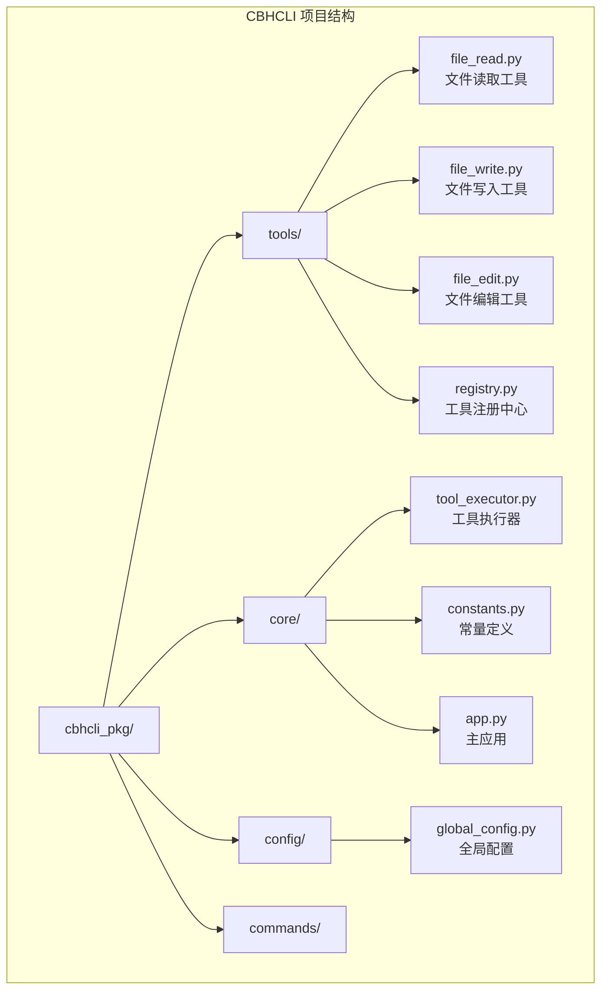
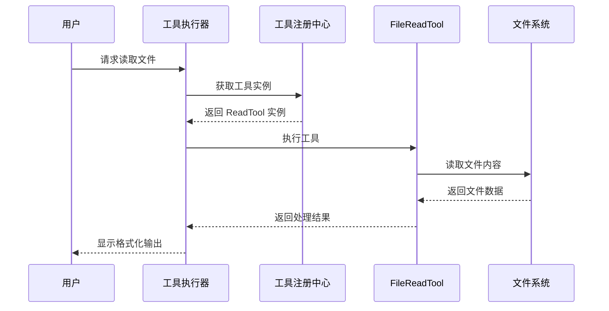
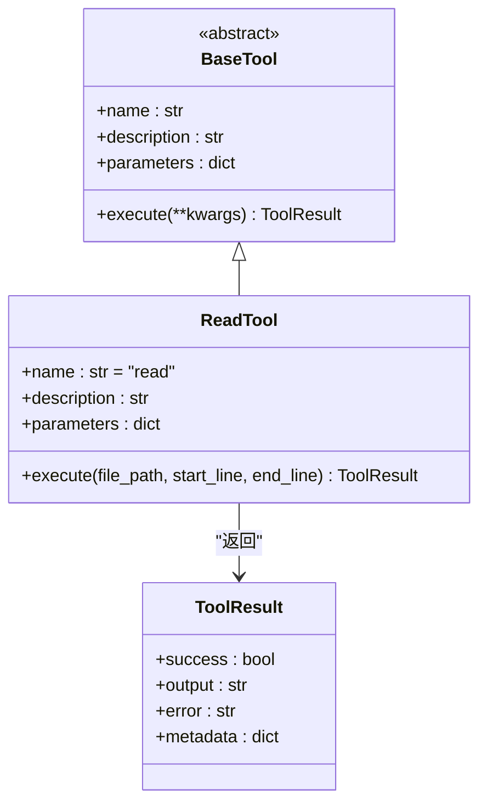
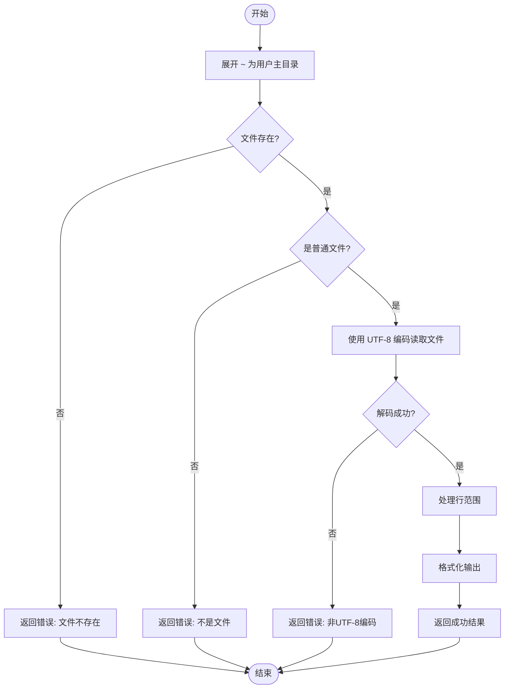
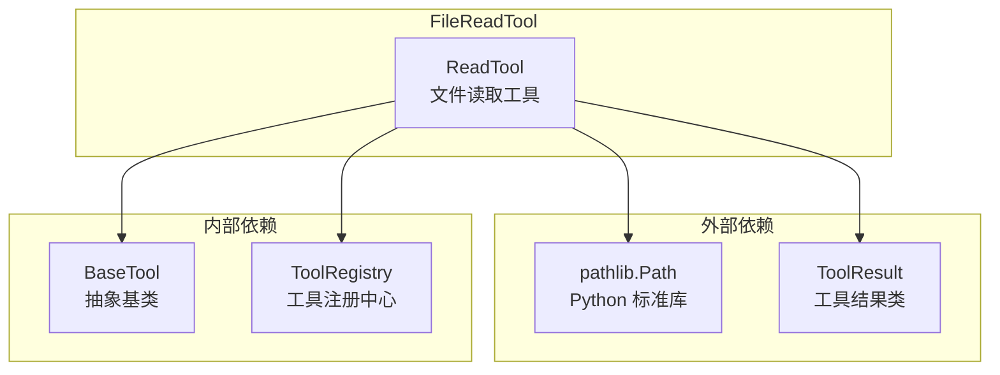

# FileReadTool 文件读取工具

<cite>
**本文档引用的文件**
- [file_read.py](file://cbhcli_pkg/tools/file_read.py)
- [registry.py](file://cbhcli_pkg/tools/registry.py)
- [base.py](file://cbhcli_pkg/tools/base.py)
- [tool_executor.py](file://cbhcli_pkg/core/tool_executor.py)
- [constants.py](file://cbhcli_pkg/core/constants.py)
- [global_config.py](file://cbhcli_pkg/config/global_config.py)
- [test_v3.py](file://test_v3.py)
- [README.md](file://README.md)
</cite>

## 目录
1. [简介](#简介)
2. [项目结构](#项目结构)
3. [核心组件](#核心组件)
4. [架构概览](#架构概览)
5. [详细组件分析](#详细组件分析)
6. [依赖关系分析](#依赖关系分析)
7. [性能考虑](#性能考虑)
8. [故障排除指南](#故障排除指南)
9. [结论](#结论)
10. [附录](#附录)

## 简介

FileReadTool 是 CBHCLI v3.0 中的一个重要工具组件，专门负责文件内容的读取和展示。该工具提供了完整的文件读取功能，包括文件路径验证、编码处理、行范围选择和格式化输出等特性。

CBHCLI 是一个功能强大的 AI 驱动终端助手，支持多 Agent 管理、工具调用、知识库和会话管理。FileReadTool 作为其中的核心工具之一，为用户提供了一个安全、可靠的文件读取解决方案。

## 项目结构

CBHCLI 采用模块化的项目结构设计，FileReadTool 位于工具模块中，与其它工具形成统一的工具生态系统。



**图表来源**
- [README.md:269-295](file://README.md#L269-L295)
- [file_read.py:1-125](file://cbhcli_pkg/tools/file_read.py#L1-L125)

**章节来源**
- [README.md:269-295](file://README.md#L269-L295)
- [file_read.py:1-125](file://cbhcli_pkg/tools/file_read.py#L1-L125)

## 核心组件

FileReadTool 的核心实现基于统一的工具架构，具有以下关键特性：

### 工具接口规范
- **名称**: read
- **描述**: 读取文件内容，支持指定行范围
- **参数**: file_path（必需）、start_line（可选）、end_line（可选）

### 编码处理机制
- 默认使用 UTF-8 编码进行文件读取
- 自动处理 ~ 符号表示的用户主目录
- 提供 Unicode 解码错误的专门处理

### 安全验证机制
- 文件存在性检查
- 文件类型验证（仅允许普通文件）
- 路径规范化处理

**章节来源**
- [file_read.py:17-36](file://cbhcli_pkg/tools/file_read.py#L17-L36)
- [file_read.py:51-69](file://cbhcli_pkg/tools/file_read.py#L51-L69)

## 架构概览

FileReadTool 在 CBHCLI 整体架构中扮演着重要的角色，通过统一的工具注册中心进行管理和调度。



**图表来源**
- [tool_executor.py:42-91](file://cbhcli_pkg/core/tool_executor.py#L42-L91)
- [registry.py:70-96](file://cbhcli_pkg/tools/registry.py#L70-L96)
- [file_read.py:38-124](file://cbhcli_pkg/tools/file_read.py#L38-L124)

## 详细组件分析

### FileReadTool 类结构



**图表来源**
- [registry.py:16-48](file://cbhcli_pkg/tools/registry.py#L16-L48)
- [file_read.py:6-124](file://cbhcli_pkg/tools/file_read.py#L6-L124)

### 参数配置系统

FileReadTool 采用 JSON Schema 定义参数规范，确保参数验证的一致性和可靠性。

| 参数名 | 类型 | 必需 | 描述 | 默认值 |
|--------|------|------|------|--------|
| file_path | string | 是 | 要读取的文件路径 | - |
| start_line | integer | 否 | 起始行号（从1开始） | None |
| end_line | integer | 否 | 结束行号 | None |

### 文件路径验证流程



**图表来源**
- [file_read.py:51-124](file://cbhcli_pkg/tools/file_read.py#L51-L124)

### 编码检测与字符集转换

FileReadTool 采用 UTF-8 编码进行文件读取，提供专门的错误处理机制：

1. **默认编码**: UTF-8
2. **错误处理**: 捕获 UnicodeDecodeError 异常
3. **错误响应**: 返回清晰的错误信息，指示文件不是 UTF-8 编码

### 大文件处理策略

虽然 FileReadTool 支持大文件读取，但需要注意以下限制：

- **内存使用**: 文件内容一次性加载到内存中
- **性能考虑**: 对于超大文件，建议使用行范围参数限制读取范围
- **输出控制**: 工具执行器对输出长度有限制（见常量定义）

**章节来源**
- [file_read.py:71-124](file://cbhcli_pkg/tools/file_read.py#L71-L124)
- [constants.py:13-16](file://cbhcli_pkg/core/constants.py#L13-L16)

## 依赖关系分析

FileReadTool 的依赖关系相对简单，主要依赖于工具注册中心和基础工具类。



**图表来源**
- [file_read.py:2-3](file://cbhcli_pkg/tools/file_read.py#L2-L3)
- [registry.py:16-48](file://cbhcli_pkg/tools/registry.py#L16-L48)

### 关键依赖说明

1. **pathlib.Path**: 用于文件路径操作和验证
2. **ToolResult**: 统一的工具执行结果格式
3. **BaseTool**: 工具接口规范
4. **ToolRegistry**: 工具注册和管理

**章节来源**
- [file_read.py:1-125](file://cbhcli_pkg/tools/file_read.py#L1-L125)
- [registry.py:1-115](file://cbhcli_pkg/tools/registry.py#L1-L115)

## 性能考虑

### 内存使用优化

- **一次性读取**: 文件内容一次性加载到内存中
- **行范围处理**: 通过切片操作减少不必要的内存占用
- **输出截断**: 工具执行器对输出长度进行限制

### 编码处理优化

- **UTF-8 优先**: 默认使用 UTF-8 编码，避免编码转换开销
- **错误快速失败**: 发现编码问题立即返回错误，避免无效处理

### 大文件处理建议

对于超大文件，建议：

1. 使用行范围参数限制读取范围
2. 分批读取大文件
3. 考虑使用流式处理替代一次性读取

**章节来源**
- [constants.py:13-16](file://cbhcli_pkg/core/constants.py#L13-L16)
- [file_read.py:77-88](file://cbhcli_pkg/tools/file_read.py#L77-L88)

## 故障排除指南

### 常见错误及解决方案

#### 1. 文件不存在错误
**症状**: 返回 "文件不存在: [路径]" 错误
**原因**: 指定的文件路径不存在
**解决方案**: 
- 检查文件路径是否正确
- 确认文件权限
- 使用绝对路径代替相对路径

#### 2. 不是文件错误
**症状**: 返回 "不是文件: [路径]" 错误
**原因**: 指定路径指向目录而非文件
**解决方案**:
- 确认路径指向正确的文件
- 检查路径末尾是否有多余的斜杠

#### 3. 编码错误
**症状**: 返回 "无法读取文件: 不是UTF-8编码的文本文件" 错误
**原因**: 文件使用非 UTF-8 编码
**解决方案**:
- 使用支持相应编码的工具
- 将文件转换为 UTF-8 编码

#### 4. 权限错误
**症状**: 访问被拒绝或权限不足
**原因**: 当前用户没有读取文件的权限
**解决方案**:
- 检查文件权限设置
- 使用具有适当权限的用户账户
- 联系系统管理员

### 调试技巧

1. **启用详细模式**: 使用工具执行器的详细输出模式查看更多调试信息
2. **检查路径**: 确认文件路径的正确性和可访问性
3. **验证编码**: 确认文件使用 UTF-8 编码格式

**章节来源**
- [file_read.py:113-124](file://cbhcli_pkg/tools/file_read.py#L113-L124)
- [tool_executor.py:142-159](file://cbhcli_pkg/core/tool_executor.py#L142-L159)

## 结论

FileReadTool 作为 CBHCLI 的核心工具组件，提供了完整、可靠、安全的文件读取功能。其设计特点包括：

1. **安全性**: 完整的文件路径验证和权限检查
2. **可靠性**: 统一的错误处理和异常管理
3. **易用性**: 简洁的参数接口和格式化输出
4. **扩展性**: 基于统一工具架构的设计，便于集成和扩展

通过合理的参数配置和使用策略，FileReadTool 能够满足大多数文件读取场景的需求，同时保持系统的安全性和稳定性。

## 附录

### 实际使用示例

根据测试脚本，FileReadTool 的典型使用方式如下：

```python
# 注册工具并执行
registry = ToolRegistry()
registry.register(ReadTool())

# 基本读取
result = registry.execute("read", file_path="test.txt")

# 指定行范围读取
result = registry.execute("read", 
                        file_path="large_file.txt",
                        start_line=1,
                        end_line=100)
```

### 最佳实践建议

1. **路径处理**: 始终使用绝对路径或明确的相对路径
2. **编码选择**: 确保文件使用 UTF-8 编码
3. **权限管理**: 确保适当的文件访问权限
4. **错误处理**: 妥善处理各种异常情况
5. **性能优化**: 对于大文件使用行范围参数

**章节来源**
- [test_v3.py:28-71](file://test_v3.py#L28-L71)
- [file_read.py:38-124](file://cbhcli_pkg/tools/file_read.py#L38-L124)