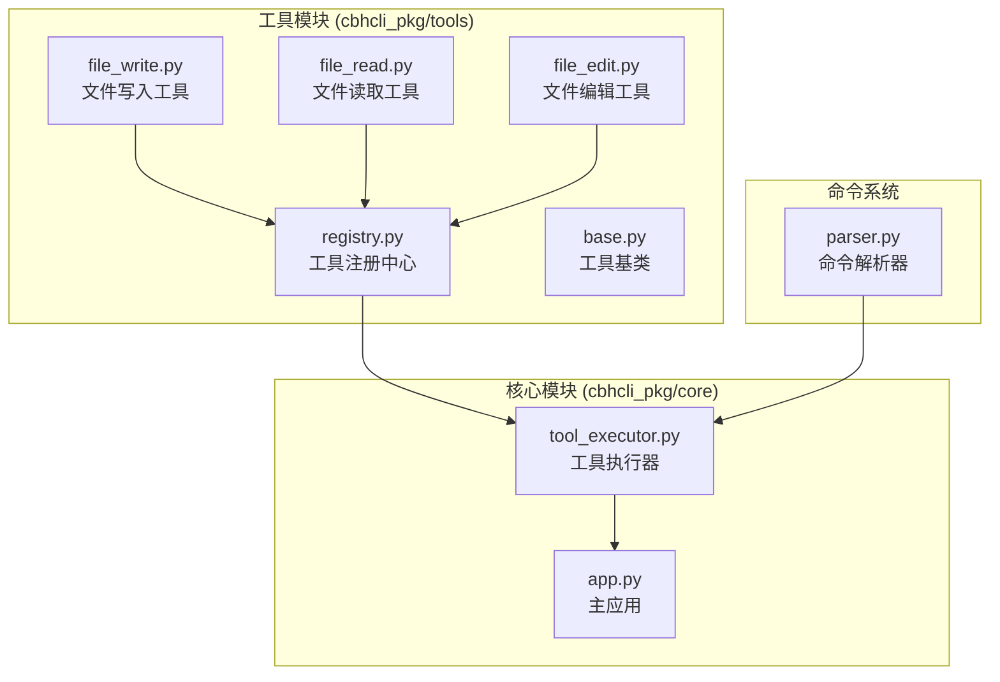
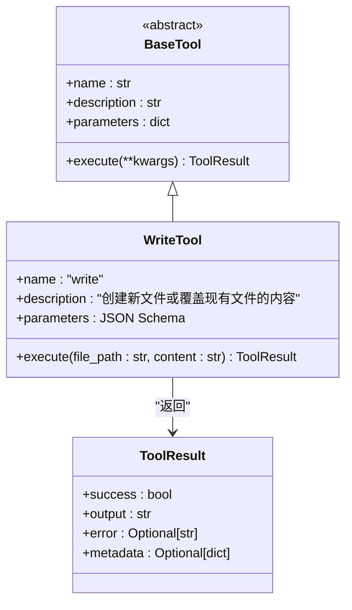
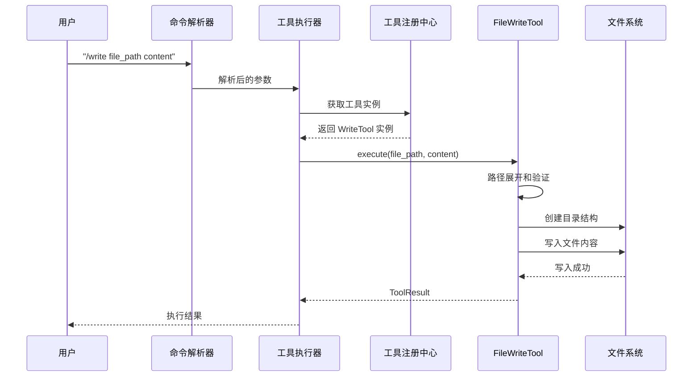
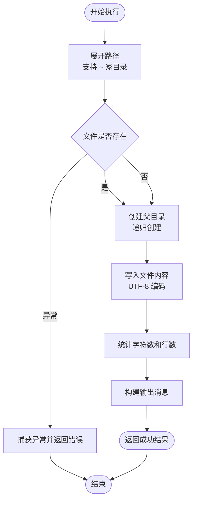
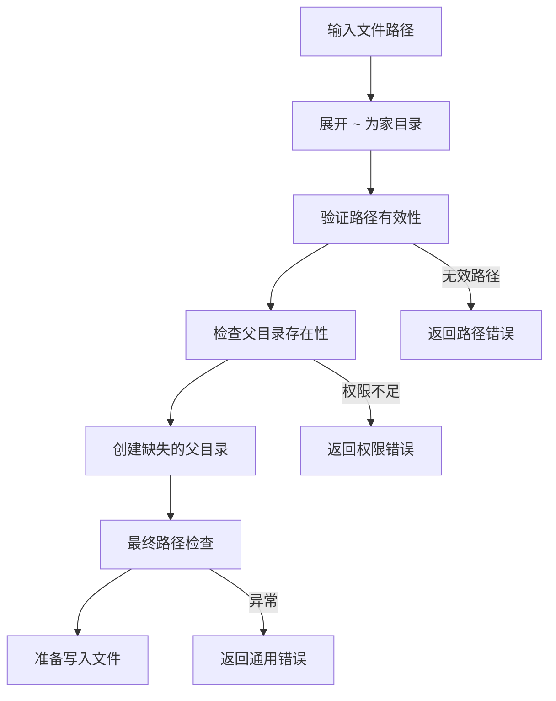
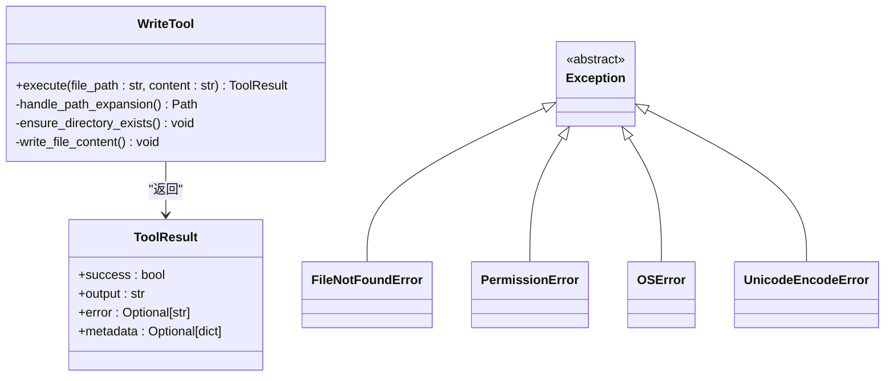
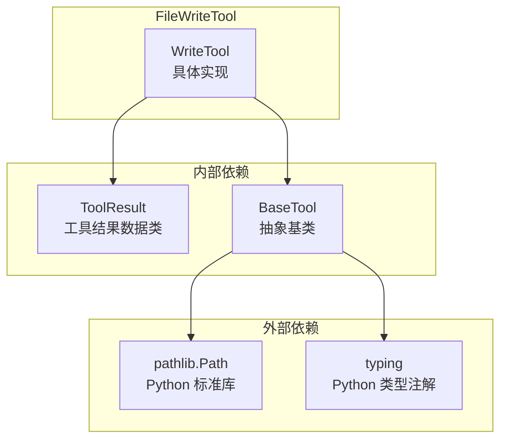

# FileWriteTool 文件写入工具

<cite>
**本文档引用的文件**
- [file_write.py](file://cbhcli_pkg/tools/file_write.py)
- [registry.py](file://cbhcli_pkg/tools/registry.py)
- [base.py](file://cbhcli_pkg/tools/base.py)
- [file_read.py](file://cbhcli_pkg/tools/file_read.py)
- [file_edit.py](file://cbhcli_pkg/tools/file_edit.py)
- [tool_executor.py](file://cbhcli_pkg/core/tool_executor.py)
- [parser.py](file://cbhcli_pkg/commands/parser.py)
- [test_v3.py](file://test_v3.py)
- [README.md](file://README.md)
</cite>

## 目录
1. [简介](#简介)
2. [项目结构](#项目结构)
3. [核心组件](#核心组件)
4. [架构概览](#架构概览)
5. [详细组件分析](#详细组件分析)
6. [依赖关系分析](#依赖关系分析)
7. [性能考虑](#性能考虑)
8. [故障排除指南](#故障排除指南)
9. [结论](#结论)
10. [附录](#附录)

## 简介

FileWriteTool 是 CBHCLI v3.0 中的一个核心文件操作工具，专门负责文件的创建和覆盖写入功能。该工具提供了简单而强大的文件写入能力，支持路径展开、目录自动创建、UTF-8 编码处理等功能。作为工具系统的一部分，FileWriteTool 遵循统一的工具接口规范，确保与其他工具的一致性和互操作性。

## 项目结构

CBHCLI 采用模块化的项目结构设计，FileWriteTool 位于工具模块中，与其它文件操作工具形成完整的文件管理系统。

**图表来源**
- [file_write.py:1-83](file://cbhcli_pkg/tools/file_write.py#L1-L83)
- [registry.py:1-115](file://cbhcli_pkg/tools/registry.py#L1-L115)
- [tool_executor.py:1-168](file://cbhcli_pkg/core/tool_executor.py#L1-L168)

**章节来源**
- [README.md:269-295](file://README.md#L269-L295)

## 核心组件

### 工具接口规范

FileWriteTool 实现了统一的工具接口，遵循抽象基类定义的标准规范：

**图表来源**
- [registry.py:16-48](file://cbhcli_pkg/tools/registry.py#L16-L48)
- [file_write.py:6-32](file://cbhcli_pkg/tools/file_write.py#L6-L32)

### 参数规范

FileWriteTool 的参数定义遵循 JSON Schema 格式，确保参数验证和文档生成的标准化：

| 参数名 | 类型 | 必需 | 描述 |
|--------|------|------|------|
| file_path | string | 是 | 要创建或覆盖的文件路径，支持 `~` 表示家目录 |
| content | string | 是 | 要写入文件的内容 |

**章节来源**
- [file_write.py:18-32](file://cbhcli_pkg/tools/file_write.py#L18-L32)

## 架构概览

FileWriteTool 在 CBHCLI 整体架构中扮演着关键的数据写入角色，与工具注册中心、工具执行器和命令解析器协同工作。

**图表来源**
- [parser.py:26-49](file://cbhcli_pkg/commands/parser.py#L26-L49)
- [tool_executor.py:42-52](file://cbhcli_pkg/core/tool_executor.py#L42-L52)
- [registry.py:70-96](file://cbhcli_pkg/tools/registry.py#L70-L96)

## 详细组件分析

### 文件写入机制

FileWriteTool 的核心功能是提供可靠的文件创建和覆盖写入能力。其处理流程包括路径验证、目录创建和内容写入三个主要步骤。

**图表来源**
- [file_write.py:34-82](file://cbhcli_pkg/tools/file_write.py#L34-L82)

### 权限检查流程

虽然 FileWriteTool 本身没有显式的权限检查逻辑，但其执行过程涉及多个层面的隐式权限验证：

1. **路径有效性验证**：使用 `pathlib.Path` 进行路径解析和验证
2. **目录创建权限**：通过 `mkdir(parents=True, exist_ok=True)` 检查目录创建权限
3. **文件写入权限**：通过文件打开操作检查写入权限
4. **编码兼容性**：强制使用 UTF-8 编码，避免编码相关权限问题

### 路径验证策略

FileWriteTool 采用了多层次的路径验证策略来确保安全性：

**图表来源**
- [file_write.py:45-57](file://cbhcli_pkg/tools/file_write.py#L45-L57)

### 文件内容处理和编码转换

FileWriteTool 对文件内容进行统一的处理和编码转换：

| 处理步骤 | 描述 | 编码方式 |
|----------|------|----------|
| 内容接收 | 接收字符串形式的内容 | UTF-8 字符串 |
| 行数统计 | 计算换行符数量加1 | 文本统计 |
| 字符计数 | 统计字符串长度 | UTF-8 字节计数 |
| 文件写入 | 使用 UTF-8 编码写入 | 'w' 模式 |

### 安全验证机制

FileWriteTool 实现了以下安全验证机制：

1. **路径规范化**：使用 `pathlib.Path` 自动处理路径分隔符和相对路径
2. **家目录支持**：通过 `expanduser()` 方法安全地展开 `~` 符号
3. **异常捕获**：全面的异常处理机制，防止系统崩溃
4. **结果封装**：使用 `ToolResult` 数据类统一返回格式

### 错误处理和异常情况响应

FileWriteTool 提供了完善的错误处理机制：

**图表来源**
- [registry.py:7-14](file://cbhcli_pkg/tools/registry.py#L7-L14)
- [file_write.py:77-82](file://cbhcli_pkg/tools/file_write.py#L77-L82)

**章节来源**
- [file_write.py:77-82](file://cbhcli_pkg/tools/file_write.py#L77-L82)

## 依赖关系分析

FileWriteTool 的依赖关系相对简单，主要依赖于工具注册中心和基础工具类。

**图表来源**
- [file_write.py:2-3](file://cbhcli_pkg/tools/file_write.py#L2-L3)

### 组件耦合度分析

FileWriteTool 与其它组件的耦合关系如下：

| 组件 | 耦合类型 | 说明 |
|------|----------|------|
| ToolRegistry | 弱耦合 | 仅通过工具名称进行交互 |
| ToolExecutor | 弱耦合 | 通过统一接口传递参数 |
| FileReadTool | 无直接耦合 | 功能互补，独立运行 |
| FileEditTool | 无直接耦合 | 功能互补，独立运行 |

**章节来源**
- [registry.py:51-115](file://cbhcli_pkg/tools/registry.py#L51-L115)

## 性能考虑

### 时间复杂度分析

FileWriteTool 的时间复杂度主要取决于文件大小：

- **路径处理**：O(1) - 使用 `pathlib.Path` 进行常数时间的路径操作
- **目录创建**：O(d) - d 为父目录层级数
- **文件写入**：O(n) - n 为内容字符数
- **统计计算**：O(n) - 需要扫描整个内容字符串

### 空间复杂度分析

- **内存占用**：O(n) - 需要完整加载内容到内存
- **临时对象**：O(1) - 路径对象和统计变量

### 性能优化建议

1. **大文件处理**：对于超大文件，考虑分块写入策略
2. **批量操作**：支持批量文件写入的扩展功能
3. **缓存机制**：对频繁访问的文件路径进行缓存

## 故障排除指南

### 常见问题及解决方案

| 问题类型 | 症状 | 可能原因 | 解决方案 |
|----------|------|----------|----------|
| 路径错误 | "文件不存在" | 路径包含非法字符 | 检查路径格式，使用绝对路径 |
| 权限不足 | "权限被拒绝" | 目标目录无写权限 | 检查目录权限，使用管理员权限 |
| 编码错误 | "编码失败" | 内容包含非UTF-8字符 | 确保内容为UTF-8编码 |
| 磁盘空间不足 | "磁盘空间不足" | 磁盘空间不足 | 清理磁盘空间或选择其他位置 |

### 调试技巧

1. **启用详细模式**：通过工具执行器的详细模式查看更多调试信息
2. **检查路径展开**：验证 `~` 符号是否正确展开为家目录
3. **验证目录权限**：确保目标目录具有写入权限
4. **测试小文件**：先用小文件测试功能正常性

**章节来源**
- [tool_executor.py:142-158](file://cbhcli_pkg/core/tool_executor.py#L142-L158)

## 结论

FileWriteTool 作为 CBHCLI 文件系统的重要组成部分，提供了简洁而强大的文件写入功能。其设计遵循了统一的工具接口规范，具备良好的可扩展性和维护性。通过合理的错误处理机制和安全验证策略，确保了工具使用的可靠性和安全性。

该工具与 FileReadTool 和 FileEditTool 形成了完整的文件操作生态系统，为用户提供了一站式的文件管理解决方案。在未来的发展中，可以考虑增加更多高级功能，如文件锁定、原子写入、批量操作等特性。

## 附录

### 使用场景示例

FileWriteTool 适用于以下典型使用场景：

1. **配置文件创建**：为应用程序创建初始配置文件
2. **日志文件写入**：记录系统运行状态和错误信息
3. **数据导出**：将处理后的数据写入文件
4. **模板文件生成**：基于模板创建新的文件内容

### 最佳实践指南

1. **路径处理**：优先使用绝对路径，避免相对路径的歧义
2. **权限管理**：确保目标目录具有适当的写入权限
3. **编码一致性**：统一使用 UTF-8 编码，避免编码冲突
4. **错误处理**：在调用方妥善处理可能的异常情况
5. **资源管理**：及时释放文件句柄，避免资源泄漏

### 相关工具对比

| 工具 | 主要功能 | 适用场景 | 特殊功能 |
|------|----------|----------|----------|
| WriteTool | 文件创建/覆盖 | 配置文件、日志、数据导出 | UTF-8 编码、路径展开 |
| ReadTool | 文件读取 | 日志查看、配置检查 | 行范围选择、编码检测 |
| EditTool | 精确替换 | 配置修改、代码编辑 | 唯一匹配、行数统计 |

**章节来源**
- [README.md:14-24](file://README.md#L14-L24)