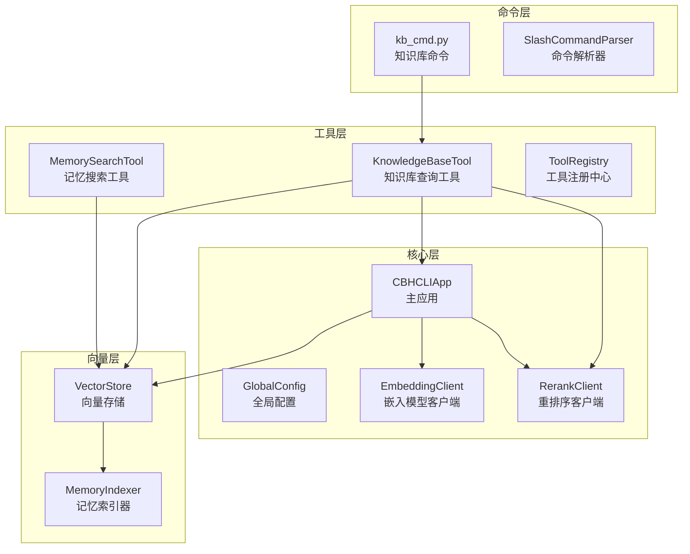
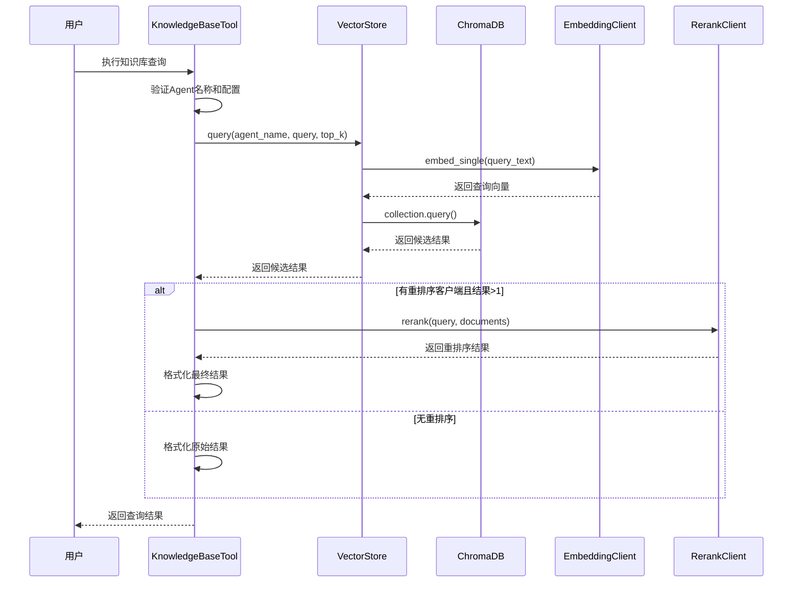
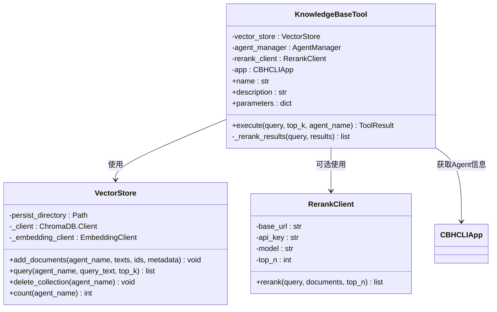
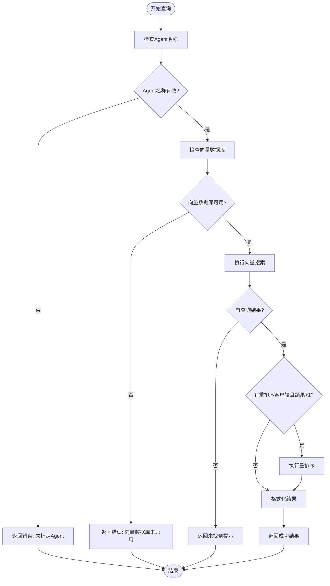
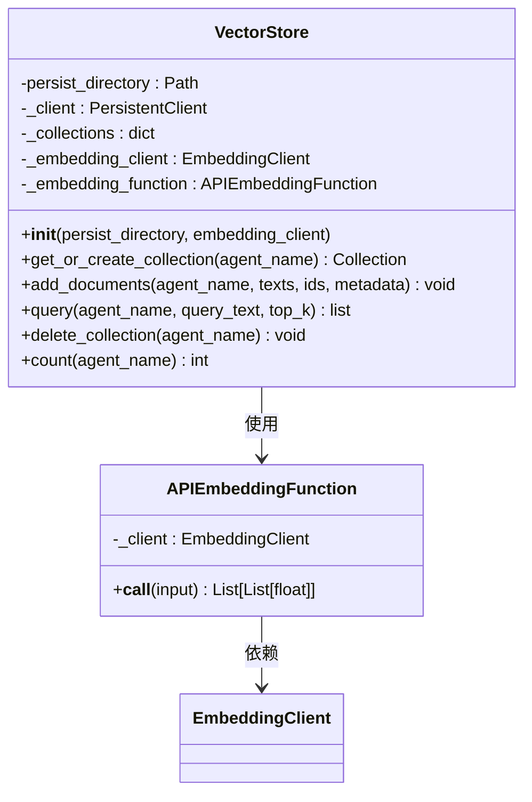
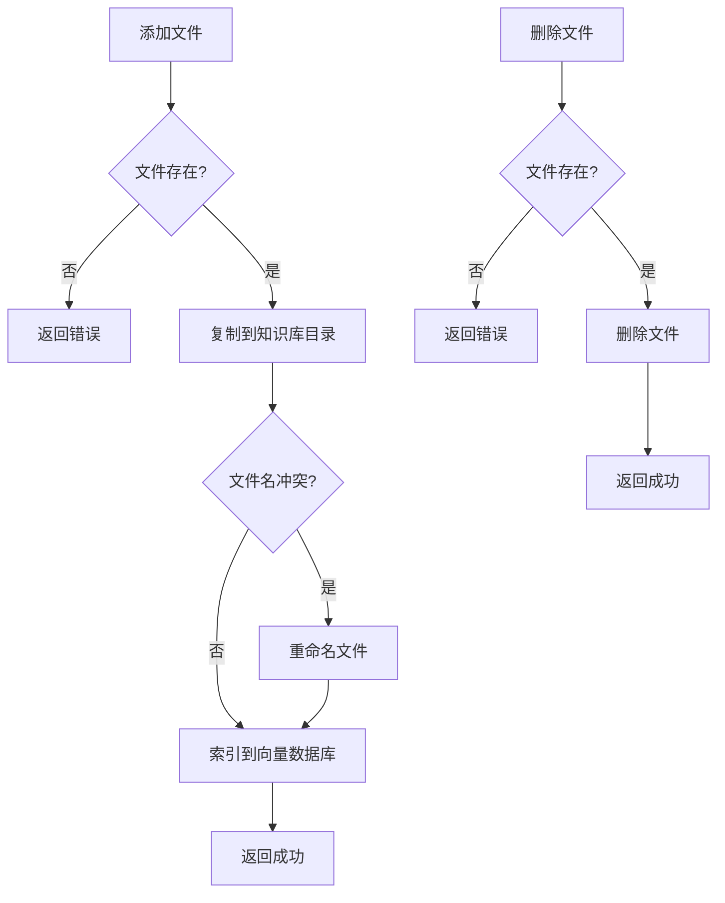
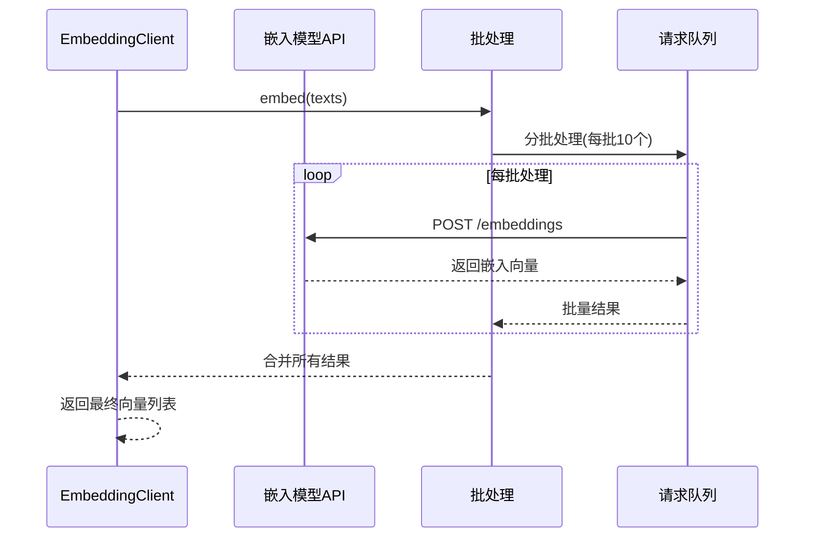
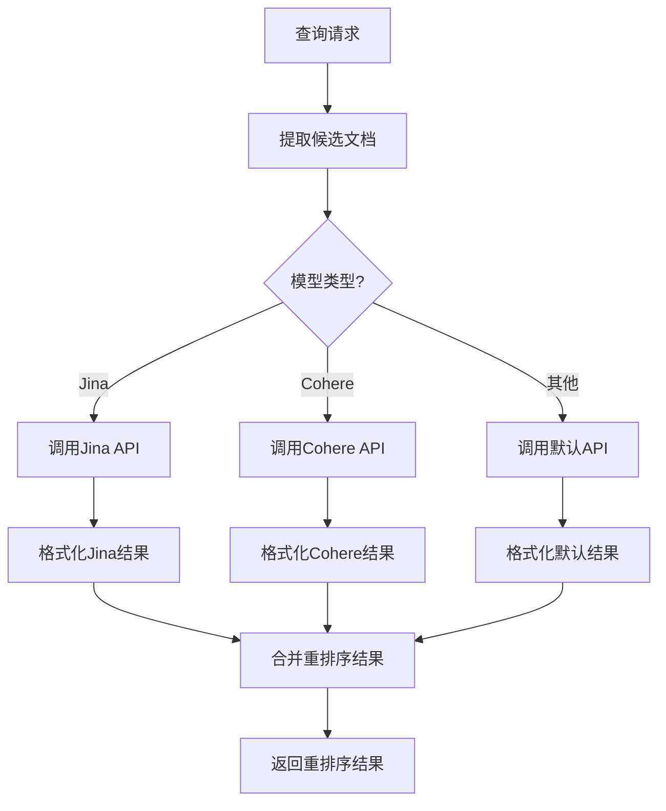
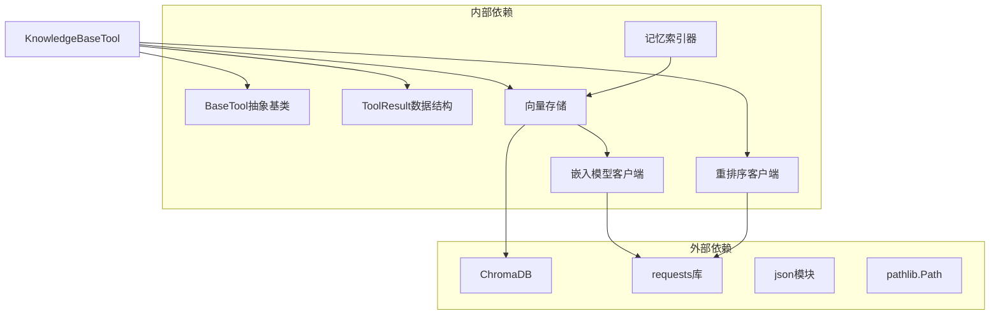
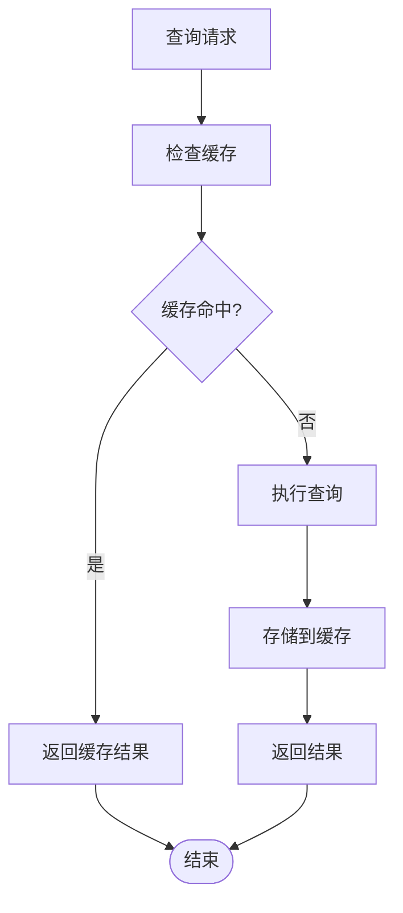

# KnowledgeBaseTool 知识库查询工具

<cite>
**本文档引用的文件**
- [knowledge_base.py](file://cbhcli_pkg/tools/knowledge_base.py)
- [knowledge_base.py](file://cbhcli_pkg/core/knowledge_base.py)
- [store.py](file://cbhcli_pkg/vector/store.py)
- [indexer.py](file://cbhcli_pkg/vector/indexer.py)
- [kb_cmd.py](file://cbhcli_pkg/commands/kb_cmd.py)
- [embedding_client.py](file://cbhcli_pkg/core/embedding_client.py)
- [rerank_client.py](file://cbhcli_pkg/core/rerank_client.py)
- [app.py](file://cbhcli_pkg/core/app.py)
- [registry.py](file://cbhcli_pkg/tools/registry.py)
- [memory_search.py](file://cbhcli_pkg/tools/memory_search.py)
- [README.md](file://README.md)
</cite>

## 目录
1. [简介](#简介)
2. [项目结构](#项目结构)
3. [核心组件](#核心组件)
4. [架构概览](#架构概览)
5. [详细组件分析](#详细组件分析)
6. [依赖关系分析](#依赖关系分析)
7. [性能考虑](#性能考虑)
8. [故障排除指南](#故障排除指南)
9. [结论](#结论)
10. [附录](#附录)

## 简介

KnowledgeBaseTool 是 CBHCLI 项目中的知识库查询工具，专为 AI 助手设计，能够查询 Agent 的知识库内容。该工具集成了 ChromaDB 向量数据库，支持语义搜索、文本匹配和重排序功能，为用户提供智能化的知识检索体验。

本工具的主要特性包括：
- 基于 ChromaDB 的向量数据库集成
- 支持多种嵌入模型 API（OpenAI 兼容、通义千问等）
- 语义搜索与文本匹配相结合的混合检索策略
- 可选的重排序服务提升检索质量
- 完整的知识库管理功能（添加、删除、索引、重新索引）

## 项目结构

CBHCLI 采用模块化的项目结构，KnowledgeBaseTool 位于工具层，与核心功能紧密集成：

**图表来源**
- [knowledge_base.py:1-157](file://cbhcli_pkg/tools/knowledge_base.py#L1-L157)
- [app.py:54-150](file://cbhcli_pkg/core/app.py#L54-L150)
- [store.py:37-175](file://cbhcli_pkg/vector/store.py#L37-L175)

**章节来源**
- [README.md:269-295](file://README.md#L269-L295)

## 核心组件

KnowledgeBaseTool 由多个核心组件协同工作，形成完整的知识库查询系统：

### 工具接口层
- **BaseTool 抽象基类**：定义工具的标准接口规范
- **ToolResult 数据结构**：统一的工具执行结果格式
- **ToolRegistry 注册中心**：工具的统一管理和调度

### 知识库管理层
- **KnowledgeBase 类**：负责 Agent 知识库的完整生命周期管理
- **MemoryIndexer 类**：专门处理记忆和知识库的索引工作
- **VectorStore 类**：ChromaDB 的封装，提供向量检索能力

### 搜索引擎层
- **EmbeddingClient**：支持多种嵌入模型的客户端
- **RerankClient**：重排序服务客户端，提升检索质量
- **MemorySearchTool**：记忆搜索工具，提供降级搜索能力

**章节来源**
- [registry.py:7-115](file://cbhcli_pkg/tools/registry.py#L7-L115)
- [knowledge_base.py:7-207](file://cbhcli_pkg/core/knowledge_base.py#L7-L207)
- [indexer.py:7-178](file://cbhcli_pkg/vector/indexer.py#L7-L178)

## 架构概览

KnowledgeBaseTool 采用分层架构设计，各层职责清晰，耦合度低：

**图表来源**
- [knowledge_base.py:49-122](file://cbhcli_pkg/tools/knowledge_base.py#L49-L122)
- [store.py:128-160](file://cbhcli_pkg/vector/store.py#L128-L160)

该架构实现了以下关键特性：
- **异步处理**：嵌入向量计算与数据库查询并行进行
- **可扩展性**：支持多种嵌入模型和重排序服务
- **容错性**：提供降级搜索机制，确保系统稳定性

## 详细组件分析

### KnowledgeBaseTool 核心实现

KnowledgeBaseTool 是知识库查询的核心实现，提供了完整的查询、重排序和结果格式化功能：

**图表来源**
- [knowledge_base.py:6-23](file://cbhcli_pkg/tools/knowledge_base.py#L6-L23)
- [store.py:37-62](file://cbhcli_pkg/vector/store.py#L37-L62)

#### 参数配置详解

KnowledgeBaseTool 支持以下参数配置：

| 参数 | 类型 | 描述 | 默认值 | 必需 |
|------|------|------|--------|------|
| query | string | 搜索查询文本 | - | 是 |
| top_k | integer | 返回结果数量 | 5 | 否 |
| agent_name | string | Agent名称 | 自动获取 | 否 |

#### 查询执行流程

**图表来源**
- [knowledge_base.py:49-122](file://cbhcli_pkg/tools/knowledge_base.py#L49-L122)

**章节来源**
- [knowledge_base.py:32-47](file://cbhcli_pkg/tools/knowledge_base.py#L32-L47)
- [knowledge_base.py:49-122](file://cbhcli_pkg/tools/knowledge_base.py#L49-L122)

### VectorStore 向量存储实现

VectorStore 是 ChromaDB 的封装，提供了高效的向量检索能力：

#### ChromaDB 集成特性

**图表来源**
- [store.py:37-62](file://cbhcli_pkg/vector/store.py#L37-L62)
- [store.py:12-35](file://cbhcli_pkg/vector/store.py#L12-L35)

#### 向量查询优化

VectorStore 实现了多项查询优化技术：

1. **预计算嵌入向量**：避免 ChromaDB 调用默认模型
2. **批量处理**：减少网络往返次数
3. **内存缓存**：缓存集合实例，避免重复创建
4. **元数据优化**：确保元数据非空，满足 ChromaDB 要求

**章节来源**
- [store.py:118-126](file://cbhcli_pkg/vector/store.py#L118-L126)
- [store.py:142-149](file://cbhcli_pkg/vector/store.py#L142-L149)

### KnowledgeBase 知识库管理

KnowledgeBase 类负责 Agent 知识库的完整生命周期管理：

#### 文件管理功能

**图表来源**
- [knowledge_base.py:31-101](file://cbhcli_pkg/core/knowledge_base.py#L31-L101)

#### 索引策略

KnowledgeBase 采用智能索引策略：

1. **文件类型过滤**：仅索引支持的文本文件
2. **段落分割**：按双换行符分割文档
3. **元数据丰富**：包含 Agent 名称、文件信息、段落索引
4. **批量添加**：使用 ChromaDB 的批量添加功能

**章节来源**
- [knowledge_base.py:151-206](file://cbhcli_pkg/core/knowledge_base.py#L151-L206)

### 嵌入模型集成

KnowledgeBaseTool 支持多种嵌入模型，通过 EmbeddingClient 实现统一接口：

#### 支持的嵌入模型

| 模型类型 | 模型名称 | 特点 |
|----------|----------|------|
| OpenAI 兼容 | text-embedding-3-small | 高质量，适合通用场景 |
| OpenAI 兼容 | text-embedding-ada-002 | 成熟稳定，兼容性好 |
| 通义千问 | qwen-text-embedding | 中文优化，成本较低 |
| 自定义 | 其他 OpenAI 兼容API | 灵活适配 |

#### 批处理优化

EmbeddingClient 实现了智能批处理：

**图表来源**
- [embedding_client.py:49-70](file://cbhcli_pkg/core/embedding_client.py#L49-L70)

**章节来源**
- [embedding_client.py:6-132](file://cbhcli_pkg/core/embedding_client.py#L6-L132)

### 重排序服务

RerankClient 提供了高级的检索结果重排序功能：

#### 支持的重排序模型

| 服务提供商 | 模型名称 | 特点 |
|------------|----------|------|
| Jina AI | jina-reranker-v2-base-multilingual | 多语言支持，质量优秀 |
| Cohere | rerank-multilingual-v3.5 | 多语言优化，性能稳定 |
| 通义千问 | qwen-rerank | 中文优化，成本较低 |

#### 重排序流程

**图表来源**
- [rerank_client.py:35-59](file://cbhcli_pkg/core/rerank_client.py#L35-L59)

**章节来源**
- [rerank_client.py:6-123](file://cbhcli_pkg/core/rerank_client.py#L6-L123)

## 依赖关系分析

KnowledgeBaseTool 的依赖关系清晰，遵循单一职责原则：

**图表来源**
- [knowledge_base.py:1-3](file://cbhcli_pkg/tools/knowledge_base.py#L1-L3)
- [store.py:1-10](file://cbhcli_pkg/vector/store.py#L1-L10)

### 关键依赖关系

1. **VectorStore 依赖 EmbeddingClient**：向量存储需要嵌入模型来计算向量
2. **KnowledgeBaseTool 依赖 VectorStore**：查询工具直接使用向量存储
3. **RerankClient 独立运行**：可选的重排序服务，不影响基础查询
4. **MemoryIndexer 依赖 VectorStore**：索引器负责数据准备

**章节来源**
- [app.py:139-145](file://cbhcli_pkg/core/app.py#L139-L145)

## 性能考虑

KnowledgeBaseTool 在设计时充分考虑了性能优化：

### 查询性能优化

1. **预计算嵌入向量**：避免重复计算，减少网络延迟
2. **批量处理**：嵌入模型和数据库操作都支持批量处理
3. **内存缓存**：缓存 ChromaDB 集合实例，避免重复创建
4. **智能重排序**：仅在需要时进行重排序，减少不必要的 API 调用

### 存储性能优化

1. **段落索引**：将长文档分割为段落，提高查询精度
2. **元数据优化**：丰富的元数据支持精确的结果过滤
3. **增量索引**：支持增量更新，避免全量重新索引

### 缓存策略

**图表来源**
- [store.py:118-126](file://cbhcli_pkg/vector/store.py#L118-L126)

## 故障排除指南

### 常见问题及解决方案

#### 1. 向量数据库未启用

**症状**：查询返回错误："向量数据库未启用。请安装 chromadb: pip install chromadb"

**解决方案**：
- 安装 ChromaDB：`pip install chromadb`
- 配置嵌入模型：`/model embedding add`
- 初始化向量存储：`/embedding index`

#### 2. Agent 名称缺失

**症状**：查询返回错误："未指定 Agent 名称，且无法获取当前Agent"

**解决方案**：
- 选择 Agent：`/agent switch <agent_name>`
- 或在调用时指定 agent_name 参数

#### 3. 查询结果为空

**症状**：查询成功但返回"知识库中未找到相关内容"

**可能原因**：
- 知识库为空
- 未进行索引
- 查询词过于具体

**解决方案**：
- 添加文件到知识库：`/kb add <file_path>`
- 执行索引：`/kb reindex`
- 调整查询词

#### 4. 重排序失败

**症状**：查询正常但重排序阶段报错

**解决方案**：
- 检查重排序服务配置
- 重排序失败时自动降级到原始结果
- 调整重排序模型配置

### 调试技巧

1. **启用详细模式**：使用 `Ctrl+R` 切换工具显示模式
2. **检查状态**：使用 `/kb status` 查看知识库状态
3. **验证配置**：使用 `/model embedding info` 检查嵌入模型配置
4. **查看日志**：关注控制台输出的错误信息

**章节来源**
- [knowledge_base.py:116-121](file://cbhcli_pkg/tools/knowledge_base.py#L116-L121)
- [kb_cmd.py:147-185](file://cbhcli_pkg/commands/kb_cmd.py#L147-L185)

## 结论

KnowledgeBaseTool 是一个功能完整、设计合理的知识库查询工具。它通过以下特点实现了优秀的用户体验：

1. **模块化设计**：清晰的分层架构，便于维护和扩展
2. **性能优化**：多项优化技术确保快速响应
3. **容错处理**：完善的错误处理和降级机制
4. **灵活配置**：支持多种嵌入模型和重排序服务
5. **易用性**：简洁的 API 设计和丰富的命令行接口

该工具为 CBHCLI 项目提供了强大的知识检索能力，是 AI 助手实现智能问答和知识管理的重要基础设施。

## 附录

### 最佳实践建议

1. **合理设置 top_k 参数**：根据应用场景调整返回结果数量
2. **优化查询词**：使用具体但不过于精确的查询词
3. **定期索引更新**：文件更新后及时重新索引
4. **监控资源使用**：关注嵌入模型 API 调用频率
5. **备份重要数据**：定期备份知识库文件

### 查询技巧

1. **使用关键词组合**：结合多个相关关键词提高准确性
2. **逐步细化**：从宽泛查询开始，逐步缩小范围
3. **利用元数据**：通过文件类型和来源信息过滤结果
4. **结合重排序**：启用重排序服务提升结果质量

### 扩展建议

1. **自定义嵌入模型**：实现自定义 EmbeddingClient 适配特定需求
2. **多模态支持**：扩展支持图片、音频等非文本内容
3. **实时更新**：实现实时文件监控和增量索引
4. **结果可视化**：提供更丰富的结果展示界面