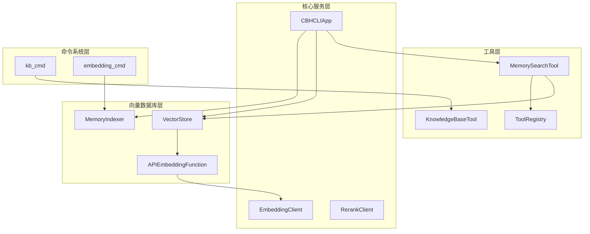
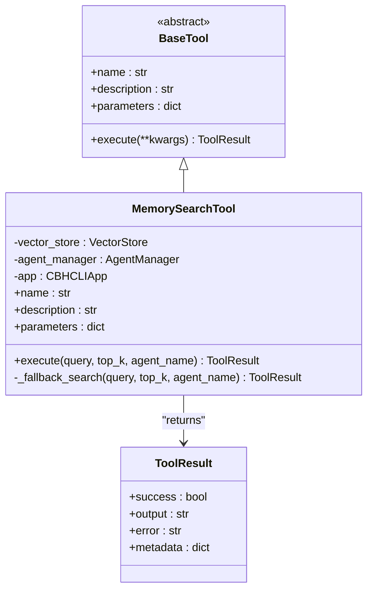
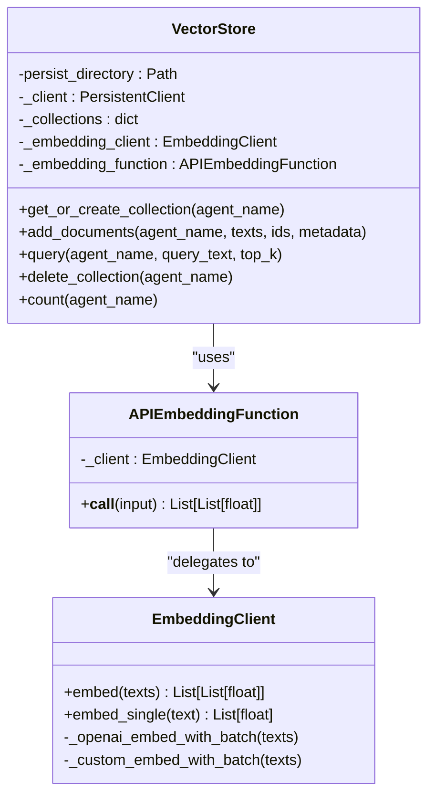
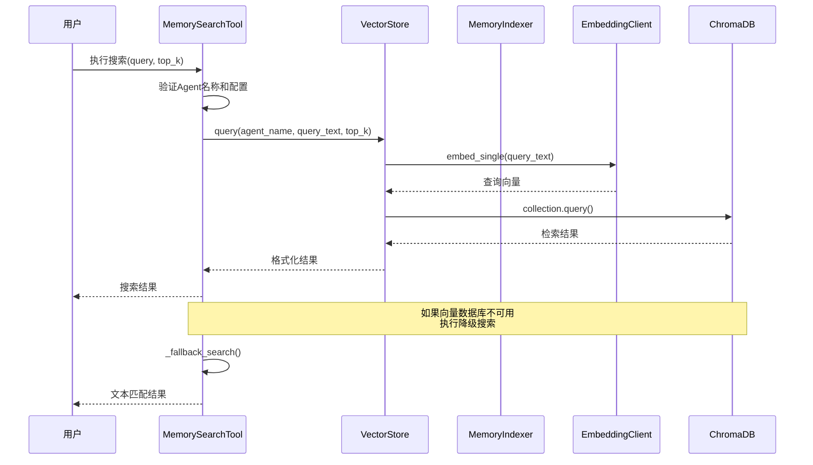
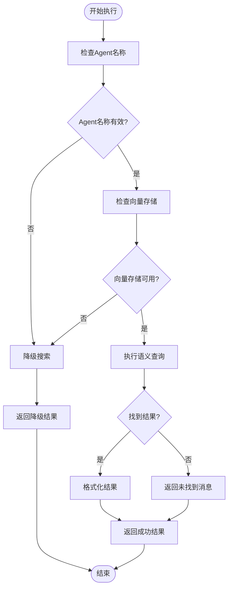
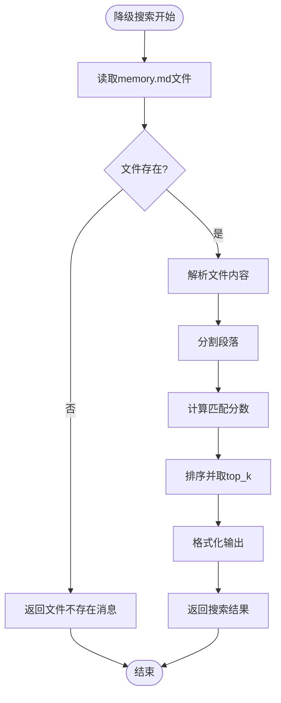
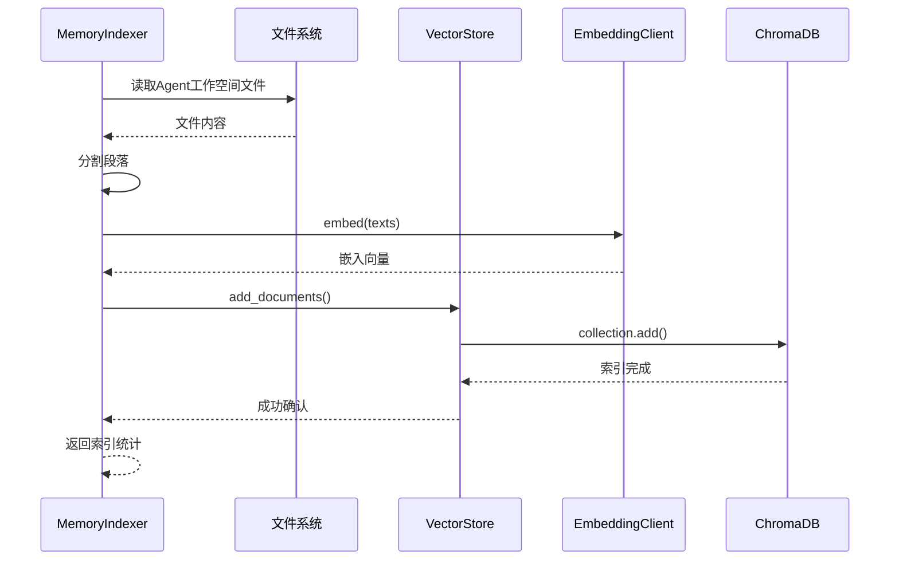
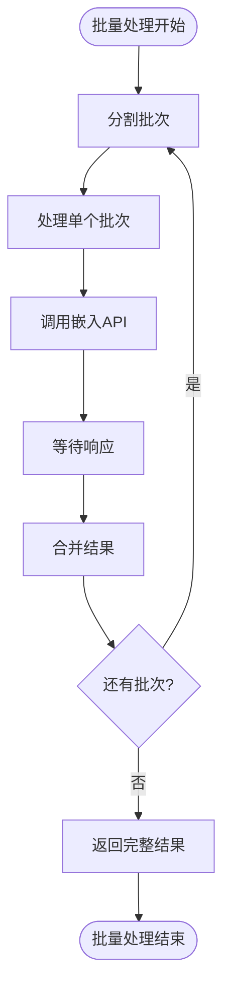
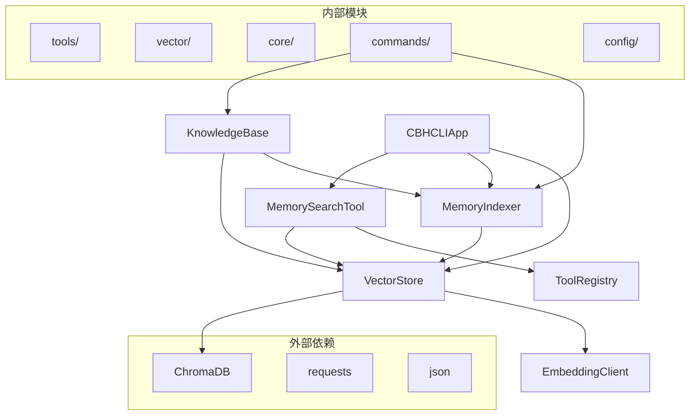
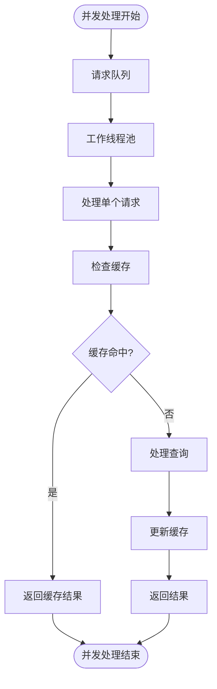

# MemorySearchTool 内存搜索工具

<cite>
**本文档引用的文件**
- [memory_search.py](file://cbhcli_pkg/tools/memory_search.py)
- [indexer.py](file://cbhcli_pkg/vector/indexer.py)
- [store.py](file://cbhcli_pkg/vector/store.py)
- [registry.py](file://cbhcli_pkg/tools/registry.py)
- [embedding_client.py](file://cbhcli_pkg/core/embedding_client.py)
- [rerank_client.py](file://cbhcli_pkg/core/rerank_client.py)
- [kb_cmd.py](file://cbhcli_pkg/commands/kb_cmd.py)
- [embedding_cmd.py](file://cbhcli_pkg/commands/embedding_cmd.py)
- [app.py](file://cbhcli_pkg/core/app.py)
- [global_config.py](file://cbhcli_pkg/config/global_config.py)
- [README.md](file://README.md)
</cite>

## 目录
1. [简介](#简介)
2. [项目结构](#项目结构)
3. [核心组件](#核心组件)
4. [架构概览](#架构概览)
5. [详细组件分析](#详细组件分析)
6. [依赖关系分析](#依赖关系分析)
7. [性能考虑](#性能考虑)
8. [故障排除指南](#故障排除指南)
9. [结论](#结论)
10. [附录](#附录)

## 简介

MemorySearchTool 是 CBHCLI 项目中的核心内存搜索工具，专门用于语义搜索 Agent 的向量化知识内容。该工具实现了完整的向量检索机制，包括语义搜索、相似度计算、结果排序和降级搜索策略。

该工具的主要特点：
- **语义搜索**：基于向量嵌入的语义相似度检索
- **多模态支持**：支持 Markdown、文本、代码等多种文件格式
- **智能降级**：当向量数据库不可用时自动回退到文本搜索
- **Agent 专属**：为每个 Agent 维护独立的搜索索引
- **实时更新**：支持动态添加、删除和重新索引知识内容

## 项目结构

CBHCLI 采用模块化的项目结构，MemorySearchTool 作为工具层的核心组件，与向量数据库、索引器、命令系统等模块紧密集成。



**图表来源**
- [memory_search.py:1-177](file://cbhcli_pkg/tools/memory_search.py#L1-L177)
- [store.py:1-175](file://cbhcli_pkg/vector/store.py#L1-L175)
- [indexer.py:1-178](file://cbhcli_pkg/vector/indexer.py#L1-L178)
- [app.py:1-478](file://cbhcli_pkg/core/app.py#L1-L478)

**章节来源**
- [README.md:269-295](file://README.md#L269-L295)
- [app.py:54-150](file://cbhcli_pkg/core/app.py#L54-L150)

## 核心组件

MemorySearchTool 的核心组件包括工具基类、向量存储、索引器和嵌入客户端等。这些组件协同工作，实现了完整的内存搜索功能。

### 工具接口设计

MemorySearchTool 继承自 BaseTool 抽象基类，遵循统一的工具接口规范：



**图表来源**
- [registry.py:16-48](file://cbhcli_pkg/tools/registry.py#L16-L48)
- [memory_search.py:6-104](file://cbhcli_pkg/tools/memory_search.py#L6-L104)

### 向量存储架构

VectorStore 封装了 ChromaDB 向量数据库，提供了完整的向量检索能力：



**图表来源**
- [store.py:37-175](file://cbhcli_pkg/vector/store.py#L37-L175)
- [embedding_client.py:6-132](file://cbhcli_pkg/core/embedding_client.py#L6-L132)

**章节来源**
- [memory_search.py:6-104](file://cbhcli_pkg/tools/memory_search.py#L6-L104)
- [store.py:37-175](file://cbhcli_pkg/vector/store.py#L37-L175)
- [registry.py:16-48](file://cbhcli_pkg/tools/registry.py#L16-L48)

## 架构概览

MemorySearchTool 的整体架构采用了分层设计，从底层的向量数据库到上层的工具接口，形成了清晰的功能边界。



**图表来源**
- [memory_search.py:47-104](file://cbhcli_pkg/tools/memory_search.py#L47-L104)
- [store.py:128-160](file://cbhcli_pkg/vector/store.py#L128-L160)
- [embedding_client.py:120-132](file://cbhcli_pkg/core/embedding_client.py#L120-L132)

## 详细组件分析

### MemorySearchTool 实现详解

MemorySearchTool 是内存搜索功能的核心实现，具有以下关键特性：

#### 参数配置系统

工具支持灵活的参数配置，包括查询文本和结果数量控制：

| 参数名 | 类型 | 描述 | 默认值 |
|--------|------|------|--------|
| query | string | 搜索查询文本 | 必需 |
| top_k | integer | 返回结果数量 | 5 |
| agent_name | string | Agent名称 | 自动获取 |

#### 执行流程分析



**图表来源**
- [memory_search.py:47-104](file://cbhcli_pkg/tools/memory_search.py#L47-L104)

#### 降级搜索机制

当向量数据库不可用时，MemorySearchTool 自动执行降级搜索：



**图表来源**
- [memory_search.py:105-177](file://cbhcli_pkg/tools/memory_search.py#L105-L177)

**章节来源**
- [memory_search.py:47-177](file://cbhcli_pkg/tools/memory_search.py#L47-L177)

### 向量检索机制

VectorStore 实现了完整的向量检索功能，包括文档索引、查询处理和结果返回。

#### 索引构建过程



**图表来源**
- [indexer.py:37-135](file://cbhcli_pkg/vector/indexer.py#L37-L135)
- [store.py:99-127](file://cbhcli_pkg/vector/store.py#L99-L127)

#### 查询优化策略

VectorStore 采用了多项查询优化技术：

1. **预计算嵌入向量**：在添加文档和查询时都预先计算嵌入向量，避免重复计算
2. **批量处理**：支持批量嵌入计算，提高处理效率
3. **缓存机制**：利用 ChromaDB 的内置缓存机制
4. **元数据管理**：维护丰富的元数据信息，支持后续的过滤和排序

**章节来源**
- [store.py:99-160](file://cbhcli_pkg/vector/store.py#L99-L160)
- [indexer.py:87-135](file://cbhcli_pkg/vector/indexer.py#L87-L135)

### 嵌入模型集成

EmbeddingClient 提供了灵活的嵌入模型接口，支持多种 API 格式：

#### 支持的嵌入模型类型

| 模型类型 | 描述 | 典型示例 |
|----------|------|----------|
| OpenAI兼容 | 标准 OpenAI 兼容 API | text-embedding-3-small |
| 通义千问 | Qwen Embedding API | qwen-text-embedding-v1 |
| 自定义API | 任意兼容的嵌入 API | 自定义服务 |

#### 批量处理优化



**图表来源**
- [embedding_client.py:49-71](file://cbhcli_pkg/core/embedding_client.py#L49-L71)

**章节来源**
- [embedding_client.py:6-132](file://cbhcli_pkg/core/embedding_client.py#L6-L132)

## 依赖关系分析

MemorySearchTool 的依赖关系体现了清晰的分层架构设计：



**图表来源**
- [app.py:39-51](file://cbhcli_pkg/core/app.py#L39-L51)
- [memory_search.py:2-4](file://cbhcli_pkg/tools/memory_search.py#L2-L4)

### 关键依赖关系

1. **向量数据库依赖**：VectorStore 依赖 ChromaDB 进行向量存储和检索
2. **嵌入模型依赖**：通过 EmbeddingClient 支持多种嵌入模型 API
3. **工具注册依赖**：MemorySearchTool 通过 ToolRegistry 进行统一管理
4. **命令系统依赖**：与 kb_cmd 和 embedding_cmd 等命令系统集成

**章节来源**
- [app.py:104-149](file://cbhcli_pkg/core/app.py#L104-L149)
- [kb_cmd.py:57-186](file://cbhcli_pkg/commands/kb_cmd.py#L57-L186)

## 性能考虑

MemorySearchTool 在设计时充分考虑了性能优化，采用了多种策略来提升搜索效率和用户体验。

### 查询性能优化

1. **预计算嵌入向量**：避免重复的嵌入计算，显著提升查询速度
2. **批量处理**：支持批量嵌入计算，减少网络往返次数
3. **缓存策略**：利用 ChromaDB 的内置缓存机制
4. **连接池管理**：通过 requests.Session 复用连接

### 内存使用优化

1. **流式处理**：大文件采用流式读取，避免内存溢出
2. **分页查询**：支持分页查询，控制单次查询的数据量
3. **智能清理**：定期清理无效的索引和缓存

### 并发处理能力



**图表来源**
- [embedding_client.py:49-71](file://cbhcli_pkg/core/embedding_client.py#L49-L71)

## 故障排除指南

### 常见问题及解决方案

#### 向量数据库初始化失败

**问题症状**：
- 启动时提示向量存储初始化失败
- MemorySearchTool 无法执行语义搜索

**解决方案**：
1. 检查 ChromaDB 是否正确安装
2. 验证嵌入模型配置是否正确
3. 确认向量存储目录权限

#### 搜索结果为空

**问题症状**：
- 执行搜索但返回空结果
- 提示未找到相关的向量化内容

**可能原因**：
1. 未配置嵌入模型
2. 未执行向量索引
3. Agent 工作空间为空

**解决步骤**：
1. 配置嵌入模型：`/model embedding add`
2. 执行索引：`/embedding index`
3. 验证索引状态：`/embedding status`

#### 性能问题

**问题症状**：
- 搜索响应缓慢
- 内存使用过高

**优化建议**：
1. 调整 top_k 参数，减少返回结果数量
2. 优化嵌入模型配置
3. 清理不必要的索引数据

**章节来源**
- [embedding_cmd.py:42-122](file://cbhcli_pkg/commands/embedding_cmd.py#L42-L122)
- [kb_cmd.py:147-186](file://cbhcli_pkg/commands/kb_cmd.py#L147-L186)

## 结论

MemorySearchTool 作为 CBHCLI 项目的核心组件，展现了优秀的软件架构设计和实现质量。其主要优势包括：

### 技术优势

1. **模块化设计**：清晰的分层架构，便于维护和扩展
2. **性能优化**：采用多种优化策略，确保高效的搜索体验
3. **容错机制**：完善的降级策略，保证系统稳定性
4. **灵活配置**：支持多种嵌入模型和配置选项

### 应用价值

- **语义搜索**：提供准确的语义匹配，超越传统关键词搜索
- **Agent 专属**：为每个 Agent 维护独立的知识库，避免混淆
- **实时更新**：支持动态内容更新，保持知识库的时效性
- **易用性强**：简洁的命令接口，降低使用门槛

### 发展前景

随着向量数据库技术的不断发展，MemorySearchTool 有望在以下方面得到进一步改进：
- 支持更丰富的嵌入模型
- 集成更智能的结果排序算法
- 提供更精细的过滤和搜索选项
- 增强与其他 AI 功能的集成

## 附录

### 配置示例

#### 嵌入模型配置

```json
{
  "embedding_model": {
    "name": "openai-embedding",
    "apiKey": "sk-xxx",
    "url": "https://api.openai.com/v1",
    "model": "text-embedding-3-small",
    "type": "openai"
  }
}
```

#### 重排序模型配置

```json
{
  "rerank_model": {
    "name": "jina-reranker",
    "apiKey": "jina_xxx",
    "url": "https://api.jina.ai/v1",
    "model": "jina-reranker-v2-base-multilingual",
    "top_n": 5
  }
}
```

### 最佳实践建议

1. **索引策略**：定期重新索引更新的内容
2. **结果控制**：根据需求调整 top_k 参数
3. **性能监控**：关注搜索响应时间和资源使用
4. **错误处理**：实现适当的异常处理和日志记录