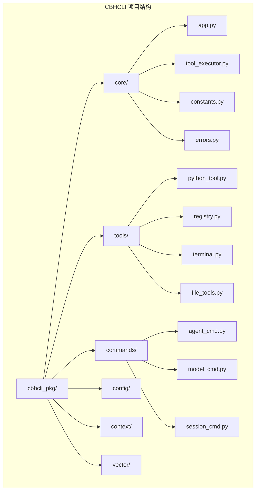
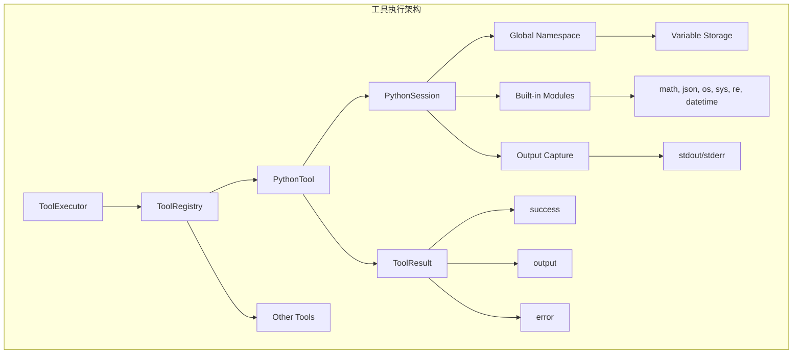
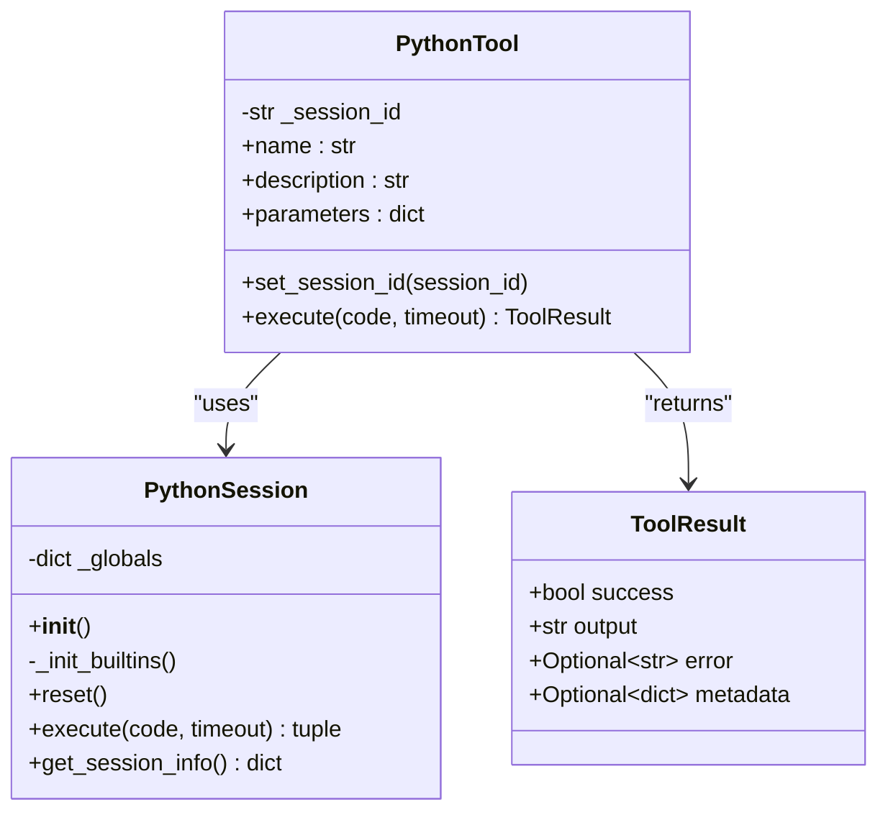
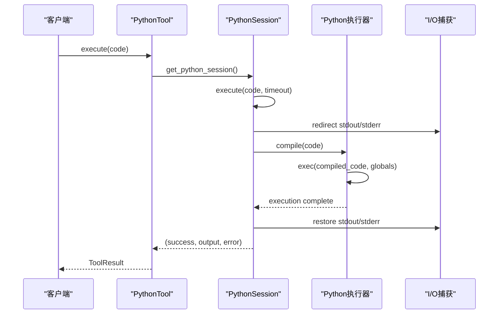
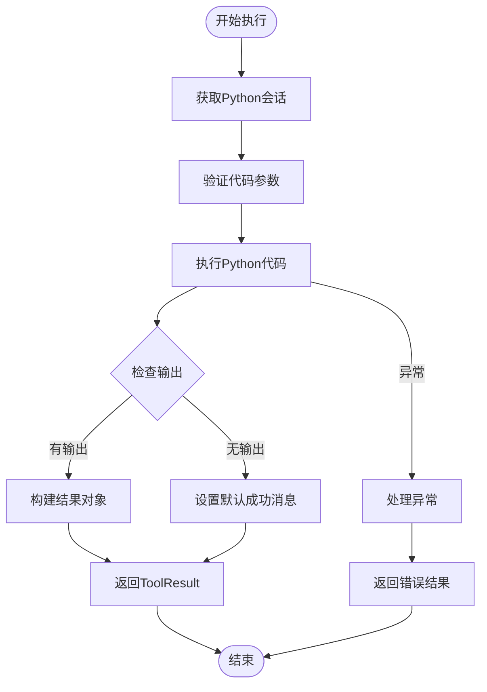
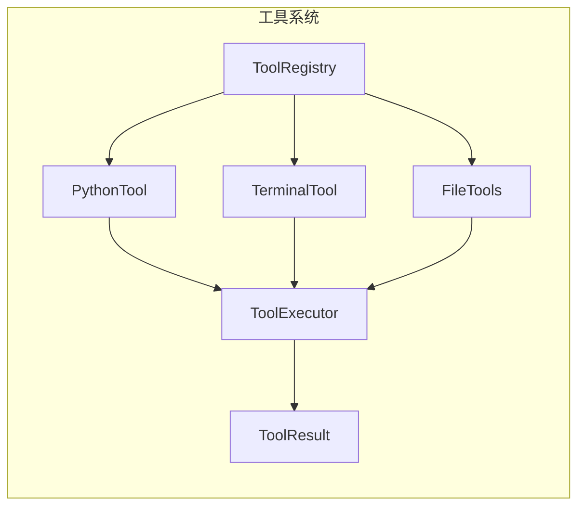
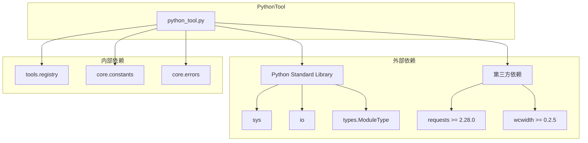

# PythonTool Python代码执行工具

<cite>
**本文档引用的文件**
- [python_tool.py](file://cbhcli_pkg/tools/python_tool.py)
- [registry.py](file://cbhcli_pkg/tools/registry.py)
- [tool_executor.py](file://cbhcli_pkg/core/tool_executor.py)
- [constants.py](file://cbhcli_pkg/core/constants.py)
- [errors.py](file://cbhcli_pkg/core/errors.py)
- [README.md](file://README.md)
- [requirements.txt](file://requirements.txt)
- [test_v3.py](file://test_v3.py)
</cite>

## 目录
1. [简介](#简介)
2. [项目结构](#项目结构)
3. [核心组件](#核心组件)
4. [架构概览](#架构概览)
5. [详细组件分析](#详细组件分析)
6. [依赖关系分析](#依赖关系分析)
7. [性能考虑](#性能考虑)
8. [故障排除指南](#故障排除指南)
9. [结论](#结论)
10. [附录](#附录)

## 简介

PythonTool 是 CBHCLI v3.0 中的一个强大工具，专门用于在受控环境中执行 Python 代码。该工具提供了会话级别的变量记忆功能，允许用户在多次调用之间保持变量状态，同时确保执行环境的安全性和稳定性。

### 主要特性
- **会话记忆**: 在同一会话中保持变量和导入模块的状态
- **沙箱隔离**: 通过独立的全局命名空间实现代码隔离
- **输出捕获**: 自动捕获标准输出和标准错误流
- **异常处理**: 完善的错误处理和异常捕获机制
- **资源控制**: 输出长度限制和预览功能

## 项目结构

CBHCLI 采用模块化的项目结构，PythonTool 位于工具模块中，与核心执行器和其他工具协同工作。



**图表来源**
- [README.md: 269-295:269-295](file://README.md#L269-L295)

**章节来源**
- [README.md: 269-295:269-295](file://README.md#L269-L295)

## 核心组件

PythonTool 系统由三个主要组件构成：PythonSession 会话管理器、PythonTool 工具类和工具注册中心。

### PythonSession 会话管理器
负责维护 Python 代码执行的全局命名空间，支持变量记忆和会话隔离。

### PythonTool 工具类  
实现了 BaseTool 接口，提供 Python 代码执行的核心功能。

### 工具注册中心
统一管理所有工具的注册、查找和执行。

**章节来源**
- [python_tool.py: 8-127:8-127](file://cbhcli_pkg/tools/python_tool.py#L8-L127)
- [registry.py: 16-49:16-49](file://cbhcli_pkg/tools/registry.py#L16-L49)

## 架构概览

PythonTool 的整体架构体现了清晰的关注点分离和模块化设计。



**图表来源**
- [tool_executor.py: 15-52:15-52](file://cbhcli_pkg/core/tool_executor.py#L15-L52)
- [registry.py: 51-96:51-96](file://cbhcli_pkg/tools/registry.py#L51-L96)
- [python_tool.py: 8-127:8-127](file://cbhcli_pkg/tools/python_tool.py#L8-L127)

## 详细组件分析

### PythonSession 类分析

PythonSession 是 PythonTool 的核心执行引擎，负责管理 Python 代码的执行环境。



**图表来源**
- [python_tool.py: 8-127:8-127](file://cbhcli_pkg/tools/python_tool.py#L8-L127)
- [registry.py: 7-14:7-14](file://cbhcli_pkg/tools/registry.py#L7-L14)

#### 变量作用域管理

PythonSession 通过独立的全局命名空间实现变量作用域隔离：

1. **初始化阶段**: 创建空的全局字典并注入常用内置模块
2. **执行阶段**: 将编译后的代码在独立的命名空间中执行
3. **状态保持**: 在会话级别维护变量状态
4. **清理阶段**: 提供重置功能清除所有变量

#### 输出捕获机制

系统实现了完整的输出捕获机制：



**图表来源**
- [python_tool.py: 60-101:60-101](file://cbhcli_pkg/tools/python_tool.py#L60-L101)
- [python_tool.py: 170-206:170-206](file://cbhcli_pkg/tools/python_tool.py#L170-L206)

**章节来源**
- [python_tool.py: 8-127:8-127](file://cbhcli_pkg/tools/python_tool.py#L8-L127)

### PythonTool 工具类分析

PythonTool 实现了完整的工具接口，提供 Python 代码执行功能。

#### 参数验证和执行流程



**图表来源**
- [python_tool.py: 170-206:170-206](file://cbhcli_pkg/tools/python_tool.py#L170-L206)

#### 会话管理策略

系统支持多会话并发执行，每个会话都有独立的状态：

- **会话标识**: 通过 session_id 参数区分不同会话
- **全局存储**: 使用字典 `_session_store` 管理会话实例
- **生命周期管理**: 支持创建、重置和删除会话
- **状态隔离**: 每个会话维护独立的全局命名空间

**章节来源**
- [python_tool.py: 108-125:108-125](file://cbhcli_pkg/tools/python_tool.py#L108-L125)

### 工具注册中心集成

PythonTool 通过工具注册中心实现统一管理：



**图表来源**
- [registry.py: 51-96:51-96](file://cbhcli_pkg/tools/registry.py#L51-L96)
- [tool_executor.py: 42-91:42-91](file://cbhcli_pkg/core/tool_executor.py#L42-L91)

**章节来源**
- [registry.py: 51-115:51-115](file://cbhcli_pkg/tools/registry.py#L51-L115)

## 依赖关系分析

PythonTool 的依赖关系相对简单，主要依赖于核心工具框架和标准库。



**图表来源**
- [python_tool.py: 1-5:1-5](file://cbhcli_pkg/tools/python_tool.py#L1-L5)
- [requirements.txt: 1-7:1-7](file://requirements.txt#L1-L7)

### 关键依赖说明

1. **标准库依赖**: 
   - `sys`: 用于标准输出/错误流重定向
   - `io`: 用于字符串缓冲区操作
   - `types.ModuleType`: 用于模块类型检查

2. **核心框架依赖**:
   - `ToolResult`: 标准化工具输出格式
   - `BaseTool`: 工具接口规范
   - `constants`: 应用常量定义

3. **可选依赖**:
   - `requests`: HTTP 请求处理
   - `wcwidth`: 终端宽度计算

**章节来源**
- [requirements.txt: 1-7:1-7](file://requirements.txt#L1-L7)
- [python_tool.py: 1-5:1-5](file://cbhcli_pkg/tools/python_tool.py#L1-L5)

## 性能考虑

### 内存管理策略

PythonTool 在内存管理方面采用了多项优化措施：

1. **会话级内存隔离**: 每个会话维护独立的全局命名空间，避免内存泄漏
2. **输出流捕获**: 使用 StringIO 对象捕获输出，避免直接写入系统流
3. **变量重置机制**: 提供 `reset()` 方法清理会话状态
4. **全局存储优化**: 使用字典存储会话实例，支持快速查找

### 执行效率优化

```mermaid
flowchart TD
A[代码执行] --> B[编译阶段]
B --> C[执行阶段]
C --> D[输出捕获]
D --> E[结果返回]
B --> F[compile() 缓存]
C --> G[exec() 直接执行]
D --> H[StringIO 缓冲]
E --> I[ToolResult 构建]
```

**图表来源**
- [python_tool.py: 82-84:82-84](file://cbhcli_pkg/tools/python_tool.py#L82-L84)

### 资源配额控制

系统通过以下方式实现资源控制：

1. **输出长度限制**: 使用 `MAX_TOOL_OUTPUT_LENGTH` 控制输出大小
2. **预览功能**: 提供 `TOOL_PREVIEW_LENGTH` 限制预览长度
3. **异常处理**: 完善的异常捕获机制防止资源泄露

**章节来源**
- [constants.py: 13-16:13-16](file://cbhcli_pkg/core/constants.py#L13-L16)

## 故障排除指南

### 常见问题及解决方案

#### 1. 代码执行异常

**症状**: PythonTool 返回错误结果
**原因**: 代码执行过程中发生异常
**解决方案**: 
- 检查代码语法和逻辑
- 确认所需模块已正确导入
- 查看详细的错误信息

#### 2. 变量访问错误

**症状**: 无法访问之前定义的变量
**原因**: 会话隔离或会话重置
**解决方案**:
- 确保使用相同的 `session_id`
- 避免调用 `reset_python_session()`
- 检查会话状态

#### 3. 输出截断问题

**症状**: 输出被截断
**原因**: 超过输出长度限制
**解决方案**:
- 检查 `MAX_TOOL_OUTPUT_LENGTH` 设置
- 优化代码输出格式
- 使用分页或分批输出

### 调试支持

系统提供了多种调试和诊断功能：

1. **详细输出模式**: 通过 `ToolExecutor.set_verbose(True)` 启用
2. **参数预览**: 显示工具调用的参数预览
3. **执行确认**: 支持交互式执行确认
4. **回调机制**: 提供执行完成后的回调通知

**章节来源**
- [tool_executor.py: 142-159:142-159](file://cbhcli_pkg/core/tool_executor.py#L142-L159)

## 结论

PythonTool 作为一个专业的 Python 代码执行工具，在 CBHCLI 生态系统中发挥着重要作用。其设计特点包括：

### 安全性优势
- **沙箱隔离**: 独立的全局命名空间确保代码执行隔离
- **输出捕获**: 完整的标准流捕获机制
- **异常处理**: 完善的错误处理和恢复机制

### 功能完整性
- **会话记忆**: 支持跨调用的状态保持
- **多会话支持**: 并发会话执行能力
- **标准化输出**: 统一的结果格式

### 可扩展性
- **模块化设计**: 清晰的组件分离
- **接口规范**: 标准化的工具接口
- **配置灵活**: 支持多种执行模式

### 最佳实践建议

1. **安全执行**: 始终在受控环境中执行不受信任的代码
2. **会话管理**: 合理使用会话 ID 管理执行状态
3. **错误处理**: 实现完善的异常处理机制
4. **资源控制**: 监控内存使用和执行时间
5. **调试支持**: 启用详细日志和调试模式

## 附录

### API 参考

#### PythonTool 参数
- `code` (必需): 要执行的 Python 代码字符串
- `session_id` (可选): 会话标识符，默认为 "default"

#### 返回值结构
- `success`: 布尔值，表示执行是否成功
- `output`: 字符串，包含执行输出
- `error`: 字符串或 null，包含错误信息

### 使用示例

```python
# 基本使用
result = registry.execute("python", code="print('Hello World')")

# 会话记忆使用
result1 = registry.execute("python", session_id="analysis", code="import pandas as pd")
result2 = registry.execute("python", session_id="analysis", code="df.head()")

# 错误处理
try:
    result = registry.execute("python", code="invalid code")
except Exception as e:
    print(f"执行失败: {e}")
```

### 性能基准

- **执行延迟**: 通常在毫秒级范围内
- **内存占用**: 每个会话约 1-10KB 内存
- **输出限制**: 默认最大输出 8000 字符
- **并发支持**: 支持多会话并发执行