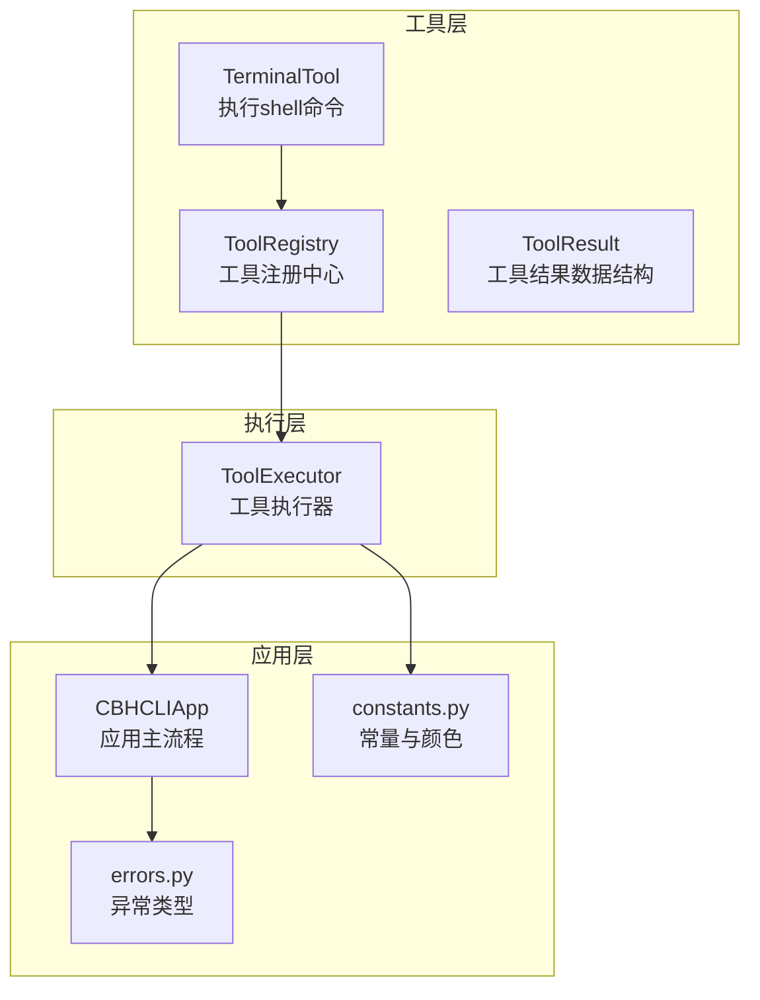
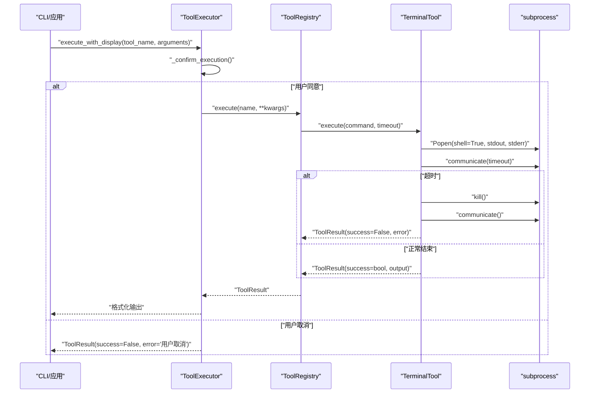
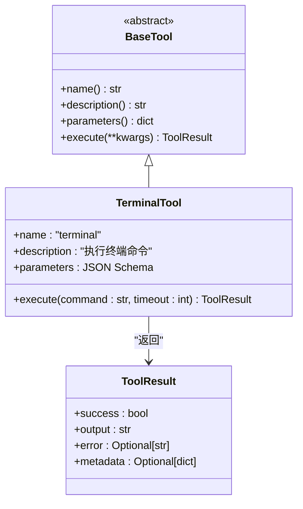
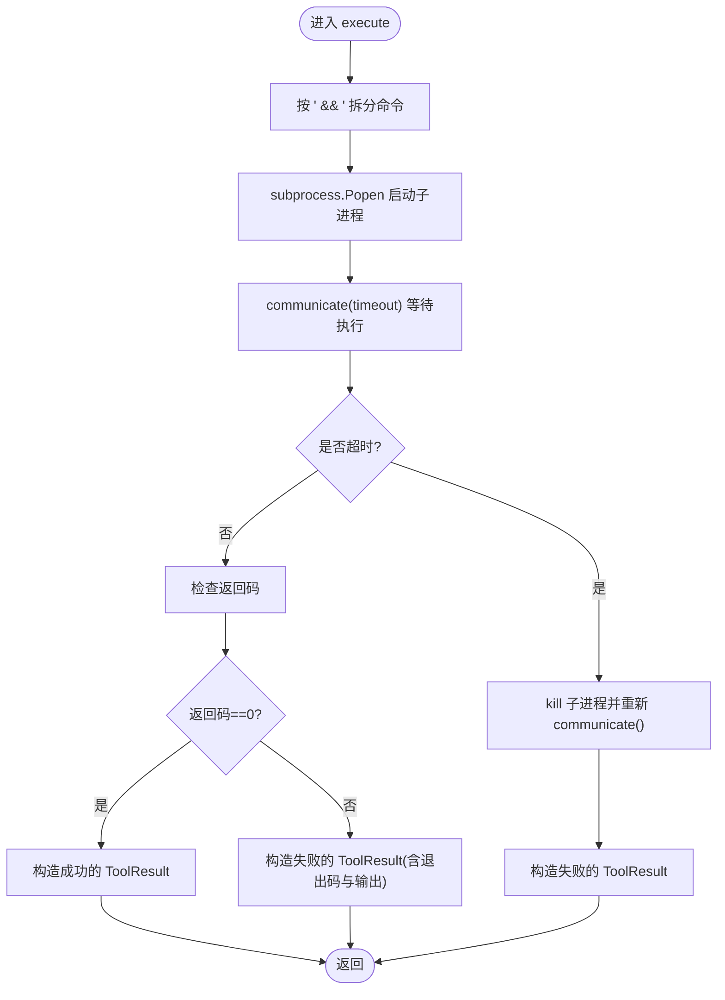
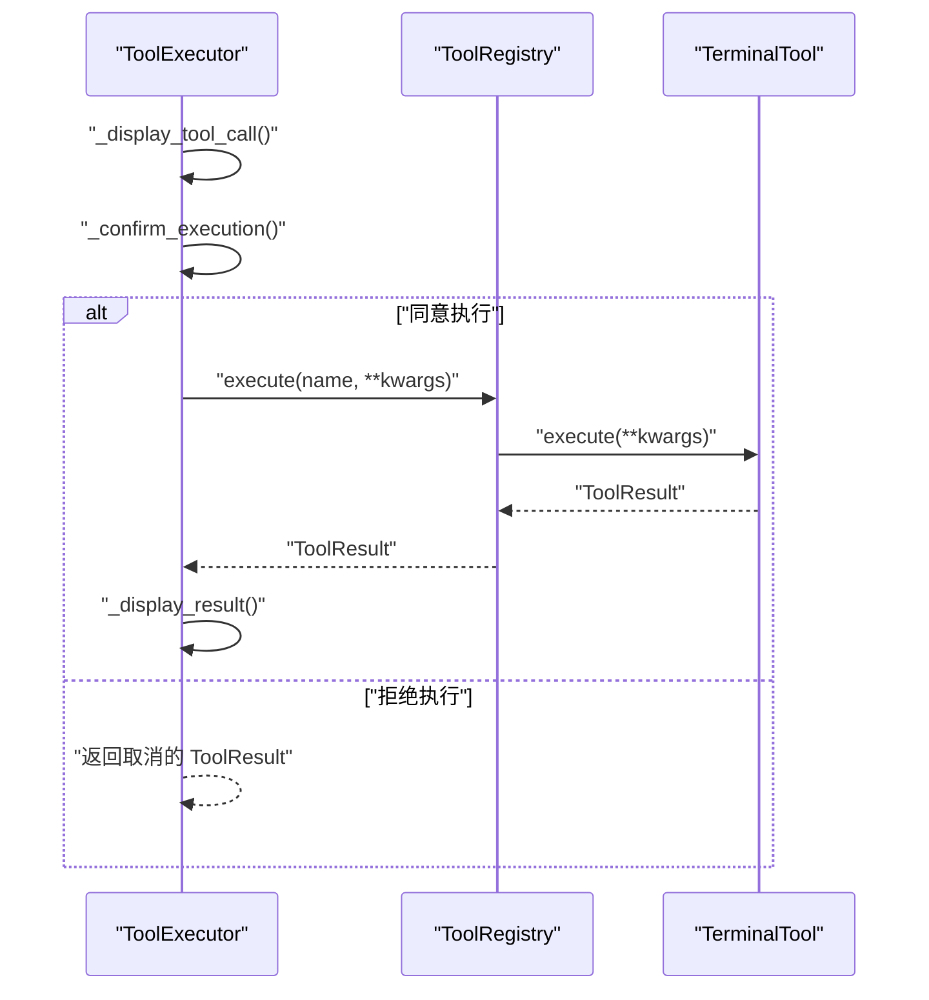
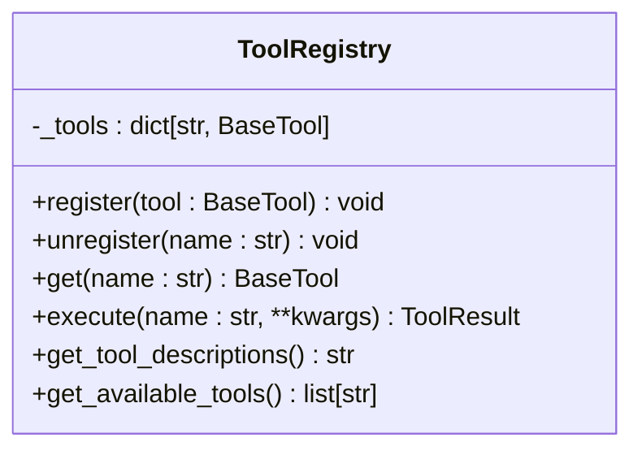
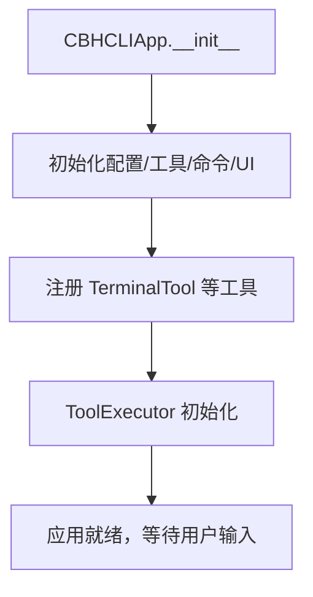
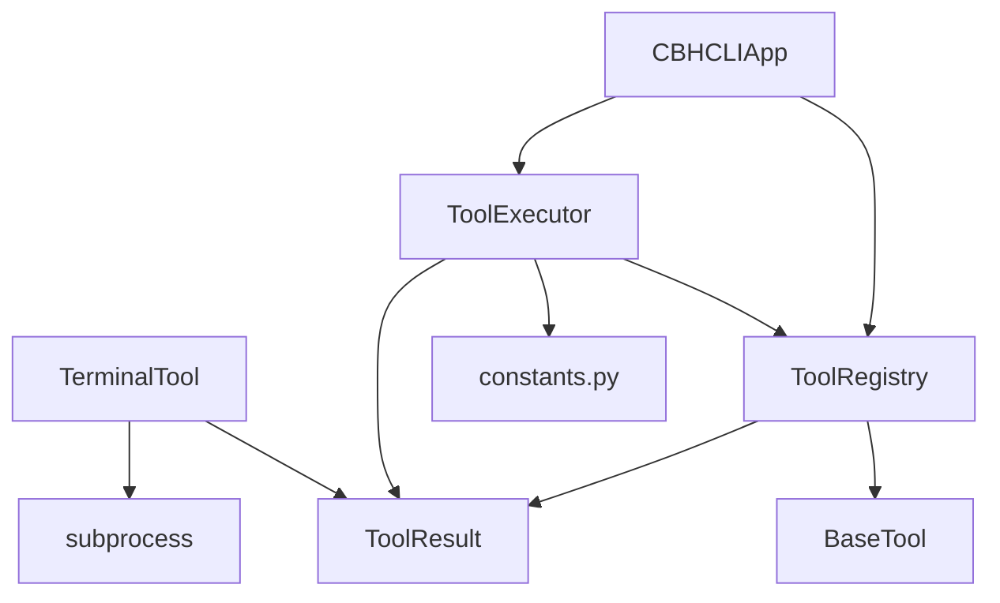

# TerminalTool 终端命令执行工具

<cite>
**本文档引用的文件**
- [terminal.py](file://cbhcli_pkg/tools/terminal.py)
- [registry.py](file://cbhcli_pkg/tools/registry.py)
- [tool_executor.py](file://cbhcli_pkg/core/tool_executor.py)
- [app.py](file://cbhcli_pkg/core/app.py)
- [constants.py](file://cbhcli_pkg/core/constants.py)
- [errors.py](file://cbhcli_pkg/core/errors.py)
- [test_v3.py](file://test_v3.py)
- [cli.py](file://cbhcli_pkg/cli.py)
</cite>

## 目录
1. [简介](#简介)
2. [项目结构](#项目结构)
3. [核心组件](#核心组件)
4. [架构总览](#架构总览)
5. [详细组件分析](#详细组件分析)
6. [依赖关系分析](#依赖关系分析)
7. [性能考量](#性能考量)
8. [故障排查指南](#故障排查指南)
9. [结论](#结论)
10. [附录](#附录)

## 简介
TerminalTool 是 CBHCLI v3.0 中的一个核心工具，负责在受控环境中执行任意 shell 命令。它通过统一的工具注册与执行框架进行调度，并提供超时控制、输出捕获与错误处理能力。本文档将深入解析其安全机制、命令过滤策略、执行流程与最佳实践，并给出参数规范、返回值格式与错误处理说明。

## 项目结构
TerminalTool 所在模块位于 tools 子包中，配合工具注册中心、工具执行器与应用主流程协同工作。关键文件如下：
- tools/terminal.py：TerminalTool 实现，包含 execute 方法与参数校验
- tools/registry.py：工具抽象基类、工具结果数据结构与工具注册中心
- core/tool_executor.py：工具执行器，负责确认、显示与格式化输出
- core/app.py：应用主流程，负责初始化工具系统与命令路由
- core/constants.py：工具输出截断与颜色常量等
- core/errors.py：自定义异常类型
- test_v3.py：工具系统测试脚本，包含 TerminalTool 的使用示例
- cli.py：CLI 入口与可用工具列表

**图表来源**
- [terminal.py:7-99](file://cbhcli_pkg/tools/terminal.py#L7-L99)
- [registry.py:7-115](file://cbhcli_pkg/tools/registry.py#L7-L115)
- [tool_executor.py:15-168](file://cbhcli_pkg/core/tool_executor.py#L15-L168)
- [app.py:54-150](file://cbhcli_pkg/core/app.py#L54-L150)
- [constants.py:12-50](file://cbhcli_pkg/core/constants.py#L12-L50)
- [errors.py:4-32](file://cbhcli_pkg/core/errors.py#L4-L32)

**章节来源**
- [terminal.py:1-99](file://cbhcli_pkg/tools/terminal.py#L1-L99)
- [registry.py:1-115](file://cbhcli_pkg/tools/registry.py#L1-L115)
- [tool_executor.py:1-168](file://cbhcli_pkg/core/tool_executor.py#L1-L168)
- [app.py:1-200](file://cbhcli_pkg/core/app.py#L1-L200)
- [constants.py:1-50](file://cbhcli_pkg/core/constants.py#L1-L50)
- [errors.py:1-32](file://cbhcli_pkg/core/errors.py#L1-L32)
- [cli.py:60-68](file://cbhcli_pkg/cli.py#L60-L68)

## 核心组件
- TerminalTool：提供 execute 方法，接收命令字符串与超时时间，返回 ToolResult 对象；内部使用 subprocess 执行命令，支持超时控制与输出合并。
- ToolRegistry：维护工具注册表，提供按名称获取与执行工具的能力，并对异常进行统一包装。
- ToolExecutor：负责工具调用前的确认、显示与结果格式化，支持详细/简洁模式切换。
- ToolResult：标准化工具执行结果的数据结构，包含 success、output、error、metadata 字段。
- constants.py：定义工具输出最大长度、预览长度、颜色常量等。
- errors.py：定义 CBHCLIError 及其子类，便于上层区分不同类型的错误。

**章节来源**
- [terminal.py:31-99](file://cbhcli_pkg/tools/terminal.py#L31-L99)
- [registry.py:7-115](file://cbhcli_pkg/tools/registry.py#L7-L115)
- [tool_executor.py:15-168](file://cbhcli_pkg/core/tool_executor.py#L15-L168)
- [constants.py:12-16](file://cbhcli_pkg/core/constants.py#L12-L16)
- [errors.py:4-32](file://cbhcli_pkg/core/errors.py#L4-L32)

## 架构总览
TerminalTool 的调用链路如下：
- CLI/应用层通过 ToolExecutor 触发工具执行
- ToolExecutor 调用 ToolRegistry，按名称定位 TerminalTool
- TerminalTool 使用 subprocess 执行命令，设置超时并捕获标准输出与标准错误
- 执行结果封装为 ToolResult 返回给调用方，ToolExecutor 负责展示与格式化

**图表来源**
- [tool_executor.py:42-91](file://cbhcli_pkg/core/tool_executor.py#L42-L91)
- [registry.py:70-96](file://cbhcli_pkg/tools/registry.py#L70-L96)
- [terminal.py:31-99](file://cbhcli_pkg/tools/terminal.py#L31-L99)

## 详细组件分析

### TerminalTool 组件分析
TerminalTool 提供了统一的工具接口，具备以下特性：
- 参数规范
  - command：必填，字符串类型，表示要执行的 shell 命令
  - timeout：可选，默认 30 秒，整数类型，表示命令执行超时时间
- 执行流程
  - 将复合命令按分隔符拆分为多条命令，用于显示与日志
  - 通过 subprocess.Popen 以 shell=True 方式启动子进程，捕获 stdout 与 stderr
  - 使用 communicate(timeout=timeout) 实现超时控制；若超时则 kill 子进程并重新收集输出
  - 根据返回码判断成功与否，并构造 ToolResult
  - 捕获异常并返回失败的 ToolResult
- 返回值格式
  - ToolResult：包含 success（布尔）、output（字符串）、error（可选字符串）、metadata（可选字典）

**图表来源**
- [registry.py:16-48](file://cbhcli_pkg/tools/registry.py#L16-L48)
- [terminal.py:7-29](file://cbhcli_pkg/tools/terminal.py#L7-L29)
- [registry.py:7-14](file://cbhcli_pkg/tools/registry.py#L7-L14)

**图表来源**
- [terminal.py:31-99](file://cbhcli_pkg/tools/terminal.py#L31-L99)

**章节来源**
- [terminal.py:31-99](file://cbhcli_pkg/tools/terminal.py#L31-L99)
- [registry.py:7-14](file://cbhcli_pkg/tools/registry.py#L7-L14)

### ToolExecutor 组件分析
ToolExecutor 负责：
- 工具调用前的确认（支持跳过确认）
- 工具调用的显示与预览（针对 terminal 工具有专门的命令预览逻辑）
- 结果展示与格式化（根据输出长度进行截断）
- 回调钩子（on_tool_execute）

**图表来源**
- [tool_executor.py:42-91](file://cbhcli_pkg/core/tool_executor.py#L42-L91)
- [registry.py:70-96](file://cbhcli_pkg/tools/registry.py#L70-L96)

**章节来源**
- [tool_executor.py:42-168](file://cbhcli_pkg/core/tool_executor.py#L42-L168)
- [constants.py:12-16](file://cbhcli_pkg/core/constants.py#L12-L16)

### ToolRegistry 组件分析
ToolRegistry 提供：
- 注册与注销工具
- 按名称获取工具
- 统一执行入口 execute，负责异常包装与未知工具处理

**图表来源**
- [registry.py:51-115](file://cbhcli_pkg/tools/registry.py#L51-L115)

**章节来源**
- [registry.py:51-115](file://cbhcli_pkg/tools/registry.py#L51-L115)

### 应用主流程与工具初始化
应用在启动时完成工具初始化与注册，确保 TerminalTool 可被调用。同时，应用提供 CLI 帮助信息，明确列出可用工具。

**图表来源**
- [app.py:85-96](file://cbhcli_pkg/core/app.py#L85-L96)
- [cli.py:60-68](file://cbhcli_pkg/cli.py#L60-L68)

**章节来源**
- [app.py:85-96](file://cbhcli_pkg/core/app.py#L85-L96)
- [cli.py:60-68](file://cbhcli_pkg/cli.py#L60-L68)

## 依赖关系分析
- TerminalTool 依赖 subprocess 与 ToolResult
- ToolExecutor 依赖 ToolRegistry、ToolResult 以及 constants 中的颜色与长度常量
- ToolRegistry 依赖 BaseTool 抽象类与 ToolResult
- 应用主流程依赖 ToolRegistry、ToolExecutor 与各工具实现

**图表来源**
- [terminal.py:2-4](file://cbhcli_pkg/tools/terminal.py#L2-L4)
- [registry.py:2-4](file://cbhcli_pkg/tools/registry.py#L2-L4)
- [tool_executor.py:6-12](file://cbhcli_pkg/core/tool_executor.py#L6-L12)
- [app.py:27-35](file://cbhcli_pkg/core/app.py#L27-L35)

**章节来源**
- [terminal.py:2-4](file://cbhcli_pkg/tools/terminal.py#L2-L4)
- [registry.py:2-4](file://cbhcli_pkg/tools/registry.py#L2-L4)
- [tool_executor.py:6-12](file://cbhcli_pkg/core/tool_executor.py#L6-L12)
- [app.py:27-35](file://cbhcli_pkg/core/app.py#L27-L35)

## 性能考量
- 超时控制：execute 使用 communicate(timeout=timeout) 控制命令执行时间，避免长时间阻塞
- 输出截断：ToolExecutor 在详细模式与非详细模式下分别对输出进行截断，减少渲染开销
- 并发与资源：TerminalTool 采用单进程执行，避免并发竞争；建议在高负载场景下合理设置 timeout

**章节来源**
- [terminal.py:57-66](file://cbhcli_pkg/tools/terminal.py#L57-L66)
- [tool_executor.py:144-157](file://cbhcli_pkg/core/tool_executor.py#L144-L157)
- [constants.py:12-16](file://cbhcli_pkg/core/constants.py#L12-L16)

## 故障排查指南
- 命令执行超时
  - 现象：返回 ToolResult.success=False，error 包含超时信息
  - 排查：适当增大 timeout；检查命令复杂度与外部依赖
  - 参考路径：[terminal.py:57-66](file://cbhcli_pkg/tools/terminal.py#L57-L66)
- 命令执行失败
  - 现象：返回 ToolResult.success=False，error 包含退出码与输出详情
  - 排查：检查命令语法、权限与环境变量；查看输出中的错误信息
  - 参考路径：[terminal.py:82-91](file://cbhcli_pkg/tools/terminal.py#L82-L91)
- 未知工具或执行异常
  - 现象：ToolRegistry.execute 返回失败的 ToolResult
  - 排查：确认工具名称拼写；检查工具是否正确注册
  - 参考路径：[registry.py:70-96](file://cbhcli_pkg/tools/registry.py#L70-L96)
- 用户取消执行
  - 现象：ToolExecutor._confirm_execution 返回 False，返回取消的 ToolResult
  - 排查：检查输入确认逻辑与键盘中断处理
  - 参考路径：[tool_executor.py:122-140](file://cbhcli_pkg/core/tool_executor.py#L122-L140)

**章节来源**
- [terminal.py:57-91](file://cbhcli_pkg/tools/terminal.py#L57-L91)
- [registry.py:70-96](file://cbhcli_pkg/tools/registry.py#L70-L96)
- [tool_executor.py:122-140](file://cbhcli_pkg/core/tool_executor.py#L122-L140)

## 结论
TerminalTool 通过统一的工具接口与严格的超时控制，提供了安全可控的命令执行能力。结合 ToolExecutor 的确认与展示机制，以及 ToolRegistry 的集中管理，形成了完整的工具调用闭环。在生产环境中，建议合理设置超时、严格限制命令范围、记录执行日志，并在必要时引入沙箱或权限隔离以进一步提升安全性。

## 附录

### 参数规范与返回值说明
- execute 方法参数
  - command：字符串，必填
  - timeout：整数，单位秒，默认 30
- 返回值 ToolResult 字段
  - success：布尔，表示执行是否成功
  - output：字符串，包含标准输出与标准错误的合并内容
  - error：可选字符串，包含错误信息（如超时、异常、退出码等）
  - metadata：可选字典，预留扩展字段

**章节来源**
- [terminal.py:31-41](file://cbhcli_pkg/tools/terminal.py#L31-L41)
- [registry.py:7-14](file://cbhcli_pkg/tools/registry.py#L7-L14)

### 使用示例
- 单次命令执行
  - 示例路径：[test_v3.py:66-71](file://test_v3.py#L66-L71)
- 工具注册与批量测试
  - 示例路径：[test_v3.py:22-71](file://test_v3.py#L22-L71)

**章节来源**
- [test_v3.py:22-71](file://test_v3.py#L22-L71)

### 安全机制与最佳实践
- 命令过滤策略
  - 当前实现未内置命令白名单/黑名单，建议在上层接入策略引擎或沙箱环境
- 权限控制
  - 以当前用户权限运行；避免在高权限账户下执行不受信任命令
- 最佳实践
  - 合理设置 timeout，避免长时间阻塞
  - 对敏感命令进行显式确认与审计
  - 输出截断与日志记录，便于问题追踪

**章节来源**
- [terminal.py:44-45](file://cbhcli_pkg/tools/terminal.py#L44-L45)
- [tool_executor.py:106-121](file://cbhcli_pkg/core/tool_executor.py#L106-L121)