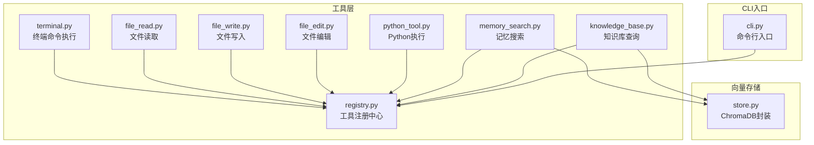
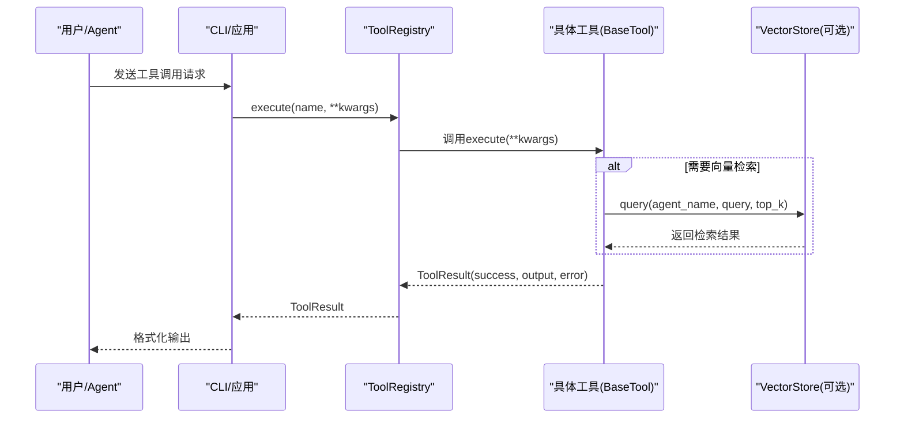
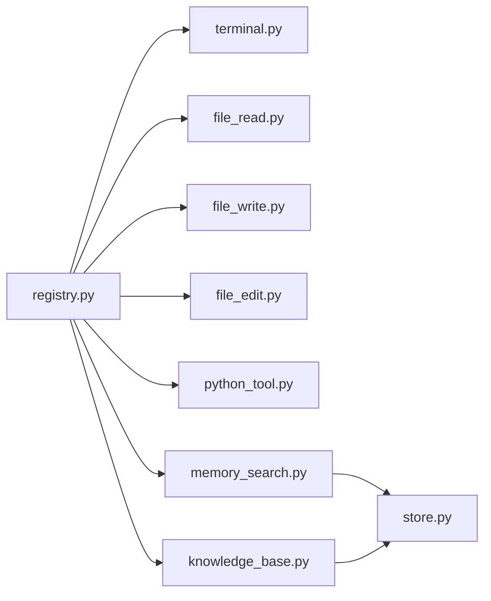

# 内置工具详解

<cite>
**本文引用的文件**
- [terminal.py](file://cbhcli_pkg/tools/terminal.py)
- [file_read.py](file://cbhcli_pkg/tools/file_read.py)
- [file_write.py](file://cbhcli_pkg/tools/file_write.py)
- [file_edit.py](file://cbhcli_pkg/tools/file_edit.py)
- [python_tool.py](file://cbhcli_pkg/tools/python_tool.py)
- [memory_search.py](file://cbhcli_pkg/tools/memory_search.py)
- [knowledge_base.py](file://cbhcli_pkg/tools/knowledge_base.py)
- [registry.py](file://cbhcli_pkg/tools/registry.py)
- [store.py](file://cbhcli_pkg/vector/store.py)
- [cli.py](file://cbhcli_pkg/cli.py)
- [requirements.txt](file://requirements.txt)
</cite>

## 目录
1. [简介](#简介)
2. [项目结构](#项目结构)
3. [核心组件](#核心组件)
4. [架构总览](#架构总览)
5. [详细组件分析](#详细组件分析)
6. [依赖分析](#依赖分析)
7. [性能考量](#性能考量)
8. [故障排查指南](#故障排查指南)
9. [结论](#结论)
10. [附录](#附录)

## 简介
本文件面向CBHCLI内置工具系统，围绕7种内置工具进行深入技术说明：terminal终端命令执行工具、file_read文件读取工具、file_write文件创建/覆盖工具、file_edit精确字符串替换工具、python_tool Python代码执行工具、memory_search语义搜索工具、knowledge_base知识库查询工具。文档涵盖各工具的API接口、参数规范、返回值格式、错误处理与安全考虑，并提供最佳实践与性能优化建议。

## 项目结构
CBHCLI采用模块化设计，工具层位于cbhcli_pkg/tools，统一通过工具注册中心进行管理；向量检索能力由cbhcli_pkg/vector/store封装ChromaDB实现。

图表来源
- [terminal.py:1-99](file://cbhcli_pkg/tools/terminal.py#L1-L99)
- [file_read.py:1-125](file://cbhcli_pkg/tools/file_read.py#L1-L125)
- [file_write.py:1-83](file://cbhcli_pkg/tools/file_write.py#L1-L83)
- [file_edit.py:1-134](file://cbhcli_pkg/tools/file_edit.py#L1-L134)
- [python_tool.py:1-207](file://cbhcli_pkg/tools/python_tool.py#L1-L207)
- [memory_search.py:1-177](file://cbhcli_pkg/tools/memory_search.py#L1-L177)
- [knowledge_base.py:1-157](file://cbhcli_pkg/tools/knowledge_base.py#L1-L157)
- [registry.py:1-115](file://cbhcli_pkg/tools/registry.py#L1-L115)
- [store.py:1-156](file://cbhcli_pkg/vector/store.py#L1-L156)
- [cli.py:1-112](file://cbhcli_pkg/cli.py#L1-L112)

章节来源
- [cli.py:60-68](file://cbhcli_pkg/cli.py#L60-L68)

## 核心组件
- 工具抽象与注册中心：所有工具均继承自BaseTool，统一通过ToolRegistry进行注册、查找与执行，返回ToolResult结构化结果。
- 工具结果数据结构：ToolResult包含success、output、error、metadata字段，便于上层统一处理。
- 向量存储：VectorStore封装ChromaDB，支持自定义嵌入函数，提供add_documents与query方法，用于知识库与记忆搜索。

章节来源
- [registry.py:7-14](file://cbhcli_pkg/tools/registry.py#L7-L14)
- [registry.py:16-48](file://cbhcli_pkg/tools/registry.py#L16-L48)
- [registry.py:51-115](file://cbhcli_pkg/tools/registry.py#L51-L115)
- [store.py:37-156](file://cbhcli_pkg/vector/store.py#L37-L156)

## 架构总览
工具执行流程：CLI或Agent调用ToolRegistry.execute，根据工具名获取具体工具实例，调用其execute方法，最终返回ToolResult。知识库与记忆搜索工具通过VectorStore访问ChromaDB，支持可选重排序。

图表来源
- [registry.py:70-96](file://cbhcli_pkg/tools/registry.py#L70-L96)
- [knowledge_base.py:49-121](file://cbhcli_pkg/tools/knowledge_base.py#L49-L121)
- [memory_search.py:47-103](file://cbhcli_pkg/tools/memory_search.py#L47-L103)
- [store.py:128-156](file://cbhcli_pkg/vector/store.py#L128-L156)

## 详细组件分析

### terminal 终端命令执行工具
- 功能概述：执行任意shell命令，支持多命令链式执行（以“&&”分隔），具备超时控制与错误输出聚合。
- 安全机制与命令过滤：当前实现直接调用shell执行，未内置命令白名单/黑名单过滤；建议在生产环境配合系统级沙箱或容器隔离策略。
- API接口
  - 名称：terminal
  - 参数：
    - command: string（必填）- 要执行的shell命令
    - timeout: integer（可选，默认30秒）- 超时时间
  - 返回：ToolResult.success为布尔，ToolResult.output为标准输出与错误输出拼接，ToolResult.error包含错误详情
- 错误处理：超时返回错误；非零退出码返回失败；异常捕获并返回错误信息
- 最佳实践：谨慎使用危险命令；合理设置timeout；对敏感系统命令建议在受控环境中运行

章节来源
- [terminal.py:31-99](file://cbhcli_pkg/tools/terminal.py#L31-L99)

### file_read 文件读取工具
- 功能概述：读取文件内容，支持~展开为家目录，支持指定行范围输出，自动统计总行数与显示范围。
- 编码处理：以UTF-8编码读取；若文件非UTF-8，返回解码错误
- 大小限制：按行读取，未设置字节上限；大文件可能导致内存压力
- API接口
  - 名称：read
  - 参数：
    - file_path: string（必填）- 文件路径
    - start_line: integer（可选）- 起始行号（从1开始）
    - end_line: integer（可选）- 结束行号
  - 返回：ToolResult.success为布尔，ToolResult.output为格式化文本（含文件信息、行号列表等）
- 错误处理：文件不存在、非文件、解码错误、其他异常均返回错误
- 最佳实践：优先使用绝对路径或~展开；对大文件使用行范围参数；确保文件为UTF-8编码

章节来源
- [file_read.py:38-125](file://cbhcli_pkg/tools/file_read.py#L38-L125)

### file_write 文件创建/覆盖工具
- 功能概述：创建新文件或覆盖现有文件，自动创建父目录，统计字符数与行数。
- 权限检查与路径验证：未显式检查权限；通过Path.exists判断目标是否存在；mkdir(parents=True, exist_ok=True)确保父目录存在
- API接口
  - 名称：write
  - 参数：
    - file_path: string（必填）- 文件路径（支持~）
    - content: string（必填）- 内容
  - 返回：ToolResult.success为布尔，ToolResult.output为创建/覆盖信息与统计
- 错误处理：异常捕获并返回错误
- 最佳实践：谨慎覆盖重要文件；必要时先使用read确认内容；确保磁盘空间充足

章节来源
- [file_write.py:34-83](file://cbhcli_pkg/tools/file_write.py#L34-L83)

### file_edit 精确字符串替换工具
- 功能概述：在文件中精确替换指定字符串，要求old_str全局唯一；支持统计字符变化与行数变化。
- 正则表达式支持：未使用正则，采用精确字符串查找与替换
- 备份机制：未实现自动备份；如需备份，请在编辑前手动复制文件
- API接口
  - 名称：edit
  - 参数：
    - file_path: string（必填）- 文件路径（支持~）
    - old_str: string（必填）- 要替换的原始文本（必须唯一）
    - new_str: string（必填）- 新文本
  - 返回：ToolResult.success为布尔，ToolResult.output为编辑摘要
- 错误处理：未找到匹配、匹配重复、异常均返回错误；未找到时提供可能的行号提示
- 最佳实践：提供足够上下文使old_str唯一；编辑前先read确认；对关键文件先备份

章节来源
- [file_edit.py:38-134](file://cbhcli_pkg/tools/file_edit.py#L38-L134)

### python_tool Python代码执行工具
- 功能概述：执行Python代码，支持会话记忆（同一会话中变量与导入模块持久化），具备输出捕获与错误收集。
- 沙箱隔离：未实现系统级沙箱；通过捕获stdout/stderr与全局命名空间隔离实现有限隔离
- 超时控制：参数接收timeout但当前实现未生效
- API接口
  - 名称：python
  - 参数：
    - code: string（必填）- Python代码
    - timeout: integer（可选，默认30秒）- 超时时间（当前未生效）
  - 返回：ToolResult.success为布尔，ToolResult.output为标准输出，ToolResult.error为标准错误
- 错误处理：异常捕获并附加异常类型与信息
- 最佳实践：避免执行高风险代码；合理设置会话ID；必要时使用/reset或/new切换会话；谨慎使用全局命名空间

章节来源
- [python_tool.py:127-207](file://cbhcli_pkg/tools/python_tool.py#L127-L207)
- [python_tool.py:8-101](file://cbhcli_pkg/tools/python_tool.py#L8-L101)

### memory_search 语义搜索工具
- 功能概述：对Agent的历史知识内容（不包括对话历史）进行语义检索，支持向量搜索与降级方案（memory.md关键词匹配）。
- 向量检索：通过VectorStore.query执行，返回top_k条结果
- 结果排序：向量检索按距离/分数排序；降级方案按关键词匹配度排序
- API接口
  - 名称：memory_search
  - 参数：
    - query: string（必填）- 搜索查询
    - top_k: integer（可选，默认5）- 返回结果数量
    - agent_name: string（可选）- Agent名称（缺省时自动获取）
  - 返回：ToolResult.success为布尔，ToolResult.output为格式化结果
- 错误处理：Agent名称缺失、向量数据库不可用、异常均返回错误
- 最佳实践：确保已建立向量索引；合理设置top_k；使用/kb add添加知识源；必要时使用/fallback降级方案

章节来源
- [memory_search.py:47-177](file://cbhcli_pkg/tools/memory_search.py#L47-L177)

### knowledge_base 知识库查询工具
- 功能概述：查询Agent的知识库内容，支持向量检索与可选重排序（rerank）。
- ChromaDB集成：通过VectorStore.query执行，支持元数据返回与重排序
- 查询优化：可选重排序客户端提升相关性排序质量
- API接口
  - 名称：knowledge_base
  - 参数：
    - query: string（必填）- 搜索查询
    - top_k: integer（可选，默认5）- 返回结果数量
    - agent_name: string（可选）- Agent名称（缺省时自动获取）
  - 返回：ToolResult.success为布尔，ToolResult.output为格式化结果（含来源、相关度、文档）
- 错误处理：Agent名称缺失、向量数据库未启用、异常均返回错误
- 最佳实践：安装并配置chromadb；使用/rerank配置重排序模型；定期/kb reindex更新索引

章节来源
- [knowledge_base.py:49-157](file://cbhcli_pkg/tools/knowledge_base.py#L49-L157)
- [store.py:128-156](file://cbhcli_pkg/vector/store.py#L128-L156)

## 依赖分析
- 工具层依赖：各工具仅依赖registry.py提供的BaseTool与ToolResult，耦合度低，扩展性强
- 向量存储依赖：knowledge_base与memory_search依赖VectorStore；VectorStore依赖ChromaDB与嵌入客户端
- CLI依赖：cli.py列出可用工具，供用户参考

图表来源
- [registry.py:51-115](file://cbhcli_pkg/tools/registry.py#L51-L115)
- [knowledge_base.py:9-22](file://cbhcli_pkg/tools/knowledge_base.py#L9-L22)
- [memory_search.py:9-20](file://cbhcli_pkg/tools/memory_search.py#L9-L20)
- [store.py:37-98](file://cbhcli_pkg/vector/store.py#L37-L98)

章节来源
- [requirements.txt:1-7](file://requirements.txt#L1-L7)

## 性能考量
- 终端命令：建议设置合理timeout，避免长时间阻塞；对批量命令使用“&&”合并执行减少子进程开销
- 文件读取：大文件建议使用行范围参数；避免一次性读取超大文件导致内存压力
- 文件写入：覆盖大文件时注意磁盘I/O；必要时分块写入
- 文件编辑：精确替换适合小规模文本；大规模替换建议使用专用编辑器或批处理脚本
- Python执行：避免在单一会话中累积过多全局变量；必要时使用/reset清理
- 向量检索：合理设置top_k；定期/kb reindex；使用/rerank提升相关性；确保嵌入模型性能稳定

## 故障排查指南
- 未知工具：ToolRegistry.execute返回“未知工具”错误，检查工具名称是否正确
- 终端命令超时：调整timeout参数；检查命令是否陷入死循环
- 文件读取解码错误：确认文件编码为UTF-8；必要时转换编码
- 文件编辑未找到匹配：提供更明确的old_str上下文；使用read定位文本位置
- Python执行异常：查看ToolResult.error中的异常类型与信息；避免高风险操作
- 知识库未启用：安装chromadb并配置嵌入模型；使用/kb add与/embedding index建立索引
- 向量搜索无结果：检查Agent名称与索引状态；使用/kb status与/embedding status查看

章节来源
- [registry.py:81-96](file://cbhcli_pkg/tools/registry.py#L81-L96)
- [terminal.py:56-66](file://cbhcli_pkg/tools/terminal.py#L56-L66)
- [file_read.py:113-124](file://cbhcli_pkg/tools/file_read.py#L113-L124)
- [file_edit.py:77-100](file://cbhcli_pkg/tools/file_edit.py#L77-L100)
- [python_tool.py:93-96](file://cbhcli_pkg/tools/python_tool.py#L93-L96)
- [knowledge_base.py:73-78](file://cbhcli_pkg/tools/knowledge_base.py#L73-L78)
- [memory_search.py:70-73](file://cbhcli_pkg/tools/memory_search.py#L70-L73)

## 结论
CBHCLI内置工具体系以统一的工具抽象与注册中心为核心，结合向量检索能力，提供了从系统操作到知识管理的完整工具链。各工具在功能与安全性之间寻求平衡，建议在生产环境中配合系统级沙箱、权限控制与监控策略，以获得更高的安全性与稳定性。

## 附录
- 可选依赖：chromadb用于语义搜索，tiktoken用于精确token计数
- 工具清单：terminal、read、write、edit、python、memory_search、knowledge_base

章节来源
- [requirements.txt:5-7](file://requirements.txt#L5-L7)
- [cli.py:60-68](file://cbhcli_pkg/cli.py#L60-L68)