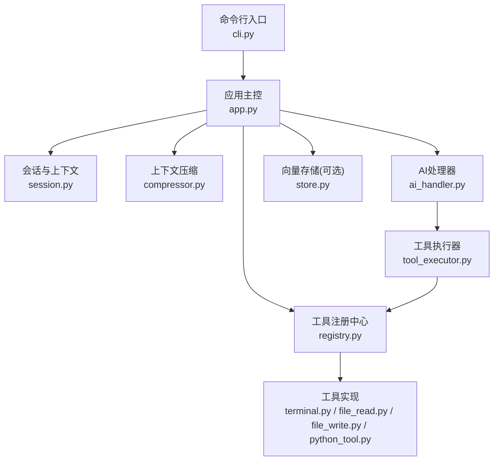
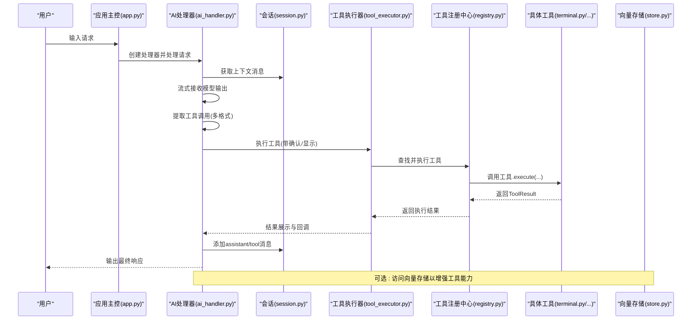
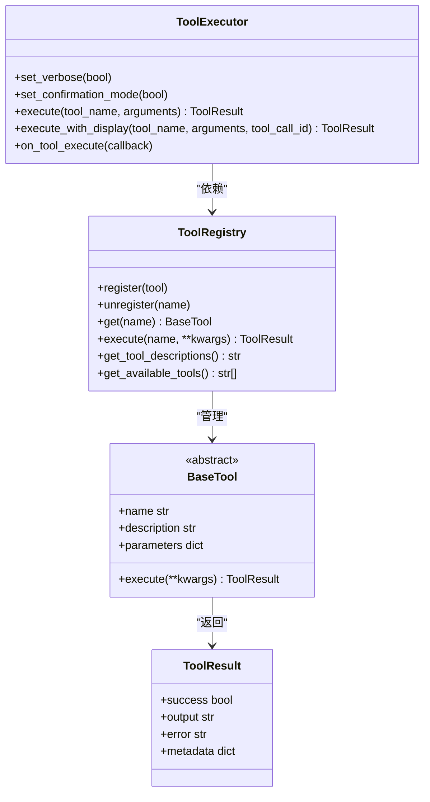
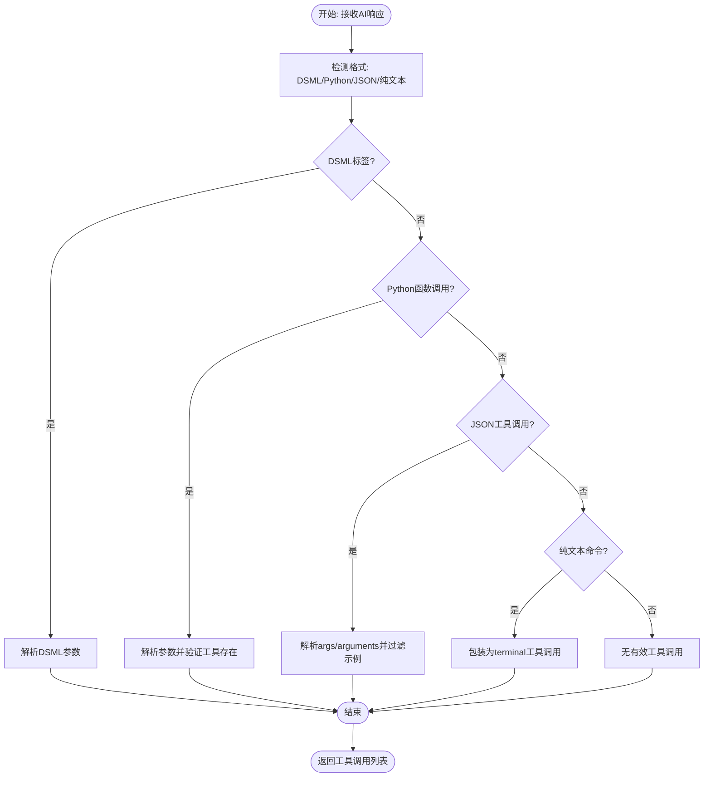
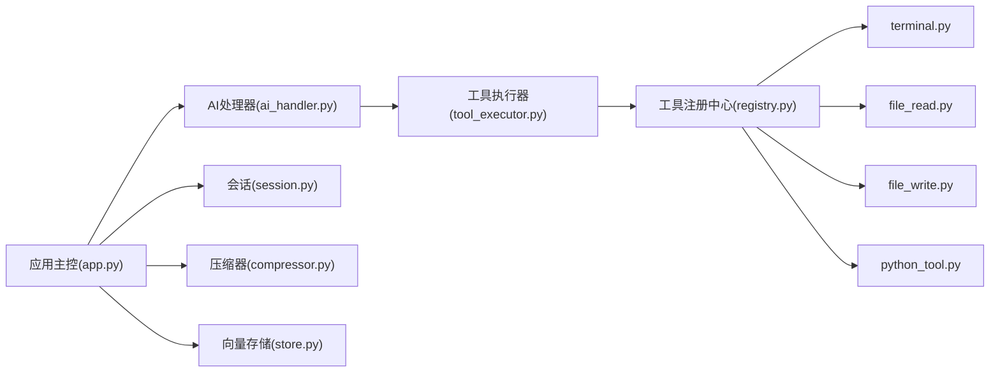

# 工具执行与自动化决策

<cite>
**本文引用的文件**
- [tool_executor.py](file://cbhcli_pkg/core/tool_executor.py)
- [registry.py](file://cbhcli_pkg/tools/registry.py)
- [ai_handler.py](file://cbhcli_pkg/core/ai_handler.py)
- [app.py](file://cbhcli_pkg/core/app.py)
- [terminal.py](file://cbhcli_pkg/tools/terminal.py)
- [file_read.py](file://cbhcli_pkg/tools/file_read.py)
- [file_write.py](file://cbhcli_pkg/tools/file_write.py)
- [python_tool.py](file://cbhcli_pkg/tools/python_tool.py)
- [constants.py](file://cbhcli_pkg/core/constants.py)
- [errors.py](file://cbhcli_pkg/core/errors.py)
- [compressor.py](file://cbhcli_pkg/context/compressor.py)
- [store.py](file://cbhcli_pkg/vector/store.py)
- [session.py](file://cbhcli_pkg/core/session.py)
- [cli.py](file://cbhcli_pkg/cli.py)
- [global_config.py](file://cbhcli_pkg/config/global_config.py)
</cite>

## 目录
1. [简介](#简介)
2. [项目结构](#项目结构)
3. [核心组件](#核心组件)
4. [架构总览](#架构总览)
5. [详细组件分析](#详细组件分析)
6. [依赖分析](#依赖分析)
7. [性能考虑](#性能考虑)
8. [故障排查指南](#故障排查指南)
9. [结论](#结论)
10. [附录](#附录)

## 简介
本文件面向开发者与高级用户，系统阐述 CBHCLI 工具执行与自动化决策机制。重点覆盖：
- AI 如何自动识别与选择合适工具进行执行（工具调用提取与决策算法、触发条件）
- 工具执行的上下文环境与参数传递机制
- 并发控制与资源管理策略
- 执行结果处理与反馈机制
- 监控与日志记录方案
- 错误恢复与重试机制
- 性能监控与优化策略
- 安全审计与访问控制机制

## 项目结构
CBHCLI 采用“应用层-会话与上下文-AI处理器-工具注册与执行”的分层设计。核心模块包括：
- 应用入口与交互循环：负责启动、命令解析、Agent/会话管理
- 会话与上下文：维护消息序列、Token统计与压缩
- AI处理器：负责与大模型交互、流式输出、工具调用提取与调度
- 工具系统：统一注册、执行、结果封装；内置多种工具
- 上下文压缩：基于LLM的摘要压缩，降低Token占用
- 向量存储：可选的嵌入与检索能力，增强工具能力

图表来源
- [cli.py:73-112](file://cbhcli_pkg/cli.py#L73-L112)
- [app.py:54-478](file://cbhcli_pkg/core/app.py#L54-L478)
- [session.py:37-190](file://cbhcli_pkg/core/session.py#L37-L190)
- [compressor.py:7-112](file://cbhcli_pkg/context/compressor.py#L7-L112)
- [ai_handler.py:21-743](file://cbhcli_pkg/core/ai_handler.py#L21-L743)
- [tool_executor.py:15-168](file://cbhcli_pkg/core/tool_executor.py#L15-L168)
- [registry.py:51-115](file://cbhcli_pkg/tools/registry.py#L51-L115)
- [terminal.py:7-99](file://cbhcli_pkg/tools/terminal.py#L7-L99)
- [file_read.py:6-125](file://cbhcli_pkg/tools/file_read.py#L6-L125)
- [file_write.py:6-83](file://cbhcli_pkg/tools/file_write.py#L6-L83)
- [python_tool.py:127-207](file://cbhcli_pkg/tools/python_tool.py#L127-L207)
- [store.py:37-175](file://cbhcli_pkg/vector/store.py#L37-L175)

章节来源
- [cli.py:1-112](file://cbhcli_pkg/cli.py#L1-L112)
- [app.py:54-478](file://cbhcli_pkg/core/app.py#L54-L478)

## 核心组件
- 工具注册中心与工具基类：统一管理工具生命周期、参数Schema与执行结果封装
- 工具执行器：负责工具调用前确认、执行、结果展示与回调
- AI处理器：负责与LLM交互、流式输出、工具调用提取（多格式）、多轮工具调用协调
- 会话与上下文：消息结构、Token统计、上下文压缩阈值与触发
- 上下文压缩器：基于摘要的上下文压缩，降低Token占用
- 向量存储：可选的嵌入与检索能力，支撑记忆与知识库工具
- 应用主控：初始化配置、工具注册、命令路由、Agent/会话管理、运行循环

章节来源
- [registry.py:7-115](file://cbhcli_pkg/tools/registry.py#L7-L115)
- [tool_executor.py:15-168](file://cbhcli_pkg/core/tool_executor.py#L15-L168)
- [ai_handler.py:21-743](file://cbhcli_pkg/core/ai_handler.py#L21-L743)
- [session.py:8-190](file://cbhcli_pkg/core/session.py#L8-L190)
- [compressor.py:7-112](file://cbhcli_pkg/context/compressor.py#L7-L112)
- [store.py:37-175](file://cbhcli_pkg/vector/store.py#L37-L175)
- [app.py:54-478](file://cbhcli_pkg/core/app.py#L54-L478)

## 架构总览
CBHCLI 的工具执行链路如下：
- 用户输入经应用主控进入AI处理器
- AI处理器流式接收模型输出，同时提取工具调用
- 工具调用经执行器确认后执行，并将结果作为“tool”消息回注入会话
- 会话上下文在必要时触发压缩，维持Token预算
- 可选的向量存储为记忆与知识库工具提供支撑

图表来源
- [ai_handler.py:51-96](file://cbhcli_pkg/core/ai_handler.py#L51-L96)
- [ai_handler.py:664-735](file://cbhcli_pkg/core/ai_handler.py#L664-L735)
- [tool_executor.py:42-91](file://cbhcli_pkg/core/tool_executor.py#L42-L91)
- [registry.py:70-96](file://cbhcli_pkg/tools/registry.py#L70-L96)
- [session.py:83-90](file://cbhcli_pkg/core/session.py#L83-L90)
- [store.py:128-160](file://cbhcli_pkg/vector/store.py#L128-L160)

## 详细组件分析

### 工具注册与执行体系
- 工具注册中心提供统一注册、查找、执行与描述导出能力
- 工具基类定义名称、描述、参数Schema与执行接口
- 工具执行器负责：
  - 工具调用前确认（可跳过确认）
  - 执行与结果展示（预览长度、详细模式）
  - 回调通知（可用于外部监控）

图表来源
- [registry.py:51-115](file://cbhcli_pkg/tools/registry.py#L51-L115)
- [tool_executor.py:24-91](file://cbhcli_pkg/core/tool_executor.py#L24-L91)

章节来源
- [registry.py:7-115](file://cbhcli_pkg/tools/registry.py#L7-L115)
- [tool_executor.py:15-168](file://cbhcli_pkg/core/tool_executor.py#L15-L168)

### AI工具调用提取与决策算法
AI处理器负责：
- 多轮工具调用协调与上下文强化提示
- 流式输出处理与“思考/推理/内容”三段式区分
- 工具调用提取（严格验证与优先级）：
  - DSML标签格式
  - Python函数调用格式（严格匹配）
  - JSON工具调用（支持args/arguments）
  - 纯文本命令（仅多轮后自动包装为terminal）
- 参数解析（支持keyword/JSON/无名参数映射）
- 去重与OpenAI格式tool_calls生成
- 将工具结果注入会话，继续下一轮

图表来源
- [ai_handler.py:264-502](file://cbhcli_pkg/core/ai_handler.py#L264-L502)
- [ai_handler.py:504-576](file://cbhcli_pkg/core/ai_handler.py#L504-L576)
- [ai_handler.py:578-662](file://cbhcli_pkg/core/ai_handler.py#L578-L662)

章节来源
- [ai_handler.py:98-216](file://cbhcli_pkg/core/ai_handler.py#L98-L216)
- [ai_handler.py:264-502](file://cbhcli_pkg/core/ai_handler.py#L264-L502)
- [ai_handler.py:504-576](file://cbhcli_pkg/core/ai_handler.py#L504-L576)
- [ai_handler.py:578-662](file://cbhcli_pkg/core/ai_handler.py#L578-L662)

### 工具执行上下文与参数传递
- 上下文消息结构包含角色、内容、Token计数、工具调用信息与关联ID
- 会话在每轮开始时获取上下文消息并传入LLM
- 工具执行器在执行前进行确认与展示，执行后将结果以“tool”消息形式回注入会话
- 工具参数通过JSON Schema定义，执行器在展示时进行预览与截断

章节来源
- [session.py:8-34](file://cbhcli_pkg/core/session.py#L8-L34)
- [session.py:83-90](file://cbhcli_pkg/core/session.py#L83-L90)
- [tool_executor.py:93-160](file://cbhcli_pkg/core/tool_executor.py#L93-L160)
- [constants.py:13-16](file://cbhcli_pkg/core/constants.py#L13-L16)

### 并发控制与资源管理
- 工具执行器内部未实现并发队列或锁，单轮内顺序执行工具调用
- 工具执行器支持“跳过确认”，便于批量执行
- 上下文压缩器在会话Token接近阈值时触发摘要压缩，降低后续调用成本
- Token预算与阈值由上下文窗口管理，压缩后替换消息列表

章节来源
- [tool_executor.py:38-41](file://cbhcli_pkg/core/tool_executor.py#L38-L41)
- [compressor.py:21-81](file://cbhcli_pkg/context/compressor.py#L21-L81)
- [session.py:127-190](file://cbhcli_pkg/core/session.py#L127-L190)

### 执行结果处理与反馈机制
- 工具执行器在执行后进行结果展示，支持简洁/详细两种模式
- 对于成功与失败分别进行不同颜色与前缀提示
- 执行器提供回调钩子，可用于外部监控与审计
- 工具结果作为“tool”消息加入会话，供后续LLM参考

章节来源
- [tool_executor.py:142-160](file://cbhcli_pkg/core/tool_executor.py#L142-L160)
- [ai_handler.py:716-735](file://cbhcli_pkg/core/ai_handler.py#L716-L735)

### 监控与日志记录方案
- 工具执行器提供回调钩子，签名包含工具名、参数、结果与调用ID，可用于外部监控系统采集
- 应用主控在处理请求时可设置记忆更新回调，便于持久化与审计
- 控制台输出包含工具调用预览、执行结果与错误信息，便于本地调试

章节来源
- [tool_executor.py:161-168](file://cbhcli_pkg/core/tool_executor.py#L161-L168)
- [app.py:436-437](file://cbhcli_pkg/core/app.py#L436-L437)
- [ai_handler.py:136-198](file://cbhcli_pkg/core/ai_handler.py#L136-L198)

### 错误恢复与重试机制
- 工具执行器捕获异常并返回ToolResult，避免中断流程
- 终端工具支持超时控制，超时后返回错误信息
- Python工具捕获标准输出/错误流，异常时返回详细错误
- 应用层对模型未配置、上下文超限等异常进行分类处理

章节来源
- [registry.py:89-96](file://cbhcli_pkg/tools/registry.py#L89-L96)
- [terminal.py:56-66](file://cbhcli_pkg/tools/terminal.py#L56-L66)
- [python_tool.py:93-96](file://cbhcli_pkg/tools/python_tool.py#L93-L96)
- [errors.py:4-32](file://cbhcli_pkg/core/errors.py#L4-L32)

### 性能监控与优化策略
- Token预算与压缩：通过上下文窗口阈值与摘要压缩降低Token占用
- 输出截断：工具输出与展示均有限制，避免长输出影响性能
- 多轮限制：最大工具调用轮数限制，防止无限循环
- 参数解析优化：严格解析减少无效调用

章节来源
- [constants.py:6-16](file://cbhcli_pkg/core/constants.py#L6-L16)
- [compressor.py:21-81](file://cbhcli_pkg/context/compressor.py#L21-L81)
- [ai_handler.py:68-96](file://cbhcli_pkg/core/ai_handler.py#L68-L96)

### 安全审计与访问控制机制
- 工具调用提取严格验证（格式、工具存在性、参数过滤），避免示例代码被误执行
- 终端工具执行命令需显式调用，且支持超时控制
- 应用主控提供命令路由与Agent隔离，不同Agent拥有独立工作空间与会话
- 可选的向量存储与知识库工具需显式配置嵌入模型，避免未授权访问

章节来源
- [ai_handler.py:357-406](file://cbhcli_pkg/core/ai_handler.py#L357-L406)
- [ai_handler.py:417-502](file://cbhcli_pkg/core/ai_handler.py#L417-L502)
- [terminal.py:31-99](file://cbhcli_pkg/tools/terminal.py#L31-L99)
- [app.py:231-280](file://cbhcli_pkg/core/app.py#L231-L280)
- [global_config.py:117-149](file://cbhcli_pkg/config/global_config.py#L117-L149)

## 依赖分析
- 工具注册中心与工具执行器之间为松耦合依赖，通过工具名查找与执行
- AI处理器依赖工具执行器与会话，负责上下文拼接与工具调用调度
- 应用主控负责装配各组件，提供命令路由与Agent/会话管理
- 上下文压缩器与会话紧密协作，按阈值触发压缩
- 向量存储为可选依赖，仅在配置嵌入模型后启用

图表来源
- [ai_handler.py:45-49](file://cbhcli_pkg/core/ai_handler.py#L45-L49)
- [tool_executor.py:24-29](file://cbhcli_pkg/core/tool_executor.py#L24-L29)
- [registry.py:54-69](file://cbhcli_pkg/tools/registry.py#L54-L69)
- [app.py:85-96](file://cbhcli_pkg/core/app.py#L85-L96)
- [compressor.py:10-19](file://cbhcli_pkg/context/compressor.py#L10-L19)
- [store.py:40-62](file://cbhcli_pkg/vector/store.py#L40-L62)

章节来源
- [ai_handler.py:21-743](file://cbhcli_pkg/core/ai_handler.py#L21-L743)
- [tool_executor.py:15-168](file://cbhcli_pkg/core/tool_executor.py#L15-L168)
- [registry.py:51-115](file://cbhcli_pkg/tools/registry.py#L51-L115)
- [app.py:54-478](file://cbhcli_pkg/core/app.py#L54-L478)
- [compressor.py:7-112](file://cbhcli_pkg/context/compressor.py#L7-L112)
- [store.py:37-175](file://cbhcli_pkg/vector/store.py#L37-L175)

## 性能考虑
- Token预算与压缩：通过上下文窗口阈值与摘要压缩降低Token占用，提升长对话稳定性
- 输出截断：工具输出与展示均有限制，避免长输出影响性能
- 多轮限制：最大工具调用轮数限制，防止无限循环
- 参数解析优化：严格解析减少无效调用
- 超时控制：终端工具超时保护，避免长时间阻塞

章节来源
- [constants.py:6-16](file://cbhcli_pkg/core/constants.py#L6-L16)
- [compressor.py:21-81](file://cbhcli_pkg/context/compressor.py#L21-L81)
- [ai_handler.py:68-96](file://cbhcli_pkg/core/ai_handler.py#L68-L96)
- [terminal.py:56-66](file://cbhcli_pkg/tools/terminal.py#L56-L66)

## 故障排查指南
- 模型未配置：应用主控在缺少模型时提示使用命令配置模型
- 工具不存在：工具执行器返回未知工具错误
- 工具执行失败：捕获异常并返回错误信息，包含详细输出
- 终端命令超时：返回超时错误与输出
- 上下文超限：触发压缩或提示用户清理会话
- 命令行入口：通过CLI入口查看帮助与版本信息

章节来源
- [app.py:412-414](file://cbhcli_pkg/core/app.py#L412-L414)
- [registry.py:82-96](file://cbhcli_pkg/tools/registry.py#L82-L96)
- [terminal.py:56-66](file://cbhcli_pkg/tools/terminal.py#L56-L66)
- [errors.py:9-21](file://cbhcli_pkg/core/errors.py#L9-L21)
- [cli.py:73-112](file://cbhcli_pkg/cli.py#L73-L112)

## 结论
CBHCLI 的工具执行机制以“严格格式提取 + 统一注册执行 + 会话与上下文管理”为核心，结合上下文压缩与可选向量存储，实现了稳定、可控、可观测的自动化工具执行流程。开发者可通过回调钩子与命令系统扩展工具集与工作流，同时借助严格的工具调用验证与超时控制保障安全性与可靠性。

## 附录
- 常用工具
  - terminal：执行shell命令（支持超时）
  - read/write：文件读取/写入（支持行范围）
  - python：执行Python代码（带会话记忆）
- 常量与配置
  - 工具调用轮数、输出长度、温度等
  - 全局配置文件位置与字段

章节来源
- [terminal.py:31-99](file://cbhcli_pkg/tools/terminal.py#L31-L99)
- [file_read.py:38-125](file://cbhcli_pkg/tools/file_read.py#L38-L125)
- [file_write.py:34-83](file://cbhcli_pkg/tools/file_write.py#L34-L83)
- [python_tool.py:170-207](file://cbhcli_pkg/tools/python_tool.py#L170-L207)
- [constants.py:13-22](file://cbhcli_pkg/core/constants.py#L13-L22)
- [global_config.py:20-48](file://cbhcli_pkg/config/global_config.py#L20-L48)