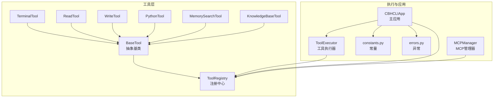
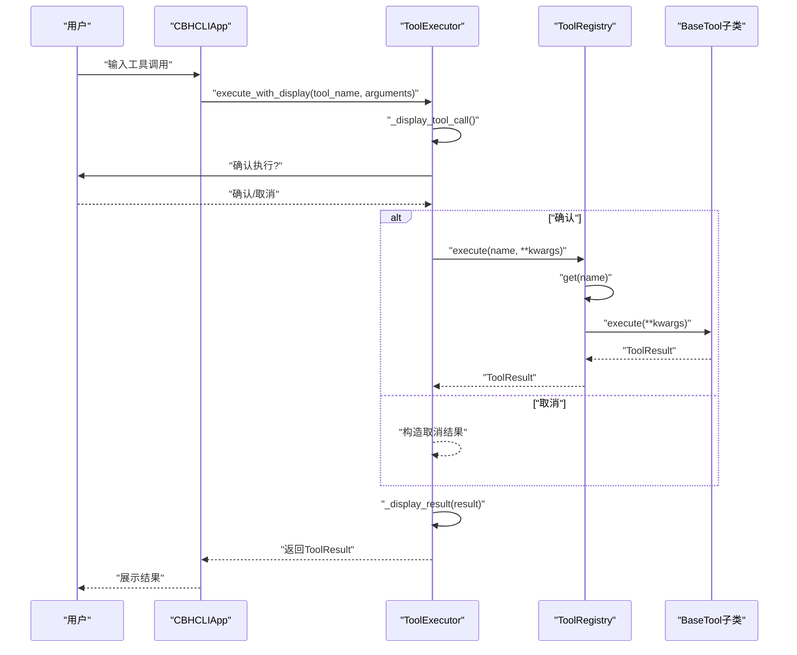
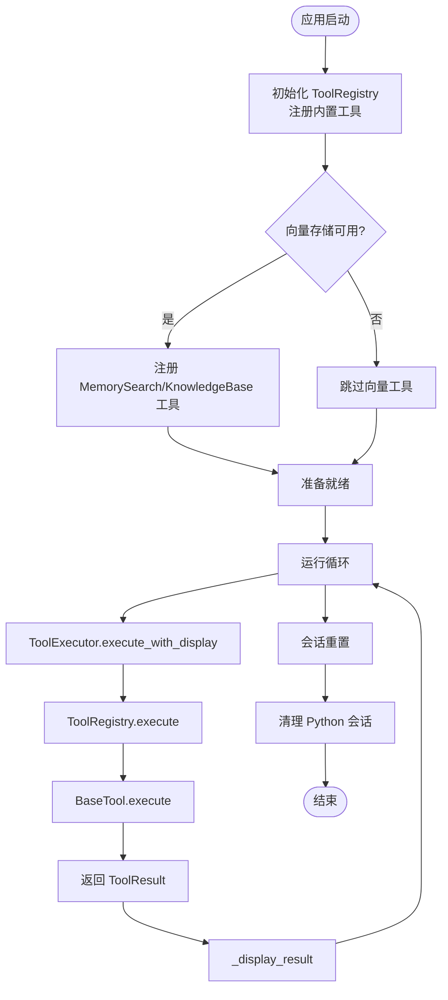
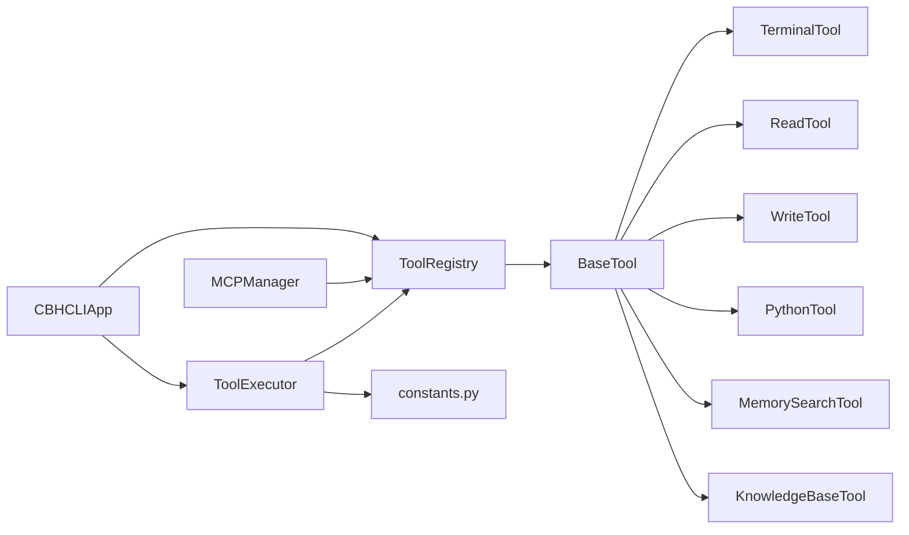

# 工具架构与注册机制

<cite>
**本文引用的文件**
- [registry.py](file://cbhcli_pkg/tools/registry.py)
- [base.py](file://cbhcli_pkg/tools/base.py)
- [tool_executor.py](file://cbhcli_pkg/core/tool_executor.py)
- [app.py](file://cbhcli_pkg/core/app.py)
- [constants.py](file://cbhcli_pkg/core/constants.py)
- [errors.py](file://cbhcli_pkg/core/errors.py)
- [python_tool.py](file://cbhcli_pkg/tools/python_tool.py)
- [terminal.py](file://cbhcli_pkg/tools/terminal.py)
- [file_read.py](file://cbhcli_pkg/tools/file_read.py)
- [file_write.py](file://cbhcli_pkg/tools/file_write.py)
- [memory_search.py](file://cbhcli_pkg/tools/memory_search.py)
- [knowledge_base.py](file://cbhcli_pkg/tools/knowledge_base.py)
- [mcp_manager.py](file://cbhcli_pkg/core/mcp_manager.py)
</cite>

## 目录
1. [简介](#简介)
2. [项目结构](#项目结构)
3. [核心组件](#核心组件)
4. [架构总览](#架构总览)
5. [详细组件分析](#详细组件分析)
6. [依赖关系分析](#依赖关系分析)
7. [性能考量](#性能考量)
8. [故障排查指南](#故障排查指南)
9. [结论](#结论)
10. [附录](#附录)

## 简介
本技术文档围绕 CBHCLI 的工具架构与注册机制展开，重点阐述 ToolRegistry 注册中心的设计理念与实现细节，包括工具的注册、注销、查找与执行流程；BaseTool 抽象基类的接口规范；ToolResult 结果对象的数据结构与使用场景；工具生命周期管理（从创建到销毁）；工具注册的最佳实践与性能考虑；以及工具接口的版本兼容性与扩展性设计。文档同时提供面向开发者的二次开发指导。

## 项目结构
CBHCLI 的工具体系位于 tools 子包，核心抽象与注册中心集中在 tools/registry.py；具体工具实现位于同一目录下的多个模块；工具执行器位于 core/tool_executor.py，并由主应用 core/app.py 在启动阶段完成工具注册与初始化；常量与错误类型分别位于 core/constants.py 与 core/errors.py 中；MCP 工具适配通过 core/mcp_manager.py 动态接入并注册到注册中心。

图表来源
- [registry.py:51-115](file://cbhcli_pkg/tools/registry.py#L51-L115)
- [tool_executor.py:15-168](file://cbhcli_pkg/core/tool_executor.py#L15-L168)
- [app.py:85-95](file://cbhcli_pkg/core/app.py#L85-L95)
- [constants.py:1-50](file://cbhcli_pkg/core/constants.py#L1-L50)
- [errors.py:1-32](file://cbhcli_pkg/core/errors.py#L1-L32)
- [mcp_manager.py:196-342](file://cbhcli_pkg/core/mcp_manager.py#L196-L342)

章节来源
- [registry.py:1-115](file://cbhcli_pkg/tools/registry.py#L1-L115)
- [tool_executor.py:1-168](file://cbhcli_pkg/core/tool_executor.py#L1-L168)
- [app.py:85-95](file://cbhcli_pkg/core/app.py#L85-L95)
- [constants.py:1-50](file://cbhcli_pkg/core/constants.py#L1-L50)
- [errors.py:1-32](file://cbhcli_pkg/core/errors.py#L1-L32)
- [mcp_manager.py:196-342](file://cbhcli_pkg/core/mcp_manager.py#L196-L342)

## 核心组件
- ToolRegistry：统一管理工具集合，提供注册、注销、查找与执行能力，并生成工具描述清单与可用工具列表。
- BaseTool：抽象基类，定义工具的标准接口，包括 name、description、parameters 属性与 execute 方法。
- ToolResult：标准化的工具执行结果对象，包含 success、output、error、metadata 字段。
- ToolExecutor：封装工具执行前的确认、执行与结果展示逻辑，负责与注册中心交互。
- 具体工具：如 TerminalTool、ReadTool、WriteTool、PythonTool、MemorySearchTool、KnowledgeBaseTool 等，均继承 BaseTool 并实现各自业务逻辑。
- MCPManager：动态连接外部 MCP 服务器并将工具适配为 BaseTool 实例后注册到 ToolRegistry。

章节来源
- [registry.py:7-115](file://cbhcli_pkg/tools/registry.py#L7-L115)
- [tool_executor.py:15-168](file://cbhcli_pkg/core/tool_executor.py#L15-L168)
- [mcp_manager.py:196-342](file://cbhcli_pkg/core/mcp_manager.py#L196-L342)

## 架构总览
工具架构采用“抽象基类 + 注册中心 + 执行器”的分层设计。应用启动时，主应用初始化 ToolRegistry 并注册内置工具；随后根据配置可选地注册向量检索工具；MCP 管理器可在运行期动态接入外部工具并注册到注册中心。工具执行器负责与用户交互、确认执行、调用注册中心并格式化输出。

图表来源
- [tool_executor.py:54-91](file://cbhcli_pkg/core/tool_executor.py#L54-L91)
- [registry.py:70-96](file://cbhcli_pkg/tools/registry.py#L70-L96)
- [app.py:422-439](file://cbhcli_pkg/core/app.py#L422-L439)

## 详细组件分析

### ToolRegistry 注册中心
- 设计理念
  - 单例式工具容器，以工具名作为唯一标识，便于快速查找与执行。
  - 统一封装工具执行的错误处理与结果包装，保证上层调用的一致性。
  - 提供工具描述聚合与可用工具列表，用于系统提示与 UI 展示。
- 关键方法
  - register：将 BaseTool 实例按 name 注册到内部字典。
  - unregister：按 name 注销工具。
  - get：按 name 获取工具实例。
  - execute：执行工具并捕获异常，返回 ToolResult。
  - get_tool_descriptions：拼接所有工具的 name/description/parameters。
  - get_available_tools：返回可用工具名列表。
- 复杂度
  - 注册/注销/查找均为 O(1) 字典操作。
  - execute 包含一次查找与一次方法调用，整体 O(1)。
- 错误处理
  - 未知工具：返回 success=False 的 ToolResult。
  - 工具执行异常：捕获异常并返回包含错误信息的 ToolResult。
- 版本兼容性与扩展性
  - 通过 BaseTool 接口约束，新增工具只需实现标准属性与方法即可无缝接入。
  - 支持动态注册（如 MCPManager），便于插件化扩展。

章节来源
- [registry.py:51-115](file://cbhcli_pkg/tools/registry.py#L51-L115)

### BaseTool 抽象基类与 ToolResult
- BaseTool 接口规范
  - name：工具唯一标识，字符串。
  - description：工具描述，用于系统提示与帮助。
  - parameters：JSON Schema 格式的参数定义，描述必填字段与类型。
  - execute：接收 kwargs 参数，返回 ToolResult。
- ToolResult 数据结构
  - success：布尔值，表示执行是否成功。
  - output：字符串，包含工具输出内容。
  - error：可选字符串，包含错误信息。
  - metadata：可选字典，承载额外元数据。
- 使用场景
  - 所有工具必须返回 ToolResult，确保上层统一处理。
  - ToolExecutor 依据 success 控制输出样式与长度截断。

章节来源
- [registry.py:16-49](file://cbhcli_pkg/tools/registry.py#L16-L49)
- [registry.py:7-14](file://cbhcli_pkg/tools/registry.py#L7-L14)

### ToolExecutor 工具执行器
- 职责
  - 工具调用前的确认与展示。
  - 调用 ToolRegistry.execute 执行工具。
  - 结果格式化与输出控制（长度截断、预览模式）。
  - 支持回调钩子 on_tool_execute。
- 关键行为
  - execute_with_display：展示调用与结果，支持 verbose 模式。
  - _confirm_execution：支持 all 跳过后续确认。
  - _display_result：根据 success 输出不同颜色与格式。
  - _get_tool_preview：针对 terminal/read/write 等工具生成简要预览。
- 性能与安全
  - 输出截断常量来自 constants.py，避免过长输出影响 UI 与性能。
  - 对 terminal 工具支持超时与错误处理，防止阻塞。

章节来源
- [tool_executor.py:15-168](file://cbhcli_pkg/core/tool_executor.py#L15-L168)
- [constants.py:10-16](file://cbhcli_pkg/core/constants.py#L10-L16)

### 具体工具实现要点
- TerminalTool
  - 参数：command（必需）。
  - 执行：subprocess 执行 shell 命令，支持超时与错误码处理。
  - 输出：合并 stdout/stderr，成功时 success=True，失败时包含详细错误。
- ReadTool
  - 参数：file_path（必需），start_line、end_line（可选）。
  - 执行：读取文件内容，支持行范围与 UTF-8 校验。
  - 输出：包含统计信息与带行号的内容块。
- WriteTool
  - 参数：file_path（必需）、content（必需）。
  - 执行：创建/覆盖文件，自动创建父目录。
  - 输出：包含创建/覆盖提示与统计信息。
- PythonTool
  - 特性：基于全局会话池维护变量状态，支持 /reset 或 /new 新会话。
  - 执行：编译并执行代码，捕获 stdout/stderr，构建 ToolResult。
  - 输出：若无输出则返回“执行成功，无输出”。
- MemorySearchTool / KnowledgeBaseTool
  - 参数：query（必需）、top_k（可选，默认5）。
  - 执行：优先使用向量检索；若不可用则降级为本地 memory.md 文本匹配。
  - 输出：格式化检索结果，包含来源、相关度等信息。

章节来源
- [terminal.py:7-99](file://cbhcli_pkg/tools/terminal.py#L7-L99)
- [file_read.py:6-125](file://cbhcli_pkg/tools/file_read.py#L6-L125)
- [file_write.py:6-83](file://cbhcli_pkg/tools/file_write.py#L6-L83)
- [python_tool.py:127-207](file://cbhcli_pkg/tools/python_tool.py#L127-L207)
- [memory_search.py:6-177](file://cbhcli_pkg/tools/memory_search.py#L6-L177)
- [knowledge_base.py:6-157](file://cbhcli_pkg/tools/knowledge_base.py#L6-L157)

### 工具生命周期管理
- 创建
  - 应用启动时，主应用在 _init_tools 中创建 ToolRegistry 并注册内置工具。
  - 若向量存储可用，再注册 MemorySearchTool 与 KnowledgeBaseTool。
- 运行
  - ToolExecutor 通过 ToolRegistry.execute 调用工具。
  - MCPManager 可在运行期动态注册/注销外部工具适配器。
- 销毁
  - 会话重置时，调用 remove_python_session 清理 Python 会话状态。
  - 注销工具可通过 ToolRegistry.unregister(name) 实现。

图表来源
- [app.py:85-150](file://cbhcli_pkg/core/app.py#L85-L150)
- [tool_executor.py:54-91](file://cbhcli_pkg/core/tool_executor.py#L54-L91)
- [registry.py:70-96](file://cbhcli_pkg/tools/registry.py#L70-L96)
- [python_tool.py:120-125](file://cbhcli_pkg/tools/python_tool.py#L120-L125)

章节来源
- [app.py:85-150](file://cbhcli_pkg/core/app.py#L85-L150)
- [tool_executor.py:54-91](file://cbhcli_pkg/core/tool_executor.py#L54-L91)
- [python_tool.py:120-125](file://cbhcli_pkg/tools/python_tool.py#L120-L125)

### MCP 工具集成与动态注册
- MCPManager 通过连接外部服务器，拉取工具清单并适配为 BaseTool 实例，随后注册到 ToolRegistry。
- 支持启用/禁用单个工具与批量重注册，保证运行期灵活扩展。

章节来源
- [mcp_manager.py:196-342](file://cbhcli_pkg/core/mcp_manager.py#L196-L342)

## 依赖关系分析
- 组件耦合
  - ToolExecutor 依赖 ToolRegistry 与 constants.py 中的输出控制常量。
  - 具体工具依赖 BaseTool 与 ToolResult。
  - 主应用在启动阶段集中注册工具，形成强耦合但职责清晰。
  - MCPManager 通过适配器模式解耦外部工具源。
- 外部依赖
  - subprocess 用于 TerminalTool。
  - pathlib 用于文件工具。
  - 向量检索依赖 VectorStore 与 EmbeddingClient/RerankClient（可选）。

图表来源
- [tool_executor.py:15-168](file://cbhcli_pkg/core/tool_executor.py#L15-L168)
- [registry.py:51-115](file://cbhcli_pkg/tools/registry.py#L51-L115)
- [app.py:85-95](file://cbhcli_pkg/core/app.py#L85-L95)
- [mcp_manager.py:196-342](file://cbhcli_pkg/core/mcp_manager.py#L196-L342)

章节来源
- [tool_executor.py:15-168](file://cbhcli_pkg/core/tool_executor.py#L15-L168)
- [registry.py:51-115](file://cbhcli_pkg/tools/registry.py#L51-L115)
- [app.py:85-95](file://cbhcli_pkg/core/app.py#L85-L95)
- [mcp_manager.py:196-342](file://cbhcli_pkg/core/mcp_manager.py#L196-L342)

## 性能考量
- 输出截断
  - MAX_TOOL_OUTPUT_LENGTH 与 TOOL_PREVIEW_LENGTH 控制输出长度，避免 UI 卡顿与内存占用过高。
- 超时与安全
  - TerminalTool 支持超时，防止长时间阻塞。
  - ToolExecutor 的预览模式在 verbose=false 时缩短输出，提升交互响应速度。
- 工具选择
  - 仅在需要时注册向量检索工具，减少初始化成本。
- 会话管理
  - PythonTool 的会话池需在合适时机清理，避免变量累积导致内存增长。

章节来源
- [constants.py:10-16](file://cbhcli_pkg/core/constants.py#L10-L16)
- [terminal.py:56-66](file://cbhcli_pkg/tools/terminal.py#L56-L66)
- [tool_executor.py:142-159](file://cbhcli_pkg/core/tool_executor.py#L142-L159)

## 故障排查指南
- 工具未找到
  - 现象：ToolRegistry.execute 返回 success=False，error 包含“未知工具”。
  - 排查：确认工具是否已注册，名称是否正确。
- 工具执行失败
  - 现象：ToolRegistry.execute 捕获异常并返回 ToolResult(error)。
  - 排查：查看工具内部异常信息，检查参数与权限。
- 终端命令失败
  - 现象：返回非零退出码与错误详情。
  - 排查：检查命令语法、环境变量与权限。
- 文件读写异常
  - 现象：文件不存在、非文件或编码错误。
  - 排查：确认路径与权限，检查文件编码。
- 向量检索不可用
  - 现象：MemorySearchTool 降级为本地搜索，KnowledgeBaseTool 返回未启用提示。
  - 排查：检查嵌入模型配置与向量存储初始化。

章节来源
- [registry.py:81-96](file://cbhcli_pkg/tools/registry.py#L81-L96)
- [terminal.py:82-91](file://cbhcli_pkg/tools/terminal.py#L82-L91)
- [file_read.py:55-69](file://cbhcli_pkg/tools/file_read.py#L55-L69)
- [file_write.py:49-57](file://cbhcli_pkg/tools/file_write.py#L49-L57)
- [knowledge_base.py:72-78](file://cbhcli_pkg/tools/knowledge_base.py#L72-L78)
- [memory_search.py:70-74](file://cbhcli_pkg/tools/memory_search.py#L70-L74)

## 结论
CBHCLI 的工具架构以 BaseTool 为核心抽象，通过 ToolRegistry 实现统一注册与执行，结合 ToolExecutor 提升用户体验与安全性。该设计具备良好的扩展性与版本兼容性：新增工具只需遵循接口规范即可无缝接入；MCPManager 支持运行期动态扩展；输出截断与超时机制保障性能与稳定性。开发者可据此进行二次开发与定制。

## 附录
- 最佳实践
  - 工具命名：使用清晰、稳定的 name，避免冲突。
  - 参数定义：严格遵循 JSON Schema，明确必填项与类型。
  - 错误处理：在工具内部捕获异常并返回 ToolResult，避免抛出未处理异常。
  - 输出控制：合理利用 ToolExecutor 的预览与截断策略。
  - 生命周期：在会话重置或应用关闭时清理会话状态与资源。
- 版本兼容性与扩展性
  - 通过 BaseTool 接口约束，确保工具升级不影响上层调用。
  - MCPManager 的适配器模式允许第三方工具以统一方式接入。
  - ToolRegistry 的 O(1) 查找与执行，适合大规模工具集合。