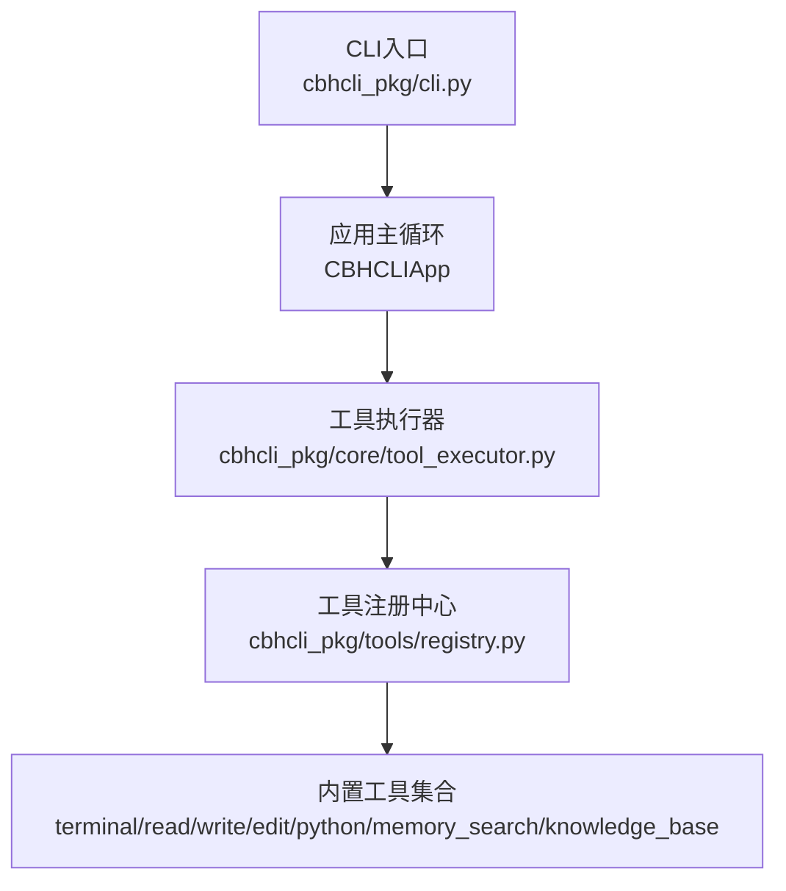
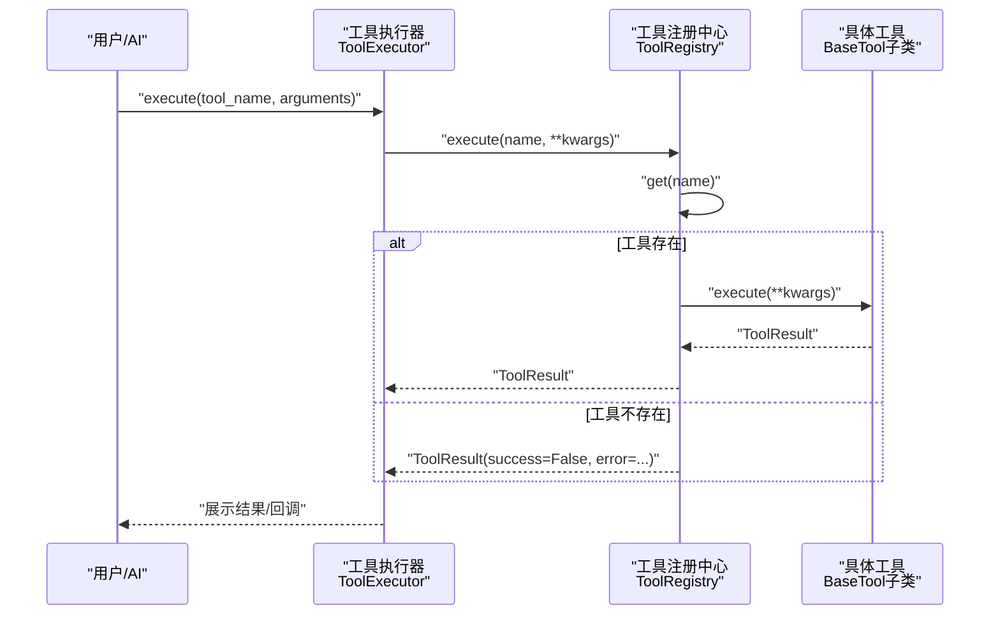
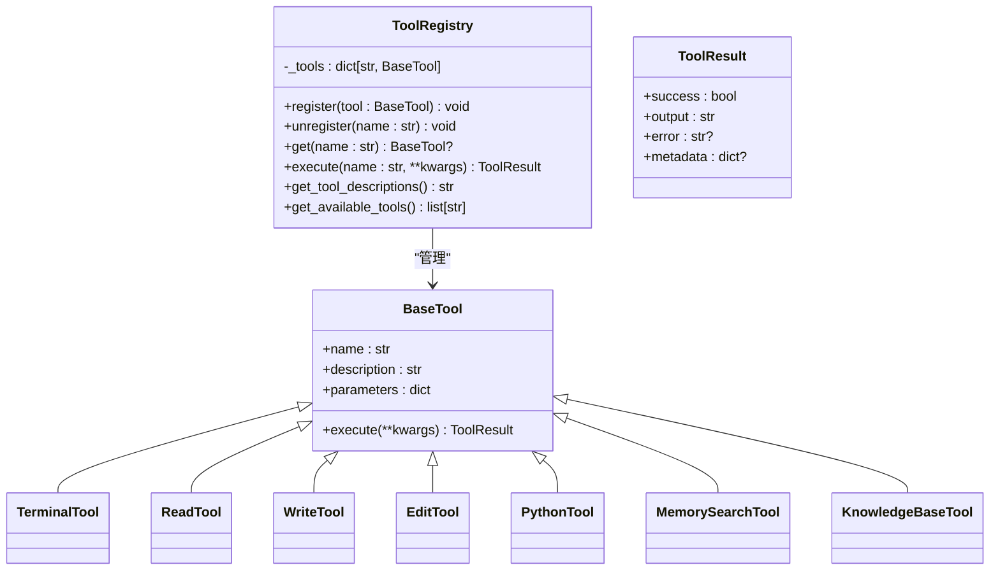
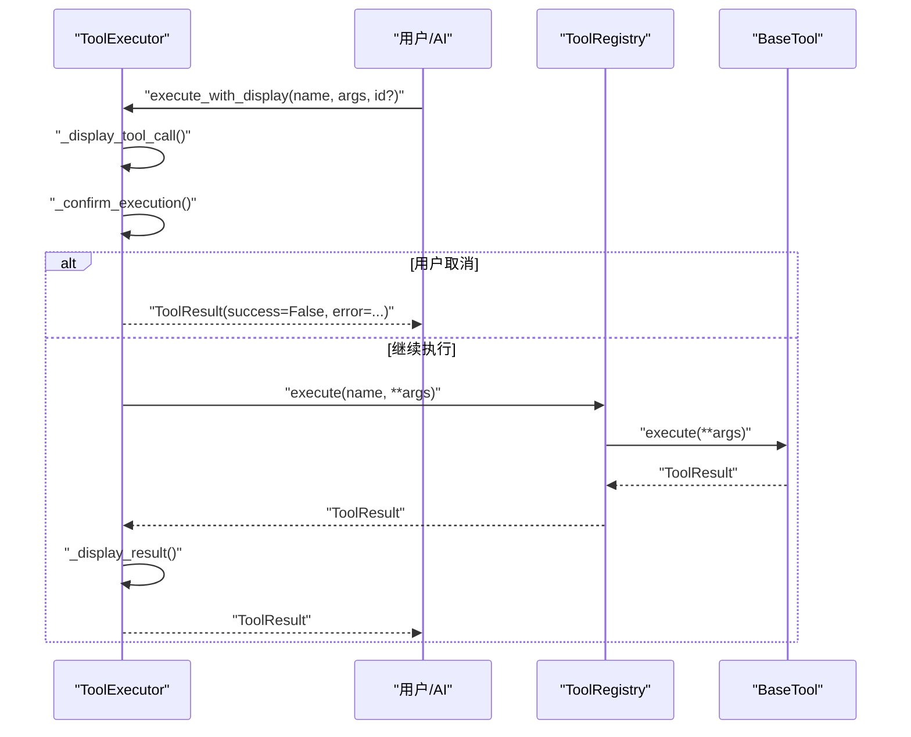
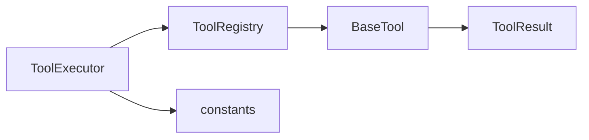

# 工具系统详解

<cite>
**本文引用的文件**   
- [README.md](file://README.md)
- [cbhcli_pkg/tools/registry.py](file://cbhcli_pkg/tools/registry.py)
- [cbhcli_pkg/tools/base.py](file://cbhcli_pkg/tools/base.py)
- [cbhcli_pkg/tools/terminal.py](file://cbhcli_pkg/tools/terminal.py)
- [cbhcli_pkg/tools/file_read.py](file://cbhcli_pkg/tools/file_read.py)
- [cbhcli_pkg/tools/file_write.py](file://cbhcli_pkg/tools/file_write.py)
- [cbhcli_pkg/tools/file_edit.py](file://cbhcli_pkg/tools/file_edit.py)
- [cbhcli_pkg/tools/python_tool.py](file://cbhcli_pkg/tools/python_tool.py)
- [cbhcli_pkg/tools/memory_search.py](file://cbhcli_pkg/tools/memory_search.py)
- [cbhcli_pkg/tools/knowledge_base.py](file://cbhcli_pkg/tools/knowledge_base.py)
- [cbhcli_pkg/core/tool_executor.py](file://cbhcli_pkg/core/tool_executor.py)
- [cbhcli_pkg/core/constants.py](file://cbhcli_pkg/core/constants.py)
- [cbhcli_pkg/cli.py](file://cbhcli_pkg/cli.py)
</cite>

## 目录
1. [简介](#简介)
2. [项目结构](#项目结构)
3. [核心组件](#核心组件)
4. [架构总览](#架构总览)
5. [详细组件分析](#详细组件分析)
6. [依赖分析](#依赖分析)
7. [性能考虑](#性能考虑)
8. [故障排查指南](#故障排查指南)
9. [结论](#结论)
10. [附录](#附录)

## 简介
本文件面向CBHCLI工具系统，提供全面的技术文档，涵盖工具注册与执行机制、工具生命周期管理、7种内置工具的实现细节与使用规范、性能与限制、以及自定义工具开发指南。目标读者既包括需要快速上手的使用者，也包括希望扩展与定制的开发者。

## 项目结构
CBHCLI采用“核心模块 + 工具模块”的分层设计。工具模块位于cbhcli_pkg/tools，核心执行逻辑位于cbhcli_pkg/core。CLI入口负责参数解析与启动应用。

图表来源
- [cbhcli_pkg/cli.py:73-112](file://cbhcli_pkg/cli.py#L73-L112)
- [cbhcli_pkg/core/tool_executor.py:15-168](file://cbhcli_pkg/core/tool_executor.py#L15-L168)
- [cbhcli_pkg/tools/registry.py:51-115](file://cbhcli_pkg/tools/registry.py#L51-L115)

章节来源
- [README.md:269-296](file://README.md#L269-L296)
- [cbhcli_pkg/cli.py:73-112](file://cbhcli_pkg/cli.py#L73-L112)

## 核心组件
- 工具注册中心：统一管理工具的注册、注销、查找与执行，并提供工具描述聚合与可用工具列表。
- 工具基类：定义工具的标准接口（名称、描述、参数Schema、执行方法），确保所有工具行为一致。
- 工具执行器：负责工具调用前的确认、执行、结果展示与回调；控制输出长度与预览长度。
- 常量定义：集中管理工具调用相关阈值（最大轮次、输出截断长度等）。

章节来源
- [cbhcli_pkg/tools/registry.py:51-115](file://cbhcli_pkg/tools/registry.py#L51-L115)
- [cbhcli_pkg/tools/base.py:1-3](file://cbhcli_pkg/tools/base.py#L1-L3)
- [cbhcli_pkg/core/tool_executor.py:15-168](file://cbhcli_pkg/core/tool_executor.py#L15-L168)
- [cbhcli_pkg/core/constants.py:10-16](file://cbhcli_pkg/core/constants.py#L10-L16)

## 架构总览
工具系统遵循“注册中心 + 执行器 + 工具实现”的分层架构。AI或用户通过工具执行器发起调用，执行器委托注册中心定位具体工具并执行，最终返回标准化的结果对象。

图表来源
- [cbhcli_pkg/core/tool_executor.py:42-91](file://cbhcli_pkg/core/tool_executor.py#L42-L91)
- [cbhcli_pkg/tools/registry.py:70-96](file://cbhcli_pkg/tools/registry.py#L70-L96)

## 详细组件分析

### 工具注册与生命周期
- 注册：工具实现BaseTool后，由外部代码调用注册中心的register方法完成注册。
- 查找：通过名称从注册中心获取工具实例。
- 执行：执行器调用注册中心的execute，内部再调用工具的execute方法。
- 错误处理：未知工具与执行异常均被包装为ToolResult，保证上层一致性。
- 描述聚合：注册中心可生成所有工具的描述文本，便于系统提示。

图表来源
- [cbhcli_pkg/tools/registry.py:16-115](file://cbhcli_pkg/tools/registry.py#L16-L115)

章节来源
- [cbhcli_pkg/tools/registry.py:51-115](file://cbhcli_pkg/tools/registry.py#L51-L115)

### 工具执行器与交互流程
- 输入确认：支持跳过确认、批量确认与交互确认。
- 预览展示：针对特定工具（如terminal、read/write/edit）提供简短预览。
- 输出控制：根据常量限制输出长度，避免过长结果影响交互体验。
- 回调机制：执行完成后触发回调，便于日志或统计。

图表来源
- [cbhcli_pkg/core/tool_executor.py:54-160](file://cbhcli_pkg/core/tool_executor.py#L54-L160)
- [cbhcli_pkg/core/constants.py:13-16](file://cbhcli_pkg/core/constants.py#L13-L16)

章节来源
- [cbhcli_pkg/core/tool_executor.py:15-168](file://cbhcli_pkg/core/tool_executor.py#L15-L168)
- [cbhcli_pkg/core/constants.py:10-16](file://cbhcli_pkg/core/constants.py#L10-L16)

### 终端工具（terminal）
- 功能：执行任意shell命令，支持超时控制与多命令链式执行。
- 参数规范：
  - command: 字符串，必填，要执行的shell命令。
  - timeout: 整数，可选，默认30秒。
- 返回值：ToolResult，成功时包含标准输出与错误输出，失败时包含错误详情。
- 错误处理：超时、非零退出码、异常均封装为错误信息。
- 性能与限制：受系统资源与超时限制影响；建议合理设置timeout。

章节来源
- [cbhcli_pkg/tools/terminal.py:31-99](file://cbhcli_pkg/tools/terminal.py#L31-L99)

### 文件读取工具（read）
- 功能：读取文件内容，支持指定行范围；自动展开~为家目录；UTF-8解码。
- 参数规范：
  - file_path: 字符串，必填，文件路径。
  - start_line: 整数，可选，起始行（从1开始）。
  - end_line: 整数，可选，结束行。
- 返回值：ToolResult，成功时输出带行号的文件内容与统计信息。
- 错误处理：文件不存在、非文件、编码错误、其他异常均返回错误。
- 性能与限制：按行读取，适合中小文件；大文件建议分段读取或使用其他工具。

章节来源
- [cbhcli_pkg/tools/file_read.py:38-125](file://cbhcli_pkg/tools/file_read.py#L38-L125)

### 文件写入工具（write）
- 功能：创建新文件或覆盖现有文件；自动创建父目录。
- 参数规范：
  - file_path: 字符串，必填，目标路径。
  - content: 字符串，必填，写入内容。
- 返回值：ToolResult，成功时输出创建/覆盖信息与字符数、行数统计。
- 错误处理：异常统一捕获并返回错误。
- 性能与限制：小到中等文本写入高效；注意覆盖风险。

章节来源
- [cbhcli_pkg/tools/file_write.py:34-83](file://cbhcli_pkg/tools/file_write.py#L34-L83)

### 文件编辑工具（edit）
- 功能：在文件中进行精确字符串替换，要求old_str唯一匹配。
- 参数规范：
  - file_path: 字符串，必填，目标文件。
  - old_str: 字符串，必填，要替换的原始文本。
  - new_str: 字符串，必填，新文本。
- 返回值：ToolResult，成功时输出替换摘要与行数变化。
- 错误处理：未找到匹配、匹配不唯一、异常均返回错误；未找到时提供可能行号提示。
- 性能与限制：全文扫描，适合小到中等文件；大文件谨慎使用。

章节来源
- [cbhcli_pkg/tools/file_edit.py:38-134](file://cbhcli_pkg/tools/file_edit.py#L38-L134)

### Python工具（python）
- 功能：执行Python代码，支持会话记忆（同一会话内变量与导入持久化）。
- 参数规范：
  - code: 字符串，必填，要执行的Python代码。
  - timeout: 整数，可选，超时秒数（当前实现未强制生效）。
- 会话管理：通过全局会话存储按session_id隔离状态；支持重置与移除。
- 返回值：ToolResult，成功时输出标准输出，失败时输出标准错误与异常信息。
- 错误处理：编译/执行异常被捕获并返回错误。
- 性能与限制：受限于解释器性能与内存；建议分步执行复杂任务。

章节来源
- [cbhcli_pkg/tools/python_tool.py:108-207](file://cbhcli_pkg/tools/python_tool.py#L108-L207)

### 记忆搜索工具（memory_search）
- 功能：对Agent的向量化知识内容进行语义搜索（不包含对话历史）。
- 参数规范：
  - query: 字符串，必填，搜索查询。
  - top_k: 整数，可选，默认5，返回结果数量。
  - agent_name: 字符串，可选，Agent名称；缺省时尝试从应用实例获取。
- 降级策略：当向量数据库不可用时，从memory.md进行关键词匹配。
- 返回值：ToolResult，成功时输出格式化的搜索结果；失败时返回错误。
- 错误处理：Agent名称缺失、向量搜索异常、文件读取异常均返回错误。
- 性能与限制：依赖向量检索效率；memory.md降级方案适合小规模内容。

章节来源
- [cbhcli_pkg/tools/memory_search.py:47-177](file://cbhcli_pkg/tools/memory_search.py#L47-L177)

### 知识库工具（knowledge_base）
- 功能：查询Agent的知识库内容，支持重排序优化。
- 参数规范：
  - query: 字符串，必填，搜索查询。
  - top_k: 整数，可选，默认5，返回结果数量。
  - agent_name: 字符串，可选，Agent名称；缺省时尝试从应用实例获取。
- 重排序：若配置重排序客户端且结果多于1条，则进行重排序。
- 返回值：ToolResult，成功时输出带来源、相关度与内容的格式化结果。
- 错误处理：向量数据库未启用、查询异常均返回错误。
- 性能与限制：依赖向量数据库与重排序模型；建议合理设置top_k。

章节来源
- [cbhcli_pkg/tools/knowledge_base.py:49-157](file://cbhcli_pkg/tools/knowledge_base.py#L49-L157)

## 依赖分析
- 工具执行器依赖工具注册中心与常量定义，负责展示与控制流程。
- 工具实现依赖注册中心的基类与结果对象，确保行为一致。
- 工具之间无直接耦合，通过注册中心解耦，便于扩展与维护。

图表来源
- [cbhcli_pkg/core/tool_executor.py:6-12](file://cbhcli_pkg/core/tool_executor.py#L6-L12)
- [cbhcli_pkg/tools/registry.py:2-5](file://cbhcli_pkg/tools/registry.py#L2-L5)

章节来源
- [cbhcli_pkg/core/tool_executor.py:15-168](file://cbhcli_pkg/core/tool_executor.py#L15-L168)
- [cbhcli_pkg/tools/registry.py:51-115](file://cbhcli_pkg/tools/registry.py#L51-L115)

## 性能考虑
- 工具输出截断：工具执行器与常量定义限制了单次输出的最大长度与预览长度，避免界面阻塞与性能问题。
- 超时控制：终端工具提供超时机制，防止长时间阻塞。
- 会话记忆：Python工具的会话状态在内存中累积，建议定期重置或拆分任务。
- 向量检索：知识库与记忆搜索依赖向量数据库，建议合理设置top_k与索引策略。

章节来源
- [cbhcli_pkg/core/constants.py:13-16](file://cbhcli_pkg/core/constants.py#L13-L16)
- [cbhcli_pkg/tools/terminal.py:31-99](file://cbhcli_pkg/tools/terminal.py#L31-L99)
- [cbhcli_pkg/tools/python_tool.py:108-207](file://cbhcli_pkg/tools/python_tool.py#L108-L207)

## 故障排查指南
- 未知工具：注册中心在找不到工具时返回错误，检查工具名称拼写与注册流程。
- 执行失败：工具执行器捕获异常并返回错误信息，查看error字段定位问题。
- 权限与路径：文件相关工具需确认路径与权限；~展开为家目录，注意跨平台差异。
- 超时与阻塞：终端工具超时会终止进程并返回错误；适当调整timeout或拆分命令。
- 向量数据库：知识库与记忆搜索在未启用向量数据库时会返回错误或降级；检查依赖安装与配置。

章节来源
- [cbhcli_pkg/tools/registry.py:81-96](file://cbhcli_pkg/tools/registry.py#L81-L96)
- [cbhcli_pkg/core/tool_executor.py:142-159](file://cbhcli_pkg/core/tool_executor.py#L142-L159)

## 结论
CBHCLI工具系统以注册中心为核心，结合执行器与统一的工具基类，实现了高内聚、低耦合的工具生态。内置工具覆盖终端、文件、Python执行、知识库与记忆搜索等场景，满足日常开发与研究需求。通过清晰的参数Schema与标准化结果对象，系统易于扩展与集成。建议在生产环境中合理配置超时、输出截断与会话清理策略，以获得稳定高效的使用体验。

## 附录

### 自定义工具开发指南
- 继承与实现
  - 继承BaseTool，实现name、description、parameters属性与execute方法。
  - 使用ToolResult封装成功/失败、输出与错误信息。
- 注册流程
  - 在应用初始化阶段调用注册中心的register方法完成注册。
- 最佳实践
  - 明确定义JSON Schema参数，确保AI能够正确构造调用。
  - 控制输出长度，必要时分页或摘要展示。
  - 对外部资源访问（文件、网络）做好异常与超时处理。
  - 如需状态持久化，参考Python工具的会话模式设计。

章节来源
- [cbhcli_pkg/tools/registry.py:16-49](file://cbhcli_pkg/tools/registry.py#L16-L49)
- [cbhcli_pkg/tools/base.py:1-3](file://cbhcli_pkg/tools/base.py#L1-L3)

### 工具调用自动化与决策机制
- 工具描述聚合：注册中心可生成所有工具的描述文本，便于系统提示与AI决策。
- 执行器确认：支持交互确认与批量确认，兼顾安全性与效率。
- 输出控制：通过常量限制输出长度，提升交互体验。
- 回调机制：执行完成后触发回调，便于日志、统计与审计。

章节来源
- [cbhcli_pkg/tools/registry.py:98-110](file://cbhcli_pkg/tools/registry.py#L98-L110)
- [cbhcli_pkg/core/tool_executor.py:13-32](file://cbhcli_pkg/core/tool_executor.py#L13-L32)
- [cbhcli_pkg/core/constants.py:13-16](file://cbhcli_pkg/core/constants.py#L13-L16)