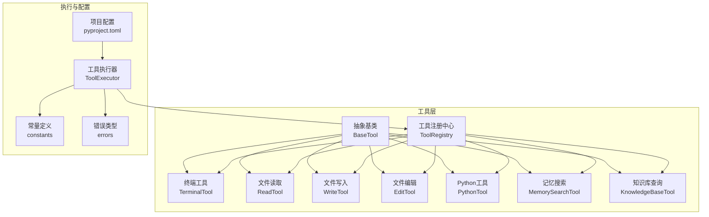
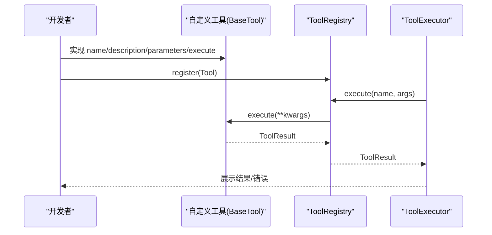
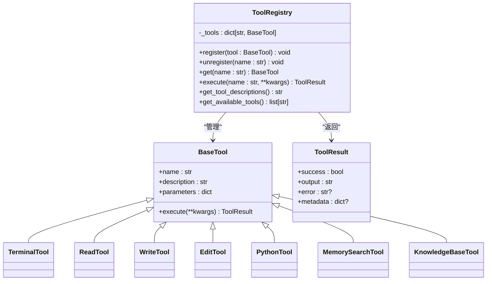
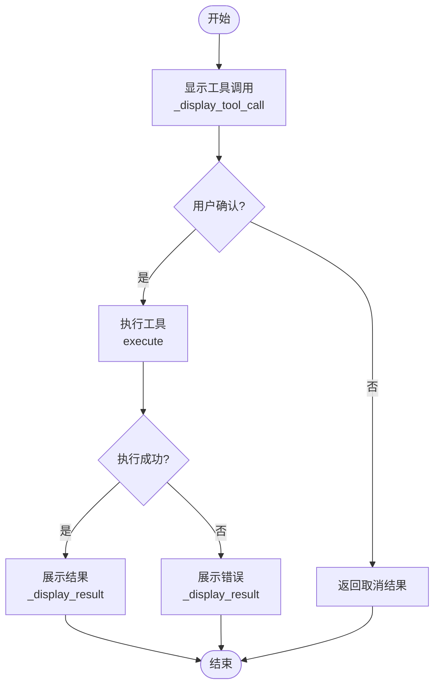
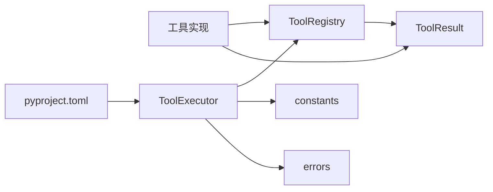

# 自定义工具开发指南

<cite>
**本文引用的文件**
- [README.md](file://README.md)
- [pyproject.toml](file://pyproject.toml)
- [cbhcli_pkg/tools/registry.py](file://cbhcli_pkg/tools/registry.py)
- [cbhcli_pkg/tools/base.py](file://cbhcli_pkg/tools/base.py)
- [cbhcli_pkg/core/tool_executor.py](file://cbhcli_pkg/core/tool_executor.py)
- [cbhcli_pkg/core/constants.py](file://cbhcli_pkg/core/constants.py)
- [cbhcli_pkg/core/errors.py](file://cbhcli_pkg/core/errors.py)
- [cbhcli_pkg/tools/terminal.py](file://cbhcli_pkg/tools/terminal.py)
- [cbhcli_pkg/tools/file_read.py](file://cbhcli_pkg/tools/file_read.py)
- [cbhcli_pkg/tools/file_write.py](file://cbhcli_pkg/tools/file_write.py)
- [cbhcli_pkg/tools/file_edit.py](file://cbhcli_pkg/tools/file_edit.py)
- [cbhcli_pkg/tools/python_tool.py](file://cbhcli_pkg/tools/python_tool.py)
- [cbhcli_pkg/tools/memory_search.py](file://cbhcli_pkg/tools/memory_search.py)
- [cbhcli_pkg/tools/knowledge_base.py](file://cbhcli_pkg/tools/knowledge_base.py)
</cite>

## 目录
1. [简介](#简介)
2. [项目结构](#项目结构)
3. [核心组件](#核心组件)
4. [架构总览](#架构总览)
5. [详细组件分析](#详细组件分析)
6. [依赖分析](#依赖分析)
7. [性能考量](#性能考量)
8. [故障排查指南](#故障排查指南)
9. [结论](#结论)
10. [附录](#附录)

## 简介
本指南面向希望为 CBHCLI 开发自定义工具的开发者，围绕如何继承 BaseTool 抽象基类、实现必要属性与 execute 方法、编写 JSON Schema 参数定义、错误处理与异常管理、调试与测试、性能优化与资源管理、安全与权限控制、以及版本管理与向后兼容性维护等方面提供完整开发流程与最佳实践。文中所有技术细节均来自仓库现有实现，确保可落地、可验证。

## 项目结构
CBHCLI 的工具体系由“工具注册中心”统一管理，工具实现位于 tools 子包，执行器负责工具调用的展示与确认流程，常量与错误类型集中于 core 子包。

图表来源
- [cbhcli_pkg/tools/registry.py:16-115](file://cbhcli_pkg/tools/registry.py#L16-L115)
- [cbhcli_pkg/core/tool_executor.py:15-168](file://cbhcli_pkg/core/tool_executor.py#L15-L168)
- [cbhcli_pkg/core/constants.py:1-50](file://cbhcli_pkg/core/constants.py#L1-L50)
- [cbhcli_pkg/core/errors.py:1-32](file://cbhcli_pkg/core/errors.py#L1-L32)
- [pyproject.toml:1-53](file://pyproject.toml#L1-L53)

章节来源
- [README.md:269-295](file://README.md#L269-L295)
- [pyproject.toml:1-53](file://pyproject.toml#L1-L53)

## 核心组件
- 抽象基类 BaseTool：定义工具的统一接口，包括 name、description、parameters（JSON Schema）、execute 方法。
- 工具注册中心 ToolRegistry：负责工具注册、注销、查找与执行，并统一封装执行异常与未知工具处理。
- 工具执行器 ToolExecutor：负责工具调用前的确认、执行、结果展示与回调；支持预览、详细输出、超长截断等。
- 工具结果 ToolResult：标准化工具执行结果，包含 success、output、error、metadata。
- 常量与错误：统一的工具输出长度、预览长度、颜色控制与自定义异常类型。

章节来源
- [cbhcli_pkg/tools/registry.py:16-115](file://cbhcli_pkg/tools/registry.py#L16-L115)
- [cbhcli_pkg/core/tool_executor.py:15-168](file://cbhcli_pkg/core/tool_executor.py#L15-L168)
- [cbhcli_pkg/core/constants.py:1-50](file://cbhcli_pkg/core/constants.py#L1-L50)
- [cbhcli_pkg/core/errors.py:1-32](file://cbhcli_pkg/core/errors.py#L1-L32)

## 架构总览
工具开发遵循“抽象基类 + 注册中心 + 执行器”的分层架构。开发者只需实现 BaseTool 的四个要素，即可被注册中心统一调度，执行器负责与用户交互与结果展示。

图表来源
- [cbhcli_pkg/tools/registry.py:51-96](file://cbhcli_pkg/tools/registry.py#L51-L96)
- [cbhcli_pkg/core/tool_executor.py:42-91](file://cbhcli_pkg/core/tool_executor.py#L42-L91)

## 详细组件分析

### 抽象基类与注册中心
- BaseTool 规定：
  - name：工具唯一标识，字符串。
  - description：工具用途说明，用于系统提示。
  - parameters：JSON Schema 格式的参数定义，包含 type、properties、required 等。
  - execute：接收 kwargs 并返回 ToolResult。
- ToolRegistry：
  - register/unregister：注册与注销工具。
  - get：按名称获取工具。
  - execute：执行工具并捕获异常，返回 ToolResult。
  - get_tool_descriptions：生成工具清单供系统提示使用。
  - get_available_tools：返回可用工具名列表。

图表来源
- [cbhcli_pkg/tools/registry.py:16-115](file://cbhcli_pkg/tools/registry.py#L16-L115)
- [cbhcli_pkg/tools/terminal.py:7-99](file://cbhcli_pkg/tools/terminal.py#L7-L99)
- [cbhcli_pkg/tools/file_read.py:6-125](file://cbhcli_pkg/tools/file_read.py#L6-L125)
- [cbhcli_pkg/tools/file_write.py:6-83](file://cbhcli_pkg/tools/file_write.py#L6-L83)
- [cbhcli_pkg/tools/file_edit.py:6-134](file://cbhcli_pkg/tools/file_edit.py#L6-L134)
- [cbhcli_pkg/tools/python_tool.py:127-207](file://cbhcli_pkg/tools/python_tool.py#L127-L207)
- [cbhcli_pkg/tools/memory_search.py:6-177](file://cbhcli_pkg/tools/memory_search.py#L6-L177)
- [cbhcli_pkg/tools/knowledge_base.py:6-157](file://cbhcli_pkg/tools/knowledge_base.py#L6-L157)

章节来源
- [cbhcli_pkg/tools/registry.py:16-115](file://cbhcli_pkg/tools/registry.py#L16-L115)

### 工具执行器与用户交互
- ToolExecutor 负责：
  - execute：直接执行工具。
  - execute_with_display：显示工具调用、执行前确认、执行结果展示、回调通知。
  - _get_tool_preview：针对特定工具（如 terminal/read/write/edit）生成简短预览。
  - _confirm_execution：支持 Y/n/all 三种确认方式，all 可跳过后续确认。
  - _display_result：根据 success 输出结果或错误，支持超长输出截断。
  - on_tool_execute：设置回调，便于外部统计或日志。

图表来源
- [cbhcli_pkg/core/tool_executor.py:54-160](file://cbhcli_pkg/core/tool_executor.py#L54-L160)

章节来源
- [cbhcli_pkg/core/tool_executor.py:15-168](file://cbhcli_pkg/core/tool_executor.py#L15-L168)

### JSON Schema 参数定义规范与验证机制
- parameters 必须为 JSON Schema 对象，包含：
  - type: "object"
  - properties: 参数键值对定义
  - required: 必填参数列表
- ToolExecutor 在展示阶段会根据工具名生成预览（如 terminal 的 command、read/write/edit 的 path），但不进行参数校验；参数校验应由具体工具在 execute 中自行处理。
- 建议：
  - 为每个参数提供清晰的 description。
  - 对必填字段在 execute 中显式检查并返回 ToolResult(success=False, error=...)。
  - 对敏感参数（如密码、密钥）避免在 output 中泄露。

章节来源
- [cbhcli_pkg/tools/terminal.py:18-29](file://cbhcli_pkg/tools/terminal.py#L18-L29)
- [cbhcli_pkg/tools/file_read.py:17-36](file://cbhcli_pkg/tools/file_read.py#L17-L36)
- [cbhcli_pkg/tools/file_write.py:17-32](file://cbhcli_pkg/tools/file_write.py#L17-L32)
- [cbhcli_pkg/tools/file_edit.py:17-36](file://cbhcli_pkg/tools/file_edit.py#L17-L36)
- [cbhcli_pkg/tools/python_tool.py:153-164](file://cbhcli_pkg/tools/python_tool.py#L153-L164)
- [cbhcli_pkg/tools/memory_search.py:30-45](file://cbhcli_pkg/tools/memory_search.py#L30-L45)
- [cbhcli_pkg/tools/knowledge_base.py:32-47](file://cbhcli_pkg/tools/knowledge_base.py#L32-L47)

### 错误处理与异常管理最佳实践
- ToolRegistry.execute 捕获工具执行异常并封装为 ToolResult(success=False)。
- ToolExecutor._display_result 对错误进行统一格式化输出。
- 自定义异常类型：
  - ToolExecutionError：工具执行错误异常，可用于上层统一捕获。
  - 其他异常：ModelNotConfiguredError、ContextLimitExceededError、AgentNotFoundError、SessionError 等。
- 建议：
  - 在工具内部区分业务错误与系统错误，前者返回 ToolResult(success=False, error=...)，后者抛出自定义异常。
  - 对外部依赖（网络、文件系统）增加超时与重试策略（如适用）。

章节来源
- [cbhcli_pkg/tools/registry.py:89-96](file://cbhcli_pkg/tools/registry.py#L89-L96)
- [cbhcli_pkg/core/tool_executor.py:142-159](file://cbhcli_pkg/core/tool_executor.py#L142-L159)
- [cbhcli_pkg/core/errors.py:14-16](file://cbhcli_pkg/core/errors.py#L14-L16)

### 调试与测试方法
- 开发与测试：
  - 使用项目提供的测试入口与开发依赖，参考项目文档中的开发与测试命令。
  - 在本地环境中安装可选依赖（如 chromadb、tiktoken）以支持向量检索与 Token 计数。
- 调试建议：
  - 使用 ToolExecutor 的 verbose 模式查看完整参数。
  - 在工具内部增加日志输出（建议使用标准库 logging），避免直接 print 影响 UI。
  - 对涉及外部进程或文件系统的工具，先在单元测试中模拟边界条件（文件不存在、权限不足、超时等）。

章节来源
- [README.md:297-314](file://README.md#L297-L314)
- [pyproject.toml:32-42](file://pyproject.toml#L32-L42)

### 性能优化与资源管理
- 输出截断：
  - MAX_TOOL_OUTPUT_LENGTH：工具输出最大长度。
  - TOOL_PREVIEW_LENGTH：预览长度；超过阈值进行截断。
- 超时控制：
  - 终端工具提供命令执行超时参数与处理逻辑。
- 资源管理：
  - 文件工具在写入前确保父目录存在，避免多次 IO 异常。
  - Python 工具使用全局会话存储，减少重复导入成本；支持重置会话。
- 建议：
  - 对长时间运行的任务设置合理超时。
  - 对大文件读取采用分块读取或流式处理。
  - 对外部 API 调用使用连接池与合理的重试退避策略。

章节来源
- [cbhcli_pkg/core/constants.py:13-16](file://cbhcli_pkg/core/constants.py#L13-L16)
- [cbhcli_pkg/tools/terminal.py:31-99](file://cbhcli_pkg/tools/terminal.py#L31-L99)
- [cbhcli_pkg/tools/file_write.py:45-58](file://cbhcli_pkg/tools/file_write.py#L45-L58)
- [cbhcli_pkg/tools/python_tool.py:104-125](file://cbhcli_pkg/tools/python_tool.py#L104-L125)

### 安全考虑与权限控制
- 权限最小化：
  - 文件工具仅允许读取/写入/编辑指定路径，避免越权访问。
  - 终端工具执行任意 shell 命令，需谨慎评估风险；建议在受限环境中运行或提供沙箱。
- 输入净化：
  - 对用户输入进行必要的转义与校验，避免注入攻击。
  - 对外部 API 调用使用可信域名与证书校验。
- 机密信息保护：
  - 避免在 output 中输出敏感信息（如密钥、密码）。
  - 使用环境变量或配置文件管理敏感参数，不在参数 Schema 中暴露明文。

章节来源
- [cbhcli_pkg/tools/file_read.py:51-69](file://cbhcli_pkg/tools/file_read.py#L51-L69)
- [cbhcli_pkg/tools/file_write.py:45-58](file://cbhcli_pkg/tools/file_write.py#L45-L58)
- [cbhcli_pkg/tools/file_edit.py:50-100](file://cbhcli_pkg/tools/file_edit.py#L50-L100)
- [cbhcli_pkg/tools/terminal.py:31-99](file://cbhcli_pkg/tools/terminal.py#L31-L99)

### 版本管理与向后兼容性维护
- 版本声明与发布：
  - 项目版本在 pyproject.toml 中定义，遵循语义化版本。
  - 发布脚本与构建流程参考项目文档。
- 向后兼容：
  - 新增工具时保持参数命名稳定，避免破坏既有调用。
  - 若必须变更参数，提供迁移指引并在 README 中说明。
  - 对于 JSON Schema，新增非必填字段通常不会破坏兼容性。

章节来源
- [pyproject.toml:5-10](file://pyproject.toml#L5-L10)
- [README.md:297-314](file://README.md#L297-L314)

## 依赖分析
工具层依赖注册中心与执行器，执行器依赖常量与错误类型，项目元信息在 pyproject.toml 中定义。

图表来源
- [cbhcli_pkg/tools/registry.py:51-115](file://cbhcli_pkg/tools/registry.py#L51-L115)
- [cbhcli_pkg/core/tool_executor.py:15-168](file://cbhcli_pkg/core/tool_executor.py#L15-L168)
- [cbhcli_pkg/core/constants.py:1-50](file://cbhcli_pkg/core/constants.py#L1-L50)
- [cbhcli_pkg/core/errors.py:1-32](file://cbhcli_pkg/core/errors.py#L1-L32)
- [pyproject.toml:1-53](file://pyproject.toml#L1-L53)

章节来源
- [pyproject.toml:1-53](file://pyproject.toml#L1-L53)

## 性能考量
- 输出长度与预览：通过常量控制输出长度与预览长度，避免 UI 卡顿。
- 超时与资源：对外部进程与文件系统操作设置超时与资源上限。
- 会话复用：Python 工具通过会话存储减少重复导入成本。
- 建议：
  - 对高耗时操作提供进度反馈或异步执行路径。
  - 对频繁调用的工具缓存轻量级状态。

章节来源
- [cbhcli_pkg/core/constants.py:13-16](file://cbhcli_pkg/core/constants.py#L13-L16)
- [cbhcli_pkg/tools/python_tool.py:104-125](file://cbhcli_pkg/tools/python_tool.py#L104-L125)

## 故障排查指南
- 未知工具：ToolRegistry.execute 会返回 ToolResult(success=False, error=...)，检查工具是否正确注册。
- 执行失败：ToolExecutor._display_result 统一展示错误；检查参数 Schema 是否满足 required。
- 超时问题：终端工具支持超时参数；检查系统负载与命令复杂度。
- 权限问题：文件工具在执行前检查路径与类型；确认用户权限与路径有效性。
- 日志与回调：使用 ToolExecutor.on_tool_execute 记录执行轨迹，辅助定位问题。

章节来源
- [cbhcli_pkg/tools/registry.py:81-96](file://cbhcli_pkg/tools/registry.py#L81-L96)
- [cbhcli_pkg/core/tool_executor.py:142-159](file://cbhcli_pkg/core/tool_executor.py#L142-L159)

## 结论
通过遵循 BaseTool 抽象基类与 ToolRegistry 的统一接口，结合 ToolExecutor 的用户交互与展示能力，开发者可以快速、安全地扩展 CBHCLI 的工具生态。在实现过程中，务必重视参数 Schema 的严谨性、错误处理的一致性、性能与资源的可控性，以及安全与权限的设计。版本管理与兼容性维护有助于工具链的长期演进。

## 附录

### 开发流程模板（步骤化）
- 需求分析：明确工具目标、输入输出、边界条件与安全风险。
- 设计参数：编写 JSON Schema（type/object/properties/required）。
- 实现工具：
  - 继承 BaseTool，实现 name/description/parameters/execute。
  - 在 execute 中进行参数校验、业务处理与异常捕获。
- 注册工具：将工具实例注册到 ToolRegistry。
- 集成执行器：通过 ToolExecutor.execute_with_display 进行用户交互与展示。
- 测试与调试：覆盖正常/异常/边界场景，使用 verbose 模式与日志定位问题。
- 性能优化：设置超时、截断输出、缓存与资源复用。
- 安全加固：最小权限、输入净化、机密信息保护。
- 文档与版本：完善 README 说明，遵循语义化版本与兼容性策略。

章节来源
- [cbhcli_pkg/tools/registry.py:51-115](file://cbhcli_pkg/tools/registry.py#L51-L115)
- [cbhcli_pkg/core/tool_executor.py:42-91](file://cbhcli_pkg/core/tool_executor.py#L42-L91)

### 工具实现参考（文件路径）
- 终端工具：[cbhcli_pkg/tools/terminal.py:7-99](file://cbhcli_pkg/tools/terminal.py#L7-L99)
- 文件读取：[cbhcli_pkg/tools/file_read.py:6-125](file://cbhcli_pkg/tools/file_read.py#L6-L125)
- 文件写入：[cbhcli_pkg/tools/file_write.py:6-83](file://cbhcli_pkg/tools/file_write.py#L6-L83)
- 文件编辑：[cbhcli_pkg/tools/file_edit.py:6-134](file://cbhcli_pkg/tools/file_edit.py#L6-L134)
- Python 工具：[cbhcli_pkg/tools/python_tool.py:127-207](file://cbhcli_pkg/tools/python_tool.py#L127-L207)
- 记忆搜索：[cbhcli_pkg/tools/memory_search.py:6-177](file://cbhcli_pkg/tools/memory_search.py#L6-L177)
- 知识库查询：[cbhcli_pkg/tools/knowledge_base.py:6-157](file://cbhcli_pkg/tools/knowledge_base.py#L6-L157)