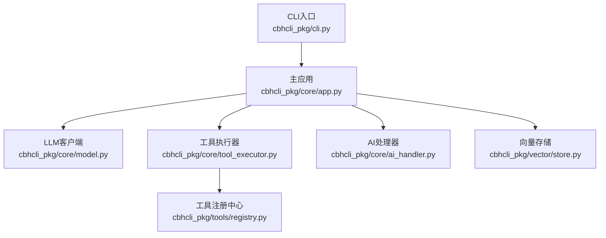
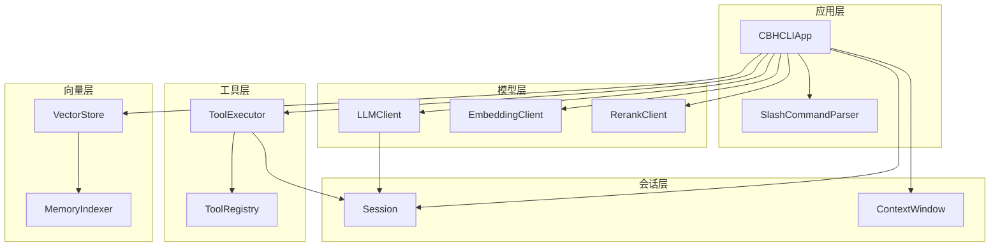
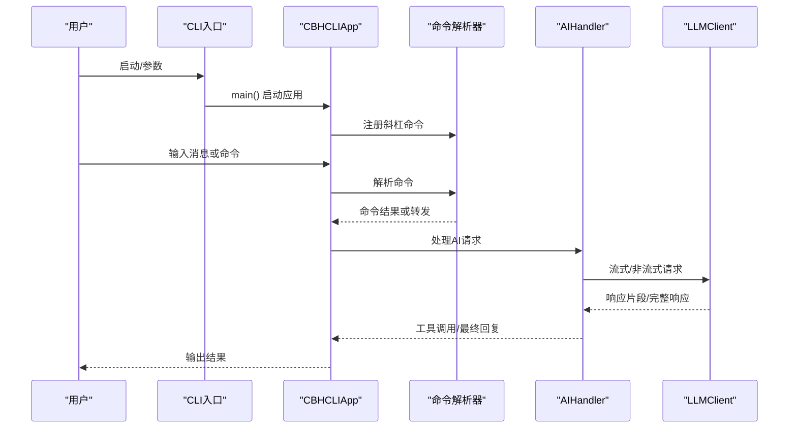
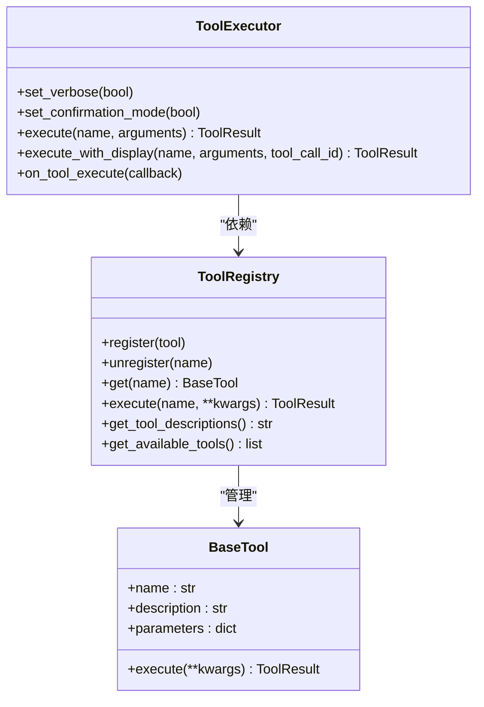
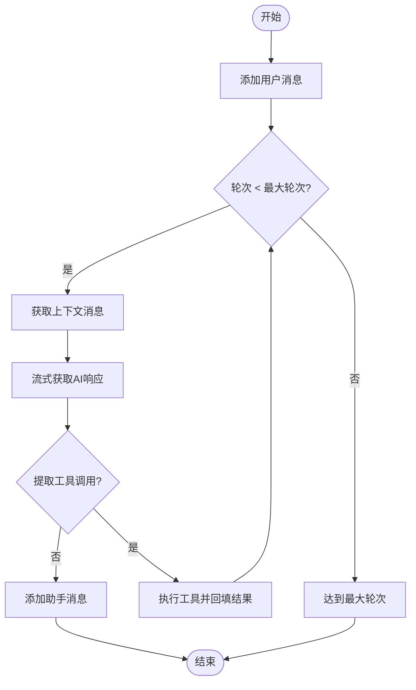
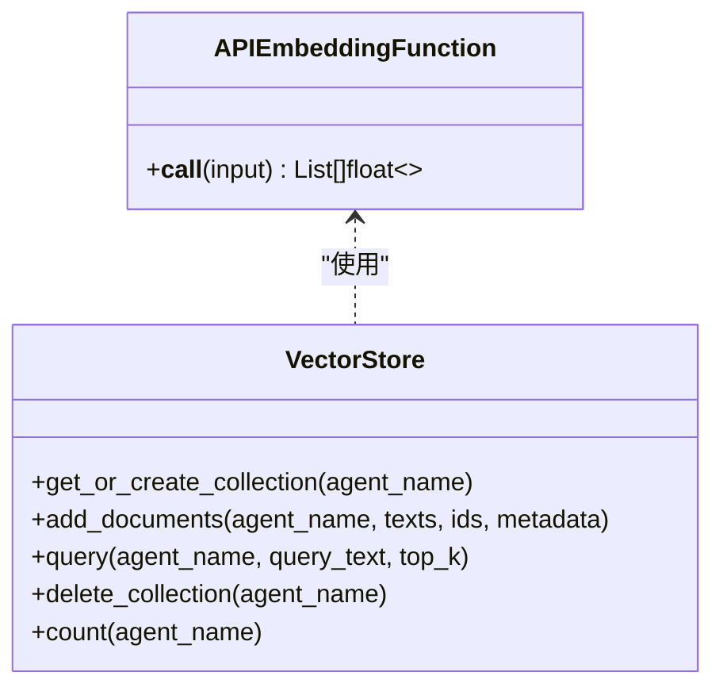
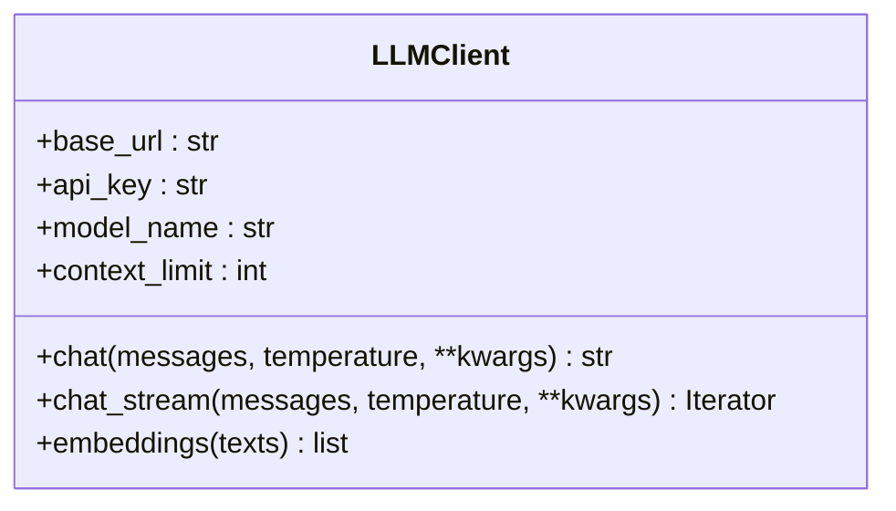
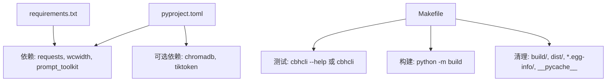

# 开发者指南

<cite>
**本文引用的文件**   
- [README.md](file://README.md)
- [INSTALL.md](file://INSTALL.md)
- [Makefile](file://Makefile)
- [pyproject.toml](file://pyproject.toml)
- [requirements.txt](file://requirements.txt)
- [cbhcli_pkg/__main__.py](file://cbhcli_pkg/__main__.py)
- [cbhcli_pkg/cli.py](file://cbhcli_pkg/cli.py)
- [cbhcli_pkg/core/app.py](file://cbhcli_pkg/core/app.py)
- [cbhcli_pkg/core/model.py](file://cbhcli_pkg/core/model.py)
- [cbhcli_pkg/core/tool_executor.py](file://cbhcli_pkg/core/tool_executor.py)
- [cbhcli_pkg/core/ai_handler.py](file://cbhcli_pkg/core/ai_handler.py)
- [cbhcli_pkg/tools/registry.py](file://cbhcli_pkg/tools/registry.py)
- [cbhcli_pkg/vector/store.py](file://cbhcli_pkg/vector/store.py)
- [test_v3.py](file://test_v3.py)
</cite>

## 目录
1. [简介](#简介)
2. [项目结构](#项目结构)
3. [核心组件](#核心组件)
4. [架构总览](#架构总览)
5. [详细组件分析](#详细组件分析)
6. [依赖分析](#依赖分析)
7. [性能考虑](#性能考虑)
8. [故障排查指南](#故障排查指南)
9. [结论](#结论)
10. [附录](#附录)

## 简介
本指南面向CBHCLI的开发者与贡献者，系统阐述项目的整体架构设计、模块化组织、组件职责与交互关系；提供扩展开发（自定义工具、Agent扩展、插件化MCP）的实践路径；说明测试策略（单元、集成、端到端）与质量保障流程；给出构建与部署流程、调试技巧与性能优化建议，并为新贡献者提供入门与协作规范。

## 项目结构
项目采用清晰的包结构与职责分离：
- 应用入口与CLI参数解析：cbhcli_pkg/cli.py
- 主应用与控制流：cbhcli_pkg/core/app.py
- LLM客户端与流式响应：cbhcli_pkg/core/model.py
- 工具系统与执行器：cbhcli_pkg/tools/registry.py、cbhcli_pkg/core/tool_executor.py
- AI请求处理与工具调用解析：cbhcli_pkg/core/ai_handler.py
- 向量存储与嵌入：cbhcli_pkg/vector/store.py
- 构建与安装：Makefile、pyproject.toml、requirements.txt
- 测试脚本：test_v3.py

图示来源
- [cbhcli_pkg/cli.py:73-112](file://cbhcli_pkg/cli.py#L73-L112)
- [cbhcli_pkg/core/app.py:54-72](file://cbhcli_pkg/core/app.py#L54-L72)
- [cbhcli_pkg/core/model.py:7-27](file://cbhcli_pkg/core/model.py#L7-L27)
- [cbhcli_pkg/core/tool_executor.py:15-33](file://cbhcli_pkg/core/tool_executor.py#L15-L33)
- [cbhcli_pkg/core/ai_handler.py:21-49](file://cbhcli_pkg/core/ai_handler.py#L21-L49)
- [cbhcli_pkg/tools/registry.py:51-70](file://cbhcli_pkg/tools/registry.py#L51-L70)
- [cbhcli_pkg/vector/store.py:37-63](file://cbhcli_pkg/vector/store.py#L37-L63)

章节来源
- [README.md:269-296](file://README.md#L269-L296)
- [cbhcli_pkg/cli.py:1-112](file://cbhcli_pkg/cli.py#L1-L112)
- [cbhcli_pkg/core/app.py:1-478](file://cbhcli_pkg/core/app.py#L1-L478)

## 核心组件
- CLI入口与帮助系统：负责参数解析、版本/帮助输出、启动主应用。
- 主应用（CBHCLIApp）：集中初始化配置、Agent、工具、向量存储、命令解析器、UI与会话；驱动主循环与上下文压缩。
- LLM客户端（LLMClient）：统一封装Chat Completions与Embeddings接口，支持流式与非流式。
- 工具系统（ToolRegistry/BaseTool）：抽象工具接口，注册/执行工具，统一返回结构。
- 工具执行器（ToolExecutor）：工具调用前确认、执行、结果展示与回调。
- AI处理器（AIHandler）：多轮工具调用协调、流式响应解析、工具调用提取与执行。
- 向量存储（VectorStore）：基于ChromaDB的持久化集合、文档增删与语义查询。

章节来源
- [cbhcli_pkg/cli.py:73-112](file://cbhcli_pkg/cli.py#L73-L112)
- [cbhcli_pkg/core/app.py:54-478](file://cbhcli_pkg/core/app.py#L54-L478)
- [cbhcli_pkg/core/model.py:7-147](file://cbhcli_pkg/core/model.py#L7-L147)
- [cbhcli_pkg/tools/registry.py:16-115](file://cbhcli_pkg/tools/registry.py#L16-L115)
- [cbhcli_pkg/core/tool_executor.py:15-168](file://cbhcli_pkg/core/tool_executor.py#L15-L168)
- [cbhcli_pkg/core/ai_handler.py:21-743](file://cbhcli_pkg/core/ai_handler.py#L21-L743)
- [cbhcli_pkg/vector/store.py:37-175](file://cbhcli_pkg/vector/store.py#L37-L175)

## 架构总览
CBHCLI采用“应用层-会话层-工具层-模型层”的分层设计，围绕主应用进行编排：
- 应用层：负责生命周期管理、命令路由、UI与交互。
- 会话层：维护消息历史、上下文窗口与Token统计。
- 工具层：注册与执行工具，支持确认与详细输出模式。
- 模型层：统一LLM API访问，支持流式输出与嵌入。

图示来源
- [cbhcli_pkg/core/app.py:151-180](file://cbhcli_pkg/core/app.py#L151-L180)
- [cbhcli_pkg/core/ai_handler.py:51-97](file://cbhcli_pkg/core/ai_handler.py#L51-L97)
- [cbhcli_pkg/core/tool_executor.py:42-92](file://cbhcli_pkg/core/tool_executor.py#L42-L92)
- [cbhcli_pkg/core/model.py:28-147](file://cbhcli_pkg/core/model.py#L28-L147)
- [cbhcli_pkg/vector/store.py:37-98](file://cbhcli_pkg/vector/store.py#L37-L98)

## 详细组件分析

### CLI与主应用
- CLI入口解析版本/帮助参数，其余交由主应用处理。
- 主应用负责全局配置、Agent加载、工具注册、向量存储初始化、命令注册与UI绑定。
- 提供上下文压缩、会话重置、历史保存等能力。

图示来源
- [cbhcli_pkg/cli.py:73-112](file://cbhcli_pkg/cli.py#L73-L112)
- [cbhcli_pkg/core/app.py:386-421](file://cbhcli_pkg/core/app.py#L386-L421)
- [cbhcli_pkg/core/ai_handler.py:51-97](file://cbhcli_pkg/core/ai_handler.py#L51-L97)
- [cbhcli_pkg/core/model.py:28-120](file://cbhcli_pkg/core/model.py#L28-L120)

章节来源
- [cbhcli_pkg/cli.py:1-112](file://cbhcli_pkg/cli.py#L1-L112)
- [cbhcli_pkg/core/app.py:54-478](file://cbhcli_pkg/core/app.py#L54-L478)

### 工具系统与执行器
- 工具注册中心统一管理工具元数据与执行。
- 工具执行器负责确认、执行、结果展示与回调。
- 支持详细/简洁两种输出模式，以及批量确认跳过。

图示来源
- [cbhcli_pkg/tools/registry.py:16-115](file://cbhcli_pkg/tools/registry.py#L16-L115)
- [cbhcli_pkg/core/tool_executor.py:15-168](file://cbhcli_pkg/core/tool_executor.py#L15-L168)

章节来源
- [cbhcli_pkg/tools/registry.py:1-115](file://cbhcli_pkg/tools/registry.py#L1-L115)
- [cbhcli_pkg/core/tool_executor.py:1-168](file://cbhcli_pkg/core/tool_executor.py#L1-L168)

### AI请求处理与工具调用解析
- 支持多轮工具调用，自动注入格式提示，增强一致性。
- 提取多种工具调用格式（DSML、Python函数、JSON），并进行严格验证与去重。
- 执行工具并将结果回填到会话，支持OpenAI风格的tool_calls结构。

图示来源
- [cbhcli_pkg/core/ai_handler.py:51-97](file://cbhcli_pkg/core/ai_handler.py#L51-L97)
- [cbhcli_pkg/core/ai_handler.py:264-502](file://cbhcli_pkg/core/ai_handler.py#L264-L502)
- [cbhcli_pkg/core/ai_handler.py:664-735](file://cbhcli_pkg/core/ai_handler.py#L664-L735)

章节来源
- [cbhcli_pkg/core/ai_handler.py:1-743](file://cbhcli_pkg/core/ai_handler.py#L1-L743)

### 向量存储与嵌入
- VectorStore封装ChromaDB，使用自定义嵌入函数，避免默认模型调用。
- 支持集合创建、文档添加、查询与删除，提供计数接口。
- 与MemoryIndexer配合，实现Agent工作空间的索引与检索。

图示来源
- [cbhcli_pkg/vector/store.py:12-35](file://cbhcli_pkg/vector/store.py#L12-L35)
- [cbhcli_pkg/vector/store.py:37-175](file://cbhcli_pkg/vector/store.py#L37-L175)

章节来源
- [cbhcli_pkg/vector/store.py:1-175](file://cbhcli_pkg/vector/store.py#L1-L175)

### LLM客户端
- 统一封装Chat Completions与Embeddings，支持流式与非流式。
- 自动设置Authorization与Content-Type头，超时控制与错误处理。

图示来源
- [cbhcli_pkg/core/model.py:7-147](file://cbhcli_pkg/core/model.py#L7-L147)

章节来源
- [cbhcli_pkg/core/model.py:1-147](file://cbhcli_pkg/core/model.py#L1-L147)

## 依赖分析
- 构建系统与入口：pyproject.toml定义项目元信息、依赖、可选依赖与脚本入口。
- 安装与卸载：Makefile提供安装、构建、测试、清理与全量安装目标。
- 可选依赖：向量数据库与Token计数器通过可选依赖引入。

图示来源
- [pyproject.toml:26-45](file://pyproject.toml#L26-L45)
- [Makefile:13-36](file://Makefile#L13-L36)
- [requirements.txt:1-7](file://requirements.txt#L1-L7)

章节来源
- [pyproject.toml:1-53](file://pyproject.toml#L1-L53)
- [Makefile:1-55](file://Makefile#L1-L55)
- [requirements.txt:1-7](file://requirements.txt#L1-L7)

## 性能考虑
- 上下文压缩：当接近模型上下文限制时自动压缩，降低Token占用。
- 流式输出：LLMClient支持流式响应，提升交互体验。
- 向量查询：预先计算嵌入向量，减少重复API调用。
- 工具执行：支持批量确认跳过，减少交互成本。
- Token计数：结合上下文窗口动态评估与压缩阈值。

章节来源
- [cbhcli_pkg/core/app.py:361-385](file://cbhcli_pkg/core/app.py#L361-L385)
- [cbhcli_pkg/core/model.py:59-120](file://cbhcli_pkg/core/model.py#L59-L120)
- [cbhcli_pkg/vector/store.py:118-149](file://cbhcli_pkg/vector/store.py#L118-L149)
- [cbhcli_pkg/core/tool_executor.py:122-141](file://cbhcli_pkg/core/tool_executor.py#L122-L141)

## 故障排查指南
- 命令不可用：确认已配置模型，否则会提示未配置模型。
- 向量功能不可用：需配置嵌入模型并手动索引，否则提示启用方式。
- 安装问题：若命令不可用，检查PATH或使用--user标志重装。
- 构建失败：确保已安装build工具链，使用全量安装目标。
- 测试失败：运行测试脚本定位工具/会话/AI处理相关问题。

章节来源
- [cbhcli_pkg/core/app.py:410-420](file://cbhcli_pkg/core/app.py#L410-L420)
- [cbhcli_pkg/core/app.py:148-149](file://cbhcli_pkg/core/app.py#L148-L149)
- [INSTALL.md:63-69](file://INSTALL.md#L63-L69)
- [Makefile:38-42](file://Makefile#L38-L42)
- [test_v3.py:162-180](file://test_v3.py#L162-L180)

## 结论
CBHCLI通过清晰的分层与模块化设计，实现了从CLI交互到工具执行、从会话管理到向量检索的完整闭环。开发者可基于工具注册中心与AI处理器扩展Agent能力，结合向量存储实现知识检索与增强。建议遵循本文的测试与构建流程，持续优化上下文压缩与流式交互体验。

## 附录

### 扩展开发指南
- 自定义工具开发
  - 实现BaseTool接口，定义name/description/parameters/execute。
  - 在主应用初始化阶段注册工具，或通过工具注册中心动态注册。
  - 使用ToolExecutor执行工具，支持确认与详细输出模式。
- Agent扩展
  - 使用AgentManager创建/切换Agent，加载人格与工作空间。
  - 在主应用中按需索引Agent工作空间，启用向量检索。
- 插件系统（MCP）
  - 通过MCP管理器为Agent独立配置MCP服务器与工具集。
  - 命令解析器中注册MCP相关命令，实现服务器管理与工具发现。

章节来源
- [cbhcli_pkg/tools/registry.py:16-115](file://cbhcli_pkg/tools/registry.py#L16-L115)
- [cbhcli_pkg/core/app.py:85-150](file://cbhcli_pkg/core/app.py#L85-L150)
- [cbhcli_pkg/core/app.py:263-277](file://cbhcli_pkg/core/app.py#L263-L277)

### 测试策略
- 单元测试
  - 工具系统：验证工具注册、执行与返回结构。
  - 会话管理：验证消息添加、Token统计与重置。
  - Token计数：验证不同文本的Token估算。
- 集成测试
  - Agent管理：创建Agent、加载人格、构建系统提示。
- 端到端测试
  - 使用测试脚本运行完整流程，覆盖工具、会话、Agent与Token计数。

章节来源
- [test_v3.py:22-180](file://test_v3.py#L22-L180)

### 代码贡献指南
- 开发环境
  - 创建虚拟环境，安装开发依赖与可选依赖。
  - 使用Makefile提供的开发安装与测试目标。
- 编码规范
  - 类型注解、异常处理与日志输出保持一致风格。
  - 工具参数使用JSON Schema定义，确保系统提示准确。
- 提交规范
  - 分离功能提交，附带测试与变更说明。
- Pull Request流程
  - 提交PR前运行测试脚本，确保通过。

章节来源
- [README.md:297-314](file://README.md#L297-L314)
- [Makefile:6-27](file://Makefile#L6-27)

### 构建与部署
- 构建
  - 使用Makefile的build/build-wheel目标，或pyproject.toml定义的构建后端。
- 安装
  - 开发模式安装、标准安装与从Wheel安装。
- 卸载
  - 使用pip卸载包。

章节来源
- [Makefile:13-23](file://Makefile#L13-L23)
- [INSTALL.md:10-45](file://INSTALL.md#L10-L45)
- [pyproject.toml:1-53](file://pyproject.toml#L1-L53)

### 调试技巧与开发工具
- 流式输出调试：关注AI处理器对reasoning/content的区分与增量清理。
- 工具调用验证：严格校验工具名称与参数，避免示例占位符。
- UI交互：Ctrl+R切换工具显示模式，便于快速定位问题。
- 向量索引：手动触发索引，避免启动时大量API调用。

章节来源
- [cbhcli_pkg/core/ai_handler.py:144-216](file://cbhcli_pkg/core/ai_handler.py#L144-L216)
- [cbhcli_pkg/core/tool_executor.py:34-41](file://cbhcli_pkg/core/tool_executor.py#L34-L41)
- [cbhcli_pkg/core/app.py:148-149](file://cbhcli_pkg/core/app.py#L148-L149)

### 代码审查标准与质量保证
- 接口一致性：工具参数Schema与执行返回结构统一。
- 错误处理：捕获并清晰报告异常，避免静默失败。
- 性能影响：避免不必要的API调用与重复计算。
- 可测试性：为关键逻辑提供可测试入口与断言点。

章节来源
- [cbhcli_pkg/tools/registry.py:89-96](file://cbhcli_pkg/tools/registry.py#L89-L96)
- [cbhcli_pkg/core/ai_handler.py:212-214](file://cbhcli_pkg/core/ai_handler.py#L212-L214)
- [cbhcli_pkg/core/model.py:53-57](file://cbhcli_pkg/core/model.py#L53-L57)

### 新贡献者入门
- 从README了解特性与使用方式。
- 通过INSTALL与Makefile完成本地安装与测试。
- 阅读核心模块与工具系统，理解扩展点。
- 运行测试脚本验证环境与功能。

章节来源
- [README.md:1-325](file://README.md#L1-L325)
- [INSTALL.md:1-69](file://INSTALL.md#L1-L69)
- [test_v3.py:162-180](file://test_v3.py#L162-L180)