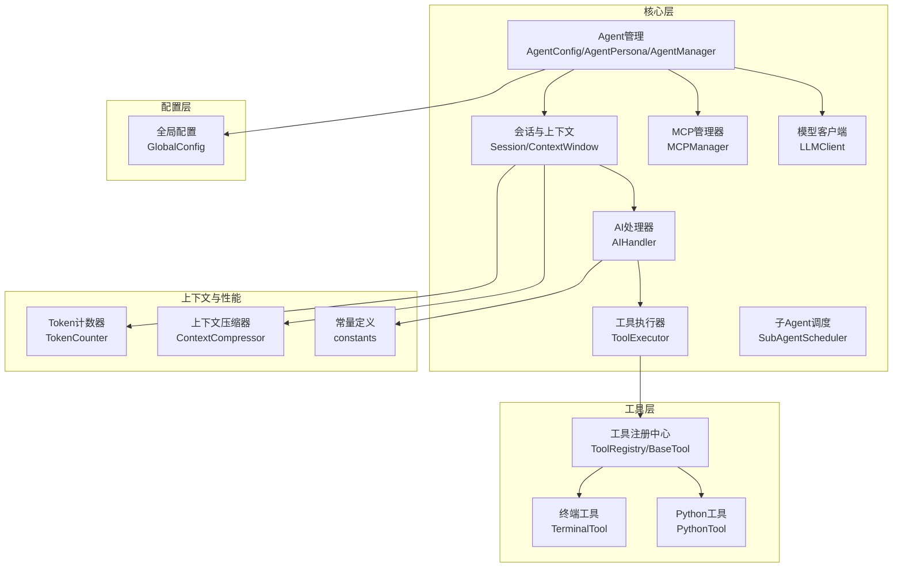
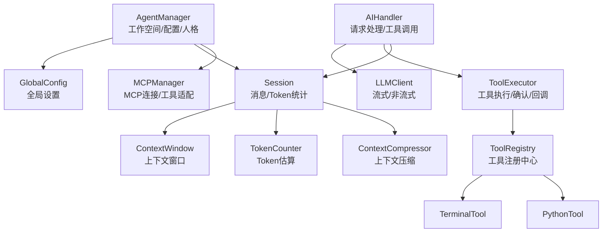
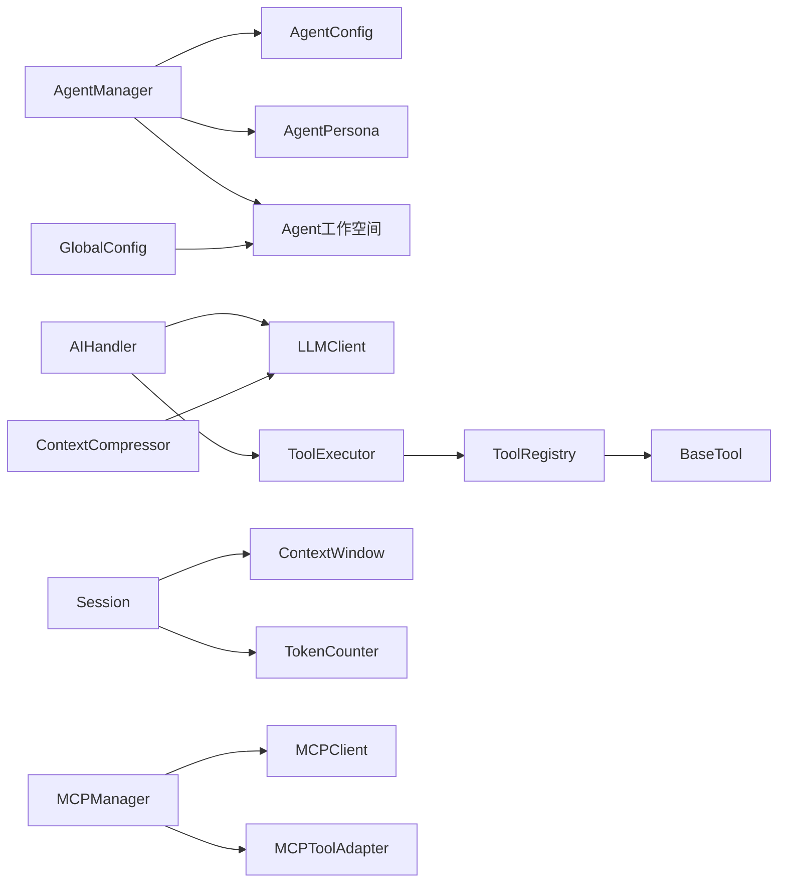

# Agent扩展机制

<cite>
**本文引用的文件**
- [cbhcli_pkg/core/agent.py](file://cbhcli_pkg/core/agent.py)
- [cbhcli_pkg/core/app.py](file://cbhcli_pkg/core/app.py)
- [cbhcli_pkg/core/session.py](file://cbhcli_pkg/core/session.py)
- [cbhcli_pkg/core/ai_handler.py](file://cbhcli_pkg/core/ai_handler.py)
- [cbhcli_pkg/core/tool_executor.py](file://cbhcli_pkg/core/tool_executor.py)
- [cbhcli_pkg/tools/registry.py](file://cbhcli_pkg/tools/registry.py)
- [cbhcli_pkg/tools/terminal.py](file://cbhcli_pkg/tools/terminal.py)
- [cbhcli_pkg/tools/python_tool.py](file://cbhcli_pkg/tools/python_tool.py)
- [cbhcli_pkg/config/global_config.py](file://cbhcli_pkg/config/global_config.py)
- [cbhcli_pkg/context/token_counter.py](file://cbhcli_pkg/context/token_counter.py)
- [cbhcli_pkg/context/compressor.py](file://cbhcli_pkg/context/compressor.py)
- [cbhcli_pkg/core/model.py](file://cbhcli_pkg/core/model.py)
- [cbhcli_pkg/core/subagent.py](file://cbhcli_pkg/core/subagent.py)
- [cbhcli_pkg/core/mcp_manager.py](file://cbhcli_pkg/core/mcp_manager.py)
- [cbhcli_pkg/core/constants.py](file://cbhcli_pkg/core/constants.py)
</cite>

## 目录
1. [简介](#简介)
2. [项目结构](#项目结构)
3. [核心组件](#核心组件)
4. [架构总览](#架构总览)
5. [详细组件分析](#详细组件分析)
6. [依赖关系分析](#依赖关系分析)
7. [性能考虑](#性能考虑)
8. [故障排查指南](#故障排查指南)
9. [结论](#结论)
10. [附录](#附录)

## 简介
本指南围绕CBHCLI的Agent扩展机制，系统讲解如何创建自定义Agent类型、扩展Agent配置系统、扩展Agent工作空间与数据持久化、实现Agent间通信与协作、扩展Agent状态管理、以及Agent安全与性能优化。文档基于仓库源码进行深入分析，并提供从简单代理到复杂多Agent系统的完整开发路径。

## 项目结构
CBHCLI采用“核心功能层 + 工具层 + 配置层”的分层组织方式：
- 核心层：Agent管理、会话与上下文、AI请求处理、模型客户端、子Agent调度、MCP管理
- 工具层：工具注册中心与具体工具实现（终端、Python、文件读写等）
- 配置层：全局配置与Agent工作空间配置
- 上下文与性能：Token计数、上下文压缩、常量定义

**图表来源**
- [cbhcli_pkg/core/agent.py](file://cbhcli_pkg/core/agent.py)
- [cbhcli_pkg/core/session.py](file://cbhcli_pkg/core/session.py)
- [cbhcli_pkg/core/ai_handler.py](file://cbhcli_pkg/core/ai_handler.py)
- [cbhcli_pkg/core/tool_executor.py](file://cbhcli_pkg/core/tool_executor.py)
- [cbhcli_pkg/tools/registry.py](file://cbhcli_pkg/tools/registry.py)
- [cbhcli_pkg/tools/terminal.py](file://cbhcli_pkg/tools/terminal.py)
- [cbhcli_pkg/tools/python_tool.py](file://cbhcli_pkg/tools/python_tool.py)
- [cbhcli_pkg/config/global_config.py](file://cbhcli_pkg/config/global_config.py)
- [cbhcli_pkg/context/token_counter.py](file://cbhcli_pkg/context/token_counter.py)
- [cbhcli_pkg/context/compressor.py](file://cbhcli_pkg/context/compressor.py)
- [cbhcli_pkg/core/model.py](file://cbhcli_pkg/core/model.py)
- [cbhcli_pkg/core/subagent.py](file://cbhcli_pkg/core/subagent.py)
- [cbhcli_pkg/core/mcp_manager.py](file://cbhcli_pkg/core/mcp_manager.py)
- [cbhcli_pkg/core/constants.py](file://cbhcli_pkg/core/constants.py)

**章节来源**
- [cbhcli_pkg/core/app.py](file://cbhcli_pkg/core/app.py)
- [cbhcli_pkg/core/agent.py](file://cbhcli_pkg/core/agent.py)
- [cbhcli_pkg/config/global_config.py](file://cbhcli_pkg/config/global_config.py)

## 核心组件
- Agent管理：负责Agent的创建、加载、人格构建、工作空间管理与配置持久化
- 会话与上下文：维护消息历史、Token统计、上下文窗口与自动压缩
- AI处理器：负责请求发送、流式响应处理、工具调用提取与执行
- 工具系统：工具注册中心、工具基类、工具执行器与工具实现
- 配置系统：全局配置与Agent工作空间配置
- 子Agent机制：临时子Agent创建、状态管理与结果收集
- MCP管理：每个Agent独立的MCP连接与工具适配
- 模型客户端：统一LLM API封装，支持流式与非流式调用
- 上下文与性能：Token计数、上下文压缩、常量配置

**章节来源**
- [cbhcli_pkg/core/agent.py](file://cbhcli_pkg/core/agent.py)
- [cbhcli_pkg/core/session.py](file://cbhcli_pkg/core/session.py)
- [cbhcli_pkg/core/ai_handler.py](file://cbhcli_pkg/core/ai_handler.py)
- [cbhcli_pkg/core/tool_executor.py](file://cbhcli_pkg/core/tool_executor.py)
- [cbhcli_pkg/tools/registry.py](file://cbhcli_pkg/tools/registry.py)
- [cbhcli_pkg/config/global_config.py](file://cbhcli_pkg/config/global_config.py)
- [cbhcli_pkg/context/token_counter.py](file://cbhcli_pkg/context/token_counter.py)
- [cbhcli_pkg/context/compressor.py](file://cbhcli_pkg/context/compressor.py)
- [cbhcli_pkg/core/model.py](file://cbhcli_pkg/core/model.py)
- [cbhcli_pkg/core/subagent.py](file://cbhcli_pkg/core/subagent.py)
- [cbhcli_pkg/core/mcp_manager.py](file://cbhcli_pkg/core/mcp_manager.py)
- [cbhcli_pkg/core/constants.py](file://cbhcli_pkg/core/constants.py)

## 架构总览
下图展示了Agent扩展机制的整体架构：AgentManager负责工作空间与配置；AIHandler协调LLMClient与ToolExecutor；ToolRegistry集中管理工具；Session/ContextWindow负责上下文与Token；MCPManager为每个Agent独立管理外部工具；GlobalConfig提供全局设置。

**图表来源**
- [cbhcli_pkg/core/agent.py](file://cbhcli_pkg/core/agent.py)
- [cbhcli_pkg/config/global_config.py](file://cbhcli_pkg/config/global_config.py)
- [cbhcli_pkg/core/session.py](file://cbhcli_pkg/core/session.py)
- [cbhcli_pkg/core/ai_handler.py](file://cbhcli_pkg/core/ai_handler.py)
- [cbhcli_pkg/core/tool_executor.py](file://cbhcli_pkg/core/tool_executor.py)
- [cbhcli_pkg/tools/registry.py](file://cbhcli_pkg/tools/registry.py)
- [cbhcli_pkg/tools/terminal.py](file://cbhcli_pkg/tools/terminal.py)
- [cbhcli_pkg/tools/python_tool.py](file://cbhcli_pkg/tools/python_tool.py)
- [cbhcli_pkg/core/model.py](file://cbhcli_pkg/core/model.py)
- [cbhcli_pkg/context/compressor.py](file://cbhcli_pkg/context/compressor.py)
- [cbhcli_pkg/context/token_counter.py](file://cbhcli_pkg/context/token_counter.py)
- [cbhcli_pkg/core/mcp_manager.py](file://cbhcli_pkg/core/mcp_manager.py)

## 详细组件分析

### Agent配置系统扩展
- Agent配置数据结构：AgentConfig包含工作空间路径、主模型、上下文压缩阈值、自动压缩开关、最大工具调用轮次等字段
- Agent人格构建：AgentPersona从多份Markdown文件（技能、性格、工具指南、记忆、使用说明）构建系统提示
- Agent管理器：创建Agent时自动生成工作空间与必要文件；加载Agent时读取config.json与各MD文件；支持删除与切换
- 全局配置：GlobalConfig提供模型、嵌入/重排序模型、Agent活动状态、设置项（自动压缩、压缩比例、工作空间根目录等）

扩展要点
- 自定义配置项：在AgentConfig中新增字段并在to_dict/from_dict中处理；在AgentManager._save_config中持久化
- 配置验证：在AgentManager.create_agent中对工作空间、知识库目录进行创建校验；在GlobalConfig中对模型配置进行读取/保存校验
- 默认值设置：在AgentConfig构造函数中设置默认值；在GlobalConfig._default_config中设置全局默认值

**章节来源**
- [cbhcli_pkg/core/agent.py](file://cbhcli_pkg/core/agent.py)
- [cbhcli_pkg/config/global_config.py](file://cbhcli_pkg/config/global_config.py)

### Agent工作空间扩展机制
- 工作空间布局：每个Agent拥有独立目录，包含config.json、技能/性格/工具/记忆/使用说明MD文件、knowledge知识库目录、history会话历史目录
- 文件系统集成：AgentManager在创建Agent时自动创建目录与模板文件；加载时读取MD文件构建AgentPersona
- 数据持久化：AgentConfig序列化到config.json；记忆内容追加写入memory.md；会话历史保存到history目录
- 向量索引：通过向量存储与索引器实现知识库语义检索；索引触发需手动执行/embedding index命令

扩展要点
- 自定义存储后端：可在AgentManager中扩展新的文件类型或索引策略；在AIHandler中接入新的工具调用
- 文件系统集成：在AgentManager._create_md_file中添加新模板；在AgentManager.load_agent_persona中读取新文件
- 数据持久化：在AgentManager._save_config之外，可扩展其他元数据持久化策略（如SQLite、KV存储）

**章节来源**
- [cbhcli_pkg/core/agent.py](file://cbhcli_pkg/core/agent.py)
- [cbhcli_pkg/core/app.py](file://cbhcli_pkg/core/app.py)

### Agent间通信与协作模式
- 子Agent机制：SubAgentScheduler为父Agent创建临时子Agent，支持任务描述、模型配置、状态管理与结果收集
- MCP管理：MCPManager为每个Agent独立管理MCP服务器连接与工具适配，支持动态增删服务器、启用/禁用工具、刷新工具列表
- 工具协作：ToolExecutor统一处理工具调用确认、执行与结果展示；AIHandler在多轮工具调用中协调工具执行与上下文传递

扩展要点
- 子Agent扩展：在SubAgentScheduler.spawn中传入父Agent名称与任务描述；在AIHandler中将子Agent结果回传给父Agent
- MCP扩展：在MCPManager.add_server中配置服务器与启用工具列表；通过MCPToolAdapter将外部工具注册到ToolRegistry
- 协作模式：通过工具调用格式（JSON/Python/DSML）实现跨Agent的工具调用与数据交换

**章节来源**
- [cbhcli_pkg/core/subagent.py](file://cbhcli_pkg/core/subagent.py)
- [cbhcli_pkg/core/mcp_manager.py](file://cbhcli_pkg/core/mcp_manager.py)
- [cbhcli_pkg/core/tool_executor.py](file://cbhcli_pkg/core/tool_executor.py)
- [cbhcli_pkg/core/ai_handler.py](file://cbhcli_pkg/core/ai_handler.py)

### Agent状态管理扩展
- 会话状态：Session维护消息列表、工具调用计数、创建时间与激活状态；支持重置、截断与替换消息
- 上下文状态：ContextWindow跟踪当前Token使用量、阈值比例与剩余Token；支持自动压缩触发
- 上下文压缩：ContextCompressor基于早期与近期消息保留，对中间部分生成摘要，降低Token占用
- Token估算：TokenCounter支持tiktoken精确计数与降级估算；AIHandler与ContextCompressor均使用Token计数

扩展要点
- 状态序列化：在AgentConfig中扩展状态字段；在AgentManager._save_config中持久化
- 恢复机制：通过Session.history目录保存历史会话；在AIHandler中可扩展从历史恢复逻辑
- 状态同步：在MCPManager中维护每个Agent的独立MCP状态；在SubAgentScheduler中管理子Agent生命周期

**章节来源**
- [cbhcli_pkg/core/session.py](file://cbhcli_pkg/core/session.py)
- [cbhcli_pkg/context/compressor.py](file://cbhcli_pkg/context/compressor.py)
- [cbhcli_pkg/context/token_counter.py](file://cbhcli_pkg/context/token_counter.py)
- [cbhcli_pkg/core/ai_handler.py](file://cbhcli_pkg/core/ai_handler.py)

### Agent工具系统扩展
- 工具基类：BaseTool定义工具名称、描述、参数Schema与execute方法；ToolRegistry提供注册、执行与描述聚合
- 工具实现：TerminalTool执行shell命令；PythonTool提供带会话记忆的代码执行
- 工具执行器：ToolExecutor负责工具调用确认、执行、结果展示与回调；支持详细/简洁输出模式

扩展要点
- 自定义工具：继承BaseTool，实现name/description/parameters/execute；在ToolRegistry.register注册
- 工具参数验证：在execute中对参数进行校验；结合ToolRegistry的参数Schema进行约束
- 工具回调：通过ToolExecutor.on_tool_execute设置回调，实现工具执行后的状态更新

**章节来源**
- [cbhcli_pkg/tools/registry.py](file://cbhcli_pkg/tools/registry.py)
- [cbhcli_pkg/tools/terminal.py](file://cbhcli_pkg/tools/terminal.py)
- [cbhcli_pkg/tools/python_tool.py](file://cbhcli_pkg/tools/python_tool.py)
- [cbhcli_pkg/core/tool_executor.py](file://cbhcli_pkg/core/tool_executor.py)

### Agent安全机制扩展
- 权限控制：工具执行前的确认流程（ToolExecutor._confirm_execution）可扩展为更细粒度的权限校验
- 访问审计：在ToolExecutor.on_tool_execute中记录工具调用日志；在AIHandler中记录工具调用与结果
- 数据隔离：每个Agent的工作空间独立；MCPManager为每个Agent独立管理连接与工具，避免跨Agent数据泄露

扩展要点
- 权限策略：在ToolExecutor中引入权限矩阵，按工具与用户角色控制执行
- 审计日志：在ToolExecutor与AIHandler中统一记录工具调用、参数、结果与时间戳
- 数据隔离：在AgentManager中对工作空间访问进行路径规范化与沙箱策略

**章节来源**
- [cbhcli_pkg/core/tool_executor.py](file://cbhcli_pkg/core/tool_executor.py)
- [cbhcli_pkg/core/ai_handler.py](file://cbhcli_pkg/core/ai_handler.py)
- [cbhcli_pkg/core/mcp_manager.py](file://cbhcli_pkg/core/mcp_manager.py)
- [cbhcli_pkg/core/agent.py](file://cbhcli_pkg/core/agent.py)

### Agent性能优化扩展
- 缓存策略：TokenCounter支持tiktoken精确计数；可扩展LLM响应缓存与工具执行结果缓存
- 资源池管理：在LLMClient中复用HTTP会话；在ToolExecutor中复用工具执行环境
- 并发控制：在AIHandler中限制工具调用轮次（MAX_TOOL_ROUNDS）；在ToolExecutor中支持批量工具执行

扩展要点
- 缓存：在LLMClient中缓存embedding向量；在ToolExecutor中缓存工具执行结果
- 资源池：在AgentManager中为每个Agent维护独立的LLMClient与ToolExecutor实例
- 并发：在AIHandler中引入队列与锁，控制工具调用并发度

**章节来源**
- [cbhcli_pkg/context/token_counter.py](file://cbhcli_pkg/context/token_counter.py)
- [cbhcli_pkg/core/model.py](file://cbhcli_pkg/core/model.py)
- [cbhcli_pkg/core/tool_executor.py](file://cbhcli_pkg/core/tool_executor.py)
- [cbhcli_pkg/core/ai_handler.py](file://cbhcli_pkg/core/ai_handler.py)
- [cbhcli_pkg/core/constants.py](file://cbhcli_pkg/core/constants.py)

## 依赖关系分析

**图表来源**
- [cbhcli_pkg/core/agent.py](file://cbhcli_pkg/core/agent.py)
- [cbhcli_pkg/core/ai_handler.py](file://cbhcli_pkg/core/ai_handler.py)
- [cbhcli_pkg/core/tool_executor.py](file://cbhcli_pkg/core/tool_executor.py)
- [cbhcli_pkg/tools/registry.py](file://cbhcli_pkg/tools/registry.py)
- [cbhcli_pkg/core/session.py](file://cbhcli_pkg/core/session.py)
- [cbhcli_pkg/context/token_counter.py](file://cbhcli_pkg/context/token_counter.py)
- [cbhcli_pkg/context/compressor.py](file://cbhcli_pkg/context/compressor.py)
- [cbhcli_pkg/core/model.py](file://cbhcli_pkg/core/model.py)
- [cbhcli_pkg/core/mcp_manager.py](file://cbhcli_pkg/core/mcp_manager.py)
- [cbhcli_pkg/config/global_config.py](file://cbhcli_pkg/config/global_config.py)

**章节来源**
- [cbhcli_pkg/core/agent.py](file://cbhcli_pkg/core/agent.py)
- [cbhcli_pkg/core/ai_handler.py](file://cbhcli_pkg/core/ai_handler.py)
- [cbhcli_pkg/core/tool_executor.py](file://cbhcli_pkg/core/tool_executor.py)
- [cbhcli_pkg/tools/registry.py](file://cbhcli_pkg/tools/registry.py)
- [cbhcli_pkg/core/session.py](file://cbhcli_pkg/core/session.py)
- [cbhcli_pkg/context/compressor.py](file://cbhcli_pkg/context/compressor.py)
- [cbhcli_pkg/core/model.py](file://cbhcli_pkg/core/model.py)
- [cbhcli_pkg/core/mcp_manager.py](file://cbhcli_pkg/core/mcp_manager.py)
- [cbhcli_pkg/config/global_config.py](file://cbhcli_pkg/config/global_config.py)

## 性能考虑
- Token管理：通过TokenCounter精确估算与LLMClient的上下文限制，结合ContextWindow与ContextCompressor降低Token占用
- 工具执行：ToolExecutor支持详细/简洁输出模式，减少不必要的日志输出；工具执行结果截断与预览提升用户体验
- 模型调用：LLMClient支持流式输出，AIHandler在多轮工具调用中增强格式提示，减少无效调用
- 并发与轮次：MAX_TOOL_ROUNDS限制工具调用轮次，避免无限循环；ToolExecutor的确认机制减少高风险操作

**章节来源**
- [cbhcli_pkg/context/token_counter.py](file://cbhcli_pkg/context/token_counter.py)
- [cbhcli_pkg/core/model.py](file://cbhcli_pkg/core/model.py)
- [cbhcli_pkg/core/tool_executor.py](file://cbhcli_pkg/core/tool_executor.py)
- [cbhcli_pkg/core/ai_handler.py](file://cbhcli_pkg/core/ai_handler.py)
- [cbhcli_pkg/core/constants.py](file://cbhcli_pkg/core/constants.py)

## 故障排查指南
- 模型未配置：当Agent未配置模型时，AIHandler无法处理请求；需通过命令配置模型
- 工具执行失败：ToolExecutor捕获异常并返回错误信息；检查工具参数与权限
- 上下文溢出：ContextWindow触发压缩阈值；可通过手动压缩或调整压缩比例
- MCP连接失败：MCPManager在加载配置时自动连接服务器；检查服务器URL与认证头
- 会话历史保存：在AIHandler._reset_session中保存当前会话到history目录；检查目录权限

**章节来源**
- [cbhcli_pkg/core/app.py](file://cbhcli_pkg/core/app.py)
- [cbhcli_pkg/core/tool_executor.py](file://cbhcli_pkg/core/tool_executor.py)
- [cbhcli_pkg/context/compressor.py](file://cbhcli_pkg/context/compressor.py)
- [cbhcli_pkg/core/mcp_manager.py](file://cbhcli_pkg/core/mcp_manager.py)

## 结论
CBHCLI提供了完善的Agent扩展机制：从Agent配置与工作空间、工具系统、上下文与性能优化，到MCP与子Agent协作，再到安全与故障排查，形成了可扩展、可维护、可演进的Agent体系。开发者可基于本文档逐步扩展Agent能力，从简单代理到复杂多Agent系统。

## 附录

### 从简单代理到复杂多Agent系统的开发路径
- 简单代理：创建Agent（AgentManager.create_agent），配置主模型（GlobalConfig），编写技能与工具指南（MD文件），运行AIHandler进行工具调用
- 中等复杂度：引入MCPManager管理外部工具，配置MCP服务器与启用工具；在ToolRegistry中注册MCPToolAdapter
- 复杂多Agent：使用SubAgentScheduler创建子Agent执行特定任务；在AIHandler中协调父/子Agent的工具调用；通过Session与ContextWindow管理上下文状态

**章节来源**
- [cbhcli_pkg/core/agent.py](file://cbhcli_pkg/core/agent.py)
- [cbhcli_pkg/core/mcp_manager.py](file://cbhcli_pkg/core/mcp_manager.py)
- [cbhcli_pkg/core/subagent.py](file://cbhcli_pkg/core/subagent.py)
- [cbhcli_pkg/core/ai_handler.py](file://cbhcli_pkg/core/ai_handler.py)