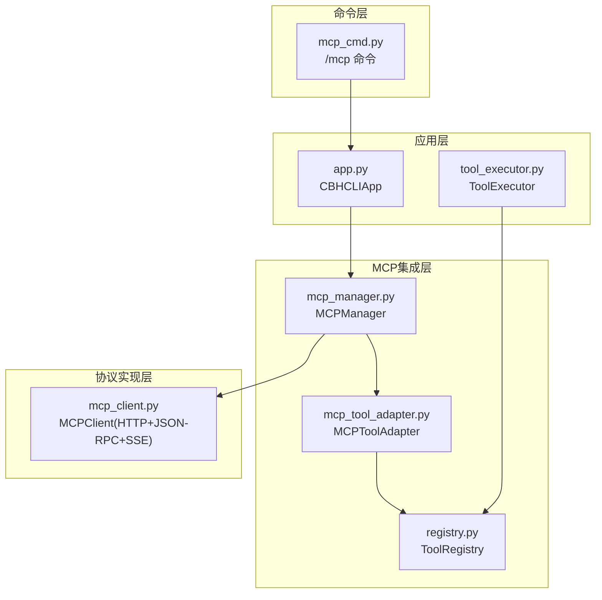
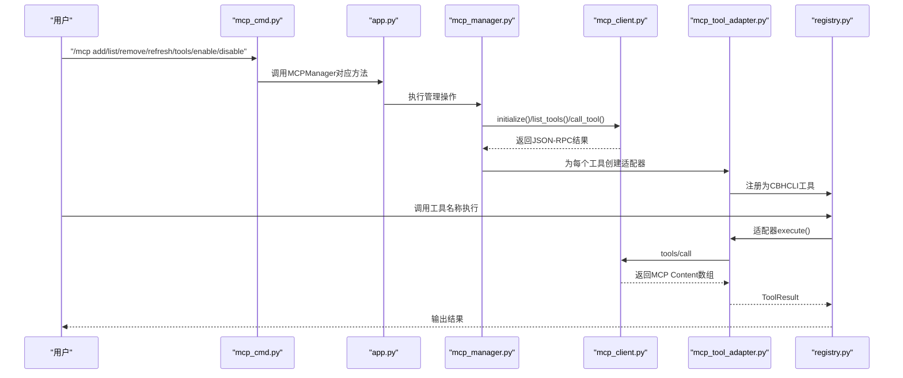
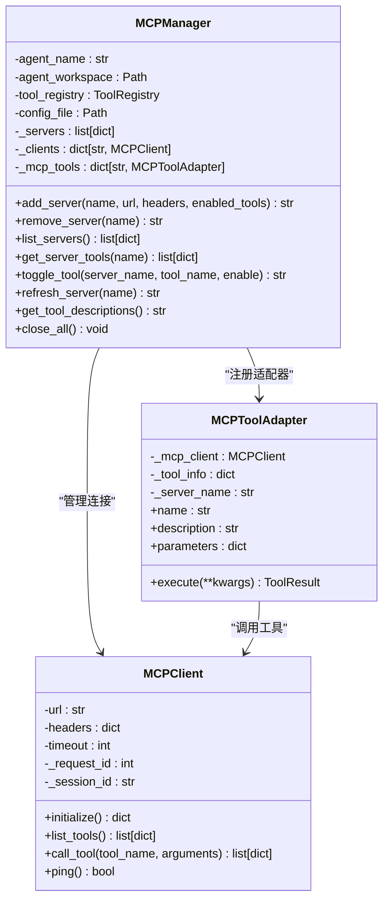
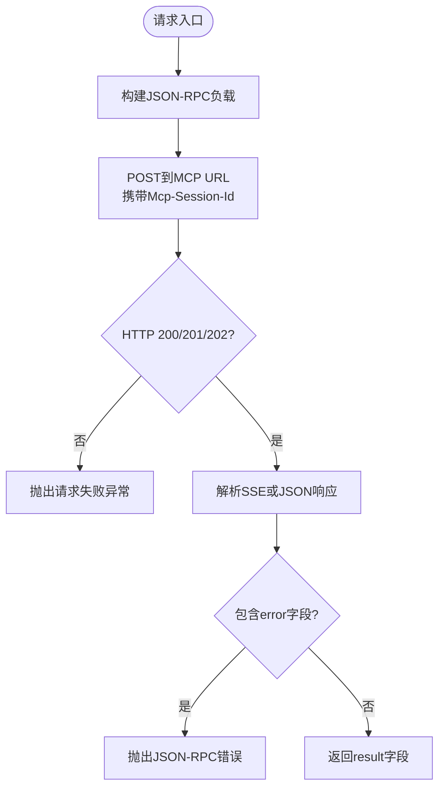
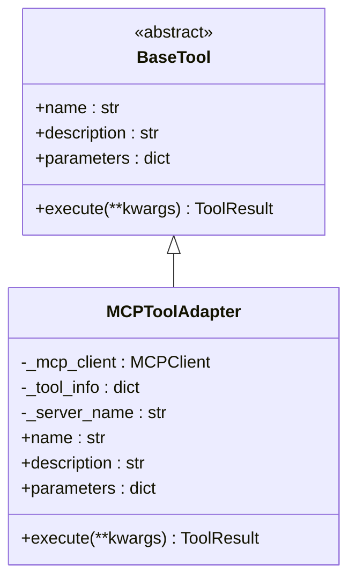
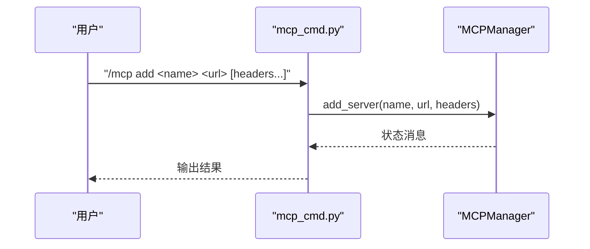
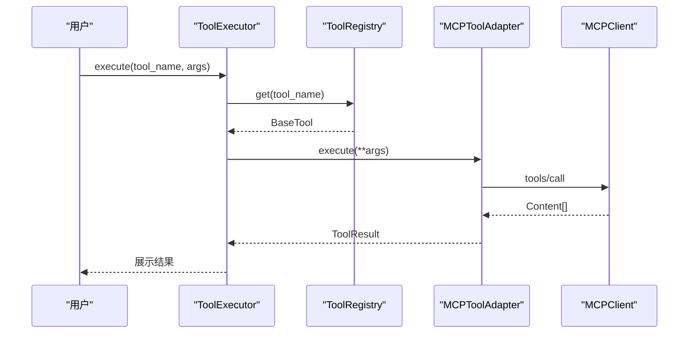
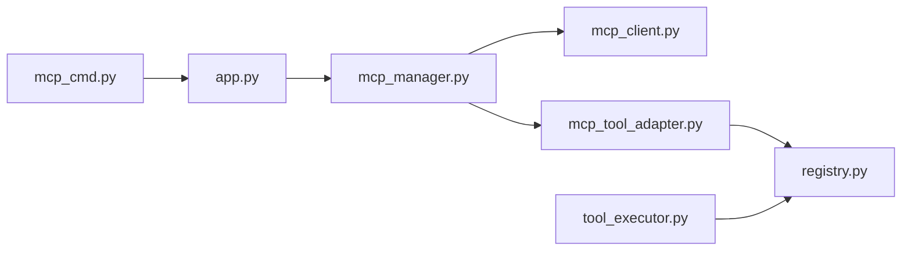

# MCP协议集成

<cite>
**本文引用的文件**
- [mcp_manager.py](file://cbhcli_pkg/core/mcp_manager.py)
- [mcp_client.py](file://cbhcli_pkg/core/mcp_client.py)
- [mcp_tool_adapter.py](file://cbhcli_pkg/core/mcp_tool_adapter.py)
- [mcp_cmd.py](file://cbhcli_pkg/commands/mcp_cmd.py)
- [registry.py](file://cbhcli_pkg/tools/registry.py)
- [tool_executor.py](file://cbhcli_pkg/core/tool_executor.py)
- [app.py](file://cbhcli_pkg/core/app.py)
- [constants.py](file://cbhcli_pkg/core/constants.py)
- [README.md](file://README.md)
</cite>

## 目录
1. [简介](#简介)
2. [项目结构](#项目结构)
3. [核心组件](#核心组件)
4. [架构总览](#架构总览)
5. [详细组件分析](#详细组件分析)
6. [依赖关系分析](#依赖关系分析)
7. [性能考虑](#性能考虑)
8. [故障排查指南](#故障排查指南)
9. [结论](#结论)
10. [附录](#附录)

## 简介
本指南面向希望在CBHCLI中集成MCP（Model Context Protocol）的开发者，系统讲解MCP协议在CBHCLI中的实现方式与最佳实践。内容涵盖：
- MCP协议工作原理与CBHCLI中的实现映射
- 使用MCPManager进行连接、消息传递与状态管理
- MCPToolAdapter的开发方法与适配器模式应用
- MCP命令系统的扩展与自定义命令注册
- 完整集成示例与安全机制、错误处理与重连策略
- 性能优化与调试监控方法

## 项目结构
围绕MCP集成的关键文件与职责如下：
- 核心协议客户端：MCPClient（HTTP + JSON-RPC + SSE）
- 工具适配层：MCPToolAdapter（将MCP工具包装为CBHCLI工具）
- 管理与编排：MCPManager（连接管理、工具注册、状态维护）
- 命令入口：mcp_cmd（/mcp命令解析与参数处理）
- 工具注册中心：ToolRegistry（统一工具生命周期管理）
- 工具执行器：ToolExecutor（工具调用、确认与结果展示）
- 应用入口：CBHCLIApp（初始化Agent、MCPManager与命令系统）

图表来源
- [mcp_cmd.py:1-182](file://cbhcli_pkg/commands/mcp_cmd.py#L1-L182)
- [app.py:1-478](file://cbhcli_pkg/core/app.py#L1-L478)
- [mcp_manager.py:1-366](file://cbhcli_pkg/core/mcp_manager.py#L1-L366)
- [mcp_tool_adapter.py:1-116](file://cbhcli_pkg/core/mcp_tool_adapter.py#L1-L116)
- [mcp_client.py:1-242](file://cbhcli_pkg/core/mcp_client.py#L1-L242)
- [registry.py:1-115](file://cbhcli_pkg/tools/registry.py#L1-L115)
- [tool_executor.py:1-168](file://cbhcli_pkg/core/tool_executor.py#L1-L168)

章节来源
- [mcp_manager.py:1-366](file://cbhcli_pkg/core/mcp_manager.py#L1-L366)
- [mcp_client.py:1-242](file://cbhcli_pkg/core/mcp_client.py#L1-L242)
- [mcp_tool_adapter.py:1-116](file://cbhcli_pkg/core/mcp_tool_adapter.py#L1-L116)
- [mcp_cmd.py:1-182](file://cbhcli_pkg/commands/mcp_cmd.py#L1-L182)
- [registry.py:1-115](file://cbhcli_pkg/tools/registry.py#L1-L115)
- [tool_executor.py:1-168](file://cbhcli_pkg/core/tool_executor.py#L1-L168)
- [app.py:1-478](file://cbhcli_pkg/core/app.py#L1-L478)

## 核心组件
- MCPClient：实现MCP Streamable HTTP协议，封装initialize、tools/list、tools/call等方法，支持SSE解析与Session ID管理。
- MCPToolAdapter：适配器模式实现，将MCP工具包装为CBHCLI的BaseTool，负责参数Schema转换与结果内容解析。
- MCPManager：每个Agent独立管理MCP连接与工具注册，负责配置持久化、服务器增删改查、工具启停与刷新。
- mcp_cmd：命令系统扩展，提供/add、/list、/remove、/refresh、/tools、/enable、/disable等子命令。
- ToolRegistry：统一工具注册与执行，提供工具查询、执行与描述聚合。
- ToolExecutor：工具调用前确认、执行与结果展示，支持详细/简洁模式切换。

章节来源
- [mcp_client.py:1-242](file://cbhcli_pkg/core/mcp_client.py#L1-L242)
- [mcp_tool_adapter.py:1-116](file://cbhcli_pkg/core/mcp_tool_adapter.py#L1-L116)
- [mcp_manager.py:1-366](file://cbhcli_pkg/core/mcp_manager.py#L1-L366)
- [mcp_cmd.py:1-182](file://cbhcli_pkg/commands/mcp_cmd.py#L1-L182)
- [registry.py:1-115](file://cbhcli_pkg/tools/registry.py#L1-L115)
- [tool_executor.py:1-168](file://cbhcli_pkg/core/tool_executor.py#L1-L168)

## 架构总览
MCP在CBHCLI中的整体交互流程如下：

图表来源
- [mcp_cmd.py:1-182](file://cbhcli_pkg/commands/mcp_cmd.py#L1-L182)
- [app.py:1-478](file://cbhcli_pkg/core/app.py#L1-L478)
- [mcp_manager.py:1-366](file://cbhcli_pkg/core/mcp_manager.py#L1-L366)
- [mcp_client.py:1-242](file://cbhcli_pkg/core/mcp_client.py#L1-L242)
- [mcp_tool_adapter.py:1-116](file://cbhcli_pkg/core/mcp_tool_adapter.py#L1-L116)
- [registry.py:1-115](file://cbhcli_pkg/tools/registry.py#L1-L115)

## 详细组件分析

### MCPManager：连接、工具与状态管理
- 配置持久化：在Agent工作空间内以mcp.json存储服务器列表与启用工具集合。
- 自动连接：启动时加载配置并尝试连接所有服务器；连接失败不阻塞应用启动。
- 服务器管理：add_server/remove_server/list_servers/refresh_server。
- 工具管理：按enabled_tools过滤工具，注册为MCPToolAdapter并加入ToolRegistry；支持启用/禁用单个工具。
- 工具描述：聚合所有MCP工具描述供系统提示使用。

图表来源
- [mcp_manager.py:1-366](file://cbhcli_pkg/core/mcp_manager.py#L1-L366)
- [mcp_client.py:1-242](file://cbhcli_pkg/core/mcp_client.py#L1-L242)
- [mcp_tool_adapter.py:1-116](file://cbhcli_pkg/core/mcp_tool_adapter.py#L1-L116)

章节来源
- [mcp_manager.py:1-366](file://cbhcli_pkg/core/mcp_manager.py#L1-L366)

### MCPClient：Streamable HTTP与JSON-RPC
- 协议要点：Accept头同时包含application/json与text/event-stream；支持SSE流解析；自动保存Mcp-Session-Id。
- 方法映射：initialize（协议协商）、tools/list（枚举工具）、tools/call（执行工具）。
- 错误处理：HTTP状态码校验、JSON-RPC error字段检查、SSE解析异常处理。

图表来源
- [mcp_client.py:131-181](file://cbhcli_pkg/core/mcp_client.py#L131-L181)

章节来源
- [mcp_client.py:1-242](file://cbhcli_pkg/core/mcp_client.py#L1-L242)

### MCPToolAdapter：适配器模式与响应处理
- 适配器职责：将MCP工具元信息转换为CBHCLI工具接口，暴露name/description/parameters，并在execute中调用MCPClient。
- 参数Schema：直接采用MCP inputSchema作为JSON Schema。
- 响应处理：解析MCP Content数组，支持text/image/resource等类型，超过阈值时提供摘要或截断。

图表来源
- [mcp_tool_adapter.py:7-43](file://cbhcli_pkg/core/mcp_tool_adapter.py#L7-L43)
- [registry.py:16-48](file://cbhcli_pkg/tools/registry.py#L16-L48)

章节来源
- [mcp_tool_adapter.py:1-116](file://cbhcli_pkg/core/mcp_tool_adapter.py#L1-L116)
- [registry.py:1-115](file://cbhcli_pkg/tools/registry.py#L1-L115)

### 命令系统扩展：/mcp 子命令
- 子命令：add、list、remove、refresh、tools、enable、disable、help。
- 参数解析：支持在add中以key=value形式传入HTTP头（如Authorization）。
- 交互反馈：提供友好的状态消息与帮助信息。

图表来源
- [mcp_cmd.py:5-50](file://cbhcli_pkg/commands/mcp_cmd.py#L5-L50)
- [mcp_cmd.py:78-97](file://cbhcli_pkg/commands/mcp_cmd.py#L78-L97)

章节来源
- [mcp_cmd.py:1-182](file://cbhcli_pkg/commands/mcp_cmd.py#L1-L182)

### 工具执行链路：ToolExecutor与ToolRegistry
- ToolExecutor：负责工具调用前确认、执行与结果展示，支持详细/简洁模式切换。
- ToolRegistry：统一注册、注销、查询与执行，提供工具描述聚合。

图表来源
- [tool_executor.py:42-91](file://cbhcli_pkg/core/tool_executor.py#L42-L91)
- [registry.py:66-96](file://cbhcli_pkg/tools/registry.py#L66-L96)
- [mcp_tool_adapter.py:44-115](file://cbhcli_pkg/core/mcp_tool_adapter.py#L44-L115)
- [mcp_client.py:207-229](file://cbhcli_pkg/core/mcp_client.py#L207-L229)

章节来源
- [tool_executor.py:1-168](file://cbhcli_pkg/core/tool_executor.py#L1-L168)
- [registry.py:1-115](file://cbhcli_pkg/tools/registry.py#L1-L115)

## 依赖关系分析
- MCPManager依赖MCPClient与MCPToolAdapter，并通过ToolRegistry统一注册工具。
- mcp_cmd通过SlashCommandParser注册命令，依赖CBHCLIApp中的MCPManager。
- ToolExecutor依赖ToolRegistry，间接使用MCPToolAdapter。
- app.py在加载Agent时初始化MCPManager，确保每个Agent独立管理其MCP连接。

图表来源
- [mcp_cmd.py:1-182](file://cbhcli_pkg/commands/mcp_cmd.py#L1-L182)
- [app.py:1-478](file://cbhcli_pkg/core/app.py#L1-L478)
- [mcp_manager.py:1-366](file://cbhcli_pkg/core/mcp_manager.py#L1-L366)
- [mcp_client.py:1-242](file://cbhcli_pkg/core/mcp_client.py#L1-L242)
- [mcp_tool_adapter.py:1-116](file://cbhcli_pkg/core/mcp_tool_adapter.py#L1-L116)
- [registry.py:1-115](file://cbhcli_pkg/tools/registry.py#L1-L115)
- [tool_executor.py:1-168](file://cbhcli_pkg/core/tool_executor.py#L1-L168)

章节来源
- [app.py:1-478](file://cbhcli_pkg/core/app.py#L1-L478)
- [mcp_manager.py:1-366](file://cbhcli_pkg/core/mcp_manager.py#L1-L366)

## 性能考虑
- 连接与会话：MCPClient自动维护Mcp-Session-Id，减少重复握手开销；建议在高并发场景下复用MCPClient实例。
- 工具输出控制：MCPToolAdapter对超长输出提供摘要或截断，避免UI与内存压力；可通过常量调整阈值。
- 工具调用限制：ToolExecutor与ToolRegistry提供统一执行入口，便于后续引入限流与批量处理。
- 并发与异步：当前实现为同步HTTP调用；如需异步，可在MCPClient中引入异步HTTP库并在上层配合队列与并发控制。

章节来源
- [mcp_client.py:15-31](file://cbhcli_pkg/core/mcp_client.py#L15-L31)
- [mcp_tool_adapter.py:83-104](file://cbhcli_pkg/core/mcp_tool_adapter.py#L83-L104)
- [constants.py:10-16](file://cbhcli_pkg/core/constants.py#L10-L16)

## 故障排查指南
- 连接失败：检查URL可达性、网络代理、证书与防火墙；确认MCP服务器支持SSE与正确的Accept头。
- 认证问题：在/mcp add中通过key=value形式附加HTTP头（如Authorization），确保大小写一致性。
- JSON-RPC错误：关注MCPClient对error字段的检查与异常抛出，定位具体错误码与消息。
- 工具不可用：使用/mcp tools查看服务器工具清单；通过/mcp enable/disable精确控制启用范围。
- 输出过大：MCPToolAdapter会自动摘要或截断，必要时在上层增加分页或导出机制。
- 重连策略：MCPManager支持/refresh命令强制重建连接；应用启动时会自动尝试连接已配置服务器。

章节来源
- [mcp_client.py:163-181](file://cbhcli_pkg/core/mcp_client.py#L163-L181)
- [mcp_manager.py:242-266](file://cbhcli_pkg/core/mcp_manager.py#L242-L266)
- [mcp_cmd.py:134-138](file://cbhcli_pkg/commands/mcp_cmd.py#L134-L138)

## 结论
CBHCLI通过清晰的分层设计实现了MCP协议的稳定集成：MCPClient负责协议细节，MCPManager负责连接与工具编排，MCPToolAdapter实现适配器模式，mcp_cmd提供命令入口，ToolRegistry与ToolExecutor保障工具生命周期与执行体验。该架构易于扩展自定义工具与命令，具备良好的可维护性与可移植性。

## 附录

### 完整集成示例（步骤说明）
- 步骤1：在Agent工作空间中添加MCP服务器
  - 使用命令：/mcp add <名称> <URL> [header名=值 ...]
  - 示例：/mcp add myserver http://localhost:8080/mcp Authorization=Bearer xxx
- 步骤2：查看服务器与工具
  - 使用命令：/mcp list 与 /mcp tools <名称>
- 步骤3：启用/禁用工具
  - 使用命令：/mcp enable <服务器> <工具名> 与 /mcp disable <服务器> <工具名>
- 步骤4：刷新连接
  - 使用命令：/mcp refresh <名称>
- 步骤5：在对话中调用工具
  - AI会根据系统提示中的工具描述自动选择并调用mcp_前缀工具

章节来源
- [mcp_cmd.py:53-75](file://cbhcli_pkg/commands/mcp_cmd.py#L53-L75)
- [mcp_cmd.py:100-124](file://cbhcli_pkg/commands/mcp_cmd.py#L100-L124)
- [mcp_cmd.py:141-164](file://cbhcli_pkg/commands/mcp_cmd.py#L141-L164)
- [mcp_cmd.py:167-181](file://cbhcli_pkg/commands/mcp_cmd.py#L167-L181)

### 安全机制说明
- 身份验证：通过HTTP头注入（如Authorization），由MCPClient在请求中携带。
- 授权控制：MCPManager支持显式启用/禁用工具，形成细粒度的访问控制。
- 加密通信：MCPClient基于HTTPS URL与标准HTTP传输，依赖TLS保护。
- 会话保持：MCPClient自动维护Mcp-Session-Id，提升会话稳定性。

章节来源
- [mcp_client.py:15-31](file://cbhcli_pkg/core/mcp_client.py#L15-L31)
- [mcp_manager.py:69-97](file://cbhcli_pkg/core/mcp_manager.py#L69-L97)

### 错误处理与重连机制
- 错误处理：MCPClient在HTTP状态码、JSON解析与JSON-RPC error三处进行严格校验并抛出异常；MCPManager在连接失败时不阻塞启动。
- 重连机制：提供/refresh命令强制重建连接；应用启动时自动尝试连接已配置服务器。

章节来源
- [mcp_client.py:163-181](file://cbhcli_pkg/core/mcp_client.py#L163-L181)
- [mcp_manager.py:54-61](file://cbhcli_pkg/core/mcp_manager.py#L54-L61)
- [mcp_manager.py:242-266](file://cbhcli_pkg/core/mcp_manager.py#L242-L266)

### 性能优化建议
- 连接池：在MCPClient层面引入连接池与会话复用，减少握手成本。
- 批量处理：在工具调用侧聚合多次调用，减少往返次数。
- 异步通信：引入异步HTTP客户端，结合队列实现并发调度。
- 缓存策略：对工具描述与能力信息进行缓存，降低重复查询开销。

章节来源
- [mcp_client.py:15-31](file://cbhcli_pkg/core/mcp_client.py#L15-L31)
- [mcp_tool_adapter.py:83-104](file://cbhcli_pkg/core/mcp_tool_adapter.py#L83-L104)
- [constants.py:10-16](file://cbhcli_pkg/core/constants.py#L10-L16)

### 调试与监控
- 详细模式：在CBHCLI中使用Ctrl+R切换工具输出详细/简洁模式，便于快速定位问题。
- 日志与异常：关注MCPClient与MCPManager的异常抛出位置，结合日志定位具体环节。
- 命令辅助：使用/mcp list与/mcp tools核对服务器状态与工具清单，确认配置正确性。

章节来源
- [app.py:180-202](file://cbhcli_pkg/core/app.py#L180-L202)
- [mcp_cmd.py:100-124](file://cbhcli_pkg/commands/mcp_cmd.py#L100-L124)
- [mcp_cmd.py:141-164](file://cbhcli_pkg/commands/mcp_cmd.py#L141-L164)