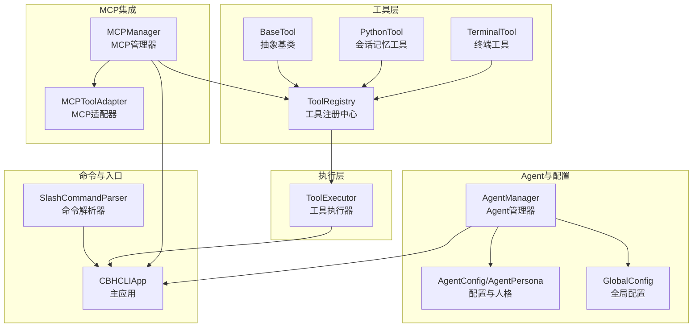
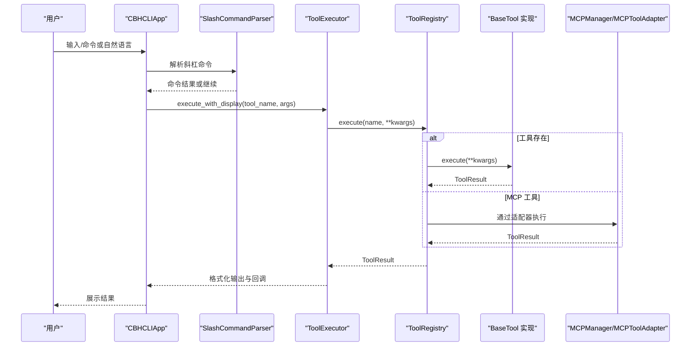
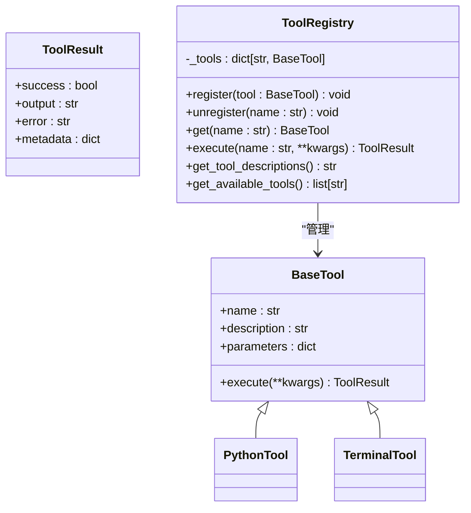
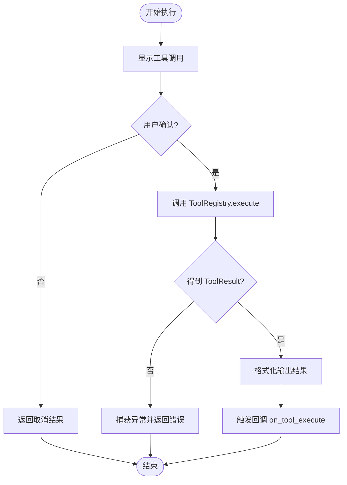
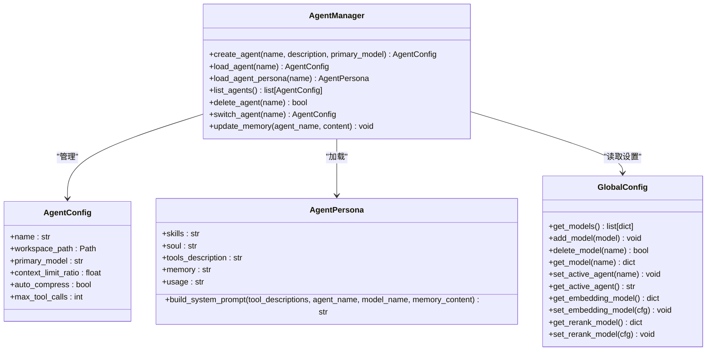
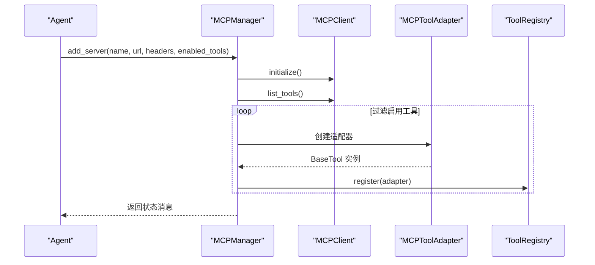
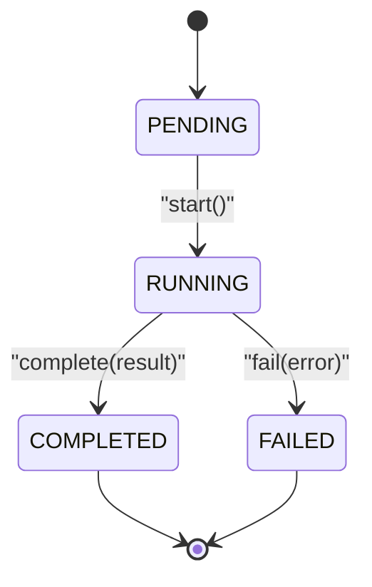
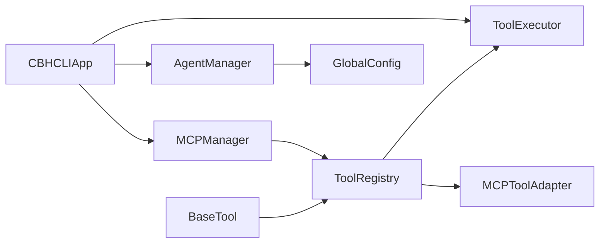

# 扩展开发指南

<cite>
**本文引用的文件**
- [cbhcli_pkg/tools/base.py](file://cbhcli_pkg/tools/base.py)
- [cbhcli_pkg/tools/registry.py](file://cbhcli_pkg/tools/registry.py)
- [cbhcli_pkg/core/tool_executor.py](file://cbhcli_pkg/core/tool_executor.py)
- [cbhcli_pkg/core/mcp_manager.py](file://cbhcli_pkg/core/mcp_manager.py)
- [cbhcli_pkg/core/mcp_tool_adapter.py](file://cbhcli_pkg/core/mcp_tool_adapter.py)
- [cbhcli_pkg/tools/python_tool.py](file://cbhcli_pkg/tools/python_tool.py)
- [cbhcli_pkg/tools/terminal.py](file://cbhcli_pkg/tools/terminal.py)
- [cbhcli_pkg/core/app.py](file://cbhcli_pkg/core/app.py)
- [cbhcli_pkg/core/subagent.py](file://cbhcli_pkg/core/subagent.py)
- [cbhcli_pkg/config/global_config.py](file://cbhcli_pkg/config/global_config.py)
- [cbhcli_pkg/commands/parser.py](file://cbhcli_pkg/commands/parser.py)
- [cbhcli_pkg/core/agent.py](file://cbhcli_pkg/core/agent.py)
- [cbhcli_pkg/core/constants.py](file://cbhcli_pkg/core/constants.py)
- [cbhcli_pkg/core/errors.py](file://cbhcli_pkg/core/errors.py)
</cite>

## 目录
1. [简介](#简介)
2. [项目结构](#项目结构)
3. [核心组件](#核心组件)
4. [架构总览](#架构总览)
5. [详细组件分析](#详细组件分析)
6. [依赖分析](#依赖分析)
7. [性能考虑](#性能考虑)
8. [故障排查指南](#故障排查指南)
9. [结论](#结论)
10. [附录](#附录)

## 简介
本指南面向希望为 CBHCLI 开发扩展的开发者，涵盖以下主题：
- 如何开发自定义工具：继承 BaseTool 类、实现必需属性与方法、注册到 ToolRegistry 的完整流程
- Agent 扩展机制：自定义 Agent 类型、配置管理、工作空间扩展
- 工具开发最佳实践：错误处理、参数验证、异步操作支持
- 工具执行器的工作原理与扩展点
- MCP（Model Context Protocol）集成的开发方法
- 从简单工具到复杂工具的完整开发示例路径
- 工具生命周期管理、状态保持与资源清理
- 调试技巧与开发工具使用
- 高级架构扩展指导：自定义组件的集成方法

## 项目结构
CBHCLI 采用模块化设计，核心围绕“工具系统”“Agent 管理”“命令系统”“MCP 集成”展开。关键目录与职责如下：
- cbhcli_pkg/tools：工具定义与注册中心
- cbhcli_pkg/core：应用主流程、工具执行器、MCP 管理器、Agent 管理器、常量与错误定义
- cbhcli_pkg/config：全局配置管理
- cbhcli_pkg/commands：斜杠命令解析与注册
- cbhcli_pkg/context/vector：向量检索与索引（可选）

图表来源
- [cbhcli_pkg/tools/registry.py:51-115](file://cbhcli_pkg/tools/registry.py#L51-L115)
- [cbhcli_pkg/core/tool_executor.py:15-168](file://cbhcli_pkg/core/tool_executor.py#L15-L168)
- [cbhcli_pkg/core/mcp_manager.py:11-366](file://cbhcli_pkg/core/mcp_manager.py#L11-L366)
- [cbhcli_pkg/core/mcp_tool_adapter.py:7-116](file://cbhcli_pkg/core/mcp_tool_adapter.py#L7-L116)
- [cbhcli_pkg/tools/python_tool.py:127-207](file://cbhcli_pkg/tools/python_tool.py#L127-L207)
- [cbhcli_pkg/tools/terminal.py:7-99](file://cbhcli_pkg/tools/terminal.py#L7-L99)
- [cbhcli_pkg/core/app.py:54-478](file://cbhcli_pkg/core/app.py#L54-L478)
- [cbhcli_pkg/core/agent.py:572-762](file://cbhcli_pkg/core/agent.py#L572-L762)
- [cbhcli_pkg/config/global_config.py:13-154](file://cbhcli_pkg/config/global_config.py#L13-L154)
- [cbhcli_pkg/commands/parser.py:16-94](file://cbhcli_pkg/commands/parser.py#L16-L94)

章节来源
- [cbhcli_pkg/core/app.py:54-478](file://cbhcli_pkg/core/app.py#L54-L478)
- [cbhcli_pkg/tools/registry.py:51-115](file://cbhcli_pkg/tools/registry.py#L51-L115)
- [cbhcli_pkg/core/tool_executor.py:15-168](file://cbhcli_pkg/core/tool_executor.py#L15-L168)
- [cbhcli_pkg/core/mcp_manager.py:11-366](file://cbhcli_pkg/core/mcp_manager.py#L11-L366)
- [cbhcli_pkg/core/mcp_tool_adapter.py:7-116](file://cbhcli_pkg/core/mcp_tool_adapter.py#L7-L116)
- [cbhcli_pkg/tools/python_tool.py:127-207](file://cbhcli_pkg/tools/python_tool.py#L127-L207)
- [cbhcli_pkg/tools/terminal.py:7-99](file://cbhcli_pkg/tools/terminal.py#L7-L99)
- [cbhcli_pkg/core/agent.py:572-762](file://cbhcli_pkg/core/agent.py#L572-L762)
- [cbhcli_pkg/config/global_config.py:13-154](file://cbhcli_pkg/config/global_config.py#L13-L154)
- [cbhcli_pkg/commands/parser.py:16-94](file://cbhcli_pkg/commands/parser.py#L16-L94)

## 核心组件
- 工具抽象与注册中心
  - BaseTool：定义工具名称、描述、参数 Schema、execute 方法
  - ToolRegistry：统一注册、注销、查找、执行工具；提供工具描述聚合与可用工具列表
- 工具执行器
  - ToolExecutor：负责工具调用前确认、执行、结果格式化输出、回调钩子
- Agent 管理与配置
  - AgentManager：创建/加载/切换 Agent，维护工作空间与 MD 模板
  - AgentConfig/AgentPersona：配置与系统提示构建
  - GlobalConfig：全局设置、模型与嵌入/重排序模型配置
- MCP 集成
  - MCPManager：每个 Agent 独立管理 MCP 连接、工具注册与启停
  - MCPToolAdapter：将 MCP 工具包装为 BaseTool，注入 ToolRegistry
- 命令系统
  - SlashCommandParser：命令注册、解析与执行
- 主应用
  - CBHCLIApp：初始化工具、命令、Agent、UI、会话与上下文压缩；协调工具执行与 AI 处理

章节来源
- [cbhcli_pkg/tools/registry.py:16-115](file://cbhcli_pkg/tools/registry.py#L16-L115)
- [cbhcli_pkg/core/tool_executor.py:15-168](file://cbhcli_pkg/core/tool_executor.py#L15-L168)
- [cbhcli_pkg/core/agent.py:572-762](file://cbhcli_pkg/core/agent.py#L572-L762)
- [cbhcli_pkg/config/global_config.py:13-154](file://cbhcli_pkg/config/global_config.py#L13-L154)
- [cbhcli_pkg/core/mcp_manager.py:11-366](file://cbhcli_pkg/core/mcp_manager.py#L11-L366)
- [cbhcli_pkg/core/mcp_tool_adapter.py:7-116](file://cbhcli_pkg/core/mcp_tool_adapter.py#L7-L116)
- [cbhcli_pkg/commands/parser.py:16-94](file://cbhcli_pkg/commands/parser.py#L16-L94)
- [cbhcli_pkg/core/app.py:54-478](file://cbhcli_pkg/core/app.py#L54-L478)

## 架构总览
CBHCLI 的扩展开发围绕“工具—执行—Agent—命令—MCP”的链路展开。开发者新增工具时，需实现 BaseTool 并注册到 ToolRegistry；工具执行由 ToolExecutor 控制；Agent 管理器负责工作空间与配置；MCP 管理器负责外部工具桥接。

图表来源
- [cbhcli_pkg/core/app.py:422-440](file://cbhcli_pkg/core/app.py#L422-L440)
- [cbhcli_pkg/commands/parser.py:51-78](file://cbhcli_pkg/commands/parser.py#L51-L78)
- [cbhcli_pkg/core/tool_executor.py:42-91](file://cbhcli_pkg/core/tool_executor.py#L42-L91)
- [cbhcli_pkg/tools/registry.py:70-96](file://cbhcli_pkg/tools/registry.py#L70-L96)
- [cbhcli_pkg/core/mcp_manager.py:268-316](file://cbhcli_pkg/core/mcp_manager.py#L268-L316)
- [cbhcli_pkg/core/mcp_tool_adapter.py:44-116](file://cbhcli_pkg/core/mcp_tool_adapter.py#L44-L116)

## 详细组件分析

### 工具系统与注册中心
- BaseTool 规范
  - name/description/parameters：用于系统提示与参数校验
  - execute(**kwargs)：返回 ToolResult(success, output, error, metadata)
- ToolRegistry
  - register/unregister/get：工具生命周期管理
  - execute：统一执行入口，捕获异常并返回标准化结果
  - get_tool_descriptions/get_available_tools：用于系统提示与工具列表

图表来源
- [cbhcli_pkg/tools/registry.py:16-115](file://cbhcli_pkg/tools/registry.py#L16-L115)
- [cbhcli_pkg/tools/python_tool.py:127-207](file://cbhcli_pkg/tools/python_tool.py#L127-L207)
- [cbhcli_pkg/tools/terminal.py:7-99](file://cbhcli_pkg/tools/terminal.py#L7-L99)

章节来源
- [cbhcli_pkg/tools/registry.py:16-115](file://cbhcli_pkg/tools/registry.py#L16-L115)
- [cbhcli_pkg/tools/python_tool.py:127-207](file://cbhcli_pkg/tools/python_tool.py#L127-L207)
- [cbhcli_pkg/tools/terminal.py:7-99](file://cbhcli_pkg/tools/terminal.py#L7-L99)

### 工具执行器
- 功能要点
  - 命令调用展示、执行前确认、结果格式化输出
  - 支持详细/简洁模式切换、回调钩子 on_tool_execute
  - 与 ToolRegistry 协作，统一对 ToolResult 的处理
- 关键流程
  - _display_tool_call/_display_result：控制台输出
  - _confirm_execution：用户确认与“all”跳过
  - execute_with_display：完整执行链路

图表来源
- [cbhcli_pkg/core/tool_executor.py:42-168](file://cbhcli_pkg/core/tool_executor.py#L42-L168)

章节来源
- [cbhcli_pkg/core/tool_executor.py:15-168](file://cbhcli_pkg/core/tool_executor.py#L15-L168)

### Agent 扩展机制
- AgentManager
  - 创建 Agent 时生成工作空间与模板文件（skills/soul/tools/memory/usage）
  - 加载 Agent 配置与人格（skills/soul/tools/memory/usage/md）
  - 支持切换 Agent、删除 Agent、更新记忆
- AgentConfig/AgentPersona
  - AgentConfig：工作空间路径、首选模型、上下文压缩策略、最大工具调用次数
  - AgentPersona.build_system_prompt：拼装系统提示，包含基本信息、长期记忆、使用说明、技能、性格、工具指南与可用工具描述
- GlobalConfig
  - 全局设置、模型与嵌入/重排序模型配置
  - 与 Agent 工作空间路径、自动压缩、知识库目录等强关联

图表来源
- [cbhcli_pkg/core/agent.py:572-762](file://cbhcli_pkg/core/agent.py#L572-L762)
- [cbhcli_pkg/config/global_config.py:13-154](file://cbhcli_pkg/config/global_config.py#L13-L154)

章节来源
- [cbhcli_pkg/core/agent.py:572-762](file://cbhcli_pkg/core/agent.py#L572-L762)
- [cbhcli_pkg/config/global_config.py:13-154](file://cbhcli_pkg/config/global_config.py#L13-L154)

### MCP 集成与适配
- MCPManager
  - 每个 Agent 独立管理 MCP 服务器列表与连接
  - 自动加载配置、连接服务器、注册工具、保存配置
  - 支持增删服务器、列出工具、启用/禁用工具、刷新连接
- MCPToolAdapter
  - 将 MCP 工具包装为 BaseTool，名称加前缀避免冲突
  - 解析 MCP 返回的多类型内容（文本/图片/资源），统一为输出字符串
  - 输出过长时提供摘要或截断

图表来源
- [cbhcli_pkg/core/mcp_manager.py:69-122](file://cbhcli_pkg/core/mcp_manager.py#L69-L122)
- [cbhcli_pkg/core/mcp_manager.py:268-316](file://cbhcli_pkg/core/mcp_manager.py#L268-L316)
- [cbhcli_pkg/core/mcp_tool_adapter.py:13-116](file://cbhcli_pkg/core/mcp_tool_adapter.py#L13-L116)

章节来源
- [cbhcli_pkg/core/mcp_manager.py:11-366](file://cbhcli_pkg/core/mcp_manager.py#L11-L366)
- [cbhcli_pkg/core/mcp_tool_adapter.py:7-116](file://cbhcli_pkg/core/mcp_tool_adapter.py#L7-L116)

### 子 Agent 机制
- SubAgentScheduler
  - 临时子 Agent 创建、状态管理（pending/running/completed/failed）
  - 等待并获取结果、清理资源、统计活跃数量
- 适用场景
  - 复杂任务拆分、并行子任务、结果汇总与回传

图表来源
- [cbhcli_pkg/core/subagent.py:9-118](file://cbhcli_pkg/core/subagent.py#L9-L118)

章节来源
- [cbhcli_pkg/core/subagent.py:1-118](file://cbhcli_pkg/core/subagent.py#L1-L118)

### 命令系统与主应用
- SlashCommandParser
  - 注册命令、解析输入、执行命令、生成帮助文本
- CBHCLIApp
  - 初始化配置、工具、命令、UI、Agent、会话与上下文压缩
  - 协调工具执行与 AI 处理，提供交互循环

章节来源
- [cbhcli_pkg/commands/parser.py:16-94](file://cbhcli_pkg/commands/parser.py#L16-L94)
- [cbhcli_pkg/core/app.py:54-478](file://cbhcli_pkg/core/app.py#L54-L478)

## 依赖分析
- 组件耦合
  - ToolExecutor 依赖 ToolRegistry；ToolRegistry 依赖 BaseTool
  - MCPManager 依赖 MCPClient 与 ToolRegistry；MCPToolAdapter 继承 BaseTool
  - AgentManager 与 GlobalConfig 协同提供工作空间与配置
  - CBHCLIApp 组合上述组件，形成主控制流
- 外部依赖
  - 命令行交互依赖 prompt_toolkit
  - 工具执行依赖 subprocess（TerminalTool）、会话内存（PythonTool）
  - 向量检索（可选）依赖嵌入与重排序客户端

图表来源
- [cbhcli_pkg/tools/registry.py:51-115](file://cbhcli_pkg/tools/registry.py#L51-L115)
- [cbhcli_pkg/core/tool_executor.py:24-32](file://cbhcli_pkg/core/tool_executor.py#L24-L32)
- [cbhcli_pkg/core/mcp_manager.py:18-28](file://cbhcli_pkg/core/mcp_manager.py#L18-L28)
- [cbhcli_pkg/core/mcp_tool_adapter.py:13-22](file://cbhcli_pkg/core/mcp_tool_adapter.py#L13-L22)
- [cbhcli_pkg/core/agent.py:572-583](file://cbhcli_pkg/core/agent.py#L572-L583)
- [cbhcli_pkg/config/global_config.py:16-18](file://cbhcli_pkg/config/global_config.py#L16-L18)
- [cbhcli_pkg/core/app.py:64-71](file://cbhcli_pkg/core/app.py#L64-L71)

章节来源
- [cbhcli_pkg/core/app.py:64-71](file://cbhcli_pkg/core/app.py#L64-L71)
- [cbhcli_pkg/tools/registry.py:51-115](file://cbhcli_pkg/tools/registry.py#L51-L115)
- [cbhcli_pkg/core/tool_executor.py:24-32](file://cbhcli_pkg/core/tool_executor.py#L24-L32)
- [cbhcli_pkg/core/mcp_manager.py:18-28](file://cbhcli_pkg/core/mcp_manager.py#L18-L28)
- [cbhcli_pkg/core/mcp_tool_adapter.py:13-22](file://cbhcli_pkg/core/mcp_tool_adapter.py#L13-L22)
- [cbhcli_pkg/core/agent.py:572-583](file://cbhcli_pkg/core/agent.py#L572-L583)
- [cbhcli_pkg/config/global_config.py:16-18](file://cbhcli_pkg/config/global_config.py#L16-L18)

## 性能考虑
- 工具输出截断与预览
  - ToolExecutor 对输出进行长度限制与预览，避免大文本影响交互体验
  - ToolRegistry/ToolExecutor 常量定义了最大输出长度与预览长度
- 上下文压缩
  - CBHCLIApp 在会话中根据阈值自动压缩，减少 Token 使用
- 超时控制
  - TerminalTool 对外部进程通信设置了超时，防止阻塞
- 会话状态管理
  - PythonTool 的会话记忆在重置或切换 Agent 时清理，避免状态泄漏

章节来源
- [cbhcli_pkg/core/constants.py:10-16](file://cbhcli_pkg/core/constants.py#L10-L16)
- [cbhcli_pkg/core/tool_executor.py:142-159](file://cbhcli_pkg/core/tool_executor.py#L142-L159)
- [cbhcli_pkg/tools/terminal.py:56-66](file://cbhcli_pkg/tools/terminal.py#L56-L66)
- [cbhcli_pkg/core/app.py:298-301](file://cbhcli_pkg/core/app.py#L298-L301)

## 故障排查指南
- 常见异常类型
  - ModelNotConfiguredError：未配置模型导致无法发起 AI 请求
  - ToolExecutionError：工具执行失败
  - ContextLimitExceededError：上下文超限
  - AgentNotFoundError：Agent 不存在
  - SessionError：会话错误
- 排查建议
  - 确认 Agent 配置与模型设置
  - 检查工具参数 Schema 与必填项
  - 查看 ToolExecutor 的详细输出模式（Ctrl+R 切换）
  - 检查 MCP 服务器连接状态与工具启用列表
  - 使用 /help 与命令帮助定位问题

章节来源
- [cbhcli_pkg/core/errors.py:4-32](file://cbhcli_pkg/core/errors.py#L4-L32)
- [cbhcli_pkg/core/app.py:190-196](file://cbhcli_pkg/core/app.py#L190-L196)
- [cbhcli_pkg/core/mcp_manager.py:124-154](file://cbhcli_pkg/core/mcp_manager.py#L124-L154)

## 结论
通过本指南，开发者可以系统地理解 CBHCLI 的扩展架构与开发流程。遵循 BaseTool 规范、使用 ToolRegistry 注册工具、借助 ToolExecutor 执行与展示、结合 Agent 管理与 MCP 集成，即可快速构建从简单到复杂的工具与 Agent 扩展。同时，利用命令系统、上下文压缩与错误处理机制，可确保扩展具备良好的稳定性与用户体验。

## 附录

### 开发步骤速查
- 新建工具
  - 继承 BaseTool，实现 name/description/parameters/execute
  - 在应用初始化阶段注册到 ToolRegistry
- 工具执行
  - 使用 ToolExecutor.execute_with_display 进行确认与展示
- Agent 扩展
  - 使用 AgentManager 创建/切换 Agent，编辑工作空间内的模板文件
- MCP 集成
  - 通过 MCPManager.add_server 添加服务器，自动注册工具
- 命令扩展
  - 使用 SlashCommandParser.register 注册新命令

章节来源
- [cbhcli_pkg/tools/registry.py:57-68](file://cbhcli_pkg/tools/registry.py#L57-L68)
- [cbhcli_pkg/core/tool_executor.py:54-91](file://cbhcli_pkg/core/tool_executor.py#L54-L91)
- [cbhcli_pkg/core/mcp_manager.py:69-98](file://cbhcli_pkg/core/mcp_manager.py#L69-L98)
- [cbhcli_pkg/commands/parser.py:22-24](file://cbhcli_pkg/commands/parser.py#L22-L24)