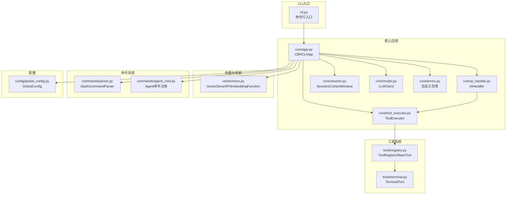
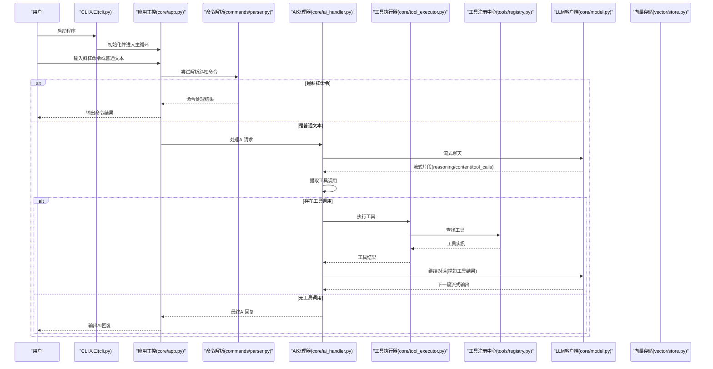
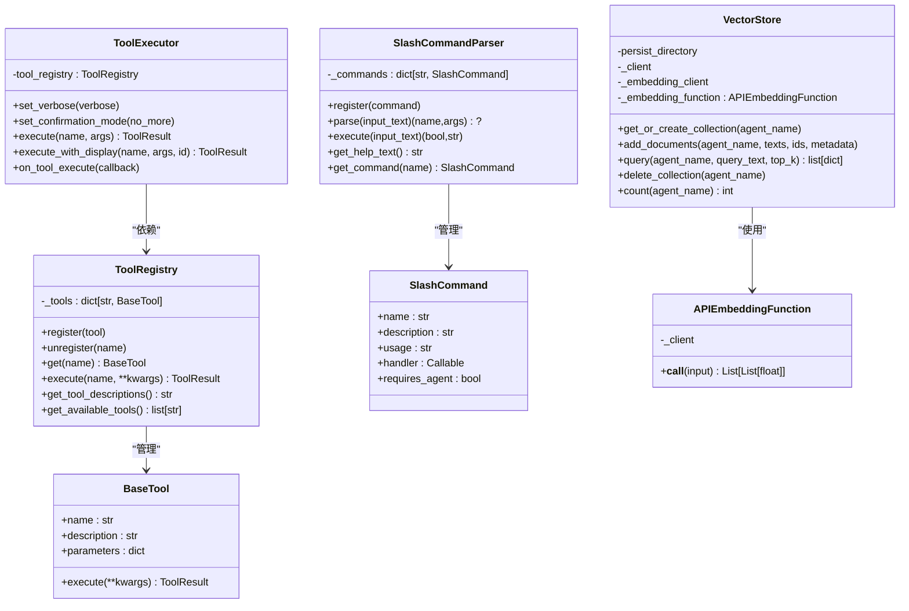
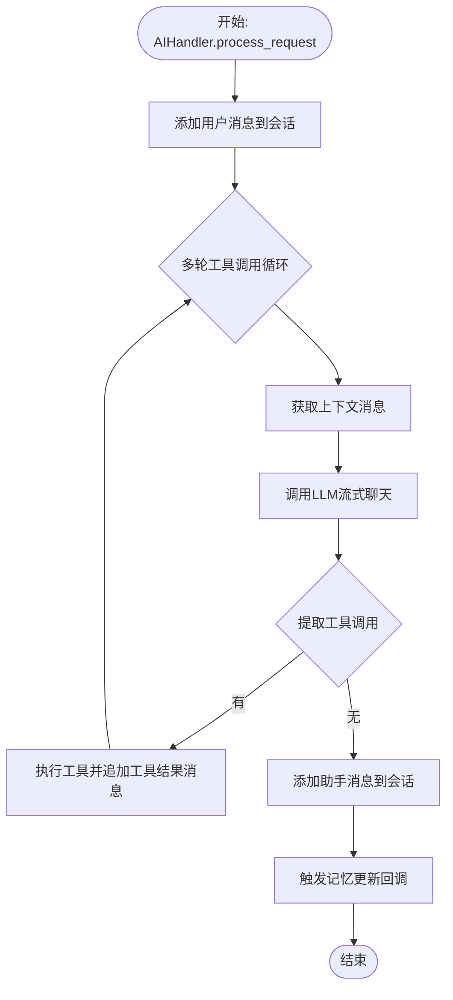
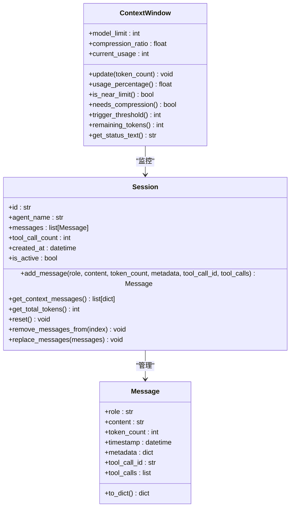
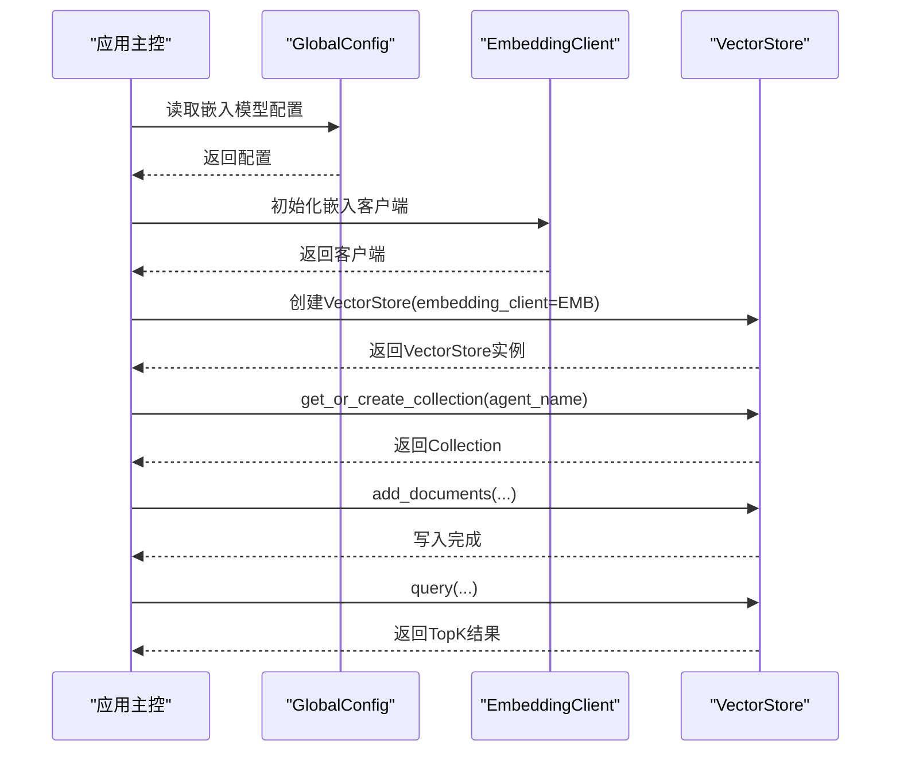
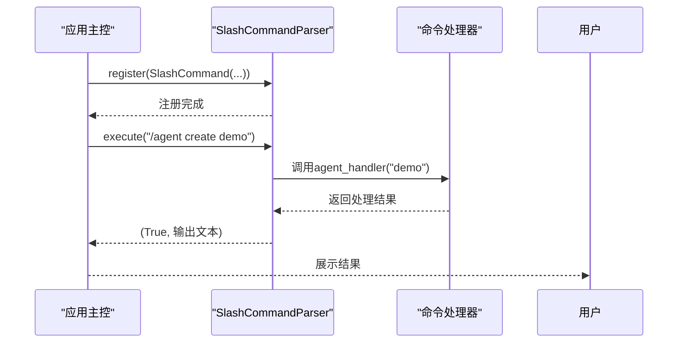
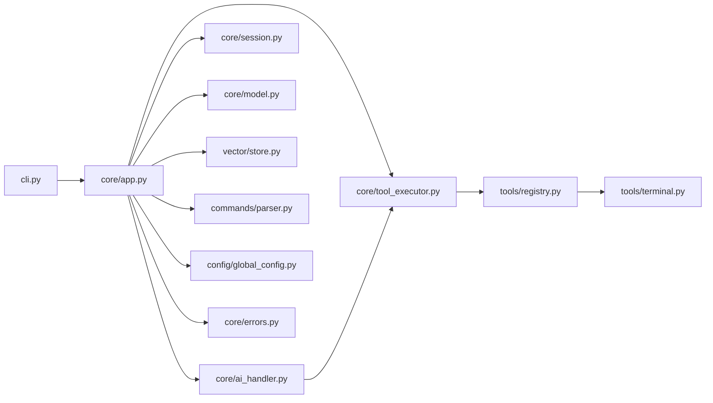

# 组件扩展架构

<cite>
**本文引用的文件**
- [cbhcli_pkg/__init__.py](file://cbhcli_pkg/__init__.py)
- [cbhcli_pkg/cli.py](file://cbhcli_pkg/cli.py)
- [cbhcli_pkg/core/app.py](file://cbhcli_pkg/core/app.py)
- [cbhcli_pkg/core/ai_handler.py](file://cbhcli_pkg/core/ai_handler.py)
- [cbhcli_pkg/core/session.py](file://cbhcli_pkg/core/session.py)
- [cbhcli_pkg/core/tool_executor.py](file://cbhcli_pkg/core/tool_executor.py)
- [cbhcli_pkg/core/model.py](file://cbhcli_pkg/core/model.py)
- [cbhcli_pkg/core/errors.py](file://cbhcli_pkg/core/errors.py)
- [cbhcli_pkg/tools/registry.py](file://cbhcli_pkg/tools/registry.py)
- [cbhcli_pkg/tools/terminal.py](file://cbhcli_pkg/tools/terminal.py)
- [cbhcli_pkg/vector/store.py](file://cbhcli_pkg/vector/store.py)
- [cbhcli_pkg/commands/parser.py](file://cbhcli_pkg/commands/parser.py)
- [cbhcli_pkg/commands/agent_cmd.py](file://cbhcli_pkg/commands/agent_cmd.py)
- [cbhcli_pkg/config/global_config.py](file://cbhcli_pkg/config/global_config.py)
</cite>

## 目录
1. [简介](#简介)
2. [项目结构](#项目结构)
3. [核心组件](#核心组件)
4. [架构总览](#架构总览)
5. [组件详解与扩展点](#组件详解与扩展点)
6. [依赖关系分析](#依赖关系分析)
7. [性能考量](#性能考量)
8. [故障排查指南](#故障排查指南)
9. [结论](#结论)
10. [附录](#附录)

## 简介
本指南面向希望对 CBHCLI 进行深度扩展与定制的开发者，系统阐述其组件扩展架构与实现机制。重点覆盖以下方面：
- 插件系统与扩展点：工具注册中心、命令解析器、向量存储适配、模型客户端扩展
- 核心组件扩展：AIHandler、Session、VectorStore 的扩展路径
- 命令系统扩展：自定义命令的注册、路由与执行流程
- 错误处理扩展：自定义异常类型、传播与恢复策略
- 配置系统扩展：新增配置项、校验与动态加载
- 依赖注入与解耦：组件间协作与接口契约
- 生命周期管理：初始化顺序、资源管理与清理
- 测试与集成最佳实践：单元测试与端到端验证

## 项目结构
CBHCLI 采用“功能域+层次化”组织方式，核心模块位于 cbhcli_pkg 下：
- core：应用核心（AIHandler、Session、LLMClient、工具执行器、错误类型等）
- tools：工具体系（注册中心、具体工具实现）
- vector：向量存储封装（ChromaDB 封装与自定义嵌入函数）
- commands：命令系统（解析器与各子命令注册）
- config：全局配置管理
- context：上下文压缩与计数（在 app 中被引用）
- cli：命令行入口与帮助信息

图表来源
- [cbhcli_pkg/cli.py:1-112](file://cbhcli_pkg/cli.py#L1-L112)
- [cbhcli_pkg/core/app.py:1-478](file://cbhcli_pkg/core/app.py#L1-L478)
- [cbhcli_pkg/core/ai_handler.py:1-743](file://cbhcli_pkg/core/ai_handler.py#L1-L743)
- [cbhcli_pkg/core/session.py:1-190](file://cbhcli_pkg/core/session.py#L1-L190)
- [cbhcli_pkg/core/tool_executor.py:1-168](file://cbhcli_pkg/core/tool_executor.py#L1-L168)
- [cbhcli_pkg/core/model.py:1-147](file://cbhcli_pkg/core/model.py#L1-L147)
- [cbhcli_pkg/core/errors.py:1-32](file://cbhcli_pkg/core/errors.py#L1-L32)
- [cbhcli_pkg/tools/registry.py:1-115](file://cbhcli_pkg/tools/registry.py#L1-L115)
- [cbhcli_pkg/tools/terminal.py:1-99](file://cbhcli_pkg/tools/terminal.py#L1-L99)
- [cbhcli_pkg/vector/store.py:1-175](file://cbhcli_pkg/vector/store.py#L1-L175)
- [cbhcli_pkg/commands/parser.py:1-94](file://cbhcli_pkg/commands/parser.py#L1-L94)
- [cbhcli_pkg/commands/agent_cmd.py:1-181](file://cbhcli_pkg/commands/agent_cmd.py#L1-L181)
- [cbhcli_pkg/config/global_config.py:1-154](file://cbhcli_pkg/config/global_config.py#L1-L154)

章节来源
- [cbhcli_pkg/__init__.py:1-9](file://cbhcli_pkg/__init__.py#L1-L9)
- [cbhcli_pkg/cli.py:1-112](file://cbhcli_pkg/cli.py#L1-L112)
- [cbhcli_pkg/core/app.py:1-478](file://cbhcli_pkg/core/app.py#L1-L478)

## 核心组件
- 应用主控：负责初始化配置、工具、向量存储、命令、UI、Agent，并维护主交互循环
- AI 请求处理器：封装与 LLM 的交互、流式输出、工具调用提取与执行
- 会话与上下文：消息结构、上下文窗口与压缩阈值控制
- 工具系统：统一注册中心与工具基类，支持工具执行、确认与结果展示
- 模型客户端：统一的 LLM API 封装，支持非流式与流式聊天
- 向量存储：基于 ChromaDB 的持久化向量库，支持自定义嵌入函数
- 命令系统：斜杠命令解析器与各子命令注册
- 配置系统：全局配置文件管理、模型与嵌入/重排序模型配置
- 错误系统：自定义异常类型，便于上层捕获与恢复

章节来源
- [cbhcli_pkg/core/app.py:54-280](file://cbhcli_pkg/core/app.py#L54-L280)
- [cbhcli_pkg/core/ai_handler.py:21-96](file://cbhcli_pkg/core/ai_handler.py#L21-L96)
- [cbhcli_pkg/core/session.py:37-190](file://cbhcli_pkg/core/session.py#L37-L190)
- [cbhcli_pkg/core/tool_executor.py:15-92](file://cbhcli_pkg/core/tool_executor.py#L15-L92)
- [cbhcli_pkg/core/model.py:7-147](file://cbhcli_pkg/core/model.py#L7-L147)
- [cbhcli_pkg/vector/store.py:37-175](file://cbhcli_pkg/vector/store.py#L37-L175)
- [cbhcli_pkg/commands/parser.py:16-94](file://cbhcli_pkg/commands/parser.py#L16-L94)
- [cbhcli_pkg/config/global_config.py:13-154](file://cbhcli_pkg/config/global_config.py#L13-L154)
- [cbhcli_pkg/core/errors.py:4-32](file://cbhcli_pkg/core/errors.py#L4-L32)

## 架构总览
CBHCLI 采用“应用主控 + 组件装配 + 插件化”的架构：
- 应用主控在启动阶段完成配置、工具、向量、命令、UI、Agent 的初始化
- 交互循环中，命令解析器优先处理斜杠命令；否则委托 AIHandler 处理用户输入
- AIHandler 通过 LLMClient 获取流式响应，提取工具调用并通过 ToolExecutor 执行
- 向量存储在配置嵌入模型后按需启用，提供检索与重排序能力
- 错误系统通过自定义异常类型贯穿各组件，便于统一处理

图表来源
- [cbhcli_pkg/cli.py:73-112](file://cbhcli_pkg/cli.py#L73-L112)
- [cbhcli_pkg/core/app.py:386-421](file://cbhcli_pkg/core/app.py#L386-L421)
- [cbhcli_pkg/commands/parser.py:51-78](file://cbhcli_pkg/commands/parser.py#L51-L78)
- [cbhcli_pkg/core/ai_handler.py:51-96](file://cbhcli_pkg/core/ai_handler.py#L51-L96)
- [cbhcli_pkg/core/tool_executor.py:54-91](file://cbhcli_pkg/core/tool_executor.py#L54-L91)
- [cbhcli_pkg/core/model.py:59-120](file://cbhcli_pkg/core/model.py#L59-L120)
- [cbhcli_pkg/vector/store.py:128-160](file://cbhcli_pkg/vector/store.py#L128-L160)

## 组件详解与扩展点

### 插件系统与扩展点
- 工具系统（工具注册中心）
  - 扩展点：实现 BaseTool 抽象基类，定义 name/description/parameters/execute
  - 注册：通过 ToolRegistry.register 完成注册，随后可在系统提示中自动呈现
  - 执行：ToolExecutor.execute_with_display 提供确认、展示与回调
- 命令系统（斜杠命令解析器）
  - 扩展点：定义 SlashCommand 并通过 SlashCommandParser.register 注册
  - 路由：解析器按命令名路由到对应 handler
  - 示例：Agent 命令注册在命令模块中集中完成
- 向量存储（VectorStore）
  - 扩展点：通过自定义嵌入函数 APIEmbeddingFunction 适配任意嵌入模型
  - 启用条件：需在配置中设置嵌入模型，否则提示启用
- 模型客户端（LLMClient）
  - 扩展点：通过统一的 chat/chat_stream/embeddings 接口适配不同服务端
  - 注意：流式输出支持 reasoning/content/tool_calls 三类片段

图表来源
- [cbhcli_pkg/tools/registry.py:16-115](file://cbhcli_pkg/tools/registry.py#L16-L115)
- [cbhcli_pkg/core/tool_executor.py:15-92](file://cbhcli_pkg/core/tool_executor.py#L15-L92)
- [cbhcli_pkg/commands/parser.py:6-94](file://cbhcli_pkg/commands/parser.py#L6-L94)
- [cbhcli_pkg/vector/store.py:12-35](file://cbhcli_pkg/vector/store.py#L12-L35)
- [cbhcli_pkg/vector/store.py:37-175](file://cbhcli_pkg/vector/store.py#L37-L175)

章节来源
- [cbhcli_pkg/tools/registry.py:16-115](file://cbhcli_pkg/tools/registry.py#L16-L115)
- [cbhcli_pkg/core/tool_executor.py:15-92](file://cbhcli_pkg/core/tool_executor.py#L15-L92)
- [cbhcli_pkg/commands/parser.py:16-94](file://cbhcli_pkg/commands/parser.py#L16-L94)
- [cbhcli_pkg/vector/store.py:37-175](file://cbhcli_pkg/vector/store.py#L37-L175)

### 核心组件扩展方法

#### AIHandler 扩展
- 扩展点
  - 工具调用提取：支持 DSML、Python 函数、JSON、纯文本命令等多种格式
  - 流式输出处理：区分 reasoning/content/tool_calls 片段，增量清洗与展示
  - 多轮工具调用：在每轮结束后注入格式提示，确保工具调用一致性
  - 回调机制：on_memory_update 提供记忆更新钩子
- 扩展建议
  - 自定义工具调用格式：在工具调用提取逻辑中增加新格式分支
  - 自定义响应清洗：扩展 ResponseCleaner 或在 AIHandler 中注入清洗策略
  - 自定义多轮提示：在多轮工具调用中注入领域特定的格式提示

图表来源
- [cbhcli_pkg/core/ai_handler.py:51-96](file://cbhcli_pkg/core/ai_handler.py#L51-L96)
- [cbhcli_pkg/core/ai_handler.py:98-216](file://cbhcli_pkg/core/ai_handler.py#L98-L216)
- [cbhcli_pkg/core/ai_handler.py:264-502](file://cbhcli_pkg/core/ai_handler.py#L264-L502)
- [cbhcli_pkg/core/ai_handler.py:664-735](file://cbhcli_pkg/core/ai_handler.py#L664-L735)

章节来源
- [cbhcli_pkg/core/ai_handler.py:21-743](file://cbhcli_pkg/core/ai_handler.py#L21-L743)

#### Session 与 ContextWindow 扩展
- 扩展点
  - Message 数据结构：支持 tool_calls、tool_call_id、metadata 等字段
  - Session：消息增删、上下文导出、令牌统计、重置与替换
  - ContextWindow：阈值触发、使用百分比、剩余令牌、状态文本
- 扩展建议
  - 自定义消息格式：在 Message.to_dict 中扩展 API 消息字段
  - 自定义上下文压缩策略：在 ContextWindow 基础上实现更复杂的压缩算法
  - 自定义令牌计数器：结合 Tokenizer 实现更精确的计数

图表来源
- [cbhcli_pkg/core/session.py:8-190](file://cbhcli_pkg/core/session.py#L8-L190)

章节来源
- [cbhcli_pkg/core/session.py:37-190](file://cbhcli_pkg/core/session.py#L37-L190)

#### VectorStore 扩展
- 扩展点
  - 自定义嵌入函数：APIEmbeddingFunction 适配任意嵌入模型 API
  - 集合管理：按 Agent 名称创建/获取集合，支持元数据与批量写入
  - 查询与计数：语义查询、删除集合、统计文档数量
- 扩展建议
  - 自定义嵌入模型：实现新的嵌入客户端并通过 APIEmbeddingFunction 注入
  - 自定义持久化：在 VectorStore 中扩展持久化策略（如远程服务）
  - 自定义检索：在 query 中加入重排序、过滤与评分策略

图表来源
- [cbhcli_pkg/core/app.py:97-150](file://cbhcli_pkg/core/app.py#L97-L150)
- [cbhcli_pkg/config/global_config.py:117-135](file://cbhcli_pkg/config/global_config.py#L117-L135)
- [cbhcli_pkg/vector/store.py:37-175](file://cbhcli_pkg/vector/store.py#L37-L175)

章节来源
- [cbhcli_pkg/vector/store.py:37-175](file://cbhcli_pkg/vector/store.py#L37-L175)

### 命令系统扩展机制
- 注册与路由
  - 定义 SlashCommand 并通过 SlashCommandParser.register 注册
  - 解析器按“/命令 参数”格式解析，调用对应 handler
  - 支持 help 动态生成帮助文本
- 执行流程
  - execute 包装 handler 调用，捕获异常并返回统一格式输出
  - 可在 app 中集中注册各子命令模块（Agent、Session、Model、KB、Embedding、MCP）
- 自定义命令示例
  - 参考 Agent 命令注册，定义 handler 并在 app 初始化时注册

图表来源
- [cbhcli_pkg/commands/parser.py:22-78](file://cbhcli_pkg/commands/parser.py#L22-L78)
- [cbhcli_pkg/commands/agent_cmd.py:5-47](file://cbhcli_pkg/commands/agent_cmd.py#L5-L47)

章节来源
- [cbhcli_pkg/commands/parser.py:16-94](file://cbhcli_pkg/commands/parser.py#L16-L94)
- [cbhcli_pkg/commands/agent_cmd.py:1-181](file://cbhcli_pkg/commands/agent_cmd.py#L1-L181)

### 错误处理系统扩展
- 自定义异常类型
  - CBHCLIError 基类
  - ModelNotConfiguredError、ToolExecutionError、ContextLimitExceededError、AgentNotFoundError、SessionError
- 扩展建议
  - 在工具执行器中抛出自定义异常类型，便于上层区分与恢复
  - 在命令处理器中捕获并格式化输出，提升用户体验
  - 在 AIHandler 中对 LLM 调用失败进行异常包装与重试策略

章节来源
- [cbhcli_pkg/core/errors.py:4-32](file://cbhcli_pkg/core/errors.py#L4-L32)

### 配置系统扩展
- 全局配置
  - 模型管理：增删查、最近选择模型
  - Agent 管理：当前 Agent、默认 Agent
  - 设置：自动压缩、压缩比例、工作空间路径、知识库目录等
  - 嵌入/重排序模型：增删查、动态加载
- 扩展建议
  - 新增配置项：在默认配置中添加键值，在 getter/setter 中实现读写
  - 配置验证：在 setter 中增加参数校验与类型检查
  - 动态加载：在应用初始化阶段读取配置并按需启用功能（如向量存储）

章节来源
- [cbhcli_pkg/config/global_config.py:13-154](file://cbhcli_pkg/config/global_config.py#L13-L154)

### 依赖注入与解耦机制
- 组件装配
  - 应用主控在构造函数中完成配置、工具、向量、命令、UI、Agent 的初始化
  - AIHandler 依赖 LLMClient、Session、ToolExecutor、TokenCounter
  - ToolExecutor 依赖 ToolRegistry
  - VectorStore 依赖自定义嵌入函数
- 解耦策略
  - 通过接口与抽象类（BaseTool、Message、SlashCommand）降低耦合
  - 通过工厂与注册中心（ToolRegistry、SlashCommandParser）集中管理
  - 通过回调与事件（on_memory_update、on_tool_execute）实现松耦合扩展

章节来源
- [cbhcli_pkg/core/app.py:64-280](file://cbhcli_pkg/core/app.py#L64-L280)
- [cbhcli_pkg/core/ai_handler.py:31-50](file://cbhcli_pkg/core/ai_handler.py#L31-L50)
- [cbhcli_pkg/core/tool_executor.py:24-33](file://cbhcli_pkg/core/tool_executor.py#L24-L33)
- [cbhcli_pkg/vector/store.py:40-62](file://cbhcli_pkg/vector/store.py#L40-L62)

### 组件生命周期管理
- 初始化顺序
  - 配置加载 → 工具注册 → 向量存储（可选）→ 命令注册 → UI 初始化 → Agent 加载
- 资源管理
  - 向量存储：持久化目录、集合创建、文档写入与查询
  - LLM 客户端：HTTP 会话、超时与错误处理
  - 工具执行：确认模式、详细输出模式、回调注册
- 清理策略
  - 会话重置：保存当前会话到历史、清空 Python 会话记忆
  - Agent 切换：索引标记、会话重置、上下文压缩器重建

章节来源
- [cbhcli_pkg/core/app.py:73-280](file://cbhcli_pkg/core/app.py#L73-L280)
- [cbhcli_pkg/core/session.py:101-125](file://cbhcli_pkg/core/session.py#L101-L125)

### 组件测试与集成测试最佳实践
- 单元测试
  - 工具：Mock ToolRegistry，断言 execute_with_display 的输出与回调
  - AIHandler：Mock LLMClient，断言工具调用提取与执行流程
  - VectorStore：Mock 嵌入客户端，断言 add_documents/query 行为
- 集成测试
  - 命令系统：构造 SlashCommandParser，注册自定义命令，断言 execute 输出
  - 配置系统：修改 GlobalConfig，断言应用初始化行为变化
  - 端到端：模拟用户输入，断言 AIHandler 与 ToolExecutor 的协作

## 依赖关系分析

图表来源
- [cbhcli_pkg/cli.py:1-112](file://cbhcli_pkg/cli.py#L1-L112)
- [cbhcli_pkg/core/app.py:1-478](file://cbhcli_pkg/core/app.py#L1-L478)
- [cbhcli_pkg/core/ai_handler.py:1-743](file://cbhcli_pkg/core/ai_handler.py#L1-L743)
- [cbhcli_pkg/core/session.py:1-190](file://cbhcli_pkg/core/session.py#L1-L190)
- [cbhcli_pkg/core/tool_executor.py:1-168](file://cbhcli_pkg/core/tool_executor.py#L1-L168)
- [cbhcli_pkg/core/model.py:1-147](file://cbhcli_pkg/core/model.py#L1-L147)
- [cbhcli_pkg/vector/store.py:1-175](file://cbhcli_pkg/vector/store.py#L1-L175)
- [cbhcli_pkg/commands/parser.py:1-94](file://cbhcli_pkg/commands/parser.py#L1-L94)
- [cbhcli_pkg/config/global_config.py:1-154](file://cbhcli_pkg/config/global_config.py#L1-L154)
- [cbhcli_pkg/tools/registry.py:1-115](file://cbhcli_pkg/tools/registry.py#L1-L115)
- [cbhcli_pkg/tools/terminal.py:1-99](file://cbhcli_pkg/tools/terminal.py#L1-L99)
- [cbhcli_pkg/core/errors.py:1-32](file://cbhcli_pkg/core/errors.py#L1-L32)

章节来源
- [cbhcli_pkg/core/app.py:1-478](file://cbhcli_pkg/core/app.py#L1-L478)

## 性能考量
- 流式输出：LLMClient 的流式接口减少等待时间，提升交互体验
- 工具调用：ToolExecutor 的确认与预览有助于避免高风险命令带来的性能与安全问题
- 上下文压缩：ContextWindow 与 ContextCompressor 在接近阈值时自动压缩，避免超限
- 向量检索：预计算嵌入向量，避免第三方库默认模型调用开销

## 故障排查指南
- 模型未配置
  - 现象：会话中提示未配置模型
  - 处理：使用 /model 命令配置模型，或在 GlobalConfig 中添加模型
- 嵌入模型未配置
  - 现象：向量存储初始化失败或提示启用嵌入模型
  - 处理：配置嵌入模型，重启应用以启用向量功能
- 工具执行失败
  - 现象：工具返回错误或超时
  - 处理：检查工具参数、权限与超时设置；必要时抛出自定义异常类型
- 命令执行异常
  - 现象：命令返回失败信息
  - 处理：查看命令帮助文本，检查参数格式；在命令处理器中增强错误输出

章节来源
- [cbhcli_pkg/core/app.py:104-118](file://cbhcli_pkg/core/app.py#L104-L118)
- [cbhcli_pkg/core/errors.py:9-31](file://cbhcli_pkg/core/errors.py#L9-L31)

## 结论
CBHCLI 的组件扩展架构以“应用主控 + 插件化组件 + 统一接口”为核心，提供了清晰的扩展点与解耦机制。通过工具注册中心、命令解析器、向量存储与模型客户端的标准化接口，开发者可以快速实现从简单功能扩展到复杂模块集成的开发目标。配合完善的错误处理与配置系统，以及生命周期管理与测试最佳实践，CBHCLI 能够在保证稳定性的同时持续演进。

## 附录
- 扩展示例路径
  - 自定义工具：参考 [tools/terminal.py:7-99](file://cbhcli_pkg/tools/terminal.py#L7-L99)，实现 BaseTool 并在 [tools/registry.py:51-69](file://cbhcli_pkg/tools/registry.py#L51-L69) 注册
  - 自定义命令：参考 [commands/agent_cmd.py:5-47](file://cbhcli_pkg/commands/agent_cmd.py#L5-L47)，在 [commands/parser.py:22-24](file://cbhcli_pkg/commands/parser.py#L22-L24) 注册
  - 自定义嵌入模型：参考 [vector/store.py:12-35](file://cbhcli_pkg/vector/store.py#L12-L35)，在 [core/app.py:104-128](file://cbhcli_pkg/core/app.py#L104-L128) 初始化
  - 自定义异常：参考 [core/errors.py:4-32](file://cbhcli_pkg/core/errors.py#L4-L32)，在工具执行器中抛出