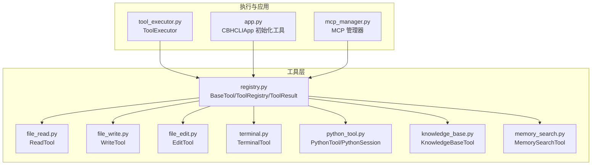
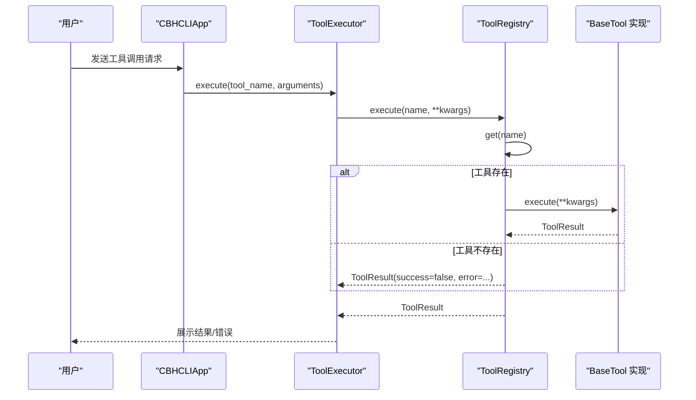
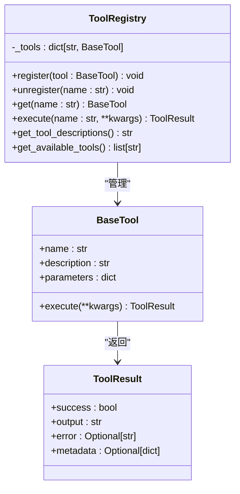
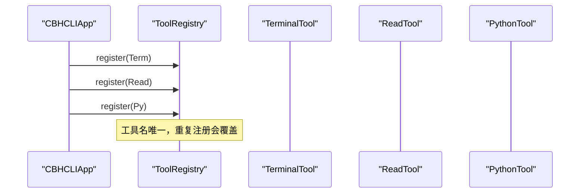
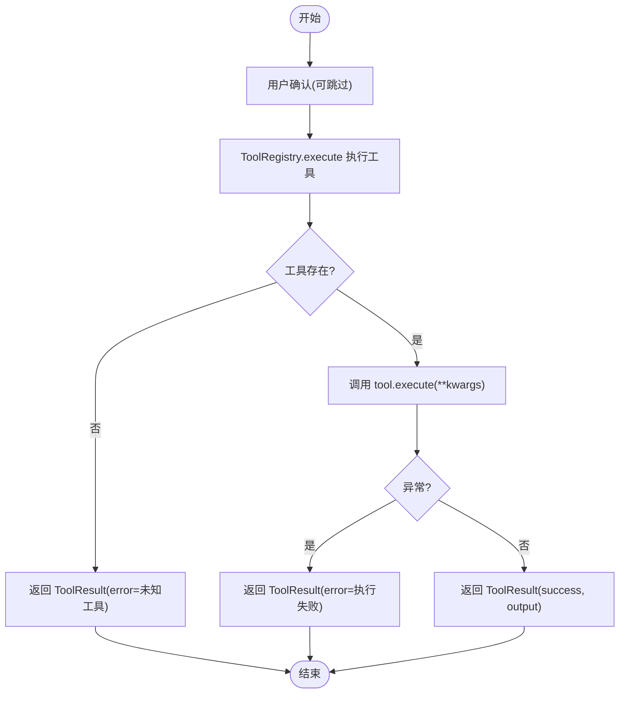
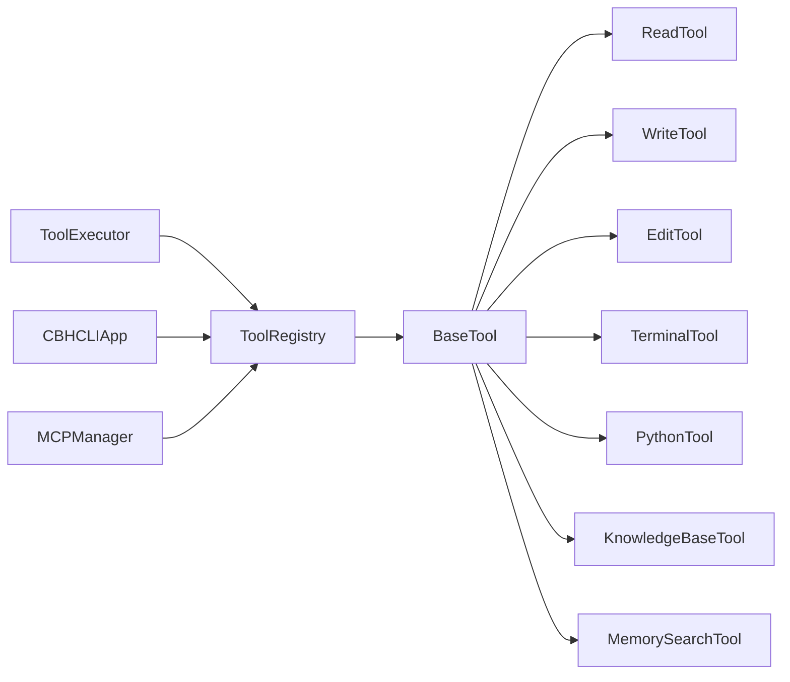

# 自定义工具开发

<cite>
**本文引用的文件**
- [registry.py](file://cbhcli_pkg/tools/registry.py)
- [base.py](file://cbhcli_pkg/tools/base.py)
- [file_read.py](file://cbhcli_pkg/tools/file_read.py)
- [file_write.py](file://cbhcli_pkg/tools/file_write.py)
- [file_edit.py](file://cbhcli_pkg/tools/file_edit.py)
- [terminal.py](file://cbhcli_pkg/tools/terminal.py)
- [python_tool.py](file://cbhcli_pkg/tools/python_tool.py)
- [knowledge_base.py](file://cbhcli_pkg/tools/knowledge_base.py)
- [memory_search.py](file://cbhcli_pkg/tools/memory_search.py)
- [tool_executor.py](file://cbhcli_pkg/core/tool_executor.py)
- [app.py](file://cbhcli_pkg/core/app.py)
- [mcp_manager.py](file://cbhcli_pkg/core/mcp_manager.py)
</cite>

## 目录
1. [简介](#简介)
2. [项目结构](#项目结构)
3. [核心组件](#核心组件)
4. [架构总览](#架构总览)
5. [详细组件分析](#详细组件分析)
6. [依赖分析](#依赖分析)
7. [性能考虑](#性能考虑)
8. [故障排查指南](#故障排查指南)
9. [结论](#结论)
10. [附录](#附录)

## 简介
本指南面向希望在系统中开发“自定义工具”的开发者，围绕工具基类与注册中心、参数定义与校验、工具注册流程、错误处理、异步与并发、生命周期管理以及测试与调试最佳实践展开。文档以仓库内现有工具为范例，提供从简单文件操作到复杂系统管理工具的完整开发路线图。

## 项目结构
工具体系位于 tools 子包，核心抽象与注册中心位于 registry.py；具体工具实现位于独立文件中；应用层通过 ToolExecutor 统一调度工具；MCP 管理器负责外部工具桥接与注册。

图表来源
- [registry.py:1-115](file://cbhcli_pkg/tools/registry.py#L1-L115)
- [file_read.py:1-125](file://cbhcli_pkg/tools/file_read.py#L1-L125)
- [file_write.py:1-83](file://cbhcli_pkg/tools/file_write.py#L1-L83)
- [file_edit.py:1-134](file://cbhcli_pkg/tools/file_edit.py#L1-L134)
- [terminal.py:1-99](file://cbhcli_pkg/tools/terminal.py#L1-L99)
- [python_tool.py:1-207](file://cbhcli_pkg/tools/python_tool.py#L1-L207)
- [knowledge_base.py:1-157](file://cbhcli_pkg/tools/knowledge_base.py#L1-L157)
- [memory_search.py:1-177](file://cbhcli_pkg/tools/memory_search.py#L1-L177)
- [tool_executor.py:1-168](file://cbhcli_pkg/core/tool_executor.py#L1-L168)
- [app.py:85-96](file://cbhcli_pkg/core/app.py#L85-L96)
- [mcp_manager.py:317-326](file://cbhcli_pkg/core/mcp_manager.py#L317-L326)

章节来源
- [registry.py:1-115](file://cbhcli_pkg/tools/registry.py#L1-L115)
- [app.py:85-96](file://cbhcli_pkg/core/app.py#L85-L96)

## 核心组件
- BaseTool 抽象基类：定义工具名称、描述、参数 Schema、执行接口。
- ToolRegistry 注册中心：提供注册、注销、查找、统一执行与描述聚合。
- ToolResult 结果载体：封装 success、output、error、metadata。
- ToolExecutor 执行器：负责工具调用前确认、执行、结果展示与回调。
- 具体工具实现：遵循 BaseTool 规范，提供 name/description/parameters/execute。

章节来源
- [registry.py:16-49](file://cbhcli_pkg/tools/registry.py#L16-L49)
- [registry.py:51-115](file://cbhcli_pkg/tools/registry.py#L51-L115)
- [tool_executor.py:15-91](file://cbhcli_pkg/core/tool_executor.py#L15-L91)

## 架构总览
工具开发遵循“抽象定义—具体实现—注册调度—结果呈现”的闭环。应用启动时初始化 ToolRegistry 并注册内置工具；ToolExecutor 作为统一入口协调工具执行与用户确认；MCP 管理器负责外部工具桥接与动态注册。

图表来源
- [tool_executor.py:42-52](file://cbhcli_pkg/core/tool_executor.py#L42-L52)
- [registry.py:70-96](file://cbhcli_pkg/tools/registry.py#L70-L96)

章节来源
- [app.py:85-96](file://cbhcli_pkg/core/app.py#L85-L96)
- [tool_executor.py:42-91](file://cbhcli_pkg/core/tool_executor.py#L42-L91)
- [registry.py:70-96](file://cbhcli_pkg/tools/registry.py#L70-L96)

## 详细组件分析

### BaseTool 与 ToolRegistry 设计
- BaseTool 约定：
  - name/description/parameters 为必需属性（JSON Schema）
  - execute(**kwargs) 返回 ToolResult
- ToolRegistry：
  - register/unregister/get：工具生命周期管理
  - execute：统一执行入口，包含未知工具与异常兜底
  - get_tool_descriptions：生成系统提示用的工具清单
  - get_available_tools：返回可用工具名列表

图表来源
- [registry.py:16-49](file://cbhcli_pkg/tools/registry.py#L16-L49)
- [registry.py:51-115](file://cbhcli_pkg/tools/registry.py#L51-L115)

章节来源
- [registry.py:16-49](file://cbhcli_pkg/tools/registry.py#L16-L49)
- [registry.py:51-115](file://cbhcli_pkg/tools/registry.py#L51-L115)

### 参数定义与验证机制
- JSON Schema 定义 parameters：
  - properties：参数键值与类型、描述
  - required：必填参数列表
- 验证策略：
  - ToolRegistry.execute 不做参数类型校验，由具体工具自行校验
  - 工具内部可结合类型注解与异常返回 ToolResult(success=false, error=...)

示例参考：
- 文件读取工具：必填 file_path，可选 start_line/end_line
- 文件写入工具：必填 file_path/content
- 终端工具：必填 command
- Python 工具：必填 code
- 知识库/记忆搜索：必填 query，可选 top_k/agent_name

章节来源
- [file_read.py:18-36](file://cbhcli_pkg/tools/file_read.py#L18-L36)
- [file_write.py:18-32](file://cbhcli_pkg/tools/file_write.py#L18-L32)
- [terminal.py:19-29](file://cbhcli_pkg/tools/terminal.py#L19-L29)
- [python_tool.py:154-164](file://cbhcli_pkg/tools/python_tool.py#L154-L164)
- [knowledge_base.py:33-47](file://cbhcli_pkg/tools/knowledge_base.py#L33-L47)
- [memory_search.py:31-45](file://cbhcli_pkg/tools/memory_search.py#L31-L45)

### 工具注册流程与唯一性约束
- 应用启动时注册内置工具：
  - 在初始化阶段创建 ToolRegistry，并逐个 register
- MCP 工具注册：
  - 通过 MCP 管理器连接服务器后，适配为工具并注册
- 唯一性要求：
  - ToolRegistry 的字典键为工具名，重复注册会覆盖
  - MCP 管理器中服务器名称需唯一，工具名在各自命名空间内唯一

图表来源
- [app.py:88-92](file://cbhcli_pkg/core/app.py#L88-L92)
- [registry.py:57-59](file://cbhcli_pkg/tools/registry.py#L57-L59)

章节来源
- [app.py:85-96](file://cbhcli_pkg/core/app.py#L85-L96)
- [mcp_manager.py:317-326](file://cbhcli_pkg/core/mcp_manager.py#L317-L326)
- [registry.py:57-59](file://cbhcli_pkg/tools/registry.py#L57-L59)

### 执行与结果呈现
- ToolExecutor：
  - 支持用户确认（可跳过）
  - 输出预览与详细模式切换
  - 回调钩子 on_tool_execute
- ToolRegistry.execute：
  - 未知工具返回错误
  - 工具执行异常被捕获并包装为 ToolResult

图表来源
- [tool_executor.py:74-91](file://cbhcli_pkg/core/tool_executor.py#L74-L91)
- [registry.py:81-96](file://cbhcli_pkg/tools/registry.py#L81-L96)

章节来源
- [tool_executor.py:42-91](file://cbhcli_pkg/core/tool_executor.py#L42-L91)
- [registry.py:70-96](file://cbhcli_pkg/tools/registry.py#L70-L96)

### 错误处理机制
- 工具内部：
  - 文件类工具：路径不存在、非文件、编码错误等场景返回 ToolResult(success=false, error=...)
  - 终端工具：超时、退出码非零、异常均返回 ToolResult
  - Python 工具：捕获标准输出/错误流，异常时构造错误信息
  - 知识库/记忆搜索：向量存储不可用、查询异常、降级逻辑均有明确反馈
- 注册中心兜底：
  - 未知工具与执行异常统一包装为 ToolResult

章节来源
- [file_read.py:56-69](file://cbhcli_pkg/tools/file_read.py#L56-L69)
- [file_read.py:113-124](file://cbhcli_pkg/tools/file_read.py#L113-L124)
- [file_write.py:49-51](file://cbhcli_pkg/tools/file_write.py#L49-L51)
- [file_edit.py:55-60](file://cbhcli_pkg/tools/file_edit.py#L55-L60)
- [file_edit.py:77-100](file://cbhcli_pkg/tools/file_edit.py#L77-L100)
- [terminal.py:57-66](file://cbhcli_pkg/tools/terminal.py#L57-L66)
- [terminal.py:83-91](file://cbhcli_pkg/tools/terminal.py#L83-L91)
- [python_tool.py:93-96](file://cbhcli_pkg/tools/python_tool.py#L93-L96)
- [knowledge_base.py:73-78](file://cbhcli_pkg/tools/knowledge_base.py#L73-L78)
- [memory_search.py:70-73](file://cbhcli_pkg/tools/memory_search.py#L70-L73)

### 异步执行与并发处理
- 当前工具执行为同步阻塞调用，未见内置异步/并发框架。
- 终端工具通过子进程执行，具备超时控制；Python 工具会捕获标准输出/错误流。
- 若需异步/并发，建议在工具内部引入线程池/进程池或事件循环，并在 ToolExecutor 层增加并发调度策略。

章节来源
- [terminal.py:57-66](file://cbhcli_pkg/tools/terminal.py#L57-L66)
- [python_tool.py:60-101](file://cbhcli_pkg/tools/python_tool.py#L60-L101)

### 生命周期管理
- 初始化：应用启动时创建 ToolRegistry，注册内置工具；按需延迟注册向量化工具。
- 执行：ToolExecutor 统一调度，支持确认、预览、详细输出与回调。
- 清理：Python 工具提供会话重置/移除；MCP 管理器支持注销单个工具或整站工具。

章节来源
- [app.py:85-150](file://cbhcli_pkg/core/app.py#L85-L150)
- [python_tool.py:115-125](file://cbhcli_pkg/tools/python_tool.py#L115-L125)
- [mcp_manager.py:328-349](file://cbhcli_pkg/core/mcp_manager.py#L328-L349)

### 开发示例与最佳实践

#### 示例一：简单文件读取工具
- 继承 BaseTool，实现 name/description/parameters/execute
- 参数：必填 file_path，可选行范围
- 校验：路径存在性、是否文件、编码错误
- 输出：统计信息与带行号的内容块

章节来源
- [file_read.py:6-125](file://cbhcli_pkg/tools/file_read.py#L6-L125)

#### 示例二：文件写入工具
- 继承 BaseTool，实现 name/description/parameters/execute
- 参数：必填 file_path、content
- 校验：父目录创建、覆盖/新建标识
- 输出：统计信息与操作提示

章节来源
- [file_write.py:6-83](file://cbhcli_pkg/tools/file_write.py#L6-L83)

#### 示例三：文件精确编辑工具
- 继承 BaseTool，实现 name/description/parameters/execute
- 参数：必填 file_path、old_str、new_str
- 校验：唯一匹配、未找到时提供可能行号
- 输出：统计变化与成功提示

章节来源
- [file_edit.py:6-134](file://cbhcli_pkg/tools/file_edit.py#L6-L134)

#### 示例四：终端命令工具
- 继承 BaseTool，实现 name/description/parameters/execute
- 参数：必填 command
- 校验：超时、退出码、异常
- 输出：合并 stdout/stderr，区分成功/失败

章节来源
- [terminal.py:7-99](file://cbhcli_pkg/tools/terminal.py#L7-L99)

#### 示例五：Python 会话工具
- 继承 BaseTool，实现 name/description/parameters/execute
- 会话状态：全局会话存储，支持重置
- 校验：标准输出/错误捕获，异常信息拼接
- 输出：无输出时的友好提示

章节来源
- [python_tool.py:8-207](file://cbhcli_pkg/tools/python_tool.py#L8-L207)

#### 示例六：知识库/记忆搜索工具
- 继承 BaseTool，实现 name/description/parameters/execute
- 依赖：向量存储、重排序客户端（可选）
- 校验：Agent 名称、向量存储可用性、查询异常
- 输出：格式化结果列表，支持降级方案

章节来源
- [knowledge_base.py:6-157](file://cbhcli_pkg/tools/knowledge_base.py#L6-L157)
- [memory_search.py:6-177](file://cbhcli_pkg/tools/memory_search.py#L6-L177)

### 测试与调试最佳实践
- 单元测试要点：
  - 参数边界：必填缺失、类型不符、非法路径
  - 异常分支：文件不存在、编码错误、超时、退出码非零
  - 正常路径：最小参数集、最大参数集、典型场景
- 调试技巧：
  - 使用 ToolExecutor 的详细模式查看完整参数
  - 对终端工具，拆分多命令并观察每条命令输出
  - 对 Python 工具，利用会话记忆定位变量作用域问题
  - 对向量化工具，先检查嵌入模型与索引状态

章节来源
- [tool_executor.py:93-160](file://cbhcli_pkg/core/tool_executor.py#L93-L160)
- [terminal.py:42-91](file://cbhcli_pkg/tools/terminal.py#L42-L91)
- [python_tool.py:181-206](file://cbhcli_pkg/tools/python_tool.py#L181-L206)

## 依赖分析
- 工具实现依赖 ToolRegistry 与 ToolResult
- ToolExecutor 依赖 ToolRegistry
- 应用初始化依赖各工具实现
- MCP 管理器通过适配器注册外部工具

图表来源
- [registry.py:16-49](file://cbhcli_pkg/tools/registry.py#L16-L49)
- [tool_executor.py:24-29](file://cbhcli_pkg/core/tool_executor.py#L24-L29)
- [app.py:85-96](file://cbhcli_pkg/core/app.py#L85-L96)
- [mcp_manager.py:304-306](file://cbhcli_pkg/core/mcp_manager.py#L304-L306)

章节来源
- [registry.py:16-49](file://cbhcli_pkg/tools/registry.py#L16-L49)
- [tool_executor.py:24-29](file://cbhcli_pkg/core/tool_executor.py#L24-L29)
- [app.py:85-96](file://cbhcli_pkg/core/app.py#L85-L96)
- [mcp_manager.py:304-306](file://cbhcli_pkg/core/mcp_manager.py#L304-L306)

## 性能考虑
- 文件读写：大文件建议分块读取与范围读取，避免一次性加载
- 终端命令：合理设置超时，避免长时间阻塞
- Python 会话：避免在会话中累积过多对象，必要时主动 reset
- 向量化搜索：批量查询与缓存结果，减少重复检索

## 故障排查指南
- 未知工具：检查 ToolRegistry 是否正确注册，名称是否一致
- 执行失败：查看 ToolResult.error，关注异常堆栈与上下文
- 文件类工具报错：确认路径、权限、编码；必要时使用 expanduser
- 终端工具超时：调整超时阈值或拆分命令
- Python 工具无输出：检查标准输出捕获与异常信息拼接
- 向量化工具不可用：检查嵌入模型与索引初始化状态

章节来源
- [registry.py:82-96](file://cbhcli_pkg/tools/registry.py#L82-L96)
- [file_read.py:56-69](file://cbhcli_pkg/tools/file_read.py#L56-L69)
- [file_edit.py:77-100](file://cbhcli_pkg/tools/file_edit.py#L77-L100)
- [terminal.py:57-66](file://cbhcli_pkg/tools/terminal.py#L57-L66)
- [python_tool.py:93-96](file://cbhcli_pkg/tools/python_tool.py#L93-L96)
- [knowledge_base.py:73-78](file://cbhcli_pkg/tools/knowledge_base.py#L73-L78)

## 结论
通过 BaseTool 与 ToolRegistry 的清晰抽象，系统实现了工具的标准化开发与统一调度。开发者只需遵循参数 Schema 与执行规范，即可快速扩展工具生态。配合 ToolExecutor 的确认与展示机制、MCP 的外部工具桥接，以及完善的错误处理与测试实践，能够构建稳定、可观测、易维护的工具体系。

## 附录
- 工具基类定义已迁移至 registry.py，base.py 保留为空文件
- 工具注册与卸载均通过 ToolRegistry 完成，MCP 管理器提供动态注册能力

章节来源
- [base.py:1-2](file://cbhcli_pkg/tools/base.py#L1-L2)
- [registry.py:57-64](file://cbhcli_pkg/tools/registry.py#L57-L64)
- [mcp_manager.py:335-338](file://cbhcli_pkg/core/mcp_manager.py#L335-L338)