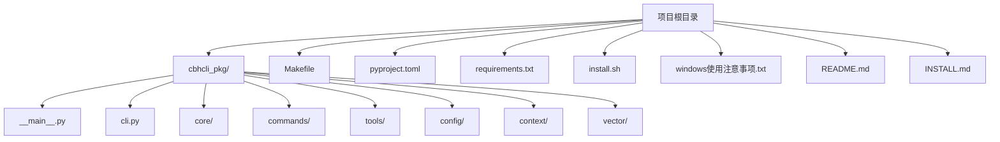
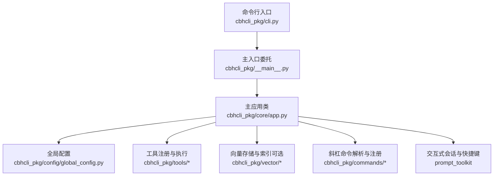
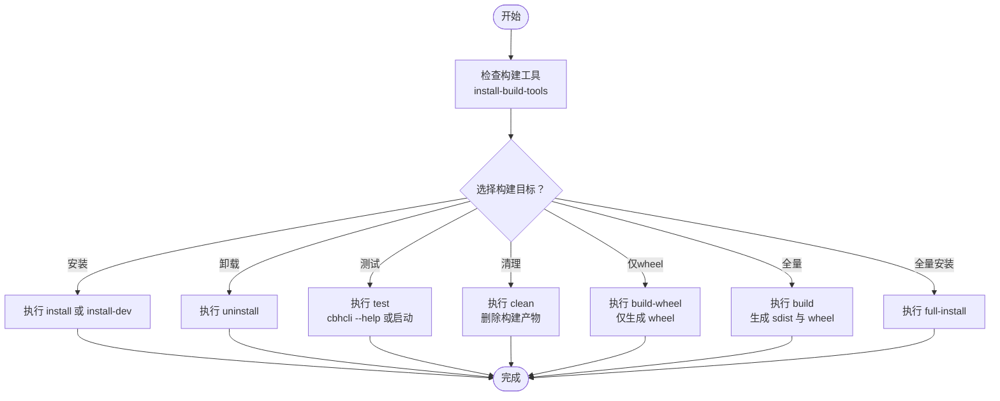
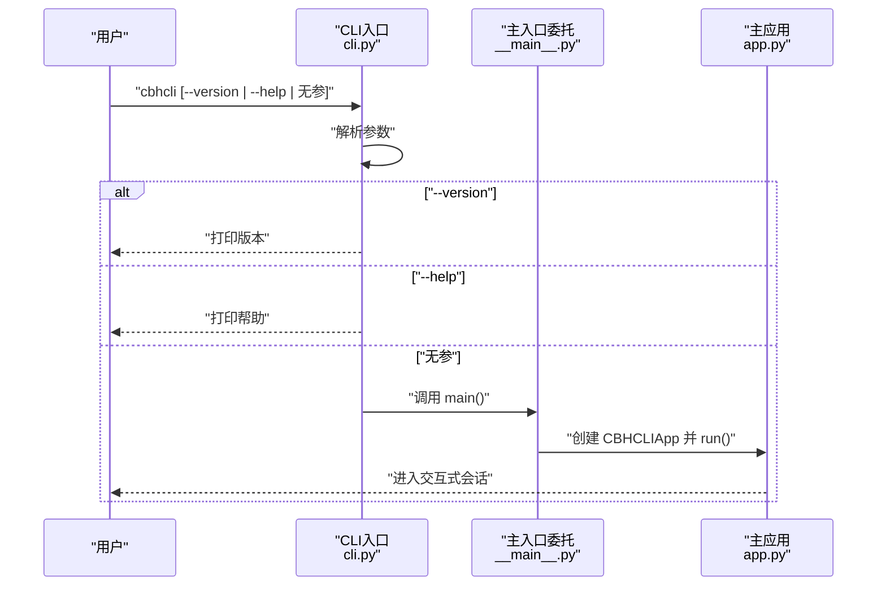
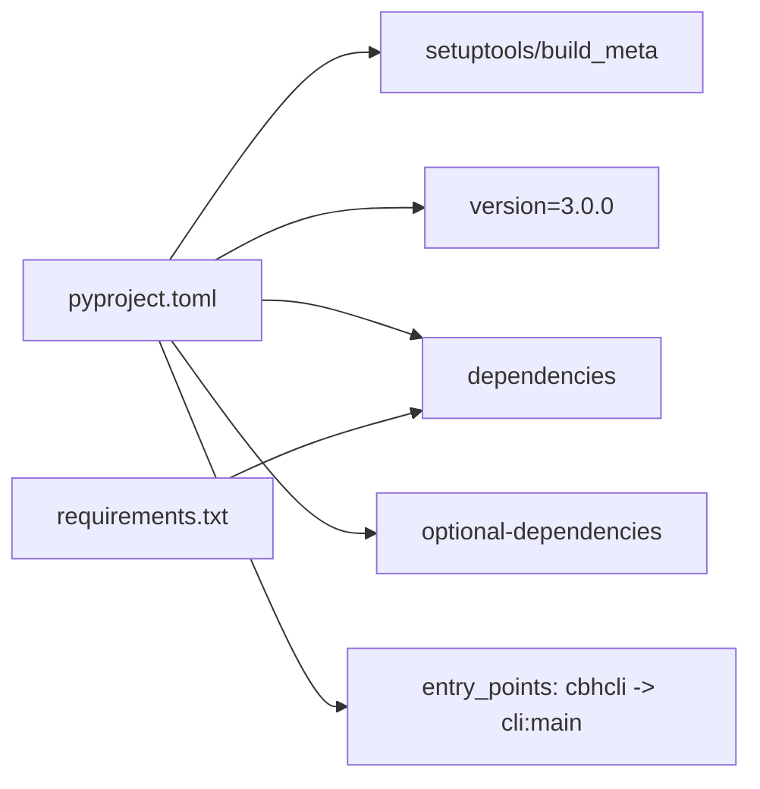

# 构建与部署

<cite>
**本文引用的文件**
- [Makefile](file://Makefile)
- [pyproject.toml](file://pyproject.toml)
- [requirements.txt](file://requirements.txt)
- [install.sh](file://install.sh)
- [windows使用注意事项.txt](file://windows使用注意事项.txt)
- [README.md](file://README.md)
- [INSTALL.md](file://INSTALL.md)
- [cbhcli_pkg/__main__.py](file://cbhcli_pkg/__main__.py)
- [cbhcli_pkg/cli.py](file://cbhcli_pkg/cli.py)
- [cbhcli_pkg/__init__.py](file://cbhcli_pkg/__init__.py)
- [cbhcli_pkg/core/app.py](file://cbhcli_pkg/core/app.py)
</cite>

## 目录
1. [简介](#简介)
2. [项目结构](#项目结构)
3. [核心组件](#核心组件)
4. [架构总览](#架构总览)
5. [详细组件分析](#详细组件分析)
6. [依赖关系分析](#依赖关系分析)
7. [性能考虑](#性能考虑)
8. [故障排除指南](#故障排除指南)
9. [结论](#结论)
10. [附录](#附录)

## 简介
本文件面向运维与开发团队，系统化阐述 CBHCLI 的构建、打包、发布与多平台部署流程，并提供 CI/CD 自动化、生产部署最佳实践、升级回滚策略以及运维检查清单与健康检查方法。文档严格基于仓库现有文件进行分析与总结，避免臆测。

## 项目结构
CBHCLI 采用标准 Python 包结构，核心逻辑集中在 cbhcli_pkg 子包中，入口通过脚本条目注册为 cbhcli 命令。项目根目录提供构建与安装脚本、依赖声明与安装说明。

图表来源
- [Makefile:1-55](file://Makefile#L1-L55)
- [pyproject.toml:1-53](file://pyproject.toml#L1-L53)
- [requirements.txt:1-7](file://requirements.txt#L1-L7)
- [install.sh:1-29](file://install.sh#L1-L29)
- [windows使用注意事项.txt:1-2](file://windows使用注意事项.txt#L1-L2)
- [README.md:1-325](file://README.md#L1-L325)
- [INSTALL.md:1-69](file://INSTALL.md#L1-L69)
- [cbhcli_pkg/__main__.py:1-7](file://cbhcli_pkg/__main__.py#L1-L7)
- [cbhcli_pkg/cli.py:1-112](file://cbhcli_pkg/cli.py#L1-L112)
- [cbhcli_pkg/__init__.py:1-9](file://cbhcli_pkg/__init__.py#L1-L9)

章节来源
- [Makefile:1-55](file://Makefile#L1-L55)
- [pyproject.toml:1-53](file://pyproject.toml#L1-L53)
- [requirements.txt:1-7](file://requirements.txt#L1-L7)
- [install.sh:1-29](file://install.sh#L1-L29)
- [windows使用注意事项.txt:1-2](file://windows使用注意事项.txt#L1-L2)
- [README.md:1-325](file://README.md#L1-L325)
- [INSTALL.md:1-69](file://INSTALL.md#L1-L69)
- [cbhcli_pkg/__main__.py:1-7](file://cbhcli_pkg/__main__.py#L1-L7)
- [cbhcli_pkg/cli.py:1-112](file://cbhcli_pkg/cli.py#L1-L112)
- [cbhcli_pkg/__init__.py:1-9](file://cbhcli_pkg/__init__.py#L1-L9)

## 核心组件
- 构建与打包
  - 使用 setuptools 与 build 后端，遵循 PEP 517/566 规范；wheel 与 sdist 双发布。
  - 版本号在 pyproject.toml 中声明，可通过 setuptools_scm 集成版本管理。
- 依赖管理
  - 核心依赖在 pyproject.toml 的 dependencies 字段中声明；可选依赖通过 optional-dependencies 分组。
  - requirements.txt 提供与 pyproject.toml 对应的核心依赖清单，便于快速安装。
- 入口与命令
  - 通过 [scripts 条目:44-45](file://pyproject.toml#L44-L45) 将 cbhcli 命令指向包内主入口。
  - 主入口在 [__main__.py:1-7](file://cbhcli_pkg/__main__.py#L1-L7) 中委托给 [cli.py:1-112](file://cbhcli_pkg/cli.py#L1-L112)，后者负责参数解析与帮助输出。
- 版本号
  - 包版本同时在 [cbhcli_pkg/__init__.py](file://cbhcli_pkg/__init__.py#L6) 与 [pyproject.toml](file://pyproject.toml#L7) 中声明，确保命令行与包元数据一致。

章节来源
- [pyproject.toml:1-53](file://pyproject.toml#L1-L53)
- [requirements.txt:1-7](file://requirements.txt#L1-L7)
- [cbhcli_pkg/__main__.py:1-7](file://cbhcli_pkg/__main__.py#L1-L7)
- [cbhcli_pkg/cli.py:1-112](file://cbhcli_pkg/cli.py#L1-L112)
- [cbhcli_pkg/__init__.py:1-9](file://cbhcli_pkg/__init__.py#L1-L9)

## 架构总览
CBHCLI 的运行时由 CLI 入口驱动，初始化全局配置、工具系统、向量检索（可选）、命令解析与 UI 交互，最终进入主会话循环。

图表来源
- [cbhcli_pkg/cli.py:1-112](file://cbhcli_pkg/cli.py#L1-L112)
- [cbhcli_pkg/__main__.py:1-7](file://cbhcli_pkg/__main__.py#L1-L7)
- [cbhcli_pkg/core/app.py:1-200](file://cbhcli_pkg/core/app.py#L1-L200)

## 详细组件分析

### 构建与打包流程
- 构建目标
  - 全量构建：[build:14-15](file://Makefile#L14-L15) 生成源码包与 wheel。
  - 仅 wheel：[build-wheel:17-19](file://Makefile#L17-L19) 仅生成 wheel。
  - 安装与卸载：[install:10-11](file://Makefile#L10-L11)、[install-dev:6-7](file://Makefile#L6-L7)、[uninstall:21-23](file://Makefile#L21-L23)。
  - 测试安装：[test:25-27](file://Makefile#L25-L27) 优先尝试显示帮助，否则直接启动。
  - 清理：[clean:29-35](file://Makefile#L29-L35) 清理构建产物与缓存。
  - 安装构建工具：[install-build-tools:37-39](file://Makefile#L37-L39)。
  - 一键全量：[full-install:41-42](file://Makefile#L41-L42)。
- 版本与元数据
  - 版本号：[pyproject.toml](file://pyproject.toml#L7)、[cbhcli_pkg/__init__.py](file://cbhcli_pkg/__init__.py#L6)。
  - 入口脚本：[pyproject.toml:44-45](file://pyproject.toml#L44-L45)。
- 依赖声明
  - 核心依赖：[pyproject.toml:26-30](file://pyproject.toml#L26-L30)、[requirements.txt:1-7](file://requirements.txt#L1-L7)。
  - 可选依赖：[pyproject.toml:32-42](file://pyproject.toml#L32-L42)。

图表来源
- [Makefile:1-55](file://Makefile#L1-L55)

章节来源
- [Makefile:1-55](file://Makefile#L1-L55)
- [pyproject.toml:1-53](file://pyproject.toml#L1-L53)
- [requirements.txt:1-7](file://requirements.txt#L1-L7)
- [cbhcli_pkg/__init__.py:1-9](file://cbhcli_pkg/__init__.py#L1-L9)

### 安装脚本与跨平台安装
- Linux/macOS
  - 自动检测 Python 与 pip，执行 pip install . 安装。
  - 参考路径：[install.sh:1-29](file://install.sh#L1-L29)。
- Windows
  - 需要启用虚拟终端以正确渲染颜色，参考：[windows使用注意事项.txt:1-2](file://windows使用注意事项.txt#L1-L2)。
- 源码安装与 Wheel 安装
  - README 与 INSTALL 文档提供了从源码与 wheel 安装的步骤与示例。
  - 参考：[README.md:37-61](file://README.md#L37-L61)、[INSTALL.md:10-45](file://INSTALL.md#L10-L45)。

章节来源
- [install.sh:1-29](file://install.sh#L1-L29)
- [windows使用注意事项.txt:1-2](file://windows使用注意事项.txt#L1-L2)
- [README.md:37-61](file://README.md#L37-L61)
- [INSTALL.md:10-45](file://INSTALL.md#L10-L45)

### CLI 入口与主应用
- CLI 入口
  - 参数解析与帮助输出，支持 --version 与 --help。
  - 参考：[cbhcli_pkg/cli.py:73-112](file://cbhcli_pkg/cli.py#L73-L112)。
- 主应用
  - 初始化配置、工具、向量检索（可选）、命令系统与 UI。
  - 参考：[cbhcli_pkg/core/app.py:64-200](file://cbhcli_pkg/core/app.py#L64-L200)。

图表来源
- [cbhcli_pkg/cli.py:73-112](file://cbhcli_pkg/cli.py#L73-L112)
- [cbhcli_pkg/__main__.py:1-7](file://cbhcli_pkg/__main__.py#L1-L7)
- [cbhcli_pkg/core/app.py:64-200](file://cbhcli_pkg/core/app.py#L64-L200)

章节来源
- [cbhcli_pkg/cli.py:1-112](file://cbhcli_pkg/cli.py#L1-L112)
- [cbhcli_pkg/__main__.py:1-7](file://cbhcli_pkg/__main__.py#L1-L7)
- [cbhcli_pkg/core/app.py:1-200](file://cbhcli_pkg/core/app.py#L1-L200)

### 依赖与可选功能
- 核心依赖
  - requests、wcwidth、prompt_toolkit。
  - 参考：[pyproject.toml:26-30](file://pyproject.toml#L26-L30)、[requirements.txt:1-7](file://requirements.txt#L1-L7)。
- 可选依赖
  - 向量检索：chromadb。
  - 精确 Token 计数：tiktoken。
  - 开发依赖：pytest、pytest-cov。
  - 参考：[pyproject.toml:32-42](file://pyproject.toml#L32-L42)。

章节来源
- [pyproject.toml:26-42](file://pyproject.toml#L26-L42)
- [requirements.txt:1-7](file://requirements.txt#L1-L7)

## 依赖关系分析
- 构建系统
  - build-system.requires 指定 setuptools、wheel、setuptools_scm[toml]。
  - 参考：[pyproject.toml:1-3](file://pyproject.toml#L1-L3)。
- 运行时依赖
  - 通过 dependencies 与 optional-dependencies 组织。
  - 参考：[pyproject.toml:26-42](file://pyproject.toml#L26-L42)。
- 入口脚本
  - scripts 将 cbhcli 指向包内入口。
  - 参考：[pyproject.toml:44-45](file://pyproject.toml#L44-L45)。

图表来源
- [pyproject.toml:1-53](file://pyproject.toml#L1-L53)
- [requirements.txt:1-7](file://requirements.txt#L1-L7)

章节来源
- [pyproject.toml:1-53](file://pyproject.toml#L1-L53)
- [requirements.txt:1-7](file://requirements.txt#L1-L7)

## 性能考虑
- 向量索引按需构建
  - README 解释了为何启动时不自动索引，建议在文件更新后手动触发重索引。
  - 参考：[README.md:208-229](file://README.md#L208-L229)。
- 上下文压缩
  - 默认开启自动压缩与压缩比例，减少长对话的上下文开销。
  - 参考：[README.md:184-187](file://README.md#L184-L187)。
- 交互体验
  - prompt_toolkit 提供流畅的交互式体验与快捷键支持。
  - 参考：[cbhcli_pkg/core/app.py:180-200](file://cbhcli_pkg/core/app.py#L180-L200)。

章节来源
- [README.md:184-187](file://README.md#L184-L187)
- [README.md:208-229](file://README.md#L208-L229)
- [cbhcli_pkg/core/app.py:180-200](file://cbhcli_pkg/core/app.py#L180-L200)

## 故障排除指南
- 命令不可用
  - 若安装后无法找到 cbhcli，请确认安装目录在 PATH 中，或使用 --user 标志重装，必要时重启终端。
  - 参考：[INSTALL.md:63-69](file://INSTALL.md#L63-L69)。
- Windows 终端颜色异常
  - 需要在注册表中启用虚拟终端级别以正确渲染颜色。
  - 参考：[windows使用注意事项.txt:1-2](file://windows使用注意事项.txt#L1-L2)。
- 构建工具缺失
  - 使用 Makefile 的 install-build-tools 目标安装 build、setuptools、wheel。
  - 参考：[Makefile:37-39](file://Makefile#L37-L39)。
- 测试安装失败
  - 使用 test 目标验证安装是否成功。
  - 参考：[Makefile:25-27](file://Makefile#L25-L27)。

章节来源
- [INSTALL.md:63-69](file://INSTALL.md#L63-L69)
- [windows使用注意事项.txt:1-2](file://windows使用注意事项.txt#L1-L2)
- [Makefile:25-39](file://Makefile#L25-L39)

## 结论
本文件基于仓库现有配置与代码，梳理了 CBHCLI 的构建、打包、安装与运行机制，明确了版本号、依赖与入口脚本的关系，并提供了跨平台安装与故障排除建议。后续可结合 CI/CD 流水线实现自动化构建与发布。

## 附录

### A. 构建与发布操作清单
- 准备
  - 确认 Python 与 pip 版本满足要求。
  - 安装构建工具：[Makefile:37-39](file://Makefile#L37-L39)。
- 构建
  - 全量构建：[Makefile:14-15](file://Makefile#L14-L15)。
  - 仅 wheel：[Makefile:17-19](file://Makefile#L17-L19)。
- 安装与验证
  - 标准安装：[Makefile:10-11](file://Makefile#L10-L11)。
  - 开发模式安装：[Makefile:6-7](file://Makefile#L6-L7)。
  - 测试安装：[Makefile:25-27](file://Makefile#L25-L27)。
- 清理
  - 清理构建产物：[Makefile:29-35](file://Makefile#L29-L35)。

章节来源
- [Makefile:6-39](file://Makefile#L6-L39)
- [Makefile:14-19](file://Makefile#L14-L19)
- [Makefile:25-35](file://Makefile#L25-L35)

### B. 多平台部署指南
- Linux/macOS
  - 使用安装脚本或 pip 安装：[install.sh:1-29](file://install.sh#L1-L29)、[INSTALL.md:10-28](file://INSTALL.md#L10-L28)。
- Windows
  - 启用虚拟终端以支持颜色输出：[windows使用注意事项.txt:1-2](file://windows使用注意事项.txt#L1-L2)。
- Wheel 安装
  - 从 dist 目录安装 wheel：[README.md:49-52](file://README.md#L49-L52)、[INSTALL.md:30-45](file://INSTALL.md#L30-L45)。

章节来源
- [install.sh:1-29](file://install.sh#L1-L29)
- [INSTALL.md:10-45](file://INSTALL.md#L10-L45)
- [README.md:49-52](file://README.md#L49-L52)
- [windows使用注意事项.txt:1-2](file://windows使用注意事项.txt#L1-L2)

### C. 生产部署最佳实践
- 环境变量
  - 通过全局配置文件管理模型、嵌入与重排序等敏感信息，避免硬编码。
  - 参考：[README.md:150-190](file://README.md#L150-L190)。
- 日志与可观测性
  - 在应用层捕获异常并输出错误信息，便于排障。
  - 参考：[cbhcli_pkg/cli.py:107-111](file://cbhcli_pkg/cli.py#L107-L111)。
- 监控与告警
  - 建议在部署层增加进程存活与资源使用监控，结合日志聚合与告警策略。
  - 本节为通用建议，不直接对应具体源码。

章节来源
- [README.md:150-190](file://README.md#L150-L190)
- [cbhcli_pkg/cli.py:107-111](file://cbhcli_pkg/cli.py#L107-L111)

### D. 升级与回滚策略
- 升级
  - 使用 pip 升级已安装包，或重新安装新版本 wheel。
  - 参考：[README.md:49-52](file://README.md#L49-L52)、[INSTALL.md:30-45](file://INSTALL.md#L30-L45)。
- 回滚
  - 通过 pip 卸载当前版本后安装历史版本 wheel。
  - 参考：[INSTALL.md:55-61](file://INSTALL.md#L55-L61)。

章节来源
- [README.md:49-52](file://README.md#L49-L52)
- [INSTALL.md:30-61](file://INSTALL.md#L30-L61)

### E. 运维检查清单
- 安装验证
  - 是否可通过 cbhcli --help 正常显示帮助。
  - 参考：[Makefile:25-27](file://Makefile#L25-L27)。
- 依赖完整性
  - 是否安装核心依赖与可选依赖（如 chromadb、tiktoken）。
  - 参考：[pyproject.toml:26-42](file://pyproject.toml#L26-L42)。
- 向量检索（可选）
  - 是否按需配置嵌入模型并执行索引。
  - 参考：[README.md:208-229](file://README.md#L208-L229)。
- Windows 颜色显示
  - 是否已启用虚拟终端级别。
  - 参考：[windows使用注意事项.txt:1-2](file://windows使用注意事项.txt#L1-L2)。

章节来源
- [Makefile:25-27](file://Makefile#L25-L27)
- [pyproject.toml:26-42](file://pyproject.toml#L26-L42)
- [README.md:208-229](file://README.md#L208-L229)
- [windows使用注意事项.txt:1-2](file://windows使用注意事项.txt#L1-L2)