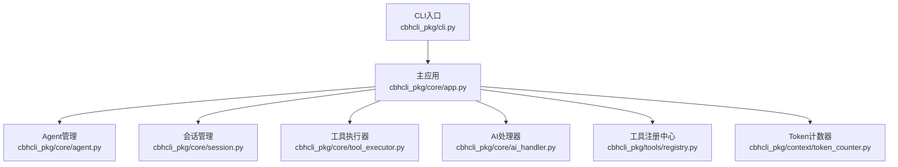
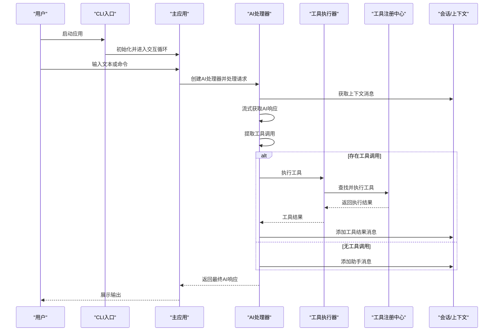
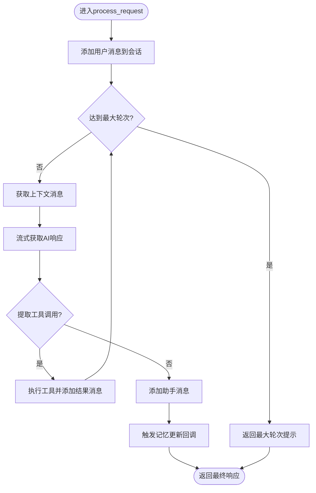
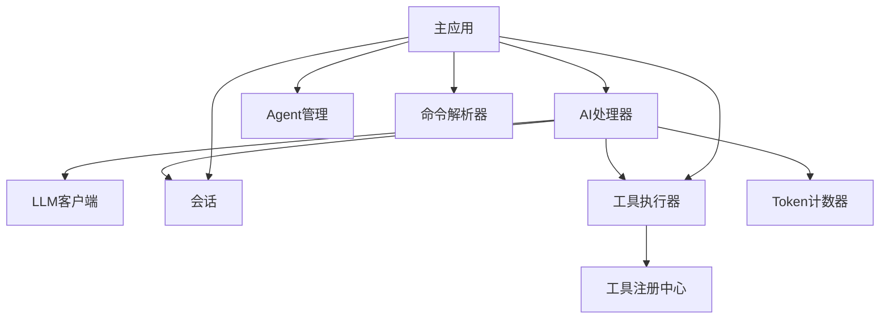

# 测试策略与方法

<cite>
**本文引用的文件**
- [README.md](file://README.md)
- [pyproject.toml](file://pyproject.toml)
- [requirements.txt](file://requirements.txt)
- [test_v3.py](file://test_v3.py)
- [cbhcli_pkg/core/ai_handler.py](file://cbhcli_pkg/core/ai_handler.py)
- [cbhcli_pkg/core/tool_executor.py](file://cbhcli_pkg/core/tool_executor.py)
- [cbhcli_pkg/core/app.py](file://cbhcli_pkg/core/app.py)
- [cbhcli_pkg/tools/registry.py](file://cbhcli_pkg/tools/registry.py)
- [cbhcli_pkg/core/session.py](file://cbhcli_pkg/core/session.py)
- [cbhcli_pkg/core/agent.py](file://cbhcli_pkg/core/agent.py)
- [cbhcli_pkg/context/token_counter.py](file://cbhcli_pkg/context/token_counter.py)
- [cbhcli_pkg/cli.py](file://cbhcli_pkg/cli.py)
</cite>

## 目录
1. [简介](#简介)
2. [项目结构](#项目结构)
3. [核心组件](#核心组件)
4. [架构总览](#架构总览)
5. [详细组件分析](#详细组件分析)
6. [依赖分析](#依赖分析)
7. [性能考虑](#性能考虑)
8. [故障排查指南](#故障排查指南)
9. [结论](#结论)
10. [附录](#附录)

## 简介
本文件面向CBHCLI项目的测试策略与方法，目标是为开发者提供一套完整的测试体系，覆盖单元测试、集成测试与端到端测试的分层设计；解释测试框架选择与配置（pytest），给出测试用例编写指南（Mock、异步处理、测试数据准备）；针对关键组件（AIHandler、工具执行器、Agent管理）制定测试策略；明确测试覆盖率要求与测量方法；提供CI配置示例与自动化测试流程；包含性能与压力测试方法；说明测试环境搭建与隔离策略；并总结测试最佳实践与常见问题。

## 项目结构
CBHCLI采用模块化分层组织，核心模块集中在cbhcli_pkg/core，工具系统在cbhcli_pkg/tools，上下文与计数在cbhcli_pkg/context，命令系统在cbhcli_pkg/commands，向量检索在cbhcli_pkg/vector，CLI入口在cbhcli_pkg/cli。测试脚本位于仓库根目录，当前提供一个功能演示脚本test_v3.py，展示工具、会话、Agent与Token计数的基本用法与断言点。

图示来源
- [cbhcli_pkg/cli.py:73-112](file://cbhcli_pkg/cli.py#L73-L112)
- [cbhcli_pkg/core/app.py:54-478](file://cbhcli_pkg/core/app.py#L54-L478)
- [cbhcli_pkg/core/agent.py:572-762](file://cbhcli_pkg/core/agent.py#L572-L762)
- [cbhcli_pkg/core/session.py:37-190](file://cbhcli_pkg/core/session.py#L37-L190)
- [cbhcli_pkg/core/tool_executor.py:15-168](file://cbhcli_pkg/core/tool_executor.py#L15-L168)
- [cbhcli_pkg/tools/registry.py:51-115](file://cbhcli_pkg/tools/registry.py#L51-L115)
- [cbhcli_pkg/context/token_counter.py:14-88](file://cbhcli_pkg/context/token_counter.py#L14-L88)

章节来源
- [README.md:269-295](file://README.md#L269-L295)
- [pyproject.toml:1-53](file://pyproject.toml#L1-L53)

## 核心组件
- AI处理器（AIHandler）：负责LLM请求、流式输出、工具调用提取与执行、多轮工具调用协调、响应清理与记忆更新回调。
- 工具执行器（ToolExecutor）：封装工具调用前确认、执行、结果展示与回调，支持详细/简洁模式切换。
- 工具注册中心（ToolRegistry）：统一注册、查找与执行工具，提供工具描述聚合。
- 会话管理（Session/ContextWindow）：消息结构、上下文消息转换、Token统计、上下文窗口阈值与压缩触发。
- Agent管理（AgentManager/AgentConfig/AgentPersona）：Agent创建工作空间、模板文件、配置持久化、人格构建系统提示。
- Token计数器（TokenCounter）：支持tiktoken精确计数与降级估算。
- 主应用（CBHCLIApp）：装配各组件、命令解析、UI交互、会话生命周期、上下文压缩与历史保存。

章节来源
- [cbhcli_pkg/core/ai_handler.py:21-743](file://cbhcli_pkg/core/ai_handler.py#L21-L743)
- [cbhcli_pkg/core/tool_executor.py:15-168](file://cbhcli_pkg/core/tool_executor.py#L15-L168)
- [cbhcli_pkg/tools/registry.py:51-115](file://cbhcli_pkg/tools/registry.py#L51-L115)
- [cbhcli_pkg/core/session.py:37-190](file://cbhcli_pkg/core/session.py#L37-L190)
- [cbhcli_pkg/core/agent.py:572-762](file://cbhcli_pkg/core/agent.py#L572-L762)
- [cbhcli_pkg/context/token_counter.py:14-88](file://cbhcli_pkg/context/token_counter.py#L14-L88)
- [cbhcli_pkg/core/app.py:54-478](file://cbhcli_pkg/core/app.py#L54-L478)

## 架构总览
下图展示了从CLI入口到主应用、再到AI处理器与工具系统的调用链路，以及会话与上下文窗口的协作关系。

图示来源
- [cbhcli_pkg/cli.py:73-112](file://cbhcli_pkg/cli.py#L73-L112)
- [cbhcli_pkg/core/app.py:422-447](file://cbhcli_pkg/core/app.py#L422-L447)
- [cbhcli_pkg/core/ai_handler.py:51-96](file://cbhcli_pkg/core/ai_handler.py#L51-L96)
- [cbhcli_pkg/core/tool_executor.py:54-91](file://cbhcli_pkg/core/tool_executor.py#L54-L91)
- [cbhcli_pkg/tools/registry.py:70-96](file://cbhcli_pkg/tools/registry.py#L70-L96)
- [cbhcli_pkg/core/session.py:83-106](file://cbhcli_pkg/core/session.py#L83-L106)

## 详细组件分析

### AI处理器（AIHandler）测试策略
- 测试目标
  - 请求处理流程：用户消息添加、上下文构建、多轮工具调用、响应清理、记忆更新回调。
  - 工具调用提取：支持DSML标签、Python函数调用、JSON格式（args/arguments）、纯文本命令自动包装。
  - 流式输出：推理阶段与内容阶段的区分、增量清理、格式提示注入。
  - 错误处理：异常捕获、错误提示、最大轮次保护。
- 关键断言点
  - 会话消息数量与角色一致性。
  - 工具调用解析结果（名称、参数）与去重逻辑。
  - 工具结果消息的token计数与tool_call_id关联。
  - 响应清理后保留解释性文本、移除工具调用代码块。
- Mock建议
  - LLM客户端：模拟chat_stream返回不同chunk类型与异常。
  - 工具执行器：模拟执行成功/失败、输出截断。
  - Token计数器：固定返回值以控制上下文阈值。
- 异步处理
  - 若LLM客户端改为异步接口，需在测试中使用事件循环或协程包装；当前实现为同步流式处理，测试可直接调用。
- 测试数据
  - 构造多轮工具调用场景，包含DSML、Python、JSON与纯文本命令混合。
  - 构造包含占位符与示例的JSON，验证过滤逻辑。
- 复杂逻辑流程图

图示来源
- [cbhcli_pkg/core/ai_handler.py:51-96](file://cbhcli_pkg/core/ai_handler.py#L51-L96)
- [cbhcli_pkg/core/ai_handler.py:264-297](file://cbhcli_pkg/core/ai_handler.py#L264-L297)
- [cbhcli_pkg/core/ai_handler.py:664-734](file://cbhcli_pkg/core/ai_handler.py#L664-L734)

章节来源
- [cbhcli_pkg/core/ai_handler.py:21-743](file://cbhcli_pkg/core/ai_handler.py#L21-L743)

### 工具执行器（ToolExecutor）测试策略
- 测试目标
  - 工具执行前确认：用户交互输入（Y/n/all）与跳过确认模式。
  - 执行与展示：工具调用预览、详细参数展示、结果截断与预览。
  - 回调机制：工具执行回调的触发与参数传递。
- 关键断言点
  - 输入“n”时返回失败结果（用户取消）。
  - 输入“all”后后续调用跳过确认。
  - 详细模式下输出完整参数。
  - 成功/失败结果的输出格式与长度限制。
- Mock建议
  - 工具注册中心：返回已知工具与参数Schema，模拟执行成功/失败。
  - 标准输出：捕获print输出以断言格式。
- 测试数据
  - 不同工具的参数组合（terminal的command、file系列的file_path等）。
  - 长输出与超长输出的截断行为。

章节来源
- [cbhcli_pkg/core/tool_executor.py:15-168](file://cbhcli_pkg/core/tool_executor.py#L15-L168)
- [cbhcli_pkg/tools/registry.py:51-115](file://cbhcli_pkg/tools/registry.py#L51-L115)

### 工具注册中心（ToolRegistry）测试策略
- 测试目标
  - 注册与注销工具、按名称获取工具。
  - 执行工具：未知工具返回错误、工具执行异常捕获。
  - 工具描述聚合：用于系统提示的工具描述拼接。
- 关键断言点
  - get_tool_descriptions输出包含工具名称、描述与参数Schema。
  - execute返回ToolResult(success, output, error)。
- Mock建议
  - BaseTool子类：提供固定name/description/parameters与可控execute行为。
- 测试数据
  - 空注册表、单工具、多工具场景。
  - 参数Schema符合JSON Schema格式。

章节来源
- [cbhcli_pkg/tools/registry.py:51-115](file://cbhcli_pkg/tools/registry.py#L51-L115)

### 会话管理（Session/ContextWindow）测试策略
- 测试目标
  - 消息结构：role/content/token_count/timestamp/tool_call_id/tool_calls转换。
  - 上下文消息转换：to_dict兼容API格式。
  - Token统计：get_total_tokens累加与重置保留system消息。
  - 上下文窗口：阈值计算、触发压缩判断、剩余token。
- 关键断言点
  - reset后仅保留system消息。
  - usage_percentage与needs_compression一致性。
  - trigger_threshold与remaining_tokens计算。
- 测试数据
  - 不同角色消息、带tool_calls与tool消息。
  - 边界值：0、模型上限、超过阈值。

章节来源
- [cbhcli_pkg/core/session.py:37-190](file://cbhcli_pkg/core/session.py#L37-L190)

### Agent管理（AgentManager/AgentConfig/AgentPersona）测试策略
- 测试目标
  - Agent创建：工作空间目录、知识库目录、模板文件创建。
  - 配置持久化：config.json序列化/反序列化。
  - 人格加载：skills/soul/tools/memory/usage文件读取与合并。
  - 系统提示构建：build_system_prompt顺序与内容拼接。
- 关键断言点
  - create_agent后目录与文件存在。
  - load_agent返回配置字段完整。
  - load_agent_persona内容非空且有序。
  - build_system_prompt包含基本信息、长期记忆、使用说明、技能、性格、工具、可用工具。
- 测试数据
  - 空Agent、已存在Agent、跨平台路径。
  - memory.md内容包含模板分隔线与正文。

章节来源
- [cbhcli_pkg/core/agent.py:572-762](file://cbhcli_pkg/core/agent.py#L572-L762)

### Token计数器（TokenCounter）测试策略
- 测试目标
  - 精确计数：tiktoken编码（若可用）。
  - 降级估算：中文与英文字符混合估算。
  - 消息列表计数：每条消息基础开销与内容计数之和。
- 关键断言点
  - HAS_TIKTOKEN为True时使用精确计数，否则使用估算。
  - count_messages_tokens包含基础开销。
- 测试数据
  - 纯英文、纯中文、中英混合、Emoji、标点符号。
  - 空字符串与极长文本。

章节来源
- [cbhcli_pkg/context/token_counter.py:14-88](file://cbhcli_pkg/context/token_counter.py#L14-L88)

### 主应用（CBHCLIApp）测试策略
- 测试目标
  - 初始化：配置、工具、向量存储、命令、UI、Agent加载。
  - 命令路由：SlashCommandParser执行与help命令。
  - 会话生命周期：重置、历史保存、上下文压缩、Python会话清理。
  - 交互循环：输入获取、命令处理、AI请求处理、异常处理。
- 关键断言点
  - _load_agent成功加载Agent并初始化LLM、上下文压缩器、会话历史。
  - _reset_session保存历史、清理Python会话、构建系统提示。
  - _compress_context与needs_compression联动。
- 测试数据
  - 无模型配置、嵌入模型配置、向量存储可用/不可用场景。

章节来源
- [cbhcli_pkg/core/app.py:54-478](file://cbhcli_pkg/core/app.py#L54-L478)

## 依赖分析
- 组件耦合
  - AIHandler依赖LLMClient、Session、ToolExecutor、TokenCounter。
  - ToolExecutor依赖ToolRegistry与常量配置。
  - CBHCLIApp装配AgentManager、Session、ToolExecutor、AIHandler、命令解析器等。
- 外部依赖
  - requests、prompt_toolkit、可选chromadb、tiktoken。
- 测试关注点
  - 通过Mock外部API（LLM、向量存储）隔离网络依赖。
  - 使用临时目录与文件隔离磁盘副作用。

图示来源
- [cbhcli_pkg/core/ai_handler.py:31-49](file://cbhcli_pkg/core/ai_handler.py#L31-L49)
- [cbhcli_pkg/core/tool_executor.py:24-29](file://cbhcli_pkg/core/tool_executor.py#L24-L29)
- [cbhcli_pkg/core/app.py:85-160](file://cbhcli_pkg/core/app.py#L85-L160)

章节来源
- [pyproject.toml:26-42](file://pyproject.toml#L26-L42)

## 性能考虑
- 单元测试
  - 使用小规模测试数据与Mock外部依赖，确保快速反馈。
  - 对Token计数与上下文窗口阈值进行边界测试，避免性能退化。
- 集成测试
  - 模拟LLM流式响应，控制chunk大小与频率，评估渲染与清理开销。
  - 工具执行器批量工具调用场景，验证去重与截断效率。
- 端到端测试
  - 使用真实Agent工作空间与少量知识库文件，评估索引与检索性能。
  - 控制会话历史规模，测试历史加载与保存性能。
- 压力测试
  - 生成大量消息与工具调用，观察上下文压缩触发频率与性能影响。
  - 并发工具执行（在测试中模拟），评估锁与资源竞争。

## 故障排查指南
- 常见问题
  - 工具调用未被识别：检查工具调用格式（DSML、Python、JSON）与工具注册表存在性。
  - 工具执行失败：查看ToolResult.error与工具参数Schema。
  - 上下文不足：检查ContextWindow阈值与压缩触发逻辑。
  - Agent配置缺失：确认config.json存在与字段完整。
- 排查步骤
  - 启用详细模式（ToolExecutor.verbose）查看完整参数。
  - 分离AIHandler与ToolExecutor测试，定位问题模块。
  - 使用最小化输入复现问题，逐步扩大范围。
- 相关实现参考
  - 工具调用提取与过滤：[cbhcli_pkg/core/ai_handler.py:264-297](file://cbhcli_pkg/core/ai_handler.py#L264-L297)
  - 工具执行与结果展示：[cbhcli_pkg/core/tool_executor.py:54-91](file://cbhcli_pkg/core/tool_executor.py#L54-L91)
  - 会话消息与上下文窗口：[cbhcli_pkg/core/session.py:83-190](file://cbhcli_pkg/core/session.py#L83-L190)
  - Agent配置与模板：[cbhcli_pkg/core/agent.py:585-624](file://cbhcli_pkg/core/agent.py#L585-L624)

章节来源
- [cbhcli_pkg/core/ai_handler.py:264-297](file://cbhcli_pkg/core/ai_handler.py#L264-L297)
- [cbhcli_pkg/core/tool_executor.py:54-91](file://cbhcli_pkg/core/tool_executor.py#L54-L91)
- [cbhcli_pkg/core/session.py:83-190](file://cbhcli_pkg/core/session.py#L83-L190)
- [cbhcli_pkg/core/agent.py:585-624](file://cbhcli_pkg/core/agent.py#L585-L624)

## 结论
本测试策略以pytest为核心，结合Mock与临时文件/目录实现隔离，覆盖AIHandler、工具执行器、Agent管理、会话与Token计数等关键模块。通过分层测试（单元/集成/端到端）与性能/压力测试，确保系统稳定性与可维护性。建议在CI中集成pytest与覆盖率报告，形成持续改进闭环。

## 附录

### 测试框架与配置（pytest）
- 依赖与安装
  - 开发依赖包含pytest与pytest-cov，满足单元测试与覆盖率统计。
- 测试发现机制
  - pytest默认在项目根目录查找test_*.py与*_test.py文件；当前仓库根目录存在test_v3.py，可作为功能演示脚本运行。
- 运行方式
  - 建议在项目根目录执行pytest，或使用python test_v3.py进行功能演示。

章节来源
- [pyproject.toml:39-42](file://pyproject.toml#L39-L42)
- [README.md:299-314](file://README.md#L299-L314)

### 测试用例编写指南
- Mock对象
  - 使用unittest.mock或pytest-mock对LLM客户端、向量存储、文件系统进行Mock。
- 异步测试
  - 若引入异步接口，使用pytest-asyncio并在测试中标记为协程。
- 测试数据准备
  - 使用tempfile.NamedTemporaryFile与tempfile.TemporaryDirectory管理测试文件与目录。
  - 使用pytest fixtures共享测试资源（如ToolRegistry、AgentManager）。

### 测试覆盖率要求与测量
- 覆盖率要求
  - 建议核心模块（AIHandler、ToolExecutor、AgentManager、Session、TokenCounter）达到较高覆盖率（>80%）。
- 测量方法
  - 使用pytest-cov生成覆盖率报告，结合分支覆盖率与行覆盖率综合评估。

### 持续集成配置示例
- 建议流程
  - 安装依赖（含可选依赖chromadb、tiktoken）。
  - 运行pytest并生成覆盖率报告。
  - 上传覆盖率至服务（如codecov）。
- CI要点
  - 隔离网络访问，使用Mock替代真实API。
  - 使用缓存加速依赖安装。

### 性能与压力测试方法
- 性能测试
  - 使用timeit或pytest-benchmark测量关键函数耗时。
- 压力测试
  - 生成大规模消息与工具调用，观察内存占用与CPU使用。
  - 并发工具执行场景，验证线程安全与资源竞争。

### 测试环境搭建与隔离策略
- 环境搭建
  - 使用虚拟环境安装项目与开发依赖。
  - 可选安装chromadb与tiktoken以支持向量检索与精确Token计数。
- 隔离策略
  - 使用临时目录与文件，测试结束后清理。
  - 使用Mock隔离网络与外部服务。