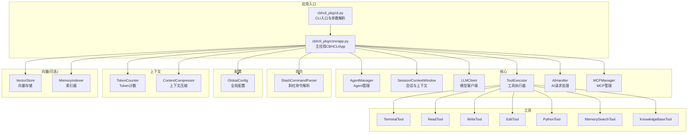
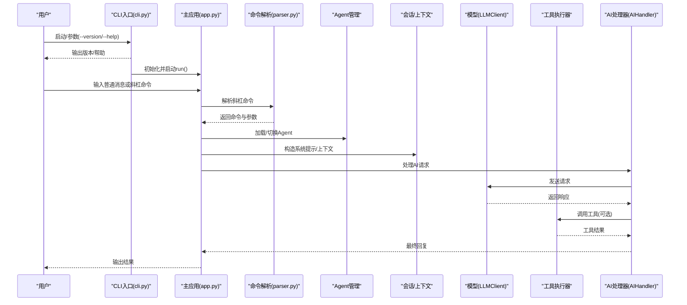
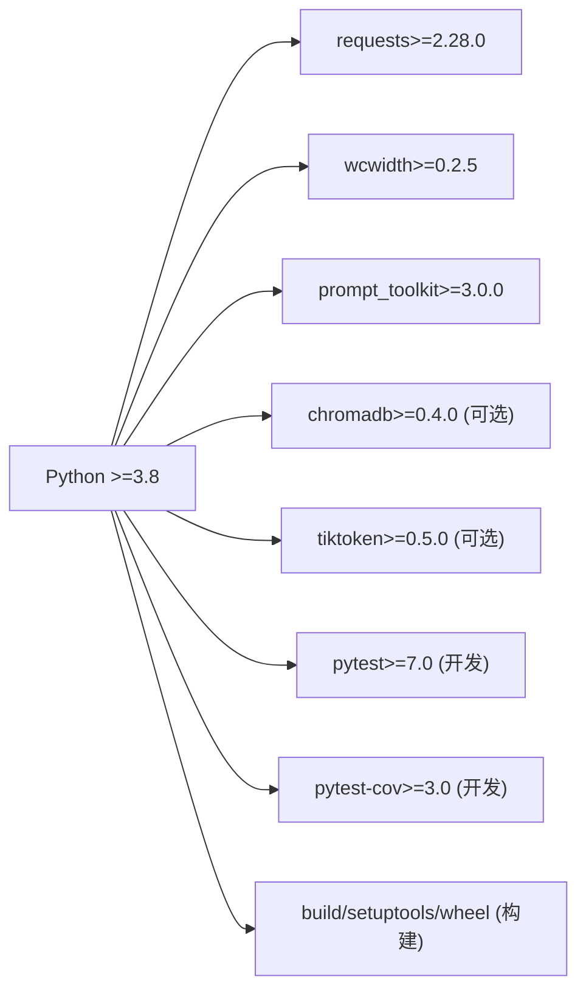

# 贡献指南

<cite>
**本文引用的文件**
- [README.md](file://README.md)
- [INSTALL.md](file://INSTALL.md)
- [requirements.txt](file://requirements.txt)
- [pyproject.toml](file://pyproject.toml)
- [Makefile](file://Makefile)
- [test_v3.py](file://test_v3.py)
- [NEW_FEATURES.md](file://NEW_FEATURES.md)
- [windows使用注意事项.txt](file://windows使用注意事项.txt)
- [cbhcli_pkg/__init__.py](file://cbhcli_pkg/__init__.py)
- [cbhcli_pkg/cli.py](file://cbhcli_pkg/cli.py)
- [cbhcli_pkg/core/app.py](file://cbhcli_pkg/core/app.py)
- [cbhcli_pkg/config/global_config.py](file://cbhcli_pkg/config/global_config.py)
- [cbhcli_pkg/commands/parser.py](file://cbhcli_pkg/commands/parser.py)
- [package.json](file://package.json)
</cite>

## 目录
1. [简介](#简介)
2. [项目结构](#项目结构)
3. [核心组件](#核心组件)
4. [架构总览](#架构总览)
5. [详细组件分析](#详细组件分析)
6. [依赖关系分析](#依赖关系分析)
7. [性能与开发效率建议](#性能与开发效率建议)
8. [故障排查指南](#故障排查指南)
9. [版本发布与变更日志](#版本发布与变更日志)
10. [社区行为准则与沟通渠道](#社区行为准则与沟通渠道)
11. [新贡献者入门与首个PR建议](#新贡献者入门与首个pr建议)
12. [结论](#结论)

## 简介
本指南面向希望参与 CBHCLI 项目的开发者与文档贡献者，涵盖开发环境搭建、代码规范、Git 工作流、代码审查流程、文档贡献方式、问题报告与功能请求模板、版本发布与变更日志维护方法、社区行为准则与沟通渠道，以及新贡献者的入门路径与首个 PR 建议。

## 项目结构
CBHCLI 是一个基于 Python 的 CLI 应用，采用分层模块化设计：
- 核心模块：应用主流程、Agent 管理、会话与上下文、模型与工具执行、MCP 管理等
- 工具模块：终端命令、文件读写/编辑、Python 代码执行、记忆检索、知识库查询等
- 命令模块：斜杠命令解析与注册
- 配置模块：全局配置与设置
- 上下文模块：Token 计数与上下文压缩
- 向量模块：向量存储与索引器（可选）

图表来源
- [cbhcli_pkg/cli.py:73-112](file://cbhcli_pkg/cli.py#L73-L112)
- [cbhcli_pkg/core/app.py:54-280](file://cbhcli_pkg/core/app.py#L54-L280)
- [cbhcli_pkg/commands/parser.py:16-94](file://cbhcli_pkg/commands/parser.py#L16-L94)
- [cbhcli_pkg/config/global_config.py:13-154](file://cbhcli_pkg/config/global_config.py#L13-L154)

章节来源
- [README.md:269-295](file://README.md#L269-L295)
- [NEW_FEATURES.md:65-75](file://NEW_FEATURES.md#L65-L75)

## 核心组件
- CLI 入口与帮助：负责解析 --version/--help 参数，打印帮助与命令列表，并启动主应用
- 主应用 CBHCLIApp：负责初始化配置、工具、向量存储、命令系统、UI、Agent 加载与会话管理；处理用户输入与命令路由
- 配置管理 GlobalConfig：统一管理 ~/.cbhcli 下的配置文件，提供模型、嵌入模型、重排序模型、Agent 与设置的读写接口
- 命令解析器 SlashCommandParser：解析以“/”开头的斜杠命令，注册与执行命令处理器
- 工具系统：终端命令、文件读写/编辑、Python 代码执行、记忆检索、知识库查询等
- 上下文与 Token：Token 计数与上下文压缩，保障模型上下文窗口不超限
- 向量模块（可选）：向量存储与索引器，支持语义检索与重排序

章节来源
- [cbhcli_pkg/cli.py:7-112](file://cbhcli_pkg/cli.py#L7-L112)
- [cbhcli_pkg/core/app.py:54-478](file://cbhcli_pkg/core/app.py#L54-L478)
- [cbhcli_pkg/config/global_config.py:13-154](file://cbhcli_pkg/config/global_config.py#L13-L154)
- [cbhcli_pkg/commands/parser.py:6-94](file://cbhcli_pkg/commands/parser.py#L6-L94)

## 架构总览
CBHCLI 采用“命令驱动 + 工具执行 + 会话上下文”的架构。用户通过 CLI 与斜杠命令交互，主应用根据当前 Agent 与模型配置，委托 AIHandler 处理请求，工具执行器按需调用具体工具，上下文管理器在接近模型上下文上限时进行压缩。

图表来源
- [cbhcli_pkg/cli.py:73-112](file://cbhcli_pkg/cli.py#L73-L112)
- [cbhcli_pkg/core/app.py:386-440](file://cbhcli_pkg/core/app.py#L386-L440)
- [cbhcli_pkg/commands/parser.py:51-78](file://cbhcli_pkg/commands/parser.py#L51-L78)

## 详细组件分析

### CLI 入口与参数解析
- 负责解析 --version 与 --help，打印帮助与命令列表
- 未知参数时输出提示并展示帮助
- 正常启动时实例化主应用并进入交互循环

章节来源
- [cbhcli_pkg/cli.py:7-112](file://cbhcli_pkg/cli.py#L7-L112)

### 主应用 CBHCLIApp
- 初始化配置、工具、向量存储（可选）、命令系统、UI、Agent
- 管理会话生命周期：重置、保存历史、构建系统提示、上下文压缩
- 处理用户输入：优先判断斜杠命令，否则交由 AIHandler 处理
- 支持 MCP 管理与多 Agent 工作空间

章节来源
- [cbhcli_pkg/core/app.py:54-478](file://cbhcli_pkg/core/app.py#L54-L478)

### 命令解析器 SlashCommandParser
- 定义命令结构体，支持注册、解析、执行与帮助生成
- 执行失败时返回错误信息，未知命令提示帮助

章节来源
- [cbhcli_pkg/commands/parser.py:6-94](file://cbhcli_pkg/commands/parser.py#L6-L94)

### 配置管理 GlobalConfig
- 统一配置目录 ~/.cbhcli/config.json
- 提供模型、嵌入模型、重排序模型、Agent 与设置的读写接口
- 默认配置与持久化保存

章节来源
- [cbhcli_pkg/config/global_config.py:13-154](file://cbhcli_pkg/config/global_config.py#L13-L154)

### 工具系统与执行
- 工具注册与执行器解耦，便于扩展
- 工具包括终端命令、文件读写/编辑、Python 代码执行、记忆检索、知识库查询等

章节来源
- [cbhcli_pkg/core/app.py:85-96](file://cbhcli_pkg/core/app.py#L85-L96)

### 上下文与 Token 管理
- Token 计数与上下文窗口监控
- 接近阈值时自动压缩，保障对话稳定性

章节来源
- [cbhcli_pkg/core/app.py:361-385](file://cbhcli_pkg/core/app.py#L361-L385)

### 向量模块（可选）
- 嵌入模型客户端与重排序客户端
- 向量存储与索引器，支持语义检索与知识库查询

章节来源
- [cbhcli_pkg/core/app.py:97-150](file://cbhcli_pkg/core/app.py#L97-L150)

## 依赖关系分析
- Python 版本要求：>=3.8
- 核心依赖：requests、wcwidth、prompt_toolkit
- 可选依赖：chromadb（向量检索）、tiktoken（精确 Token 计数）
- 开发依赖：pytest、pytest-cov
- 构建工具：build、setuptools、wheel
- CLI 入口脚本：cbhcli -> cbhcli_pkg.cli:main

图表来源
- [pyproject.toml:13-42](file://pyproject.toml#L13-L42)
- [requirements.txt:1-7](file://requirements.txt#L1-L7)

章节来源
- [pyproject.toml:13-42](file://pyproject.toml#L13-L42)
- [requirements.txt:1-7](file://requirements.txt#L1-L7)

## 性能与开发效率建议
- 使用开发模式安装与测试，便于快速迭代
- 在本地启用可选依赖（如 chromadb/tiktoken）以提升检索与上下文估算精度
- 使用 Makefile 的 build 与 clean 目标进行打包与清理
- 通过测试脚本验证工具链与会话管理的关键路径

章节来源
- [README.md:297-314](file://README.md#L297-L314)
- [Makefile:1-55](file://Makefile#L1-L55)
- [test_v3.py:1-180](file://test_v3.py#L1-L180)

## 故障排查指南
- Windows 终端颜色/虚拟终端：按需添加注册表项以启用颜色输出
- 命令不可用：确认安装方式与 PATH，必要时使用 --user 标志重装
- 向量功能不可用：确保已配置嵌入模型并手动触发索引

章节来源
- [windows使用注意事项.txt:1-2](file://windows使用注意事项.txt#L1-L2)
- [INSTALL.md:63-69](file://INSTALL.md#L63-L69)
- [README.md:208-229](file://README.md#L208-L229)

## 版本发布与变更日志
- 版本号与元数据：在包元数据中声明版本与作者信息
- 构建与发布：使用构建工具生成源码与轮子包，清理构建产物
- 变更日志维护：建议在版本更新时同步更新 README 或新增变更记录文件，记录重大功能、修复与破坏性变更

章节来源
- [cbhcli_pkg/__init__.py:6-8](file://cbhcli_pkg/__init__.py#L6-L8)
- [pyproject.toml:5-25](file://pyproject.toml#L5-L25)
- [Makefile:13-35](file://Makefile#L13-L35)

## 社区行为准则与沟通渠道
- 行为准则：尊重、包容、建设性反馈
- 沟通渠道：GitHub Issues 用于问题与功能请求；讨论可在社区或项目维护者指定渠道进行

章节来源
- [pyproject.toml:47-50](file://pyproject.toml#L47-L50)

## 新贡献者入门与首个PR建议
- 环境准备：Python >=3.8，创建并激活虚拟环境，安装开发依赖
- 安装方式：开发模式安装，便于本地调试
- 运行测试：执行测试脚本验证工具链与会话管理
- 文档贡献：更新 README/INSTALL/NEW_FEATURES 等文档，保持一致性
- 首个 PR 建议：从修复小问题或改进文档入手，遵循提交信息格式与审查流程

章节来源
- [README.md:300-314](file://README.md#L300-L314)
- [INSTALL.md:10-28](file://INSTALL.md#L10-L28)
- [test_v3.py:162-180](file://test_v3.py#L162-L180)

## Git 工作流程与代码规范

### 开发环境搭建
- Python 版本：>=3.8
- 依赖安装：核心依赖与可选依赖；开发依赖用于测试
- 虚拟环境：推荐使用 venv 创建隔离环境并激活
- 安装方式：开发模式安装，便于本地调试与热更新

章节来源
- [pyproject.toml:13-30](file://pyproject.toml#L13-L30)
- [requirements.txt:1-7](file://requirements.txt#L1-L7)
- [README.md:299-304](file://README.md#L299-L304)

### 代码规范与风格
- Python 版本与语法：遵循 Python 3.8+ 语法特性
- 代码风格：建议遵循 PEP8 基本规范（命名、缩进、空行、行宽等）
- 命名约定：模块与类使用 PascalCase 或下划线命名；函数与变量使用下划线命名；常量使用全大写
- 注释规范：模块与类应有清晰 docstring；复杂逻辑应有简要注释；避免无意义注释
- 导入顺序：标准库、第三方库、项目内部模块分组导入，组间空行分隔

章节来源
- [pyproject.toml:13-25](file://pyproject.toml#L13-L25)
- [cbhcli_pkg/core/app.py:1-50](file://cbhcli_pkg/core/app.py#L1-L50)

### Git 工作流
- 分支策略：采用 main 作为稳定发布分支；功能开发在 feature/* 分支；修复在 hotfix/* 分支
- 提交信息格式：类型(作用域): 描述；正文说明动机与影响；可选关联 Issue 编号
- Pull Request 流程：在 GitHub 上创建 PR，填写模板，至少一名维护者审查通过后合并

章节来源
- [README.md:297-314](file://README.md#L297-L314)

### 代码审查标准与流程
- 审查清单：功能正确性、边界条件、异常处理、性能影响、安全风险、可读性与注释、测试覆盖
- 反馈处理：及时响应评论，逐条回复并修订；必要时补充测试
- 合并要求：通过 CI、至少一名维护者批准、无阻塞性异议

章节来源
- [test_v3.py:1-180](file://test_v3.py#L1-L180)

### 文档贡献方法
- 文档格式：Markdown；标题层级清晰；链接与图片使用相对路径
- 更新流程：在对应文档文件中更新内容，确保与代码一致；必要时更新 README/INSTALL/NEW_FEATURES
- 发布流程：随版本更新发布，保持与版本号一致

章节来源
- [README.md:1-50](file://README.md#L1-L50)
- [INSTALL.md:1-69](file://INSTALL.md#L1-L69)
- [NEW_FEATURES.md:1-76](file://NEW_FEATURES.md#L1-L76)

### Bug 报告与功能请求模板
- Bug 报告模板：环境信息、复现步骤、期望行为、实际行为、日志片段、相关截图
- 功能请求模板：背景、需求描述、期望行为、替代方案、影响范围

章节来源
- [pyproject.toml:47-50](file://pyproject.toml#L47-L50)

## 结论
本指南提供了 CBHCLI 项目的开发环境搭建、代码规范、Git 工作流、代码审查、文档贡献、问题与功能请求模板、版本发布与变更日志维护、社区行为准则与沟通渠道，以及新贡献者的入门路径。建议贡献者在提交代码前先阅读并遵循上述规范，确保协作高效与项目质量。